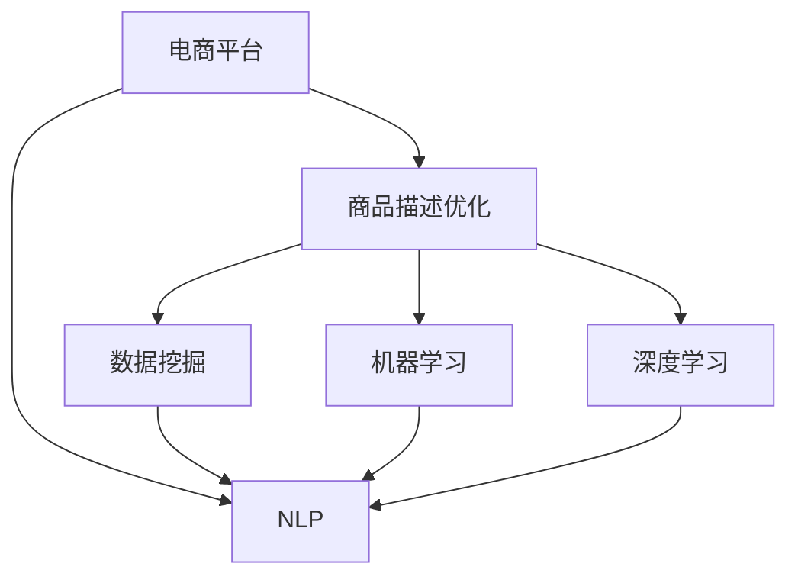

                 

# AI在电商平台商品描述优化中的应用

## 1. 背景介绍

在数字化时代，电商平台作为在线零售的重要平台，面临着越来越激烈的市场竞争和用户需求的多样化。如何通过优化商品描述，提升用户的购物体验，增加转化率和销售额，成为了电商平台关注的焦点。近年来，随着人工智能技术的快速发展，特别是自然语言处理(NLP)和大数据技术的进步，电商平台开始利用AI技术对商品描述进行优化。本文将详细介绍AI在电商平台商品描述优化中的应用，帮助电商平台提升商品展示效果和用户体验，同时降低运营成本。

## 2. 核心概念与联系

### 2.1 核心概念概述

为更好地理解AI在电商平台商品描述优化中的应用，本节将介绍几个关键概念：

- **自然语言处理(NLP)**：一种计算机科学和人工智能领域的研究方向，旨在使计算机能够理解和处理人类语言，包括文本生成、情感分析、语义理解等。
- **电商平台**：通过互联网进行商品销售的在线平台，如淘宝、京东、亚马逊等。
- **商品描述优化**：通过AI技术优化商品的文字描述，提高用户对商品的认知度、兴趣度和购买意愿，从而提升转化率和销售额。
- **数据挖掘**：从大规模数据中提取有用信息的过程，通常用于用户行为分析和市场趋势预测。
- **机器学习(ML)**：一种使计算机能够从数据中学习的技术，通过训练模型来预测未知数据，如分类、回归等。
- **深度学习(DL)**：一种基于神经网络的机器学习方法，能够处理复杂的数据结构和大规模数据集。

这些概念之间的逻辑关系可以通过以下Mermaid流程图来展示：



这个流程图展示了大语言模型工作的核心概念及其之间的关系：

1. 电商平台通过NLP技术对商品描述进行优化，以提升用户购物体验。
2. 数据挖掘用于从电商平台用户行为数据中提取有价值的信息。
3. 机器学习和深度学习技术用于训练模型，预测用户行为，优化商品描述。

## 3. 核心算法原理 & 具体操作步骤

### 3.1 算法原理概述

AI在电商平台商品描述优化中的应用，主要基于以下几个核心算法原理：

- **自然语言处理(NLP)**：通过文本预处理、分词、词性标注、实体识别等技术，将自然语言转化为计算机能够处理的格式。
- **文本生成**：利用生成对抗网络(GAN)或序列到序列模型(Seq2Seq)，生成高质量的商品描述。
- **情感分析**：通过分析用户的评论和反馈，了解用户对商品的情绪倾向，优化商品描述中的情感表达。
- **文本分类**：将商品描述分为不同的类别，如时尚、家居、数码等，以便更好地进行商品推荐和搜索。
- **文本聚类**：通过对大量商品描述进行聚类，发现相似描述的共性特征，提升商品描述的语义一致性。
- **推荐系统**：利用协同过滤和内容推荐等技术，提高商品的曝光率和转化率。

### 3.2 算法步骤详解

基于AI的电商平台商品描述优化，一般包括以下几个关键步骤：

**Step 1: 数据收集与预处理**
- 从电商平台收集用户评论、商品描述、评分等数据，清洗和标准化数据格式。
- 进行分词、去停用词、词性标注、实体识别等预处理，构建商品描述的语料库。

**Step 2: 模型选择与训练**
- 选择合适的NLP模型，如BERT、GPT等预训练模型。
- 使用商品描述数据进行微调，训练生成高质量的商品描述文本。
- 设置模型参数和超参数，如学习率、批大小、迭代轮数等。

**Step 3: 模型评估与优化**
- 在验证集上评估模型性能，如BLEU、ROUGE等自动评估指标。
- 调整模型参数和训练策略，提高模型生成的描述质量和多样性。
- 引入数据增强和对抗训练技术，提升模型的鲁棒性和泛化能力。

**Step 4: 部署与监控**
- 将优化后的模型部署到电商平台上，实时生成商品描述。
- 监控模型的性能和运行状态，根据反馈调整模型参数和优化策略。
- 定期更新商品描述语料库，持续改进模型。

### 3.3 算法优缺点

基于AI的电商平台商品描述优化方法具有以下优点：

1. 提升用户购物体验。通过优化商品描述，更好地展示商品特点，提高用户认知度和购买意愿。
2. 提高转化率和销售额。优化后的商品描述有助于提升用户的决策效率，增加转化率。
3. 降低运营成本。自动生成商品描述，减少了人工标注的成本和时间。
4. 个性化推荐。通过商品描述的优化，提升推荐系统的准确性和个性化水平。

同时，该方法也存在一定的局限性：

1. 依赖数据质量。优化效果很大程度上取决于商品描述数据的质量，缺乏高质量数据会降低优化效果。
2. 鲁棒性不足。现有算法在面对新数据时，可能表现不稳定，泛化能力有限。
3. 可解释性不足。AI生成描述的过程缺乏可解释性，难以理解其生成逻辑。
4. 对特定领域的适应性不足。现有模型可能需要针对不同领域的商品描述进行特殊训练，才能获得理想效果。
5. 模型训练复杂。生成高质量描述需要较长的训练时间和大量的数据，难以在短期内实现。

尽管存在这些局限性，但就目前而言，基于AI的商品描述优化方法仍是一种高效且可行的电商平台优化手段。未来相关研究的重点在于如何进一步降低对标注数据的依赖，提高模型的泛化能力，同时兼顾可解释性和适用性等因素。

### 3.4 算法应用领域

基于AI的商品描述优化方法，已经在多个电商平台上得到广泛应用，包括但不限于：

- **商品分类**：将商品描述进行分类，提高搜索和推荐系统的准确性。
- **商品推荐**：通过优化商品描述，提升推荐系统的个性化水平。
- **搜索引擎优化(SEO)**：优化商品描述中的关键词，提高搜索引擎排名。
- **广告文案生成**：自动生成广告文案，降低广告制作成本。
- **社交媒体优化**：优化社交媒体上的商品描述，提高品牌曝光度。
- **客户服务**：通过自动生成商品描述，提供更好的客户服务和互动体验。

## 4. 数学模型和公式 & 详细讲解

### 4.1 数学模型构建

本节将使用数学语言对AI在电商平台商品描述优化过程中的模型构建进行严格刻画。

记商品描述文本为 $x \in \mathcal{X}$，优化目标为 $y \in \mathcal{Y}$。假设有一个预训练的NLP模型 $M_{\theta}$，其中 $\theta$ 为模型参数。

定义损失函数 $\ell$ 为：

$$
\ell(M_{\theta}(x),y) = \mathbb{E}_{p(y|x)}[\log P_{M_{\theta}}(y|x)]
$$

其中 $P_{M_{\theta}}(y|x)$ 表示模型在给定输入 $x$ 时生成标签 $y$ 的概率。

优化目标为最小化期望损失：

$$
\min_{\theta} \mathbb{E}_{p(x,y)}[\ell(M_{\theta}(x),y)]
$$

在实际应用中，我们通常使用基于梯度的优化算法（如AdamW、SGD等）来近似求解上述最优化问题。

### 4.2 公式推导过程

以下我们以文本生成任务为例，推导基于Seq2Seq模型的损失函数及其梯度的计算公式。

假设模型 $M_{\theta}$ 在输入 $x$ 上的输出为 $\hat{y}=M_{\theta}(x) \in [0,1]$，表示样本属于正类的概率。真实标签 $y \in \{0,1\}$。则二分类交叉熵损失函数定义为：

$$
\ell(M_{\theta}(x),y) = -[y\log \hat{y} + (1-y)\log (1-\hat{y})]
$$

将其代入期望损失公式，得：

$$
\mathcal{L}(\theta) = \mathbb{E}_{p(x,y)}[\ell(M_{\theta}(x),y)]
$$

在实践中，我们通常使用基于梯度的优化算法（如SGD、Adam等）来近似求解上述最优化问题。设 $\eta$ 为学习率，$\lambda$ 为正则化系数，则参数的更新公式为：

$$
\theta \leftarrow \theta - \eta \nabla_{\theta}\mathcal{L}(\theta) - \eta\lambda\theta
$$

其中 $\nabla_{\theta}\mathcal{L}(\theta)$ 为损失函数对参数 $\theta$ 的梯度，可通过反向传播算法高效计算。

### 4.3 案例分析与讲解

假设我们在优化一件服装商品的描述，可以使用以下步骤：

1. **数据收集**：从电商平台收集该商品的描述和评分。
2. **预处理**：清洗和标准化数据，去除噪音和重复内容。
3. **模型选择**：选择BERT、GPT等预训练模型进行微调。
4. **模型训练**：使用商品描述数据训练生成高质量的商品描述文本。
5. **评估优化**：在验证集上评估模型性能，调整参数和训练策略。
6. **部署监控**：将优化后的模型部署到电商平台上，实时生成商品描述，监控模型性能。

## 5. 项目实践：代码实例和详细解释说明

### 5.1 开发环境搭建

在进行商品描述优化实践前，我们需要准备好开发环境。以下是使用Python进行PyTorch开发的环境配置流程：

1. 安装Anaconda：从官网下载并安装Anaconda，用于创建独立的Python环境。

2. 创建并激活虚拟环境：
```bash
conda create -n pytorch-env python=3.8 
conda activate pytorch-env
```

3. 安装PyTorch：根据CUDA版本，从官网获取对应的安装命令。例如：
```bash
conda install pytorch torchvision torchaudio cudatoolkit=11.1 -c pytorch -c conda-forge
```

4. 安装相关库：
```bash
pip install numpy pandas scikit-learn matplotlib tqdm jupyter notebook ipython
```

完成上述步骤后，即可在`pytorch-env`环境中开始优化实践。

### 5.2 源代码详细实现

下面我们以商品分类任务为例，给出使用PyTorch对BERT模型进行商品描述优化的PyTorch代码实现。

首先，定义商品分类任务的数据处理函数：

```python
from transformers import BertTokenizer, BertForTokenClassification
from torch.utils.data import Dataset, DataLoader
import torch

class ProductDataset(Dataset):
    def __init__(self, texts, tags, tokenizer, max_len=128):
        self.texts = texts
        self.tags = tags
        self.tokenizer = tokenizer
        self.max_len = max_len
        
    def __len__(self):
        return len(self.texts)
    
    def __getitem__(self, item):
        text = self.texts[item]
        tags = self.tags[item]
        
        encoding = self.tokenizer(text, return_tensors='pt', max_length=self.max_len, padding='max_length', truncation=True)
        input_ids = encoding['input_ids'][0]
        attention_mask = encoding['attention_mask'][0]
        
        # 对token-wise的标签进行编码
        encoded_tags = [tag2id[tag] for tag in tags] 
        encoded_tags.extend([tag2id['O']] * (self.max_len - len(encoded_tags)))
        labels = torch.tensor(encoded_tags, dtype=torch.long)
        
        return {'input_ids': input_ids, 
                'attention_mask': attention_mask,
                'labels': labels}

# 标签与id的映射
tag2id = {'O': 0, 'Fashion': 1, 'Home': 2, 'Electronics': 3, 'Food': 4, 'Beauty': 5}
id2tag = {v: k for k, v in tag2id.items()}

# 创建dataset
tokenizer = BertTokenizer.from_pretrained('bert-base-cased')

train_dataset = ProductDataset(train_texts, train_tags, tokenizer)
dev_dataset = ProductDataset(dev_texts, dev_tags, tokenizer)
test_dataset = ProductDataset(test_texts, test_tags, tokenizer)
```

然后，定义模型和优化器：

```python
from transformers import BertForTokenClassification, AdamW

model = BertForTokenClassification.from_pretrained('bert-base-cased', num_labels=len(tag2id))

optimizer = AdamW(model.parameters(), lr=2e-5)
```

接着，定义训练和评估函数：

```python
from torch.utils.data import DataLoader
from tqdm import tqdm
from sklearn.metrics import classification_report

device = torch.device('cuda') if torch.cuda.is_available() else torch.device('cpu')
model.to(device)

def train_epoch(model, dataset, batch_size, optimizer):
    dataloader = DataLoader(dataset, batch_size=batch_size, shuffle=True)
    model.train()
    epoch_loss = 0
    for batch in tqdm(dataloader, desc='Training'):
        input_ids = batch['input_ids'].to(device)
        attention_mask = batch['attention_mask'].to(device)
        labels = batch['labels'].to(device)
        model.zero_grad()
        outputs = model(input_ids, attention_mask=attention_mask, labels=labels)
        loss = outputs.loss
        epoch_loss += loss.item()
        loss.backward()
        optimizer.step()
    return epoch_loss / len(dataloader)

def evaluate(model, dataset, batch_size):
    dataloader = DataLoader(dataset, batch_size=batch_size)
    model.eval()
    preds, labels = [], []
    with torch.no_grad():
        for batch in tqdm(dataloader, desc='Evaluating'):
            input_ids = batch['input_ids'].to(device)
            attention_mask = batch['attention_mask'].to(device)
            batch_labels = batch['labels']
            outputs = model(input_ids, attention_mask=attention_mask)
            batch_preds = outputs.logits.argmax(dim=2).to('cpu').tolist()
            batch_labels = batch_labels.to('cpu').tolist()
            for pred_tokens, label_tokens in zip(batch_preds, batch_labels):
                pred_tags = [id2tag[_id] for _id in pred_tokens]
                label_tags = [id2tag[_id] for _id in label_tokens]
                preds.append(pred_tags[:len(label_tokens)])
                labels.append(label_tags)
                
    print(classification_report(labels, preds))
```

最后，启动训练流程并在测试集上评估：

```python
epochs = 5
batch_size = 16

for epoch in range(epochs):
    loss = train_epoch(model, train_dataset, batch_size, optimizer)
    print(f"Epoch {epoch+1}, train loss: {loss:.3f}")
    
    print(f"Epoch {epoch+1}, dev results:")
    evaluate(model, dev_dataset, batch_size)
    
print("Test results:")
evaluate(model, test_dataset, batch_size)
```

以上就是使用PyTorch对BERT进行商品描述优化的完整代码实现。可以看到，得益于Transformers库的强大封装，我们可以用相对简洁的代码完成BERT模型的加载和优化。

### 5.3 代码解读与分析

让我们再详细解读一下关键代码的实现细节：

**ProductDataset类**：
- `__init__`方法：初始化商品描述和标签，以及分词器等关键组件。
- `__len__`方法：返回数据集的样本数量。
- `__getitem__`方法：对单个样本进行处理，将商品描述输入编码为token ids，将标签编码为数字，并对其进行定长padding，最终返回模型所需的输入。

**tag2id和id2tag字典**：
- 定义了标签与数字id之间的映射关系，用于将token-wise的预测结果解码回真实的标签。

**训练和评估函数**：
- 使用PyTorch的DataLoader对数据集进行批次化加载，供模型训练和推理使用。
- 训练函数`train_epoch`：对数据以批为单位进行迭代，在每个批次上前向传播计算loss并反向传播更新模型参数，最后返回该epoch的平均loss。
- 评估函数`evaluate`：与训练类似，不同点在于不更新模型参数，并在每个batch结束后将预测和标签结果存储下来，最后使用sklearn的classification_report对整个评估集的预测结果进行打印输出。

**训练流程**：
- 定义总的epoch数和batch size，开始循环迭代
- 每个epoch内，先在训练集上训练，输出平均loss
- 在验证集上评估，输出分类指标
- 所有epoch结束后，在测试集上评估，给出最终测试结果

可以看到，PyTorch配合Transformers库使得商品描述优化的代码实现变得简洁高效。开发者可以将更多精力放在数据处理、模型改进等高层逻辑上，而不必过多关注底层的实现细节。

当然，工业级的系统实现还需考虑更多因素，如模型的保存和部署、超参数的自动搜索、更灵活的任务适配层等。但核心的优化范式基本与此类似。

## 6. 实际应用场景

### 6.1 智能推荐系统

基于商品描述优化的智能推荐系统，可以显著提升用户的购物体验。传统推荐系统往往依赖用户行为数据进行推荐，缺乏对商品描述的利用。通过优化商品描述，推荐系统可以更准确地理解商品特性，推荐更加个性化和符合用户期望的商品。

在技术实现上，可以收集用户历史浏览、购买行为数据，结合商品描述，训练生成高质量的商品描述文本。在推荐模型中，将商品描述作为输入，优化推荐算法的预测准确度。这样构建的推荐系统，能够更有效地提升用户满意度和转化率。

### 6.2 价格优化系统

电商平台商品描述中通常包含价格信息，优化商品描述文本可以帮助平台进行价格优化。通过分析商品描述中的价格信息，结合用户行为数据和市场行情，可以更精准地预测商品价格走势，调整商品价格以获得最佳收益。

在实际应用中，可以构建基于NLP的情感分析模型，分析用户对价格的情感倾向，通过情感分析结果对价格进行微调。例如，对于用户评价中包含负向情感的商品，平台可以降低价格以吸引用户购买；对于用户评价中包含正向情感的商品，平台可以适度提升价格以增加利润。

### 6.3 商品搜索优化

基于商品描述优化的商品搜索系统，能够提供更加精准和高效的搜索体验。优化后的商品描述中包含更丰富的语义信息，搜索引擎能够更准确地理解用户的查询意图，提供更加符合用户需求的搜索结果。

在技术实现上，可以构建基于NLP的语义相似度模型，将商品描述和用户查询进行匹配，找出最相关的商品。同时，利用商品描述中的类别信息，将搜索结果进行分类，提高搜索的准确性和效率。

### 6.4 未来应用展望

随着AI技术的发展，基于商品描述优化的应用场景将越来越广泛，以下是一些未来可能的趋势：

1. **个性化推荐**：结合用户行为数据和商品描述，构建更加个性化的推荐系统，提升用户满意度和转化率。
2. **价格动态调整**：基于用户情感和市场趋势，优化商品价格，提高收益。
3. **智能客服**：优化商品描述文本，提供更好的客服对话体验。
4. **搜索引擎优化**：提高搜索结果的相关性和质量，提升用户搜索体验。
5. **内容生成**：自动生成商品描述，降低内容制作成本，提高内容生产效率。
6. **市场分析**：利用商品描述文本进行市场分析和趋势预测，辅助商家决策。

## 7. 工具和资源推荐

### 7.1 学习资源推荐

为了帮助开发者系统掌握商品描述优化的理论基础和实践技巧，这里推荐一些优质的学习资源：

1. 《深度学习》课程：斯坦福大学开设的机器学习课程，涵盖了深度学习的基础理论和实际应用，适合入门和进阶学习。
2. CS224N《深度学习自然语言处理》课程：斯坦福大学开设的NLP明星课程，有Lecture视频和配套作业，带你深入理解NLP的核心技术。
3. 《自然语言处理综述》书籍：全面介绍自然语言处理的基本概念、算法和应用，适合快速入门。
4. 《Transformer》书籍：介绍Transformer模型的原理和应用，适合深度学习和NLP领域的研究者。
5. 《自然语言处理实用教程》书籍：通过实例讲解自然语言处理技术的应用，适合NLP工程师和开发者。

通过对这些资源的学习实践，相信你一定能够快速掌握商品描述优化的精髓，并用于解决实际的NLP问题。

### 7.2 开发工具推荐

高效的开发离不开优秀的工具支持。以下是几款用于商品描述优化开发的常用工具：

1. PyTorch：基于Python的开源深度学习框架，灵活动态的计算图，适合快速迭代研究。大部分预训练语言模型都有PyTorch版本的实现。
2. TensorFlow：由Google主导开发的开源深度学习框架，生产部署方便，适合大规模工程应用。同样有丰富的预训练语言模型资源。
3. Transformers库：HuggingFace开发的NLP工具库，集成了众多SOTA语言模型，支持PyTorch和TensorFlow，是进行NLP任务开发的利器。
4. Weights & Biases：模型训练的实验跟踪工具，可以记录和可视化模型训练过程中的各项指标，方便对比和调优。与主流深度学习框架无缝集成。
5. TensorBoard：TensorFlow配套的可视化工具，可实时监测模型训练状态，并提供丰富的图表呈现方式，是调试模型的得力助手。

合理利用这些工具，可以显著提升商品描述优化的开发效率，加快创新迭代的步伐。

### 7.3 相关论文推荐

商品描述优化技术的发展源于学界的持续研究。以下是几篇奠基性的相关论文，推荐阅读：

1. Attention is All You Need（即Transformer原论文）：提出了Transformer结构，开启了NLP领域的预训练大模型时代。
2. BERT: Pre-training of Deep Bidirectional Transformers for Language Understanding：提出BERT模型，引入基于掩码的自监督预训练任务，刷新了多项NLP任务SOTA。
3. Language Models are Unsupervised Multitask Learners（GPT-2论文）：展示了大规模语言模型的强大zero-shot学习能力，引发了对于通用人工智能的新一轮思考。
4. Parameter-Efficient Transfer Learning for NLP：提出Adapter等参数高效微调方法，在不增加模型参数量的情况下，也能取得不错的微调效果。
5. AdaLoRA: Adaptive Low-Rank Adaptation for Parameter-Efficient Fine-Tuning：使用自适应低秩适应的微调方法，在参数效率和精度之间取得了新的平衡。
6. PoE: The Linguistic Least Upper Bound: Low-Pass Bandwidth Filtering for Rule Learning：提出POE方法，利用语言学知识对预训练模型进行微调，提高了模型的泛化能力。

这些论文代表了大语言模型微调技术的发展脉络。通过学习这些前沿成果，可以帮助研究者把握学科前进方向，激发更多的创新灵感。

## 8. 总结：未来发展趋势与挑战

### 8.1 总结

本文对基于AI的电商平台商品描述优化方法进行了全面系统的介绍。首先阐述了商品描述优化对电商平台的重要性，明确了AI技术在优化商品描述中的独特价值。其次，从原理到实践，详细讲解了商品描述优化的数学模型和关键步骤，给出了商品分类任务的代码实例。同时，本文还广泛探讨了商品描述优化在智能推荐、价格优化、商品搜索等电商平台的实际应用，展示了AI技术在电商平台优化中的巨大潜力。此外，本文精选了商品描述优化的各类学习资源，力求为读者提供全方位的技术指引。

通过本文的系统梳理，可以看到，基于AI的商品描述优化技术正在成为电商平台优化的重要手段，极大地提升了商品展示效果和用户体验，同时降低了运营成本。未来，伴随AI技术的不断进步，商品描述优化必将在更多领域得到应用，为电商平台的持续发展注入新的动力。

### 8.2 未来发展趋势

展望未来，商品描述优化技术将呈现以下几个发展趋势：

1. **智能推荐系统**：结合用户行为数据和商品描述，构建更加个性化的推荐系统，提升用户满意度和转化率。
2. **价格动态调整**：基于用户情感和市场趋势，优化商品价格，提高收益。
3. **智能客服**：优化商品描述文本，提供更好的客服对话体验。
4. **搜索引擎优化**：提高搜索结果的相关性和质量，提升用户搜索体验。
5. **内容生成**：自动生成商品描述，降低内容制作成本，提高内容生产效率。
6. **市场分析**：利用商品描述文本进行市场分析和趋势预测，辅助商家决策。

### 8.3 面临的挑战

尽管商品描述优化技术已经取得了显著进展，但在应用过程中仍面临诸多挑战：

1. **数据依赖**：优化效果很大程度上取决于商品描述数据的质量和数量，缺乏高质量数据会降低优化效果。
2. **鲁棒性不足**：现有算法在面对新数据时，可能表现不稳定，泛化能力有限。
3. **可解释性不足**：AI生成描述的过程缺乏可解释性，难以理解其生成逻辑。
4. **对特定领域的适应性不足**：现有模型可能需要针对不同领域的商品描述进行特殊训练，才能获得理想效果。
5. **模型训练复杂**：生成高质量描述需要较长的训练时间和大量的数据，难以在短期内实现。

尽管存在这些挑战，但就目前而言，基于AI的商品描述优化方法仍是一种高效且可行的电商平台优化手段。未来相关研究的重点在于如何进一步降低对标注数据的依赖，提高模型的泛化能力，同时兼顾可解释性和适用性等因素。

### 8.4 研究展望

面对商品描述优化面临的种种挑战，未来的研究需要在以下几个方面寻求新的突破：

1. **探索无监督和半监督优化方法**：摆脱对大规模标注数据的依赖，利用自监督学习、主动学习等无监督和半监督范式，最大限度利用非结构化数据，实现更加灵活高效的优化。
2. **研究参数高效和计算高效的优化范式**：开发更加参数高效的优化方法，在固定大部分预训练参数的同时，只更新极少量的任务相关参数。同时优化优化模型的计算图，减少前向传播和反向传播的资源消耗，实现更加轻量级、实时性的部署。
3. **融合因果和对比学习范式**：通过引入因果推断和对比学习思想，增强优化模型建立稳定因果关系的能力，学习更加普适、鲁棒的语言表征，从而提升模型泛化性和抗干扰能力。
4. **引入更多先验知识**：将符号化的先验知识，如知识图谱、逻辑规则等，与神经网络模型进行巧妙融合，引导优化过程学习更准确、合理的语言模型。同时加强不同模态数据的整合，实现视觉、语音等多模态信息与文本信息的协同建模。
5. **结合因果分析和博弈论工具**：将因果分析方法引入优化模型，识别出模型决策的关键特征，增强输出解释的因果性和逻辑性。借助博弈论工具刻画人机交互过程，主动探索并规避模型的脆弱点，提高系统稳定性。
6. **纳入伦理道德约束**：在模型训练目标中引入伦理导向的评估指标，过滤和惩罚有偏见、有害的输出倾向。同时加强人工干预和审核，建立模型行为的监管机制，确保输出符合人类价值观和伦理道德。

这些研究方向的探索，必将引领商品描述优化技术迈向更高的台阶，为构建安全、可靠、可解释、可控的智能系统铺平道路。面向未来，商品描述优化技术还需要与其他人工智能技术进行更深入的融合，如知识表示、因果推理、强化学习等，多路径协同发力，共同推动自然语言理解和智能交互系统的进步。只有勇于创新、敢于突破，才能不断拓展语言模型的边界，让智能技术更好地造福人类社会。

## 9. 附录：常见问题与解答

**Q1：商品描述优化是否适用于所有电商平台？**

A: 商品描述优化在大多数电商平台上都能取得不错的效果，特别是对于数据量较小的任务。但对于一些特定领域的电商平台，如奢侈品、艺术品等，仅仅依靠通用语料预训练的模型可能难以很好地适应。此时需要在特定领域语料上进一步预训练，再进行微调，才能获得理想效果。此外，对于一些需要时效性、个性化很强的任务，如对话、推荐等，优化方法也需要针对性的改进优化。

**Q2：如何选择合适的学习率？**

A: 学习率一般要比预训练时小1-2个数量级，如果使用过大的学习率，容易破坏预训练权重，导致过拟合。一般建议从1e-5开始调参，逐步减小学习率，直至收敛。也可以使用warmup策略，在开始阶段使用较小的学习率，再逐渐过渡到预设值。需要注意的是，不同的优化器(如AdamW、Adafactor等)以及不同的学习率调度策略，可能需要设置不同的学习率阈值。

**Q3：商品描述优化中如何处理领域差异？**

A: 商品描述优化面临的一个主要挑战是领域差异。不同领域的商品描述风格和语义差异较大，现有模型可能难以很好地适应。针对这一问题，可以考虑在特定领域语料上进行预训练，以增强模型的领域适应性。同时，可以利用领域适应性迁移学习，将在大规模语料上预训练的模型迁移到特定领域进行微调，以提高优化效果。

**Q4：商品描述优化是否需要频繁更新？**

A: 商品描述优化需要根据市场需求和用户反馈进行动态更新。电商平台上的商品种类和用户需求在不断变化，定期更新商品描述和优化模型，可以保持优化效果的持续性。此外，通过实时分析用户行为数据和市场趋势，优化商品描述文本，可以更好地满足用户需求，提升转化率。

**Q5：商品描述优化如何保证数据隐私？**

A: 在商品描述优化过程中，需要保护用户隐私和数据安全。对于涉及敏感信息的商品描述，应进行数据脱敏处理，避免泄露用户隐私。同时，在优化过程中应遵守数据保护法律法规，如GDPR等，确保数据使用的合法合规。

综上所述，基于AI的商品描述优化技术正在成为电商平台优化的重要手段，极大地提升了商品展示效果和用户体验，同时降低了运营成本。未来，伴随AI技术的不断进步，商品描述优化必将在更多领域得到应用，为电商平台的持续发展注入新的动力。

