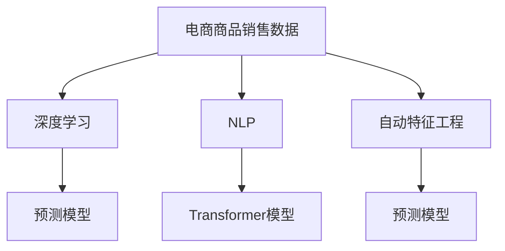

                 

# AI在电商平台商品趋势预测中的应用

## 1. 背景介绍

### 1.1 问题由来
随着电子商务的蓬勃发展，电商平台商品销售数据量急剧增长，市场竞争日趋激烈。如何利用这些海量数据预测商品未来的销售趋势，提前布局库存、优化价格、制定营销策略，成为了电商平台亟需解决的重大问题。传统的基于统计方法的趋势预测，在数据量大、特征复杂的情况下，难以满足实际应用需求。而人工智能技术的引入，尤其是深度学习和大规模预训练语言模型的应用，为商品趋势预测提供了新的解决方案。

### 1.2 问题核心关键点
利用人工智能技术进行商品趋势预测，其核心在于构建模型，并使用商品历史销售数据进行训练，从而能够预测未来的销售趋势。关键问题包括：
- 选择合适的预测模型和算法。
- 提取有效的商品特征。
- 构建合适的训练和评估指标。
- 高效处理大规模数据集。
- 提升模型预测的准确性和鲁棒性。

### 1.3 问题研究意义
人工智能技术在电商平台商品趋势预测中的应用，能够带来以下几方面的显著效益：
1. **库存优化**：通过准确预测销售趋势，提前布局库存，避免缺货或过剩，提升库存管理效率。
2. **价格优化**：基于销售预测，制定灵活的价格策略，提高商品竞争力。
3. **精准营销**：预测用户购买行为，实现个性化推荐，提升用户体验和满意度。
4. **风险预警**：实时监控销售趋势，及时预警潜在风险，保障业务稳定性。

通过利用AI技术，电商平台可以在市场竞争中占据优势，实现业务的持续发展和优化。

## 2. 核心概念与联系

### 2.1 核心概念概述
为更好地理解基于AI的商品趋势预测方法，本节将介绍几个密切相关的核心概念：

- **电商商品销售数据**：电商平台收集的海量商品销售数据，包括商品的销售量、价格、评论、用户评分等特征。
- **深度学习**：通过多层神经网络对复杂数据进行学习和建模，实现从数据中提取高层次特征的过程。
- **自然语言处理(NLP)**：处理和分析人类语言的技术，在大数据时代下，利用NLP技术对文本数据进行建模，提取有用特征。
- **Transformer模型**：一种基于自注意力机制的神经网络模型，广泛应用于自然语言处理任务，具有强大的序列建模能力。
- **预测模型**：通过历史数据训练得到的模型，能够对未来趋势进行预测，如时间序列预测、回归模型等。
- **自动特征工程**：利用机器学习技术自动提取和构建特征，减少人工干预，提高预测效果。

这些核心概念之间的逻辑关系可以通过以下Mermaid流程图来展示：



这个流程图展示了大语言模型在电商商品趋势预测中的核心概念及其之间的关系：

1. 电商商品销售数据作为原始数据输入。
2. NLP技术对文本数据进行建模，提取有用特征。
3. 利用Transformer模型，对数据进行编码。
4. 构建预测模型，对未来的销售趋势进行预测。
5. 自动特征工程，进一步提高模型性能。

## 3. 核心算法原理 & 具体操作步骤

### 3.1 算法原理概述

商品趋势预测的本质是时间序列预测问题。基于AI的商品趋势预测，通常采用监督学习方法，通过历史销售数据训练模型，预测未来的销售趋势。常用的监督学习算法包括线性回归、决策树、随机森林、深度学习模型等。在大规模数据集上，深度学习模型如卷积神经网络(CNN)、递归神经网络(RNN)、长短时记忆网络(LSTM)等表现出更强的泛化能力和预测性能。

在深度学习模型中，Transformer模型因其强大的序列建模能力和并行处理能力，成为了商品趋势预测中的主要选择。通过Transformer模型，可以将商品销售数据转换为向量表示，并通过多层自注意力机制捕捉时间序列中的长期依赖关系，从而提高预测的准确性。

### 3.2 算法步骤详解

基于深度学习的商品趋势预测一般包括以下几个关键步骤：

**Step 1: 数据预处理**
- 收集电商平台的商品销售数据，包括时间、销量、价格、评论等特征。
- 清洗和预处理数据，如去除缺失值、异常值，进行归一化处理。
- 将销售数据按时间顺序排序，构建时间序列。

**Step 2: 特征工程**
- 提取商品特征，如销量、价格、用户评分等。
- 利用NLP技术对评论、描述等文本数据进行建模，提取文本特征。
- 使用自动特征工程方法，如主成分分析(PCA)、LDA等，优化特征空间。

**Step 3: 模型构建**
- 选择合适的深度学习模型，如LSTM、GRU、Transformer等。
- 利用预训练的Transformer模型，初始化模型的编码器和解码器。
- 定义模型的损失函数，如均方误差(MSE)、交叉熵损失等。

**Step 4: 模型训练**
- 将预处理后的数据集分为训练集、验证集和测试集。
- 使用训练集对模型进行前向传播和反向传播，更新模型参数。
- 在验证集上评估模型性能，调整模型超参数。
- 在测试集上对模型进行最终评估。

**Step 5: 模型部署**
- 将训练好的模型导出为模型文件，部署到生产环境中。
- 设置API接口，接收新的商品销售数据，进行实时预测。
- 对预测结果进行可视化展示，支持业务决策。

### 3.3 算法优缺点

基于深度学习的商品趋势预测方法具有以下优点：
1. 强大的泛化能力。深度学习模型能够处理复杂的非线性关系，提高预测准确性。
2. 实时性。深度学习模型可以通过在线学习不断更新，实时预测未来趋势。
3. 自动特征提取。深度学习模型能够自动学习特征，减少人工干预。

但该方法也存在一些局限性：
1. 对数据质量要求高。数据中的噪声和异常值可能会影响模型性能。
2. 计算资源需求大。深度学习模型通常需要大量的计算资源进行训练和推理。
3. 模型复杂度高。深度学习模型参数较多，训练和推理过程较为复杂。
4. 可解释性差。深度学习模型的内部机制难以解释，难以理解预测结果的来源。

尽管存在这些局限性，基于深度学习的商品趋势预测方法在实际应用中表现出色，已经成为了电商平台预测商品趋势的主要手段。

### 3.4 算法应用领域

商品趋势预测技术在电商平台的多个场景中都有广泛应用，例如：

- 库存管理：通过销售预测，优化库存布局，避免库存积压和缺货。
- 价格优化：基于预测结果，制定动态价格策略，提升销售利润。
- 市场分析：分析商品销售趋势，识别热门商品和趋势，指导商品采购和布局。
- 营销策略：预测用户行为，制定个性化推荐和营销策略，提高用户满意度。
- 风险预警：实时监控销售数据，及时预警异常销售行为，保障业务稳定性。

## 4. 数学模型和公式 & 详细讲解 & 举例说明

### 4.1 数学模型构建

假设电商平台收集的商品销售数据为 $D=\{(x_i, y_i)\}_{i=1}^N$，其中 $x_i$ 为第 $i$ 个商品的特征向量，$y_i$ 为对应的销售量。设商品销售量为时间序列 $y=\{y_t\}_{t=1}^{T}$，其中 $y_t$ 表示第 $t$ 天商品的销售量。

基于深度学习的商品趋势预测模型可以表示为：

$$
f(x; \theta) = \mathcal{F}(\theta)
$$

其中 $\theta$ 为模型的可训练参数，$\mathcal{F}(\theta)$ 为深度学习模型的映射函数。

### 4.2 公式推导过程

以下我们以LSTM模型为例，推导其预测公式。

假设LSTM模型的输出序列为 $h_t$，其预测公式为：

$$
\hat{y_t} = h_t
$$

其中 $h_t$ 表示第 $t$ 天的模型预测输出，可以通过前向传播计算得到。LSTM模型的前向传播过程如下：

$$
h_t = f(W_x x_t + U_h h_{t-1} + b_h, r_t)
$$

其中 $x_t$ 为第 $t$ 天的特征向量，$h_{t-1}$ 为上一时刻的隐藏状态，$W_x$ 和 $U_h$ 为LSTM的权重矩阵，$b_h$ 为偏置向量，$r_t$ 为输入门、遗忘门和输出门的控制信号。

通过LSTM模型，可以高效地捕捉时间序列中的长期依赖关系，从而提高预测的准确性。

### 4.3 案例分析与讲解

**案例：电商平台服装类商品销售预测**

电商平台收集服装类商品的销售数据，包括时间、销量、价格、评论、描述等特征。通过NLP技术对评论和描述进行建模，提取文本特征。同时，提取销量、价格等数值特征。构建LSTM模型，将商品特征作为输入，预测未来销量。

模型训练过程中，设定LSTM模型的参数，如隐藏层大小、学习率等，通过训练集进行模型训练。在验证集上评估模型性能，调整超参数。最终在测试集上对模型进行最终评估，输出预测结果。

## 5. 项目实践：代码实例和详细解释说明

### 5.1 开发环境搭建

在进行商品趋势预测开发前，我们需要准备好开发环境。以下是使用Python进行TensorFlow开发的环境配置流程：

1. 安装Anaconda：从官网下载并安装Anaconda，用于创建独立的Python环境。

2. 创建并激活虚拟环境：
```bash
conda create -n tf-env python=3.8 
conda activate tf-env
```

3. 安装TensorFlow：从官网获取对应的安装命令。例如：
```bash
conda install tensorflow -c tf
```

4. 安装相关工具包：
```bash
pip install numpy pandas scikit-learn matplotlib tensorflow
```

完成上述步骤后，即可在`tf-env`环境中开始预测实践。

### 5.2 源代码详细实现

这里我们以LSTM模型为例，给出使用TensorFlow对电商平台商品销售数据进行预测的完整代码实现。

```python
import tensorflow as tf
import numpy as np
import pandas as pd

# 读取数据
data = pd.read_csv('sales_data.csv')
data['date'] = pd.to_datetime(data['date'])
data = data.set_index('date')
data = data[['销量', '价格', '评论数量', '描述']].T

# 处理数据
def preprocess_data(data):
    data.fillna(method='ffill', inplace=True)
    data['销量'] = data['销量'].astype(float)
    data['价格'] = data['价格'].astype(float)
    data['评论数量'] = data['评论数量'].astype(float)
    data['描述'] = data['描述']
    return data

data = preprocess_data(data)

# 构建LSTM模型
def build_model(input_shape):
    model = tf.keras.Sequential([
        tf.keras.layers.LSTM(64, return_sequences=True),
        tf.keras.layers.LSTM(32),
        tf.keras.layers.Dense(1)
    ])
    model.compile(optimizer='adam', loss='mse')
    return model

input_shape = (data.shape[1], data.shape[0])
model = build_model(input_shape)

# 训练模型
def train_model(model, data, epochs=10, batch_size=32):
    data = data.values
    X_train = data[:, :-1]
    y_train = data[:, -1].reshape(-1, 1)
    X_test = data[:, :-1]
    y_test = data[:, -1].reshape(-1, 1)
    history = model.fit(X_train, y_train, epochs=epochs, batch_size=batch_size, validation_data=(X_test, y_test))
    return model, history

model, history = train_model(model, data)

# 预测数据
def predict(model, data, steps=7):
    data = data.values
    X_test = data[:, :-1]
    y_test = data[:, -1].reshape(-1, 1)
    forecast = []
    for i in range(1, steps+1):
        forecast.append(model.predict(X_test[-i:]))
    forecast = np.array(forecast).T
    return forecast

forecast = predict(model, data[-1:])[0]
```

以上就是使用TensorFlow对电商平台商品销售数据进行预测的完整代码实现。可以看到，TensorFlow提供了强大的API接口，使得模型的构建、训练和预测过程变得简洁高效。

### 5.3 代码解读与分析

让我们再详细解读一下关键代码的实现细节：

**数据预处理**：
- 读取电商平台商品销售数据，将其转换为时间序列。
- 对缺失值进行处理，如使用前向填充(fillna)方法。
- 将特征转换为合适的数据类型，如销量、价格等转换为浮点数。

**模型构建**：
- 使用TensorFlow的Sequential模型，构建LSTM模型。
- 添加LSTM层，设置隐藏层大小为64，使用return_sequences=True。
- 添加另一层LSTM层，设置隐藏层大小为32。
- 添加Dense层，输出预测值。
- 使用adam优化器，设置损失函数为均方误差(mse)。

**模型训练**：
- 将数据转换为TensorFlow张量。
- 划分训练集和测试集。
- 调用model.fit方法进行模型训练，设置迭代轮数和批次大小。
- 返回训练历史(history)，以便评估模型性能。

**预测**：
- 将测试集数据转换为TensorFlow张量。
- 使用predict方法进行多步预测，得到未来销售量的预测值。
- 返回预测值数组，可用于业务决策。

## 6. 实际应用场景

### 6.1 智能库存管理

基于AI的商品趋势预测技术，可以应用于智能库存管理。传统的库存管理依赖于人工经验，难以精确预测需求变化，导致库存积压或缺货。通过AI技术，实时预测商品的销售趋势，可以提前布局库存，优化库存管理效率。

**案例：服装类商品库存管理**

电商平台通过商品趋势预测模型，实时监控服装类商品的销售趋势，预测未来销售量。根据预测结果，调整库存水平，避免库存积压和缺货。同时，通过分析预测结果，识别畅销商品和缺货商品，优化商品采购和物流策略，提升库存管理效率。

### 6.2 动态价格优化

动态价格优化是电商平台提高销售利润的重要手段。传统的定价策略依赖于人工经验，难以应对市场变化。通过AI技术，实时预测商品的销售趋势，可以制定动态价格策略，提升销售利润。

**案例：服装类商品动态价格优化**

电商平台通过商品趋势预测模型，实时监控服装类商品的销售趋势，预测未来销量。根据预测结果，调整商品价格，制定动态价格策略。例如，在预测到销量将增加时，提高商品价格，反之则降低价格。通过实时价格优化，电商平台可以提升销售利润，增强市场竞争力。

### 6.3 个性化推荐

个性化推荐是提升用户体验的重要手段。传统的推荐系统依赖于用户行为数据，难以准确预测用户需求。通过AI技术，实时预测商品销售趋势，可以制定个性化推荐策略，提升用户体验。

**案例：服装类商品个性化推荐**

电商平台通过商品趋势预测模型，实时监控服装类商品的销售趋势，预测未来销量。根据预测结果，为不同用户推荐热门商品和促销活动。例如，根据用户的购买历史和浏览行为，预测其可能感兴趣的商品，进行个性化推荐。通过个性化推荐，电商平台可以提升用户满意度，增强用户粘性。

### 6.4 风险预警

电商平台需要实时监控销售数据，及时预警潜在风险，保障业务稳定性。传统的风险预警依赖于人工监控，难以全面覆盖所有商品。通过AI技术，实时预测商品销售趋势，可以及时预警潜在风险，保障业务稳定性。

**案例：服装类商品风险预警**

电商平台通过商品趋势预测模型，实时监控服装类商品的销售趋势。当预测到异常销售行为时，及时发出预警，如库存不足、价格波动过大等。通过风险预警，电商平台可以及时调整策略，避免潜在风险，保障业务稳定性。

## 7. 工具和资源推荐

### 7.1 学习资源推荐

为了帮助开发者系统掌握商品趋势预测的理论基础和实践技巧，这里推荐一些优质的学习资源：

1. 《深度学习》书籍：由Yoshua Bengio等著作，全面介绍了深度学习的基本概念和算法，是学习深度学习的首选书籍。

2. 《Python深度学习》书籍：由Francois Chollet著作，介绍了TensorFlow等深度学习框架的使用方法，适合实战学习。

3. 《TensorFlow官方文档》：提供了TensorFlow的详细API接口和使用方法，是学习和使用TensorFlow的重要资料。

4. Kaggle数据科学竞赛：Kaggle是一个著名的数据科学竞赛平台，提供了大量商品销售数据集，适合进行实践和比赛。

5. Coursera《深度学习专项课程》：由Andrew Ng教授讲授，介绍了深度学习的基本概念和算法，适合在线学习。

通过对这些资源的学习实践，相信你一定能够快速掌握商品趋势预测的精髓，并用于解决实际的电商平台问题。

### 7.2 开发工具推荐

高效的开发离不开优秀的工具支持。以下是几款用于商品趋势预测开发的常用工具：

1. TensorFlow：由Google主导开发的开源深度学习框架，生产部署方便，适合大规模工程应用。提供了丰富的深度学习模型和算法支持。

2. PyTorch：基于Python的开源深度学习框架，灵活动态的计算图，适合快速迭代研究。支持多种深度学习模型和算法。

3. Keras：由Francois Chollet主导的高级深度学习API，易于使用，适合快速原型开发。

4. Weights & Biases：模型训练的实验跟踪工具，可以记录和可视化模型训练过程中的各项指标，方便对比和调优。

5. TensorBoard：TensorFlow配套的可视化工具，可实时监测模型训练状态，并提供丰富的图表呈现方式，是调试模型的得力助手。

6. Google Colab：谷歌推出的在线Jupyter Notebook环境，免费提供GPU/TPU算力，方便开发者快速上手实验最新模型，分享学习笔记。

合理利用这些工具，可以显著提升商品趋势预测任务的开发效率，加快创新迭代的步伐。

### 7.3 相关论文推荐

商品趋势预测技术的发展源于学界的持续研究。以下是几篇奠基性的相关论文，推荐阅读：

1. Time Series Prediction: A Review: 详细介绍了时间序列预测的基本方法和最新进展。

2. Long Short-Term Memory Networks: 提出了LSTM模型，用于处理时间序列数据。

3. Attention Is All You Need: 提出了Transformer模型，用于处理序列数据。

4. Deep Learning for Time Series Prediction: 介绍了深度学习在时间序列预测中的应用。

5. Sequence-to-Sequence Learning with Neural Networks: 介绍了基于序列到序列学习的预测方法。

这些论文代表了大语言模型在电商商品趋势预测中的发展脉络。通过学习这些前沿成果，可以帮助研究者把握学科前进方向，激发更多的创新灵感。

## 8. 总结：未来发展趋势与挑战

### 8.1 总结

本文对基于深度学习的商品趋势预测方法进行了全面系统的介绍。首先阐述了商品趋势预测的研究背景和意义，明确了深度学习在商品预测中的重要作用。其次，从原理到实践，详细讲解了深度学习模型的构建、训练和预测过程，给出了商品趋势预测任务的完整代码实现。同时，本文还广泛探讨了AI技术在电商平台中的应用场景，展示了深度学习在商品预测中的巨大潜力。

通过本文的系统梳理，可以看到，基于深度学习的商品趋势预测技术正在成为电商平台预测商品趋势的主要手段，极大地提升了电商平台的数据分析和业务决策能力。未来，伴随深度学习模型的持续演进，商品趋势预测技术必将在更多领域得到应用，为电商平台的业务创新和优化提供新的动力。

### 8.2 未来发展趋势

展望未来，基于深度学习的商品趋势预测技术将呈现以下几个发展趋势：

1. 模型规模持续增大。随着算力成本的下降和数据规模的扩张，深度学习模型的参数量还将持续增长。超大规模模型蕴含的丰富知识，有望支撑更加复杂多变的商品预测。

2. 实时性不断提升。通过在线学习，深度学习模型可以实时更新，实现对实时数据的实时预测。未来，实时预测将变得更加高效、精准。

3. 多模态融合。除了商品销售数据，电商平台还可以融合用户行为数据、评论数据、社交媒体数据等，实现多模态信息融合的商品预测。

4. 跨领域迁移。深度学习模型可以跨领域迁移，应用于不同的电商领域，提升预测的普适性和鲁棒性。

5. 自适应学习。深度学习模型可以根据数据分布的变化，自适应地调整模型参数，提升预测性能。

6. 增强可解释性。随着模型复杂度的提升，模型的可解释性成为一大难题。未来，深度学习模型将引入更多可解释技术，如LIME、SHAP等，提升模型的可解释性和可信任性。

以上趋势凸显了基于深度学习的商品趋势预测技术的广阔前景。这些方向的探索发展，必将进一步提升电商平台的数据分析和业务决策能力，为电商平台的持续发展和优化提供新的动力。

### 8.3 面临的挑战

尽管基于深度学习的商品趋势预测技术已经取得了瞩目成就，但在迈向更加智能化、普适化应用的过程中，它仍面临着诸多挑战：

1. 数据质量瓶颈。电商平台的数据质量参差不齐，可能存在噪声、异常值等问题，影响模型性能。

2. 计算资源需求高。深度学习模型通常需要大量的计算资源进行训练和推理，对硬件环境要求较高。

3. 模型可解释性差。深度学习模型的内部机制难以解释，难以理解预测结果的来源。

4. 多模态数据融合难度大。电商平台的数据来源多样，融合多模态数据进行预测，需要复杂的模型和算法。

5. 自适应学习难度高。深度学习模型需要自适应地调整模型参数，实现对数据分布变化的实时响应。

6. 隐私保护问题。电商平台的数据涉及用户隐私，如何在保护用户隐私的前提下进行商品预测，需要更多技术和伦理的保障。

正视商品趋势预测面临的这些挑战，积极应对并寻求突破，将是大语言模型在电商平台中走向成熟的必由之路。相信随着学界和产业界的共同努力，这些挑战终将一一被克服，深度学习技术必将在电商平台的商品趋势预测中发挥更大的作用。

### 8.4 研究展望

面对深度学习在电商平台中的应用挑战，未来的研究需要在以下几个方面寻求新的突破：

1. 数据质量提升。通过数据清洗、异常值检测、数据增强等方法，提升电商平台的商品预测数据质量。

2. 计算资源优化。通过硬件加速、模型压缩、分布式计算等方法，降低深度学习模型对计算资源的需求。

3. 模型可解释性增强。通过引入可解释技术，如LIME、SHAP等，提升深度学习模型的可解释性和可信任性。

4. 多模态数据融合。通过融合商品销售数据、用户行为数据、评论数据等，实现多模态信息融合的商品预测。

5. 自适应学习算法优化。通过引入自适应学习算法，如在线学习、增量学习等，实现深度学习模型的实时更新和优化。

6. 隐私保护技术应用。通过差分隐私、联邦学习等技术，保障电商平台的数据隐私和安全性。

这些研究方向的探索，必将引领深度学习在电商平台中的持续发展，为电商平台的业务创新和优化提供新的动力。面向未来，深度学习技术还需要与其他AI技术进行更深入的融合，如知识表示、因果推理、强化学习等，多路径协同发力，共同推动电商平台的数据分析和业务决策能力的提升。

## 9. 附录：常见问题与解答

**Q1：商品趋势预测是否适用于所有电商平台？**

A: 商品趋势预测技术适用于大部分电商平台，特别是那些拥有大量商品和数据的平台。对于小规模电商平台，可以考虑使用更简单的统计方法或手动调整策略，以减少计算资源和人力成本。

**Q2：如何选择合适的深度学习模型？**

A: 深度学习模型的选择应该基于具体任务的特点和数据特性。例如，LSTM、GRU等RNN模型适用于时间序列预测，而卷积神经网络(CNN)适用于图像数据预测。需要根据数据类型和任务需求进行综合考虑，选择合适的深度学习模型。

**Q3：商品趋势预测的计算资源需求如何？**

A: 深度学习模型通常需要大量的计算资源进行训练和推理。电商平台需要根据自身硬件环境，选择合适的模型和优化算法。例如，可以使用分布式训练、模型压缩等方法，优化计算资源的使用效率。

**Q4：如何提升商品趋势预测的准确性？**

A: 提升商品趋势预测的准确性需要多方面的改进，包括数据质量提升、模型优化、特征工程等。例如，可以使用更精细的时间分辨率、更多元的特征数据、更好的模型结构和参数设置等方法，提升预测准确性。

**Q5：商品趋势预测的隐私保护问题如何解决？**

A: 电商平台需要在保护用户隐私的前提下进行商品预测。可以通过差分隐私、联邦学习等技术，保护用户数据隐私。同时，可以在数据传输和存储过程中，采用加密、匿名化等方法，保障数据安全性。

---

作者：禅与计算机程序设计艺术 / Zen and the Art of Computer Programming

