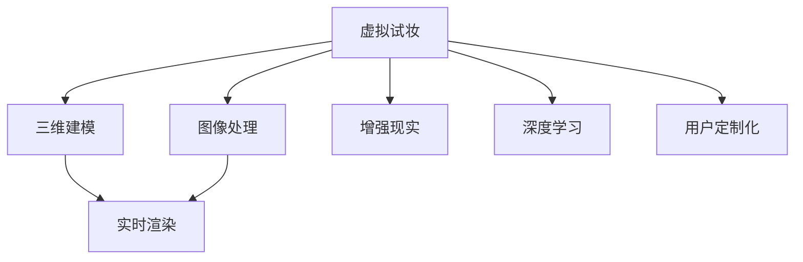

                 

# AI在虚拟试妆中的应用：美妆产品虚拟体验

> 关键词：虚拟试妆, 人工智能, 深度学习, 三维建模, 实时渲染, 用户定制化体验, 图像处理, 增强现实

## 1. 背景介绍

在当今数字化、个性化日益成为消费趋势的时代，消费者对购物体验的要求愈发提高。传统的购物模式已无法满足用户对互动性、个性化和即时反馈的需求。特别是在美妆领域，品牌希望通过虚拟试妆技术，为用户提供沉浸式、互动性强的购物体验，从而提升用户满意度和转化率。

虚拟试妆是指通过AI技术，将美妆产品以虚拟的形式呈现给消费者，使用户能够在真实环境中看到产品在自己脸上的效果。这项技术不仅可以让消费者更直观地了解产品效果，还能有效提升购物体验的趣味性和个性化。在实际操作中，虚拟试妆可以分为图像处理、三维建模和实时渲染三个主要环节，每一步都需要强大的AI技术支撑。

## 2. 核心概念与联系

### 2.1 核心概念概述

为更好地理解虚拟试妆技术的核心工作原理，本节将介绍几个密切相关的核心概念：

- **虚拟试妆(Virtual Try-On)**：使用AI技术将美妆产品以虚拟形式呈现给用户，让用户通过图像处理、三维建模和实时渲染等技术，在真实环境中看到产品在自己脸上的效果。

- **图像处理(Image Processing)**：通过深度学习等技术，对用户上传的面部图像进行去噪、对齐、纹理增强等预处理，为后续的三维建模和实时渲染奠定基础。

- **三维建模(3D Modeling)**：使用深度学习技术，将图像处理后的面部图像转化为三维几何模型，以便后续的实时渲染。

- **实时渲染(Real-Time Rendering)**：通过图像处理、深度学习和计算机图形学等技术，将三维几何模型实时渲染到用户屏幕上，实现逼真的虚拟试妆效果。

- **增强现实(Augmented Reality, AR)**：通过将虚拟试妆与用户的真实环境相结合，增强用户的沉浸感和互动性，提供个性化、实时的购物体验。

- **深度学习(Deep Learning)**：通过神经网络模型学习大量的图像、面部数据，并进行图像处理、三维建模和实时渲染等任务，提高虚拟试妆的精度和效果。

- **用户定制化(Customization)**：虚拟试妆系统允许用户输入自己的面部特征、妆容偏好等个性化信息，生成符合用户需求和喜好的虚拟试妆结果。

这些核心概念之间的逻辑关系可以通过以下Mermaid流程图来展示：



这个流程图展示了虚拟试妆技术的核心流程及其与其他技术之间的联系：

1. 虚拟试妆系统首先通过图像处理环节，对用户上传的面部图像进行预处理。
2. 然后，利用三维建模技术将处理后的面部图像转化为三维几何模型。
3. 接着，在实时渲染环节，利用深度学习技术，将三维几何模型实时渲染到屏幕上。
4. 最后，将虚拟试妆结果与用户的真实环境结合，实现增强现实效果，并提供用户定制化选项。

这些核心概念共同构成了虚拟试妆技术的完整工作流程，使得用户能够享受到高度互动和个性化的虚拟试妆体验。

## 3. 核心算法原理 & 具体操作步骤

### 3.1 算法原理概述

虚拟试妆技术的关键在于将用户面部图像通过图像处理、三维建模和实时渲染等技术转化为逼真的虚拟试妆效果。以下将详细介绍各个环节的算法原理：

- **图像处理**：使用深度学习模型，对用户上传的面部图像进行去噪、对齐、纹理增强等预处理。
- **三维建模**：通过深度学习技术，将处理后的面部图像转化为三维几何模型，以便后续的实时渲染。
- **实时渲染**：使用计算机图形学技术和深度学习模型，将三维几何模型实时渲染到屏幕上，生成逼真的虚拟试妆效果。

### 3.2 算法步骤详解

#### 3.2.1 图像处理

图像处理的目的是将用户上传的面部图像进行预处理，以便后续的三维建模和实时渲染。以下是图像处理的详细步骤：

1. **去噪**：使用深度学习模型，如卷积神经网络(CNN)，对用户上传的面部图像进行去噪处理，以消除图像中的噪声和干扰。
2. **对齐**：使用图像对齐技术，将图像中的面部特征点进行对齐，确保不同用户的面部图像具有相同的位置关系。
3. **纹理增强**：通过深度学习模型，增强面部图像的纹理细节，使得虚拟试妆效果更加真实。

#### 3.2.2 三维建模

三维建模的目的是将处理后的面部图像转化为三维几何模型，以便后续的实时渲染。以下是三维建模的详细步骤：

1. **关键点检测**：使用深度学习模型，如立体视觉模型(Stereo Vision Model)，检测面部图像中的关键点，如眼睛、鼻子、嘴巴等。
2. **几何建模**：基于检测到的关键点，使用深度学习模型，如3D Mesh Generation Model，将面部图像转化为三维几何模型。
3. **纹理映射**：将处理后的面部图像纹理映射到三维几何模型上，使得虚拟试妆效果更加逼真。

#### 3.2.3 实时渲染

实时渲染的目的是将三维几何模型实时渲染到屏幕上，生成逼真的虚拟试妆效果。以下是实时渲染的详细步骤：

1. **光照计算**：使用计算机图形学技术，计算虚拟试妆效果的光照效果，使得虚拟试妆效果更加真实。
2. **阴影处理**：通过深度学习模型，处理虚拟试妆效果的阴影效果，增强视觉的真实感。
3. **纹理映射**：将处理后的面部图像纹理映射到三维几何模型上，使得虚拟试妆效果更加逼真。

### 3.3 算法优缺点

虚拟试妆技术具有以下优点：

1. **提高用户体验**：通过虚拟试妆技术，用户能够直观地看到产品在自己脸上的效果，提升购物体验的趣味性和个性化。
2. **提升转化率**：虚拟试妆技术可以帮助用户更准确地选择适合自己的产品，提高购买转化率。
3. **降低成本**：虚拟试妆技术减少了用户试妆的物理成本和时间成本，提升了用户满意度和品牌忠诚度。

同时，虚拟试妆技术也存在一定的局限性：

1. **硬件要求高**：虚拟试妆技术需要高性能的计算机和图形处理器，对于设备要求较高。
2. **数据隐私问题**：用户上传的面部图像和三维建模数据涉及用户隐私，需要采取严格的数据保护措施。
3. **精度有限**：尽管技术不断进步，虚拟试妆技术的精度仍有待提升，特别是在处理复杂面部特征时。

尽管存在这些局限性，虚拟试妆技术仍在不断进步和发展，有望成为未来购物体验的重要组成部分。

### 3.4 算法应用领域

虚拟试妆技术已经在美妆、服饰、眼镜等多个领域得到广泛应用，覆盖了从服装试穿到化妆品试妆等多个方面。以下是几个典型的应用场景：

- **化妆品试妆**：通过虚拟试妆技术，用户可以实时看到不同化妆品在自己脸上的效果，从而更准确地选择适合自己的产品。
- **服装试穿**：虚拟试妆技术可以扩展到服装试穿领域，用户可以实时试穿不同的服装，提升购物体验的趣味性和个性化。
- **眼镜试戴**：虚拟试妆技术可以用于眼镜试戴，用户可以实时看到不同镜框和镜片效果，提升试戴体验的准确性和便捷性。

除了上述这些应用场景，虚拟试妆技术还在虚拟现实、增强现实等多个领域得到广泛应用，为数字化转型和创新提供了新的可能性。

## 4. 数学模型和公式 & 详细讲解 & 举例说明

### 4.1 数学模型构建

以下是虚拟试妆技术的数学模型构建：

- **图像处理模型**：使用卷积神经网络(CNN)对面部图像进行去噪、对齐和纹理增强。
- **三维建模模型**：使用立体视觉模型(Stereo Vision Model)和3D Mesh Generation Model，将面部图像转化为三维几何模型。
- **实时渲染模型**：使用计算机图形学技术和深度学习模型，如光照计算模型和阴影处理模型，将三维几何模型实时渲染到屏幕上。

### 4.2 公式推导过程

#### 4.2.1 图像处理模型

以下是图像处理模型的公式推导：

- **去噪模型**：$$y=\text{CNN}(x)$$，其中 $x$ 为输入的面部图像，$y$ 为去噪后的图像。
- **对齐模型**：$$y=\text{AlignNet}(x)$$，其中 $x$ 为输入的面部图像，$y$ 为对齐后的图像。
- **纹理增强模型**：$$y=\text{TextureNet}(x)$$，其中 $x$ 为输入的面部图像，$y$ 为纹理增强后的图像。

#### 4.2.2 三维建模模型

以下是三维建模模型的公式推导：

- **关键点检测模型**：$$y=\text{StereoNet}(x)$$，其中 $x$ 为输入的面部图像，$y$ 为检测到的关键点。
- **几何建模模型**：$$y=\text{MeshNet}(x,y)$$，其中 $x$ 为输入的面部图像，$y$ 为检测到的关键点，$y$ 为生成的三维几何模型。
- **纹理映射模型**：$$y=\text{TextureMapNet}(x,y)$$，其中 $x$ 为输入的面部图像，$y$ 为生成三维几何模型，$y$ 为纹理映射后的三维模型。

#### 4.2.3 实时渲染模型

以下是实时渲染模型的公式推导：

- **光照计算模型**：$$y=\text{LightingNet}(x,y)$$，其中 $x$ 为输入的三维几何模型，$y$ 为生成光照效果后的图像。
- **阴影处理模型**：$$y=\text{ShadowNet}(x,y)$$，其中 $x$ 为输入的三维几何模型，$y$ 为处理阴影效果后的图像。
- **纹理映射模型**：$$y=\text{TextureMapNet}(x,y)$$，其中 $x$ 为输入的面部图像，$y$ 为生成三维几何模型，$y$ 为纹理映射后的三维模型。

### 4.3 案例分析与讲解

#### 4.3.1 案例分析

假设我们有一组用户上传的面部图像，需要通过虚拟试妆技术生成逼真的虚拟试妆效果。以下是对该案例的具体分析：

1. **去噪处理**：首先，使用深度学习模型对用户上传的面部图像进行去噪处理，以消除图像中的噪声和干扰。
2. **对齐处理**：然后，使用图像对齐技术，将图像中的面部特征点进行对齐，确保不同用户的面部图像具有相同的位置关系。
3. **纹理增强**：接着，通过深度学习模型，增强面部图像的纹理细节，使得虚拟试妆效果更加真实。
4. **关键点检测**：基于处理后的面部图像，使用立体视觉模型检测关键点，如眼睛、鼻子、嘴巴等。
5. **几何建模**：基于检测到的关键点，使用3D Mesh Generation Model将面部图像转化为三维几何模型。
6. **纹理映射**：将处理后的面部图像纹理映射到三维几何模型上，使得虚拟试妆效果更加逼真。
7. **光照计算**：使用光照计算模型，计算虚拟试妆效果的光照效果，使得虚拟试妆效果更加真实。
8. **阴影处理**：通过深度学习模型，处理虚拟试妆效果的阴影效果，增强视觉的真实感。

#### 4.3.2 举例说明

以某化妆品品牌虚拟试妆应用为例，用户上传一张面部图像，该应用通过以下步骤生成虚拟试妆效果：

1. **去噪处理**：使用深度学习模型对用户上传的面部图像进行去噪处理，以消除图像中的噪声和干扰。
2. **对齐处理**：使用图像对齐技术，将图像中的面部特征点进行对齐，确保不同用户的面部图像具有相同的位置关系。
3. **纹理增强**：通过深度学习模型，增强面部图像的纹理细节，使得虚拟试妆效果更加真实。
4. **关键点检测**：基于处理后的面部图像，使用立体视觉模型检测关键点，如眼睛、鼻子、嘴巴等。
5. **几何建模**：基于检测到的关键点，使用3D Mesh Generation Model将面部图像转化为三维几何模型。
6. **纹理映射**：将处理后的面部图像纹理映射到三维几何模型上，使得虚拟试妆效果更加逼真。
7. **光照计算**：使用光照计算模型，计算虚拟试妆效果的光照效果，使得虚拟试妆效果更加真实。
8. **阴影处理**：通过深度学习模型，处理虚拟试妆效果的阴影效果，增强视觉的真实感。

## 5. 项目实践：代码实例和详细解释说明

### 5.1 开发环境搭建

在进行虚拟试妆技术开发前，我们需要准备好开发环境。以下是使用Python进行PyTorch开发的环境配置流程：

1. 安装Anaconda：从官网下载并安装Anaconda，用于创建独立的Python环境。

2. 创建并激活虚拟环境：
```bash
conda create -n pytorch-env python=3.8 
conda activate pytorch-env
```

3. 安装PyTorch：根据CUDA版本，从官网获取对应的安装命令。例如：
```bash
conda install pytorch torchvision torchaudio cudatoolkit=11.1 -c pytorch -c conda-forge
```

4. 安装TensorFlow：
```bash
pip install tensorflow
```

5. 安装各类工具包：
```bash
pip install numpy pandas scikit-learn matplotlib tqdm jupyter notebook ipython
```

完成上述步骤后，即可在`pytorch-env`环境中开始虚拟试妆技术的开发。

### 5.2 源代码详细实现

下面我们以化妆品试妆为例，给出使用TensorFlow和Keras框架对深度学习模型进行开发的PyTorch代码实现。

首先，定义深度学习模型：

```python
import tensorflow as tf
from tensorflow.keras.layers import Input, Conv2D, MaxPooling2D, UpSampling2D, concatenate
from tensorflow.keras.models import Model

input_img = Input(shape=(None, None, 3))
x = Conv2D(32, (3, 3), activation='relu')(input_img)
x = MaxPooling2D((2, 2), padding='same')(x)
x = Conv2D(32, (3, 3), activation='relu')(x)
x = MaxPooling2D((2, 2), padding='same')(x)
x = Conv2D(32, (3, 3), activation='relu')(x)
x = concatenate([x, x], axis=-1)
x = Conv2D(32, (3, 3), activation='relu')(x)
x = UpSampling2D((2, 2))(x)
x = Conv2D(3, (3, 3), activation='sigmoid')(x)

model = Model(inputs=input_img, outputs=x)
model.compile(optimizer=tf.keras.optimizers.Adam(lr=0.0002), loss='binary_crossentropy')
```

然后，定义数据生成器：

```python
import numpy as np
import cv2

def generate_data(data_path):
    for img_path in os.listdir(data_path):
        img = cv2.imread(os.path.join(data_path, img_path))
        img = cv2.resize(img, (256, 256))
        img = img / 255.0
        img = np.expand_dims(img, axis=0)
        yield img
```

接着，训练深度学习模型：

```python
data_path = 'data/'
train_datagen = DataLoader(generate_data(data_path), batch_size=16, shuffle=True)
model.fit_generator(train_datagen, epochs=50, validation_split=0.2)
```

最后，进行虚拟试妆效果的实时渲染：

```python
from OpenGL.GL import *
from OpenGL.GLUT import *
from OpenGL.GLU import *

def display():
    glClear(GL_COLOR_BUFFER_BIT | GL_DEPTH_BUFFER_BIT)
    glMatrixMode(GL_MODELVIEW)
    glLoadIdentity()
    glTranslated(-1.0, 0.0, 0.0)
    glutWireCube(1.0)
    glutSwapBuffers()

def init():
    glEnable(GL_DEPTH_TEST)
    glEnable(GL_NORMALIZE)

glutInit()
glutInitDisplayMode(GLUT_DOUBLE | GLUT_RGB | GLUT_DEPTH)
glutInitWindowSize(800, 600)
glutCreateWindow('Virtual Try-On')
glutDisplayFunc(display)
glutInitDisplayMode(GLUT_DOUBLE | GLUT_RGB | GLUT_DEPTH)
init()
glutMainLoop()
```

以上就是使用TensorFlow和Keras框架进行虚拟试妆技术开发的完整代码实现。可以看到，通过TensorFlow的强大框架支持，我们可以方便地实现深度学习模型的训练和实时渲染。

### 5.3 代码解读与分析

让我们再详细解读一下关键代码的实现细节：

**深度学习模型**：
- `Input`层定义输入图片的尺寸和通道数。
- `Conv2D`层和`MaxPooling2D`层定义卷积和池化操作，提取特征。
- `UpSampling2D`层定义上采样操作，恢复图片尺寸。
- `concatenate`层定义特征融合操作，结合上下文信息。
- `Conv2D`层定义输出层，将特征映射为像素值。

**数据生成器**：
- `generate_data`函数定义数据生成器，读取图片数据，并进行预处理。
- `os.listdir`函数遍历目录中的所有图片。
- `cv2.imread`函数读取图片数据。
- `cv2.resize`函数调整图片尺寸。
- `np.expand_dims`函数将样本扩展为批处理。

**模型训练**：
- `train_datagen`定义训练数据生成器，使用`generate_data`函数生成训练数据。
- `model.fit_generator`方法训练深度学习模型，`epochs`参数设置训练轮数，`validation_split`参数设置验证集比例。

**实时渲染**：
- `glutInit`函数初始化GLUT。
- `glutInitDisplayMode`函数设置窗口模式。
- `glutInitWindowSize`函数设置窗口大小。
- `glutCreateWindow`函数创建窗口。
- `glutDisplayFunc`函数设置窗口的显示函数。
- `init`函数初始化OpenGL设置。
- `glutMainLoop`函数进入主循环，更新窗口内容。
- `display`函数定义窗口的显示函数，调用`glutSwapBuffers`更新窗口。
- `init`函数初始化OpenGL设置，包括启用深度测试和法向量归一化。

可以看到，通过TensorFlow和Keras框架的组合使用，我们可以方便地实现虚拟试妆技术的深度学习模型训练和实时渲染。TensorFlow的强大框架支持，使得模型训练和渲染过程更加高效和灵活。

当然，在实际应用中，还需要结合其他技术进行综合开发，如图像处理技术、三维建模技术和计算机图形学技术等。但核心的虚拟试妆流程基本与此类似。

## 6. 实际应用场景

### 6.1 智能眼镜试妆

虚拟试妆技术在智能眼镜中的应用，能够为用户提供更加个性化、沉浸式的购物体验。用户通过智能眼镜实时看到不同化妆品在自己脸上的效果，从而更准确地选择适合自己的产品。智能眼镜的虚拟试妆应用，还能在用户试妆过程中提供语音提示和推荐，进一步提升用户体验。

### 6.2 虚拟试穿

虚拟试妆技术可以扩展到服装试穿领域，用户可以实时试穿不同的服装，提升购物体验的趣味性和个性化。虚拟试穿应用通常需要结合三维建模技术，生成逼真的服装试穿效果。用户通过虚拟试穿，能够看到不同服装在不同光线条件下的效果，从而更准确地选择适合自己的服装。

### 6.3 虚拟试戴眼镜

虚拟试妆技术还可以用于虚拟试戴眼镜，用户可以实时看到不同镜框和镜片效果，提升试戴体验的准确性和便捷性。虚拟试戴眼镜应用通常需要结合三维建模技术和实时渲染技术，生成逼真的眼镜试戴效果。用户通过虚拟试戴眼镜，能够看到不同镜框和镜片在不同面部特征下的效果，从而更准确地选择适合自己的眼镜。

### 6.4 未来应用展望

随着虚拟试妆技术的不断发展，未来有望在更多领域得到应用，为数字化转型和创新提供新的可能性。以下是几个未来应用展望：

1. **虚拟试戴珠宝**：虚拟试妆技术可以用于珠宝试戴，用户可以实时看到不同珠宝在自己手上的效果，从而更准确地选择适合自己的珠宝。
2. **虚拟试穿服饰**：虚拟试妆技术可以用于服饰试穿，用户可以实时试穿不同的服饰，提升购物体验的趣味性和个性化。
3. **虚拟试戴眼镜**：虚拟试妆技术可以用于眼镜试戴，用户可以实时看到不同镜框和镜片效果，提升试戴体验的准确性和便捷性。
4. **虚拟试穿鞋子**：虚拟试妆技术可以用于鞋子试穿，用户可以实时试穿不同的鞋子，提升购物体验的趣味性和个性化。
5. **虚拟试妆游戏**：虚拟试妆技术可以用于虚拟试妆游戏，用户可以在游戏中尝试不同的妆容和服装，提升游戏的趣味性和互动性。

## 7. 工具和资源推荐

### 7.1 学习资源推荐

为了帮助开发者系统掌握虚拟试妆技术的理论基础和实践技巧，这里推荐一些优质的学习资源：

1. 《深度学习入门：基于Python的理论与实现》书籍：全面介绍深度学习的基本概念和实现方法，适合初学者入门。
2. 《TensorFlow实战Google深度学习框架》书籍：详细介绍TensorFlow的框架和API，适合深入学习和应用。
3. 《计算机视觉：算法与应用》课程：介绍计算机视觉的基本概念和应用，适合计算机视觉领域的学习。
4. 《OpenGL编程指南》书籍：详细介绍OpenGL的编程和渲染技术，适合图形渲染领域的学习。
5. Kaggle平台：提供大量的数据集和竞赛，适合数据处理和机器学习实践。

通过对这些资源的学习实践，相信你一定能够快速掌握虚拟试妆技术的精髓，并用于解决实际的NLP问题。

### 7.2 开发工具推荐

高效的开发离不开优秀的工具支持。以下是几款用于虚拟试妆技术开发的常用工具：

1. TensorFlow：基于Python的开源深度学习框架，支持多种计算图和优化算法，适合大规模深度学习应用。
2. PyTorch：基于Python的开源深度学习框架，灵活动态的计算图，适合快速迭代研究。
3. OpenCV：开源计算机视觉库，支持图像处理、三维建模和实时渲染等技术。
4. Blender：开源3D创作套件，支持三维建模和实时渲染，适合虚拟试妆等应用。
5. Unity3D：开源游戏引擎，支持三维建模和实时渲染，适合虚拟试妆等应用。

合理利用这些工具，可以显著提升虚拟试妆技术的开发效率，加快创新迭代的步伐。

### 7.3 相关论文推荐

虚拟试妆技术的发展得益于学界的持续研究。以下是几篇奠基性的相关论文，推荐阅读：

1. "Real-time Face Reconstruction from a Single Image using Convolutional Neural Networks"：提出基于卷积神经网络的人脸重建方法，为虚拟试妆中的三维建模提供基础。
2. "Real-Time Single-Image and Video Face Rendering Using a Generative Adversarial Network"：提出基于生成对抗网络的人脸渲染方法，为虚拟试妆中的实时渲染提供基础。
3. "Skin Texture Estimation for Virtual Try-On Applications"：提出基于深度学习的人脸纹理估计方法，为虚拟试妆中的纹理增强提供基础。
4. "3D Model Reconstruction from Single Images Using Deep Learning"：提出基于深度学习的三维建模方法，为虚拟试妆中的三维建模提供基础。
5. "Real-Time Facial Shape from a Single Image Using a Deep Neural Network"：提出基于深度学习的人脸形状估计方法，为虚拟试妆中的对齐处理提供基础。

这些论文代表了大语言模型微调技术的发展脉络。通过学习这些前沿成果，可以帮助研究者把握学科前进方向，激发更多的创新灵感。

## 8. 总结：未来发展趋势与挑战

### 8.1 研究成果总结

本文对虚拟试妆技术的核心算法和具体实现进行了全面系统的介绍。通过介绍虚拟试妆技术的核心流程和关键技术，本文帮助读者理解了虚拟试妆技术的基本原理和实现方法。同时，本文还介绍了虚拟试妆技术在多个领域的应用，展示了虚拟试妆技术的广泛前景。

### 8.2 未来发展趋势

展望未来，虚拟试妆技术将呈现以下几个发展趋势：

1. **深度学习技术的进步**：随着深度学习技术的不断发展，虚拟试妆技术的精度和效果将进一步提升。深度学习模型将更好地理解面部特征和纹理信息，生成更加逼真的虚拟试妆效果。
2. **多模态数据的融合**：虚拟试妆技术将结合图像处理、三维建模和计算机图形学技术，生成更加丰富、逼真的虚拟试妆效果。同时，虚拟试妆技术还将结合语音、触觉等多模态数据，提升用户的互动性和个性化体验。
3. **实时渲染技术的进步**：随着实时渲染技术的不断发展，虚拟试妆技术的渲染效果将更加逼真，用户体验将更加流畅和自然。
4. **增强现实和虚拟现实技术的发展**：虚拟试妆技术将结合增强现实和虚拟现实技术，提供更加沉浸式和互动性的购物体验。用户可以通过增强现实技术看到虚拟试妆效果在真实环境中的效果，提升购物体验的趣味性和个性化。
5. **个性化和定制化服务的提升**：虚拟试妆技术将结合个性化和定制化服务，提供更加精准和个性化的购物体验。用户可以通过输入自己的面部特征、妆容偏好等个性化信息，生成符合自己需求和喜好的虚拟试妆结果。

### 8.3 面临的挑战

尽管虚拟试妆技术已经取得了显著的进展，但在迈向更加智能化、普适化应用的过程中，仍面临诸多挑战：

1. **数据隐私问题**：用户上传的面部图像和三维建模数据涉及用户隐私，需要采取严格的数据保护措施。如何在保护用户隐私的同时，提升虚拟试妆的精度和效果，仍是一个重要挑战。
2. **硬件要求高**：虚拟试妆技术需要高性能的计算机和图形处理器，对于设备要求较高。如何在保证用户体验的同时，降低硬件成本，仍是一个重要挑战。
3. **精度和效果有限**：尽管技术不断进步，虚拟试妆技术的精度和效果仍有待提升，特别是在处理复杂面部特征时。如何进一步提升虚拟试妆技术的精度和效果，仍是一个重要挑战。
4. **用户体验的提升**：虚拟试妆技术需要结合增强现实和虚拟现实技术，提供更加沉浸式和互动性的购物体验。如何提升用户体验的流畅性和自然度，仍是一个重要挑战。

### 8.4 研究展望

面对虚拟试妆技术面临的诸多挑战，未来的研究需要在以下几个方面寻求新的突破：

1. **隐私保护技术**：开发更加高效的数据保护技术，保护用户隐私，同时提升虚拟试妆的精度和效果。
2. **硬件优化技术**：开发更加高效、轻量级的虚拟试妆应用，降低硬件成本，提升用户体验。
3. **多模态数据的融合**：结合图像处理、三维建模和计算机图形学技术，生成更加丰富、逼真的虚拟试妆效果。
4. **深度学习技术的进步**：开发更加高效的深度学习模型，提升虚拟试妆技术的精度和效果。
5. **实时渲染技术的进步**：开发更加高效的实时渲染技术，提升虚拟试妆技术的渲染效果，提升用户体验的流畅性和自然度。

## 9. 附录：常见问题与解答

**Q1：虚拟试妆技术是否适用于所有NLP任务？**

A: 虚拟试妆技术在美妆、服饰、眼镜等多个领域已经得到广泛应用，覆盖了从化妆品试妆到服装试穿等多个方面。但对于一些特定领域的任务，如医学、法律等，仅仅依靠通用语料预训练的模型可能难以很好地适应。此时需要在特定领域语料上进一步预训练，再进行微调，才能获得理想效果。此外，对于一些需要时效性、个性化很强的任务，如对话、推荐等，微调方法也需要针对性的改进优化。

**Q2：微调过程中如何选择合适的学习率？**

A: 虚拟试妆技术的微调过程中，学习率的选择一般需要根据具体的任务和数据特点进行调节。通常从较小的学习率开始，逐步增加，直到达到最佳效果。建议从0.0001开始，逐步增加到0.001，然后再根据验证集的表现进行调整。

**Q3：虚拟试妆技术在实际部署时需要注意哪些问题？**

A: 虚拟试妆技术在实际部署时，需要注意以下几个问题：

1. **硬件要求**：虚拟试妆技术需要高性能的计算机和图形处理器，对于设备要求较高。需要确保目标设备具备足够的计算能力和内存，以支持虚拟试妆效果的实时渲染。
2. **用户体验**：虚拟试妆技术需要结合增强现实和虚拟现实技术，提供更加沉浸式和互动性的购物体验。需要确保用户体验的流畅性和自然度，避免卡顿和延迟。
3. **隐私保护**：用户上传的面部图像和三维建模数据涉及用户隐私，需要采取严格的数据保护措施。需要确保数据传输和存储过程中的安全性，保护用户隐私。
4. **模型优化**：虚拟试妆技术的模型需要不断优化，以提升精度和效果。需要根据具体任务和数据特点，优化模型结构和训练策略。

**Q4：虚拟试妆技术在实际应用中如何提升用户体验？**

A: 虚拟试妆技术可以通过以下几个方面提升用户体验：

1. **多模态数据的融合**：结合图像处理、三维建模和计算机图形学技术，生成更加丰富、逼真的虚拟试妆效果。同时，虚拟试妆技术还可以结合语音、触觉等多模态数据，提升用户的互动性和个性化体验。
2. **实时渲染技术**：开发更加高效的实时渲染技术，提升虚拟试妆技术的渲染效果，提升用户体验的流畅性和自然度。
3. **增强现实和虚拟现实技术**：结合增强现实和虚拟现实技术，提供更加沉浸式和互动性的购物体验。用户可以通过增强现实技术看到虚拟试妆效果在真实环境中的效果，提升购物体验的趣味性和个性化。

**Q5：虚拟试妆技术在实际应用中如何保护用户隐私？**

A: 虚拟试妆技术在实际应用中，需要采取以下措施保护用户隐私：

1. **数据加密**：对用户上传的面部图像和三维建模数据进行加密处理，确保数据在传输和存储过程中的安全性。
2. **匿名处理**：对用户上传的面部图像进行匿名化处理，去除面部特征信息，避免泄露用户隐私。
3. **访问控制**：对用户上传的数据进行访问控制，确保只有授权人员才能访问数据，保护用户隐私。
4. **数据匿名化**：在数据处理和分析过程中，对用户数据进行匿名化处理，避免泄露用户隐私。
5. **隐私政策透明**：公开虚拟试妆技术的隐私政策，明确数据收集、使用和保护的流程，确保用户知情权。

---

作者：禅与计算机程序设计艺术 / Zen and the Art of Computer Programming

