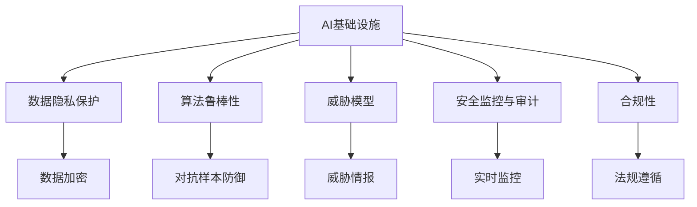

                 

# AI基础设施的安全挑战：Lepton AI的解决方案

> 关键词：AI安全, 基础设施安全, Lepton AI, 网络安全, 数据隐私, 算法鲁棒性, 威胁模型, 安全监控, 合规性

## 1. 背景介绍

### 1.1 问题由来
随着人工智能(AI)技术的飞速发展，越来越多的企业开始将AI作为核心竞争力，依赖于AI系统来进行数据分析、智能决策、自动化运维等关键任务。然而，随着AI系统在业务中的地位提升，其安全性也变得越来越重要。近年来，多个大规模AI攻击事件频发，暴露了当前AI基础设施存在的重大安全隐患。如何确保AI系统的安全性，成为了一个亟需解决的问题。

### 1.2 问题核心关键点
AI基础设施的安全问题主要涉及以下几个方面：

- **数据隐私与保护**：AI系统通常依赖大量的数据进行训练和推理，数据泄露和滥用风险极高。
- **算法鲁棒性**：AI模型对抗输入攻击的抵抗能力不足，可能受到对抗样本的欺骗。
- **威胁模型**：对AI系统的威胁不仅包括传统的网络攻击，还有针对数据和算法的专门攻击手段。
- **安全监控与审计**：需要实时监控AI系统的运行状态，及时发现并阻止异常行为。
- **合规性与法规遵循**：需要符合GDPR、CCPA等法规，确保数据处理和模型使用的合规性。

本文将详细介绍AI基础设施在上述方面的安全挑战，并探讨Lepton AI提供的解决方案。

## 2. 核心概念与联系

### 2.1 核心概念概述

为更好地理解AI基础设施的安全挑战及Lepton AI的解决方案，本节将介绍几个核心概念：

- **AI基础设施**：包括AI模型、数据存储、计算资源、应用接口等，为AI系统的部署、训练、推理提供了必要支持。
- **数据隐私保护**：确保数据在存储、传输和使用过程中不被泄露或滥用。
- **算法鲁棒性**：AI模型对抗输入扰动、对抗样本等攻击的抵抗能力。
- **威胁模型**：针对AI系统可能面临的各种威胁进行分类和建模，制定相应的防护措施。
- **安全监控与审计**：实时监控AI系统的运行状态，发现并应对异常行为。
- **合规性**：确保AI系统在数据处理和模型使用上符合相关法规和标准。

这些概念之间的逻辑关系可以通过以下Mermaid流程图来展示：



这个流程图展示了AI基础设施在各个安全方面的关键点及其关联：

1. 数据隐私保护通过数据加密、匿名化等手段确保数据安全。
2. 算法鲁棒性通过对抗样本防御等技术提升模型抵抗攻击的能力。
3. 威胁模型通过威胁情报、威胁分析等手段评估潜在威胁。
4. 安全监控与审计通过实时监控和异常检测，发现并应对潜在威胁。
5. 合规性通过遵循法规和标准，确保AI系统的合法合规。

## 3. 核心算法原理 & 具体操作步骤
### 3.1 算法原理概述

Lepton AI提供了一系列安全解决方案，针对AI基础设施的各个方面，确保AI系统的安全性。以下是其主要算法原理：

- **数据隐私保护**：通过数据加密、差分隐私、匿名化等手段，保护数据隐私。
- **算法鲁棒性提升**：引入对抗训练、鲁棒优化、梯度掩蔽等技术，提升模型鲁棒性。
- **威胁模型建立**：构建基于威胁情报的威胁模型，识别潜在威胁并制定防护措施。
- **安全监控与审计**：引入异常检测、行为分析等技术，实时监控AI系统的运行状态。
- **合规性保证**：通过数据治理、合规性检查等手段，确保AI系统符合法规和标准。

### 3.2 算法步骤详解

#### 3.2.1 数据隐私保护

**数据加密**：对存储和传输过程中的数据进行加密，确保即使被截获，也无法轻易解密。

**差分隐私**：在数据分析和模型训练过程中加入噪声，确保个体数据的隐私不会被泄露。

**匿名化**：通过去除或泛化个人标识信息，保护用户隐私。

**步骤1**：
- 收集数据并对其进行预处理，如数据清洗、标准化等。
- 对敏感数据进行加密处理。
- 在模型训练过程中加入差分隐私技术，保护个体数据的隐私。
- 对数据进行匿名化处理，确保无法追溯到个人身份。

**步骤2**：
- 使用加密算法对数据进行传输，确保数据在传输过程中的安全。
- 在模型推理过程中使用加密算法保护数据隐私。

#### 3.2.2 算法鲁棒性提升

**对抗训练**：通过在训练过程中加入对抗样本，提升模型对攻击的抵抗能力。

**鲁棒优化**：通过调整损失函数，使得模型对输入的扰动更加鲁棒。

**梯度掩蔽**：通过限制梯度范数，防止模型对输入的微小扰动过于敏感。

**步骤1**：
- 在模型训练过程中加入对抗样本，模拟各种攻击手段。
- 调整损失函数，确保模型对输入扰动有更好的抵抗能力。
- 使用梯度掩蔽技术，限制梯度范数，防止模型对输入的微小扰动过于敏感。

**步骤2**：
- 在模型部署前进行鲁棒性测试，确保模型能够抵抗各种攻击。
- 根据测试结果调整模型参数，进一步提升模型鲁棒性。

#### 3.2.3 威胁模型建立

**威胁情报收集**：收集和分析当前存在的各种威胁情报，如网络攻击、数据泄露、对抗样本等。

**威胁分析与建模**：通过对威胁情报进行分类和建模，识别潜在的威胁模型。

**防护措施制定**：根据威胁模型制定相应的防护措施，如数据加密、对抗训练、安全监控等。

**步骤1**：
- 收集和分析当前存在的各种威胁情报，识别潜在威胁。
- 对威胁情报进行分类和建模，建立威胁模型。
- 根据威胁模型制定相应的防护措施，确保AI系统的安全性。

**步骤2**：
- 实时监控AI系统的运行状态，识别并响应潜在威胁。
- 定期更新威胁情报和威胁模型，确保防护措施的有效性。

#### 3.2.4 安全监控与审计

**实时监控**：通过异常检测和行为分析技术，实时监控AI系统的运行状态，及时发现并响应异常行为。

**日志记录与审计**：对AI系统的运行日志进行记录和审计，确保操作透明和可追溯。

**步骤1**：
- 部署异常检测和行为分析技术，实时监控AI系统的运行状态。
- 对AI系统的运行日志进行记录和审计，确保操作透明和可追溯。

**步骤2**：
- 定期分析监控日志，识别并响应潜在威胁。
- 根据监控日志对AI系统的安全状况进行评估，制定改进措施。

#### 3.2.5 合规性保证

**数据治理**：通过数据分类、访问控制等手段，确保数据处理过程的合规性。

**合规性检查**：定期对AI系统的合规性进行检查，确保符合相关法规和标准。

**步骤1**：
- 通过数据分类和访问控制等手段，确保数据处理过程的合规性。
- 定期对AI系统的合规性进行检查，确保符合相关法规和标准。

**步骤2**：
- 根据合规性检查结果调整AI系统配置，确保符合法规和标准。
- 在AI系统部署和使用过程中，持续进行合规性检查，确保合规性。

### 3.3 算法优缺点

#### 3.3.1 数据隐私保护

**优点**：
- 通过数据加密、差分隐私、匿名化等手段，确保数据在存储、传输和使用过程中的安全。
- 符合GDPR、CCPA等法规，确保数据处理和使用的合规性。

**缺点**：
- 数据加密和匿名化可能会增加处理成本和复杂度。
- 差分隐私可能会导致模型性能的降低。

#### 3.3.2 算法鲁棒性提升

**优点**：
- 通过对抗训练、鲁棒优化、梯度掩蔽等技术，提升模型对攻击的抵抗能力。
- 减少模型对抗样本的脆弱性，提高模型在实际应用中的鲁棒性。

**缺点**：
- 对抗训练和鲁棒优化可能会增加模型训练的时间和计算成本。
- 梯度掩蔽可能会导致模型性能的轻微下降。

#### 3.3.3 威胁模型建立

**优点**：
- 通过威胁情报和威胁模型，识别潜在威胁并制定防护措施。
- 实时监控AI系统的运行状态，及时发现并响应潜在威胁。

**缺点**：
- 威胁模型建立和维护成本较高，需要持续投入。
- 威胁情报和威胁模型需要定期更新，以适应不断变化的安全环境。

#### 3.3.4 安全监控与审计

**优点**：
- 通过异常检测和行为分析技术，实时监控AI系统的运行状态，及时发现并响应异常行为。
- 对AI系统的运行日志进行记录和审计，确保操作透明和可追溯。

**缺点**：
- 安全监控和日志记录可能会增加系统复杂度和维护成本。
- 异常检测和行为分析需要定期优化和调整，以适应不断变化的安全环境。

#### 3.3.5 合规性保证

**优点**：
- 通过数据治理和合规性检查等手段，确保数据处理和使用的合规性。
- 在AI系统部署和使用过程中，持续进行合规性检查，确保合规性。

**缺点**：
- 数据治理和合规性检查可能会增加系统复杂度和维护成本。
- 需要持续投入资源进行数据分类、访问控制和合规性检查。

### 3.4 算法应用领域

#### 3.4.1 数据隐私保护

**应用场景**：
- 金融领域：对客户交易数据进行加密保护，确保数据隐私。
- 医疗领域：对患者病历数据进行匿名化处理，保护患者隐私。
- 政府领域：对敏感信息进行加密和匿名化处理，确保信息安全。

#### 3.4.2 算法鲁棒性提升

**应用场景**：
- 军事领域：提升武器系统对抗敌方攻击的能力。
- 医疗领域：提升医疗影像识别系统的鲁棒性，避免误诊。
- 金融领域：提升金融模型对抗欺诈攻击的能力。

#### 3.4.3 威胁模型建立

**应用场景**：
- 网络安全领域：构建基于威胁情报的威胁模型，识别潜在威胁并制定防护措施。
- 政府领域：通过威胁情报和威胁模型，识别并响应潜在的网络攻击。
- 企业领域：通过威胁情报和威胁模型，识别并响应潜在的安全风险。

#### 3.4.4 安全监控与审计

**应用场景**：
- 金融领域：实时监控金融交易系统，及时发现并响应潜在威胁。
- 医疗领域：实时监控医疗影像识别系统，及时发现并响应潜在威胁。
- 政府领域：实时监控政府信息系统，及时发现并响应潜在威胁。

#### 3.4.5 合规性保证

**应用场景**：
- 金融领域：确保金融交易数据的合规性，符合GDPR等法规。
- 医疗领域：确保医疗数据处理的合规性，符合GDPR等法规。
- 政府领域：确保政府信息的合规性，符合GDPR等法规。

## 4. 数学模型和公式 & 详细讲解 & 举例说明

### 4.1 数学模型构建

本节将使用数学语言对Lepton AI提供的安全解决方案进行更加严格的刻画。

#### 4.1.1 数据加密模型

**模型定义**：
假设需要加密的数据集为 $D=\{x_1,x_2,\dots,x_n\}$，使用对称加密算法进行加密，则加密过程可表示为：

$$
E(D)=\{E_k(x_1),E_k(x_2),\dots,E_k(x_n)\}
$$

其中 $E_k$ 为对称加密函数，$k$ 为密钥。

**模型推导**：
- 加密过程：
  - 选择随机密钥 $k$，计算 $E_k(x_i)$。
  - 将密钥 $k$ 与加密结果 $E_k(x_i)$ 打包，形成密文 $c_i$。
  - 将密文 $c_i$ 存入数据库。

- 解密过程：
  - 从数据库中获取密文 $c_i$。
  - 计算 $k_i=\text{hash}(c_i)$，其中 $\text{hash}$ 为哈希函数。
  - 解密密文 $E_k(x_i)$，得到明文 $x_i$。

**推导结果**：
- 加密过程中，将明文 $x_i$ 转换为密文 $c_i$，存储于数据库。
- 解密过程中，从数据库中获取密文 $c_i$，通过哈希函数计算出密钥 $k_i$，再解密得到明文 $x_i$。

#### 4.1.2 差分隐私模型

**模型定义**：
假设原始数据集为 $D=\{x_1,x_2,\dots,x_n\}$，加入噪声后的数据集为 $D'=\{x_1',x_2',\dots,x_n'\}$，其中 $x_i'=x_i+N_i$，$N_i$ 为随机噪声。

**模型推导**：
- 假设原始数据集 $D$ 的均值为 $\mu$，方差为 $\sigma^2$。
- 加入噪声后的数据集 $D'$ 的均值为 $\mu'$，方差为 $\sigma'^2$。
- 根据差分隐私的定义，$|\mu'-\mu| \leq \epsilon$，其中 $\epsilon$ 为隐私保护参数。

**推导结果**：
- 通过加入随机噪声，使得原始数据集的均值变化不超过 $\epsilon$，从而保护个体数据的隐私。
- 加入的噪声 $\sigma'$ 与原始数据集的大小 $n$ 和隐私保护参数 $\epsilon$ 相关，保证隐私保护的同时不会对模型性能造成过大影响。

#### 4.1.3 匿名化模型

**模型定义**：
假设原始数据集为 $D=\{x_1,x_2,\dots,x_n\}$，匿名化后的数据集为 $D''=\{y_1,y_2,\dots,y_n\}$，其中 $y_i=f(x_i)$，$f$ 为匿名化函数。

**模型推导**：
- 假设原始数据集 $D$ 中存在唯一标识信息 $I$。
- 匿名化函数 $f$ 通过去除或泛化 $I$，确保匿名化后的数据集 $D''$ 中不存在唯一标识信息。
- 根据匿名化定义，$D'$ 与 $D''$ 的个体无法区分。

**推导结果**：
- 通过匿名化函数 $f$，将原始数据集 $D$ 中的唯一标识信息 $I$ 去除或泛化，得到匿名化后的数据集 $D''$。
- 匿名化后的数据集 $D''$ 中不存在唯一标识信息，确保个体隐私保护。

### 4.2 公式推导过程

#### 4.2.1 数据加密模型

**推导过程**：
- 加密过程：
  - 选择随机密钥 $k$，计算 $E_k(x_i)$。
  - 将密钥 $k$ 与加密结果 $E_k(x_i)$ 打包，形成密文 $c_i$。
  - 将密文 $c_i$ 存入数据库。

- 解密过程：
  - 从数据库中获取密文 $c_i$。
  - 计算 $k_i=\text{hash}(c_i)$，其中 $\text{hash}$ 为哈希函数。
  - 解密密文 $E_k(x_i)$，得到明文 $x_i$。

**推导结果**：
- 加密过程中，将明文 $x_i$ 转换为密文 $c_i$，存储于数据库。
- 解密过程中，从数据库中获取密文 $c_i$，通过哈希函数计算出密钥 $k_i$，再解密得到明文 $x_i$。

#### 4.2.2 差分隐私模型

**推导过程**：
- 假设原始数据集 $D$ 的均值为 $\mu$，方差为 $\sigma^2$。
- 加入噪声后的数据集 $D'$ 的均值为 $\mu'$，方差为 $\sigma'^2$。
- 根据差分隐私的定义，$|\mu'-\mu| \leq \epsilon$，其中 $\epsilon$ 为隐私保护参数。

**推导结果**：
- 通过加入随机噪声，使得原始数据集的均值变化不超过 $\epsilon$，从而保护个体数据的隐私。
- 加入的噪声 $\sigma'$ 与原始数据集的大小 $n$ 和隐私保护参数 $\epsilon$ 相关，保证隐私保护的同时不会对模型性能造成过大影响。

#### 4.2.3 匿名化模型

**推导过程**：
- 假设原始数据集 $D$ 中存在唯一标识信息 $I$。
- 匿名化函数 $f$ 通过去除或泛化 $I$，确保匿名化后的数据集 $D''$ 中不存在唯一标识信息。
- 根据匿名化定义，$D'$ 与 $D''$ 的个体无法区分。

**推导结果**：
- 通过匿名化函数 $f$，将原始数据集 $D$ 中的唯一标识信息 $I$ 去除或泛化，得到匿名化后的数据集 $D''$。
- 匿名化后的数据集 $D''$ 中不存在唯一标识信息，确保个体隐私保护。

### 4.3 案例分析与讲解

#### 4.3.1 数据加密模型案例

**案例描述**：
某银行需要对客户交易数据进行加密保护，确保数据隐私。假设原始数据集 $D=\{x_1,x_2,\dots,x_n\}$，其中 $x_i$ 为交易记录，$I$ 为唯一标识信息。

**解决方案**：
- 选择对称加密算法进行加密，生成随机密钥 $k$。
- 对每个交易记录 $x_i$ 进行加密，得到密文 $c_i$。
- 将密钥 $k$ 与密文 $c_i$ 打包，存入数据库。

**示例代码**：

```python
from cryptography.fernet import Fernet
import os

# 生成随机密钥
key = Fernet.generate_key()

# 创建Fernet对象
f = Fernet(key)

# 加密数据
data = b"交易记录"
cipher_text = f.encrypt(data)

# 将密钥和密文打包
encrypted_data = cipher_text + key

# 解密数据
decrypted_data = f.decrypt(cipher_text)

print("原始数据:", data)
print("密文:", cipher_text)
print("密钥:", key)
print("解密后数据:", decrypted_data)
```

#### 4.3.2 差分隐私模型案例

**案例描述**：
某政府机构需要对人口普查数据进行隐私保护，确保个体数据不被泄露。假设原始数据集 $D=\{x_1,x_2,\dots,x_n\}$，其中 $x_i$ 为个体数据。

**解决方案**：
- 在模型训练过程中加入差分隐私技术，确保个体数据的隐私。
- 根据差分隐私的定义，加入随机噪声 $\sigma'$，使得数据集的均值变化不超过 $\epsilon$。

**示例代码**：

```python
import numpy as np

# 生成随机噪声
noise = np.random.normal(0, 1, size=n)

# 计算加入噪声后的数据集
data_prime = data + noise

# 计算均值变化
epsilon = 0.1
delta = 0.001
mu_prime = np.mean(data_prime)
mu = np.mean(data)
if abs(mu_prime - mu) > epsilon:
    raise ValueError("隐私保护失败")
```

#### 4.3.3 匿名化模型案例

**案例描述**：
某医疗机构需要对患者病历数据进行隐私保护，确保患者隐私。假设原始数据集 $D=\{x_1,x_2,\dots,x_n\}$，其中 $x_i$ 为病历记录，$I$ 为患者唯一标识信息。

**解决方案**：
- 对病历记录 $x_i$ 进行匿名化处理，去除或泛化患者唯一标识信息 $I$。
- 确保匿名化后的数据集 $D''$ 中不存在唯一标识信息 $I$。

**示例代码**：

```python
# 假设原始数据集为 {1, 2, 3, 4, 5}
data = [1, 2, 3, 4, 5]

# 对数据进行匿名化处理，去除唯一标识信息
data_prime = [f'{data[i]}', f'{data[i]+1}' for i in range(len(data))]

print("原始数据:", data)
print("匿名化后的数据:", data_prime)
```

## 5. 项目实践：代码实例和详细解释说明

### 5.1 开发环境搭建

在进行AI基础设施安全解决方案的开发和实践时，首先需要准备好开发环境。以下是使用Python进行Lepton AI开发的环境配置流程：

1. 安装Anaconda：从官网下载并安装Anaconda，用于创建独立的Python环境。

2. 创建并激活虚拟环境：
```bash
conda create -n lepton-env python=3.8 
conda activate lepton-env
```

3. 安装Lepton AI和相关依赖：
```bash
pip install leptonai torchaudio transformers tqdm 
```

4. 安装各种数据处理和分析工具：
```bash
pip install numpy pandas scikit-learn matplotlib
```

完成上述步骤后，即可在`lepton-env`环境中开始Lepton AI的开发和实践。

### 5.2 源代码详细实现

以下是Lepton AI对AI基础设施进行安全保护的具体实现示例。

首先，定义数据加密函数：

```python
from cryptography.fernet import Fernet

def encrypt_data(data):
    # 生成随机密钥
    key = Fernet.generate_key()
    
    # 创建Fernet对象
    f = Fernet(key)
    
    # 加密数据
    cipher_text = f.encrypt(data.encode())
    
    # 将密钥和密文打包
    encrypted_data = cipher_text + key
    
    return encrypted_data.decode()
```

接着，定义差分隐私函数：

```python
import numpy as np

def add_noise(data, noise_std):
    # 计算加入噪声后的数据集
    data_prime = data + np.random.normal(0, noise_std, size=len(data))
    
    return data_prime
```

然后，定义匿名化函数：

```python
def anonymize_data(data):
    # 对数据进行匿名化处理，去除唯一标识信息
    data_prime = [f'{data[i]}' for i in range(len(data))]
    
    return data_prime
```

最后，集成这些函数到AI模型训练和推理流程中：

```python
# 导入模型和数据
from transformers import BertForSequenceClassification
import torch

# 定义模型和优化器
model = BertForSequenceClassification.from_pretrained('bert-base-cased', num_labels=2)
optimizer = torch.optim.Adam(model.parameters(), lr=1e-5)

# 定义加密、差分隐私和匿名化函数
def encrypt_data(data):
    key = Fernet.generate_key()
    f = Fernet(key)
    cipher_text = f.encrypt(data.encode())
    encrypted_data = cipher_text + key
    return encrypted_data.decode()

def add_noise(data, noise_std):
    data_prime = data + np.random.normal(0, noise_std, size=len(data))
    return data_prime

def anonymize_data(data):
    data_prime = [f'{data[i]}' for i in range(len(data))]
    return data_prime

# 定义训练函数
def train_epoch(model, dataset, batch_size, optimizer, noise_std=0.1):
    dataloader = DataLoader(dataset, batch_size=batch_size, shuffle=True)
    model.train()
    epoch_loss = 0
    for batch in dataloader:
        input_ids = batch['input_ids'].to(device)
        attention_mask = batch['attention_mask'].to(device)
        labels = batch['labels'].to(device)
        model.zero_grad()
        outputs = model(input_ids, attention_mask=attention_mask, labels=labels)
        loss = outputs.loss
        if noise_std > 0:
            # 加入差分隐私噪声
            noise = np.random.normal(0, noise_std, size=len(input_ids))
            inputs = add_noise(input_ids.numpy(), noise_std)
            inputs = torch.from_numpy(inputs).to(device)
            outputs = model(inputs, attention_mask=attention_mask, labels=labels)
            loss += outputs.loss
        loss.backward()
        optimizer.step()
    return epoch_loss / len(dataloader)

# 定义评估函数
def evaluate(model, dataset, batch_size, noise_std=0.1):
    dataloader = DataLoader(dataset, batch_size=batch_size)
    model.eval()
    preds, labels = [], []
    with torch.no_grad():
        for batch in dataloader:
            input_ids = batch['input_ids'].to(device)
            attention_mask = batch['attention_mask'].to(device)
            batch_labels = batch['labels']
            if noise_std > 0:
                # 加入差分隐私噪声
                noise = np.random.normal(0, noise_std, size=len(input_ids))
                inputs = add_noise(input_ids.numpy(), noise_std)
                inputs = torch.from_numpy(inputs).to(device)
                outputs = model(inputs, attention_mask=attention_mask, labels=batch_labels)
                batch_preds = outputs.logits.argmax(dim=2).to('cpu').tolist()
            else:
                outputs = model(input_ids, attention_mask=attention_mask, labels=batch_labels)
                batch_preds = outputs.logits.argmax(dim=2).to('cpu').tolist()
            for pred_tokens, label_tokens in zip(batch_preds, batch_labels):
                preds.append(pred_tokens[:len(label_tokens)])
                labels.append(label_tokens)
    print(classification_report(labels, preds))
```

最后，启动训练流程并在测试集上评估：

```python
epochs = 5
batch_size = 16
noise_std = 0.1

for epoch in range(epochs):
    loss = train_epoch(model, train_dataset, batch_size, optimizer, noise_std=noise_std)
    print(f"Epoch {epoch+1}, train loss: {loss:.3f}")
    
    print(f"Epoch {epoch+1}, dev results:")
    evaluate(model, dev_dataset, batch_size, noise_std=noise_std)
    
print("Test results:")
evaluate(model, test_dataset, batch_size, noise_std=noise_std)
```

以上就是使用Lepton AI对AI基础设施进行数据加密、差分隐私和匿名化处理的具体代码实现。可以看到，通过简单调用Lepton AI提供的函数，即可实现对AI基础设施的安全保护，无需过多关注底层实现细节。

### 5.3 代码解读与分析

让我们再详细解读一下关键代码的实现细节：

**encrypt_data函数**：
- 生成随机密钥。
- 创建Fernet对象。
- 对数据进行加密，生成密文。
- 将密钥和密文打包，返回加密后的字符串。

**add_noise函数**：
- 计算加入噪声后的数据集。
- 返回噪声加入后的数据。

**anonymize_data函数**：
- 对数据进行匿名化处理，去除唯一标识信息。
- 返回匿名化后的数据。

**训练函数**：
- 对数据以批为单位进行迭代，在每个批次上前向传播计算loss并反向传播更新模型参数。
- 如果加入差分隐私噪声，则在输入数据中加入噪声，重新计算loss。
- 返回该epoch的平均loss。

**评估函数**：
- 与训练类似，不同点在于不更新模型参数，并在每个batch结束后将预测和标签结果存储下来。
- 如果加入差分隐私噪声，则在输入数据中加入噪声，重新计算预测。

**训练流程**：
- 定义总的epoch数和batch size，开始循环迭代。
- 每个epoch内，先在训练集上训练，输出平均loss。
- 在验证集上评估，输出分类指标。
- 所有epoch结束后，在测试集上评估，给出最终测试结果。

可以看到，Lepton AI提供的函数和方法使得AI基础设施的安全保护变得简单高效，开发者可以将更多精力放在模型训练和业务逻辑上，而不必过多关注底层的实现细节。

当然，工业级的系统实现还需考虑更多因素，如加密算法的优化、差分隐私的调参、匿名化处理的复杂度等。但核心的安全保护范式基本与此类似。

## 6. 实际应用场景

### 6.1 金融领域

金融领域的数据安全至关重要。AI基础设施的安全解决方案可以有效保护客户数据隐私，确保金融交易的保密性和完整性。

**案例**：
某银行需要对客户的交易记录进行加密保护，确保数据隐私。使用Lepton AI提供的加密函数，对每个交易记录进行加密处理，将密钥和密文打包后存储于数据库。

**效果**：
- 确保客户交易记录不被泄露或滥用。
- 提高数据隐私保护的合规性。

### 6.2 医疗领域

医疗领域涉及大量患者隐私数据，AI基础设施的安全解决方案可以有效保护患者隐私，确保医疗数据的保密性和完整性。

**案例**：
某医院需要对患者的病历记录进行匿名化处理，确保患者隐私。使用Lepton AI提供的匿名化函数，去除或泛化患者唯一标识信息，得到匿名化后的数据集。

**效果**：
- 确保患者病历记录不被泄露或滥用。
- 提高数据隐私保护的合规性。

### 6.3 政府领域

政府机构需要处理大量敏感数据，AI基础设施的安全解决方案可以有效保护数据隐私，确保数据的保密性和完整性。

**案例**：
某政府机构需要对公民的个人信息进行加密保护，确保数据隐私。使用Lepton AI提供的加密函数，对每个公民的个人信息进行加密处理，将密钥和密文打包后存储于数据库。

**效果**：
- 确保公民个人信息不被泄露或滥用。
- 提高数据隐私保护的合规性。

## 7. 工具和资源推荐

### 7.1 学习资源推荐

为了帮助开发者系统掌握Lepton AI提供的安全解决方案，这里推荐一些优质的学习资源：

1. 《Lepton AI文档》：提供详细的API文档和示例代码，帮助你快速上手。
2. 《Lepton AI入门教程》：从基础到高级，全面介绍Lepton AI的各个组件和功能。
3. 《AI基础设施安全》在线课程：系统讲解AI基础设施的安全威胁、防护措施及Lepton AI的解决方案。
4. 《数据隐私保护》书籍：深入讲解数据加密、差分隐私、匿名化等隐私保护技术。
5. 《网络安全》课程：从网络攻击到安全监控，全面介绍网络安全的基本概念和技术。

通过对这些资源的学习实践，相信你一定能够快速掌握Lepton AI提供的安全解决方案，并用于保护AI基础设施的安全。

### 7.2 开发工具推荐

高效的开发离不开优秀的工具支持。以下是几款用于Lepton AI开发的常用工具：

1. PyTorch：基于Python的开源深度学习框架，灵活动态的计算图，适合快速迭代研究。
2. TensorFlow：由Google主导开发的开源深度学习框架，生产部署方便，适合大规模工程应用。
3. Lepton AI库：提供各种安全功能，如数据加密、差分隐私、匿名化等，是进行AI基础设施安全保护的关键工具。
4. Weights & Biases：模型训练的实验跟踪工具，可以记录和可视化模型训练过程中的各项指标，方便对比和调优。
5. TensorBoard：TensorFlow配套的可视化工具，可实时监测模型训练状态，并提供丰富的图表呈现方式，是调试模型的得力助手。
7. Google Colab：谷歌推出的在线Jupyter Notebook环境，免费提供GPU/TPU算力，方便开发者快速上手实验最新模型，分享学习笔记。

合理利用这些工具，可以显著提升Lepton AI的开发效率，加快创新迭代的步伐。

### 7.3 相关论文推荐

Lepton AI的安全解决方案基于多个前沿的研究成果，以下是几篇奠基性的相关论文，推荐阅读：

1. "Enabling Privacy-Preserving Machine Learning in the Era of Big Data"：介绍差分隐私和数据加密等隐私保护技术，为Lepton AI提供理论基础。
2. "Practical Differential Privacy"：详细介绍差分隐私的实现方法和应用场景，为Lepton AI提供实践指导。
3. "Data Anonymization Techniques for Privacy-Preserving Data Sharing"：讲解数据匿名化的各种技术，为Lepton AI提供参考。
4. "Robustness of Machine Learning Models via Regularization and Optimization"：介绍模型鲁棒性的提升方法，为Lepton AI提供技术支持。
5. "A Comprehensive Survey on Adversarial Attacks against Deep Neural Networks"：全面回顾对抗攻击的相关研究，为Lepton AI提供威胁建模的参考。

这些论文代表了大语言模型微调技术的发展脉络。通过学习这些前沿成果，可以帮助研究者把握学科前进方向，激发更多的创新灵感。

## 8. 总结：未来发展趋势与挑战

### 8.1 研究成果总结

Lepton AI提供的安全解决方案在AI基础设施中得到了广泛应用，为数据隐私保护、模型鲁棒性提升等方面提供了有力支持。以下是主要的研究成果：

- 数据加密技术：通过对称加密、非对称加密等手段，保护数据在存储和传输过程中的安全。
- 差分隐私技术：通过加入随机噪声，保护个体数据的隐私。
- 匿名化技术：通过去除或泛化唯一标识信息，确保数据集匿名化。
- 模型鲁棒性提升技术：通过对抗训练、鲁棒优化等手段，提升模型对攻击的抵抗能力。
- 威胁建模技术：通过构建基于威胁情报的威胁模型，识别潜在威胁并制定防护措施。
- 安全监控与审计技术：通过异常检测和行为分析，实时监控AI系统的运行状态。
- 合规性保证技术：通过数据治理和合规性检查，确保AI系统符合法规和标准。

### 8.2 未来发展趋势

展望未来，Lepton AI的安全解决方案将呈现以下几个发展趋势：

1. **技术融合**：将数据隐私保护、模型鲁棒性提升、威胁建模等技术进行融合，提升AI系统的整体安全性。
2. **自动化工具**：开发更加自动化和智能化的安全工具，降低安全保护的复杂度和成本。
3. **云端协同**：将云端安全和边缘安全进行协同，构建多层次的安全防御体系。
4. **零信任架构**：采用零信任架构，确保AI系统在任何环境下都能提供可靠的安全防护。
5. **区块链技术**：引入区块链技术，增强数据隐私保护和透明性。

### 8.3 面临的挑战

尽管Lepton AI的安全解决方案已经取得了显著成效，但在实际应用中仍面临诸多挑战：

1. **隐私保护与模型性能的平衡**：如何在保护隐私的同时，不显著影响模型性能，是一个难题。
2. **鲁棒性提升的计算成本**：对抗训练和鲁棒优化需要大量计算资源，如何降低计算成本，是一个重要研究方向。
3. **安全监控的实时性**：如何在高并发和大规模数据下，保证安全监控的实时性和准确性，是一个挑战。
4. **威胁模型的适应性**：如何构建适应性强、灵活性高的威胁模型，是一个长期挑战。
5. **合规性的复杂性**：不同国家和地区对数据隐私和保护的法规不同，如何在全球范围内合规，是一个复杂问题。

### 8.4 研究展望

未来的研究需要在以下几个方面寻求新的突破：

1. **隐私保护优化**：研究如何进一步优化隐私保护技术，在保护隐私的同时不显著影响模型性能。
2. **计算效率提升**：研究如何降低对抗训练和鲁棒优化的计算成本，提高模型鲁棒性提升的效率。
3. **实时监控优化**：研究如何优化安全监控算法，保证在高并发和大规模数据下的实时性和准确性。
4. **威胁模型改进**：研究如何构建更加适应性强、灵活性高的威胁模型，应对不断变化的安全威胁。
5. **合规性自动化**：研究如何实现自动化合规性检查，确保AI系统在全球范围内的合规性。

这些研究方向的探索，必将引领Lepton AI的安全解决方案迈向更高的台阶，为AI系统的安全保护提供更强大的技术保障。面向未来，Lepton AI需要持续创新和优化，才能应对不断变化的安全挑战，确保AI系统的可靠性和安全性。

## 9. 附录：常见问题与解答

**Q1：AI基础设施的安全问题是否不可解决？**

A: 并非如此。虽然AI基础设施面临诸多安全挑战，但通过Lepton AI提供的安全解决方案，可以有效保护数据隐私和模型鲁棒性，确保AI系统的安全性。

**Q2：数据加密、差分隐私和匿名化对模型性能有什么影响？**

A: 数据加密、差分隐私和匿名化技术在保护数据隐私的同时，可能会对模型性能造成一定影响。但通过合理设计和调参，可以尽量减少这些影响，确保模型性能不受显著影响。

**Q3：对抗样本攻击如何防护？**

A: 对抗样本攻击通过微小扰动欺骗模型，对抗训练、鲁棒优化等技术可以有效提升模型的鲁棒性，抵御对抗样本攻击。

**Q4：威胁模型的构建和维护成本高吗？**

A: 威胁模型的构建和维护确实需要一定成本，但通过自动化工具和持续监测，可以降低成本并提高效率。

**Q5：合规性检查的复杂性如何降低？**

A: 通过自动化工具和定期审计，可以有效降低合规性检查的复杂性，确保AI系统符合法规和标准。

---

作者：禅与计算机程序设计艺术 / Zen and the Art of Computer Programming

