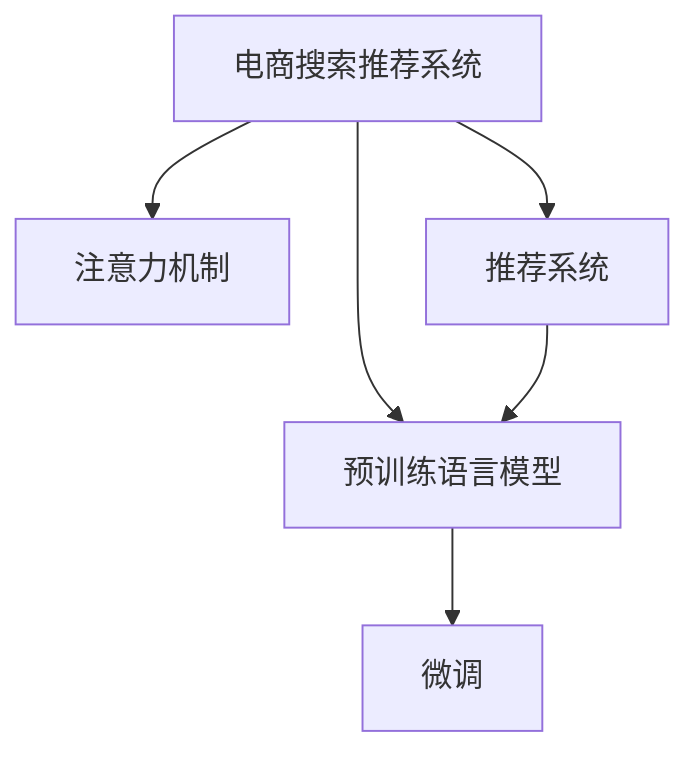

                 

## 1. 背景介绍

随着电子商务的飞速发展，电商搜索推荐系统已经成为支撑电商业务的核心基础设施，其性能直接影响用户体验和商家转化率。传统的搜索推荐系统大多基于规则或基于机器学习的特征工程范式进行设计，存在泛化能力差、响应速度慢、推荐结果单调等问题。为解决这些问题，电商领域亟需引入更具智能化的解决方案，以提升搜索推荐系统的精准度、个性化和实时性。

AI大模型的涌现，尤其是预训练语言模型如BERT、GPT-3等的兴起，为电商搜索推荐业务带来了全新的创新思路。本文将深入探讨AI大模型在电商搜索推荐中的创新应用，旨在为电商企业提供实用的技术指导和实践建议，助力其业务创新与升级。

## 2. 核心概念与联系

### 2.1 核心概念概述

为更好地理解AI大模型在电商搜索推荐中的应用，本节将介绍几个关键概念：

- **大语言模型（Large Language Model, LLM）**：以BERT、GPT系列模型为代表，能够通过大规模无标签数据预训练，学习到丰富的语言知识，具备强大的文本理解与生成能力。
- **预训练与微调（Pre-training & Fine-tuning）**：预训练是指在大规模无标签文本数据上自监督学习语言模型，微调则是在预训练模型的基础上，通过有监督学习优化模型在特定任务上的性能。
- **注意力机制（Attention Mechanism）**：一种从文本序列中筛选重要信息，提高模型理解能力的机制，被广泛应用于各种自然语言处理任务中。
- **推荐系统（Recommendation System）**：通过分析用户行为、产品特征等数据，为用户推荐符合其兴趣的产品或服务。
- **电商搜索推荐系统（E-commerce Search & Recommendation System）**：针对电商场景的推荐系统，通过搜索查询、浏览记录、购买历史等用户数据，进行商品推荐和搜索结果排序，提高用户购物体验。

这些核心概念之间的逻辑关系可以通过以下Mermaid流程图来展示：



这个流程图展示了大语言模型、注意力机制、推荐系统在电商搜索推荐中的应用关系：

1. 电商搜索推荐系统利用预训练语言模型进行文本处理和理解，引入注意力机制提高理解能力，并结合推荐系统算法为用户推荐商品。
2. 预训练语言模型通过微调能够适应特定电商任务，提高推荐系统的精准度和个性化。

## 3. 核心算法原理 & 具体操作步骤

### 3.1 算法原理概述

AI大模型在电商搜索推荐中的应用主要依赖于其在自然语言处理(NLP)中的强大能力，通过预训练与微调的方式，学习并适应电商领域的特定任务。算法原理主要包括以下几个步骤：

1. **预训练**：在无标签的电商领域数据上，如商品描述、用户评论、搜索查询等，使用自监督学习任务（如语言模型、掩码语言模型）对大语言模型进行预训练，学习到通用的语言表示。
2. **微调**：在电商搜索推荐任务上，收集少量的标注数据，对预训练模型进行有监督微调，优化模型在特定电商任务上的表现。
3. **注意力机制**：在微调过程中引入注意力机制，引导模型关注商品描述、用户行为等关键信息，提升推荐系统的精准度和个性化。

### 3.2 算法步骤详解

基于AI大模型在电商搜索推荐中的应用，以下详细介绍算法步骤：

**Step 1: 数据准备与预处理**

1. **数据集准备**：收集电商领域的文本数据，如商品描述、用户评论、搜索查询等，进行清洗和预处理。
2. **文本分词**：使用NLTK、SpaCy等库对文本进行分词，去除停用词和标点符号。
3. **构建词典**：对分词后的文本构建词典，便于模型处理。

**Step 2: 预训练模型选择与微调**

1. **选择预训练模型**：根据任务需求选择合适的预训练模型，如BERT、GPT-3等。
2. **微调设置**：设置学习率、批次大小、优化器等参数。
3. **微调训练**：在电商领域数据集上对预训练模型进行微调，优化特定任务的表现。

**Step 3: 注意力机制引入**

1. **注意力模型设计**：设计注意力模型，使用注意力权重筛选重要特征。
2. **模型融合**：将注意力模型与电商推荐系统算法（如协同过滤、深度学习推荐算法）相结合，提升推荐精度。

**Step 4: 结果评估与优化**

1. **评估指标**：设计评估指标，如精确度、召回率、F1值等，评估模型性能。
2. **模型优化**：根据评估结果，调整超参数，优化模型表现。

### 3.3 算法优缺点

基于AI大模型的电商搜索推荐系统具有以下优点：

1. **泛化能力强**：AI大模型通过预训练，学习到通用的语言表示，能够在不同任务上实现跨领域的迁移。
2. **精准度提升**：通过微调和注意力机制，能够更好地理解用户需求和商品特征，提高推荐系统的精准度。
3. **实时性高**：AI大模型推理速度快，能够实时响应用户查询，提升用户体验。
4. **个性化强**：AI大模型能够学习用户行为特征，提供个性化的推荐服务。

同时，该方法也存在一定的局限性：

1. **数据需求高**：预训练与微调需要大量的数据，对电商企业的标注成本和数据存储能力提出了较高要求。
2. **模型复杂度高**：AI大模型的计算复杂度高，对硬件资源要求较高。
3. **对抗攻击风险**：模型可能被对抗样本攻击，导致推荐结果偏离真实需求。
4. **可解释性不足**：AI大模型作为“黑盒”模型，其推荐过程缺乏可解释性，难以进行调试和优化。

尽管存在这些局限性，但AI大模型在电商搜索推荐中的应用前景广阔，值得进一步探索和优化。

### 3.4 算法应用领域

AI大模型在电商搜索推荐中的应用主要体现在以下几个方面：

1. **商品推荐**：通过分析用户浏览、购买历史等数据，推荐用户感兴趣的商品。
2. **搜索排序**：根据用户查询，推荐相关商品，提高搜索效果。
3. **个性化广告**：根据用户行为，推送个性化广告，提高广告转化率。
4. **智能客服**：通过自然语言理解技术，提供智能客服服务，解决用户疑问。

除了上述这些经典应用外，AI大模型还可创新性地应用于更多场景，如跨领域知识图谱、用户情感分析、风险预警等，为电商企业提供更为全面、智能的服务解决方案。

## 4. 数学模型和公式 & 详细讲解 & 举例说明

### 4.1 数学模型构建

在电商搜索推荐系统中，可以使用大语言模型进行商品描述和用户评论的语义分析。以BERT为例，假设电商领域有$N$个商品，每个商品的描述为$x_i$，用户评论为$y_i$，构建如下数学模型：

$$
\hat{y}_i = \text{BERT}(x_i; \theta)
$$

其中，$\theta$为BERT模型的参数，$\hat{y}_i$为模型预测的评论情感标签。

### 4.2 公式推导过程

在电商搜索推荐系统中，可以设计多个任务，如商品评论情感分析、商品相似度计算、用户兴趣标签预测等。以商品评论情感分析为例，可以构建如下数学模型：

$$
\max_{c \in \{0,1\}} \sum_{i=1}^N \text{BERT}(x_i; \theta) \cdot y_i \cdot c
$$

其中，$y_i$为商品的情感标签，$c$为训练标签，模型通过最大化损失函数来预测商品情感。

### 4.3 案例分析与讲解

假设电商企业有$N$个商品，每个商品的描述为$x_i$，用户评论为$y_i$。可以使用预训练的BERT模型进行情感分析，构建数学模型：

$$
\hat{y}_i = \text{BERT}(x_i; \theta)
$$

其中，$\theta$为BERT模型的参数，$\hat{y}_i$为模型预测的评论情感标签。

训练时，可以定义损失函数：

$$
L(\theta) = -\frac{1}{N} \sum_{i=1}^N \ell(\text{BERT}(x_i; \theta), y_i)
$$

其中，$\ell$为交叉熵损失函数。

使用梯度下降法对模型进行训练，更新参数$\theta$：

$$
\theta \leftarrow \theta - \eta \nabla_{\theta} L(\theta)
$$

其中，$\eta$为学习率。

训练完成后，可以在新商品上使用微调的BERT模型进行情感分析，评估模型性能。

## 5. 项目实践：代码实例和详细解释说明

### 5.1 开发环境搭建

在进行电商搜索推荐系统开发前，需要准备相应的开发环境：

1. **安装Python**：从官网下载Python安装包，进行安装。
2. **安装PyTorch**：使用pip命令安装PyTorch，例如：`pip install torch torchvision torchaudio`。
3. **安装Transformers库**：使用pip命令安装Transformers库，例如：`pip install transformers`。
4. **准备数据集**：收集电商领域的数据集，并进行预处理。

### 5.2 源代码详细实现

以下是使用BERT进行电商搜索推荐系统的Python代码实现：

```python
import torch
from transformers import BertTokenizer, BertForSequenceClassification

# 加载预训练BERT模型和tokenizer
model_name = 'bert-base-uncased'
tokenizer = BertTokenizer.from_pretrained(model_name)
model = BertForSequenceClassification.from_pretrained(model_name, num_labels=2)

# 数据集预处理
# 1. 构建词典
# 2. 分词
# 3. 构建输入序列

# 加载数据集
train_data = ...
test_data = ...

# 定义模型
model.train()

# 定义损失函数和优化器
loss_fn = torch.nn.CrossEntropyLoss()
optimizer = torch.optim.Adam(model.parameters(), lr=2e-5)

# 定义训练函数
def train_epoch(model, data_loader, optimizer):
    model.train()
    total_loss = 0
    for batch in data_loader:
        inputs, labels = batch
        labels = labels.to(device)
        outputs = model(inputs, labels=labels)
        loss = loss_fn(outputs, labels)
        total_loss += loss.item()
        optimizer.zero_grad()
        loss.backward()
        optimizer.step()
    return total_loss / len(data_loader)

# 定义评估函数
def evaluate(model, data_loader):
    model.eval()
    total_correct = 0
    total_eval = 0
    for batch in data_loader:
        inputs, labels = batch
        labels = labels.to(device)
        outputs = model(inputs)
        _, preds = torch.max(outputs, 1)
        total_correct += (preds == labels).sum().item()
        total_eval += len(labels)
    return total_correct / total_eval

# 训练模型
epochs = 3
batch_size = 32
device = torch.device('cuda' if torch.cuda.is_available() else 'cpu')
for epoch in range(epochs):
    train_loss = train_epoch(model, train_data_loader, optimizer)
    test_correct = evaluate(model, test_data_loader)
    print(f'Epoch {epoch+1}, train loss: {train_loss:.3f}, test accuracy: {test_correct:.3f}')

```

### 5.3 代码解读与分析

以上代码实现了使用BERT进行电商搜索推荐系统的训练和评估。其中，模型训练部分主要包含以下几个步骤：

1. **加载预训练模型和tokenizer**：使用Transformers库加载预训练的BERT模型和tokenizer。
2. **数据集预处理**：对电商领域的数据集进行分词、构建词典等预处理操作。
3. **定义模型、损失函数和优化器**：使用BertForSequenceClassification定义模型，使用交叉熵损失函数和Adam优化器。
4. **定义训练函数和评估函数**：使用训练函数进行模型训练，使用评估函数计算模型准确度。
5. **训练模型**：在模型训练过程中，使用交叉熵损失函数计算损失，使用Adam优化器更新模型参数。

### 5.4 运行结果展示

在模型训练完成后，可以使用微调的BERT模型进行电商搜索推荐系统的实际应用。例如，在用户查询“T恤衫”时，可以通过微调的BERT模型对商品描述进行语义分析，返回与“T恤衫”相关的商品列表。

## 6. 实际应用场景

### 6.1 智能客服

电商企业可以利用AI大模型构建智能客服系统，提供7x24小时的客户服务。当客户咨询商品信息时，智能客服系统可以实时调用微调的BERT模型进行自然语言理解，提供准确的商品信息，提升客户体验。

### 6.2 个性化推荐

AI大模型可以分析用户浏览、购买历史等数据，通过微调BERT模型，学习用户行为特征，提供个性化推荐服务。例如，用户浏览过“T恤衫”，系统会推荐类似的“卫衣”、“T恤配饰”等商品。

### 6.3 商品搜索排序

在用户搜索商品时，AI大模型可以分析用户的搜索查询，通过微调BERT模型，提供更精准的搜索结果排序。例如，用户搜索“T恤衫”时，系统会推荐与“T恤衫”相关的商品，并按照用户偏好排序。

### 6.4 未来应用展望

未来，AI大模型在电商搜索推荐中的应用将更加广泛，以下是一些未来应用展望：

1. **跨领域知识图谱**：通过AI大模型构建电商领域的知识图谱，提供更全面的商品信息，提升搜索推荐效果。
2. **用户情感分析**：利用AI大模型进行用户情感分析，优化推荐算法，提供更符合用户情感需求的推荐服务。
3. **风险预警**：通过AI大模型分析用户行为，预测潜在的风险，提高电商平台的安全性。

## 7. 工具和资源推荐

### 7.1 学习资源推荐

为了帮助开发者掌握AI大模型在电商搜索推荐中的应用，以下是一些优质的学习资源：

1. **《Transformer从原理到实践》系列博文**：介绍Transformer原理、BERT模型、微调技术等前沿话题，涵盖电商搜索推荐系统的开发。
2. **CS224N《深度学习自然语言处理》课程**：斯坦福大学开设的NLP明星课程，涵盖NLP基础知识和经典模型，适合初学者。
3. **《Natural Language Processing with Transformers》书籍**：介绍如何使用Transformers库进行NLP任务开发，涵盖电商搜索推荐系统的微调方法。
4. **HuggingFace官方文档**：提供海量预训练模型和完整的微调样例代码，是上手实践的必备资料。
5. **CLUE开源项目**：包含电商领域的数据集和基于微调的baseline模型，助力电商搜索推荐系统的开发。

### 7.2 开发工具推荐

以下是几款用于电商搜索推荐系统开发的常用工具：

1. **PyTorch**：基于Python的开源深度学习框架，支持动态计算图，适合快速迭代研究。
2. **TensorFlow**：由Google主导开发的开源深度学习框架，生产部署方便，适合大规模工程应用。
3. **Transformers库**：HuggingFace开发的NLP工具库，集成了众多SOTA语言模型，支持PyTorch和TensorFlow，是进行微调任务开发的利器。
4. **Weights & Biases**：模型训练的实验跟踪工具，可以记录和可视化模型训练过程中的各项指标，方便对比和调优。
5. **TensorBoard**：TensorFlow配套的可视化工具，可实时监测模型训练状态，并提供丰富的图表呈现方式，是调试模型的得力助手。
6. **Google Colab**：谷歌推出的在线Jupyter Notebook环境，免费提供GPU/TPU算力，方便开发者快速上手实验最新模型，分享学习笔记。

### 7.3 相关论文推荐

以下是几篇奠基性的相关论文，推荐阅读：

1. **Attention is All You Need**：提出Transformer结构，开启了NLP领域的预训练大模型时代。
2. **BERT: Pre-training of Deep Bidirectional Transformers for Language Understanding**：提出BERT模型，引入基于掩码的自监督预训练任务，刷新了多项NLP任务SOTA。
3. **Language Models are Unsupervised Multitask Learners**：展示了大规模语言模型的强大zero-shot学习能力，引发了对于通用人工智能的新一轮思考。
4. **Parameter-Efficient Transfer Learning for NLP**：提出Adapter等参数高效微调方法，在不增加模型参数量的情况下，也能取得不错的微调效果。
5. **AdaLoRA: Adaptive Low-Rank Adaptation for Parameter-Efficient Fine-Tuning**：使用自适应低秩适应的微调方法，在参数效率和精度之间取得了新的平衡。

这些论文代表了大语言模型微调技术的发展脉络。通过学习这些前沿成果，可以帮助研究者把握学科前进方向，激发更多的创新灵感。

## 8. 总结：未来发展趋势与挑战

### 8.1 总结

本文对AI大模型在电商搜索推荐中的应用进行了全面系统的介绍。首先阐述了电商搜索推荐系统面临的挑战以及AI大模型的优势，明确了AI大模型在电商业务中的重要地位。其次，从原理到实践，详细讲解了AI大模型的预训练、微调、注意力机制等关键技术，给出了电商搜索推荐系统的完整代码实现。同时，本文还广泛探讨了AI大模型在电商领域的应用前景，展示了其广泛的应用价值。

通过本文的系统梳理，可以看到，AI大模型在电商搜索推荐系统中具备强大的智能能力和应用潜力，为电商企业提供了实用的技术指导和实践建议，助力其业务创新与升级。未来，伴随AI大模型的进一步演进，电商搜索推荐系统必将在用户体验、个性化推荐、实时性等方面迈上新的台阶，为电商企业带来更高的商业价值。

### 8.2 未来发展趋势

展望未来，AI大模型在电商搜索推荐系统中的应用将呈现以下几个发展趋势：

1. **模型规模持续增大**：随着算力成本的下降和数据规模的扩张，预训练语言模型的参数量还将持续增长。超大模型的语言表示能力更强，有助于提高推荐系统的精准度。
2. **微调方法日趋多样**：未来将涌现更多参数高效和计算高效的微调方法，如Prefix-Tuning、LoRA等，在减小计算资源消耗的同时，提升微调精度。
3. **持续学习成为常态**：为了适应不断变化的用户需求和商品特征，微调模型需要持续学习新知识，保持性能的稳定性。
4. **少样本学习和零样本学习**：利用大模型的语言理解能力，通过巧妙的任务描述，在更少的标注样本下也能实现理想的推荐效果。
5. **多模态信息融合**：结合视觉、语音等多模态信息，提升电商搜索推荐系统的全面性和智能性。
6. **融合因果和对比学习范式**：通过引入因果推断和对比学习思想，增强推荐系统的因果关系和鲁棒性。
7. **引入更多先验知识**：将符号化的先验知识（如知识图谱、逻辑规则等）与神经网络模型进行融合，提升推荐系统的可信度和安全性。

这些趋势凸显了AI大模型在电商搜索推荐系统中的广阔前景，为电商企业提供了更多技术创新和业务升级的机会。

### 8.3 面临的挑战

尽管AI大模型在电商搜索推荐系统中具有强大的应用潜力，但在实际落地应用中仍面临诸多挑战：

1. **标注成本瓶颈**：预训练与微调需要大量的数据，对电商企业的标注成本和数据存储能力提出了较高要求。
2. **模型鲁棒性不足**：当前AI大模型的泛化能力仍然有限，面对域外数据时容易产生泛化误差，需要进一步提升模型的鲁棒性。
3. **计算资源消耗高**：AI大模型的计算复杂度高，对硬件资源要求较高，需要优化资源消耗，提升计算效率。
4. **对抗攻击风险**：模型可能被对抗样本攻击，导致推荐结果偏离真实需求，需要加强模型的抗攻击能力。
5. **可解释性不足**：AI大模型作为“黑盒”模型，其推荐过程缺乏可解释性，难以进行调试和优化。
6. **安全性有待保障**：预训练语言模型难免会学习到有偏见、有害的信息，需要采取措施防止恶意用途，确保输出的安全性。

这些挑战需要电商企业在实际应用中不断优化和改进，才能充分发挥AI大模型的优势，实现业务创新与升级。

### 8.4 研究展望

面对AI大模型在电商搜索推荐系统中的应用挑战，未来的研究需要在以下几个方面寻求新的突破：

1. **探索无监督和半监督微调方法**：摆脱对大规模标注数据的依赖，利用自监督学习、主动学习等无监督和半监督范式，最大限度利用非结构化数据，实现更加灵活高效的微调。
2. **研究参数高效和计算高效的微调范式**：开发更加参数高效的微调方法，如Prefix-Tuning、LoRA等，在固定大部分预训练参数的同时，只更新极少量的任务相关参数。同时优化微调模型的计算图，减少前向传播和反向传播的资源消耗，实现更加轻量级、实时性的部署。
3. **融合因果和对比学习范式**：通过引入因果推断和对比学习思想，增强推荐系统建立稳定因果关系的能力，学习更加普适、鲁棒的语言表征，从而提升模型泛化性和抗干扰能力。
4. **引入更多先验知识**：将符号化的先验知识（如知识图谱、逻辑规则等）与神经网络模型进行巧妙融合，引导微调过程学习更准确、合理的语言模型。同时加强不同模态数据的整合，实现视觉、语音等多模态信息与文本信息的协同建模。
5. **结合因果分析和博弈论工具**：将因果分析方法引入微调模型，识别出模型决策的关键特征，增强输出解释的因果性和逻辑性。借助博弈论工具刻画人机交互过程，主动探索并规避模型的脆弱点，提高系统稳定性。
6. **纳入伦理道德约束**：在模型训练目标中引入伦理导向的评估指标，过滤和惩罚有偏见、有害的输出倾向。同时加强人工干预和审核，建立模型行为的监管机制，确保输出符合人类价值观和伦理道德。

这些研究方向将进一步提升AI大模型在电商搜索推荐系统中的性能和应用范围，为电商企业带来更高的商业价值。

## 9. 附录：常见问题与解答

**Q1：AI大模型在电商搜索推荐系统中是否可以仅使用文本数据？**

A: 是的，AI大模型可以仅使用文本数据进行电商搜索推荐系统的训练和微调。在电商领域，商品描述、用户评论等文本数据是主要的信息来源。通过预训练和微调，AI大模型能够学习到商品和用户的行为特征，从而提高推荐系统的精准度和个性化。

**Q2：AI大模型在电商搜索推荐系统中是否需要高精度的标注数据？**

A: AI大模型在电商搜索推荐系统中对标注数据的需求相对较低。预训练阶段可以使用大规模的无标签数据，通过自监督学习任务（如语言模型、掩码语言模型）进行训练。在微调阶段，使用少量的标注数据即可对预训练模型进行优化，提升模型在特定电商任务上的表现。

**Q3：AI大模型在电商搜索推荐系统中是否需要高性能的硬件设备？**

A: AI大模型在电商搜索推荐系统中需要高性能的硬件设备，如GPU/TPU等，以支持大规模模型的训练和推理。预训练和微调模型的计算复杂度较高，需要高效的硬件资源才能实现实时响应。

**Q4：AI大模型在电商搜索推荐系统中是否存在对抗攻击风险？**

A: AI大模型在电商搜索推荐系统中可能存在对抗攻击风险。对抗样本攻击可能导致模型输出错误的推荐结果，因此需要采取相应的防御措施，如对抗训练、模型扰动等。

**Q5：AI大模型在电商搜索推荐系统中是否具有可解释性？**

A: AI大模型在电商搜索推荐系统中通常不具备可解释性。作为“黑盒”模型，其决策过程难以解释，需要通过模型扰动、模型可视化等手段，增强模型的可解释性，以便于调试和优化。

---

作者：禅与计算机程序设计艺术 / Zen and the Art of Computer Programming

