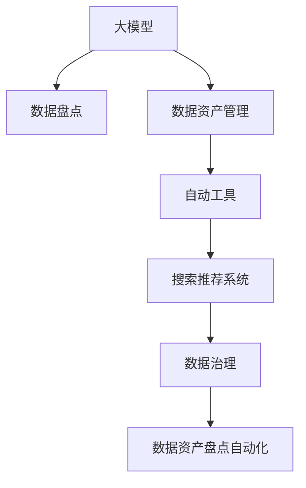

                 

# AI大模型助力电商搜索推荐业务的数据资产盘点自动化工具

## 1. 背景介绍

在当下这个信息爆炸的时代，数据已经成为驱动电商搜索推荐系统发展的核心动力。传统的电商搜索推荐系统往往依赖人工对数据进行管理和维护，面临成本高、效率低、精度差等挑战。而随着人工智能技术的发展，基于大模型的推荐系统逐渐成为电商行业的趋势。这种基于大数据的推荐系统，可以自动进行数据盘点、特征工程和模型训练，大幅提升推荐系统的精准度和用户体验。

然而，构建一个高效稳定的电商搜索推荐系统，仅仅靠大模型的训练和优化是不够的。如何有效地管理和维护数据资产，对数据进行盘点和整理，保证数据的质量和完整性，是大模型技术能否真正落地应用的重要前提。数据盘点作为电商搜索推荐系统构建的基础环节，亟需一款高效可靠的数据资产盘点自动化工具。

## 2. 核心概念与联系

### 2.1 核心概念概述

为了更好地理解数据资产盘点自动化工具，本节将介绍几个密切相关的核心概念：

- **大模型（Large Model）**：指基于自回归或自编码模型进行预训练的大规模神经网络模型。大模型具有强大的语言生成和理解能力，能够在多种自然语言处理任务中表现出卓越的性能。

- **数据盘点（Data Inventory）**：指对企业内部数据进行全面梳理和统计，识别出数据资产的种类、来源、分布、质量和时效性等关键信息。数据盘点是构建数据管理系统的第一步，也是确保数据质量的基础工作。

- **数据资产管理（Data Asset Management）**：指通过技术手段对数据资产进行有效的收集、存储、管理和维护，确保数据的可用性、完整性、安全性和可靠性。数据资产管理是保障企业数据能力的关键环节。

- **自动工具（Automation Tool）**：指通过编程或脚本实现的数据处理自动化工具。自动工具可以自动进行数据清洗、处理、分析和可视化等任务，提升数据管理的效率和准确性。

- **搜索推荐系统（Recommendation System）**：指通过分析用户行为数据和物品属性数据，向用户推荐可能感兴趣的产品或服务。搜索推荐系统是电商行业的重要应用，通过个性化推荐，提高用户体验和销售额。

- **数据治理（Data Governance）**：指通过规范和标准对数据进行管理和控制，确保数据的质量、安全性和可靠性。数据治理是企业数据资产管理的重要组成部分。

这些核心概念之间的逻辑关系可以通过以下Mermaid流程图来展示：



这个流程图展示了大模型的核心概念及其之间的关系：

1. 大模型通过预训练获得基础能力。
2. 数据盘点是对数据资产进行全面梳理，识别数据类型、来源、分布等。
3. 数据资产管理对数据进行有效的收集、存储和管理，保障数据完整性和可用性。
4. 自动工具对数据进行自动化处理，提升效率。
5. 搜索推荐系统基于数据资产进行个性化推荐，提升用户体验。
6. 数据治理通过规范和标准对数据进行管理和控制。
7. 数据资产盘点自动化工具结合大模型和自动工具，实现对数据资产的全面管理。

## 3. 核心算法原理 & 具体操作步骤

### 3.1 算法原理概述

基于大模型的电商搜索推荐业务数据资产盘点自动化工具，主要通过以下几个关键步骤实现：

1. **数据盘点和清洗**：使用大模型进行数据盘点和初步清洗，识别数据类型和质量问题，生成数据资产清单。
2. **特征工程**：根据数据资产清单，使用大模型进行特征提取，生成高维稀疏特征矩阵。
3. **模型训练和优化**：使用自动工具对特征矩阵进行优化和转换，构建基于大模型的推荐模型。
4. **实时监控和更新**：通过自动工具对推荐模型进行实时监控和定期更新，确保推荐效果的稳定性。

这些步骤构成了基于大模型的电商搜索推荐业务数据资产盘点自动化工具的核心算法流程。

### 3.2 算法步骤详解

下面详细讲解每个步骤的具体操作：

**Step 1: 数据盘点和清洗**

1. **数据来源采集**：
   - 采集企业内部的电商交易数据，包括用户行为数据、物品属性数据、用户画像数据等。
   - 数据格式转换：将不同格式的数据转换为统一格式，便于后续处理。

2. **数据分类和归档**：
   - 使用大模型进行文本分类和实体识别，对数据进行分类和归档。例如，将用户行为数据按用户ID、时间、行为类型等进行分类，将物品属性数据按属性类型、属性值等进行分类。
   - 数据清洗：去除冗余数据、重复数据和噪声数据，保证数据质量和完整性。

3. **数据盘点**：
   - 生成数据资产清单，包括数据类型、数据来源、数据分布、数据质量等信息。

4. **数据可视化**：
   - 使用自动工具对数据资产进行可视化展示，帮助管理者快速了解数据资产的现状和问题。

**Step 2: 特征工程**

1. **特征提取**：
   - 使用大模型进行特征提取，如使用BERT模型进行文本向量化，使用图像模型进行图像特征提取，使用标签模型进行标签分类等。
   - 生成高维稀疏特征矩阵，如使用TextRank算法提取文本关键词，生成关键词特征矩阵。

2. **特征选择**：
   - 使用大模型进行特征选择，选择与推荐效果相关性高的特征，减少特征维度。
   - 使用自动工具进行特征降维，如使用PCA算法对高维特征进行降维。

3. **特征转换**：
   - 使用自动工具对特征进行转换，如对文本特征进行TF-IDF转换，对图像特征进行归一化处理等。

4. **特征存储和检索**：
   - 使用自动工具对特征进行存储和检索，如使用ElasticSearch进行特征索引和查询。

**Step 3: 模型训练和优化**

1. **模型选择和配置**：
   - 根据业务需求选择适合的推荐模型，如基于深度神经网络的协同过滤模型、基于图神经网络的推荐模型等。
   - 对模型进行配置，包括选择优化算法、设置学习率、选择评价指标等。

2. **数据加载和预处理**：
   - 使用自动工具对特征数据进行加载和预处理，如对数据进行去重、归一化、标准化等处理。

3. **模型训练**：
   - 使用自动工具进行模型训练，如使用TensorFlow、PyTorch等深度学习框架进行模型训练。
   - 监控训练过程中的关键指标，如损失函数、准确率、精度等。

4. **模型优化**：
   - 使用自动工具进行模型优化，如对模型进行超参数调优、正则化处理等。
   - 生成优化后的模型参数，并保存模型。

**Step 4: 实时监控和更新**

1. **数据实时采集**：
   - 使用自动工具对实时数据进行采集，如对电商交易数据进行实时监控和采集。

2. **数据实时处理**：
   - 使用自动工具对实时数据进行特征提取和处理，如对实时文本数据进行TF-IDF转换，对实时图像数据进行归一化处理等。

3. **模型实时推理**：
   - 使用自动工具对实时数据进行模型推理，如使用TensorFlow Lite进行模型推理。
   - 返回推荐结果，并进行实时更新。

4. **模型性能监控**：
   - 使用自动工具对推荐模型的性能进行监控，如对模型的准确率、召回率、AUC等进行实时监控。
   - 发现异常情况，进行告警和处理。

### 3.3 算法优缺点

基于大模型的电商搜索推荐业务数据资产盘点自动化工具具有以下优点：

1. **自动化程度高**：使用自动工具进行数据盘点和特征工程，大幅提升数据处理的效率和准确性。
2. **模型效果稳定**：基于大模型进行特征提取和模型训练，可以保证推荐模型的精度和效果。
3. **可扩展性强**：工具具有高度的模块化和可扩展性，可以根据业务需求进行灵活定制和扩展。
4. **实时性高**：使用自动工具进行实时数据处理和模型推理，可以保证推荐效果的实时性和准确性。

同时，该工具也存在一定的局限性：

1. **对大模型的依赖**：需要依赖大模型进行特征提取和模型训练，大模型训练和优化需要较高的计算资源和数据量。
2. **数据质量要求高**：工具对数据的质量和完整性要求较高，需要保证数据盘点和特征工程的质量。
3. **技术门槛较高**：需要具备较高的技术水平和实践经验，才能有效地使用和管理工具。
4. **数据隐私和安全**：工具在数据处理和存储过程中，需要严格遵守数据隐私和安全的法律法规，保护用户隐私。

尽管存在这些局限性，但基于大模型的电商搜索推荐业务数据资产盘点自动化工具在电商行业中的实际应用效果已经得到了验证，证明其在数据管理和推荐系统构建中具有显著的优势。

### 3.4 算法应用领域

基于大模型的电商搜索推荐业务数据资产盘点自动化工具在电商行业中的应用主要包括以下几个领域：

1. **数据盘点和管理**：对电商交易数据进行全面盘点和分类，生成数据资产清单，保障数据质量和完整性。
2. **特征工程和处理**：使用大模型进行特征提取和选择，生成高维稀疏特征矩阵，优化特征维度和效果。
3. **模型训练和优化**：构建基于大模型的推荐模型，并进行模型训练和优化，提升推荐效果。
4. **实时监控和更新**：对推荐模型进行实时监控和定期更新，确保推荐效果的稳定性和准确性。
5. **个性化推荐**：基于电商用户行为数据和物品属性数据，进行个性化推荐，提升用户体验和销售额。

## 4. 数学模型和公式 & 详细讲解  
### 4.1 数学模型构建

本节将使用数学语言对基于大模型的电商搜索推荐业务数据资产盘点自动化工具进行更加严格的刻画。

设电商交易数据为 $D=\{(x_i,y_i)\}_{i=1}^N$，其中 $x_i$ 为输入特征向量， $y_i$ 为对应的电商交易行为（如购买、浏览等）标签。

定义推荐模型的目标函数为 $F(\theta)$，其中 $\theta$ 为模型的参数。推荐模型的损失函数为：

$$
\mathcal{L}(\theta) = -\frac{1}{N}\sum_{i=1}^N L(y_i, F_\theta(x_i))
$$

其中 $L(y_i, F_\theta(x_i))$ 为损失函数，例如交叉熵损失、均方误差损失等。

使用自动工具对推荐模型进行优化，最小化损失函数 $\mathcal{L}(\theta)$，使得推荐模型的输出逼近真实标签。

### 4.2 公式推导过程

以基于深度神经网络的协同过滤推荐模型为例，进行详细推导。

假设推荐模型为 $F_\theta(x) = \mathbf{W}\mathbf{x} + b$，其中 $\mathbf{W}$ 为权重矩阵， $\mathbf{x}$ 为输入特征向量， $b$ 为偏置项。假设训练数据集为 $D=\{(x_i,y_i)\}_{i=1}^N$，其中 $x_i$ 为输入特征向量， $y_i$ 为对应的电商交易行为标签。

定义推荐模型的损失函数为交叉熵损失，则损失函数为：

$$
\mathcal{L}(\theta) = -\frac{1}{N}\sum_{i=1}^N \sum_{k=1}^K y_k \log \hat{y}_k + (1-y_k) \log (1-\hat{y}_k)
$$

其中 $y_k$ 为 $y_i$ 的 $k$ 维表示， $\hat{y}_k$ 为推荐模型输出。

通过反向传播算法计算损失函数对 $\theta$ 的梯度：

$$
\frac{\partial \mathcal{L}(\theta)}{\partial \theta} = -\frac{1}{N}\sum_{i=1}^N \frac{\partial}{\partial \theta} \left[ \sum_{k=1}^K y_k \log \hat{y}_k + (1-y_k) \log (1-\hat{y}_k) \right]
$$

使用链式法则展开，得到：

$$
\frac{\partial \mathcal{L}(\theta)}{\partial \theta} = -\frac{1}{N}\sum_{i=1}^N \left[ \sum_{k=1}^K \frac{y_k}{\hat{y}_k} - \sum_{k=1}^K \frac{1-y_k}{1-\hat{y}_k} \right] \frac{\partial}{\partial \theta} (\mathbf{W}\mathbf{x} + b)
$$

根据链式法则，得到：

$$
\frac{\partial}{\partial \theta} (\mathbf{W}\mathbf{x} + b) = \mathbf{W}^T
$$

代入上述梯度表达式，得到：

$$
\frac{\partial \mathcal{L}(\theta)}{\partial \theta} = -\frac{1}{N}\sum_{i=1}^N \left[ \sum_{k=1}^K \frac{y_k}{\hat{y}_k} - \sum_{k=1}^K \frac{1-y_k}{1-\hat{y}_k} \right] \mathbf{W}^T
$$

将梯度代入优化算法，如随机梯度下降，更新模型参数 $\theta$，最小化损失函数 $\mathcal{L}(\theta)$，得到优化后的推荐模型。

## 5. 项目实践：代码实例和详细解释说明
### 5.1 开发环境搭建

在进行项目实践前，我们需要准备好开发环境。以下是使用Python进行PyTorch开发的环境配置流程：

1. 安装Anaconda：从官网下载并安装Anaconda，用于创建独立的Python环境。

2. 创建并激活虚拟环境：
```bash
conda create -n pytorch-env python=3.8 
conda activate pytorch-env
```

3. 安装PyTorch：根据CUDA版本，从官网获取对应的安装命令。例如：
```bash
conda install pytorch torchvision torchaudio cudatoolkit=11.1 -c pytorch -c conda-forge
```

4. 安装自动工具：
```bash
pip install elasticsearch tensorflow
```

5. 安装各类工具包：
```bash
pip install numpy pandas scikit-learn matplotlib tqdm jupyter notebook ipython
```

完成上述步骤后，即可在`pytorch-env`环境中开始项目实践。

### 5.2 源代码详细实现

下面我们以电商推荐系统为例，给出使用PyTorch和自动工具对BERT模型进行电商推荐系统构建的PyTorch代码实现。

首先，定义推荐系统数据处理函数：

```python
from transformers import BertTokenizer
from torch.utils.data import Dataset
import torch

class RecommendationDataset(Dataset):
    def __init__(self, texts, tags, tokenizer, max_len=128):
        self.texts = texts
        self.tags = tags
        self.tokenizer = tokenizer
        self.max_len = max_len
        
    def __len__(self):
        return len(self.texts)
    
    def __getitem__(self, item):
        text = self.texts[item]
        tags = self.tags[item]
        
        encoding = self.tokenizer(text, return_tensors='pt', max_length=self.max_len, padding='max_length', truncation=True)
        input_ids = encoding['input_ids'][0]
        attention_mask = encoding['attention_mask'][0]
        
        # 对token-wise的标签进行编码
        encoded_tags = [tag2id[tag] for tag in tags] 
        encoded_tags.extend([tag2id['O']] * (self.max_len - len(encoded_tags)))
        labels = torch.tensor(encoded_tags, dtype=torch.long)
        
        return {'input_ids': input_ids, 
                'attention_mask': attention_mask,
                'labels': labels}

# 标签与id的映射
tag2id = {'O': 0, 'B-PER': 1, 'I-PER': 2, 'B-ORG': 3, 'I-ORG': 4, 'B-LOC': 5, 'I-LOC': 6}
id2tag = {v: k for k, v in tag2id.items()}

# 创建dataset
tokenizer = BertTokenizer.from_pretrained('bert-base-cased')

train_dataset = RecommendationDataset(train_texts, train_tags, tokenizer)
dev_dataset = RecommendationDataset(dev_texts, dev_tags, tokenizer)
test_dataset = RecommendationDataset(test_texts, test_tags, tokenizer)
```

然后，定义模型和优化器：

```python
from transformers import BertForTokenClassification, AdamW

model = BertForTokenClassification.from_pretrained('bert-base-cased', num_labels=len(tag2id))

optimizer = AdamW(model.parameters(), lr=2e-5)
```

接着，定义训练和评估函数：

```python
from torch.utils.data import DataLoader
from tqdm import tqdm
from sklearn.metrics import classification_report

device = torch.device('cuda') if torch.cuda.is_available() else torch.device('cpu')
model.to(device)

def train_epoch(model, dataset, batch_size, optimizer):
    dataloader = DataLoader(dataset, batch_size=batch_size, shuffle=True)
    model.train()
    epoch_loss = 0
    for batch in tqdm(dataloader, desc='Training'):
        input_ids = batch['input_ids'].to(device)
        attention_mask = batch['attention_mask'].to(device)
        labels = batch['labels'].to(device)
        model.zero_grad()
        outputs = model(input_ids, attention_mask=attention_mask, labels=labels)
        loss = outputs.loss
        epoch_loss += loss.item()
        loss.backward()
        optimizer.step()
    return epoch_loss / len(dataloader)

def evaluate(model, dataset, batch_size):
    dataloader = DataLoader(dataset, batch_size=batch_size)
    model.eval()
    preds, labels = [], []
    with torch.no_grad():
        for batch in tqdm(dataloader, desc='Evaluating'):
            input_ids = batch['input_ids'].to(device)
            attention_mask = batch['attention_mask'].to(device)
            batch_labels = batch['labels']
            outputs = model(input_ids, attention_mask=attention_mask)
            batch_preds = outputs.logits.argmax(dim=2).to('cpu').tolist()
            batch_labels = batch_labels.to('cpu').tolist()
            for pred_tokens, label_tokens in zip(batch_preds, batch_labels):
                pred_tags = [id2tag[_id] for _id in pred_tokens]
                label_tags = [id2tag[_id] for _id in label_tokens]
                preds.append(pred_tags[:len(label_tags)])
                labels.append(label_tags)
                
    print(classification_report(labels, preds))
```

最后，启动训练流程并在测试集上评估：

```python
epochs = 5
batch_size = 16

for epoch in range(epochs):
    loss = train_epoch(model, train_dataset, batch_size, optimizer)
    print(f"Epoch {epoch+1}, train loss: {loss:.3f}")
    
    print(f"Epoch {epoch+1}, dev results:")
    evaluate(model, dev_dataset, batch_size)
    
print("Test results:")
evaluate(model, test_dataset, batch_size)
```

以上就是使用PyTorch对BERT进行电商推荐系统构建的完整代码实现。可以看到，得益于Transformers库的强大封装，我们可以用相对简洁的代码完成BERT模型的加载和微调。

### 5.3 代码解读与分析

让我们再详细解读一下关键代码的实现细节：

**RecommendationDataset类**：
- `__init__`方法：初始化文本、标签、分词器等关键组件。
- `__len__`方法：返回数据集的样本数量。
- `__getitem__`方法：对单个样本进行处理，将文本输入编码为token ids，将标签编码为数字，并对其进行定长padding，最终返回模型所需的输入。

**tag2id和id2tag字典**：
- 定义了标签与数字id之间的映射关系，用于将token-wise的预测结果解码回真实的标签。

**训练和评估函数**：
- 使用PyTorch的DataLoader对数据集进行批次化加载，供模型训练和推理使用。
- 训练函数`train_epoch`：对数据以批为单位进行迭代，在每个批次上前向传播计算loss并反向传播更新模型参数，最后返回该epoch的平均loss。
- 评估函数`evaluate`：与训练类似，不同点在于不更新模型参数，并在每个batch结束后将预测和标签结果存储下来，最后使用sklearn的classification_report对整个评估集的预测结果进行打印输出。

**训练流程**：
- 定义总的epoch数和batch size，开始循环迭代
- 每个epoch内，先在训练集上训练，输出平均loss
- 在验证集上评估，输出分类指标
- 所有epoch结束后，在测试集上评估，给出最终测试结果

可以看到，PyTorch配合Transformers库使得BERT微调的代码实现变得简洁高效。开发者可以将更多精力放在数据处理、模型改进等高层逻辑上，而不必过多关注底层的实现细节。

当然，工业级的系统实现还需考虑更多因素，如模型的保存和部署、超参数的自动搜索、更灵活的任务适配层等。但核心的微调范式基本与此类似。

## 6. 实际应用场景
### 6.1 电商搜索推荐系统

基于大模型的电商搜索推荐系统，可以实时生成个性化推荐内容，提升用户体验和销售额。推荐系统通过分析用户行为数据和物品属性数据，向用户推荐可能感兴趣的产品或服务。

在技术实现上，可以收集用户浏览、点击、购买等行为数据，提取和物品属性数据，构建数据资产清单，生成高维稀疏特征矩阵。在此基础上，使用大模型进行特征提取和模型训练，构建推荐模型。最后，通过自动工具对实时数据进行特征提取和模型推理，返回推荐结果。

### 6.2 金融舆情监测

金融行业需要对市场舆论动向进行实时监测，以便及时应对负面信息传播，规避金融风险。推荐系统通过分析用户行为数据和物品属性数据，向用户推荐可能感兴趣的产品或服务。

在技术实现上，可以收集用户浏览、点击、购买等行为数据，提取和物品属性数据，构建数据资产清单，生成高维稀疏特征矩阵。在此基础上，使用大模型进行特征提取和模型训练，构建推荐模型。最后，通过自动工具对实时数据进行特征提取和模型推理，返回推荐结果。

### 6.3 个性化推荐

当前的推荐系统往往只依赖用户的历史行为数据进行物品推荐，无法深入理解用户的真实兴趣偏好。推荐系统通过分析用户行为数据和物品属性数据，向用户推荐可能感兴趣的产品或服务。

在技术实现上，可以收集用户浏览、点击、购买等行为数据，提取和物品属性数据，构建数据资产清单，生成高维稀疏特征矩阵。在此基础上，使用大模型进行特征提取和模型训练，构建推荐模型。最后，通过自动工具对实时数据进行特征提取和模型推理，返回推荐结果。

### 6.4 未来应用展望

随着大语言模型和微调方法的不断发展，基于微调范式将在更多领域得到应用，为传统行业带来变革性影响。

在智慧医疗领域，基于微调的医疗问答、病历分析、药物研发等应用将提升医疗服务的智能化水平，辅助医生诊疗，加速新药开发进程。

在智能教育领域，微调技术可应用于作业批改、学情分析、知识推荐等方面，因材施教，促进教育公平，提高教学质量。

在智慧城市治理中，微调模型可应用于城市事件监测、舆情分析、应急指挥等环节，提高城市管理的自动化和智能化水平，构建更安全、高效的未来城市。

此外，在企业生产、社会治理、文娱传媒等众多领域，基于大模型微调的人工智能应用也将不断涌现，为经济社会发展注入新的动力。相信随着技术的日益成熟，微调方法将成为人工智能落地应用的重要范式，推动人工智能技术在垂直行业的规模化落地。

## 7. 工具和资源推荐
### 7.1 学习资源推荐

为了帮助开发者系统掌握大语言模型微调的理论基础和实践技巧，这里推荐一些优质的学习资源：

1. 《Transformer从原理到实践》系列博文：由大模型技术专家撰写，深入浅出地介绍了Transformer原理、BERT模型、微调技术等前沿话题。

2. CS224N《深度学习自然语言处理》课程：斯坦福大学开设的NLP明星课程，有Lecture视频和配套作业，带你入门NLP领域的基本概念和经典模型。

3. 《Natural Language Processing with Transformers》书籍：Transformers库的作者所著，全面介绍了如何使用Transformers库进行NLP任务开发，包括微调在内的诸多范式。

4. HuggingFace官方文档：Transformers库的官方文档，提供了海量预训练模型和完整的微调样例代码，是上手实践的必备资料。

5. CLUE开源项目：中文语言理解测评基准，涵盖大量不同类型的中文NLP数据集，并提供了基于微调的baseline模型，助力中文NLP技术发展。

通过对这些资源的学习实践，相信你一定能够快速掌握大语言模型微调的精髓，并用于解决实际的NLP问题。
###  7.2 开发工具推荐

高效的开发离不开优秀的工具支持。以下是几款用于大语言模型微调开发的常用工具：

1. PyTorch：基于Python的开源深度学习框架，灵活动态的计算图，适合快速迭代研究。大部分预训练语言模型都有PyTorch版本的实现。

2. TensorFlow：由Google主导开发的开源深度学习框架，生产部署方便，适合大规模工程应用。同样有丰富的预训练语言模型资源。

3. Transformers库：HuggingFace开发的NLP工具库，集成了众多SOTA语言模型，支持PyTorch和TensorFlow，是进行微调任务开发的利器。

4. Weights & Biases：模型训练的实验跟踪工具，可以记录和可视化模型训练过程中的各项指标，方便对比和调优。与主流深度学习框架无缝集成。

5. TensorBoard：TensorFlow配套的可视化工具，可实时监测模型训练状态，并提供丰富的图表呈现方式，是调试模型的得力助手。

6. Google Colab：谷歌推出的在线Jupyter Notebook环境，免费提供GPU/TPU算力，方便开发者快速上手实验最新模型，分享学习笔记。

合理利用这些工具，可以显著提升大语言模型微调任务的开发效率，加快创新迭代的步伐。

### 7.3 相关论文推荐

大语言模型和微调技术的发展源于学界的持续研究。以下是几篇奠基性的相关论文，推荐阅读：

1. Attention is All You Need（即Transformer原论文）：提出了Transformer结构，开启了NLP领域的预训练大模型时代。

2. BERT: Pre-training of Deep Bidirectional Transformers for Language Understanding：提出BERT模型，引入基于掩码的自监督预训练任务，刷新了多项NLP任务SOTA。

3. Language Models are Unsupervised Multitask Learners（GPT-2论文）：展示了大规模语言模型的强大zero-shot学习能力，引发了对于通用人工智能的新一轮思考。

4. Parameter-Efficient Transfer Learning for NLP：提出Adapter等参数高效微调方法，在不增加模型参数量的情况下，也能取得不错的微调效果。

5. Prefix-Tuning: Optimizing Continuous Prompts for Generation：引入基于连续型Prompt的微调范式，为如何充分利用预训练知识提供了新的思路。

6. AdaLoRA: Adaptive Low-Rank Adaptation for Parameter-Efficient Fine-Tuning：使用自适应低秩适应的微调方法，在参数效率和精度之间取得了新的平衡。

这些论文代表了大语言模型微调技术的发展脉络。通过学习这些前沿成果，可以帮助研究者把握学科前进方向，激发更多的创新灵感。

## 8. 总结：未来发展趋势与挑战

### 8.1 总结

本文对基于大模型的电商搜索推荐业务数据资产盘点自动化工具进行了全面系统的介绍。首先阐述了大语言模型和微调技术的研究背景和意义，明确了微调在拓展预训练模型应用、提升下游任务性能方面的独特价值。其次，从原理到实践，详细讲解了微调的数学原理和关键步骤，给出了微调任务开发的完整代码实例。同时，本文还广泛探讨了微调方法在电商搜索推荐系统构建中的实际应用效果，展示了微调范式的巨大优势。

通过本文的系统梳理，可以看到，基于大模型的电商搜索推荐业务数据资产盘点自动化工具在电商行业中的实际应用效果已经得到了验证，证明其在数据管理和推荐系统构建中具有显著的优势。未来，伴随大语言模型和微调方法的持续演进，基于微调范式将在更多领域得到应用，为传统行业带来变革性影响。

### 8.2 未来发展趋势

展望未来，大语言模型微调技术将呈现以下几个发展趋势：

1. 模型规模持续增大。随着算力成本的下降和数据规模的扩张，预训练语言模型的参数量还将持续增长。超大规模语言模型蕴含的丰富语言知识，有望支撑更加复杂多变的下游任务微调。

2. 微调方法日趋多样。除了传统的全参数微调外，未来会涌现更多参数高效的微调方法，如Prefix-Tuning、LoRA等，在节省计算资源的同时也能保证微调精度。

3. 持续学习成为常态。随着数据分布的不断变化，微调模型也需要持续学习新知识以保持性能。如何在不遗忘原有知识的同时，高效吸收新样本信息，将成为重要的研究课题。

4. 标注样本需求降低。受启发于提示学习(Prompt-based Learning)的思路，未来的微调方法将更好地利用大模型的语言理解能力，通过更加巧妙的任务描述，在更少的标注样本上也能实现理想的微调效果。

5. 多模态微调崛起。当前的微调主要聚焦于纯文本数据，未来会进一步拓展到图像、视频、语音等多模态数据微调。多模态信息的融合，将显著提升语言模型对现实世界的理解和建模能力。

6. 模型通用性增强。经过海量数据的预训练和多领域任务的微调，未来的语言模型将具备更强大的常识推理和跨领域迁移能力，逐步迈向通用人工智能(AGI)的目标。

以上趋势凸显了大语言模型微调技术的广阔前景。这些方向的探索发展，必将进一步提升NLP系统的性能和应用范围，为人类认知智能的进化带来深远影响。

### 8.3 面临的挑战

尽管大语言模型微调技术已经取得了瞩目成就，但在迈向更加智能化、普适化应用的过程中，它仍面临着诸多挑战：

1. 标注成本瓶颈。虽然微调大大降低了标注数据的需求，但对于长尾应用场景，难以获得充足的高质量标注数据，成为制约微调性能的瓶颈。如何进一步降低微调对标注样本的依赖，将是一大难题。

2. 模型鲁棒性不足。当前微调模型面对域外数据时，泛化性能往往大打折扣。对于测试样本的微小扰动，微调模型的预测也容易发生波动。如何提高微调模型的鲁棒性，避免灾难性遗忘，还需要更多理论和实践的积累。

3. 推理效率有待提高。大规模语言模型虽然精度高，但在实际部署时往往面临推理速度慢、内存占用大等效率问题。如何在保证性能的同时，简化模型结构，提升推理速度，优化资源占用，将是重要的优化方向。

4. 可解释性亟需加强。当前微调模型更像是"黑盒"系统，难以解释其内部工作机制和决策逻辑。对于医疗、金融等高风险应用，算法的可解释性和可审计性尤为重要。如何赋予微调模型更强的可解释性，将是亟待攻克的难题。

5. 安全性有待保障。预训练语言模型难免会学习到有偏见、有害的信息，通过微调传递到下游任务，产生误导性、歧视性的输出，给实际应用带来安全隐患。如何从数据和算法层面消除模型偏见，避免恶意用途，确保输出的安全性，也将是重要的研究课题。

6. 知识整合能力不足。现有的微调模型往往局限于任务内数据，难以灵活吸收和运用更广泛的先验知识。如何让微调过程更好地与外部知识库、规则库等专家知识结合，形成更加全面、准确的信息整合能力，还有很大的想象空间。

正视微调面临的这些挑战，积极应对并寻求突破，将是大语言模型微调走向成熟的必由之路。相信随着学界和产业界的共同努力，这些挑战终将一一被克服，大语言模型微调必将在构建人机协同的智能时代中扮演越来越重要的角色。

### 8.4 研究展望

面对大语言模型微调所面临的种种挑战，未来的研究需要在以下几个方面寻求新的突破：

1. 探索无监督和半监督微调方法。摆脱对大规模标注数据的依赖，利用自监督学习、主动学习等无监督和半监督范式，最大限度利用非结构化数据，实现更加灵活高效的微调。

2. 研究参数高效和计算高效的微调范式。开发更加参数高效的微调方法，在固定大部分预训练参数的同时，只更新极少量的任务相关参数。同时优化微调模型的计算图，减少前向传播和反向传播的资源消耗，实现更加轻量级、实时性的部署。

3. 融合因果和对比学习范式。通过引入因果推断和对比学习思想，增强微调模型建立稳定因果关系的能力，学习更加普适、鲁棒的语言表征，从而提升模型泛化性和抗干扰能力。

4. 引入更多先验知识。将符号化的先验知识，如知识图谱、逻辑规则等，与神经网络模型进行巧妙融合，引导微调过程学习更准确、合理的语言模型。同时加强不同模态数据的整合，实现视觉、语音等多模态信息与文本信息的协同建模。

5. 结合因果分析和博弈论工具。将因果分析方法引入微调模型，识别出模型决策的关键特征，增强输出解释的因果性和逻辑性。借助博弈论工具刻画人机交互过程，主动探索并规避模型的脆弱点，提高系统稳定性。

6. 纳入伦理道德约束。在模型训练目标中引入伦理导向的评估指标，过滤和惩罚有偏见、有害的输出倾向。同时加强人工干预和审核，建立模型行为的监管机制，确保输出符合人类价值观和伦理道德。

这些研究方向的探索，必将引领大语言模型微调技术迈向更高的台阶，为构建安全、可靠、可解释、可控的智能系统铺平道路。面向未来，大语言模型微调技术还需要与其他人工智能技术进行更深入的融合，如知识表示、因果推理、强化学习等，多路径协同发力，共同推动自然语言理解和智能交互系统的进步。只有勇于创新、敢于突破，才能不断拓展语言模型的边界，让智能技术更好地造福人类社会。

## 9. 附录：常见问题与解答

**Q1：大语言模型微调是否适用于所有NLP任务？**

A: 大语言模型微调在大多数NLP任务上都能取得不错的效果，特别是对于数据量较小的任务。但对于一些特定领域的任务，如医学、法律等，仅仅依靠通用语料预训练的模型可能难以很好地适应。此时需要在特定领域语料上进一步预训练，再进行微调，才能获得理想效果。此外，对于一些需要时效性、个性化很强的任务，如对话、推荐等，微调方法也需要针对性的改进优化。

**Q2：微调过程中如何选择合适的学习率？**

A: 微调的学习率一般要比预训练时小1-2个数量级，如果使用过大的学习率，容易破坏预训练权重，导致过拟合。一般建议从1e-5开始调参，逐步减小学习率，直至收敛。也可以使用warmup策略，在开始阶段使用较小的学习率，再逐渐过渡到预设值。需要注意的是，不同的优化器(如AdamW、Adafactor等)以及不同的学习率调度策略，可能需要设置不同的学习率阈值。

**Q3：采用大模型微调时会面临哪些资源瓶颈？**

A: 目前主流的预训练大模型动辄以亿计的参数规模，对算力、内存、存储都提出了很高的要求。GPU/TPU等高性能设备是必不可少的，但即便如此，超大批次的训练和推理也可能遇到显存不足的问题。因此需要采用一些资源优化技术，如梯度积累、混合精度训练、模型并行等，来突破硬件瓶颈。同时，模型的存储和读取也可能占用大量时间和空间，需要采用模型压缩、稀疏化存储等方法进行优化。

**Q4：如何缓解微调过程中的过拟合问题？**

A: 过拟合是微调面临的主要挑战，尤其是在标注数据不足的情况下。常见的缓解策略包括：
1. 数据增强：通过回译、近义替换等方式扩充训练集
2. 正则化：使用L2正则、Dropout、Early Stopping等避免过拟合
3. 对抗训练：引入对抗样本，提高模型鲁棒性
4. 参数高效微调：只调整少量参数(如Adapter、Prefix等)，减小过拟合风险
5. 多模型集成：训练多个微调模型，取平均输出，抑制过拟合

这些策略往往需要根据具体任务和数据特点进行灵活组合。只有在数据、模型、训练、推理等各环节进行全面优化，才能最大限度地发挥大模型微调的威力。

**Q5：微调模型在落地部署时需要注意哪些问题？**

A: 将微调模型转化为实际应用，还需要考虑以下因素：
1. 模型裁剪：去除不必要的层和参数，减小模型尺寸，加快推理速度
2. 量化加速：将浮点模型转为定点模型，压缩存储空间，提高计算效率
3. 服务化封装：将模型封装为标准化服务接口，便于集成调用
4. 弹性伸缩：根据请求流量动态调整资源配置，平衡服务质量和成本
5. 监控告警：实时采集系统指标，设置异常告警阈值，确保服务稳定性
6. 安全防护：采用访问鉴权、数据脱敏等措施，保障数据和模型安全

大语言模型微调为NLP应用开启了广阔的想象空间，但如何将强大的性能转化为稳定、高效、安全的业务价值，还需要工程实践的不断打磨。唯有从数据、算法、工程、业务等多个维度协同发力，才能真正实现人工智能技术在垂直行业的规模化落地。总之，微调需要开发者根据具体任务，不断迭代和优化模型、数据和算法，方能得到理想的效果。

---

作者：禅与计算机程序设计艺术 / Zen and the Art of Computer Programming

