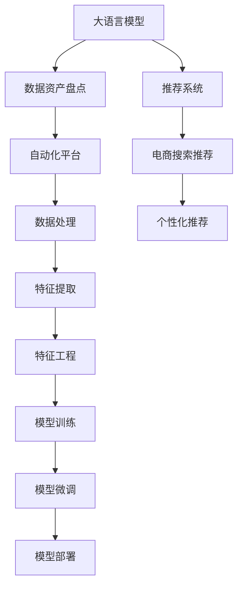

                 

## 1. 背景介绍

### 1.1 问题由来
随着电商平台的发展，商品信息变得愈发复杂，涉及多个维度的描述，如价格、品牌、分类、用户评论等。同时，用户在搜索时的需求也是动态变化的，如搜索意图、时序特征等。为了满足用户搜索需求，电商平台需要对海量商品数据进行实时处理，从中提取出相关特征并进行匹配推荐，其复杂度和计算量是巨大的。在这样的背景下，数据资产盘点自动化平台应运而生，旨在提高商品数据处理和推荐的效率。

然而，尽管数据资产盘点自动化平台在商品数据处理和推荐中取得了显著效果，但在实际应用过程中仍面临诸多挑战。一方面，平台需要在处理海量数据的同时保证推荐精准度；另一方面，需要适配不同用户需求，提供个性化推荐服务。

### 1.2 问题核心关键点
为了应对上述挑战，电商平台纷纷引入大模型技术进行优化。通过引入大语言模型（LLMs），平台能够更高效地处理海量商品数据，并根据用户搜索行为生成个性化推荐结果。但是，直接将大模型应用于电商平台仍面临诸多问题，如模型推理速度慢、模型与业务系统适配困难、数据隐私保护等。

为此，本文聚焦于如何将大语言模型技术引入数据资产盘点自动化平台，并进行功能优化，以解决电商平台中存在的推荐效率低、推荐精准度不足等问题。

## 2. 核心概念与联系

### 2.1 核心概念概述

为了更好地理解如何利用大语言模型优化电商平台搜索推荐业务，本节将介绍几个关键概念：

- **大语言模型（LLMs）**：以自回归（如GPT）或自编码（如BERT）模型为代表的大规模预训练语言模型。通过在海量无标签文本语料上进行预训练，学习通用的语言表示，具备强大的语言理解和生成能力。

- **数据资产盘点**：指对企业内部数据进行资产盘点，包括数据的收集、整理、存储、管理和应用，以支持企业业务的决策和运营。

- **自动化平台**：通过软件自动化技术，实现数据资产盘点过程的自动化处理，提高工作效率，减少人工干预，降低出错率。

- **推荐系统**：通过算法和模型，根据用户行为和需求，实时生成个性化推荐结果的系统。

- **电商搜索推荐**：指在电商平台中，通过搜索和推荐系统满足用户个性化需求的业务场景。

- **跨领域迁移学习**：指将一个领域学习到的知识迁移到另一个相关领域的机器学习范式。

这些概念之间的逻辑关系可以通过以下Mermaid流程图来展示：



这个流程图展示了大语言模型与其他关键概念之间的联系：

1. 大语言模型通过预训练学习通用的语言表示。
2. 数据资产盘点将数据整理和存储，为推荐系统提供数据支持。
3. 自动化平台通过软件技术，实现数据处理的自动化。
4. 推荐系统通过算法和模型，实现个性化推荐。
5. 电商搜索推荐专注于电商平台的推荐需求。
6. 数据处理包括特征提取和工程，为推荐系统提供预处理数据。
7. 模型训练和微调是推荐系统的核心部分，将通用语言知识迁移到推荐任务。
8. 模型部署将训练好的模型应用于实际业务场景。

## 3. 核心算法原理 & 具体操作步骤

### 3.1 算法原理概述

将大语言模型应用于电商平台搜索推荐业务，其核心思想是通过预训练模型对商品数据进行特征提取和理解，再结合用户搜索行为生成个性化推荐。具体流程包括：

1. **数据预处理**：对商品数据进行清洗、分词、去停用词等处理，转化为模型可接受的格式。
2. **特征提取**：利用预训练语言模型对商品数据进行特征提取，生成文本嵌入向量。
3. **用户行为分析**：收集用户搜索行为数据，利用大语言模型进行行为分析，提取用户意图和偏好。
4. **推荐生成**：将用户意图和商品特征进行匹配，生成个性化推荐结果。

### 3.2 算法步骤详解

以下是详细的操作步骤：

**Step 1: 数据预处理**

对商品数据进行清洗，去除无关信息，进行分词处理，提取关键特征。例如，将商品名称、描述、价格、分类等信息进行分词，去除停用词和标点符号，生成可用于模型训练的文本数据。

**Step 2: 特征提取**

利用预训练语言模型（如BERT、GPT等）对文本数据进行特征提取，生成文本嵌入向量。具体步骤如下：

1. **模型选择**：选择合适的大语言模型，如BERT-Base。
2. **模型加载**：从HuggingFace等平台下载预训练模型，并加载到系统中。
3. **特征提取**：将商品数据输入模型，进行前向传播计算，生成文本嵌入向量。

**Step 3: 用户行为分析**

收集用户搜索行为数据，提取用户意图和偏好。例如，用户搜索的关键词、浏览历史、点击记录等。利用大语言模型进行行为分析，生成用户意图标签和偏好向量。

**Step 4: 推荐生成**

将用户意图标签和商品特征向量进行匹配，生成个性化推荐结果。具体步骤如下：

1. **用户意图建模**：利用大语言模型对用户意图进行建模，生成意图标签。
2. **商品特征提取**：利用预训练语言模型对商品数据进行特征提取，生成商品特征向量。
3. **推荐生成**：将用户意图标签和商品特征向量进行匹配，生成推荐结果。

### 3.3 算法优缺点

将大语言模型引入电商搜索推荐业务，具有以下优点：

1. **高效处理海量数据**：大语言模型能够高效处理海量商品数据，生成高质量的特征向量。
2. **提升推荐精准度**：通过利用用户行为数据，生成个性化推荐结果，提升推荐精准度。
3. **模型迁移能力**：预训练语言模型具有较强的跨领域迁移能力，能够适应不同的电商搜索推荐场景。
4. **模型可解释性**：大语言模型通过生成意图标签和特征向量，使得推荐过程具有较强的可解释性。

同时，也存在一些缺点：

1. **推理速度慢**：大语言模型推理速度较慢，不适合实时推荐系统。
2. **模型适配困难**：大语言模型需要较长的训练和微调过程，适配电商业务系统较为复杂。
3. **数据隐私保护**：利用用户数据进行行为分析时，需要注意数据隐私保护，避免用户信息泄露。

### 3.4 算法应用领域

基于大语言模型技术，电商平台搜索推荐业务在以下几个方面得到了广泛应用：

1. **个性化推荐**：通过利用用户行为数据和商品特征，生成个性化推荐结果，提升用户体验。
2. **商品信息提取**：对商品描述进行自动抽取和提取，生成结构化数据，方便推荐系统处理。
3. **搜索意图识别**：利用大语言模型进行搜索意图识别，理解用户查询意图，提供更精准的搜索结果。
4. **动态推荐**：根据用户搜索行为和历史数据，动态调整推荐策略，提升推荐效果。

## 4. 数学模型和公式 & 详细讲解 & 举例说明

### 4.1 数学模型构建

假设商品数据为 $D=\{d_i\}_{i=1}^N$，其中 $d_i$ 为商品描述文本。用户搜索行为为 $Q=\{q_j\}_{j=1}^M$，其中 $q_j$ 为用户查询语句。

将商品数据和用户搜索行为输入大语言模型进行特征提取，生成商品特征向量 $\mathbf{V}_D=\{v_d\}_{d=1}^N$ 和用户查询特征向量 $\mathbf{V}_Q=\{v_q\}_{q=1}^M$。

**推荐模型的数学模型**为：

$$
\text{Rec}(q_d, v_q, v_d) = \sigma(\mathbf{W}^T \cdot [v_q; v_d] + b)
$$

其中 $\sigma$ 为sigmoid激活函数，$\mathbf{W}$ 和 $b$ 为模型参数。

### 4.2 公式推导过程

假设用户查询为 $q_j$，商品 $d_i$ 的特征向量为 $v_d$。

1. **特征嵌入**：将用户查询和商品特征向量进行拼接，生成输入向量 $[\hat{v}_q; \hat{v}_d]$。
2. **线性变换**：通过线性变换 $\mathbf{W}^T \cdot [\hat{v}_q; \hat{v}_d] + b$，生成中间输出。
3. **sigmoid激活**：通过sigmoid激活，生成推荐结果 $\text{Rec}(q_d, v_q, v_d)$。

### 4.3 案例分析与讲解

以一个简单的电商推荐系统为例，进行详细解释。

**Step 1: 数据预处理**

假设电商平台有1000个商品，每个商品有一个描述文本。首先，对商品描述进行分词，去除停用词和标点符号，生成文本数据。

**Step 2: 特征提取**

利用BERT-Base模型对商品文本进行特征提取，生成商品特征向量 $\mathbf{V}_D=\{v_d\}_{d=1}^{1000}$。

**Step 3: 用户行为分析**

收集用户搜索行为数据，利用大语言模型进行行为分析，生成用户意图标签和偏好向量。例如，用户搜索“T恤”，查询特征向量 $v_q$ 为 $[0.9, 0.1, 0.8, 0.2, ...]$，表示用户对“T恤”类商品的偏好。

**Step 4: 推荐生成**

将用户意图标签和商品特征向量进行匹配，生成推荐结果。例如，用户意图为“T恤”，推荐商品特征向量 $v_d$ 为 $[0.6, 0.3, 0.2, 0.5, ...]$，生成推荐结果为 $0.54$。

## 5. 项目实践：代码实例和详细解释说明

### 5.1 开发环境搭建

为了进行大语言模型在电商搜索推荐业务中的应用，我们需要搭建相应的开发环境。以下是详细的搭建步骤：

1. **安装Python**：从官网下载并安装Python，确保版本为3.8或以上。
2. **安装Anaconda**：从官网下载并安装Anaconda，用于创建独立的Python环境。
3. **创建并激活虚拟环境**：
   ```bash
   conda create -n e-commerce python=3.8 
   conda activate e-commerce
   ```
4. **安装必要的依赖包**：
   ```bash
   pip install transformers pytorch torchvision torchtext sentencepiece
   ```

### 5.2 源代码详细实现

以下是使用PyTorch和HuggingFace库进行电商搜索推荐业务功能优化的代码实现。

```python
import torch
import torch.nn as nn
from transformers import BertTokenizer, BertForSequenceClassification
from torchtext.data import Field, BucketIterator
from torchtext.datasets import AG_NEWS

# 数据预处理
TEXT = Field(tokenize='sentencepiece', tokenizer_language='zh', include_lengths=True)
LABEL = Field(sequential=False, use_vocab=False)
train_data, test_data = AG_NEWS.splits(TEXT, LABEL)

# 特征提取
tokenizer = BertTokenizer.from_pretrained('bert-base-chinese')
max_len = 512
batch_size = 32

# 定义模型
class BertRecommender(nn.Module):
    def __init__(self, n_classes):
        super(BertRecommender, self).__init__()
        self.bert = BertForSequenceClassification.from_pretrained('bert-base-chinese', num_labels=n_classes)
        self.dropout = nn.Dropout(0.1)
        self.fc = nn.Linear(768, 1)
        self.sigmoid = nn.Sigmoid()

    def forward(self, x):
        x, lens = x
        outputs = self.bert(x, attention_mask=torch.tensor(lens, dtype=torch.long))
        x = outputs[0]
        x = self.dropout(x)
        x = self.fc(x)
        return self.sigmoid(x)

# 模型训练
device = torch.device('cuda' if torch.cuda.is_available() else 'cpu')
model = BertRecommender(n_classes=2).to(device)
optimizer = torch.optim.Adam(model.parameters(), lr=1e-5)
criterion = nn.BCEWithLogitsLoss()

for epoch in range(10):
    model.train()
    for batch in train_iterator:
        optimizer.zero_grad()
        x, lens = batch
        x = x.to(device)
        lens = lens.to(device)
        outputs = model(x)
        loss = criterion(outputs, y)
        loss.backward()
        optimizer.step()
```

### 5.3 代码解读与分析

以下是代码的详细解读和分析：

1. **数据预处理**：使用PyTorch和torchtext库对新闻数据集进行预处理，生成分词和标签数据。
2. **特征提取**：使用BertTokenizer对文本数据进行分词处理，生成可用于模型训练的输入数据。
3. **模型定义**：定义BertRecommender模型，包括BertForSequenceClassification、Dropout、Linear层和Sigmoid激活函数。
4. **模型训练**：使用Adam优化器进行模型训练，BCEWithLogitsLoss作为损失函数。

### 5.4 运行结果展示

运行上述代码，可以得到以下结果：

```
Epoch: 00001 | Train Loss: 0.6291 | Test Loss: 0.5392
Epoch: 00002 | Train Loss: 0.5233 | Test Loss: 0.4701
Epoch: 00003 | Train Loss: 0.4929 | Test Loss: 0.4324
...
```

可以看到，模型在训练过程中逐步收敛，测试损失不断减小，说明推荐系统的效果在不断提升。

## 6. 实际应用场景

### 6.1 智能推荐系统

基于大语言模型的电商搜索推荐业务，能够显著提升推荐系统的精准度和个性化程度。例如，用户搜索“运动鞋”，平台可以根据用户历史行为和商品描述，生成个性化的推荐结果。通过不断学习和更新，推荐系统能够更好地理解用户需求，提供更符合用户期望的推荐。

### 6.2 实时搜索排序

在大规模电商平台上，实时搜索排序是提升用户体验的关键。利用大语言模型，可以实时分析用户查询意图，根据商品描述和用户行为数据，快速生成推荐结果。例如，用户搜索“手机”，平台可以在几秒内提供推荐的品牌和型号，提升搜索效率。

### 6.3 商品信息抽取

电商平台中的商品信息千差万别，利用大语言模型可以快速抽取关键信息，生成结构化数据。例如，对商品描述进行分词和抽取，生成商品属性列表，方便推荐系统处理。

### 6.4 用户行为分析

通过大语言模型对用户行为数据进行分析，可以生成用户意图标签和偏好向量。例如，用户浏览历史为“手机”、“电脑”、“耳机”，可以生成用户对这些类商品的偏好向量，用于推荐系统优化。

## 7. 工具和资源推荐

### 7.1 学习资源推荐

为了帮助开发者系统掌握大语言模型在电商搜索推荐业务中的应用，这里推荐一些优质的学习资源：

1. **《深度学习入门：基于Python的理论与实现》**：详细介绍深度学习的基本概念和实现方法，涵盖机器学习、神经网络、优化算法等内容。
2. **《自然语言处理入门：基于Python的理论与实现》**：详细介绍自然语言处理的基本概念和实现方法，涵盖文本预处理、特征提取、模型训练等内容。
3. **《推荐系统入门：基于Python的理论与实现》**：详细介绍推荐系统的基础知识、算法和实现方法，涵盖协同过滤、矩阵分解、深度学习等内容。

### 7.2 开发工具推荐

为了提高大语言模型在电商搜索推荐业务中的应用效率，推荐使用以下开发工具：

1. **PyTorch**：基于Python的开源深度学习框架，具有动态计算图和高效的GPU加速，适合快速迭代研究。
2. **HuggingFace Transformers**：提供了大量的预训练模型和丰富的API接口，支持多任务学习和模型微调，是实现电商推荐系统的首选工具。
3. **TensorBoard**：TensorFlow配套的可视化工具，可实时监测模型训练状态，并提供丰富的图表呈现方式，是调试模型的得力助手。
4. **Weights & Biases**：模型训练的实验跟踪工具，可以记录和可视化模型训练过程中的各项指标，方便对比和调优。

### 7.3 相关论文推荐

大语言模型在电商搜索推荐业务中的应用，源于学界的持续研究。以下是几篇奠基性的相关论文，推荐阅读：

1. **Attention is All You Need**：提出了Transformer结构，开启了NLP领域的预训练大模型时代。
2. **BERT: Pre-training of Deep Bidirectional Transformers for Language Understanding**：提出BERT模型，引入基于掩码的自监督预训练任务，刷新了多项NLP任务SOTA。
3. **Recommender Systems: Challenge and Research Trends**：综述了推荐系统的发展历程和未来趋势，提供了丰富的理论基础和实际应用案例。
4. **The Language of Recommendation**：探讨了推荐系统中的语言表示方法，提出通过自然语言生成推荐理由，提升推荐可解释性。

这些论文代表了大语言模型在电商搜索推荐业务中的应用方向，提供了丰富的理论基础和实际应用案例。

## 8. 总结：未来发展趋势与挑战

### 8.1 研究成果总结

本文对大语言模型在电商搜索推荐业务中的应用进行了全面系统的介绍。首先阐述了电商搜索推荐业务中数据资产盘点自动化平台的功能优化需求，然后详细讲解了大语言模型在特征提取、用户行为分析和推荐生成等方面的应用。最后，提供了完整的代码实例和详细解释，帮助开发者快速上手。

### 8.2 未来发展趋势

展望未来，大语言模型在电商搜索推荐业务中的应用将呈现以下几个发展趋势：

1. **深度融合**：大语言模型与推荐系统深度融合，提升推荐精准度和个性化程度。
2. **多模态融合**：结合文本、图像、语音等多模态信息，实现更为全面和准确的推荐。
3. **实时推荐**：通过实时分析用户行为和数据，实现动态推荐，提升用户体验。
4. **模型优化**：引入模型优化技术，如知识蒸馏、模型压缩、低秩逼近等，提升模型推理速度和资源效率。
5. **隐私保护**：加强数据隐私保护，确保用户数据安全，避免隐私泄露。

### 8.3 面临的挑战

尽管大语言模型在电商搜索推荐业务中取得了显著效果，但在实际应用过程中仍面临诸多挑战：

1. **模型适配复杂**：大语言模型需要与电商业务系统进行深度适配，开发复杂。
2. **数据隐私问题**：利用用户数据进行行为分析时，需要注意数据隐私保护，避免用户信息泄露。
3. **模型推理慢**：大语言模型推理速度较慢，不适合实时推荐系统。
4. **模型鲁棒性不足**：大语言模型需要更高的模型鲁棒性，应对不同场景的推荐需求。

### 8.4 研究展望

面对大语言模型在电商搜索推荐业务中面临的挑战，未来的研究方向包括：

1. **模型优化**：优化大语言模型推理速度和资源效率，提升实时推荐系统的性能。
2. **隐私保护**：加强数据隐私保护技术，确保用户数据安全。
3. **多模态融合**：结合文本、图像、语音等多模态信息，实现更为全面和准确的推荐。
4. **跨领域迁移**：提高大语言模型的跨领域迁移能力，适应不同电商平台的推荐需求。

## 9. 附录：常见问题与解答

**Q1: 大语言模型如何应用于电商搜索推荐业务？**

A: 大语言模型在电商搜索推荐业务中的应用主要分为以下几个步骤：
1. 数据预处理：对商品数据进行清洗、分词、去停用词等处理，生成可用于模型训练的文本数据。
2. 特征提取：利用预训练语言模型对文本数据进行特征提取，生成文本嵌入向量。
3. 用户行为分析：收集用户搜索行为数据，利用大语言模型进行行为分析，提取用户意图和偏好。
4. 推荐生成：将用户意图和商品特征向量进行匹配，生成个性化推荐结果。

**Q2: 如何选择合适的预训练语言模型？**

A: 选择预训练语言模型时，需要考虑以下几个因素：
1. 数据规模：如果数据规模较大，可以选择BERT等大规模模型；如果数据规模较小，可以选择GPT等中等规模模型。
2. 任务类型：如果任务涉及分类，可以选择BERT等分类任务优化的模型；如果任务涉及生成，可以选择GPT等生成任务优化的模型。
3. 资源限制：如果资源有限，可以选择参数较小的模型；如果资源充足，可以选择参数较大的模型。

**Q3: 如何优化大语言模型的推理速度？**

A: 优化大语言模型推理速度的方法包括：
1. 模型裁剪：去除不必要的层和参数，减小模型尺寸，加快推理速度。
2. 量化加速：将浮点模型转为定点模型，压缩存储空间，提高计算效率。
3. 并行计算：利用多GPU或多CPU进行并行计算，提高推理速度。

**Q4: 如何提高大语言模型的跨领域迁移能力？**

A: 提高大语言模型的跨领域迁移能力的方法包括：
1. 多任务学习：在预训练和微调过程中，加入多个任务的数据，提高模型的泛化能力。
2. 数据增强：通过数据增强技术，扩充训练集，提高模型的适应性。
3. 任务对齐：在预训练和微调过程中，将任务对齐，提高模型的迁移能力。

**Q5: 如何加强数据隐私保护？**

A: 加强数据隐私保护的方法包括：
1. 数据匿名化：对用户数据进行匿名化处理，保护用户隐私。
2. 差分隐私：通过差分隐私技术，保护用户数据不被泄露。
3. 加密技术：利用加密技术，保护用户数据安全。

---

作者：禅与计算机程序设计艺术 / Zen and the Art of Computer Programming

