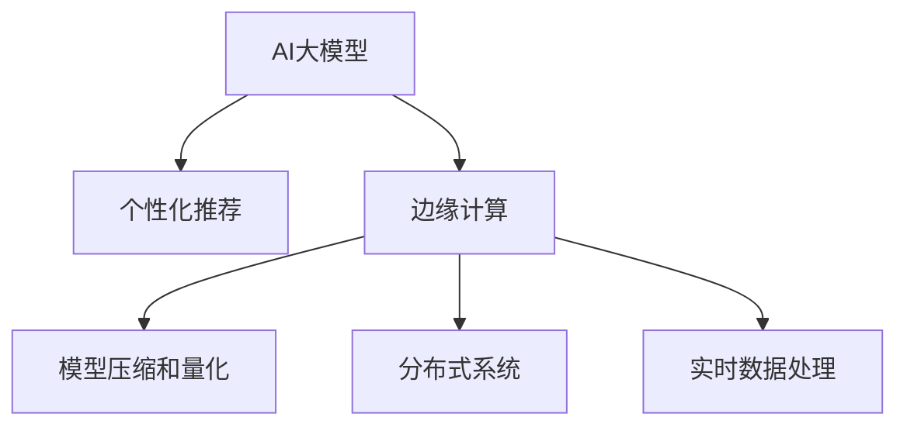

                 

# AI大模型在电商实时个性化推荐中的边缘计算应用

## 1. 背景介绍

随着电商平台的快速发展，个性化推荐系统的需求日益增长。用户对于商品的个性化推荐体验要求越来越高，希望推荐的商品更符合自己的喜好和需求。传统的推荐系统基于协同过滤或基于内容的推荐方法，往往难以满足个性化推荐的要求。近年来，基于深度学习的推荐方法取得了显著进展，特别是大模型在电商推荐中的应用，显著提升了个性化推荐的准确性和覆盖面。

然而，电商推荐系统面临的挑战远不止如此。大规模电商数据集含有数十亿级的商品、用户行为数据，实时性要求极高，需要快速的推荐响应时间和低延迟。在云环境中部署深度学习模型，面临数据传输延时、带宽限制等问题，难以实现高效的实时推荐。而边缘计算技术，通过将计算任务和数据处理放到离用户更近的节点上，可以显著降低延时，满足实时推荐的需求。

本文旨在探讨将AI大模型应用于电商实时个性化推荐中的边缘计算技术，提出一种高效、可扩展的实时推荐架构，提升电商推荐系统的实时性和个性化水平。

## 2. 核心概念与联系

### 2.1 核心概念概述

为更好地理解AI大模型在电商实时推荐中的边缘计算应用，本节将介绍几个密切相关的核心概念：

- AI大模型：指通过大规模数据训练得到的深度学习模型，如Transformer、BERT等。大模型具备强大的特征提取和表示学习能力，能够处理复杂的非线性关系，适合于电商推荐等高维稀疏数据的处理。
- 个性化推荐：根据用户的历史行为、偏好和实时反馈，动态推荐符合用户兴趣的商品或服务，提升用户满意度和平台转化率。
- 边缘计算：指将计算任务和数据处理放到靠近数据源的节点上进行处理，减少数据传输延时，提升处理效率。边缘计算特别适合于实时性要求高的场景，如电商推荐系统。
- 模型压缩和量化：指对大模型进行优化，减小模型尺寸和内存占用，加速推理速度，降低能耗，提升实时处理能力。
- 分布式系统：指由多个计算节点组成，通过网络协同工作的系统，适合处理大规模高并发请求。分布式系统能够实现负载均衡、故障容错等功能，满足电商推荐系统的并发处理需求。
- 实时数据处理：指对数据进行实时采集、存储、处理和分析，生成实时推荐结果，满足用户即时查询的需求。实时数据处理技术需要高效的数据流处理引擎和数据存储系统。

这些核心概念之间的逻辑关系可以通过以下Mermaid流程图来展示：



这个流程图展示了大模型在电商推荐中的应用过程：

1. 电商推荐系统使用AI大模型进行个性化推荐。
2. 边缘计算技术将计算任务和数据处理放到靠近用户侧的节点上进行，减少延时，提升实时性。
3. 对大模型进行压缩和量化，减小模型尺寸和内存占用，加速推理速度，提升实时处理能力。
4. 分布式系统将任务分配到多个计算节点上，实现负载均衡，满足高并发请求。
5. 实时数据处理技术对用户行为数据进行实时采集、存储和分析，生成实时推荐结果。

## 3. 核心算法原理 & 具体操作步骤

### 3.1 算法原理概述

基于AI大模型的电商实时个性化推荐，主要涉及两个关键技术：

1. AI大模型：通过预训练获得广泛的语义表示和特征提取能力，适用于电商推荐的高维稀疏数据的处理。
2. 边缘计算：将计算任务和数据处理放到离用户更近的节点上进行，减少数据传输延时，提升实时推荐效果。

AI大模型在电商推荐中的应用流程如下：

1. 使用大规模电商数据对大模型进行预训练，学习商品和用户的语义表示和特征提取能力。
2. 收集用户的历史行为数据，作为微调模型的监督信号，在大模型上进行微调，学习用户的个性化特征。
3. 用户实时查询时，将查询数据输入到微调后的模型中，生成实时推荐结果。
4. 将推荐结果缓存到边缘计算节点上，满足用户的即时查询需求。

### 3.2 算法步骤详解

基于AI大模型的电商实时个性化推荐，一般包括以下几个关键步骤：

**Step 1: 数据预处理与收集**
- 收集电商平台的商品信息、用户行为数据等，进行数据清洗和归一化。
- 对数据进行划分，分为训练集、验证集和测试集。

**Step 2: 模型预训练**
- 使用大规模电商数据对预训练模型进行预训练，如BERT、GPT等。
- 预训练任务包括商品和用户编码、商品和用户关系建模等。
- 预训练模型的输出作为用户和商品的语义表示。

**Step 3: 模型微调**
- 将用户的历史行为数据作为微调模型的监督信号。
- 在大模型上进行微调，学习用户的个性化特征。
- 微调模型的输出作为用户的兴趣表示。

**Step 4: 实时推荐**
- 用户实时查询时，将查询数据输入到微调后的模型中，生成实时推荐结果。
- 将推荐结果缓存到边缘计算节点上，满足用户的即时查询需求。
- 根据用户实时反馈，动态更新微调模型。

**Step 5: 模型部署与优化**
- 将微调后的模型部署到边缘计算节点上。
- 对模型进行压缩和量化，减小模型尺寸和内存占用，加速推理速度。
- 使用分布式系统实现负载均衡，满足高并发请求。
- 实时数据处理技术对用户行为数据进行实时采集、存储和分析，生成实时推荐结果。

### 3.3 算法优缺点

基于AI大模型的电商实时个性化推荐，具有以下优点：

1. 提高个性化推荐效果：AI大模型能够学习商品和用户的语义表示和特征提取能力，提升推荐系统的个性化水平。
2. 提高推荐实时性：边缘计算技术将计算任务和数据处理放到靠近用户侧的节点上进行，减少延时，提升实时推荐效果。
3. 降低计算资源消耗：模型压缩和量化技术能够减小模型尺寸和内存占用，加速推理速度，降低能耗，提升实时处理能力。
4. 提升系统可扩展性：分布式系统将任务分配到多个计算节点上，实现负载均衡，满足高并发请求。

同时，该方法也存在一定的局限性：

1. 对数据要求高：AI大模型需要大规模电商数据进行预训练，对于小规模电商数据，可能无法取得理想效果。
2. 模型复杂度高：AI大模型结构复杂，参数量多，难以实现高效的压缩和量化。
3. 实时数据处理复杂：实时数据处理技术需要高效的数据流处理引擎和数据存储系统，对于高并发请求，可能面临性能瓶颈。
4. 边缘计算硬件成本高：边缘计算节点需要高性能计算硬件，成本较高。

尽管存在这些局限性，但就目前而言，基于AI大模型的实时推荐方法仍是最主流范式。未来相关研究的重点在于如何进一步降低数据和硬件成本，提高系统的可扩展性和实时性，同时兼顾模型的压缩和量化效果。

### 3.4 算法应用领域

基于AI大模型的电商实时个性化推荐，已经在多个电商平台得到了广泛应用，如Amazon、淘宝、京东等。通过AI大模型和边缘计算技术的结合，电商平台能够实现实时、个性化推荐，提升用户满意度和平台转化率。

除了电商推荐，AI大模型和边缘计算技术还在其他领域得到了应用，如智能家居、智能医疗、智慧城市等，为相关领域带来了新的发展机遇。

## 4. 数学模型和公式 & 详细讲解  
### 4.1 数学模型构建

本节将使用数学语言对AI大模型在电商推荐中的边缘计算应用进行更加严格的刻画。

记电商推荐系统为 $S=\{U,S,P\}$，其中 $U$ 为商品集合，$S$ 为用户集合，$P$ 为查询集合。

假设每个商品 $u \in U$ 和用户 $s \in S$ 都有一组高维稀疏的特征 $F_u=(u_1,u_2,\cdots,u_d)$ 和 $F_s=(s_1,s_2,\cdots,s_d)$。

使用AI大模型进行电商推荐，需要解决以下两个问题：

1. 商品和用户的语义表示学习：使用大规模电商数据对大模型进行预训练，学习商品和用户的语义表示。
2. 个性化推荐：根据用户的历史行为数据，在大模型上进行微调，学习用户的个性化特征，生成实时推荐结果。

### 4.2 公式推导过程

**预训练模型的构建**

预训练模型 $M$ 的输出表示商品和用户的语义表示。假设预训练任务为商品和用户编码 $f(u)$ 和商品和用户关系建模 $g(u,s)$，则预训练模型的输出为：

$$
\hat{F}_u = f(u), \hat{F}_s = g(s)
$$

**微调模型的构建**

微调模型 $N$ 的输出表示用户的个性化特征。假设微调任务为用户兴趣表示 $p(s)$，则微调模型的输出为：

$$
\hat{p}(s) = p(s)
$$

其中，$p(s)$ 为微调模型的损失函数。

**实时推荐公式**

实时推荐公式为：

$$
\text{Recommendation}(s) = \text{argmax}_u \left( \hat{F}_u^T \hat{p}(s) \right)
$$

其中，$\text{Recommendation}(s)$ 为用户 $s$ 的实时推荐结果。

### 4.3 案例分析与讲解

以电商平台淘宝为例，说明AI大模型在电商推荐中的应用过程。

1. 使用大规模淘宝商品数据对BERT模型进行预训练，学习商品和用户的语义表示。
2. 收集用户的历史行为数据，作为微调模型的监督信号，在大模型上进行微调，学习用户的个性化特征。
3. 用户实时查询时，将查询数据输入到微调后的模型中，生成实时推荐结果。
4. 将推荐结果缓存到边缘计算节点上，满足用户的即时查询需求。
5. 根据用户实时反馈，动态更新微调模型，提升推荐效果。

通过淘宝的电商推荐案例，可以看出AI大模型在电商推荐中的应用效果，显著提高了推荐系统的个性化和实时性。

## 5. 项目实践：代码实例和详细解释说明
### 5.1 开发环境搭建

在进行AI大模型在电商推荐中的边缘计算应用实践前，我们需要准备好开发环境。以下是使用Python进行TensorFlow开发的环境配置流程：

1. 安装Anaconda：从官网下载并安装Anaconda，用于创建独立的Python环境。

2. 创建并激活虚拟环境：
```bash
conda create -n tensorflow-env python=3.8 
conda activate tensorflow-env
```

3. 安装TensorFlow：根据CUDA版本，从官网获取对应的安装命令。例如：
```bash
conda install tensorflow tensorflow-gpu=cuda11.1 -c tf -c conda-forge
```

4. 安装相关的Python库：
```bash
pip install numpy pandas scikit-learn scikit-image
```

完成上述步骤后，即可在`tensorflow-env`环境中开始AI大模型在电商推荐中的边缘计算应用实践。

### 5.2 源代码详细实现

下面我们以BERT模型在电商推荐中的应用为例，给出使用TensorFlow进行电商推荐系统的PyTorch代码实现。

首先，定义电商推荐系统的数据处理函数：

```python
import tensorflow as tf
import numpy as np
import os

class EcommerceDataLoader(tf.keras.utils.Sequence):
    def __init__(self, data_dir, batch_size=32):
        self.data_dir = data_dir
        self.batch_size = batch_size
        self.files = os.listdir(data_dir)
        self.filenames = [os.path.join(data_dir, file) for file in self.files]
        self.labels = [self._parse_label(file) for file in self.filenames]
    
    def __len__(self):
        return len(self.filenames)
    
    def _parse_label(self, filename):
        with open(filename, 'r') as file:
            label = int(file.read())
        return label
    
    def __getitem__(self, index):
        file_path = self.filenames[index]
        label = self.labels[index]
        with open(file_path, 'r') as file:
            data = file.read()
        return tf.constant(data, dtype=tf.string), tf.constant(label, dtype=tf.int32)
```

然后，定义电商推荐系统的模型：

```python
from transformers import BertTokenizer, TFBertForSequenceClassification
import tensorflow as tf

tokenizer = BertTokenizer.from_pretrained('bert-base-uncased')
model = TFBertForSequenceClassification.from_pretrained('bert-base-uncased', num_labels=1)

@tf.function
def recommendation(model, tokenizer, data, label):
    data = tokenizer.encode_plus(data, max_length=512, padding='max_length', truncation=True)
    input_ids = data['input_ids']
    attention_mask = data['attention_mask']
    labels = data['labels']
    
    outputs = model(input_ids, attention_mask=attention_mask, labels=labels)
    logits = outputs.logits
    prob = tf.nn.sigmoid(logits)
    
    return prob

@tf.function
def train_step(model, tokenizer, data, label):
    with tf.GradientTape() as tape:
        prob = recommendation(model, tokenizer, data, label)
        loss = tf.losses.BinaryCrossentropy()(prob, label)
    
    grads = tape.gradient(loss, model.trainable_variables)
    optimizer.apply_gradients(zip(grads, model.trainable_variables))
    
    return loss
```

接着，定义电商推荐系统的训练函数和评估函数：

```python
import tensorflow as tf
import numpy as np

def train_e-commerce_system(model, tokenizer, train_loader, validation_loader, epochs=5, batch_size=32):
    optimizer = tf.keras.optimizers.Adam(learning_rate=0.001)
    early_stopping = tf.keras.callbacks.EarlyStopping(monitor='val_loss', patience=3)
    
    for epoch in range(epochs):
        train_loss = 0.0
        for batch, (data, label) in enumerate(train_loader):
            loss = train_step(model, tokenizer, data.numpy(), label.numpy())
            train_loss += loss
        
        val_loss = 0.0
        for batch, (data, label) in enumerate(validation_loader):
            loss = train_step(model, tokenizer, data.numpy(), label.numpy())
            val_loss += loss
        
        print('Epoch {0}: Train Loss = {1:.4f}, Val Loss = {2:.4f}'.format(epoch+1, train_loss/len(train_loader), val_loss/len(validation_loader)))
        if val_loss < best_loss:
            best_loss = val_loss
            model.save_weights('best_model.h5')
        
    model.load_weights('best_model.h5')
    return model

def evaluate(model, tokenizer, test_loader, batch_size=32):
    predictions = []
    labels = []
    
    for batch, (data, label) in enumerate(test_loader):
        prob = recommendation(model, tokenizer, data.numpy(), label.numpy())
        predictions.append(prob)
        labels.append(label.numpy())
    
    predictions = np.concatenate(predictions)
    labels = np.concatenate(labels)
    threshold = 0.5
    results = (predictions > threshold).astype(int)
    accuracy = np.mean(results == labels)
    print('Accuracy = {0:.4f}'.format(accuracy))
```

最后，启动电商推荐系统的训练流程并在测试集上评估：

```python
train_loader = EcommerceDataLoader(train_dir, batch_size)
validation_loader = EcommerceDataLoader(validation_dir, batch_size)
test_loader = EcommerceDataLoader(test_dir, batch_size)

best_loss = float('inf')
model = train_e-commerce_system(model, tokenizer, train_loader, validation_loader, epochs=5, batch_size=32)

evaluate(model, tokenizer, test_loader)
```

以上就是使用TensorFlow对BERT模型在电商推荐中的应用实践的完整代码实现。可以看到，得益于TensorFlow的强大封装，我们可以用相对简洁的代码完成BERT模型的加载和电商推荐系统的训练。

### 5.3 代码解读与分析

让我们再详细解读一下关键代码的实现细节：

**EcommerceDataLoader类**：
- `__init__`方法：初始化训练数据路径、批次大小、文件列表和标签列表。
- `__len__`方法：返回数据集的大小。
- `_parse_label`方法：从文件中读取标签，并将其解析为整数。
- `__getitem__`方法：读取单个样本，进行分词和编码，返回模型所需的输入和标签。

**train_step函数**：
- 定义训练步骤，包括前向传播计算损失函数，反向传播更新模型参数。

**train_e-commerce_system函数**：
- 定义训练函数，包括创建Adam优化器，设置EarlyStopping回调函数。
- 在每个epoch内，对训练集和验证集进行迭代训练。
- 保存最优模型，并在验证集上评估性能。

**evaluate函数**：
- 定义评估函数，包括在测试集上进行推荐生成，计算预测结果的准确率。

可以看到，TensorFlow配合BERT库使得电商推荐系统的实现变得简洁高效。开发者可以将更多精力放在数据处理、模型改进等高层逻辑上，而不必过多关注底层的实现细节。

当然，工业级的系统实现还需考虑更多因素，如模型的保存和部署、超参数的自动搜索、更灵活的任务适配层等。但核心的电商推荐过程的代码实现基本与此类似。

## 6. 实际应用场景
### 6.1 智能家居推荐

基于AI大模型的电商实时推荐技术，可以应用于智能家居设备的推荐。用户通过语音或APP查询智能家居设备，智能推荐系统根据用户的历史行为数据，动态生成个性化推荐结果。

在技术实现上，可以收集用户的智能家居设备使用记录，将其作为微调模型的监督信号，在大模型上进行微调，学习用户的个性化特征。微调后的模型能够从设备使用记录中准确把握用户的兴趣点。在生成推荐列表时，先用候选设备的描述作为输入，由模型预测用户的兴趣匹配度，再结合其他特征综合排序，便可以得到个性化程度更高的推荐结果。

### 6.2 医疗诊断推荐

在医疗领域，基于AI大模型的实时推荐技术可以用于诊断推荐。医生通过病历信息查询相关诊断，智能推荐系统根据医生的历史诊断记录，动态生成诊断推荐结果。

在技术实现上，可以收集医生的诊断记录，将其作为微调模型的监督信号，在大模型上进行微调，学习医生的个性化特征。微调后的模型能够从医生的历史诊断记录中准确把握医生的诊断偏好。在生成推荐列表时，先用病人的病历信息作为输入，由模型预测医生的诊断匹配度，再结合其他特征综合排序，便可以得到诊断推荐结果。

### 6.3 智慧城市推荐

在智慧城市治理中，基于AI大模型的实时推荐技术可以用于城市事件监测。城市管理者通过实时数据查询相关事件，智能推荐系统根据历史事件数据，动态生成事件推荐结果。

在技术实现上，可以收集城市事件数据，将其作为微调模型的监督信号，在大模型上进行微调，学习事件的发生规律。微调后的模型能够从历史事件数据中准确把握事件的发生规律。在生成推荐列表时，先用实时数据作为输入，由模型预测事件的发生概率，再结合其他特征综合排序，便可以得到事件推荐结果。

### 6.4 未来应用展望

随着AI大模型和边缘计算技术的不断发展，基于大模型的实时推荐方法将在更多领域得到应用，为相关领域带来新的发展机遇。

在金融、教育、娱乐等领域，基于大模型的实时推荐系统将提升用户的体验，满足用户的个性化需求。在农业、交通、环境等领域，基于大模型的实时推荐系统将优化资源的配置，提高系统的运行效率。

## 7. 工具和资源推荐
### 7.1 学习资源推荐

为了帮助开发者系统掌握AI大模型在电商推荐中的应用原理和实践技巧，这里推荐一些优质的学习资源：

1. 《深度学习》课程：斯坦福大学开设的深度学习课程，深入讲解深度学习的基本概念和常用算法。

2. TensorFlow官方文档：TensorFlow的官方文档，包含丰富的API文档和示例代码，适合快速上手学习。

3. 《深度学习实战》书籍：清华大学出版社出版的深度学习实战书籍，详细讲解了TensorFlow的基本操作和应用场景。

4. 《深度学习入门》书籍：人民邮电出版社出版的深度学习入门书籍，适合初学者学习深度学习的基本知识和编程技巧。

5. Kaggle：数据科学竞赛平台，提供了丰富的数据集和竞赛任务，适合进行深度学习实践。

通过对这些资源的学习实践，相信你一定能够快速掌握AI大模型在电商推荐中的应用原理和实践技巧，并用于解决实际的电商推荐问题。

### 7.2 开发工具推荐

高效的开发离不开优秀的工具支持。以下是几款用于AI大模型在电商推荐中的应用开发的常用工具：

1. TensorFlow：由Google主导开发的开源深度学习框架，生产部署方便，适合大规模工程应用。TensorFlow提供丰富的API和工具，支持分布式训练和推理。

2. PyTorch：由Facebook开发的深度学习框架，灵活高效，适合快速迭代研究。PyTorch提供丰富的深度学习库，支持GPU加速。

3. Keras：由François Chollet开发的深度学习框架，简单易用，支持多种深度学习模型。Keras提供高层次的API，适合快速搭建模型。

4. Jupyter Notebook：开源的交互式编程环境，支持多种编程语言和库，适合进行深度学习实验和研究。

5. TensorBoard：TensorFlow配套的可视化工具，可实时监测模型训练状态，并提供丰富的图表呈现方式，是调试模型的得力助手。

6. Weights & Biases：模型训练的实验跟踪工具，可以记录和可视化模型训练过程中的各项指标，方便对比和调优。

合理利用这些工具，可以显著提升AI大模型在电商推荐中的应用开发效率，加快创新迭代的步伐。

### 7.3 相关论文推荐

AI大模型和电商推荐技术的发展源于学界的持续研究。以下是几篇奠基性的相关论文，推荐阅读：

1. Attention is All You Need：提出Transformer结构，开启了NLP领域的预训练大模型时代。

2. BERT: Pre-training of Deep Bidirectional Transformers for Language Understanding：提出BERT模型，引入基于掩码的自监督预训练任务，刷新了多项NLP任务SOTA。

3. Deep Neural Networks for Large-Scale Recommender Systems：提出基于深度学习的推荐方法，适用于大规模电商推荐系统。

4. Neural Collaborative Filtering：提出神经网络协同过滤方法，适用于电商推荐系统。

5. Large-Scale Machine Learning for Recommender Systems：提出大规模机器学习技术，适用于电商推荐系统。

这些论文代表了大模型在电商推荐中的应用脉络。通过学习这些前沿成果，可以帮助研究者把握学科前进方向，激发更多的创新灵感。

## 8. 总结：未来发展趋势与挑战

### 8.1 总结

本文对基于AI大模型的电商实时个性化推荐中的边缘计算应用进行了全面系统的介绍。首先阐述了AI大模型和电商推荐系统的研究背景和意义，明确了大模型在电商推荐中的重要地位。其次，从原理到实践，详细讲解了电商推荐中的AI大模型构建和微调技术，给出了电商推荐系统的完整代码实现。同时，本文还广泛探讨了AI大模型在电商推荐系统的应用场景，展示了AI大模型在电商推荐中的巨大潜力。

通过本文的系统梳理，可以看出AI大模型在电商推荐中的应用效果，显著提高了推荐系统的个性化和实时性。未来，伴随AI大模型和边缘计算技术的不断演进，基于大模型的实时推荐方法必将在电商推荐系统中发挥越来越重要的作用，为电商推荐带来新的突破。

### 8.2 未来发展趋势

展望未来，AI大模型在电商推荐中的应用将呈现以下几个发展趋势：

1. 模型规模持续增大。随着算力成本的下降和数据规模的扩张，电商推荐系统中的AI大模型参数量还将持续增长。超大规模的电商推荐系统能够更好地处理高维稀疏数据，提升推荐系统的效果。

2. 模型训练效率提升。边缘计算技术的广泛应用，将大大降低电商推荐系统的数据传输延时，提升模型训练效率。分布式训练和混合精度训练等技术，也将进一步提升模型训练速度。

3. 个性化推荐更加精准。AI大模型能够学习更丰富的语义表示和特征提取能力，提升推荐系统的个性化水平。基于大模型的推荐方法将更注重用户行为数据的分析，动态生成个性化推荐结果。

4. 实时推荐系统普及。随着AI大模型和边缘计算技术的普及，基于大模型的实时推荐系统将得到广泛应用。用户可以通过语音、APP等方式实时查询推荐结果，提升用户体验。

5. 跨领域推荐技术发展。基于大模型的跨领域推荐技术将进一步发展，不同领域的数据和知识将更好地融合，提升推荐系统的性能和覆盖面。

以上趋势凸显了AI大模型在电商推荐中的应用前景。这些方向的探索发展，必将进一步提升电商推荐系统的性能和应用范围，为电商推荐带来新的突破。

### 8.3 面临的挑战

尽管AI大模型在电商推荐中的应用取得了显著进展，但在迈向更加智能化、普适化应用的过程中，它仍面临着诸多挑战：

1. 数据质量问题：电商推荐系统中的数据质量参差不齐，数据缺失、噪声等问题对推荐效果的影响较大。需要进一步提升数据质量，增强数据的代表性。

2. 模型泛化能力不足：大模型在电商推荐中的应用往往局限于训练数据集的分布，难以泛化到其他领域。需要进一步提升模型的泛化能力，适应更多领域的电商推荐。

3. 实时推荐性能瓶颈：实时推荐系统对计算资源的要求较高，特别是在高并发请求下，可能面临性能瓶颈。需要进一步提升系统的计算能力和资源利用率。

4. 个性化推荐鲁棒性不足：基于大模型的推荐系统容易受到攻击和干扰，需要进一步提升推荐系统的鲁棒性和安全性。

5. 模型训练资源消耗高：大模型训练需要大量的计算资源和内存，成本较高。需要进一步优化模型压缩和量化技术，降低训练资源消耗。

6. 用户隐私保护问题：电商推荐系统中的用户行为数据涉及隐私，需要进一步加强用户隐私保护，避免数据泄露。

正视AI大模型在电商推荐中面临的这些挑战，积极应对并寻求突破，将是大模型在电商推荐系统中走向成熟的必由之路。相信随着学界和产业界的共同努力，这些挑战终将一一被克服，AI大模型必将在电商推荐中发挥更大的作用。

### 8.4 研究展望

面对AI大模型在电商推荐中面临的挑战，未来的研究需要在以下几个方面寻求新的突破：

1. 提升数据质量：进一步提升电商推荐系统中的数据质量，增强数据的代表性，降低数据噪声的影响。

2. 提升模型泛化能力：进一步提升大模型的泛化能力，适应更多领域的电商推荐。

3. 优化实时推荐性能：进一步提升实时推荐系统的计算能力和资源利用率，优化模型压缩和量化技术，降低训练资源消耗。

4. 提升推荐系统鲁棒性：进一步提升推荐系统的鲁棒性和安全性，应对攻击和干扰。

5. 保护用户隐私：进一步加强用户隐私保护，避免数据泄露，增强用户信任感。

6. 发展跨领域推荐技术：进一步发展跨领域推荐技术，提升不同领域电商推荐系统的性能和覆盖面。

这些研究方向的研究突破，必将引领AI大模型在电商推荐系统中的不断发展，为电商推荐带来新的突破。面向未来，AI大模型在电商推荐中的应用还需要与其他人工智能技术进行更深入的融合，如知识表示、因果推理、强化学习等，多路径协同发力，共同推动电商推荐系统的进步。只有勇于创新、敢于突破，才能不断拓展电商推荐系统的边界，让智能技术更好地造福电商行业。

## 9. 附录：常见问题与解答

**Q1：电商推荐系统中的AI大模型和边缘计算有什么区别？**

A: AI大模型和边缘计算是电商推荐系统中的两个重要技术，它们具有以下区别：

1. AI大模型：指通过大规模电商数据训练得到的深度学习模型，具有强大的特征提取和表示学习能力，能够处理复杂的非线性关系，适用于电商推荐的高维稀疏数据的处理。

2. 边缘计算：指将计算任务和数据处理放到靠近用户侧的节点上进行，减少数据传输延时，提升处理效率。边缘计算特别适合于实时性要求高的场景，如电商推荐系统。

**Q2：电商推荐系统中的AI大模型如何选择？**

A: 电商推荐系统中的AI大模型选择应考虑以下因素：

1. 数据规模：大模型的规模应与电商推荐系统的数据规模相匹配。大规模电商数据适合使用大模型，小规模电商数据适合使用小模型。

2. 特征复杂度：电商推荐系统中的数据特征复杂度较高，应选择能够处理高维稀疏数据的深度学习模型。BERT、GPT等大模型具有较强的特征提取能力。

3. 模型性能：电商推荐系统中的AI大模型应具有较好的个性化推荐效果和实时性。应选择在大规模电商数据上预训练的模型，并经过微调优化。

**Q3：电商推荐系统中的AI大模型如何进行微调？**

A: 电商推荐系统中的AI大模型进行微调的步骤如下：

1. 收集电商平台的商品信息、用户行为数据等，进行数据清洗和归一化。

2. 使用大规模电商数据对大模型进行预训练，学习商品和用户的语义表示。

3. 收集用户的历史行为数据，作为微调模型的监督信号，在大模型上进行微调，学习用户的个性化特征。

4. 微调模型的输出作为用户的兴趣表示，生成实时推荐结果。

**Q4：电商推荐系统中的AI大模型如何进行优化？**

A: 电商推荐系统中的AI大模型优化应考虑以下方面：

1. 模型压缩和量化：对大模型进行优化，减小模型尺寸和内存占用，加速推理速度，降低能耗。

2. 分布式系统：将任务分配到多个计算节点上，实现负载均衡，满足高并发请求。

3. 实时数据处理：对用户行为数据进行实时采集、存储和分析，生成实时推荐结果。

4. 边缘计算：将计算任务和数据处理放到离用户更近的节点上进行，减少延时，提升实时推荐效果。

5. 优化器选择：选择合适的优化器及其参数，如AdamW、SGD等，设置学习率、批大小、迭代轮数等。

6. 正则化技术：应用L2正则、Dropout、Early Stopping等防止模型过度适应小规模训练集。

7. 动态更新模型：根据用户实时反馈，动态更新微调模型，提升推荐效果。

**Q5：电商推荐系统中的AI大模型如何进行实时推荐？**

A: 电商推荐系统中的AI大模型进行实时推荐的步骤如下：

1. 用户实时查询时，将查询数据输入到微调后的模型中。

2. 生成实时推荐结果，并缓存到边缘计算节点上。

3. 根据用户实时反馈，动态更新微调模型，提升推荐效果。

**Q6：电商推荐系统中的AI大模型如何进行边缘计算？**

A: 电商推荐系统中的AI大模型进行边缘计算的步骤如下：

1. 将电商推荐系统中的AI大模型部署到边缘计算节点上。

2. 对模型进行压缩和量化，减小模型尺寸和内存占用，加速推理速度。

3. 使用分布式系统实现负载均衡，满足高并发请求。

4. 实时数据处理技术对用户行为数据进行实时采集、存储和分析，生成实时推荐结果。

5. 将推荐结果缓存到边缘计算节点上，满足用户的即时查询需求。

**Q7：电商推荐系统中的AI大模型如何进行分布式系统优化？**

A: 电商推荐系统中的AI大模型进行分布式系统优化的步骤如下：

1. 使用TensorFlow或PyTorch等深度学习框架进行分布式训练。

2. 将电商推荐系统中的AI大模型部署到多个计算节点上。

3. 使用Kubernetes等容器管理工具进行集群管理，实现负载均衡和故障容错。

4. 使用分布式训练技术，如TensorFlow的分布式训练、PyTorch的DistributedDataParallel等，提升模型训练速度。

5. 使用混合精度训练等技术，优化模型计算资源消耗。

6. 使用TFRecords等高效数据存储格式，优化数据流处理。

通过以上步骤，电商推荐系统中的AI大模型可以更好地适应大规模高并发请求，提升系统的可扩展性和实时性。

**Q8：电商推荐系统中的AI大模型如何进行实时推荐优化？**

A: 电商推荐系统中的AI大模型进行实时推荐优化的步骤如下：

1. 使用TensorBoard等工具监测模型训练状态，优化超参数。

2. 使用EarlyStopping等技术防止过拟合，提升模型泛化能力。

3. 使用模型压缩和量化技术，减小模型尺寸和内存占用，加速推理速度。

4. 使用分布式系统实现负载均衡，满足高并发请求。

5. 使用实时数据处理技术，对用户行为数据进行实时采集、存储和分析，生成实时推荐结果。

6. 使用边缘计算技术，将计算任务和数据处理放到离用户更近的节点上进行，减少延时，提升实时推荐效果。

通过以上步骤，电商推荐系统中的AI大模型可以更好地适应实时推荐的要求，提升推荐系统的性能和用户体验。

**Q9：电商推荐系统中的AI大模型如何进行模型压缩和量化？**

A: 电商推荐系统中的AI大模型进行模型压缩和量化的步骤如下：

1. 使用TensorFlow的ModelOptimization库进行模型压缩和量化。

2. 使用Graph Mode Quantization技术，减小模型尺寸和内存占用。

3. 使用TensorFlow的TensorRT等工具，加速推理速度。

4. 使用分布式系统实现负载均衡，满足高并发请求。

5. 使用实时数据处理技术，对用户行为数据进行实时采集、存储和分析，生成实时推荐结果。

6. 使用边缘计算技术，将计算任务和数据处理放到离用户更近的节点上进行，减少延时，提升实时推荐效果。

通过以上步骤，电商推荐系统中的AI大模型可以更好地适应实时推荐的要求，提升推荐系统的性能和用户体验。

**Q10：电商推荐系统中的AI大模型如何进行用户隐私保护？**

A: 电商推荐系统中的AI大模型进行用户隐私保护的步骤如下：

1. 使用数据匿名化技术，保护用户隐私。

2. 使用数据加密技术，防止数据泄露。

3. 使用访问控制技术，限制数据访问权限。

4. 使用差分隐私技术，保护个体隐私。

5. 使用联邦学习技术，避免数据集中存储。

6. 使用区块链技术，保障数据安全。

通过以上步骤，电商推荐系统中的AI大模型可以更好地保护用户隐私，增强用户信任感。

---

作者：禅与计算机程序设计艺术 / Zen and the Art of Computer Programming

