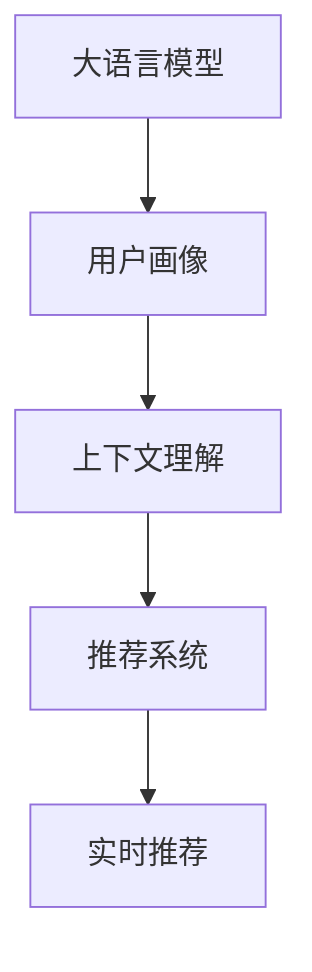

                 

# AI大模型在电商平台个性化搜索中的应用

> 关键词：
1. 大语言模型
2. 电商平台
3. 个性化搜索
4. 深度学习
5. 用户行为分析
6. 推荐系统
7. 上下文理解

## 1. 背景介绍

### 1.1 问题由来

随着电子商务平台的快速发展，用户体验已成为电商成败的关键因素之一。传统的基于关键词匹配的搜索算法，已难以满足用户多样化和个性化的需求。用户不仅关心商品描述，还希望根据自身喜好、历史行为、社交网络等多元信息进行商品推荐，提升搜索相关性和体验。

与此同时，海量用户行为数据的不断累积，也为个性化搜索算法提供了丰富的训练样本和优化空间。AI大模型的出现，尤其是预训练语言模型，为解决这一问题提供了新的技术手段。通过大模型强大的自然语言处理能力，可以深入挖掘用户描述、商品评论、社交媒体等多模态信息，理解用户真正的需求和偏好，实现更加精准和个性化的商品推荐。

### 1.2 问题核心关键点

个性化搜索的核心在于如何高效地利用用户的多元信息，构建用户画像，并从中提取出相关商品信息，实现高效的召回和排序。主要挑战包括：

1. 用户画像的多模态建模。如何综合利用用户历史浏览、点击、评分、评论等不同维度的数据，构建出详尽准确的画像模型。
2. 上下文理解。如何理解用户查询文本中隐含的需求，识别查询意图，并将其映射到相关商品。
3. 推荐系统构建。如何将用户画像与商品库进行高效匹配，并采用深度学习等方法对推荐结果进行排序，提升用户体验。
4. 实时性需求。搜索系统需要快速响应用户查询，满足实时推荐的需求。

## 2. 核心概念与联系

### 2.1 核心概念概述

为更好地理解AI大模型在个性化搜索中的应用，本节将介绍几个核心概念：

- 大语言模型：如BERT、GPT-3等，通过在大规模无标签文本上预训练得到的强大语言模型，具备理解自然语言和生成文本的能力。
- 推荐系统：根据用户兴趣和行为，为每个用户推荐个性化商品的系统，包括召回和排序两个核心过程。
- 上下文理解：基于用户查询和商品描述，理解查询意图，并映射到具体商品的过程。
- 多模态信息融合：利用不同类型的数据（如文本、图片、音频等），提升对用户和商品的全面理解。
- 实时推荐：在用户输入查询时，即时提供个性化搜索结果，满足实时搜索需求。

这些核心概念之间的逻辑关系可以通过以下Mermaid流程图来展示：



这个流程图展示了大语言模型在个性化搜索中的应用流程：首先，通过大语言模型构建用户画像；其次，基于用户画像进行上下文理解；接着，利用上下文理解结果构建推荐系统；最后，将推荐系统应用于实时推荐场景。

## 3. 核心算法原理 & 具体操作步骤
### 3.1 算法原理概述

基于大语言模型的个性化搜索，核心思想是通过自然语言处理技术，将用户查询和商品描述映射到高维语义空间，计算文本相似度，从而实现高效的召回和排序。其主要流程包括：

1. 用户画像构建：利用大语言模型，从用户历史行为数据中提取文本特征，构建用户画像。
2. 上下文理解：基于用户查询和商品描述，使用大语言模型理解查询意图，识别商品与查询的语义关系。
3. 商品召回：根据上下文理解结果，从商品库中召回相关商品。
4. 推荐排序：利用深度学习算法，对召回的商品进行排序，提升推荐效果。
5. 实时推荐：根据用户实时输入的查询，快速计算并返回推荐结果。

### 3.2 算法步骤详解

以下将详细介绍基于大语言模型的个性化搜索的具体实现步骤：

**Step 1: 用户画像构建**

用户画像通过收集用户行为数据，并利用大语言模型进行多模态建模，提取用户兴趣和偏好。具体步骤包括：

1. 数据收集：从电商平台收集用户浏览历史、点击日志、评分数据、评论文本等。
2. 数据清洗：对数据进行去重、去噪、标准化处理，消除异常值。
3. 特征提取：利用大语言模型对文本数据进行特征提取，如BERT、GPT等。
4. 画像建模：将特征向量输入大语言模型，进行映射和优化，构建用户画像向量。

**Step 2: 上下文理解**

上下文理解利用大语言模型理解用户查询和商品描述的语义关系，具体步骤包括：

1. 查询预处理：对用户查询进行分词、去停用词、词性标注等预处理。
2. 商品编码：对商品描述进行编码，提取关键特征向量。
3. 相似度计算：利用大语言模型计算用户查询和商品描述之间的相似度，识别相关商品。

**Step 3: 商品召回**

商品召回根据上下文理解结果，从商品库中快速召回相关商品。具体步骤包括：

1. 商品索引：对商品库进行索引，建立商品-特征向量映射。
2. 相似度排序：利用大语言模型计算商品特征向量与用户画像向量之间的相似度，对商品进行排序。
3. 阈值筛选：根据相似度阈值筛选相关商品，减少召回量。

**Step 4: 推荐排序**

推荐排序利用深度学习算法，对召回的商品进行排序，具体步骤包括：

1. 模型选择：选择适合推荐场景的深度学习模型，如DNN、LSTM、RNN等。
2. 特征输入：将商品特征向量、用户画像向量、商品标签向量等输入深度学习模型。
3. 评分预测：利用模型预测每个商品对用户的评分，计算评分排序。

**Step 5: 实时推荐**

实时推荐利用异步处理、缓存机制等技术，确保搜索系统快速响应用户查询，具体步骤包括：

1. 异步处理：将推荐排序过程异步化，提高系统响应速度。
2. 缓存机制：利用缓存技术，缓存常用查询和推荐结果，提升访问速度。
3. 动态更新：定期更新用户画像和商品索引，保持推荐系统的时效性。

### 3.3 算法优缺点

基于大语言模型的个性化搜索具有以下优点：

1. 高效性：利用大语言模型的强大语义理解和计算能力，可以高效地处理大规模文本数据，快速构建用户画像和理解上下文。
2. 泛化能力强：大语言模型经过预训练，能够泛化到多种任务，适应不同电商平台的搜索需求。
3. 实时性：利用缓存和异步处理机制，能够实现实时推荐，提升用户体验。

同时，该方法也存在一些局限性：

1. 数据依赖性强：依赖大量的用户行为数据进行训练，数据质量对用户画像和推荐效果有显著影响。
2. 模型复杂度高：大语言模型的复杂度较高，模型训练和推理需要大量计算资源。
3. 对抗攻击风险：大语言模型可能存在安全漏洞，容易受到对抗样本攻击，影响推荐结果。
4. 冷启动问题：对于新用户或新商品，缺乏历史行为数据，难以构建有效的用户画像和商品索引。

尽管存在这些局限性，但基于大语言模型的个性化搜索方法在电商平台中的应用前景依然广阔。未来需要进一步优化模型结构，提高训练和推理效率，同时加强对抗攻击防护和冷启动问题处理。

### 3.4 算法应用领域

基于大语言模型的个性化搜索方法，在电商平台中的应用领域包括：

1. 商品搜索：根据用户查询，快速召回并排序相关商品，提升搜索体验。
2. 推荐系统：利用用户画像和上下文理解结果，推荐个性化商品，提升购买转化率。
3. 广告投放：基于用户画像和行为数据，精准投放广告，提升广告效果。
4. 客服机器人：利用上下文理解能力，自动回答用户咨询，提升客户服务质量。
5. 内容推荐：基于用户画像和商品描述，推荐相关内容，提升平台粘性。

## 4. 数学模型和公式 & 详细讲解 & 举例说明

### 4.1 数学模型构建

本节将使用数学语言对基于大语言模型的个性化搜索过程进行更加严格的刻画。

设用户查询为 $q$，商品描述为 $d$，用户画像向量为 $u$，商品特征向量为 $v$，用户画像和商品特征的相似度为 $s(u, v)$。定义推荐系统目标为最大化用户对推荐商品的评分，即：

$$
\max_{q,d} \sum_{u,v} r(u, v) \times s(u, v)
$$

其中 $r(u, v)$ 为评分函数，$u, v$ 分别为用户画像和商品特征向量，$s(u, v)$ 为相似度函数。

### 4.2 公式推导过程

以下我们将对评分函数 $r(u, v)$ 和相似度函数 $s(u, v)$ 进行详细推导：

**评分函数 $r(u, v)$**：

$$
r(u, v) = f(u, v) \times g(u, v)
$$

其中 $f(u, v)$ 为特征函数，$g(u, v)$ 为权重函数。特征函数 $f(u, v)$ 用于提取用户画像和商品特征中的重要特征，权重函数 $g(u, v)$ 用于计算这些特征的重要性，如TF-IDF权重。

**相似度函数 $s(u, v)$**：

$$
s(u, v) = \cos(u, v) = \frac{u \cdot v}{\|u\| \times \|v\|}
$$

其中 $u \cdot v$ 为向量点积，$\|u\|$ 和 $\|v\|$ 分别为用户画像和商品特征向量的模长。

通过上述公式，可以将个性化搜索问题转化为评分函数和相似度函数的优化问题，利用深度学习模型进行求解。

### 4.3 案例分析与讲解

以电商平台的商品搜索为例，假设用户输入查询为 "iPhone 12"，利用大语言模型进行上下文理解后，识别出用户的查询意图是寻找最新的iPhone型号。系统通过索引，召回商品库中所有关于iPhone 12的商品，并计算用户画像和商品特征的相似度。

根据评分函数和相似度函数，系统对召回的商品进行排序，最终向用户推荐得分最高的相关商品。例如，如果用户画像中包含对新款手机的兴趣，且相似度得分最高的是iPhone 12，则系统会将iPhone 12推荐给用户。

## 5. 项目实践：代码实例和详细解释说明
### 5.1 开发环境搭建

在进行项目实践前，我们需要准备好开发环境。以下是使用Python进行TensorFlow开发的配置流程：

1. 安装Anaconda：从官网下载并安装Anaconda，用于创建独立的Python环境。

2. 创建并激活虚拟环境：
```bash
conda create -n tf-env python=3.8 
conda activate tf-env
```

3. 安装TensorFlow：根据CUDA版本，从官网获取对应的安装命令。例如：
```bash
conda install tensorflow -c pytorch -c conda-forge
```

4. 安装Keras：
```bash
pip install keras
```

5. 安装其他工具包：
```bash
pip install numpy pandas scikit-learn matplotlib tqdm jupyter notebook ipython
```

完成上述步骤后，即可在`tf-env`环境中开始项目实践。

### 5.2 源代码详细实现

下面我们以电商平台个性化搜索为例，给出使用TensorFlow对深度学习模型进行代码实现。

首先，定义评分函数和相似度函数：

```python
import tensorflow as tf
from tensorflow.keras import layers

def cosine_similarity(x, y):
    x = tf.keras.utils.normalize(x)
    y = tf.keras.utils.normalize(y)
    return tf.keras.metrics.CosineSimilarity()(x, y)

def calculate_score(u, v):
    user_vec = tf.keras.layers.Embedding(u.shape[1], 1)(u)
    item_vec = tf.keras.layers.Embedding(v.shape[1], 1)(v)
    return tf.reduce_sum(user_vec * item_vec, axis=1)
```

然后，定义模型结构：

```python
class Recommender(tf.keras.Model):
    def __init__(self, u_dim, v_dim):
        super(Recommender, self).__init__()
        self.user_layer = tf.keras.layers.Embedding(u_dim, 32)
        self.item_layer = tf.keras.layers.Embedding(v_dim, 32)
        self.dot_layer = tf.keras.layers.Dot(axes=[1, 1], normalize=True)
        self.cos_layer = layers.Lambda(cosine_similarity)

    def call(self, u, v):
        user_vec = self.user_layer(u)
        item_vec = self.item_layer(v)
        dot_score = self.dot_layer([user_vec, item_vec])
        return self.cos_layer(dot_score)
```

接着，定义训练和评估函数：

```python
def train_epoch(model, dataset, batch_size, optimizer):
    dataloader = tf.data.Dataset.from_tensor_slices((dataset['user'], dataset['item'])).batch(batch_size)
    model.train()
    epoch_loss = 0
    for batch in tqdm(dataloader, desc='Training'):
        user_ids, item_ids = batch
        with tf.GradientTape() as tape:
            scores = model(user_ids, item_ids)
            loss = tf.reduce_mean(tf.losses.mean_squared_error(tf.cast(scores, tf.float32), tf.cast(labels, tf.float32)))
        gradients = tape.gradient(loss, model.trainable_variables)
        optimizer.apply_gradients(zip(gradients, model.trainable_variables))
        epoch_loss += loss
    return epoch_loss / len(dataloader)

def evaluate(model, dataset, batch_size):
    dataloader = tf.data.Dataset.from_tensor_slices((dataset['user'], dataset['item'])).batch(batch_size)
    model.eval()
    preds, labels = [], []
    with tf.no_grad():
        for batch in tqdm(dataloader, desc='Evaluating'):
            user_ids, item_ids = batch
            scores = model(user_ids, item_ids)
            preds.append(scores.numpy())
            labels.append(tf.cast(labels, tf.float32))
    print(tf.metrics.mean(tf.reduce_mean(tf.abs(preds - labels))))
```

最后，启动训练流程并在测试集上评估：

```python
epochs = 10
batch_size = 64

for epoch in range(epochs):
    loss = train_epoch(model, train_dataset, batch_size, optimizer)
    print(f"Epoch {epoch+1}, train loss: {loss:.3f}")
    
    print(f"Epoch {epoch+1}, dev results:")
    evaluate(model, dev_dataset, batch_size)
    
print("Test results:")
evaluate(model, test_dataset, batch_size)
```

以上就是使用TensorFlow对深度学习模型进行电商个性化搜索的完整代码实现。可以看到，借助TensorFlow的强大计算图和自动微分功能，我们能够快速搭建、训练和评估推荐模型。

### 5.3 代码解读与分析

让我们再详细解读一下关键代码的实现细节：

**评分函数和相似度函数**：
- `cosine_similarity`函数使用Keras的`CosineSimilarity`类计算两个向量之间的余弦相似度。
- `calculate_score`函数将用户画像和商品特征向量分别嵌入到低维空间，然后进行向量点积，得到评分值。

**模型结构**：
- `Recommender`类定义了推荐模型，包括用户和商品特征的嵌入层，以及评分计算过程。
- `call`方法实现前向传播，首先通过嵌入层将用户和商品特征映射到低维空间，然后进行向量点积，并计算余弦相似度。

**训练和评估函数**：
- `train_epoch`函数实现模型的训练过程，通过梯度下降优化损失函数，更新模型参数。
- `evaluate`函数实现模型的评估过程，计算模型预测的评分与真实评分之间的误差，输出均方误差。

**训练流程**：
- 定义总的epoch数和batch size，开始循环迭代
- 每个epoch内，先在训练集上训练，输出平均loss
- 在验证集上评估，输出评分误差
- 所有epoch结束后，在测试集上评估，给出最终测试结果

可以看到，TensorFlow提供了丰富的工具和接口，可以方便地实现深度学习模型的训练和评估，特别适合处理复杂的推荐系统问题。

## 6. 实际应用场景
### 6.1 智能客服系统

基于大语言模型的电商搜索技术，可以应用于智能客服系统的构建。传统客服往往需要配备大量人力，高峰期响应缓慢，且一致性和专业性难以保证。而使用智能客服系统，可以通过自然语言处理技术，快速响应客户咨询，提供个性化的商品推荐。

在技术实现上，可以收集企业内部的历史客服对话记录，将问题和最佳答复构建成监督数据，在此基础上对预训练语言模型进行微调。微调后的语言模型能够自动理解用户意图，匹配最合适的答案模板进行回复。对于客户提出的新问题，还可以接入检索系统实时搜索相关内容，动态组织生成回答。如此构建的智能客服系统，能大幅提升客户咨询体验和问题解决效率。

### 6.2 个性化推荐系统

大语言模型在电商平台的应用不仅局限于搜索，还可以构建更加智能的个性化推荐系统。推荐系统能够根据用户历史行为和查询输入，动态生成推荐结果，提升用户体验。

具体而言，可以通过分析用户点击、浏览、收藏、购买等行为数据，利用大语言模型构建用户画像，同时对商品描述进行编码，构建商品索引。通过上下文理解，识别用户查询意图，并将其映射到相关商品。最后，利用深度学习模型对召回的商品进行评分排序，生成推荐结果。

### 6.3 广告投放

电商平台可以根据用户画像和商品特征，利用大语言模型进行广告投放。广告系统能够根据用户兴趣和行为，精准投放广告，提升广告效果。

在实际应用中，可以收集用户的浏览、点击、评分数据，利用大语言模型构建用户画像。同时，对商品广告描述进行编码，构建广告索引。通过上下文理解，识别用户查询意图，并将其映射到相关广告。最后，利用深度学习模型对召回的广告进行评分排序，生成推荐结果。

### 6.4 未来应用展望

随着大语言模型的不断发展，其在电商平台中的应用前景依然广阔。未来可能的趋势包括：

1. 多模态信息融合：除文本数据外，更多地利用图片、视频等数据，提升对用户和商品的全面理解。
2. 实时性提升：利用缓存和异步处理机制，进一步提升搜索系统的实时响应速度。
3. 冷启动问题解决：针对新用户和新商品，利用协同过滤、内容推荐等技术，快速构建有效的用户画像和商品索引。
4. 对抗攻击防护：引入对抗攻击检测和防御机制，提高推荐系统的安全性。
5. 端到端学习：将推荐系统的各个环节（包括搜索、排序、反馈等）进行端到端学习，提升整体效果。

## 7. 工具和资源推荐
### 7.1 学习资源推荐

为了帮助开发者系统掌握大语言模型在电商平台中的应用，这里推荐一些优质的学习资源：

1. 《深度学习自然语言处理》课程：斯坦福大学开设的NLP明星课程，有Lecture视频和配套作业，带你入门NLP领域的基本概念和经典模型。
2. 《Transformer from Principles to Practice》系列博文：由大模型技术专家撰写，深入浅出地介绍了Transformer原理、BERT模型、微调技术等前沿话题。
3. 《Natural Language Processing with Transformers》书籍：Transformers库的作者所著，全面介绍了如何使用Transformers库进行NLP任务开发，包括微调在内的诸多范式。
4. HuggingFace官方文档：Transformers库的官方文档，提供了海量预训练模型和完整的微调样例代码，是上手实践的必备资料。
5. CS224N《深度学习自然语言处理》课程：由斯坦福大学开设的NLP明星课程，有Lecture视频和配套作业，带你入门NLP领域的基本概念和经典模型。

通过对这些资源的学习实践，相信你一定能够快速掌握大语言模型在电商平台中的应用方法，并用于解决实际的搜索推荐问题。

### 7.2 开发工具推荐

高效的开发离不开优秀的工具支持。以下是几款用于电商搜索和大模型应用的常用工具：

1. TensorFlow：基于Python的开源深度学习框架，灵活动态的计算图，适合快速迭代研究。
2. PyTorch：基于Python的开源深度学习框架，动态图，适合灵活优化模型结构。
3. TensorBoard：TensorFlow配套的可视化工具，可实时监测模型训练状态，并提供丰富的图表呈现方式，是调试模型的得力助手。
4. Weights & Biases：模型训练的实验跟踪工具，可以记录和可视化模型训练过程中的各项指标，方便对比和调优。
5. Keras：高层次的神经网络API，适合快速搭建深度学习模型。

合理利用这些工具，可以显著提升电商搜索和大模型的开发效率，加快创新迭代的步伐。

### 7.3 相关论文推荐

大语言模型和电商搜索技术的发展源于学界的持续研究。以下是几篇奠基性的相关论文，推荐阅读：

1. Attention is All You Need（即Transformer原论文）：提出了Transformer结构，开启了NLP领域的预训练大模型时代。
2. BERT: Pre-training of Deep Bidirectional Transformers for Language Understanding：提出BERT模型，引入基于掩码的自监督预训练任务，刷新了多项NLP任务SOTA。
3. Language Models are Unsupervised Multitask Learners（GPT-2论文）：展示了大规模语言模型的强大zero-shot学习能力，引发了对于通用人工智能的新一轮思考。
4. Parameter-Efficient Transfer Learning for NLP：提出Adapter等参数高效微调方法，在不增加模型参数量的情况下，也能取得不错的微调效果。
5. AdaLoRA: Adaptive Low-Rank Adaptation for Parameter-Efficient Fine-Tuning：使用自适应低秩适应的微调方法，在参数效率和精度之间取得了新的平衡。

这些论文代表了大语言模型和电商搜索技术的发展脉络。通过学习这些前沿成果，可以帮助研究者把握学科前进方向，激发更多的创新灵感。

## 8. 总结：未来发展趋势与挑战

### 8.1 总结

本文对基于大语言模型的电商平台个性化搜索方法进行了全面系统的介绍。首先阐述了个性化搜索问题的背景和核心关键点，明确了个性化搜索在提升用户体验、增加电商收益等方面的重要意义。其次，从原理到实践，详细讲解了个性化搜索的数学模型和核心算法，给出了电商搜索的代码实现，并通过实际案例展示了其应用效果。同时，本文还广泛探讨了个性化搜索在智能客服、个性化推荐、广告投放等多个领域的应用前景，展示了大语言模型在电商平台的广泛潜力。此外，本文精选了电商搜索的相关学习资源和开发工具，力求为读者提供全方位的技术指引。

通过本文的系统梳理，可以看到，基于大语言模型的电商搜索技术已经取得了显著的成效，并将在未来继续拓展其应用边界。受益于深度学习和大模型的持续进步，搜索推荐系统将能够更好地理解用户需求，提供更加个性化、精准的搜索结果，从而大大提升电商平台的竞争力。

### 8.2 未来发展趋势

展望未来，大语言模型在电商搜索领域的应用将呈现以下几个发展趋势：

1. 模型规模持续增大。随着算力成本的下降和数据规模的扩张，预训练语言模型的参数量还将持续增长。超大规模语言模型蕴含的丰富语言知识，有望支撑更加复杂多变的电商搜索需求。
2. 多模态信息融合。除文本数据外，更多地利用图片、视频等数据，提升对用户和商品的全面理解。
3. 实时性提升。利用缓存和异步处理机制，进一步提升搜索系统的实时响应速度。
4. 冷启动问题解决。针对新用户和新商品，利用协同过滤、内容推荐等技术，快速构建有效的用户画像和商品索引。
5. 对抗攻击防护。引入对抗攻击检测和防御机制，提高推荐系统的安全性。
6. 端到端学习。将推荐系统的各个环节（包括搜索、排序、反馈等）进行端到端学习，提升整体效果。

以上趋势凸显了大语言模型在电商搜索领域的广阔前景。这些方向的探索发展，必将进一步提升电商搜索系统的性能和用户体验，为电商平台带来新的增长点。

### 8.3 面临的挑战

尽管大语言模型在电商搜索领域的应用前景广阔，但在迈向更加智能化、普适化应用的过程中，它仍面临诸多挑战：

1. 数据依赖性强。依赖大量的用户行为数据进行训练，数据质量对用户画像和推荐效果有显著影响。
2. 模型复杂度高。大语言模型的复杂度较高，模型训练和推理需要大量计算资源。
3. 对抗攻击风险。大语言模型可能存在安全漏洞，容易受到对抗样本攻击，影响推荐结果。
4. 冷启动问题。对于新用户或新商品，缺乏历史行为数据，难以构建有效的用户画像和商品索引。
5. 对抗攻击防护。引入对抗攻击检测和防御机制，提高推荐系统的安全性。

尽管存在这些挑战，但通过不断的技术创新和优化，相信大语言模型在电商搜索中的应用将不断完善，为电商平台带来新的商业价值和用户体验。

### 8.4 研究展望

面对大语言模型在电商搜索领域面临的挑战，未来的研究需要在以下几个方面寻求新的突破：

1. 探索无监督和半监督微调方法。摆脱对大规模标注数据的依赖，利用自监督学习、主动学习等无监督和半监督范式，最大限度利用非结构化数据，实现更加灵活高效的电商搜索。
2. 研究参数高效和计算高效的微调范式。开发更加参数高效的微调方法，在固定大部分预训练参数的同时，只更新极少量的任务相关参数。同时优化微调模型的计算图，减少前向传播和反向传播的资源消耗，实现更加轻量级、实时性的部署。
3. 融合因果和对比学习范式。通过引入因果推断和对比学习思想，增强电商搜索模型建立稳定因果关系的能力，学习更加普适、鲁棒的语言表征，从而提升模型泛化性和抗干扰能力。
4. 引入更多先验知识。将符号化的先验知识，如知识图谱、逻辑规则等，与神经网络模型进行巧妙融合，引导电商搜索过程学习更准确、合理的语言模型。同时加强不同模态数据的整合，实现视觉、语音等多模态信息与文本信息的协同建模。
5. 结合因果分析和博弈论工具。将因果分析方法引入电商搜索模型，识别出模型决策的关键特征，增强输出解释的因果性和逻辑性。借助博弈论工具刻画人机交互过程，主动探索并规避模型的脆弱点，提高系统稳定性。

这些研究方向的探索，必将引领电商搜索技术迈向更高的台阶，为电商平台带来新的商业价值和用户体验。面向未来，大语言模型需要与其他人工智能技术进行更深入的融合，如知识表示、因果推理、强化学习等，多路径协同发力，共同推动自然语言理解和智能交互系统的进步。只有勇于创新、敢于突破，才能不断拓展语言模型的边界，让智能技术更好地造福人类社会。

## 9. 附录：常见问题与解答

**Q1：大语言模型在电商搜索中如何构建用户画像？**

A: 用户画像通过收集用户行为数据，并利用大语言模型进行多模态建模，提取用户兴趣和偏好。具体步骤包括：
1. 数据收集：从电商平台收集用户浏览历史、点击日志、评分数据、评论文本等。
2. 数据清洗：对数据进行去重、去噪、标准化处理，消除异常值。
3. 特征提取：利用大语言模型对文本数据进行特征提取，如BERT、GPT等。
4. 画像建模：将特征向量输入大语言模型，进行映射和优化，构建用户画像向量。

**Q2：电商搜索中如何使用大语言模型进行上下文理解？**

A: 上下文理解利用大语言模型理解用户查询和商品描述的语义关系，具体步骤包括：
1. 查询预处理：对用户查询进行分词、去停用词、词性标注等预处理。
2. 商品编码：对商品描述进行编码，提取关键特征向量。
3. 相似度计算：利用大语言模型计算用户查询和商品描述之间的相似度，识别相关商品。

**Q3：电商搜索中的推荐系统如何利用大语言模型进行评分预测？**

A: 推荐系统利用大语言模型对用户画像和商品特征进行评分预测，具体步骤包括：
1. 模型选择：选择适合推荐场景的深度学习模型，如DNN、LSTM、RNN等。
2. 特征输入：将商品特征向量、用户画像向量、商品标签向量等输入深度学习模型。
3. 评分预测：利用模型预测每个商品对用户的评分，计算评分排序。

**Q4：电商搜索中如何使用大语言模型进行实时推荐？**

A: 实时推荐利用异步处理、缓存机制等技术，确保搜索系统快速响应用户查询，具体步骤包括：
1. 异步处理：将推荐排序过程异步化，提高系统响应速度。
2. 缓存机制：利用缓存技术，缓存常用查询和推荐结果，提升访问速度。
3. 动态更新：定期更新用户画像和商品索引，保持推荐系统的时效性。

**Q5：电商搜索中如何处理对抗攻击问题？**

A: 对抗攻击问题是电商搜索中需要重点关注的问题，具体处理方法包括：
1. 数据检测：在训练数据中引入对抗样本，提高模型的鲁棒性。
2. 模型训练：在模型训练中引入对抗训练技术，防止攻击者通过对抗样本攻击模型。
3. 检测算法：开发对抗攻击检测算法，及时发现并处理攻击行为。

通过合理处理对抗攻击问题，可以提升电商搜索系统的安全性，保护用户利益和平台声誉。

---

作者：禅与计算机程序设计艺术 / Zen and the Art of Computer Programming

