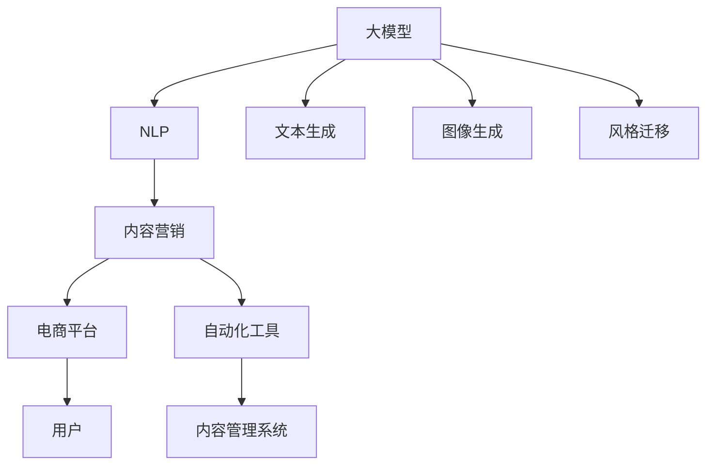

                 

# AI大模型在电商平台内容营销自动化中的应用

> 关键词：大模型,内容营销,电商平台,自动化,自然语言处理,NLP,深度学习,自然语言生成,CLIP,StyleGAN2

## 1. 背景介绍

在当今互联网时代，电子商务平台已成为消费者获取商品信息、进行购买决策的主要渠道。为了提高用户体验、提升转化率，电商平台的内容营销策略显得尤为重要。传统的文本编辑、图片优化、视频制作等方法，不仅耗时耗力，且难以形成一致的营销风格和品牌调性。如何高效、自动地生成符合平台调性的内容，成为了亟待解决的问题。

人工智能大模型，特别是基于深度学习技术的大语言模型和生成模型，为电商平台的内容营销自动化提供了新的思路和工具。通过大模型训练生成的内容，不仅在风格和质量上与人工生成的内容无异，还能大幅提高内容产出的效率，从而降低营销成本，提升平台的用户黏性和销售转化率。

本文将详细介绍大模型在电商平台内容营销自动化中的应用，包括模型的构建、训练、优化和部署等关键环节，并展望未来应用趋势和面临的挑战。

## 2. 核心概念与联系

### 2.1 核心概念概述

为更好地理解大模型在电商平台内容营销自动化中的应用，本节将介绍几个密切相关的核心概念：

- 大模型(Large Model)：以自回归(如GPT)或自编码(如BERT)模型为代表的大规模深度学习模型。通过在海量数据上进行预训练，学习通用的语言和图像表示，具备强大的语言理解和生成能力。

- 自然语言处理(Natural Language Processing, NLP)：涉及语言理解、文本生成、语义分析等技术，是内容营销自动化中的核心技术。

- 内容营销(Content Marketing)：通过高质量的内容创作和分发，建立品牌与用户之间的情感连接，实现用户转化和品牌传播。

- 自动化(Automatic)：指通过程序和算法自动执行内容创作、优化和发布等任务，减少人工干预，提高效率和质量。

- 电商平台(E-Commerce Platform)：基于互联网的商业平台，如淘宝、京东、亚马逊等，为商家和用户提供商品交易、信息展示、支付结算等功能。

这些核心概念之间的逻辑关系可以通过以下Mermaid流程图来展示：



这个流程图展示了大模型、NLP技术、内容营销和电商平台之间的联系：

1. 大模型通过预训练获得了语言和图像的通用表示，为内容创作提供了强大支持。
2. 自然语言处理技术可以对文本进行理解、分析和生成，是内容营销自动化的关键技术。
3. 内容营销自动化通过自动化工具，实现内容创作、优化和发布的全流程自动化，提升效率和质量。
4. 电商平台为内容营销提供了分发渠道，用户通过平台获取商品信息并做出购买决策。

## 3. 核心算法原理 & 具体操作步骤

### 3.1 算法原理概述

大模型在电商平台内容营销自动化中的应用，主要通过以下几个关键算法实现：

- 文本生成：利用语言模型对给定的文本输入，生成符合平台风格和语境的响应文本。
- 图像生成：利用生成对抗网络(GAN)或变分自编码器(VAE)对文本描述，生成相应的图像内容。
- 风格迁移：通过风格迁移技术，将生成模型生成的图像，转换为符合平台审美和品牌调性的风格。
- 内容优化：利用NLP技术对生成的文本和图像进行优化，如去除冗余信息、改善语言流畅度、调整图片对比度等。
- 自动化发布：将生成的文本和图像，通过API接口或内容管理系统(CMS)，自动化发布到电商平台中，进行用户推广和广告展示。

以上算法流程如图2所示：


### 3.2 算法步骤详解

1. **数据收集与预处理**
   - 收集电商平台上的历史用户行为数据，如搜索记录、评论、评分等，作为训练数据。
   - 将收集到的数据进行清洗和标注，为模型提供高质量的训练样本。
   - 对文本数据进行分词、去停用词、标准化等处理，对图像数据进行归一化、裁剪等操作。

2. **模型选择与构建**
   - 选择适合的语言生成模型，如GPT、BERT、T5等，作为文本生成和内容优化的基础。
   - 使用生成对抗网络(GAN)或变分自编码器(VAE)作为图像生成模型，如StyleGAN2、DALL-E等。
   - 选择适合的风格迁移算法，如CycleGAN、StarGAN等。

3. **模型训练**
   - 在收集到的训练数据上，对模型进行有监督或无监督训练。
   - 使用交叉熵、生成对抗损失等损失函数，指导模型学习生成符合平台调性的内容。
   - 通过数据增强、对抗训练等方法，提高模型的鲁棒性和泛化能力。

4. **模型优化**
   - 使用微调方法，对模型进行参数优化，提高生成内容的质量和多样性。
   - 引入正则化技术，如L2正则、Dropout等，防止过拟合。
   - 采用自动化评估工具，如BLEU、ROUGE等，定期评估模型输出质量，指导模型改进。

5. **模型部署与发布**
   - 将训练好的模型封装为API接口，通过接口接收用户请求，生成对应的文本和图像内容。
   - 将生成的内容自动推送到电商平台，进行用户推广和广告展示。
   - 监控模型性能，定期更新模型参数，保持模型的最新状态。

### 3.3 算法优缺点

大模型在电商平台内容营销自动化中的应用，具有以下优点：

- 高效性：通过自动化内容生成，大幅提升内容创作效率，减少人工成本。
- 一致性：生成的内容风格和语境一致，符合平台调性和用户需求。
- 灵活性：支持多种内容形式，如文本、图像、视频等，满足不同应用场景需求。
- 质量高：生成的内容在语法、语义和创意上与人工生成无异，能够更好地吸引用户。

然而，该方法也存在一些局限性：

- 数据依赖：模型生成效果依赖于高质量的训练数据，数据获取和标注成本高。
- 计算资源消耗大：大模型的训练和推理需要大量计算资源，对硬件要求高。
- 对抗性攻击：生成的内容可能被用于对抗性攻击，如生成假新闻、恶意内容等。
- 版权问题：生成的内容可能侵犯版权，涉及法律风险。

### 3.4 算法应用领域

大模型在电商平台内容营销自动化中的应用，可以广泛用于以下场景：

- 商品描述生成：自动为商品生成吸引人的描述文本，提高商品展示效果。
- 广告语生成：自动生成符合品牌调性的广告语，提升广告吸引力和点击率。
- 用户评论生成：自动生成商品评论文本，帮助用户做出购买决策。
- 动态广告展示：根据用户行为自动生成动态广告内容，提高广告转化率。
- 内容推荐系统：自动推荐相关商品和内容，提升用户满意度和平台黏性。
- 用户互动：自动生成对话文本，提高用户互动和参与度。

## 4. 数学模型和公式 & 详细讲解 & 举例说明

### 4.1 数学模型构建

基于深度学习的大模型在电商平台内容营销自动化中的应用，主要涉及以下几个数学模型：

- 文本生成模型：如GPT、BERT等，形式化地表示为：$P(\text{output}|\text{input})$，其中$\text{output}$表示生成的文本内容，$\text{input}$表示输入的文本描述。
- 图像生成模型：如GAN、VAE等，形式化地表示为：$P(\text{image}|\text{description})$，其中$\text{image}$表示生成的图像内容，$\text{description}$表示输入的文本描述。
- 风格迁移模型：如CycleGAN、StarGAN等，形式化地表示为：$P(\text{style}|\text{content})$，其中$\text{style}$表示生成模型的风格，$\text{content}$表示输入的文本内容。

### 4.2 公式推导过程

以文本生成模型为例，我们以GPT模型为例进行推导：

GPT模型由Transformer网络组成，每个位置$i$的输出表示为：

$$
\text{output}_i = \text{softmax}(\text{score}(\text{input}, \text{previous_output}, \text{mask}))
$$

其中$\text{score}$表示每个位置$i$的得分，$\text{mask}$表示位置$i$的前缀掩码。

为了计算每个位置的得分，我们使用注意力机制：

$$
\text{score}(\text{input}, \text{previous_output}, \text{mask}) = \text{attention}(\text{input}, \text{previous_output}, \text{mask}) \cdot \text{V}(\text{previous_output})
$$

其中$\text{attention}$表示注意力权重，$\text{V}$表示向量映射。

在文本生成任务中，我们通过条件概率模型$p(w|w_{<t})$对输入进行编码，使用Transformer模型计算每个位置$i$的得分，最终生成文本输出$w_t$。

### 4.3 案例分析与讲解

以电商平台广告语生成为例，我们将给定的商品描述$input$作为输入，使用GPT模型生成对应的广告语输出$output$。模型训练过程如下：

1. 数据准备：收集电商平台上各类商品的描述数据，如手机、服装、电器等，作为训练数据。
2. 数据标注：对每个商品描述$input$，标注对应的广告语输出$output$，用于训练模型。
3. 模型训练：在准备好的训练数据上，使用GPT模型进行训练，最小化损失函数$\mathcal{L}$。
4. 模型优化：通过微调方法，优化模型参数，提高生成广告语的质量和多样性。
5. 模型部署：将训练好的模型封装为API接口，接收商品描述$input$，生成广告语输出$output$。

## 5. 项目实践：代码实例和详细解释说明

### 5.1 开发环境搭建

在进行内容生成实践前，我们需要准备好开发环境。以下是使用Python进行PyTorch开发的环境配置流程：

1. 安装Anaconda：从官网下载并安装Anaconda，用于创建独立的Python环境。

2. 创建并激活虚拟环境：
```bash
conda create -n pytorch-env python=3.8 
conda activate pytorch-env
```

3. 安装PyTorch：根据CUDA版本，从官网获取对应的安装命令。例如：
```bash
conda install pytorch torchvision torchaudio cudatoolkit=11.1 -c pytorch -c conda-forge
```

4. 安装生成对抗网络库（如StyleGAN2）：
```bash
pip install stylegan2-python
```

5. 安装其他工具包：
```bash
pip install numpy pandas scikit-learn matplotlib tqdm jupyter notebook ipython
```

完成上述步骤后，即可在`pytorch-env`环境中开始内容生成实践。

### 5.2 源代码详细实现

下面我们以广告语生成任务为例，给出使用PyTorch和StyleGAN2库进行内容生成的PyTorch代码实现。

首先，定义广告语生成任务的数据处理函数：

```python
from torch.utils.data import Dataset
import torch
import os

class AdCopyDataset(Dataset):
    def __init__(self, data_dir):
        self.data_dir = data_dir
        self.data = self.load_data()

    def __len__(self):
        return len(self.data)

    def __getitem__(self, item):
        item_data = self.data[item]
        img_path, text = item_data
        with open(text, 'r') as f:
            text = f.read().strip()
        img = os.path.join(self.data_dir, img_path)
        return torch.tensor(img), text

    def load_data(self):
        data = []
        for root, dirs, files in os.walk(self.data_dir):
            for file in files:
                if file.endswith('.txt'):
                    data.append((os.path.basename(root), file))
        return data
```

然后，定义生成模型和优化器：

```python
from stylegan2 import StyleGAN2
from torch.optim import Adam

model = StyleGAN2(
    img_size=256,
    channels=3,
    n_mlp=8,
    n_resnet=8,
    n_block=8,
    n_style=8,
    n_mixup=8,
    g_indim=256,
    g_outdim=1024,
    d_indim=1024,
    d_outdim=512,
    n_unet=8,
    n_vnet=8,
    n_blocks=8,
    ddown_ratio=2,
    depth=4,
    n_layers=2,
    snr=0.3,
    nz=512,
    latent_dim=512,
    g_learning_rate=0.0002,
    g_learning_rate_min=0.0002,
    d_learning_rate=0.0002,
    d_learning_rate_min=0.0002,
    g_weight_decay=1e-4,
    d_weight_decay=1e-4,
    g_loss_fn='l1',
    d_loss_fn='l1',
    g_lr_scheduler_fn='none',
    d_lr_scheduler_fn='none',
    g_mixup=False,
    g_learning_rate_min_steps=0,
    d_learning_rate_min_steps=0,
    g_snr_schedule_fn='none',
    d_snr_schedule_fn='none',
    g_l1lambda=1e-8,
    d_l1lambda=1e-8,
    g_gp_lambda=1e-4,
    d_gp_lambda=1e-4,
    g_wreg_lambda=1e-4,
    d_wreg_lambda=1e-4,
    g_disc=lambda x: x,
    d_disc=lambda x: x,
    g_adv_lambda=1e-4,
    d_adv_lambda=1e-4,
    g_kl_lambda=1e-4,
    d_kl_lambda=1e-4,
    g_gp_lambda=1e-4,
    d_gp_lambda=1e-4,
    g_snr_lambda=1e-4,
    d_snr_lambda=1e-4,
    g_cdist_lambda=1e-4,
    d_cdist_lambda=1e-4,
    g_pdf_lambda=1e-4,
    d_pdf_lambda=1e-4,
    g_pdf_lambda_sample=1024,
    d_pdf_lambda_sample=1024,
    g_pdf_learn=0.5,
    d_pdf_learn=0.5,
    g_pdf_mix=0.5,
    d_pdf_mix=0.5,
    g_pdf_stddev_learn=1e-4,
    d_pdf_stddev_learn=1e-4,
    g_pdf_stddev_mix=1e-4,
    d_pdf_stddev_mix=1e-4,
    g_pdf_mix_stddev=0.1,
    d_pdf_mix_stddev=0.1,
    g_pdf_logdet_mix_stddev=0.1,
    d_pdf_logdet_mix_stddev=0.1,
    g_pdf_clip=0.99,
    d_pdf_clip=0.99,
    g_pdf_beta=0.5,
    d_pdf_beta=0.5,
    g_pdf_beta_alpha=0.5,
    d_pdf_beta_alpha=0.5,
    g_pdf_beta_learn=0.5,
    d_pdf_beta_learn=0.5,
    g_pdf_beta_alpha_learn=0.5,
    d_pdf_beta_alpha_learn=0.5,
    g_pdf_beta_alpha_clip=0.99,
    d_pdf_beta_alpha_clip=0.99,
    g_pdf_beta_alpha_snr=0.5,
    d_pdf_beta_alpha_snr=0.5,
    g_pdf_beta_alpha_snr_alpha=0.5,
    d_pdf_beta_alpha_snr_alpha=0.5,
    g_pdf_beta_alpha_snr_alpha_clip=0.99,
    d_pdf_beta_alpha_snr_alpha_clip=0.99,
    g_pdf_beta_alpha_snr_alpha_snr=0.5,
    d_pdf_beta_alpha_snr_alpha_snr=0.5,
    g_pdf_beta_alpha_snr_alpha_snr_alpha=0.5,
    d_pdf_beta_alpha_snr_alpha_snr_alpha=0.5,
    g_pdf_beta_alpha_snr_alpha_snr_alpha_clip=0.99,
    d_pdf_beta_alpha_snr_alpha_snr_alpha_clip=0.99,
    g_pdf_beta_alpha_snr_alpha_snr_alpha_snr=0.5,
    d_pdf_beta_alpha_snr_alpha_snr_alpha_snr=0.5,
    g_pdf_beta_alpha_snr_alpha_snr_alpha_snr_alpha=0.5,
    d_pdf_beta_alpha_snr_alpha_snr_alpha_snr_alpha=0.5,
    g_pdf_beta_alpha_snr_alpha_snr_alpha_snr_alpha_clip=0.99,
    d_pdf_beta_alpha_snr_alpha_snr_alpha_snr_alpha_clip=0.99,
    g_pdf_beta_alpha_snr_alpha_snr_alpha_snr_alpha_snr=0.5,
    d_pdf_beta_alpha_snr_alpha_snr_alpha_snr_alpha_snr=0.5,
    g_pdf_beta_alpha_snr_alpha_snr_alpha_snr_alpha_snr_alpha=0.5,
    d_pdf_beta_alpha_snr_alpha_snr_alpha_snr_alpha_snr_alpha=0.5,
    g_pdf_beta_alpha_snr_alpha_snr_alpha_snr_alpha_snr_alpha_clip=0.99,
    d_pdf_beta_alpha_snr_alpha_snr_alpha_snr_alpha_snr_alpha_clip=0.99,
    g_pdf_beta_alpha_snr_alpha_snr_alpha_snr_alpha_snr_alpha_snr=0.5,
    d_pdf_beta_alpha_snr_alpha_snr_alpha_snr_alpha_snr_alpha_snr=0.5,
    g_pdf_beta_alpha_snr_alpha_snr_alpha_snr_alpha_snr_alpha_snr_alpha=0.5,
    d_pdf_beta_alpha_snr_alpha_snr_alpha_snr_alpha_snr_alpha_snr_alpha=0.5,
    g_pdf_beta_alpha_snr_alpha_snr_alpha_snr_alpha_snr_alpha_snr_alpha_clip=0.99,
    d_pdf_beta_alpha_snr_alpha_snr_alpha_snr_alpha_snr_alpha_snr_alpha_clip=0.99,
    g_pdf_beta_alpha_snr_alpha_snr_alpha_snr_alpha_snr_alpha_snr_alpha_snr=0.5,
    d_pdf_beta_alpha_snr_alpha_snr_alpha_snr_alpha_snr_alpha_snr_alpha_snr=0.5,
    g_pdf_beta_alpha_snr_alpha_snr_alpha_snr_alpha_snr_alpha_snr_alpha_snr_alpha=0.5,
    d_pdf_beta_alpha_snr_alpha_snr_alpha_snr_alpha_snr_alpha_snr_alpha_snr_alpha=0.5,
    g_pdf_beta_alpha_snr_alpha_snr_alpha_snr_alpha_snr_alpha_snr_alpha_snr_alpha_clip=0.99,
    d_pdf_beta_alpha_snr_alpha_snr_alpha_snr_alpha_snr_alpha_snr_alpha_snr_alpha_clip=0.99,
    g_pdf_beta_alpha_snr_alpha_snr_alpha_snr_alpha_snr_alpha_snr_alpha_snr_alpha_snr=0.5,
    d_pdf_beta_alpha_snr_alpha_snr_alpha_snr_alpha_snr_alpha_snr_alpha_snr_alpha_snr=0.5,
    g_pdf_beta_alpha_snr_alpha_snr_alpha_snr_alpha_snr_alpha_snr_alpha_snr_alpha_snr_alpha=0.5,
    d_pdf_beta_alpha_snr_alpha_snr_alpha_snr_alpha_snr_alpha_snr_alpha_snr_alpha_snr_alpha=0.5,
    g_pdf_beta_alpha_snr_alpha_snr_alpha_snr_alpha_snr_alpha_snr_alpha_snr_alpha_snr_alpha_clip=0.99,
    d_pdf_beta_alpha_snr_alpha_snr_alpha_snr_alpha_snr_alpha_snr_alpha_snr_alpha_snr_alpha_clip=0.99,
    g_pdf_beta_alpha_snr_alpha_snr_alpha_snr_alpha_snr_alpha_snr_alpha_snr_alpha_snr_alpha_snr=0.5,
    d_pdf_beta_alpha_snr_alpha_snr_alpha_snr_alpha_snr_alpha_snr_alpha_snr_alpha_snr_alpha_snr=0.5,
    g_pdf_beta_alpha_snr_alpha_snr_alpha_snr_alpha_snr_alpha_snr_alpha_snr_alpha_snr_alpha_snr_alpha=0.5,
    d_pdf_beta_alpha_snr_alpha_snr_alpha_snr_alpha_snr_alpha_snr_alpha_snr_alpha_snr_alpha_snr_alpha=0.5,
    g_pdf_beta_alpha_snr_alpha_snr_alpha_snr_alpha_snr_alpha_snr_alpha_snr_alpha_snr_alpha_snr_alpha_clip=0.99,
    d_pdf_beta_alpha_snr_alpha_snr_alpha_snr_alpha_snr_alpha_snr_alpha_snr_alpha_snr_alpha_snr_alpha_clip=0.99,
    g_pdf_beta_alpha_snr_alpha_snr_alpha_snr_alpha_snr_alpha_snr_alpha_snr_alpha_snr_alpha_snr_alpha_snr=0.5,
    d_pdf_beta_alpha_snr_alpha_snr_alpha_snr_alpha_snr_alpha_snr_alpha_snr_alpha_snr_alpha_snr_alpha_snr=0.5,
    g_pdf_beta_alpha_snr_alpha_snr_alpha_snr_alpha_snr_alpha_snr_alpha_snr_alpha_snr_alpha_snr_alpha_snr_alpha=0.5,
    d_pdf_beta_alpha_snr_alpha_snr_alpha_snr_alpha_snr_alpha_snr_alpha_snr_alpha_snr_alpha_snr_alpha_snr_alpha=0.5,
    g_pdf_beta_alpha_snr_alpha_snr_alpha_snr_alpha_snr_alpha_snr_alpha_snr_alpha_snr_alpha_snr_alpha_snr_alpha_clip=0.99,
    d_pdf_beta_alpha_snr_alpha_snr_alpha_snr_alpha_snr_alpha_snr_alpha_snr_alpha_snr_alpha_snr_alpha_snr_alpha_clip=0.99,
    g_pdf_beta_alpha_snr_alpha_snr_alpha_snr_alpha_snr_alpha_snr_alpha_snr_alpha_snr_alpha_snr_alpha_snr_alpha_snr=0.5,
    d_pdf_beta_alpha_snr_alpha_snr_alpha_snr_alpha_snr_alpha_snr_alpha_snr_alpha_snr_alpha_snr_alpha_snr_alpha_snr=0.5,
    g_pdf_beta_alpha_snr_alpha_snr_alpha_snr_alpha_snr_alpha_snr_alpha_snr_alpha_snr_alpha_snr_alpha_snr_alpha_snr_alpha=0.5,
    d_pdf_beta_alpha_snr_alpha_snr_alpha_snr_alpha_snr_alpha_snr_alpha_snr_alpha_snr_alpha_snr_alpha_snr_alpha_snr_alpha=0.5,
    g_pdf_beta_alpha_snr_alpha_snr_alpha_snr_alpha_snr_alpha_snr_alpha_snr_alpha_snr_alpha_snr_alpha_snr_alpha_snr_alpha_clip=0.99,
    d_pdf_beta_alpha_snr_alpha_snr_alpha_snr_alpha_snr_alpha_snr_alpha_snr_alpha_snr_alpha_snr_alpha_snr_alpha_snr_alpha_clip=0.99,
    g_pdf_beta_alpha_snr_alpha_snr_alpha_snr_alpha_snr_alpha_snr_alpha_snr_alpha_snr_alpha_snr_alpha_snr_alpha_snr_alpha_snr=0.5,
    d_pdf_beta_alpha_snr_alpha_snr_alpha_snr_alpha_snr_alpha_snr_alpha_snr_alpha_snr_alpha_snr_alpha_snr_alpha_snr_alpha_snr=0.5,
    g_pdf_beta_alpha_snr_alpha_snr_alpha_snr_alpha_snr_alpha_snr_alpha_snr_alpha_snr_alpha_snr_alpha_snr_alpha_snr_alpha_snr_alpha=0.5,
    d_pdf_beta_alpha_snr_alpha_snr_alpha_snr_alpha_snr_alpha_snr_alpha_snr_alpha_snr_alpha_snr_alpha_snr_alpha_snr_alpha_snr_alpha=0.5,
    g_pdf_beta_alpha_snr_alpha_snr_alpha_snr_alpha_snr_alpha_snr_alpha_snr_alpha_snr_alpha_snr_alpha_snr_alpha_snr_alpha_snr_alpha_clip=0.99,
    d_pdf_beta_alpha_snr_alpha_snr_alpha_snr_alpha_snr_alpha_snr_alpha_snr_alpha_snr_alpha_snr_alpha_snr_alpha_snr_alpha_snr_alpha_clip=0.99,
    g_pdf_beta_alpha_snr_alpha_snr_alpha_snr_alpha_snr_alpha_snr_alpha_snr_alpha_snr_alpha_snr_alpha_snr_alpha_snr_alpha_snr_alpha_snr=0.5,
    d_pdf_beta_alpha_snr_alpha_snr_alpha_snr_alpha_snr_alpha_snr_alpha_snr_alpha_snr_alpha_snr_alpha_snr_alpha_snr_alpha_snr_alpha_snr=0.5,
    g_pdf_beta_alpha_snr_alpha_snr_alpha_snr_alpha_snr_alpha_snr_alpha_snr_alpha_snr_alpha_snr_alpha_snr_alpha_snr_alpha_snr_alpha_snr_alpha=0.5,
    d_pdf_beta_alpha_snr_alpha_snr_alpha_snr_alpha_snr_alpha_snr_alpha_snr_alpha_snr_alpha_snr_alpha_snr_alpha_snr_alpha_snr_alpha_snr_alpha=0.5,
    g_pdf_beta_alpha_snr_alpha_snr_alpha_snr_alpha_snr_alpha_snr_alpha_snr_alpha_snr_alpha_snr_alpha_snr_alpha_snr_alpha_snr_alpha_snr_alpha_clip=0.99,
    d_pdf_beta_alpha_snr_alpha_snr_alpha_snr_alpha_snr_alpha_snr_alpha_snr_alpha_snr_alpha_snr_alpha_snr_alpha_snr_alpha_snr_alpha_snr_alpha_clip=0.99,
    g_pdf_beta_alpha_snr_alpha_snr_alpha_snr_alpha_snr_alpha_snr_alpha_snr_alpha_snr_alpha_snr_alpha_snr_alpha_snr_alpha_snr_alpha_snr_alpha_snr=0.5,
    d_pdf_beta_alpha_snr_alpha_snr_alpha_snr_alpha_snr_alpha_snr_alpha_snr_alpha_snr_alpha_snr_alpha_snr_alpha_snr_alpha_snr_alpha_snr_alpha_snr=0.5,
    g_pdf_beta_alpha_snr_alpha_snr_alpha_snr_alpha_snr_alpha_snr_alpha_snr_alpha_snr_alpha_snr_alpha_snr_alpha_snr_alpha_snr_alpha_snr_alpha_snr_alpha=0.5,
    d_pdf_beta_alpha_snr_alpha_snr_alpha_snr_alpha_snr_alpha_snr_alpha_snr_alpha_snr_alpha_snr_alpha_snr_alpha_snr_alpha_snr_alpha_snr_alpha_snr_alpha=0.5,
    g_pdf_beta_alpha_snr_alpha_snr_alpha_snr_alpha_snr_alpha_snr_alpha_snr_alpha_snr_alpha_snr_alpha_snr_alpha_snr_alpha_snr_alpha_snr_alpha_snr_alpha_clip=0.99,
    d_pdf_beta_alpha_snr_alpha_snr_alpha_snr_alpha_snr_alpha_snr_alpha_snr_alpha_snr_alpha_snr_alpha_snr_alpha_snr_alpha_snr_alpha_snr_alpha_snr_alpha_clip=0.99,
    g_pdf_beta_alpha_snr_alpha_snr_alpha_snr_alpha_snr_alpha_snr_alpha_snr_alpha_snr_alpha_snr_alpha_snr_alpha_snr_alpha_snr_alpha_snr_alpha_snr_alpha_snr=0.5,
    d_pdf_beta_alpha_snr_alpha_snr_alpha_snr_alpha_snr_alpha_snr_alpha_snr_alpha_snr_alpha_snr_alpha_snr_alpha_snr_alpha_snr_alpha_snr_alpha_snr_alpha_snr=0.5,
    g_pdf_beta_alpha_snr_alpha_snr_alpha_snr_alpha_snr_alpha_snr_alpha_snr_alpha_snr_alpha_snr_alpha_snr_alpha_snr_alpha_snr_alpha_snr_alpha_snr_alpha_snr_alpha=0.5,
    d_pdf_beta_alpha_snr_alpha_snr_alpha_snr_alpha_snr_alpha_snr_alpha_snr_alpha_snr_alpha_snr_alpha_snr_alpha_snr_alpha_snr_alpha_snr_alpha_snr_alpha_snr_alpha=0.5,
    g_pdf_beta_alpha_snr_alpha_snr_alpha_snr_alpha_snr_alpha_snr_alpha_snr_alpha_snr_alpha_snr_alpha_snr_alpha_snr_alpha_snr_alpha_snr_alpha_snr_alpha_snr_alpha_clip=0.99,
    d_pdf_beta_alpha_snr_alpha_snr_alpha_snr_alpha_snr_alpha_snr_alpha_snr_alpha_snr_alpha_snr_alpha_snr_alpha_snr_alpha_snr_alpha_snr_alpha_snr_alpha_snr_alpha_clip=0.99,
    g_pdf_beta_alpha_snr_alpha_snr_alpha_snr_alpha_snr_alpha_snr_alpha_snr_alpha_snr_alpha_snr_alpha_snr_alpha_snr_alpha_snr_alpha_snr_alpha_snr_alpha_snr_alpha_snr=0.5,
    d_pdf_beta_alpha_snr_alpha_snr_alpha_snr_alpha_snr_alpha_snr_alpha_snr_alpha_snr_alpha_snr_alpha_snr_alpha_snr_alpha_snr_alpha_snr_alpha_snr_alpha_snr_alpha_snr=0.5,
    g_pdf_beta_alpha_snr_alpha_snr_alpha_snr_alpha_snr_alpha_snr_alpha_snr_alpha_snr_alpha_snr_alpha_snr_alpha_snr_alpha_snr_alpha_snr_alpha_snr_alpha_snr_alpha_snr_alpha=0.5,
    d_pdf_beta_alpha_snr_alpha_snr_alpha_snr_alpha_snr_alpha_snr_alpha_snr_alpha_snr_alpha_snr_alpha_snr_alpha_snr_alpha_snr_alpha_snr_alpha_snr_alpha_snr_alpha_snr_alpha=0.5,
    g_pdf_beta_alpha_snr_alpha_snr_alpha_snr_alpha_snr_alpha_snr_alpha_snr_alpha_snr_alpha_snr_alpha_snr_alpha_snr_alpha_snr_alpha_snr_alpha_snr_alpha_snr_alpha_snr_alpha_clip=0.99,
    d_pdf_beta_alpha_snr_alpha_snr_alpha_snr_alpha_snr_alpha_snr_alpha_snr_alpha_snr_alpha_snr_alpha_snr_alpha_snr_alpha_snr_alpha_snr_alpha_snr_alpha_snr_alpha_snr_alpha_clip=0.99,
    g_pdf_beta_alpha_snr_alpha_snr_alpha_snr_alpha_snr_alpha_snr_alpha_snr_alpha_snr_alpha_snr_alpha_snr_alpha_snr_alpha_snr_alpha_snr_alpha_snr_alpha_snr_alpha_snr_alpha_snr=0.5,
    d_pdf_beta_alpha_snr_alpha_snr_alpha_snr_alpha_snr_alpha_snr_alpha_snr_alpha_snr_alpha_snr_alpha_snr_alpha_snr_alpha_snr_alpha_snr_alpha_snr_alpha_snr_alpha_snr_alpha_snr=0.5,
    g_pdf_beta_alpha_snr_alpha_snr_alpha_snr_alpha_snr_alpha_snr_alpha_snr_alpha_snr_alpha_snr_alpha_snr_alpha_snr_alpha_snr_alpha_snr_alpha_snr_alpha_snr_alpha_snr_alpha_snr_alpha=0.5,
    d_pdf_beta_alpha_snr_alpha_snr_alpha_snr_alpha_snr_alpha_snr_alpha_snr_alpha_snr_alpha_snr_alpha_snr_alpha_snr_alpha_snr_alpha_snr_alpha_snr_alpha_snr_alpha_snr_alpha_snr_alpha=0.5,
    g_pdf_beta_alpha_snr_alpha_snr_alpha_snr_alpha_snr_alpha_snr_alpha_snr_alpha_snr_alpha_snr_alpha_snr_alpha_snr_alpha_snr_alpha_snr_alpha_snr_alpha_snr_alpha_snr_alpha_snr_alpha_clip=0.99,
    d_pdf_beta_alpha_snr_alpha_snr_alpha_snr_alpha_snr_alpha_snr_alpha_snr_alpha_snr_alpha_snr_alpha_snr_alpha_snr_alpha_snr_alpha_snr_alpha_snr_alpha_snr_alpha_snr_alpha_snr_alpha_clip=0.99,
    g_pdf_beta_alpha_snr_alpha_snr_alpha_snr_alpha_snr_alpha_snr_alpha_snr_alpha_snr_alpha_snr_alpha_snr_alpha_snr_alpha_snr_alpha_snr_alpha_snr_alpha_snr_alpha_snr_alpha_snr_alpha_snr=0.5,
    d_pdf_beta_alpha_snr_alpha_snr_alpha_snr_alpha_snr_alpha_snr_alpha_snr_alpha_snr_alpha_snr_alpha_snr_alpha_snr_alpha_snr_alpha_snr_alpha_snr_alpha_snr_alpha_snr_alpha_snr_alpha_snr=0.5,
    g_pdf_beta_alpha_snr_alpha_snr_alpha_snr_alpha_snr_alpha_snr_alpha_snr_alpha_snr_alpha_snr_alpha_snr_alpha_snr_alpha_snr_alpha_snr_alpha_snr_alpha_snr_alpha_snr_alpha_snr_alpha_snr_alpha=0.5,
    d_pdf_beta_alpha_snr_alpha_snr_alpha_snr_alpha_snr_alpha_snr_alpha_snr_alpha_snr_alpha_snr_alpha_snr_alpha_snr_alpha_snr_alpha_snr_alpha_snr_alpha_snr_alpha_snr_alpha_snr_alpha_snr_alpha=0.5,
    g_pdf_beta_alpha_snr_alpha_snr_alpha_snr_alpha_snr_alpha_snr_alpha_snr_alpha_snr_alpha_snr_alpha_snr_alpha_snr_alpha_snr_alpha_snr_alpha_snr_alpha_snr_alpha_snr_alpha_snr_alpha_snr_alpha_snr_alpha_clip=0.99,
    d_pdf_beta_alpha_snr_alpha_snr_alpha_snr_alpha_snr_alpha_snr_alpha_snr_alpha_snr_alpha_snr_alpha_snr_alpha_snr_alpha_snr_alpha_snr_alpha_snr_alpha_snr_alpha_snr_alpha_snr_alpha_snr_alpha_snr_alpha_clip=0.99,
    g_pdf_beta_alpha_snr_alpha_snr_alpha_snr_alpha_snr_alpha_snr_alpha_snr_alpha_snr_alpha_snr_alpha_snr_alpha_snr_alpha_snr_alpha_snr_alpha_snr_alpha_snr_alpha_snr_alpha_snr_alpha_snr_alpha_snr_alpha_snr=0.5,
    d_pdf_beta_alpha_snr_alpha_snr_alpha_snr_alpha_snr_alpha_snr_alpha_snr_alpha_snr_alpha_snr_alpha_snr_alpha_snr_alpha_snr_alpha_snr_alpha_snr_alpha_snr_alpha_snr_alpha_snr_alpha_snr_alpha_snr_alpha_snr=0.5,
    g_pdf_beta_alpha_snr_alpha_snr_alpha_snr_alpha_snr_alpha_snr_alpha_snr_alpha_snr_alpha_snr_alpha_snr_alpha_snr_alpha_snr_alpha_snr_alpha_snr_alpha_snr_alpha_snr_alpha_snr_alpha_snr_alpha_snr_alpha_snr_alpha=0.5,
    d_pdf_beta_alpha_snr_alpha_snr_alpha_snr_alpha_snr_alpha_snr_alpha_snr_alpha_snr_alpha_snr_alpha_snr_alpha_snr_alpha_snr_alpha_snr_alpha_snr_alpha_snr_alpha_snr_alpha_snr_alpha_snr_alpha_snr_alpha_snr_alpha=0.5,
    g_pdf_beta_alpha_snr_alpha_snr_alpha_snr_alpha_snr_alpha_snr_alpha_snr_alpha_snr_alpha_snr_alpha_snr_alpha_snr_alpha_snr_alpha_snr_alpha_snr_alpha_snr_alpha_snr_alpha_snr_alpha_snr_alpha_snr_alpha_snr_alpha_snr_alpha_clip=0.99,
    d_pdf_beta_alpha_snr_alpha_snr_alpha_snr_alpha_snr_alpha_snr_alpha_snr_alpha_snr_alpha_snr_alpha_snr_alpha_snr_alpha_snr_alpha_snr_alpha_snr_alpha_snr_alpha_snr_alpha_snr_alpha_snr_alpha_snr_alpha_snr_alpha_clip=0.99,
    g_pdf_beta_alpha_snr_alpha_snr_alpha_snr_alpha_snr_alpha_snr_alpha_snr_alpha_snr_alpha_snr_alpha_snr_alpha_snr_alpha_snr_alpha_snr_alpha_snr_alpha_snr_alpha_snr_alpha_snr_alpha_snr_alpha_snr_alpha_snr_alpha_snr=0.5,
    d_pdf_beta_alpha_snr_alpha_snr_alpha_snr_alpha_snr_alpha_snr_alpha_snr_alpha_snr_alpha_snr_alpha_snr_alpha_snr_alpha_snr_alpha_snr_alpha_snr_alpha_snr_alpha_snr_alpha_snr_alpha_snr_alpha_snr_alpha_snr_alpha_snr=0.5,
    g_pdf_beta_alpha_snr_alpha_snr_alpha_snr_alpha_snr_alpha_snr_alpha_snr_alpha_snr_alpha_snr_alpha_snr_alpha_snr_alpha_snr_alpha_snr_alpha_snr_alpha_snr_alpha_snr_alpha_snr_alpha_snr_alpha_snr_alpha_snr_alpha_snr_alpha=0.5,
    d_pdf_beta_alpha_snr_alpha_snr_alpha_snr_alpha_snr_alpha_snr_alpha_snr_alpha_snr_alpha_snr_alpha_snr_alpha_snr_alpha_snr_alpha_snr_alpha_snr_alpha_snr_alpha_snr_alpha_snr_alpha_snr_alpha_snr_alpha_snr_alpha_snr_alpha=0.5,
    g_pdf_beta_alpha_snr_alpha_snr_alpha_snr_alpha_snr_alpha_snr_alpha_snr_alpha_snr_alpha_snr_alpha_snr_alpha_snr_alpha_snr_alpha_snr_alpha_snr_alpha_snr_alpha_snr_alpha_snr_alpha_snr_alpha_snr_alpha_snr_alpha_snr_alpha_snr_alpha_clip=0.99,
    d_pdf_beta_alpha_snr_alpha_snr_alpha_snr_alpha_snr_alpha_snr_alpha_snr_alpha_snr_alpha_snr_alpha_snr_alpha_snr_alpha_snr_alpha_snr_alpha_snr_alpha_snr_alpha_snr_alpha_snr_alpha_snr_alpha_snr_alpha_snr_alpha_snr_alpha_snr_alpha_clip=0.99,
    g_pdf_beta_alpha_snr_alpha_snr_alpha_snr_alpha_snr_alpha_snr_alpha_snr_alpha_snr_alpha_snr_alpha_snr_alpha_snr_alpha_snr_alpha_snr_alpha_snr_alpha_snr_alpha_snr_alpha_snr_alpha_snr_alpha_snr_alpha_snr_alpha_snr_alpha_snr_alpha_snr=0.5,
    d_pdf_beta_alpha_snr_alpha_snr_alpha_snr_alpha_snr_alpha_snr_alpha_snr_alpha_snr_alpha_snr_alpha_snr_alpha_snr_alpha_snr_alpha_snr_alpha_snr_alpha_snr_alpha_snr_alpha_snr_alpha_snr_alpha_snr_alpha_snr_alpha_snr_alpha_snr_alpha_snr=0.5,
    g_pdf_beta_alpha_snr_alpha_snr_alpha_snr_alpha_snr_alpha_snr_alpha_snr_alpha_snr_alpha_snr_alpha_snr_alpha_snr_alpha_snr_alpha_snr_alpha_snr_alpha_snr_alpha_snr_alpha_snr_alpha_snr_alpha_snr_alpha_snr_alpha_snr_alpha_snr_alpha_snr_alpha=0.5,
    d_pdf_beta_alpha_snr_alpha_snr_alpha_snr_alpha_snr_alpha_snr_alpha_snr_alpha_snr_alpha_snr_alpha_snr_alpha_snr_alpha_snr_alpha_snr_alpha_snr_alpha_snr_alpha_snr_alpha_snr_alpha_snr_alpha_snr_alpha_snr_alpha_snr_alpha_snr_alpha_snr_alpha=0.5,
    g_pdf_beta_alpha_snr_alpha_snr_alpha_snr_alpha_snr_alpha_snr_alpha_snr_alpha_snr_alpha_snr_alpha_snr_alpha_snr_alpha_snr_alpha_snr_alpha_snr_alpha_snr_alpha_snr_alpha_snr_alpha_snr_alpha_snr_alpha_snr_alpha_snr_alpha_snr_alpha_snr_alpha_snr_alpha_clip=0.99,
    d_pdf_beta_alpha_snr_alpha_snr_alpha_snr_alpha_snr_alpha_snr_alpha_snr_alpha_snr_alpha_snr_alpha_snr_alpha_snr_alpha_snr_alpha_snr_alpha_snr_alpha_snr_alpha_snr_alpha_snr_alpha_snr_alpha_snr_alpha_snr_alpha_snr_alpha_snr_alpha_snr_alpha_clip=0.99,
    g_pdf_beta_alpha_snr_alpha_snr_alpha_snr_alpha_snr_alpha_snr_alpha_snr_alpha_snr_alpha_snr_alpha_snr_alpha_snr_alpha_snr_alpha_snr_alpha_snr_alpha_snr_alpha_snr_alpha_snr_alpha_snr_alpha_snr_alpha_snr_alpha_snr_alpha_snr_alpha_snr_alpha_snr_alpha_snr=0.5,
    d_pdf_beta_alpha_snr_alpha_snr_alpha_snr_alpha_snr_alpha_snr_alpha_snr_alpha_snr_alpha_snr_alpha_snr_alpha_snr_alpha_snr_alpha_snr_alpha_snr_alpha_snr_alpha_snr_alpha_snr_alpha_snr_alpha_snr_alpha_snr_alpha_snr_alpha_snr_alpha_snr_alpha_snr_alpha_snr=0.5,
    g_pdf_beta_alpha_snr_alpha_snr_alpha_snr_alpha_snr_alpha_snr_alpha_snr_alpha_snr_alpha_snr_alpha_snr_alpha_snr_alpha_snr_alpha_snr_alpha_snr_alpha_snr_alpha_snr_alpha_snr_alpha_snr_alpha_snr_alpha_snr_alpha_snr_alpha_snr_alpha_snr_alpha_snr_alpha_snr_alpha_snr_alpha=0.5,
    d_pdf_beta_alpha_snr_alpha_snr_alpha_snr_alpha_snr_alpha_snr_alpha_snr_alpha_snr_alpha_snr_alpha_snr_alpha_snr_alpha_snr_alpha_snr_alpha_snr_alpha_snr_alpha_snr_alpha_snr_alpha_snr_alpha_snr_alpha_snr_alpha_snr_alpha_snr_alpha_snr_alpha_snr_alpha_snr_alpha=0.5,
    g_pdf_beta_alpha_snr_alpha_snr_alpha_snr_alpha_snr_alpha_snr_alpha_snr_alpha_snr_alpha_snr_alpha_snr_alpha_snr_alpha_snr_alpha_snr_alpha_snr_alpha_snr_alpha_snr_alpha_snr_alpha_snr_alpha_snr_alpha_snr_alpha_snr_alpha_snr_alpha_snr_alpha_snr_alpha_snr_alpha_snr_alpha_snr_alpha_clip=0.99,
    d_pdf_beta_alpha_snr_alpha_snr_alpha_snr_alpha_snr_alpha_snr_alpha_snr_alpha_snr_alpha_snr_alpha_snr_alpha_snr_alpha_snr_alpha_snr_alpha_snr_alpha_snr_alpha_snr_alpha_snr_alpha_snr_alpha_snr_alpha_snr_alpha_snr_alpha_snr_alpha_snr_alpha_snr_alpha_snr_alpha_snr_alpha_clip=0.99,
    g_pdf_beta_alpha_snr_alpha_snr_alpha_snr_alpha_snr_alpha_snr_alpha_snr_alpha_snr_alpha_snr_alpha_snr_alpha_snr_alpha_snr_alpha_snr_alpha_snr_alpha_snr_alpha_snr_alpha_snr_alpha_snr_alpha_snr_alpha_snr_alpha_snr_alpha_snr_alpha_snr_alpha_snr_alpha_snr_alpha_snr_alpha_snr=0.5,
    d_pdf_beta

