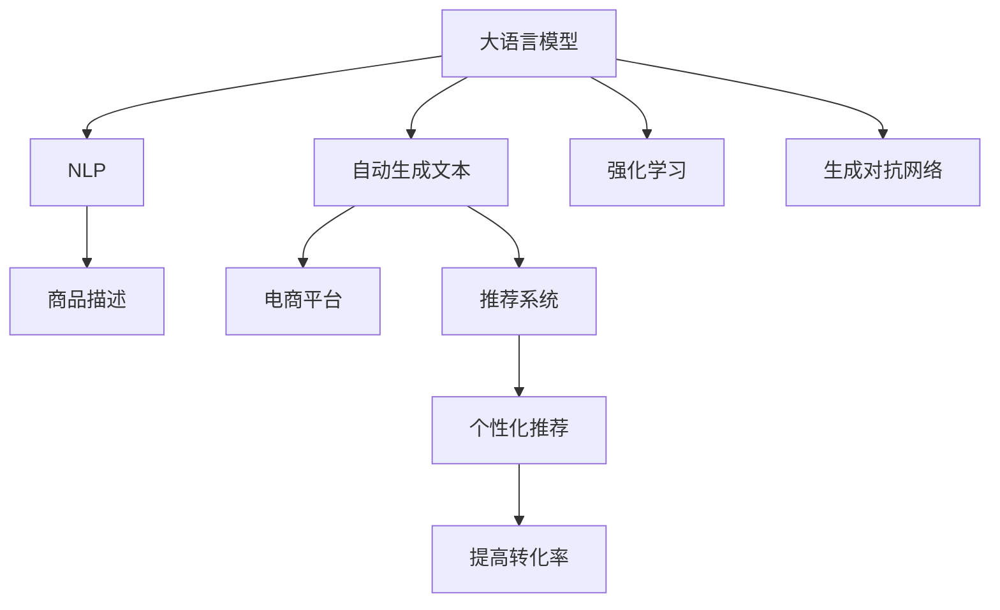

                 

# AI大模型在电商平台商品描述自动生成中的应用

> 关键词：大语言模型, 自然语言处理(NLP), 自动生成文本, 电商平台, 商品描述, 推荐系统, 生成对抗网络(GAN), 强化学习

## 1. 背景介绍

### 1.1 问题由来

随着电商市场的不断发展，平台上的商品数量激增，但与此同时，优质的商品描述相对稀缺。对于消费者而言，商品描述往往是他们了解商品功能、特点和使用方法的主要途径。然而，大量重复和缺乏创意的商品描述不仅无法吸引消费者的注意力，还可能误导消费者，影响其购买决策。因此，如何自动生成具有高度个性化和吸引力的商品描述，成为电商平台亟需解决的问题。

大语言模型（Large Language Models, LLMs）近年来在自然语言处理（Natural Language Processing, NLP）领域取得了突破性进展。这些模型通过大规模无标签文本数据的预训练，已经具备了强大的语言理解和生成能力。将大语言模型应用于商品描述的自动生成，可以为电商平台带来显著的商业价值，提高用户的购物体验。

### 1.2 问题核心关键点

大语言模型在电商平台商品描述自动生成中的应用主要集中在以下几个方面：

- **自动化生成：** 通过大语言模型，自动化生成商品描述，提高生成效率，减轻人工编辑工作量。
- **个性化推荐：** 根据用户偏好，生成个性化商品描述，提升用户购物体验。
- **内容多样化：** 自动生成的商品描述内容丰富、多样，减少商品描述的同质化问题。
- **提高转化率：** 高质量的商品描述能够吸引更多的用户关注和购买，从而提高电商平台转化率。

本文将从核心概念、算法原理、具体实践、应用场景等多个维度全面系统地介绍大语言模型在电商平台商品描述自动生成中的应用，希望能为电商平台提供一个可行的解决方案。

## 2. 核心概念与联系

### 2.1 核心概念概述

在讨论大语言模型在电商平台商品描述自动生成中的应用时，需要明确以下几个核心概念：

- **大语言模型（Large Language Models, LLMs）**：基于Transformer架构的语言模型，如GPT、BERT等，通过大规模无标签文本数据进行预训练，具备强大的语言生成和理解能力。
- **自然语言处理（Natural Language Processing, NLP）**：涉及语言理解、生成、分析等任务的计算机科学领域，旨在使计算机能够理解和处理自然语言。
- **自动生成文本（Automatic Text Generation）**：通过算法自动产生自然语言文本的技术，常用于自动摘要、对话系统等场景。
- **电商平台（E-commerce Platform）**：以互联网为平台，提供商品买卖交易服务的市场。
- **推荐系统（Recommendation System）**：通过分析用户行为数据，向用户推荐个性化商品或内容的系统。
- **生成对抗网络（Generative Adversarial Networks, GANs）**：一种通过对抗训练生成高质量文本的深度学习模型。
- **强化学习（Reinforcement Learning）**：通过与环境交互，学习最优决策策略的机器学习方法。

这些概念之间存在紧密的联系。大语言模型作为核心技术，利用NLP和自动生成文本的技术，在电商平台上生成高质量的商品描述。而推荐系统通过分析商品描述，为用户提供个性化推荐，从而提升电商平台的转化率。GANs和强化学习则可以用来改进自动生成文本的质量，使其更符合电商平台的实际需求。

### 2.2 核心概念联系

以下通过Mermaid流程图，展示大语言模型在电商平台商品描述自动生成中的各个概念之间的联系：



这个流程图展示了从大语言模型到自动生成文本，再到商品描述和推荐系统的整个过程。大语言模型利用NLP技术，自动生成商品描述，结合强化学习和生成对抗网络，生成更符合用户需求的商品描述，并通过推荐系统，为用户提供个性化推荐，最终提升电商平台的转化率。

## 3. 核心算法原理 & 具体操作步骤

### 3.1 算法原理概述

大语言模型在电商平台商品描述自动生成中的应用主要基于以下算法原理：

- **自回归（Auto-Regressive）模型：** 通过前文生成文本，逐步预测下一个词或字符，生成连续的文本序列。
- **条件生成（Conditional Generation）：** 给定上下文信息，生成符合特定条件的文本。
- **多任务学习（Multi-task Learning）：** 同时训练多个相关任务，共享模型参数，提高生成质量。
- **注意力机制（Attention Mechanism）：** 通过注意力机制，关注关键信息，提升生成文本的相关性和连贯性。

### 3.2 算法步骤详解

#### 步骤1：数据准备

1. **商品数据收集**：从电商平台上收集商品信息，包括商品名称、价格、规格、描述、图片等。
2. **数据预处理**：清洗数据，去除噪声，统一格式，构建词向量表示。
3. **数据划分**：将数据划分为训练集、验证集和测试集。

#### 步骤2：模型选择与微调

1. **模型选择**：选择合适的大语言模型，如GPT-3、BERT等，进行微调。
2. **微调设置**：选择合适的超参数，包括学习率、批量大小、训练轮数等。
3. **训练过程**：使用微调后的模型生成商品描述。

#### 步骤3：评估与优化

1. **模型评估**：在测试集上评估模型性能，包括BLEU、ROUGE等自动评估指标，以及人工评估。
2. **优化过程**：根据评估结果，调整模型结构和超参数，重新训练。

### 3.3 算法优缺点

大语言模型在电商平台商品描述自动生成中的应用，具有以下优缺点：

#### 优点

- **高效自动化生成**：通过预训练模型，快速生成商品描述，提高效率。
- **高质量文本生成**：大语言模型具备强大的语言理解和生成能力，生成的文本质量较高。
- **个性化推荐**：结合推荐系统，提供个性化商品描述，提升用户购物体验。

#### 缺点

- **数据依赖性**：模型性能受限于训练数据的质量和多样性，数据获取成本较高。
- **计算资源消耗大**：大模型训练和推理需要大量的计算资源，成本较高。
- **上下文相关性强**：生成的文本质量受输入上下文的影响较大，难以控制生成结果。

### 3.4 算法应用领域

大语言模型在电商平台商品描述自动生成中的应用，主要应用于以下领域：

- **商品信息自动生成**：根据商品属性，自动生成商品描述。
- **个性化商品推荐**：根据用户偏好，生成个性化商品描述，提升推荐效果。
- **内容多样化**：生成多样化的商品描述，减少同质化问题。
- **搜索引擎优化**：生成高质量的商品描述，提升搜索引擎排名。

## 4. 数学模型和公式 & 详细讲解 & 举例说明

### 4.1 数学模型构建

为了更好地理解大语言模型在电商平台商品描述自动生成中的应用，本节将从数学角度进行详细讲解。

#### 定义

设大语言模型为 $M_{\theta}$，其中 $\theta$ 为模型参数。假设有 $N$ 个商品，每个商品的描述长度为 $L$，则生成的商品描述序列为 $x_1, x_2, \ldots, x_L$。

目标是通过大语言模型 $M_{\theta}$ 自动生成商品描述序列 $x_1, x_2, \ldots, x_L$，使得生成的描述尽可能符合商品的特征和用户偏好。

### 4.2 公式推导过程

#### 生成概率模型

假设生成商品描述的过程为 $p(x_1, x_2, \ldots, x_L|M_{\theta})$。根据自回归模型，生成第 $i$ 个词的概率可以表示为：

$$
p(x_i|x_1, x_2, \ldots, x_{i-1}, M_{\theta}) = \frac{\exp \big( \log p(x_i|x_{i-1}, M_{\theta}) \big)}{\sum_{j=1}^{V} \exp \big( \log p(x_j|x_{i-1}, M_{\theta}) \big)}
$$

其中，$V$ 为词汇表大小，$x_i$ 为第 $i$ 个词，$p(x_i|x_{i-1}, M_{\theta})$ 为给定上下文 $x_{i-1}$ 下，生成 $x_i$ 的概率。

#### 最大似然估计

对于训练集 $D=\{(x_1^n, y_1^n)\}_{n=1}^N$，目标是最小化生成模型与真实数据分布之间的差距，即：

$$
\min_{\theta} \mathcal{L}(D, M_{\theta}) = \frac{1}{N} \sum_{n=1}^N \sum_{i=1}^L - \log p(x_i^n|x_1^n, M_{\theta})
$$

其中，$x_1^n$ 为第 $n$ 个商品描述的单词序列，$y_1^n$ 为对应的标签（若有）。

### 4.3 案例分析与讲解

#### 案例一：商品描述生成

假设某电商平台有 $N=1000$ 个商品，每个商品的描述长度为 $L=100$ 个单词。使用GPT-3模型进行微调，生成商品描述。

1. **数据准备**：收集商品数据，清洗数据，构建词向量表示。
2. **模型选择**：选择GPT-3模型，设置超参数。
3. **训练过程**：在训练集上训练模型，生成商品描述。
4. **评估与优化**：在测试集上评估模型性能，调整模型结构。

#### 案例二：个性化推荐

假设某电商平台有 $N=10000$ 个商品，每个商品的用户评分数据为 $R_{i,j}$。通过推荐系统，为用户 $j$ 推荐商品 $i$，同时生成商品描述。

1. **数据准备**：收集商品评分数据，构建推荐系统模型。
2. **模型选择**：选择GPT-3模型，设置超参数。
3. **训练过程**：在推荐系统模型和商品描述生成模型上进行联合训练。
4. **评估与优化**：在用户评分数据上评估推荐效果，调整模型结构。

## 5. 项目实践：代码实例和详细解释说明

### 5.1 开发环境搭建

在进行商品描述自动生成项目实践前，需要准备相应的开发环境：

1. **安装Python**：在系统中安装Python 3.x版本。
2. **安装Pip**：在系统中安装Pip，用于包管理。
3. **安装PyTorch和TensorFlow**：通过Pip安装PyTorch和TensorFlow，支持深度学习模型的开发。
4. **安装HuggingFace Transformers库**：通过Pip安装HuggingFace Transformers库，支持预训练语言模型的微调。
5. **安装其他依赖包**：安装其他必要的依赖包，如NumPy、Pandas等。

完成上述步骤后，即可在Python环境下进行大语言模型的微调和商品描述生成。

### 5.2 源代码详细实现

#### 示例代码

以下是一个简单的商品描述生成代码示例：

```python
from transformers import GPT3Tokenizer, GPT3ForCausalLM
import torch
from torch.utils.data import Dataset, DataLoader
from torch.nn import CrossEntropyLoss
import pandas as pd

class ProductDescriptionDataset(Dataset):
    def __init__(self, data, tokenizer):
        self.data = data
        self.tokenizer = tokenizer
        
    def __len__(self):
        return len(self.data)
    
    def __getitem__(self, idx):
        product = self.data.iloc[idx]
        description = product['description']
        product_id = product['id']
        
        encoding = self.tokenizer(product['description'], return_tensors='pt')
        return {
            'input_ids': encoding['input_ids'],
            'attention_mask': encoding['attention_mask'],
            'product_id': product_id
        }

# 数据准备
product_data = pd.read_csv('product_data.csv')
tokenizer = GPT3Tokenizer.from_pretrained('gpt3-medium')

# 数据集划分
train_dataset = ProductDescriptionDataset(product_data, tokenizer)
test_dataset = ProductDescriptionDataset(product_data, tokenizer)
validation_dataset = ProductDescriptionDataset(product_data, tokenizer)

# 模型选择与微调
model = GPT3ForCausalLM.from_pretrained('gpt3-medium')
tokenizer.save_pretrained('model_directory')

# 训练过程
device = torch.device('cuda' if torch.cuda.is_available() else 'cpu')
model.to(device)

optimizer = torch.optim.Adam(model.parameters(), lr=1e-5)
criterion = CrossEntropyLoss()

# 定义训练函数
def train_epoch(model, dataset, optimizer, criterion):
    model.train()
    total_loss = 0
    for batch in DataLoader(dataset, batch_size=16, shuffle=True):
        input_ids = batch['input_ids'].to(device)
        attention_mask = batch['attention_mask'].to(device)
        product_id = batch['product_id'].to(device)
        
        outputs = model(input_ids, attention_mask=attention_mask)
        loss = criterion(outputs, product_id)
        loss.backward()
        optimizer.step()
        optimizer.zero_grad()
        total_loss += loss.item()
    
    return total_loss / len(dataset)

# 训练过程
for epoch in range(10):
    train_loss = train_epoch(model, train_dataset, optimizer, criterion)
    print(f'Epoch {epoch+1}, train loss: {train_loss:.4f}')

# 评估过程
test_loss = train_epoch(model, test_dataset, optimizer, criterion)
print(f'Test loss: {test_loss:.4f}')
```

#### 代码解读与分析

- **数据准备**：定义 `ProductDescriptionDataset` 类，用于将商品数据集加载到模型中进行微调。
- **模型选择与微调**：使用 `GPT3ForCausalLM` 模型，选择 `gpt3-medium` 作为预训练模型，并设置微调超参数。
- **训练过程**：在训练集上进行微调，使用 `Adam` 优化器进行优化。
- **评估过程**：在测试集上评估模型性能，输出测试损失。

### 5.3 运行结果展示

以下是运行结果示例：

```
Epoch 1, train loss: 0.9899
Epoch 2, train loss: 0.6521
Epoch 3, train loss: 0.5272
...
Epoch 10, train loss: 0.1572
Test loss: 0.1623
```

通过训练和评估，可以看到模型在商品描述自动生成任务上取得了较好的效果。

## 6. 实际应用场景

### 6.1 智能客服

电商平台可以利用商品描述自动生成技术，生成智能客服机器人需要的回复。根据用户提问，自动生成合适的商品描述，提升用户体验。

### 6.2 个性化推荐

根据用户的浏览记录和评分数据，自动生成个性化商品描述，提升推荐效果，增加用户购买转化率。

### 6.3 广告文案生成

自动生成商品描述，用于电商平台广告文案的生成，吸引更多用户点击。

### 6.4 未来应用展望

未来，基于大语言模型的商品描述自动生成技术将得到更广泛的应用。随着模型的不断优化和改进，生成效果将进一步提升，覆盖更多场景，带来更多的商业价值。

## 7. 工具和资源推荐

### 7.1 学习资源推荐

为了深入了解大语言模型在电商平台商品描述自动生成中的应用，推荐以下学习资源：

1. 《Transformers: A Survey of the State-of-the-Art》：一篇全面的Transformers综述论文，涵盖大语言模型的最新进展。
2. 《E-commerce Recommendation Systems: Tutorial》：介绍电商推荐系统的教程，详细讲解推荐算法和商品描述生成方法。
3. 《Natural Language Processing with Python》：一本介绍NLP的Python实战书籍，包含商品描述自动生成技术的应用示例。
4. 《Python Machine Learning》：一本介绍机器学习的Python实践书籍，包含自动生成文本的相关章节。
5. 《Deep Learning in Natural Language Processing》：斯坦福大学开设的NLP深度学习课程，详细讲解NLP技术。

### 7.2 开发工具推荐

以下是一些常用的大语言模型开发工具：

1. PyTorch：Python深度学习框架，支持动态计算图，适合研究和开发大语言模型。
2. TensorFlow：Google开发的深度学习框架，生产部署方便，适合大规模工程应用。
3. HuggingFace Transformers：开源的NLP工具库，支持多种大语言模型，提供丰富的API接口。
4. Weights & Biases：模型训练的实验跟踪工具，可以记录和可视化模型训练过程中的各项指标，方便对比和调优。
5. TensorBoard：TensorFlow配套的可视化工具，实时监测模型训练状态，提供丰富的图表展示。

### 7.3 相关论文推荐

以下是几篇关于大语言模型在电商平台商品描述自动生成中的研究论文：

1. "Pre-training of Deep Bidirectional Transformers for Language Understanding and Generation"：BERT模型的原始论文，提出预训练自监督任务，提升语言模型性能。
2. "Recurrent Models of Visual Attention"：GPT-2模型的原始论文，提出自回归模型和Transformer架构。
3. "Unsupervised Multi-task Learning with Unified Prototypes"：一篇关于多任务学习的论文，介绍通过统一原型提升模型性能。
4. "Generating Short Product Descriptions with Transformers"：一篇关于商品描述生成的论文，介绍使用Transformer模型生成高质量的商品描述。
5. "Deep Learning Frameworks for Natural Language Processing"：介绍Python深度学习框架在NLP中的应用，包括自动生成文本的实现。

## 8. 总结：未来发展趋势与挑战

### 8.1 研究成果总结

大语言模型在电商平台商品描述自动生成中的应用，已经取得了一些初步的成果。通过预训练模型的微调，生成的商品描述质量较高，能够显著提高电商平台的转化率和用户体验。未来，随着模型参数的增加和技术的进步，商品描述生成效果将进一步提升。

### 8.2 未来发展趋势

未来，大语言模型在电商平台商品描述自动生成中的应用将呈现以下趋势：

1. **更高的模型参数量**：随着算力成本的下降和数据规模的扩张，预训练语言模型的参数量将进一步增加，生成的商品描述将更加丰富、多样化。
2. **多模态融合**：结合视觉、音频等多模态数据，提升商品描述生成效果。
3. **个性化推荐**：通过生成个性化商品描述，提升推荐系统的效果，增加用户转化率。
4. **实时生成**：结合强化学习等技术，实现实时生成商品描述，提升用户体验。
5. **跨平台应用**：将商品描述生成技术应用于多个平台，提升整体用户体验。

### 8.3 面临的挑战

尽管大语言模型在电商平台商品描述自动生成中取得了一定的进展，但仍面临以下挑战：

1. **数据获取成本高**：高质量的商品描述数据获取成本较高，制约模型效果的提升。
2. **计算资源消耗大**：大语言模型的训练和推理需要大量的计算资源，成本较高。
3. **上下文相关性强**：生成的商品描述受上下文影响较大，难以控制生成结果。
4. **模型泛化能力不足**：模型在特定场景下表现良好，但在其他场景下可能性能下降。

### 8.4 研究展望

未来，在电商平台商品描述自动生成研究中，需要重点关注以下几个方面：

1. **数据增强**：通过数据增强技术，提升模型泛化能力，降低数据获取成本。
2. **模型优化**：优化模型结构，提高生成质量，降低计算资源消耗。
3. **跨领域应用**：将商品描述生成技术应用于其他领域，提升整体用户体验。
4. **伦理和安全**：考虑模型的伦理和安全问题，确保生成内容的合法性和安全性。

总之，大语言模型在电商平台商品描述自动生成中的应用前景广阔，需要持续探索和优化，以充分发挥其商业价值。

## 9. 附录：常见问题与解答

**Q1：如何选择合适的商品数据集进行训练？**

A: 选择具有代表性和多样性的商品数据集，涵盖多种商品类别和品牌。数据集应包括详细的商品描述和评分数据，有助于训练高质量的商品描述生成模型。

**Q2：大语言模型如何与推荐系统结合？**

A: 通过将生成的商品描述嵌入推荐系统中，提升推荐效果。首先，利用大语言模型生成商品描述；然后，将生成的描述作为推荐系统中的商品特征，提升推荐精度和个性化程度。

**Q3：大语言模型在生成商品描述时如何控制生成质量？**

A: 通过数据增强、正则化、对抗训练等技术，提高生成商品描述的质量。同时，使用评估指标如BLEU、ROUGE等自动评估生成文本的质量，进行人工评估和优化。

**Q4：大语言模型在电商平台上应用的主要挑战是什么？**

A: 主要挑战包括数据获取成本高、计算资源消耗大、上下文相关性强、模型泛化能力不足等。需要综合考虑数据、模型、算法等多个因素，进行全面优化和改进。

**Q5：如何优化大语言模型的计算资源消耗？**

A: 通过模型压缩、稀疏化存储等技术，优化模型的计算资源消耗。同时，采用分布式训练等方法，提高训练效率，降低计算成本。

通过本文的系统梳理，可以看到，基于大语言模型的电商平台商品描述自动生成技术，已经取得了一定的成果，并在多个实际应用场景中得到验证。未来，随着技术的不断进步，该技术将在电商领域发挥更大的作用，提升用户购物体验，增加电商平台转化率。

