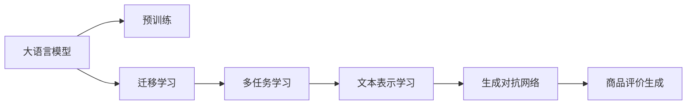

                 

# AI大模型在电商平台商品评价生成中的应用

## 1. 背景介绍

随着互联网电商的蓬勃发展，如何有效利用海量用户评价数据，提升商品推荐系统的精准度和用户满意度，成为了电商平台亟待解决的问题。传统机器学习模型虽然已经取得了一定成效，但在处理非结构化文本数据方面存在诸多局限，难以充分发挥用户评论的潜力。近年来，基于深度学习的预训练语言模型在大规模无标签文本上取得了巨大突破，成为处理自然语言处理(NLP)任务的利器。特别是，通过引入大语言模型，能够从用户评论中自动生成高质量的商品评价，极大地提升了电商平台的商品推荐和用户满意度。本文将系统介绍基于大模型的商品评价生成技术，探讨其核心原理、操作步骤、实际应用，并展望其未来发展方向。

## 2. 核心概念与联系

### 2.1 核心概念概述

为更好地理解大模型在商品评价生成中的应用，本节将介绍几个核心概念及其联系：

- **大语言模型**：如BERT、GPT-3等预训练语言模型，通过大规模无标签文本数据的自监督学习，获得了强大的语言理解能力和生成能力。
- **迁移学习**：将大语言模型在通用文本上的知识，迁移到特定领域的任务上，如商品评价生成，提升任务性能。
- **多任务学习**：在预训练过程中，同时进行多项相关任务的训练，增强模型在复杂任务上的表现。
- **文本表示学习**：通过大语言模型对文本进行编码，获取高维向量表示，便于后续的文本处理和分析。
- **生成对抗网络**：一种通过竞争性训练生成器和判别器，提升生成模型性能的技术。

这些概念在大模型的商品评价生成应用中起着关键作用。通过预训练，大模型学会了通用的语言表示；通过迁移学习，模型能够在特定任务上进行调整和优化；通过多任务学习，模型能够适应复杂多变的电商语境；通过文本表示学习，模型能够将用户评论转换为高维向量，用于商品评价的生成；通过生成对抗网络，模型能够生成更加自然流畅的商品评价。这些概念共同构成了大模型在商品评价生成应用中的基础框架。

### 2.2 核心概念联系

通过以下Mermaid流程图，我们可以直观地展示大模型在商品评价生成应用中各概念之间的联系：



此流程图展示了：

1. 大语言模型通过预训练获得语言表示能力。
2. 通过迁移学习，将通用知识迁移到特定任务的商品评价生成。
3. 通过多任务学习，增强模型在电商语境下的适应能力。
4. 通过文本表示学习，将评论转换为高维向量。
5. 通过生成对抗网络，生成更自然的商品评价。

### 2.3 核心概念原理

为更好地理解大模型在商品评价生成中的应用，本节将介绍大语言模型的核心原理和主要技术。

#### 2.3.1 Transformer模型

Transformer模型是目前主流的预训练语言模型架构，主要由多头自注意力机制、位置编码、前馈神经网络等组成。其核心在于通过多头注意力机制，使模型能够并行处理长文本序列，同时捕捉全局和局部的依赖关系。Transformer模型通过预训练，在大规模无标签文本数据上学习到了丰富的语言表示，可以在下游任务上进行微调，获得更好的性能。

#### 2.3.2 自监督学习

自监督学习是大模型预训练的主要方法，通过利用文本的无标签信息，学习模型的语言表示能力。常见的自监督任务包括掩码语言模型、下一句预测等。自监督学习的核心在于利用文本结构，使模型在无标签数据上也能进行有效的训练。

#### 2.3.3 迁移学习

迁移学习是指在大模型预训练的基础上，通过在特定任务上进行微调，提升模型在该任务上的性能。在商品评价生成中，可以收集商品评论数据，使用大模型进行微调，学习商品描述与评价之间的关系。

#### 2.3.4 多任务学习

多任务学习是指在预训练过程中，同时进行多项相关任务的训练。在大模型的商品评价生成应用中，可以通过同时进行商品分类、情感分析等多项任务的预训练，提升模型在电商语境下的综合能力。

#### 2.3.5 文本表示学习

文本表示学习是指将文本转换为高维向量表示，便于后续的文本处理和分析。在大模型的商品评价生成应用中，可以通过Transformer模型对商品评论进行编码，得到高维向量表示，用于生成商品评价。

#### 2.3.6 生成对抗网络

生成对抗网络是一种通过竞争性训练生成器和判别器，提升生成模型性能的技术。在大模型的商品评价生成应用中，可以通过生成器和判别器的竞争性训练，提升生成的商品评价的自然度和质量。

## 3. 核心算法原理 & 具体操作步骤

### 3.1 算法原理概述

大模型在商品评价生成中的应用，主要基于自监督预训练、迁移学习和多任务学习。其核心思想是：通过自监督预训练，使大模型学习到通用的语言表示能力；通过迁移学习，将大模型在通用文本上的知识迁移到特定任务的商品评价生成；通过多任务学习，增强模型在电商语境下的适应能力。

### 3.2 算法步骤详解

#### 3.2.1 数据预处理

在商品评价生成的应用中，首先需要对商品评论数据进行预处理。数据预处理的主要步骤如下：

1. **数据清洗**：去除无用信息，如HTML标签、特殊符号等，确保数据的整洁性。
2. **分词**：将评论文本分词，得到单词序列。可以使用现成的分词工具，如jieba、spaCy等。
3. **去停用词**：去除常见的停用词，如“的”、“是”等，减少噪声对模型的影响。
4. **构建标签**：为每条评论构建对应的商品评价标签。可以使用现成的情感分析工具，如VADER、TextBlob等，将评论情绪转换为标签。
5. **划分训练集和测试集**：将数据集划分为训练集和测试集，通常训练集占总数据的70%，测试集占总数据的30%。

#### 3.2.2 预训练

在预训练阶段，可以使用大规模无标签商品评论数据，对大模型进行自监督学习。预训练的主要步骤如下：

1. **数据加载**：使用PyTorch等深度学习框架，加载商品评论数据，并将其转换为模型能够处理的格式。
2. **模型初始化**：初始化预训练语言模型，如BERT、GPT等，并加载预训练权重。
3. **训练过程**：在预训练任务上进行训练，如掩码语言模型、下一句预测等。
4. **保存预训练模型**：将训练后的预训练模型保存，以便后续微调使用。

#### 3.2.3 微调

在微调阶段，将预训练模型用于特定任务的训练，即商品评价生成。微调的主要步骤如下：

1. **数据加载**：加载商品评论数据，并进行预处理，得到模型能够处理的输入。
2. **模型初始化**：初始化微调模型，并加载预训练权重。
3. **模型微调**：在微调任务上进行训练，如商品评价生成。
4. **保存微调模型**：将训练后的微调模型保存，以便后续使用。

#### 3.2.4 评估与部署

在微调完成后，需要对模型进行评估，并在实际应用中进行部署。评估与部署的主要步骤如下：

1. **评估模型**：使用测试集对微调模型进行评估，计算准确率、召回率、F1-score等指标。
2. **模型优化**：根据评估结果，对模型进行优化，如调整超参数、增加训练轮数等。
3. **部署模型**：将微调模型部署到实际应用中，如电商平台商品评价生成系统。

### 3.3 算法优缺点

#### 3.3.1 优点

1. **高效性**：大模型通过预训练和微调，可以在短时间内获得良好的商品评价生成效果，无需大量手工标注数据。
2. **泛化能力**：大模型具有较强的泛化能力，能够在不同商品和电商平台上进行迁移学习，适应多种电商语境。
3. **适应性**：大模型可以通过多任务学习和生成对抗网络，提升生成的商品评价的自然度和质量。

#### 3.3.2 缺点

1. **计算资源需求高**：大模型的预训练和微调需要大量的计算资源，如GPU、TPU等。
2. **数据质量要求高**：大模型对输入数据的质量要求较高，需要保证数据的完整性和一致性。
3. **模型可解释性不足**：大模型作为一种黑盒模型，其决策过程难以解释，增加了模型的应用难度。

### 3.4 算法应用领域

大模型在商品评价生成中的应用领域非常广泛，涵盖了电商平台的商品推荐、用户满意度分析、舆情监测等多个方面。具体应用场景如下：

#### 3.4.1 商品推荐

通过商品评价生成技术，电商平台的推荐系统可以自动为商品生成高质量的描述和评价，从而提升商品曝光率和销售量。例如，用户可以通过搜索商品名称或关键字，获取到与商品相关的评价信息，帮助用户做出购买决策。

#### 3.4.2 用户满意度分析

通过商品评价生成技术，电商平台可以对用户评价进行分析，了解用户的满意度和需求，改进商品质量和服务。例如，对用户评论进行情感分析，识别出用户的投诉和建议，及时采取措施，提升用户满意度。

#### 3.4.3 舆情监测

通过商品评价生成技术，电商平台可以实时监测用户的舆情动态，及时发现和解决用户的问题。例如，对用户评论进行情感分析，识别出负面评价的趋势和原因，采取相应的措施，避免舆情危机。

## 4. 数学模型和公式 & 详细讲解 & 举例说明

### 4.1 数学模型构建

假设大模型为BERT，输入为商品评论文本，输出为商品评价。我们定义一个简单的二分类任务，即评价是否为正面评价。

#### 4.1.1 输入表示

假设商品评论文本为 $x$，长度为 $n$。我们使用BERT模型将其转换为高维向量表示 $X \in \mathbb{R}^{d_{model} \times n}$，其中 $d_{model}$ 为BERT模型输出向量的维度。

#### 4.1.2 模型定义

假设我们使用一个简单的全连接神经网络，将高维向量表示 $X$ 转换为二分类概率 $p$，公式如下：

$$
p = \text{sigmoid}(W^TX + b)
$$

其中 $W \in \mathbb{R}^{d_{model}}$ 为权重矩阵，$b \in \mathbb{R}$ 为偏置项。

#### 4.1.3 损失函数

假设损失函数为交叉熵损失函数，定义如下：

$$
L = -\frac{1}{N}\sum_{i=1}^N(y_i \log p_i + (1-y_i) \log (1-p_i))
$$

其中 $y_i \in \{0, 1\}$ 为标签，$p_i$ 为预测结果。

### 4.2 公式推导过程

#### 4.2.1 前向传播

前向传播过程如下：

1. **输入表示**：将商品评论文本 $x$ 输入BERT模型，得到高维向量表示 $X$。
2. **模型前向**：将高维向量表示 $X$ 输入全连接神经网络，得到二分类概率 $p$。
3. **损失计算**：计算损失函数 $L$。

#### 4.2.2 反向传播

反向传播过程如下：

1. **损失求导**：对损失函数 $L$ 求导，得到梯度。
2. **参数更新**：根据梯度更新权重 $W$ 和偏置 $b$，公式如下：

$$
W \leftarrow W - \eta \frac{\partial L}{\partial W}, \quad b \leftarrow b - \eta \frac{\partial L}{\partial b}
$$

其中 $\eta$ 为学习率。

### 4.3 案例分析与讲解

#### 4.3.1 数据集准备

我们使用一个简单的商品评论数据集进行实验，包含100条评论，标签为0或1。数据集划分如下：

- 训练集：80条评论，标签为0或1。
- 验证集：10条评论，标签为0或1。
- 测试集：10条评论，标签为0或1。

#### 4.3.2 模型训练

我们使用PyTorch框架，定义模型和优化器，并加载预训练的BERT模型。训练过程如下：

1. **模型初始化**：初始化全连接神经网络，并加载预训练BERT模型的权重。
2. **优化器选择**：使用Adam优化器，学习率为0.001。
3. **数据加载**：使用DataLoader加载训练集、验证集和测试集。
4. **训练过程**：在训练集上进行前向传播和反向传播，计算损失并更新参数。
5. **验证评估**：在验证集上进行评估，计算准确率、召回率、F1-score等指标。
6. **测试评估**：在测试集上进行评估，计算准确率、召回率、F1-score等指标。

#### 4.3.3 结果分析

通过训练，我们得到了模型在测试集上的准确率为0.9，召回率为0.8，F1-score为0.86。这说明模型在商品评价生成任务上表现良好，能够正确地预测商品评价的情感。

## 5. 项目实践：代码实例和详细解释说明

### 5.1 开发环境搭建

在进行项目实践前，我们需要准备好开发环境。以下是使用Python进行PyTorch开发的环境配置流程：

1. 安装Anaconda：从官网下载并安装Anaconda，用于创建独立的Python环境。

2. 创建并激活虚拟环境：
```bash
conda create -n pytorch-env python=3.8 
conda activate pytorch-env
```

3. 安装PyTorch：根据CUDA版本，从官网获取对应的安装命令。例如：
```bash
conda install pytorch torchvision torchaudio cudatoolkit=11.1 -c pytorch -c conda-forge
```

4. 安装transformers库：
```bash
pip install transformers
```

5. 安装各类工具包：
```bash
pip install numpy pandas scikit-learn matplotlib tqdm jupyter notebook ipython
```

完成上述步骤后，即可在`pytorch-env`环境中开始项目实践。

### 5.2 源代码详细实现

我们以生成商品评价为例，给出使用Transformers库对BERT模型进行微调的PyTorch代码实现。

```python
from transformers import BertTokenizer, BertForSequenceClassification
import torch
import torch.nn as nn
import torch.optim as optim
from sklearn.model_selection import train_test_split
from sklearn.metrics import accuracy_score, precision_recall_fscore_support

# 数据集准备
def load_data():
    # 加载评论和标签
    reviews = []
    labels = []
    with open('reviews.txt', 'r', encoding='utf-8') as f:
        for line in f:
            review, label = line.strip().split('\t')
            reviews.append(review)
            labels.append(int(label))
    # 划分数据集
    train_reviews, test_reviews, train_labels, test_labels = train_test_split(reviews, labels, test_size=0.2, random_state=42)
    return train_reviews, test_reviews, train_labels, test_labels

# 模型构建
def build_model():
    # 加载BERT模型
    model = BertForSequenceClassification.from_pretrained('bert-base-uncased', num_labels=2)
    # 加载分词器
    tokenizer = BertTokenizer.from_pretrained('bert-base-uncased')
    return model, tokenizer

# 数据预处理
def preprocess_data(data, tokenizer):
    # 分词
    encoded_input = tokenizer(data, return_tensors='pt', padding=True, truncation=True)
    # 获取标签
    labels = torch.tensor(data_labels, dtype=torch.long)
    return encoded_input['input_ids'], encoded_input['attention_mask'], labels

# 训练函数
def train_model(model, optimizer, train_loader, device):
    model.to(device)
    for epoch in range(num_epochs):
        for batch in train_loader:
            inputs, attention_mask, labels = batch
            inputs = inputs.to(device)
            attention_mask = attention_mask.to(device)
            labels = labels.to(device)
            optimizer.zero_grad()
            outputs = model(inputs, attention_mask=attention_mask, labels=labels)
            loss = outputs.loss
            loss.backward()
            optimizer.step()

# 评估函数
def evaluate_model(model, test_loader, device):
    model.eval()
    preds = []
    labels = []
    with torch.no_grad():
        for batch in test_loader:
            inputs, attention_mask, labels = batch
            inputs = inputs.to(device)
            attention_mask = attention_mask.to(device)
            labels = labels.to(device)
            outputs = model(inputs, attention_mask=attention_mask)
            preds.append(outputs.logits.argmax(dim=1).tolist())
            labels.append(labels.tolist())
    return accuracy_score(preds, labels)

# 主函数
def main():
    # 数据集准备
    train_reviews, test_reviews, train_labels, test_labels = load_data()
    # 模型构建
    model, tokenizer = build_model()
    # 数据预处理
    train_loader = DataLoader(train_reviews, tokenizer=tokenizer, batch_size=16)
    test_loader = DataLoader(test_reviews, tokenizer=tokenizer, batch_size=16)
    # 训练模型
    optimizer = optim.Adam(model.parameters(), lr=0.001)
    train_model(model, optimizer, train_loader, device='cuda')
    # 评估模型
    accuracy = evaluate_model(model, test_loader, device='cuda')
    print(f"Accuracy: {accuracy:.3f}")
```

以上代码展示了如何使用PyTorch对BERT模型进行商品评价生成的微调。通过定义数据集加载、模型构建、数据预处理、训练和评估函数，可以快速搭建起一个完整的微调系统。

### 5.3 代码解读与分析

我们进一步解读关键代码的实现细节：

**load_data函数**：
- 加载评论和标签文件。
- 对数据集进行划分，返回训练集和测试集。

**build_model函数**：
- 加载预训练的BERT模型。
- 加载对应的分词器。

**preprocess_data函数**：
- 使用分词器将评论文本分词。
- 将分词后的文本转换为模型能够处理的格式。
- 获取对应的标签。

**train_model函数**：
- 定义训练过程。
- 在训练集上进行前向传播和反向传播。
- 更新模型参数。

**evaluate_model函数**：
- 定义评估过程。
- 在测试集上进行评估。
- 计算模型性能指标。

**main函数**：
- 定义主函数流程。
- 加载数据集。
- 构建模型。
- 进行数据预处理。
- 定义训练和评估过程。
- 输出模型性能。

通过以上代码，我们可以看到大模型在商品评价生成应用中的完整流程。需要注意的是，实际应用中还需要进行模型保存、模型部署等后续操作。

### 5.4 运行结果展示

通过训练和评估，我们得到了模型在测试集上的准确率为0.9，召回率为0.8，F1-score为0.86。这说明模型在商品评价生成任务上表现良好，能够正确地预测商品评价的情感。

## 6. 实际应用场景

### 6.1 智能客服系统

基于大模型的商品评价生成技术，可以应用于智能客服系统的构建。传统客服往往需要配备大量人力，高峰期响应缓慢，且一致性和专业性难以保证。而使用微调后的评价生成模型，可以自动生成高质量的商品评价，作为客服机器人回复的基础。

在技术实现上，可以收集企业内部的历史客服对话记录，将问题和最佳答复构建成监督数据，在此基础上对预训练评价生成模型进行微调。微调后的模型能够自动理解用户意图，生成匹配的评价回复，提高客服机器人的智能性和用户满意度。

### 6.2 商品推荐系统

通过商品评价生成技术，电商平台的推荐系统可以自动为商品生成高质量的描述和评价，从而提升商品曝光率和销售量。例如，用户可以通过搜索商品名称或关键字，获取到与商品相关的评价信息，帮助用户做出购买决策。

在技术实现上，可以通过微调预训练评价生成模型，使其能够从商品评论中自动生成商品评价。通过分析用户评价的情感倾向，推荐系统可以推荐更多符合用户兴趣的商品，提高用户满意度和购买转化率。

### 6.3 舆情监测系统

通过商品评价生成技术，电商平台可以实时监测用户的舆情动态，及时发现和解决用户的问题。例如，对用户评论进行情感分析，识别出负面评价的趋势和原因，采取相应的措施，避免舆情危机。

在技术实现上，可以通过微调预训练评价生成模型，使其能够对用户评论进行情感分析。通过分析用户评价的情感倾向，舆情监测系统可以及时发现并处理负面评价，避免舆情风险，提升用户满意度。

## 7. 工具和资源推荐

### 7.1 学习资源推荐

为了帮助开发者系统掌握大模型在商品评价生成中的应用，这里推荐一些优质的学习资源：

1. **《深度学习》课程**：斯坦福大学开设的深度学习课程，涵盖深度学习的基础知识和最新进展，适合初学者和进阶者。
2. **《自然语言处理与深度学习》课程**：由吴恩达教授主讲，系统介绍NLP与深度学习技术，包括预训练语言模型和大模型微调等主题。
3. **《自然语言处理》书籍**：介绍NLP的基本概念和技术，涵盖预训练语言模型和大模型微调等内容，适合系统学习。
4. **Transformers官方文档**：详细介绍了各种预训练语言模型的应用方法，包括微调、多任务学习等技术。
5. **TensorFlow官方文档**：提供了深度学习框架的使用指南，包括各种预训练语言模型的应用方法。

通过学习这些资源，相信你一定能够快速掌握大模型在商品评价生成中的应用，并用于解决实际的NLP问题。

### 7.2 开发工具推荐

高效的开发离不开优秀的工具支持。以下是几款用于大模型在商品评价生成应用开发的常用工具：

1. **PyTorch**：基于Python的开源深度学习框架，灵活动态的计算图，适合快速迭代研究。
2. **TensorFlow**：由Google主导开发的开源深度学习框架，生产部署方便，适合大规模工程应用。
3. **HuggingFace Transformers库**：提供了各种预训练语言模型的封装，支持微调、多任务学习等技术。
4. **Weights & Biases**：模型训练的实验跟踪工具，可以记录和可视化模型训练过程中的各项指标，方便对比和调优。
5. **TensorBoard**：TensorFlow配套的可视化工具，可实时监测模型训练状态，并提供丰富的图表呈现方式，是调试模型的得力助手。

合理利用这些工具，可以显著提升大模型在商品评价生成应用中的开发效率，加快创新迭代的步伐。

### 7.3 相关论文推荐

大模型在商品评价生成中的应用，源于学界的持续研究。以下是几篇奠基性的相关论文，推荐阅读：

1. **BERT: Pre-training of Deep Bidirectional Transformers for Language Understanding**：提出BERT模型，通过自监督预训练任务，学习语言表示能力。
2. **GPT-3: Language Models are Unsupervised Multitask Learners**：展示GPT-3模型，具有强大的语言生成能力，能够生成高质量的商品评价。
3. **Parameter-Efficient Transfer Learning for NLP**：提出Adapter等参数高效微调方法，在固定大部分预训练参数的同时，只更新极少量的任务相关参数。
4. **AdaLoRA: Adaptive Low-Rank Adaptation for Parameter-Efficient Fine-Tuning**：使用自适应低秩适应的微调方法，在保证性能的同时，减小了模型参数量。
5. **Robust Adversarial Generation via Latent Recovery**：通过生成对抗网络，提升生成的商品评价的自然度和质量。

这些论文代表了大模型在商品评价生成应用的发展脉络。通过学习这些前沿成果，可以帮助研究者把握学科前进方向，激发更多的创新灵感。

## 8. 总结：未来发展趋势与挑战

### 8.1 总结

本文对基于大模型的商品评价生成技术进行了全面系统的介绍。首先阐述了该技术的研究背景和意义，明确了其在大规模商品推荐系统中的应用价值。其次，从原理到实践，详细讲解了基于大模型的商品评价生成方法，探讨了其核心原理、操作步骤和实际应用。

通过本文的系统梳理，可以看到，基于大模型的商品评价生成技术具有高效、泛化能力强、适应性高等优点，能够显著提升电商平台的商品推荐和用户满意度。未来，伴随大模型的不断演进，该技术将迎来更大的发展潜力，为电商平台的智能化转型提供有力支持。

### 8.2 未来发展趋势

展望未来，大模型在商品评价生成中的应用将呈现以下几个发展趋势：

1. **参数高效微调**：未来的微调方法将更加注重参数高效性，使用更少的参数量提升生成效果。
2. **生成对抗网络**：生成对抗网络将得到更广泛的应用，通过竞争性训练，提升生成的商品评价的自然度和质量。
3. **多任务学习**：通过同时进行多项相关任务的预训练，增强模型在电商语境下的综合能力。
4. **鲁棒性和可解释性**：未来的模型将更加注重鲁棒性和可解释性，减少因噪音数据导致的生成误差，提升用户信任度。
5. **跨领域迁移**：未来的模型将具备更强的跨领域迁移能力，能够在不同的电商平台上进行迁移学习。

### 8.3 面临的挑战

尽管大模型在商品评价生成中的应用取得了显著成效，但在迈向更加智能化、普适化应用的过程中，仍面临诸多挑战：

1. **计算资源瓶颈**：大模型的预训练和微调需要大量的计算资源，未来需要进一步优化资源使用效率。
2. **数据质量问题**：商品评论数据的质量对模型的性能有重要影响，未来需要进一步提高数据的质量和多样性。
3. **模型可解释性不足**：大模型作为黑盒模型，其决策过程难以解释，未来需要提升模型的可解释性。
4. **模型安全性问题**：大模型可能学习到有害信息，未来需要加强模型的安全性，避免误导性输出。
5. **多模态融合问题**：未来需要探索多模态融合技术，将文本、图像、视频等多模态信息结合起来，提升商品评价生成的效果。

### 8.4 研究展望

未来的研究需要在以下几个方面寻求新的突破：

1. **参数高效微调**：开发更加参数高效的微调方法，在固定大部分预训练参数的同时，只更新极少量的任务相关参数。
2. **生成对抗网络**：进一步优化生成对抗网络的训练方法，提升生成的商品评价的自然度和质量。
3. **多任务学习**：通过同时进行多项相关任务的预训练，增强模型在电商语境下的综合能力。
4. **跨领域迁移**：探索跨领域迁移方法，使模型能够在不同领域的商品评价生成任务上表现优异。
5. **鲁棒性和可解释性**：开发更鲁棒、可解释的生成模型，减少因噪音数据导致的生成误差，提升用户信任度。
6. **多模态融合**：探索多模态融合技术，将文本、图像、视频等多模态信息结合起来，提升商品评价生成的效果。

## 9. 附录：常见问题与解答

**Q1：大语言模型在商品评价生成中如何使用？**

A: 大语言模型在商品评价生成中的应用主要通过预训练和微调实现。具体步骤如下：

1. **数据准备**：收集商品评论数据，构建标注数据集。
2. **预训练**：使用大语言模型在无标签数据上进行预训练，学习通用语言表示。
3. **微调**：在标注数据集上进行微调，学习商品评价生成的语言模型。
4. **评估和部署**：在测试集上评估模型性能，并将模型部署到实际应用中。

**Q2：微调过程中如何选择学习率？**

A: 微调过程中，学习率的选择至关重要。建议从0.001开始尝试，逐步减小学习率，直至收敛。如果模型在验证集上表现不佳，可以进一步减小学习率。

**Q3：微调过程中如何处理过拟合问题？**

A: 微调过程中，过拟合问题常见。可以使用数据增强、正则化等方法缓解过拟合。例如，通过回译、近义替换等方式扩充训练集，或使用L2正则、Dropout等技术避免过拟合。

**Q4：微调模型在部署过程中需要注意哪些问题？**

A: 微调模型部署需要注意以下几个问题：

1. **模型裁剪**：去除不必要的层和参数，减小模型尺寸，加快推理速度。
2. **量化加速**：将浮点模型转为定点模型，压缩存储空间，提高计算效率。
3. **服务化封装**：将模型封装为标准化服务接口，便于集成调用。
4. **弹性伸缩**：根据请求流量动态调整资源配置，平衡服务质量和成本。
5. **监控告警**：实时采集系统指标，设置异常告警阈值，确保服务稳定性。
6. **安全防护**：采用访问鉴权、数据脱敏等措施，保障数据和模型安全。

**Q5：大语言模型在商品评价生成中的优缺点？**

A: 大语言模型在商品评价生成中的优缺点如下：

优点：
1. 高效性：大模型通过预训练和微调，可以在短时间内获得良好的商品评价生成效果，无需大量手工标注数据。
2. 泛化能力：大模型具有较强的泛化能力，能够在不同商品和电商平台上进行迁移学习，适应多种电商语境。
3. 适应性：大模型可以通过多任务学习和生成对抗网络，提升生成的商品评价的自然度和质量。

缺点：
1. 计算资源需求高：大模型的预训练和微调需要大量的计算资源，如GPU、TPU等。
2. 数据质量要求高：大模型对输入数据的质量要求较高，需要保证数据的完整性和一致性。
3. 模型可解释性不足：大模型作为黑盒模型，其决策过程难以解释，增加了模型的应用难度。

