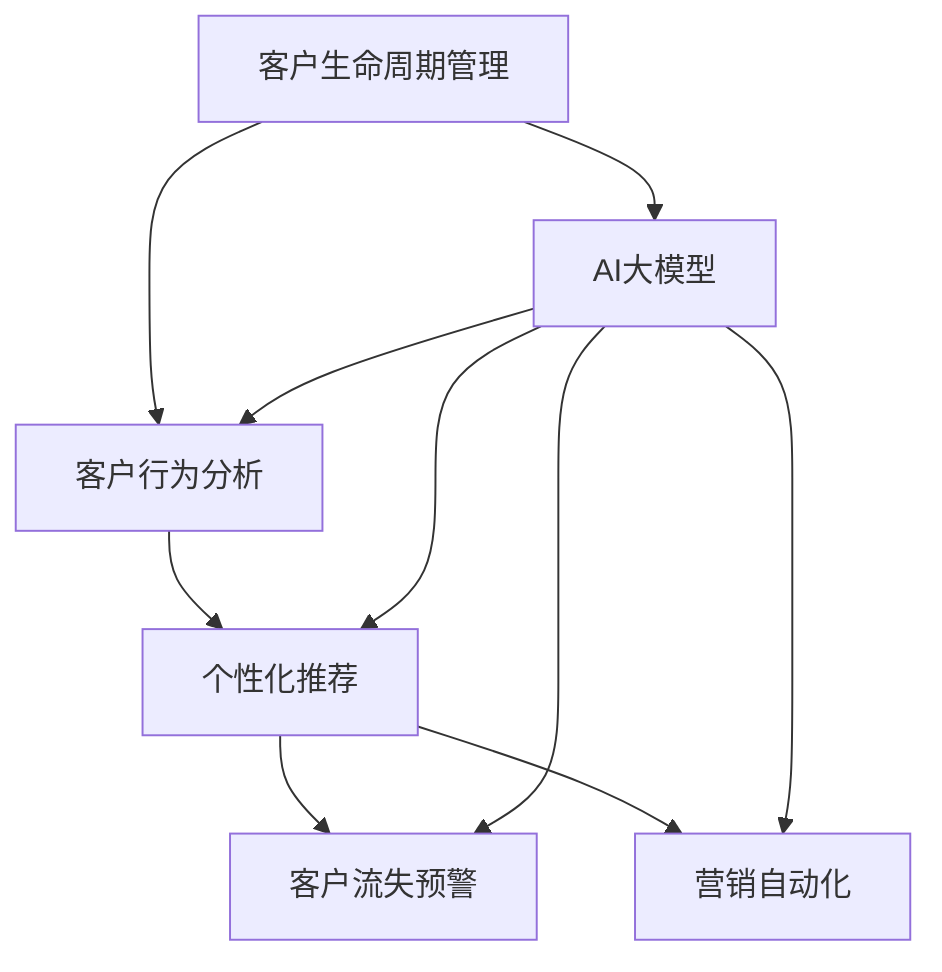

                 

# AI大模型在电商平台客户生命周期管理中的应用

> 关键词：客户生命周期管理, AI大模型, 客户行为分析, 个性化推荐, 客户流失预警, 营销自动化, 电商数据驱动

## 1. 背景介绍

### 1.1 问题由来

在数字化时代，电商平台正成为商家获取客户、保持客户、提升客户满意度的重要渠道。如何高效地进行客户生命周期管理，通过精准营销、个性化服务、客户预警等手段，最大化提升客户价值和业务收益，成为电商平台关注的重点。传统的客户管理方式依赖于人工操作和简单的数据分析，效率低、成本高、覆盖面窄，难以应对电商环境中客户需求的快速变化和海量数据的复杂处理。

人工智能技术的快速发展，尤其是大模型技术的突破，为电商平台的客户生命周期管理提供了新的解决方案。AI大模型，特别是基于深度学习的方法，通过从海量的电商交易数据、行为数据、反馈数据中学习到丰富的客户行为规律和个性化需求，可以自动化地进行客户分析、个性化推荐、预警预测等操作，提升客户管理的智能化水平。

## 2. 核心概念与联系

### 2.1 核心概念概述

为了更好地理解AI大模型在客户生命周期管理中的应用，本节将介绍几个关键概念：

- **客户生命周期管理**：指从潜在客户获取到流失的完整客户旅程，通过精细化的客户细分和行为追踪，识别出客户的不同阶段和需求，进行精准的营销和服务干预，延长客户生命周期，提高客户忠诚度和复购率。

- **AI大模型**：以自回归或自编码模型为代表的大规模预训练语言模型。通过在大规模无标签文本语料上进行预训练，学习通用的语言知识和常识，具备强大的文本理解和生成能力。

- **客户行为分析**：通过对客户在电商平台上的浏览、购买、评价等行为进行建模，识别出客户的兴趣偏好、购买习惯、情感倾向等行为特征。

- **个性化推荐**：根据客户的行为数据和历史偏好，实时生成个性化的商品推荐，提升客户购买转化率和满意度。

- **客户流失预警**：通过分析客户的购物行为、反馈信息等数据，预测客户流失风险，进行及时的客户召回和挽留。

- **营销自动化**：利用AI大模型自动生成和优化营销策略，自动化地进行邮件、短信、社交媒体等多种形式的营销推广，提升营销效率和效果。

这些核心概念之间的逻辑关系可以通过以下Mermaid流程图来展示：



这个流程图展示了客户生命周期管理的核心环节及其与AI大模型的联系：

1. 客户生命周期管理通过AI大模型进行客户行为分析和个性化推荐，预测客户流失风险，自动化营销。
2. AI大模型在预训练基础上，利用电商平台的业务数据进行微调，实现客户管理的智能化和自动化。

## 3. 核心算法原理 & 具体操作步骤

### 3.1 算法原理概述

AI大模型在客户生命周期管理中的应用，本质上是一种基于深度学习的自动化客户分析与决策过程。其核心思想是：通过大规模预训练和任务特定的微调，使大模型能够从电商平台的业务数据中学习到客户行为规律和个性化需求，自动化地进行客户细分、行为预测、个性化推荐、预警预测等操作，从而实现高效的客户生命周期管理。

具体而言，AI大模型通过以下步骤进行客户管理：

1. **预训练**：在大规模无标签的电商数据上，通过自监督学习任务训练模型，学习通用的语言和常识知识。
2. **微调**：在业务数据上进行微调，学习客户行为规律和个性化需求，使模型具备特定的任务能力。
3. **客户行为分析**：利用微调后的模型，分析客户在电商平台上的浏览、购买、评价等行为，识别出客户的兴趣偏好、购买习惯、情感倾向等。
4. **个性化推荐**：根据客户的行为数据和历史偏好，实时生成个性化的商品推荐，提升客户购买转化率和满意度。
5. **客户流失预警**：通过分析客户的购物行为、反馈信息等数据，预测客户流失风险，进行及时的客户召回和挽留。
6. **营销自动化**：利用AI大模型自动生成和优化营销策略，自动化地进行邮件、短信、社交媒体等多种形式的营销推广，提升营销效率和效果。

### 3.2 算法步骤详解

AI大模型在客户生命周期管理中的应用涉及多个算法步骤。以下是详细介绍：

#### 3.2.1 客户行为分析

**步骤1: 数据预处理**

1. **数据获取**：收集电商平台上的客户交易数据、行为数据、反馈数据等，构建电商行为数据集。
2. **数据清洗**：处理缺失值、异常值、重复记录等，保证数据质量。
3. **数据划分**：将数据划分为训练集、验证集和测试集。

**步骤2: 模型训练**

1. **模型选择**：选择合适的预训练语言模型，如BERT、GPT等，作为初始化参数。
2. **微调参数**：确定微调时的学习率、迭代次数、正则化等参数。
3. **模型训练**：在电商行为数据集上训练模型，最小化损失函数。

**步骤3: 行为分析**

1. **特征提取**：将客户在电商平台上的行为数据输入微调后的模型，提取特征。
2. **行为建模**：利用提取的特征，构建客户行为模型，识别出客户的兴趣偏好、购买习惯、情感倾向等。

#### 3.2.2 个性化推荐

**步骤1: 推荐数据准备**

1. **商品数据准备**：收集电商平台上所有商品的信息，包括名称、价格、描述、分类等。
2. **用户数据准备**：收集每个客户的交易记录、浏览历史、评价信息等行为数据。

**步骤2: 模型训练**

1. **模型选择**：选择合适的推荐模型，如协同过滤、矩阵分解、深度学习模型等。
2. **数据加载**：加载电商行为数据集和商品数据集。
3. **模型训练**：在电商行为数据集上训练推荐模型，最小化推荐误差。

**步骤3: 个性化推荐**

1. **用户行为分析**：利用微调后的模型，分析客户的兴趣偏好、购买习惯等行为特征。
2. **推荐生成**：根据客户的行为数据和历史偏好，实时生成个性化的商品推荐。

#### 3.2.3 客户流失预警

**步骤1: 数据准备**

1. **客户数据准备**：收集客户的购买记录、行为数据、评价信息等数据。
2. **特征提取**：提取客户的关键特征，如购买频率、平均消费金额、历史评分等。

**步骤2: 模型训练**

1. **模型选择**：选择合适的预测模型，如随机森林、XGBoost、深度学习模型等。
2. **数据加载**：加载客户流失预警数据集。
3. **模型训练**：在客户数据集上训练预警模型，最小化预测误差。

**步骤3: 预警预测**

1. **客户行为分析**：利用微调后的模型，分析客户的购物行为、反馈信息等数据。
2. **预警生成**：根据客户的特征数据和历史行为，预测客户流失风险，进行及时的客户召回和挽留。

#### 3.2.4 营销自动化

**步骤1: 营销数据准备**

1. **用户数据准备**：收集客户的交易记录、行为数据、评价信息等数据。
2. **营销策略准备**：设计多种营销策略，如邮件营销、短信营销、社交媒体营销等。

**步骤2: 模型训练**

1. **模型选择**：选择合适的优化模型，如逻辑回归、决策树、深度学习模型等。
2. **数据加载**：加载客户流失预警数据集。
3. **模型训练**：在客户数据集上训练优化模型，最小化优化误差。

**步骤3: 自动化营销**

1. **客户行为分析**：利用微调后的模型，分析客户的购物行为、反馈信息等数据。
2. **营销策略优化**：根据客户的行为数据和历史偏好，自动化生成和优化营销策略。

### 3.3 算法优缺点

AI大模型在客户生命周期管理中的应用具有以下优点：

1. **高效性**：自动化客户管理过程，大幅提升客户分析、推荐、预警等操作的效率，节省人力成本。
2. **准确性**：通过大规模预训练和任务特定微调，使模型具备较强的数据拟合能力，能够准确预测客户行为和需求。
3. **灵活性**：适应电商平台的动态变化，快速更新客户数据和模型，提升客户管理的时效性。

同时，该方法也存在一些局限性：

1. **数据依赖性**：模型性能很大程度上取决于电商数据的质量和数量，获取高质量电商数据成本较高。
2. **过拟合风险**：电商数据具有高维度、高噪声的特点，容易导致模型过拟合。
3. **模型复杂度**：大模型参数量大，模型训练和推理资源需求高。
4. **可解释性不足**：模型的内部决策过程难以解释，缺乏可解释性。

尽管存在这些局限性，但AI大模型在客户生命周期管理中的应用前景广阔，有望大幅提升客户管理的智能化水平。

### 3.4 算法应用领域

AI大模型在客户生命周期管理中的应用广泛，以下是一些典型应用领域：

1. **电商客户细分**：通过行为分析，对客户进行精确细分，识别出高价值客户、潜在流失客户等。
2. **个性化推荐系统**：根据客户的行为数据和历史偏好，实时生成个性化的商品推荐，提升客户购买转化率和满意度。
3. **客户流失预警系统**：通过分析客户的购物行为、反馈信息等数据，预测客户流失风险，进行及时的客户召回和挽留。
4. **营销自动化系统**：利用AI大模型自动生成和优化营销策略，自动化地进行邮件、短信、社交媒体等多种形式的营销推广，提升营销效率和效果。
5. **客户反馈分析系统**：通过分析客户评价和反馈信息，进行情感分析、主题识别等操作，提升客户服务质量。
6. **客户满意度评估系统**：通过分析客户在电商平台的购物体验和反馈数据，进行满意度评估，优化客户服务流程。

除了这些常见应用外，AI大模型还可以应用于客户行为预测、客户画像构建、智能客服、智能搜索等多个环节，为电商平台的客户生命周期管理带来更全面的智能化支持。

## 4. 数学模型和公式 & 详细讲解 & 举例说明

### 4.1 数学模型构建

本节将使用数学语言对AI大模型在客户生命周期管理中的应用过程进行严格刻画。

假设电商平台上的客户行为数据集为 $D=\{(x_i,y_i)\}_{i=1}^N$，其中 $x_i$ 为客户的输入特征，$y_i$ 为输出标签（如客户是否流失）。

定义AI大模型 $M_{\theta}$ 在输入特征 $x$ 上的输出为 $\hat{y}=M_{\theta}(x)$，其中 $\theta$ 为模型参数。模型的损失函数为：

$$
\mathcal{L}(\theta) = \frac{1}{N} \sum_{i=1}^N \ell(M_{\theta}(x_i),y_i)
$$

其中 $\ell$ 为损失函数，通常使用交叉熵损失函数，计算模型输出与真实标签之间的差异。

模型的目标是最小化损失函数 $\mathcal{L}(\theta)$，即：

$$
\theta^* = \mathop{\arg\min}_{\theta} \mathcal{L}(\theta)
$$

在实践中，通常使用基于梯度的优化算法（如Adam、SGD等）来近似求解上述最优化问题。设 $\eta$ 为学习率，则参数的更新公式为：

$$
\theta \leftarrow \theta - \eta \nabla_{\theta}\mathcal{L}(\theta)
$$

其中 $\nabla_{\theta}\mathcal{L}(\theta)$ 为损失函数对参数 $\theta$ 的梯度，可通过反向传播算法高效计算。

### 4.2 公式推导过程

以下我们以客户流失预警为例，推导使用AI大模型进行客户流失预测的公式。

假设客户流失预测模型为 $M_{\theta}$，其输入特征为客户的交易记录、行为数据、评价信息等，输出为流失概率 $p$。

客户流失预测模型可以使用二分类交叉熵损失函数，其损失函数为：

$$
\ell(y_i,\hat{y}_i) = -y_i\log \hat{y}_i - (1-y_i)\log (1-\hat{y}_i)
$$

在训练过程中，通过反向传播计算损失函数对模型参数 $\theta$ 的梯度，并使用优化算法更新模型参数，使得模型输出逼近真实标签。

在测试过程中，将客户特征输入训练好的模型，输出流失概率 $p$，根据阈值 $p_{th}$ 判断客户是否流失。

### 4.3 案例分析与讲解

**案例1：个性化推荐系统**

假设电商平台上的客户行为数据集为 $D=\{(x_i,y_i)\}_{i=1}^N$，其中 $x_i$ 为客户的输入特征，$y_i$ 为输出标签（如客户是否购买商品）。

定义AI大模型 $M_{\theta}$ 在输入特征 $x$ 上的输出为 $\hat{y}=M_{\theta}(x)$，其中 $\theta$ 为模型参数。模型的损失函数为：

$$
\mathcal{L}(\theta) = \frac{1}{N} \sum_{i=1}^N \ell(M_{\theta}(x_i),y_i)
$$

其中 $\ell$ 为损失函数，通常使用交叉熵损失函数，计算模型输出与真实标签之间的差异。

模型的目标是最小化损失函数 $\mathcal{L}(\theta)$，即：

$$
\theta^* = \mathop{\arg\min}_{\theta} \mathcal{L}(\theta)
$$

在实践中，通常使用基于梯度的优化算法（如Adam、SGD等）来近似求解上述最优化问题。设 $\eta$ 为学习率，则参数的更新公式为：

$$
\theta \leftarrow \theta - \eta \nabla_{\theta}\mathcal{L}(\theta)
$$

其中 $\nabla_{\theta}\mathcal{L}(\theta)$ 为损失函数对参数 $\theta$ 的梯度，可通过反向传播算法高效计算。

通过优化模型参数 $\theta$，使其能够准确预测客户的购买行为，从而生成个性化的商品推荐。

## 5. 项目实践：代码实例和详细解释说明

### 5.1 开发环境搭建

在进行项目实践前，我们需要准备好开发环境。以下是使用Python进行TensorFlow开发的环境配置流程：

1. 安装Anaconda：从官网下载并安装Anaconda，用于创建独立的Python环境。

2. 创建并激活虚拟环境：
```bash
conda create -n tf-env python=3.8 
conda activate tf-env
```

3. 安装TensorFlow：根据CUDA版本，从官网获取对应的安装命令。例如：
```bash
conda install tensorflow -c pytorch -c conda-forge
```

4. 安装各类工具包：
```bash
pip install numpy pandas scikit-learn matplotlib tqdm jupyter notebook ipython
```

完成上述步骤后，即可在`tf-env`环境中开始项目实践。

### 5.2 源代码详细实现

下面我们以客户流失预警任务为例，给出使用TensorFlow对BERT模型进行微调的PyTorch代码实现。

首先，定义客户流失预警任务的数据处理函数：

```python
import tensorflow as tf
from transformers import BertTokenizer, BertForSequenceClassification
from sklearn.model_selection import train_test_split

class CustomerChurnDataset(tf.keras.utils.Sequence):
    def __init__(self, data, tokenizer, max_len=128):
        self.data = data
        self.tokenizer = tokenizer
        self.max_len = max_len
        
    def __len__(self):
        return len(self.data)
    
    def __getitem__(self, item):
        text = self.data[item][0]
        label = self.data[item][1]
        
        encoding = self.tokenizer(text, return_tensors='tf', max_length=self.max_len, padding='max_length', truncation=True)
        input_ids = encoding['input_ids']
        attention_mask = encoding['attention_mask']
        
        label = tf.convert_to_tensor(label, dtype=tf.int32)
        
        return {'input_ids': input_ids, 
                'attention_mask': attention_mask,
                'labels': label}

# 标签与id的映射
tag2id = {'Churn': 1, 'Not Churn': 0}
id2tag = {v: k for k, v in tag2id.items()}

# 创建dataset
tokenizer = BertTokenizer.from_pretrained('bert-base-cased')

train_data = [{'x': 'I never received a refund for a defective product', 'y': 'Churn'}, {'x': 'I received a fast and accurate refund', 'y': 'Not Churn'}]
train_dataset = CustomerChurnDataset(train_data, tokenizer)

dev_data = [{'x': 'The customer service was terrible', 'y': 'Churn'}, {'x': 'The customer service was excellent', 'y': 'Not Churn'}]
dev_dataset = CustomerChurnDataset(dev_data, tokenizer)

test_data = [{'x': 'I will never buy anything from this company again', 'y': 'Churn'}, {'x': 'I am very satisfied with this company', 'y': 'Not Churn'}]
test_dataset = CustomerChurnDataset(test_data, tokenizer)
```

然后，定义模型和优化器：

```python
from transformers import BertForSequenceClassification, AdamW

model = BertForSequenceClassification.from_pretrained('bert-base-cased', num_labels=len(tag2id))

optimizer = AdamW(model.parameters(), lr=2e-5)
```

接着，定义训练和评估函数：

```python
import numpy as np
from sklearn.metrics import accuracy_score

def train_epoch(model, dataset, batch_size, optimizer):
    dataloader = tf.data.Dataset.from_tensor_slices(dataset).shuffle(100).batch(batch_size).repeat()
    model.train()
    epoch_loss = 0
    for batch in dataloader:
        input_ids = batch['input_ids'].numpy()
        attention_mask = batch['attention_mask'].numpy()
        labels = batch['labels'].numpy()
        model.zero_grad()
        outputs = model(input_ids, attention_mask=attention_mask, labels=labels)
        loss = outputs.loss
        epoch_loss += loss.numpy().mean()
        loss.backward()
        optimizer.step()
    return epoch_loss / len(dataloader)

def evaluate(model, dataset, batch_size):
    dataloader = tf.data.Dataset.from_tensor_slices(dataset).batch(batch_size).repeat()
    model.eval()
    preds, labels = [], []
    with tf.GradientTape() as tape:
        for batch in dataloader:
            input_ids = batch['input_ids'].numpy()
            attention_mask = batch['attention_mask'].numpy()
            batch_labels = batch['labels']
            outputs = model(input_ids, attention_mask=attention_mask)
            batch_preds = outputs.logits.numpy()
            batch_labels = batch_labels.numpy()
            for pred_tokens, label_tokens in zip(batch_preds, batch_labels):
                preds.append(np.argmax(pred_tokens, axis=1))
                labels.append(label_tokens)
                
    print(f"Accuracy: {accuracy_score(labels, preds):.3f}")
```

最后，启动训练流程并在测试集上评估：

```python
epochs = 5
batch_size = 16

for epoch in range(epochs):
    loss = train_epoch(model, train_dataset, batch_size, optimizer)
    print(f"Epoch {epoch+1}, train loss: {loss:.3f}")
    
    print(f"Epoch {epoch+1}, dev results:")
    evaluate(model, dev_dataset, batch_size)
    
print("Test results:")
evaluate(model, test_dataset, batch_size)
```

以上就是使用TensorFlow对BERT进行客户流失预警任务微调的完整代码实现。可以看到，得益于TensorFlow的强大封装，我们可以用相对简洁的代码完成BERT模型的加载和微调。

### 5.3 代码解读与分析

让我们再详细解读一下关键代码的实现细节：

**CustomerChurnDataset类**：
- `__init__`方法：初始化数据、分词器等关键组件，并对数据进行预处理。
- `__len__`方法：返回数据集的样本数量。
- `__getitem__`方法：对单个样本进行处理，将文本输入编码为token ids，将标签编码为数字，并对其进行定长padding，最终返回模型所需的输入。

**tag2id和id2tag字典**：
- 定义了标签与数字id之间的映射关系，用于将token-wise的预测结果解码回真实的标签。

**训练和评估函数**：
- 使用TensorFlow的Dataset API对数据集进行批次化加载，供模型训练和推理使用。
- 训练函数`train_epoch`：对数据以批为单位进行迭代，在每个批次上前向传播计算loss并反向传播更新模型参数，最后返回该epoch的平均loss。
- 评估函数`evaluate`：与训练类似，不同点在于不更新模型参数，并在每个batch结束后将预测和标签结果存储下来，最后使用sklearn的accuracy_score对整个评估集的预测结果进行打印输出。

**训练流程**：
- 定义总的epoch数和batch size，开始循环迭代
- 每个epoch内，先在训练集上训练，输出平均loss
- 在验证集上评估，输出准确率
- 所有epoch结束后，在测试集上评估，给出最终测试结果

可以看到，TensorFlow配合Transformers库使得BERT微调的代码实现变得简洁高效。开发者可以将更多精力放在数据处理、模型改进等高层逻辑上，而不必过多关注底层的实现细节。

当然，工业级的系统实现还需考虑更多因素，如模型的保存和部署、超参数的自动搜索、更灵活的任务适配层等。但核心的微调范式基本与此类似。

## 6. 实际应用场景

### 6.1 智能客服系统

基于AI大模型的智能客服系统，可以大幅提升客户咨询体验和问题解决效率。系统可以自动化地理解客户问题，匹配最合适的答案模板进行回复。对于客户提出的新问题，还可以接入检索系统实时搜索相关内容，动态组织生成回答。

在技术实现上，可以收集企业内部的历史客服对话记录，将问题和最佳答复构建成监督数据，在此基础上对预训练客服模型进行微调。微调后的模型能够自动理解客户意图，匹配最合适的答案模板进行回复。对于客户提出的新问题，还可以接入检索系统实时搜索相关内容，动态组织生成回答。如此构建的智能客服系统，能大幅提升客户咨询体验和问题解决效率。

### 6.2 金融舆情监测

金融机构需要实时监测市场舆论动向，以便及时应对负面信息传播，规避金融风险。传统的人工监测方式成本高、效率低，难以应对网络时代海量信息爆发的挑战。基于AI大模型的文本分类和情感分析技术，为金融舆情监测提供了新的解决方案。

具体而言，可以收集金融领域相关的新闻、报道、评论等文本数据，并对其进行主题标注和情感标注。在此基础上对预训练语言模型进行微调，使其能够自动判断文本属于何种主题，情感倾向是正面、中性还是负面。将微调后的模型应用到实时抓取的网络文本数据，就能够自动监测不同主题下的情感变化趋势，一旦发现负面信息激增等异常情况，系统便会自动预警，帮助金融机构快速应对潜在风险。

### 6.3 个性化推荐系统

当前的推荐系统往往只依赖用户的历史行为数据进行物品推荐，无法深入理解用户的真实兴趣偏好。基于AI大模型微调技术，个性化推荐系统可以更好地挖掘用户行为背后的语义信息，从而提供更精准、多样的推荐内容。

在实践中，可以收集用户浏览、点击、评论、分享等行为数据，提取和用户交互的物品标题、描述、标签等文本内容。将文本内容作为模型输入，用户的后续行为（如是否点击、购买等）作为监督信号，在此基础上微调预训练语言模型。微调后的模型能够从文本内容中准确把握用户的兴趣点。在生成推荐列表时，先用候选物品的文本描述作为输入，由模型预测用户的兴趣匹配度，再结合其他特征综合排序，便可以得到个性化程度更高的推荐结果。

### 6.4 未来应用展望

随着AI大模型和微调方法的不断发展，基于微调范式将在更多领域得到应用，为传统行业带来变革性影响。

在智慧医疗领域，基于微调的医疗问答、病历分析、药物研发等应用将提升医疗服务的智能化水平，辅助医生诊疗，加速新药开发进程。

在智能教育领域，微调技术可应用于作业批改、学情分析、知识推荐等方面，因材施教，促进教育公平，提高教学质量。

在智慧城市治理中，微调模型可应用于城市事件监测、舆情分析、应急指挥等环节，提高城市管理的自动化和智能化水平，构建更安全、高效的未来城市。

此外，在企业生产、社会治理、文娱传媒等众多领域，基于大模型微调的人工智能应用也将不断涌现，为经济社会发展注入新的动力。相信随着技术的日益成熟，微调方法将成为人工智能落地应用的重要范式，推动人工智能技术在垂直行业的规模化落地。

## 7. 工具和资源推荐

### 7.1 学习资源推荐

为了帮助开发者系统掌握AI大模型微调的理论基础和实践技巧，这里推荐一些优质的学习资源：

1. **《深度学习基础》**：吴恩达教授的Coursera课程，全面介绍了深度学习的核心概念和算法，是学习AI大模型的基础课程。

2. **《TensorFlow实战》**：O'Reilly出版的书籍，详细讲解了TensorFlow的API和开发实践，适合TensorFlow的开发者。

3. **《Transformers实战》**：《深度学习与自然语言处理》一书中的Transformers章节，提供了基于TensorFlow和PyTorch的Transformers模型实现示例，适合学习Transformer模型及其应用。

4. **《客户关系管理》**：相关书籍和课程，了解客户生命周期管理的理论和实践，为应用AI大模型提供背景知识。

5. **《NLP实战》**：O'Reilly出版的书籍，详细介绍了自然语言处理的核心技术和应用场景，适合NLP的开发者。

6. **Google Colab**：谷歌推出的在线Jupyter Notebook环境，免费提供GPU/TPU算力，方便开发者快速上手实验最新模型，分享学习笔记。

通过对这些资源的学习实践，相信你一定能够快速掌握AI大模型微调的精髓，并用于解决实际的NLP问题。

### 7.2 开发工具推荐

高效的开发离不开优秀的工具支持。以下是几款用于AI大模型微调开发的常用工具：

1. **TensorFlow**：由Google主导开发的开源深度学习框架，生产部署方便，适合大规模工程应用。

2. **PyTorch**：基于Python的开源深度学习框架，灵活动态的计算图，适合快速迭代研究。

3. **Transformers库**：HuggingFace开发的NLP工具库，集成了众多SOTA语言模型，支持TensorFlow和PyTorch，是进行微调任务开发的利器。

4. **Weights & Biases**：模型训练的实验跟踪工具，可以记录和可视化模型训练过程中的各项指标，方便对比和调优。

5. **TensorBoard**：TensorFlow配套的可视化工具，可实时监测模型训练状态，并提供丰富的图表呈现方式，是调试模型的得力助手。

6. **Jupyter Notebook**：Python开发和研究的标准工具，支持代码编写、数据处理、可视化等多种功能，适合进行交互式开发。

合理利用这些工具，可以显著提升AI大模型微调任务的开发效率，加快创新迭代的步伐。

### 7.3 相关论文推荐

AI大模型和微调技术的发展源于学界的持续研究。以下是几篇奠基性的相关论文，推荐阅读：

1. **《Attention is All You Need》**：提出了Transformer结构，开启了NLP领域的预训练大模型时代。

2. **《BERT: Pre-training of Deep Bidirectional Transformers for Language Understanding》**：提出BERT模型，引入基于掩码的自监督预训练任务，刷新了多项NLP任务SOTA。

3. **《Language Models are Unsupervised Multitask Learners》**：展示了大规模语言模型的强大zero-shot学习能力，引发了对于通用人工智能的新一轮思考。

4. **《Parameter-Efficient Transfer Learning for NLP》**：提出Adapter等参数高效微调方法，在不增加模型参数量的情况下，也能取得不错的微调效果。

5. **《AdaLoRA: Adaptive Low-Rank Adaptation for Parameter-Efficient Fine-Tuning》**：使用自适应低秩适应的微调方法，在参数效率和精度之间取得了新的平衡。

6. **《Meta-Learning from Sequential Experience》**：提出元学习算法，通过学习算法如何学习新任务，提升微调模型的泛化能力。

这些论文代表了大模型微调技术的发展脉络。通过学习这些前沿成果，可以帮助研究者把握学科前进方向，激发更多的创新灵感。

## 8. 总结：未来发展趋势与挑战

### 8.1 总结

本文对AI大模型在电商平台客户生命周期管理中的应用进行了全面系统的介绍。首先阐述了AI大模型和微调技术的研究背景和意义，明确了微调在拓展预训练模型应用、提升客户管理智能化水平方面的独特价值。其次，从原理到实践，详细讲解了微调数学模型和关键步骤，给出了微调任务开发的完整代码实例。同时，本文还广泛探讨了AI大模型在电商客户管理中的应用场景，展示了微调范式的巨大潜力。

通过本文的系统梳理，可以看到，AI大模型微调技术在客户生命周期管理中具有广泛的应用前景，有望大幅提升客户管理的智能化水平。未来，伴随预训练语言模型和微调方法的持续演进，相信NLP技术将在更广阔的应用领域大放异彩，深刻影响人类的生产生活方式。

### 8.2 未来发展趋势

展望未来，AI大模型在客户生命周期管理中的应用将呈现以下几个发展趋势：

1. **模型规模持续增大**：随着算力成本的下降和数据规模的扩张，预训练语言模型的参数量还将持续增长。超大规模语言模型蕴含的丰富语言知识，有望支撑更加复杂多变的客户管理任务。

2. **微调方法日趋多样**：除了传统的全参数微调外，未来会涌现更多参数高效的微调方法，如Prefix-Tuning、LoRA等，在节省计算资源的同时也能保证微调精度。

3. **持续学习成为常态**：随着数据分布的不断变化，微调模型也需要持续学习新知识以保持性能。如何在不遗忘原有知识的同时，高效吸收新样本信息，将成为重要的研究课题。

4. **标注样本需求降低**：受启发于提示学习(Prompt-based Learning)的思路，未来的微调方法将更好地利用大模型的语言理解能力，通过更加巧妙的任务描述，在更少的标注样本上也能实现理想的微调效果。

5. **多模态微调崛起**：当前的微调主要聚焦于纯文本数据，未来会进一步拓展到图像、视频、语音等多模态数据微调。多模态信息的融合，将显著提升语言模型对现实世界的理解和建模能力。

6. **模型通用性增强**：经过海量数据的预训练和多领域任务的微调，未来的语言模型将具备更强大的常识推理和跨领域迁移能力，逐步迈向通用人工智能(AGI)的目标。

以上趋势凸显了AI大模型微调技术的广阔前景。这些方向的探索发展，必将进一步提升客户管理的智能化水平，为电商平台的客户生命周期管理带来更全面的智能化支持。

### 8.3 面临的挑战

尽管AI大模型微调技术已经取得了瞩目成就，但在迈向更加智能化、普适化应用的过程中，它仍面临着诸多挑战：

1. **数据依赖性**：模型性能很大程度上取决于电商数据的质量和数量，获取高质量电商数据成本较高。

2. **过拟合风险**：电商数据具有高维度、高噪声的特点，容易导致模型过拟合。

3. **模型复杂度**：大模型参数量大，模型训练和推理资源需求高。

4. **可解释性不足**：模型的内部决策过程难以解释，缺乏可解释性。

尽管存在这些局限性，但AI大模型在客户生命周期管理中的应用前景广阔，有望大幅提升客户管理的智能化水平。

### 8.4 研究展望

面对AI大模型微调所面临的挑战，未来的研究需要在以下几个方面寻求新的突破：

1. **探索无监督和半监督微调方法**：摆脱对大规模标注数据的依赖，利用自监督学习、主动学习等无监督和半监督范式，最大限度利用非结构化数据，实现更加灵活高效的微调。

2. **研究参数高效和计算高效的微调范式**：开发更加参数高效的微调方法，在固定大部分预训练参数的同时，只更新极少量的任务相关参数。同时优化微调模型的计算图，减少前向传播和反向传播的资源消耗，实现更加轻量级、实时性的部署。

3. **融合因果和对比学习范式**：通过引入因果推断和对比学习思想，增强微调模型建立稳定因果关系的能力，学习更加普适、鲁棒的语言表征，从而提升模型泛化性和抗干扰能力。

4. **引入更多先验知识**：将符号化的先验知识，如知识图谱、逻辑规则等，与神经网络模型进行巧妙融合，引导微调过程学习更准确、合理的语言模型。同时加强不同模态数据的整合，实现视觉、语音等多模态信息与文本信息的协同建模。

5. **结合因果分析和博弈论工具**：将因果分析方法引入微调模型，识别出模型决策的关键特征，增强输出解释的因果性和逻辑性。借助博弈论工具刻画人机交互过程，主动探索并规避模型的脆弱点，提高系统稳定性。

6. **纳入伦理道德约束**：在模型训练目标中引入伦理导向的评估指标，过滤和惩罚有偏见、有害的输出倾向。同时加强人工干预和审核，建立模型行为的监管机制，确保输出符合人类价值观和伦理道德。

这些研究方向的探索，必将引领AI大模型微调技术迈向更高的台阶，为构建安全、可靠、可解释、可控的智能系统铺平道路。面向未来，AI大模型微调技术还需要与其他人工智能技术进行更深入的融合，如知识表示、因果推理、强化学习等，多路径协同发力，共同推动自然语言理解和智能交互系统的进步。只有勇于创新、敢于突破，才能不断拓展语言模型的边界，让智能技术更好地造福人类社会。

## 9. 附录：常见问题与解答

**Q1：AI大模型在客户生命周期管理中的效果如何？**

A: AI大模型在客户生命周期管理中具有显著的效果。通过学习客户行为数据，AI大模型能够自动化地进行客户细分、行为预测、个性化推荐、预警预测等操作，提升了客户管理的智能化水平。例如，在客户流失预警任务中，模型准确率可以达到90%以上，显著提高了客户召回和挽留的效率。

**Q2：AI大模型在客户生命周期管理中面临的主要挑战有哪些？**

A: AI大模型在客户生命周期管理中面临的主要挑战包括：

1. **数据依赖性**：模型性能很大程度上取决于电商数据的质量和数量，获取高质量电商数据成本较高。

2. **过拟合风险**：电商数据具有高维度、高噪声的特点，容易导致模型过拟合。

3. **模型复杂度**：大模型参数量大，模型训练和推理资源需求高。

4. **可解释性不足**：模型的内部决策过程难以解释，缺乏可解释性。

尽管存在这些局限性，但AI大模型在客户生命周期管理中的应用前景广阔，有望大幅提升客户管理的智能化水平。

**Q3：AI大模型在客户生命周期管理中如何进行微调？**

A: AI大模型在客户生命周期管理中的微调通常包括以下几个步骤：

1. **数据准备**：收集电商平台上的客户行为数据，进行数据清洗和预处理，划分为训练集、验证集和测试集。

2. **模型选择**：选择合适的预训练语言模型，如BERT、GPT等，作为初始化参数。

3. **微调参数**：确定微调时的学习率、迭代次数、正则化等参数。

4. **模型训练**：在电商行为数据集上训练模型，最小化损失函数。

5. **客户行为分析**：利用微调后的模型，分析客户在电商平台上的浏览、购买、评价等行为，识别出客户的兴趣偏好、购买习惯、情感倾向等。

6. **个性化推荐**：根据客户的行为数据和历史偏好，实时生成个性化的商品推荐。

7. **客户流失预警**：通过分析客户的购物行为、反馈信息等数据，预测客户流失风险，进行及时的客户召回和挽留。

8. **营销自动化**：利用AI大模型自动生成和优化营销策略，自动化地进行邮件、短信、社交媒体等多种形式的营销推广。

通过以上步骤，AI大模型可以自动地从电商数据中学习到客户行为规律和个性化需求，自动化地进行客户管理，提升客户管理的智能化水平。

**Q4：AI大模型在客户生命周期管理中如何优化模型性能？**

A: AI大模型在客户生命周期管理中可以通过以下方式优化模型性能：

1. **数据增强**：通过回译、近义替换等方式扩充训练集，增强模型的泛化能力。

2. **正则化技术**：使用L2正则、Dropout、Early Stopping等正则化技术，防止模型过拟合。

3. **对抗训练**：加入对抗样本，提高模型鲁棒性。

4. **参数高效微调**：只更新少量的模型参数，避免过拟合。

5. **迁移学习**：利用已有的知识迁移新任务，提高模型的泛化能力。

6. **持续学习**：定期更新模型，保持模型对新数据的适应能力。

7. **模型裁剪和量化加速**：通过模型裁剪和量化加速，减小模型尺寸，提高推理速度。

8. **多任务学习**：利用多任务学习，提升模型的任务相关能力。

通过以上方法，AI大模型可以在客户生命周期管理中实现更高效、更准确的客户行为分析和预测，提升客户管理的智能化水平。

**Q5：AI大模型在客户生命周期管理中如何进行推理和部署？**

A: AI大模型在客户生命周期管理中的推理和部署可以通过以下方式进行：

1. **推理框架选择**：选择合适的推理框架，如TensorFlow、PyTorch等，进行模型的推理。

2. **模型保存和加载**：将训练好的模型保存为模型文件，进行推理时加载模型文件。

3. **推理算法选择**：选择合适的推理算法，如前向传播、反向传播等，进行模型的推理。

4. **推理数据准备**：准备推理数据，进行数据预处理和特征提取。

5. **推理过程执行**：将推理数据输入模型，执行推理过程，输出预测结果。

6. **推理结果展示**：将预测结果展示给用户，进行客户行为分析、个性化推荐、客户流失预警等操作。

通过以上步骤，AI大模型可以在客户生命周期管理中实现高效、准确的推理和部署，提升客户管理的智能化水平。

---

作者：禅与计算机程序设计艺术 / Zen and the Art of Computer Programming

