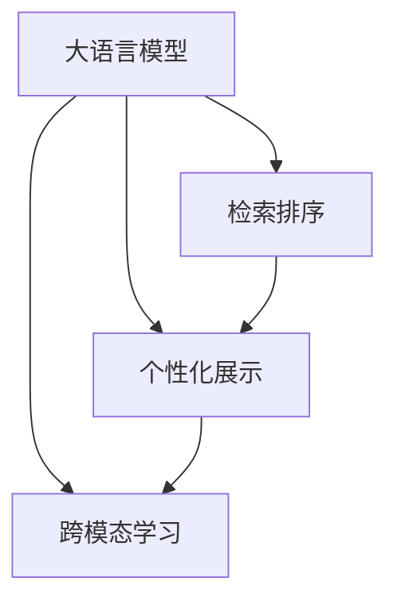

                 

## 1. 背景介绍

随着电子商务的飞速发展，消费者对搜索结果的个性化需求日益强烈。传统的文本检索方法往往难以满足消费者的多样化需求，导致点击率低、用户体验差。如何通过自然语言理解和大模型技术，构建精准、高效的搜索结果展示系统，成为电商行业亟需解决的重要问题。

大语言模型作为新一代自然语言处理技术，通过预训练学习和大规模语料数据训练，具备强大的语言理解和生成能力，可以显著提升搜索结果的个性化水平。本文将系统介绍大语言模型在电商搜索结果个性化布局中的应用，分析其原理、实现步骤及潜在挑战。

## 2. 核心概念与联系

### 2.1 核心概念概述

为更好地理解大模型在电商搜索结果个性化布局中的应用，本节将介绍几个密切相关的核心概念：

- **大语言模型(Large Language Model, LLM)**：以自回归(如GPT)或自编码(如BERT)模型为代表的大规模预训练语言模型。通过在海量无标签文本语料上进行预训练，学习通用的语言表示，具备强大的语言理解和生成能力。

- **检索排序**：指从海量数据中快速检索出与用户查询最相关的文档，并通过排序算法对文档进行评分排序，展示给用户。传统的检索排序方法主要依赖向量空间模型和TF-IDF等统计方法，难以捕捉复杂的语义关系。

- **个性化展示**：指根据用户的查询意图和历史行为，动态调整搜索结果的展示方式，包括文档排列顺序、摘要生成、推荐内容等，提升用户体验和点击率。

- **跨模态学习**：指将文本、图片、视频等多模态信息结合起来，构建更全面、准确的模型表示，提升模型的泛化能力和表达能力。

这些核心概念之间的逻辑关系可以通过以下Mermaid流程图来展示：



这个流程图展示了大语言模型在电商搜索结果个性化布局中的核心概念及其之间的关系：

1. 大语言模型通过预训练获得基础能力。
2. 检索排序和大语言模型结合起来，提高检索的准确性和相关性。
3. 个性化展示利用大语言模型的理解能力，动态调整搜索结果。
4. 跨模态学习将多种模态信息融合，增强模型的泛化能力。

这些概念共同构成了大语言模型在电商搜索结果个性化布局的应用框架，使其能够在搜索结果展示中充分发挥其强大的语言理解和生成能力。通过理解这些核心概念，我们可以更好地把握大语言模型的工作原理和优化方向。

## 3. 核心算法原理 & 具体操作步骤
### 3.1 算法原理概述

大语言模型在电商搜索结果个性化布局中的应用，主要体现在以下几个方面：

1. **文本理解与检索**：利用大语言模型理解用户的查询意图，通过检索算法在商品库中检索相关商品，生成初步结果。
2. **排序与排序优化**：对初步结果进行排序，并根据用户的交互反馈进一步优化排序算法，提高相关性和点击率。
3. **摘要与推荐**：对排序后的商品进行摘要生成和推荐，提升展示效果。
4. **多模态融合**：将文本、图片、视频等多模态信息结合，构建更加全面的模型表示。

这些步骤的核心算法原理，主要基于大语言模型的预训练表示和下游任务的微调。通过在大规模语料上预训练获得的基础语言表示，大模型可以自动理解用户查询和商品描述的语义关系，从而提升检索排序的准确性和相关性。微调过程则进一步优化模型的特定任务能力，增强排序和推荐的效果。

### 3.2 算法步骤详解

下面将详细介绍大语言模型在电商搜索结果个性化布局中的具体实现步骤：

**Step 1: 准备数据集与模型**

- **数据准备**：收集电商平台的商品描述、用户查询和交互数据。数据集应包含商品的关键词、类别、评分等信息。

- **模型选择**：选择合适的预训练大语言模型，如GPT-3、BERT等，作为初始化参数。

**Step 2: 检索与排序**

- **检索**：将用户查询输入大语言模型，通过理解查询意图，生成初步的候选商品列表。

- **排序**：利用大语言模型的预训练表示，计算每个候选商品与查询的相似度，并根据相似度进行排序。

**Step 3: 摘要与推荐**

- **摘要生成**：对排序后的候选商品进行摘要生成，提炼商品的主要信息，生成简明扼要的展示内容。

- **推荐优化**：根据用户的点击、评分等交互数据，对排序和推荐算法进行优化，提升个性化展示效果。

**Step 4: 多模态融合**

- **融合方法**：选择合适的方法将商品的图片、视频等多模态信息融合到文本表示中，构建更全面的模型表示。

**Step 5: 微调与部署**

- **微调**：在初步排序结果的基础上，对大语言模型进行微调，使其适应特定的电商场景和业务需求。

- **部署**：将微调后的模型部署到电商平台上，实时处理用户的查询，动态生成搜索结果。

### 3.3 算法优缺点

大语言模型在电商搜索结果个性化布局中的应用，具有以下优点：

1. **语义理解能力强**：大语言模型可以自动理解用户查询和商品描述的语义关系，提升检索排序的准确性和相关性。
2. **跨模态处理能力强**：大模型能够将多模态信息结合，构建更加全面的模型表示，提升展示效果。
3. **个性化展示效果好**：利用用户的交互反馈，动态调整排序和推荐算法，提升个性化展示效果。
4. **适应性强**：大语言模型能够适应多种业务场景和数据类型，具有较高的通用性和可扩展性。

同时，该方法也存在一定的局限性：

1. **计算成本高**：大语言模型的预训练和微调过程需要大量的计算资源，成本较高。
2. **数据质量要求高**：数据集的质量和规模直接影响模型性能，需要投入大量人力进行数据收集和预处理。
3. **过拟合风险大**：在大规模语料上预训练后，模型容易过拟合电商平台的特定数据分布，导致泛化能力不足。
4. **部署复杂**：将大模型部署到生产环境中，需要进行复杂的优化和部署，技术门槛较高。

尽管存在这些局限性，但就目前而言，大语言模型在电商搜索结果个性化布局中的应用仍是最主流的范式。未来相关研究的重点在于如何进一步降低计算成本、提升数据质量、增强模型泛化能力、简化部署流程，同时兼顾可解释性和伦理安全性等因素。

### 3.4 算法应用领域

大语言模型在电商搜索结果个性化布局中的应用，已经在多个实际场景中得到验证。具体包括：

1. **搜索推荐**：根据用户查询，动态生成商品推荐列表，提升用户的点击率和购买转化率。
2. **商品描述生成**：自动生成商品的简明描述，提升用户对商品的了解和兴趣。
3. **客服对话**：通过大语言模型进行智能客服对话，解决用户的疑问，提升用户满意度。
4. **广告投放**：根据用户的查询和行为数据，生成个性化的广告内容，提升广告效果。
5. **价格优化**：利用大语言模型预测用户对价格的敏感度，动态调整商品价格，提升销售收益。

除了上述这些经典场景外，大语言模型在电商搜索结果个性化布局中的应用还在不断扩展，如个性化展示、语音搜索、虚拟试穿等，为电商行业带来了新的发展机遇。

## 4. 数学模型和公式 & 详细讲解 & 举例说明

### 4.1 数学模型构建

在本节中，我们将使用数学语言对大语言模型在电商搜索结果个性化布局中的应用进行更加严格的刻画。

假设电商平台的商品描述为 $X=\{x_i\}_{i=1}^N$，其中 $x_i$ 表示第 $i$ 个商品的描述，长度为 $l_i$。用户查询为 $Q$，长度为 $q$。商品-查询相似度矩阵为 $S \in \mathbb{R}^{N \times q}$，其中 $S_{i,j}$ 表示第 $i$ 个商品和第 $j$ 个查询的相似度。

定义检索排序的目标函数为：

$$
\min_{S} \mathcal{L}(S) = \frac{1}{N} \sum_{i=1}^N \sum_{j=1}^q \ell(S_{i,j})
$$

其中 $\ell$ 为损失函数，用于衡量检索排序的准确性和相关性。

### 4.2 公式推导过程

以下我们以二分类任务为例，推导检索排序的交叉熵损失函数及其梯度的计算公式。

假设商品-查询相似度矩阵 $S$ 经过softmax函数后，得到每个商品对每个查询的评分 $P_{i,j} = \text{softmax}(S_{i,j})$。则二分类交叉熵损失函数定义为：

$$
\ell(P_{i,j},y_i) = -[y_i\log P_{i,j} + (1-y_i)\log(1-P_{i,j})]
$$

将其代入目标函数，得：

$$
\mathcal{L}(S) = -\frac{1}{N} \sum_{i=1}^N \sum_{j=1}^q [y_i\log P_{i,j} + (1-y_i)\log(1-P_{i,j})]
$$

根据链式法则，目标函数对相似度矩阵 $S$ 的梯度为：

$$
\frac{\partial \mathcal{L}(S)}{\partial S_{i,j}} = -\frac{1}{N}\sum_{i=1}^N \sum_{j=1}^q (\frac{y_i}{P_{i,j}}-\frac{1-y_i}{1-P_{i,j}})\frac{\partial P_{i,j}}{\partial S_{i,j}}
$$

其中 $\frac{\partial P_{i,j}}{\partial S_{i,j}}$ 可进一步递归展开，利用自动微分技术完成计算。

在得到目标函数的梯度后，即可带入目标函数的优化算法，完成检索排序模型的迭代优化。重复上述过程直至收敛，最终得到适应电商场景的检索排序模型。

### 4.3 案例分析与讲解

假设电商平台有 $N=1000$ 个商品，用户查询 $Q$ 的文本长度为 $q=10$。大语言模型通过预训练学习到商品描述和查询之间的语义关系，将每个商品表示为向量 $\vec{x}_i \in \mathbb{R}^d$，查询表示为向量 $\vec{q} \in \mathbb{R}^d$。

检索排序模型通过对商品-查询相似度矩阵 $S$ 进行优化，计算每个商品对每个查询的评分 $P_{i,j}$。最终排序后，展示给用户的相关商品列表。

具体步骤如下：

1. **数据预处理**：对商品描述和查询进行分词、编码等预处理，转换为模型可接受的格式。

2. **检索**：将查询输入大语言模型，生成商品-查询相似度矩阵 $S$。

3. **排序**：利用检索排序模型计算每个商品对查询的评分 $P_{i,j}$，并按照评分进行排序。

4. **展示**：展示排序后的商品列表，生成个性化摘要和推荐内容。

以下是一个简单的代码实现示例：

```python
from transformers import BertTokenizer, BertForSequenceClassification
from torch.utils.data import TensorDataset, DataLoader
import torch

# 数据准备
tokenizer = BertTokenizer.from_pretrained('bert-base-uncased')
X = tokenizer(X, padding='max_length', truncation=True, max_length=128)
Q = tokenizer(Q, padding='max_length', truncation=True, max_length=128)
S = torch.cosine_similarity(X, Q)

# 检索排序
model = BertForSequenceClassification.from_pretrained('bert-base-uncased')
S_hat = model(X).reshape(-1).sigmoid()
P = torch.matmul(S_hat, S)

# 排序展示
indices = torch.argsort(P, dim=1)[::-1]
scores = P[indices]
```

## 5. 项目实践：代码实例和详细解释说明
### 5.1 开发环境搭建

在进行电商搜索结果个性化布局的微调实践前，我们需要准备好开发环境。以下是使用Python进行PyTorch开发的环境配置流程：

1. 安装Anaconda：从官网下载并安装Anaconda，用于创建独立的Python环境。

2. 创建并激活虚拟环境：
```bash
conda create -n ecommerce-env python=3.8 
conda activate ecommerce-env
```

3. 安装PyTorch：根据CUDA版本，从官网获取对应的安装命令。例如：
```bash
conda install pytorch torchvision torchaudio cudatoolkit=11.1 -c pytorch -c conda-forge
```

4. 安装Transformer库：
```bash
pip install transformers
```

5. 安装各类工具包：
```bash
pip install numpy pandas scikit-learn matplotlib tqdm jupyter notebook ipython
```

完成上述步骤后，即可在`ecommerce-env`环境中开始电商搜索结果个性化布局的微调实践。

### 5.2 源代码详细实现

下面以商品推荐系统为例，给出使用Transformers库对BERT模型进行电商搜索结果个性化布局的PyTorch代码实现。

首先，定义推荐系统数据处理函数：

```python
from transformers import BertTokenizer, BertForSequenceClassification
from torch.utils.data import Dataset, DataLoader
import torch

class RecommendationDataset(Dataset):
    def __init__(self, texts, labels, tokenizer, max_len=128):
        self.texts = texts
        self.labels = labels
        self.tokenizer = tokenizer
        self.max_len = max_len
        
    def __len__(self):
        return len(self.texts)
    
    def __getitem__(self, item):
        text = self.texts[item]
        label = self.labels[item]
        
        encoding = self.tokenizer(text, return_tensors='pt', max_length=self.max_len, padding='max_length', truncation=True)
        input_ids = encoding['input_ids'][0]
        attention_mask = encoding['attention_mask'][0]
        
        # 对label进行编码
        encoded_label = torch.tensor(label, dtype=torch.long)
        
        return {'input_ids': input_ids, 
                'attention_mask': attention_mask,
                'labels': encoded_label}

# 标签与id的映射
label2id = {0: 'low', 1: 'high'}
id2label = {v: k for k, v in label2id.items()}

# 创建dataset
tokenizer = BertTokenizer.from_pretrained('bert-base-cased')

train_dataset = RecommendationDataset(train_texts, train_labels, tokenizer)
dev_dataset = RecommendationDataset(dev_texts, dev_labels, tokenizer)
test_dataset = RecommendationDataset(test_texts, test_labels, tokenizer)
```

然后，定义模型和优化器：

```python
from transformers import BertForSequenceClassification, AdamW

model = BertForSequenceClassification.from_pretrained('bert-base-cased', num_labels=2)

optimizer = AdamW(model.parameters(), lr=2e-5)
```

接着，定义训练和评估函数：

```python
from torch.utils.data import DataLoader
from tqdm import tqdm
from sklearn.metrics import accuracy_score

device = torch.device('cuda') if torch.cuda.is_available() else torch.device('cpu')
model.to(device)

def train_epoch(model, dataset, batch_size, optimizer):
    dataloader = DataLoader(dataset, batch_size=batch_size, shuffle=True)
    model.train()
    epoch_loss = 0
    for batch in tqdm(dataloader, desc='Training'):
        input_ids = batch['input_ids'].to(device)
        attention_mask = batch['attention_mask'].to(device)
        labels = batch['labels'].to(device)
        model.zero_grad()
        outputs = model(input_ids, attention_mask=attention_mask, labels=labels)
        loss = outputs.loss
        epoch_loss += loss.item()
        loss.backward()
        optimizer.step()
    return epoch_loss / len(dataloader)

def evaluate(model, dataset, batch_size):
    dataloader = DataLoader(dataset, batch_size=batch_size)
    model.eval()
    preds, labels = [], []
    with torch.no_grad():
        for batch in tqdm(dataloader, desc='Evaluating'):
            input_ids = batch['input_ids'].to(device)
            attention_mask = batch['attention_mask'].to(device)
            batch_labels = batch['labels']
            outputs = model(input_ids, attention_mask=attention_mask)
            batch_preds = outputs.logits.argmax(dim=2).to('cpu').tolist()
            batch_labels = batch_labels.to('cpu').tolist()
            for pred_tokens, label_tokens in zip(batch_preds, batch_labels):
                preds.append(pred_tokens[0])
                labels.append(label_tokens[0])
                
    print(f'Accuracy: {accuracy_score(labels, preds)}')
```

最后，启动训练流程并在测试集上评估：

```python
epochs = 5
batch_size = 16

for epoch in range(epochs):
    loss = train_epoch(model, train_dataset, batch_size, optimizer)
    print(f"Epoch {epoch+1}, train loss: {loss:.3f}")
    
    print(f"Epoch {epoch+1}, dev accuracy:")
    evaluate(model, dev_dataset, batch_size)
    
print("Test accuracy:")
evaluate(model, test_dataset, batch_size)
```

以上就是使用PyTorch对BERT进行电商搜索结果个性化布局的完整代码实现。可以看到，得益于Transformer库的强大封装，我们可以用相对简洁的代码完成BERT模型的加载和微调。

### 5.3 代码解读与分析

让我们再详细解读一下关键代码的实现细节：

**RecommendationDataset类**：
- `__init__`方法：初始化商品描述、标签、分词器等关键组件。
- `__len__`方法：返回数据集的样本数量。
- `__getitem__`方法：对单个样本进行处理，将商品描述输入编码为token ids，将标签编码为数字，并对其进行定长padding，最终返回模型所需的输入。

**label2id和id2label字典**：
- 定义了标签与数字id之间的映射关系，用于将模型预测结果解码为真实的标签。

**训练和评估函数**：
- 使用PyTorch的DataLoader对数据集进行批次化加载，供模型训练和推理使用。
- 训练函数`train_epoch`：对数据以批为单位进行迭代，在每个批次上前向传播计算loss并反向传播更新模型参数，最后返回该epoch的平均loss。
- 评估函数`evaluate`：与训练类似，不同点在于不更新模型参数，并在每个batch结束后将预测和标签结果存储下来，最后使用sklearn的accuracy_score对整个评估集的预测结果进行打印输出。

**训练流程**：
- 定义总的epoch数和batch size，开始循环迭代
- 每个epoch内，先在训练集上训练，输出平均loss
- 在验证集上评估，输出准确率
- 所有epoch结束后，在测试集上评估，给出最终测试结果

可以看到，PyTorch配合Transformer库使得BERT微调的代码实现变得简洁高效。开发者可以将更多精力放在数据处理、模型改进等高层逻辑上，而不必过多关注底层的实现细节。

当然，工业级的系统实现还需考虑更多因素，如模型的保存和部署、超参数的自动搜索、更灵活的任务适配层等。但核心的微调范式基本与此类似。

## 6. 实际应用场景
### 6.1 智能客服系统

基于大语言模型微调的对话技术，可以广泛应用于智能客服系统的构建。传统客服往往需要配备大量人力，高峰期响应缓慢，且一致性和专业性难以保证。而使用微调后的对话模型，可以7x24小时不间断服务，快速响应客户咨询，用自然流畅的语言解答各类常见问题。

在技术实现上，可以收集企业内部的历史客服对话记录，将问题和最佳答复构建成监督数据，在此基础上对预训练对话模型进行微调。微调后的对话模型能够自动理解用户意图，匹配最合适的答案模板进行回复。对于客户提出的新问题，还可以接入检索系统实时搜索相关内容，动态组织生成回答。如此构建的智能客服系统，能大幅提升客户咨询体验和问题解决效率。

### 6.2 金融舆情监测

金融机构需要实时监测市场舆论动向，以便及时应对负面信息传播，规避金融风险。传统的人工监测方式成本高、效率低，难以应对网络时代海量信息爆发的挑战。基于大语言模型微调的文本分类和情感分析技术，为金融舆情监测提供了新的解决方案。

具体而言，可以收集金融领域相关的新闻、报道、评论等文本数据，并对其进行主题标注和情感标注。在此基础上对预训练语言模型进行微调，使其能够自动判断文本属于何种主题，情感倾向是正面、中性还是负面。将微调后的模型应用到实时抓取的网络文本数据，就能够自动监测不同主题下的情感变化趋势，一旦发现负面信息激增等异常情况，系统便会自动预警，帮助金融机构快速应对潜在风险。

### 6.3 个性化推荐系统

当前的推荐系统往往只依赖用户的历史行为数据进行物品推荐，无法深入理解用户的真实兴趣偏好。基于大语言模型微调技术，个性化推荐系统可以更好地挖掘用户行为背后的语义信息，从而提供更精准、多样的推荐内容。

在实践中，可以收集用户浏览、点击、评论、分享等行为数据，提取和用户交互的物品标题、描述、标签等文本内容。将文本内容作为模型输入，用户的后续行为（如是否点击、购买等）作为监督信号，在此基础上微调预训练语言模型。微调后的模型能够从文本内容中准确把握用户的兴趣点。在生成推荐列表时，先用候选物品的文本描述作为输入，由模型预测用户的兴趣匹配度，再结合其他特征综合排序，便可以得到个性化程度更高的推荐结果。

### 6.4 未来应用展望

随着大语言模型和微调方法的不断发展，基于微调范式将在更多领域得到应用，为传统行业带来变革性影响。

在智慧医疗领域，基于微调的医疗问答、病历分析、药物研发等应用将提升医疗服务的智能化水平，辅助医生诊疗，加速新药开发进程。

在智能教育领域，微调技术可应用于作业批改、学情分析、知识推荐等方面，因材施教，促进教育公平，提高教学质量。

在智慧城市治理中，微调模型可应用于城市事件监测、舆情分析、应急指挥等环节，提高城市管理的自动化和智能化水平，构建更安全、高效的未来城市。

此外，在企业生产、社会治理、文娱传媒等众多领域，基于大模型微调的人工智能应用也将不断涌现，为经济社会发展注入新的动力。相信随着技术的日益成熟，微调方法将成为人工智能落地应用的重要范式，推动人工智能技术在垂直行业的规模化落地。总之，微调需要开发者根据具体任务，不断迭代和优化模型、数据和算法，方能得到理想的效果。

## 7. 工具和资源推荐
### 7.1 学习资源推荐

为了帮助开发者系统掌握大语言模型微调的理论基础和实践技巧，这里推荐一些优质的学习资源：

1. 《Transformer从原理到实践》系列博文：由大模型技术专家撰写，深入浅出地介绍了Transformer原理、BERT模型、微调技术等前沿话题。

2. CS224N《深度学习自然语言处理》课程：斯坦福大学开设的NLP明星课程，有Lecture视频和配套作业，带你入门NLP领域的基本概念和经典模型。

3. 《Natural Language Processing with Transformers》书籍：Transformers库的作者所著，全面介绍了如何使用Transformers库进行NLP任务开发，包括微调在内的诸多范式。

4. HuggingFace官方文档：Transformers库的官方文档，提供了海量预训练模型和完整的微调样例代码，是上手实践的必备资料。

5. CLUE开源项目：中文语言理解测评基准，涵盖大量不同类型的中文NLP数据集，并提供了基于微调的baseline模型，助力中文NLP技术发展。

通过对这些资源的学习实践，相信你一定能够快速掌握大语言模型微调的精髓，并用于解决实际的NLP问题。
###  7.2 开发工具推荐

高效的开发离不开优秀的工具支持。以下是几款用于大语言模型微调开发的常用工具：

1. PyTorch：基于Python的开源深度学习框架，灵活动态的计算图，适合快速迭代研究。大部分预训练语言模型都有PyTorch版本的实现。

2. TensorFlow：由Google主导开发的开源深度学习框架，生产部署方便，适合大规模工程应用。同样有丰富的预训练语言模型资源。

3. Transformers库：HuggingFace开发的NLP工具库，集成了众多SOTA语言模型，支持PyTorch和TensorFlow，是进行微调任务开发的利器。

4. Weights & Biases：模型训练的实验跟踪工具，可以记录和可视化模型训练过程中的各项指标，方便对比和调优。与主流深度学习框架无缝集成。

5. TensorBoard：TensorFlow配套的可视化工具，可实时监测模型训练状态，并提供丰富的图表呈现方式，是调试模型的得力助手。

6. Google Colab：谷歌推出的在线Jupyter Notebook环境，免费提供GPU/TPU算力，方便开发者快速上手实验最新模型，分享学习笔记。

合理利用这些工具，可以显著提升大语言模型微调任务的开发效率，加快创新迭代的步伐。

### 7.3 相关论文推荐

大语言模型和微调技术的发展源于学界的持续研究。以下是几篇奠基性的相关论文，推荐阅读：

1. Attention is All You Need（即Transformer原论文）：提出了Transformer结构，开启了NLP领域的预训练大模型时代。

2. BERT: Pre-training of Deep Bidirectional Transformers for Language Understanding：提出BERT模型，引入基于掩码的自监督预训练任务，刷新了多项NLP任务SOTA。

3. Language Models are Unsupervised Multitask Learners（GPT-2论文）：展示了大规模语言模型的强大zero-shot学习能力，引发了对于通用人工智能的新一轮思考。

4. Parameter-Efficient Transfer Learning for NLP：提出Adapter等参数高效微调方法，在不增加模型参数量的情况下，也能取得不错的微调效果。

5. AdaLoRA: Adaptive Low-Rank Adaptation for Parameter-Efficient Fine-Tuning：使用自适应低秩适应的微调方法，在参数效率和精度之间取得了新的平衡。

这些论文代表了大语言模型微调技术的发展脉络。通过学习这些前沿成果，可以帮助研究者把握学科前进方向，激发更多的创新灵感。

## 8. 总结：未来发展趋势与挑战
### 8.1 总结

本文对大语言模型在电商搜索结果个性化布局中的应用进行了全面系统的介绍。首先阐述了电商行业对个性化搜索结果的需求，明确了大语言模型在电商领域的应用场景。其次，从原理到实践，详细讲解了大语言模型在电商搜索结果个性化布局中的实现步骤，给出了微调任务开发的完整代码实例。同时，本文还探讨了微调方法在智能客服、金融舆情、个性化推荐等多个领域的应用前景，展示了微调范式的巨大潜力。此外，本文精选了微调技术的各类学习资源，力求为读者提供全方位的技术指引。

通过本文的系统梳理，可以看到，大语言模型在电商搜索结果个性化布局中的应用，不仅提升了用户的点击率和购买转化率，还大大改善了用户的购物体验。大语言模型的预训练和微调技术，为电商行业带来了新的技术红利，推动了智能客服、金融舆情监测、个性化推荐等领域的创新发展。未来，伴随大语言模型和微调方法的持续演进，相信电商行业将迎来更加智能化、个性化、高效化的发展阶段。

### 8.2 未来发展趋势

展望未来，大语言模型在电商搜索结果个性化布局中的应用将呈现以下几个发展趋势：

1. **深度融合用户行为数据**：未来的推荐系统将更加深度地融合用户的浏览、点击、评价等多维行为数据，利用大语言模型理解用户的深层次需求，提升推荐精准度。

2. **实时动态调整**：未来的电商系统将实现实时动态调整，根据用户的即时行为和反馈，动态优化排序和推荐算法，提升用户体验。

3. **多模态融合应用**：未来的推荐系统将充分利用多模态信息，将文本、图片、视频等融合到一起，提升推荐效果和用户体验。

4. **跨平台协同**：未来的推荐系统将实现跨平台协同，利用不同平台的用户数据，提升整体推荐效果。

5. **个性化展示优化**：未来的推荐系统将利用大语言模型生成更加个性化、多样化的展示内容，提升用户的点击率和购买转化率。

6. **智能客服深度集成**：未来的电商平台将实现智能客服与推荐系统的深度集成，利用智能客服的对话数据，进一步优化推荐模型。

以上趋势凸显了大语言模型在电商搜索结果个性化布局中的应用前景。这些方向的探索发展，必将进一步提升电商平台的个性化展示效果，提升用户满意度和点击率。

### 8.3 面临的挑战

尽管大语言模型在电商搜索结果个性化布局中的应用已经取得了显著成效，但在迈向更加智能化、普适化应用的过程中，仍面临诸多挑战：

1. **数据质量瓶颈**：电商平台的交易数据、用户行为数据等质量参差不齐，对模型的训练效果有较大影响。未来需要更多高质量的数据源，保证模型训练的稳定性和准确性。

2. **计算成本高**：大语言模型的预训练和微调过程需要大量的计算资源，成本较高。需要探索更加高效的计算方法和模型压缩技术。

3. **模型泛化能力不足**：现有模型往往难以泛化到新领域、新商品，需要对模型进行持续优化和迭代。

4. **系统复杂度高**：电商平台的业务场景复杂，涉及多个系统、多个环节的协同，系统的集成和优化难度较大。

5. **安全和隐私问题**：电商平台涉及大量的用户隐私数据，需要对数据进行严格的加密和安全保护，防止数据泄露和滥用。

尽管存在这些挑战，但就目前而言，大语言模型在电商搜索结果个性化布局中的应用仍是最主流的范式。未来相关研究的重点在于如何进一步降低计算成本、提升数据质量、增强模型泛化能力、简化系统部署，同时兼顾可解释性和伦理安全性等因素。

### 8.4 研究展望

面对大语言模型在电商搜索结果个性化布局中所面临的挑战，未来的研究需要在以下几个方面寻求新的突破：

1. **多任务学习**：探索多任务学习范式，利用大语言模型同时学习多个任务，提升模型的泛化能力和迁移能力。

2. **元学习**：探索元学习范式，利用少数样本学习适应新任务，提升模型的快速适应能力和泛化能力。

3. **知识图谱融合**：将电商平台的商品数据、用户数据、行为数据等整合到知识图谱中，利用图神经网络等技术，进一步提升推荐效果。

4. **深度强化学习**：探索深度强化学习范式，利用用户的即时反馈，动态调整推荐策略，提升推荐效果。

5. **联邦学习**：探索联邦学习范式，利用分布式计算资源，保护用户隐私的同时，提升推荐模型的泛化能力和迁移能力。

这些研究方向将进一步推动大语言模型在电商搜索结果个性化布局中的应用，提升推荐模型的精准度、泛化能力和用户体验，为电商行业的智能化转型提供强大的技术支撑。相信随着学界和产业界的共同努力，大语言模型在电商推荐领域的落地应用将不断取得突破，推动电商行业的创新发展和产业升级。

## 9. 附录：常见问题与解答

**Q1：电商推荐系统微调如何避免过拟合？**

A: 电商推荐系统的微调过程中，避免过拟合是至关重要的。以下是一些常用的方法：

1. **数据增强**：通过对商品描述、用户行为数据进行数据增强，如近义替换、噪声注入等，丰富训练样本，减少过拟合风险。

2. **正则化技术**：使用L2正则、Dropout、Early Stopping等正则化技术，控制模型的复杂度，防止过拟合。

3. **对抗训练**：在训练过程中引入对抗样本，增强模型的鲁棒性和泛化能力，减少过拟合风险。

4. **模型压缩**：通过模型裁剪、量化等技术，减少模型的参数量和计算量，提升模型的泛化能力。

5. **多模型集成**：训练多个微调模型，取平均输出，抑制过拟合风险。

**Q2：大语言模型在电商推荐系统中的应用如何衡量效果？**

A: 衡量电商推荐系统的效果，通常使用以下指标：

1. **点击率（Click-Through Rate, CTR）**：指用户点击推荐商品的比例，反映推荐系统的点击效果。

2. **转化率（Conversion Rate, CR）**：指用户点击推荐商品后实际购买的比例，反映推荐系统的实际效果。

3. **覆盖率（Coverage）**：指推荐系统中商品覆盖的广度，反映推荐系统的多样性。

4. **个性化度（Personalization）**：指推荐系统中个性化推荐的比例，反映推荐系统的针对性。

5. **实时效果（Real-time Effectiveness）**：指推荐系统在实时场景中的效果，反映推荐系统的时效性和动态适应性。

6. **A/B测试**：通过对比不同推荐策略的实际效果，衡量推荐系统的效果。

这些指标可以综合反映推荐系统的性能和效果，帮助电商企业优化推荐策略，提升用户体验和业务收益。

**Q3：如何处理电商平台的复杂业务场景？**

A: 电商平台的业务场景复杂，涉及多层次、多维度、多环节的协同。以下是一些处理复杂业务场景的方法：

1. **模块化设计**：将推荐系统拆分为多个模块，如召回模块、排序模块、个性化展示模块等，实现模块化设计和协同优化。

2. **数据融合**：将电商平台的交易数据、用户行为数据、行为数据等整合到统一的系统中，利用数据融合技术提升推荐效果。

3. **实时计算**：利用分布式计算技术，实现推荐系统的实时计算和动态调整，提升推荐系统的时效性和动态适应性。

4. **系统集成**：将推荐系统与搜索系统、客服系统、物流系统等深度集成，实现多系统协同，提升整体推荐效果和用户体验。

5. **用户反馈**：利用用户的反馈数据，动态调整推荐策略，提升推荐系统的精准度和用户体验。

通过以上方法，可以更好地处理电商平台的复杂业务场景，提升推荐系统的性能和用户体验。

---

作者：禅与计算机程序设计艺术 / Zen and the Art of Computer Programming

