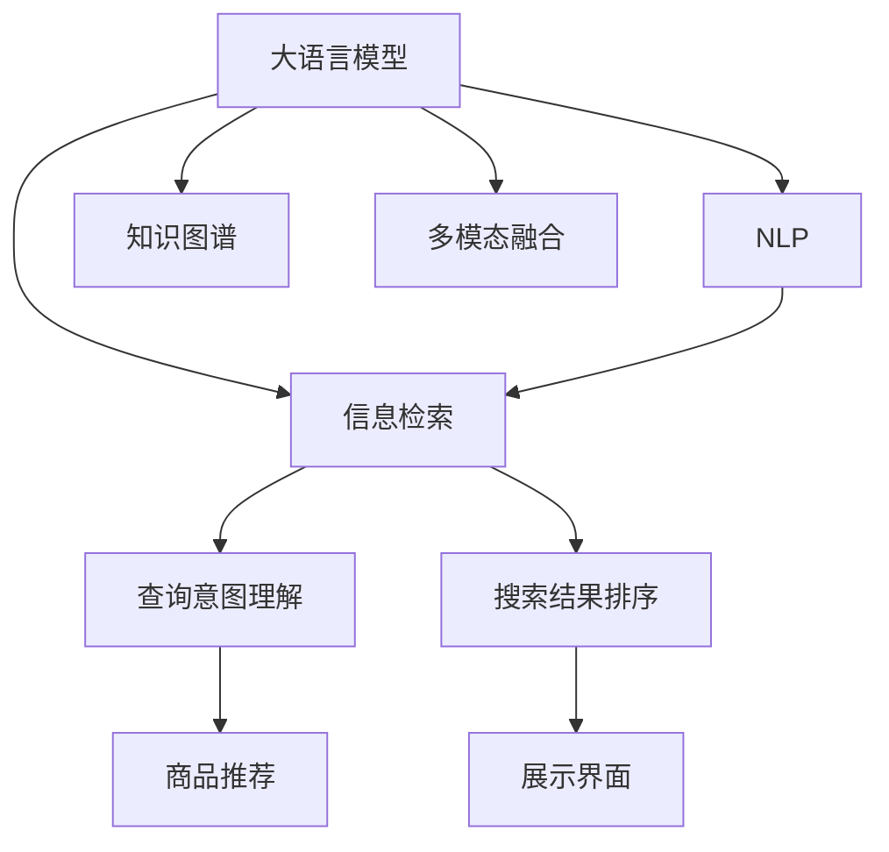

                 

# AI大模型如何提升电商搜索的效率

> 关键词：大语言模型,电商搜索,用户意图理解,自然语言处理,NLP,信息检索,知识图谱,多模态融合,深度学习

## 1. 背景介绍

### 1.1 问题由来
随着电商市场的快速发展和消费者需求的日益多样化，传统的电商搜索系统面临着越来越大的挑战。传统的基于关键词匹配的搜索方式，难以理解用户的查询意图，返回的结果往往与用户预期不符，导致用户体验下降，流失率上升。如何提升电商搜索的效率和精准度，满足用户个性化需求，成为电商行业亟需解决的重要问题。

近年来，人工智能技术在电商搜索中的应用日益普及。大语言模型作为人工智能技术的最新进展，凭借其强大的自然语言处理(NLP)能力，为电商搜索系统带来了新的突破。通过大语言模型，电商搜索系统可以更好地理解用户的查询意图，从海量商品数据中快速准确地检索出符合用户需求的商品，显著提升用户满意度，并提高平台的转化率和销售额。

### 1.2 问题核心关键点
大语言模型在电商搜索中的应用主要体现在以下几个方面：

- **用户意图理解**：通过自然语言处理技术，理解用户的查询意图，识别出用户需要的商品类型、属性、品牌等信息。
- **商品推荐**：根据用户查询意图和商品描述，生成推荐列表，并提供更加个性化的购物建议。
- **搜索效率提升**：利用深度学习和大规模预训练模型，提升信息检索的效率和精度，减少用户搜索时间。
- **多模态融合**：结合图像、语音、视频等多模态信息，提供更加丰富的搜索结果和交互方式。

## 2. 核心概念与联系

### 2.1 核心概念概述

为更好地理解大语言模型在电商搜索中的应用，本节将介绍几个密切相关的核心概念：

- **大语言模型(Large Language Model, LLM)**：以Transformer为基础的预训练语言模型，通过在大规模无标签文本语料上进行预训练，学习到丰富的语言知识，具备强大的自然语言理解和生成能力。

- **自然语言处理(NLP)**：研究如何使计算机理解和处理自然语言的技术，包括文本分类、信息抽取、机器翻译、问答系统等。

- **信息检索(Information Retrieval, IR)**：从大量数据中检索出符合用户查询需求的文档或商品的过程，是搜索引擎的核心技术之一。

- **知识图谱(Knowledge Graph)**：利用图结构组织和存储知识，便于计算机进行推理和查询，是提升搜索质量的关键技术之一。

- **多模态融合(Multi-modal Fusion)**：结合图像、视频、语音等多模态信息，提升搜索系统的准确性和用户体验。

这些核心概念之间的逻辑关系可以通过以下Mermaid流程图来展示：



这个流程图展示了大语言模型与NLP、IR、知识图谱、多模态融合等技术之间的联系：

1. 大语言模型通过预训练学习到丰富的语言知识，为NLP、IR、知识图谱、多模态融合等技术提供基础。
2. NLP技术利用大语言模型对用户查询意图进行理解，识别出用户需要的商品信息。
3. 信息检索技术结合知识图谱和用户意图，从商品数据库中检索出符合用户需求的结果。
4. 多模态融合技术结合图像、语音、视频等信息，提升搜索结果的多样性和丰富性。
5. 搜索结果通过展示界面呈现给用户，并提供个性化推荐。

这些核心技术共同构成了电商搜索系统的工作流程，使其能够高效、精准地为用户提供服务。

## 3. 核心算法原理 & 具体操作步骤
### 3.1 算法原理概述

大语言模型在电商搜索中的应用，主要基于其强大的自然语言处理能力，通过理解用户查询意图，从商品数据库中检索出符合用户需求的结果。其核心算法原理包括以下几个方面：

1. **用户意图理解**：使用大语言模型对用户查询进行解析，提取关键词、意图类型、实体关系等信息，生成用户意图向量。
2. **商品推荐**：根据用户意图向量和商品描述，利用深度学习模型进行向量匹配和相似度计算，生成推荐列表。
3. **信息检索**：将用户查询与商品数据库中的商品向量进行匹配，利用索引技术快速检索出相关商品。
4. **知识图谱融合**：利用知识图谱中的商品关系信息，提升检索结果的相关性和准确性。
5. **多模态融合**：结合图像、视频、语音等多模态信息，提升搜索结果的多样性和丰富性。

### 3.2 算法步骤详解

基于大语言模型在电商搜索中的应用，其具体操作步骤如下：

**Step 1: 准备数据集**
- 收集电商平台的商品描述、用户查询、用户行为数据等，构建商品-商品关系知识图谱。
- 对用户查询进行文本预处理，去除停用词、标点符号等噪音。
- 将商品描述和用户查询转化为向量形式，方便后续计算。

**Step 2: 预训练模型选择与微调**
- 选择合适的预训练语言模型，如BERT、GPT等，作为初始化参数。
- 在电商领域相关的标注数据上对模型进行微调，以提高其对电商领域语境的适应性。
- 在微调过程中，使用正则化技术、学习率衰减等方法，避免过拟合。

**Step 3: 用户意图理解**
- 使用微调后的语言模型对用户查询进行解析，提取关键词、意图类型、实体关系等信息。
- 利用向量表示技术，将用户查询转化为向量形式。
- 通过向量化商品描述，计算用户查询向量与商品描述向量的相似度。

**Step 4: 商品推荐**
- 根据用户查询向量和商品描述向量，利用深度学习模型（如Transformer、KNN等）计算向量之间的相似度。
- 基于相似度计算结果，生成推荐列表。
- 结合用户历史行为数据，进一步优化推荐策略。

**Step 5: 信息检索**
- 利用知识图谱中的商品关系信息，提升检索结果的相关性。
- 结合多模态信息，丰富搜索结果展示形式，如商品图片、视频等。
- 利用索引技术，快速检索出符合用户查询的商品。

**Step 6: 展示与交互**
- 将推荐结果和检索结果展示给用户。
- 利用用户反馈数据，持续优化模型和算法，提升用户体验。

### 3.3 算法优缺点

基于大语言模型在电商搜索中的应用，其优点和缺点如下：

**优点：**
- 强大的自然语言处理能力，能够准确理解用户查询意图。
- 能够快速从海量商品数据中检索出符合用户需求的结果，提升搜索效率。
- 结合知识图谱和多种模态信息，提升搜索结果的多样性和丰富性。

**缺点：**
- 需要大量标注数据进行微调，标注成本较高。
- 模型规模大，对计算资源要求高。
- 查询结果可能受到语言和语境的影响，需要持续优化。

### 3.4 算法应用领域

大语言模型在电商搜索中的应用领域广泛，主要包括以下几个方面：

- **用户意图理解**：提升搜索引擎的智能性，准确理解用户查询意图，减少误导性搜索结果。
- **商品推荐**：根据用户查询意图和历史行为数据，提供个性化推荐，提升用户购买转化率。
- **信息检索**：利用知识图谱和多种模态信息，提升检索结果的相关性和准确性，减少用户搜索时间。
- **交互优化**：结合多模态信息，提升用户与电商平台的交互体验，如语音搜索、图像识别等。

除了上述这些经典应用外，大语言模型还可在内容推荐、用户行为分析、广告投放等多个电商领域中发挥重要作用。随着大语言模型技术的不断进步，其在电商搜索中的应用场景将不断扩展，为电商行业带来更多创新和价值。

## 4. 数学模型和公式 & 详细讲解 & 举例说明

### 4.1 数学模型构建

在大语言模型在电商搜索中的应用中，数学模型主要包括以下几个方面：

- **用户查询向量化**：将用户查询转化为向量形式，方便后续计算。
- **商品描述向量化**：将商品描述转化为向量形式，便于匹配和相似度计算。
- **向量相似度计算**：计算用户查询向量与商品描述向量之间的相似度，用于推荐和检索。
- **知识图谱嵌入**：将知识图谱中的商品关系信息嵌入向量中，提升检索结果的相关性。
- **多模态融合**：结合图像、视频、语音等多种模态信息，丰富搜索结果展示形式。

### 4.2 公式推导过程

以下是具体的公式推导过程：

1. **用户查询向量化**：
   $$
   \text{query\_vector} = \text{Embedding}(\text{query\_text})
   $$

2. **商品描述向量化**：
   $$
   \text{item\_vector} = \text{Embedding}(\text{item\_text})
   $$

3. **向量相似度计算**：
   $$
   \text{similarity} = \text{CosineSimilarity}(\text{query\_vector}, \text{item\_vector})
   $$

4. **知识图谱嵌入**：
   $$
   \text{item\_vector}_{KG} = \text{KGEmbedding}(\text{item\_id})
   $$

5. **多模态融合**：
   $$
   \text{item\_vector}_{multi\-modal} = (\text{item\_vector}, \text{item\_image\_vector}, \text{item\_video\_vector}, \text{item\_audio\_vector})
   $$

### 4.3 案例分析与讲解

以电商平台推荐系统为例，分析大语言模型在推荐中的应用：

假设用户输入查询“iPhone 12 价格”，电商平台的推荐系统将执行以下步骤：

1. **用户意图理解**：
   - 使用大语言模型对查询进行解析，提取关键词“iPhone 12”，意图类型为“查询价格”。
   - 将用户查询转化为向量形式，生成用户查询向量 $\text{query\_vector}$。

2. **商品推荐**：
   - 从商品数据库中检索出所有包含“iPhone 12”的商品描述。
   - 利用向量相似度计算，生成与用户查询向量相似的推荐商品向量 $\text{item\_vector}$。
   - 根据相似度计算结果，生成推荐列表，如“iPhone 12 64GB 8GB”。

3. **信息检索**：
   - 利用知识图谱中的商品关系信息，生成商品向量 $\text{item\_vector}_{KG}$。
   - 结合多模态信息，丰富推荐结果展示，如商品图片、视频等。
   - 利用索引技术，快速检索出符合用户查询的商品，返回推荐结果。

通过上述步骤，电商平台可以准确理解用户查询意图，快速检索出符合用户需求的商品，并提供个性化推荐，提升用户购物体验和转化率。

## 5. 项目实践：代码实例和详细解释说明

### 5.1 开发环境搭建

在进行大语言模型在电商搜索中的应用实践前，我们需要准备好开发环境。以下是使用Python进行PyTorch开发的环境配置流程：

1. 安装Anaconda：从官网下载并安装Anaconda，用于创建独立的Python环境。

2. 创建并激活虚拟环境：
```bash
conda create -n pytorch-env python=3.8 
conda activate pytorch-env
```

3. 安装PyTorch：根据CUDA版本，从官网获取对应的安装命令。例如：
```bash
conda install pytorch torchvision torchaudio cudatoolkit=11.1 -c pytorch -c conda-forge
```

4. 安装各类工具包：
```bash
pip install numpy pandas scikit-learn matplotlib tqdm jupyter notebook ipython
```

完成上述步骤后，即可在`pytorch-env`环境中开始大语言模型在电商搜索中的项目实践。

### 5.2 源代码详细实现

下面以电商平台推荐系统为例，给出使用Transformers库对BERT模型进行微调的PyTorch代码实现。

首先，定义推荐系统的数据处理函数：

```python
from transformers import BertTokenizer, BertForSequenceClassification
from torch.utils.data import Dataset
import torch

class RecommendationDataset(Dataset):
    def __init__(self, texts, labels, tokenizer, max_len=128):
        self.texts = texts
        self.labels = labels
        self.tokenizer = tokenizer
        self.max_len = max_len
        
    def __len__(self):
        return len(self.texts)
    
    def __getitem__(self, item):
        text = self.texts[item]
        label = self.labels[item]
        
        encoding = self.tokenizer(text, return_tensors='pt', max_length=self.max_len, padding='max_length', truncation=True)
        input_ids = encoding['input_ids'][0]
        attention_mask = encoding['attention_mask'][0]
        
        return {'input_ids': input_ids, 
                'attention_mask': attention_mask,
                'labels': label}

# 标签与id的映射
label2id = {'推荐': 1, '不推荐': 0}
id2label = {v: k for k, v in label2id.items()}

# 创建dataset
tokenizer = BertTokenizer.from_pretrained('bert-base-cased')

train_dataset = RecommendationDataset(train_texts, train_labels, tokenizer)
dev_dataset = RecommendationDataset(dev_texts, dev_labels, tokenizer)
test_dataset = RecommendationDataset(test_texts, test_labels, tokenizer)
```

然后，定义模型和优化器：

```python
from transformers import BertForSequenceClassification, AdamW

model = BertForSequenceClassification.from_pretrained('bert-base-cased', num_labels=len(label2id))

optimizer = AdamW(model.parameters(), lr=2e-5)
```

接着，定义训练和评估函数：

```python
from torch.utils.data import DataLoader
from tqdm import tqdm
from sklearn.metrics import accuracy_score

device = torch.device('cuda') if torch.cuda.is_available() else torch.device('cpu')
model.to(device)

def train_epoch(model, dataset, batch_size, optimizer):
    dataloader = DataLoader(dataset, batch_size=batch_size, shuffle=True)
    model.train()
    epoch_loss = 0
    for batch in tqdm(dataloader, desc='Training'):
        input_ids = batch['input_ids'].to(device)
        attention_mask = batch['attention_mask'].to(device)
        labels = batch['labels'].to(device)
        model.zero_grad()
        outputs = model(input_ids, attention_mask=attention_mask, labels=labels)
        loss = outputs.loss
        epoch_loss += loss.item()
        loss.backward()
        optimizer.step()
    return epoch_loss / len(dataloader)

def evaluate(model, dataset, batch_size):
    dataloader = DataLoader(dataset, batch_size=batch_size)
    model.eval()
    preds, labels = [], []
    with torch.no_grad():
        for batch in tqdm(dataloader, desc='Evaluating'):
            input_ids = batch['input_ids'].to(device)
            attention_mask = batch['attention_mask'].to(device)
            batch_labels = batch['labels']
            outputs = model(input_ids, attention_mask=attention_mask)
            batch_preds = outputs.logits.argmax(dim=2).to('cpu').tolist()
            batch_labels = batch_labels.to('cpu').tolist()
            for pred, label in zip(batch_preds, batch_labels):
                preds.append(pred[0])
                labels.append(label)
                
    return accuracy_score(labels, preds)

# 启动训练流程并在测试集上评估
epochs = 5
batch_size = 16

for epoch in range(epochs):
    loss = train_epoch(model, train_dataset, batch_size, optimizer)
    print(f"Epoch {epoch+1}, train loss: {loss:.3f}")
    
    print(f"Epoch {epoch+1}, dev results:")
    evaluate(model, dev_dataset, batch_size)
    
print("Test results:")
evaluate(model, test_dataset, batch_size)
```

以上就是使用PyTorch对BERT进行电商平台推荐系统微调的完整代码实现。可以看到，得益于Transformers库的强大封装，我们可以用相对简洁的代码完成BERT模型的加载和微调。

### 5.3 代码解读与分析

让我们再详细解读一下关键代码的实现细节：

**RecommendationDataset类**：
- `__init__`方法：初始化文本、标签、分词器等关键组件。
- `__len__`方法：返回数据集的样本数量。
- `__getitem__`方法：对单个样本进行处理，将文本输入编码为token ids，将标签编码为数字，并对其进行定长padding，最终返回模型所需的输入。

**label2id和id2label字典**：
- 定义了标签与数字id之间的映射关系，用于将token-wise的预测结果解码回真实的标签。

**训练和评估函数**：
- 使用PyTorch的DataLoader对数据集进行批次化加载，供模型训练和推理使用。
- 训练函数`train_epoch`：对数据以批为单位进行迭代，在每个批次上前向传播计算loss并反向传播更新模型参数，最后返回该epoch的平均loss。
- 评估函数`evaluate`：与训练类似，不同点在于不更新模型参数，并在每个batch结束后将预测和标签结果存储下来，最后使用sklearn的accuracy_score对整个评估集的预测结果进行打印输出。

**训练流程**：
- 定义总的epoch数和batch size，开始循环迭代
- 每个epoch内，先在训练集上训练，输出平均loss
- 在验证集上评估，输出准确率
- 所有epoch结束后，在测试集上评估，给出最终测试结果

可以看到，PyTorch配合Transformers库使得BERT微调的代码实现变得简洁高效。开发者可以将更多精力放在数据处理、模型改进等高层逻辑上，而不必过多关注底层的实现细节。

当然，工业级的系统实现还需考虑更多因素，如模型的保存和部署、超参数的自动搜索、更灵活的任务适配层等。但核心的微调范式基本与此类似。

## 6. 实际应用场景
### 6.1 智能客服系统

基于大语言模型在电商搜索中的应用，智能客服系统可以进一步提升用户服务体验。通过自然语言处理技术，智能客服可以理解用户的问题意图，快速响应并解决用户疑问，提供定制化服务。

在技术实现上，可以收集客服历史对话记录，将问题和最佳答复构建成监督数据，在此基础上对预训练语言模型进行微调。微调后的模型能够自动理解用户问题，匹配最合适的答案模板进行回复。对于用户提出的新问题，还可以接入检索系统实时搜索相关内容，动态组织生成回答。如此构建的智能客服系统，能大幅提升客服响应速度和准确性，降低人力成本，提升用户满意度。

### 6.2 金融舆情监测

大语言模型在金融领域也有广泛应用。通过自然语言处理技术，金融舆情监测系统可以实时监测市场舆论动向，以便及时应对负面信息传播，规避金融风险。

具体而言，可以收集金融领域相关的新闻、报道、评论等文本数据，并对其进行主题标注和情感标注。在此基础上对预训练语言模型进行微调，使其能够自动判断文本属于何种主题，情感倾向是正面、中性还是负面。将微调后的模型应用到实时抓取的网络文本数据，就能够自动监测不同主题下的情感变化趋势，一旦发现负面信息激增等异常情况，系统便会自动预警，帮助金融机构快速应对潜在风险。

### 6.3 个性化推荐系统

电商平台的个性化推荐系统，通过大语言模型能够更好地理解用户的购物需求，提供个性化的商品推荐。

在实践中，可以收集用户浏览、点击、评论、分享等行为数据，提取和商品交互的文本内容。将文本内容作为模型输入，用户的后续行为（如是否点击、购买等）作为监督信号，在此基础上微调预训练语言模型。微调后的模型能够从文本内容中准确把握用户的兴趣点。在生成推荐列表时，先用候选商品描述作为输入，由模型预测用户的兴趣匹配度，再结合其他特征综合排序，便可以得到个性化程度更高的推荐结果。

### 6.4 未来应用展望

随着大语言模型和自然语言处理技术的不断进步，其在电商搜索中的应用前景将更加广阔。未来，我们可以期待以下发展趋势：

1. **用户意图理解**：利用多模态信息，提升用户查询意图理解的准确性，减少误导性搜索结果。
2. **商品推荐**：结合知识图谱和实体关系，生成更加个性化的推荐结果。
3. **信息检索**：利用索引技术和分布式计算，提升信息检索的效率和精度。
4. **智能客服**：结合多模态信息和实时知识图谱，提升智能客服的响应速度和准确性。
5. **金融舆情监测**：利用情感分析和主题识别技术，实时监测市场舆情，规避金融风险。
6. **个性化推荐**：结合用户历史行为和实时多模态信息，提供更加个性化的购物体验。

这些应用场景的探索发展，必将进一步提升电商搜索系统的智能化水平，为电商行业带来更多创新和价值。

## 7. 工具和资源推荐
### 7.1 学习资源推荐

为了帮助开发者系统掌握大语言模型在电商搜索中的应用，这里推荐一些优质的学习资源：

1. 《Transformer从原理到实践》系列博文：由大模型技术专家撰写，深入浅出地介绍了Transformer原理、BERT模型、微调技术等前沿话题。

2. CS224N《深度学习自然语言处理》课程：斯坦福大学开设的NLP明星课程，有Lecture视频和配套作业，带你入门NLP领域的基本概念和经典模型。

3. 《Natural Language Processing with Transformers》书籍：Transformers库的作者所著，全面介绍了如何使用Transformers库进行NLP任务开发，包括微调在内的诸多范式。

4. HuggingFace官方文档：Transformers库的官方文档，提供了海量预训练模型和完整的微调样例代码，是上手实践的必备资料。

5. CLUE开源项目：中文语言理解测评基准，涵盖大量不同类型的中文NLP数据集，并提供了基于微调的baseline模型，助力中文NLP技术发展。

通过对这些资源的学习实践，相信你一定能够快速掌握大语言模型在电商搜索中的应用，并用于解决实际的NLP问题。
###  7.2 开发工具推荐

高效的开发离不开优秀的工具支持。以下是几款用于大语言模型在电商搜索中应用开发的常用工具：

1. PyTorch：基于Python的开源深度学习框架，灵活动态的计算图，适合快速迭代研究。大部分预训练语言模型都有PyTorch版本的实现。

2. TensorFlow：由Google主导开发的开源深度学习框架，生产部署方便，适合大规模工程应用。同样有丰富的预训练语言模型资源。

3. Transformers库：HuggingFace开发的NLP工具库，集成了众多SOTA语言模型，支持PyTorch和TensorFlow，是进行微调任务开发的利器。

4. Weights & Biases：模型训练的实验跟踪工具，可以记录和可视化模型训练过程中的各项指标，方便对比和调优。与主流深度学习框架无缝集成。

5. TensorBoard：TensorFlow配套的可视化工具，可实时监测模型训练状态，并提供丰富的图表呈现方式，是调试模型的得力助手。

6. Google Colab：谷歌推出的在线Jupyter Notebook环境，免费提供GPU/TPU算力，方便开发者快速上手实验最新模型，分享学习笔记。

合理利用这些工具，可以显著提升大语言模型在电商搜索中的应用开发效率，加快创新迭代的步伐。

### 7.3 相关论文推荐

大语言模型在电商搜索中的应用源于学界的持续研究。以下是几篇奠基性的相关论文，推荐阅读：

1. Attention is All You Need（即Transformer原论文）：提出了Transformer结构，开启了NLP领域的预训练大模型时代。

2. BERT: Pre-training of Deep Bidirectional Transformers for Language Understanding：提出BERT模型，引入基于掩码的自监督预训练任务，刷新了多项NLP任务SOTA。

3. Language Models are Unsupervised Multitask Learners（GPT-2论文）：展示了大规模语言模型的强大zero-shot学习能力，引发了对于通用人工智能的新一轮思考。

4. Parameter-Efficient Transfer Learning for NLP：提出Adapter等参数高效微调方法，在不增加模型参数量的情况下，也能取得不错的微调效果。

5. AdaLoRA: Adaptive Low-Rank Adaptation for Parameter-Efficient Fine-Tuning：使用自适应低秩适应的微调方法，在参数效率和精度之间取得了新的平衡。

6. Prompt Learning：引入基于连续型Prompt的微调范式，为如何充分利用预训练知识提供了新的思路。

这些论文代表了大语言模型在电商搜索中的发展脉络。通过学习这些前沿成果，可以帮助研究者把握学科前进方向，激发更多的创新灵感。

## 8. 总结：未来发展趋势与挑战
### 8.1 总结

本文对大语言模型在电商搜索中的应用进行了全面系统的介绍。首先阐述了电商搜索系统面临的问题和挑战，明确了大语言模型在理解用户查询意图、提升搜索结果精度、提升搜索效率等方面的应用价值。其次，从原理到实践，详细讲解了大语言模型在电商搜索中的核心算法原理和操作步骤，给出了电商推荐系统的代码实例和详细解释。同时，本文还探讨了电商搜索系统在智能客服、金融舆情监测、个性化推荐等多个应用场景中的前景，展示了电商搜索系统的广阔应用潜力。

通过本文的系统梳理，可以看到，大语言模型在电商搜索中的应用前景广阔，能够显著提升用户购物体验和电商平台的转化率。未来，随着大语言模型技术的不断进步，其在电商搜索中的应用将进一步深化，为电商行业带来更多创新和价值。

### 8.2 未来发展趋势

展望未来，大语言模型在电商搜索中的应用将呈现以下几个发展趋势：

1. **用户意图理解**：利用多模态信息，提升用户查询意图理解的准确性，减少误导性搜索结果。
2. **商品推荐**：结合知识图谱和实体关系，生成更加个性化的推荐结果。
3. **信息检索**：利用索引技术和分布式计算，提升信息检索的效率和精度。
4. **智能客服**：结合多模态信息和实时知识图谱，提升智能客服的响应速度和准确性。
5. **金融舆情监测**：利用情感分析和主题识别技术，实时监测市场舆情，规避金融风险。
6. **个性化推荐**：结合用户历史行为和实时多模态信息，提供更加个性化的购物体验。

这些趋势将进一步推动电商搜索系统的智能化和个性化，为电商行业带来更多创新和价值。

### 8.3 面临的挑战

尽管大语言模型在电商搜索中的应用已经取得了显著成效，但在迈向更加智能化、普适化应用的过程中，它仍面临着诸多挑战：

1. **数据标注成本**：电商搜索系统的标注数据成本较高，需要大量的标注人员和标注时间。如何降低标注成本，提高标注效率，成为亟需解决的问题。

2. **模型鲁棒性不足**：电商搜索系统面临海量商品和复杂查询场景，模型鲁棒性不足会导致误导性搜索结果和低质量推荐。如何提升模型的鲁棒性，避免过拟合，仍是挑战之一。

3. **计算资源限制**：大语言模型需要大量的计算资源进行训练和推理，这对算力要求较高。如何优化计算资源使用，提升计算效率，仍是挑战之一。

4. **用户隐私保护**：电商搜索系统需要处理大量的用户数据，如何保护用户隐私，防止数据泄露和滥用，成为重要问题。

5. **模型可解释性**：电商搜索系统需要向用户解释推荐理由和检索过程，如何提升模型的可解释性，满足用户需求，仍是挑战之一。

6. **技术融合难题**：电商搜索系统需要融合多模态信息，提升用户体验。如何将多模态信息有效融合，提升系统性能，仍需深入研究。

这些挑战需要我们在技术创新和应用实践上不断突破，才能实现大语言模型在电商搜索中的广泛应用。

### 8.4 研究展望

面对大语言模型在电商搜索中的应用挑战，未来的研究需要在以下几个方面寻求新的突破：

1. **数据标注自动化**：利用无监督学习和半监督学习技术，降低标注成本，提高标注效率。

2. **模型鲁棒性提升**：利用对抗训练、鲁棒正则化等技术，提升模型的鲁棒性和泛化能力。

3. **计算资源优化**：利用分布式计算、模型压缩、量化加速等技术，优化计算资源使用，提升计算效率。

4. **用户隐私保护**：利用差分隐私、联邦学习等技术，保护用户隐私，防止数据泄露和滥用。

5. **模型可解释性增强**：利用可解释性技术，提升模型的可解释性，满足用户需求。

6. **多模态信息融合**：利用深度学习技术，将多模态信息有效融合，提升系统性能。

这些研究方向的探索发展，必将引领大语言模型在电商搜索中的应用迈向新的高度，为电商行业带来更多创新和价值。

## 9. 附录：常见问题与解答

**Q1：大语言模型在电商搜索中如何理解用户查询意图？**

A: 大语言模型通过自然语言处理技术，能够理解用户查询意图。首先，使用预训练的语言模型对用户查询进行解析，提取关键词、意图类型、实体关系等信息。然后，利用向量表示技术，将用户查询转化为向量形式，方便后续计算。

**Q2：大语言模型在电商搜索中如何进行商品推荐？**

A: 大语言模型通过理解用户查询意图，结合商品描述，利用深度学习模型进行向量匹配和相似度计算，生成推荐列表。具体步骤如下：
1. 从商品数据库中检索出所有包含用户查询关键词的商品描述。
2. 利用向量相似度计算，生成与用户查询向量相似的推荐商品向量。
3. 根据相似度计算结果，生成推荐列表。

**Q3：大语言模型在电商搜索中如何进行信息检索？**

A: 大语言模型通过理解用户查询意图，结合商品描述，利用索引技术和知识图谱，快速检索出符合用户查询的商品。具体步骤如下：
1. 利用知识图谱中的商品关系信息，生成商品向量。
2. 结合多模态信息，丰富搜索结果展示形式。
3. 利用索引技术，快速检索出符合用户查询的商品。

**Q4：大语言模型在电商搜索中如何优化计算资源使用？**

A: 大语言模型在电商搜索中的应用，需要大量的计算资源进行训练和推理。为了优化计算资源使用，可以采用以下措施：
1. 利用分布式计算，提升计算效率。
2. 使用模型压缩技术，减少计算资源消耗。
3. 利用量化加速技术，提升计算速度。

**Q5：大语言模型在电商搜索中如何保护用户隐私？**

A: 大语言模型在电商搜索中的应用，需要处理大量的用户数据。为了保护用户隐私，可以采用以下措施：
1. 利用差分隐私技术，保护用户隐私，防止数据泄露。
2. 利用联邦学习技术，分布式训练模型，减少数据传输。
3. 利用加密技术，保护用户数据安全。

通过这些措施，可以有效保护用户隐私，增强电商搜索系统的可信度。

**Q6：大语言模型在电商搜索中如何提升模型可解释性？**

A: 大语言模型在电商搜索中的应用，需要向用户解释推荐理由和检索过程，提高可解释性。为了提升模型可解释性，可以采用以下措施：
1. 利用可解释性技术，解释模型的决策过程。
2. 利用可视化技术，展示模型的推理路径。
3. 利用规则库和知识图谱，增强模型的可解释性。

通过这些措施，可以提升模型的可解释性，满足用户需求，增强用户信任。

---

作者：禅与计算机程序设计艺术 / Zen and the Art of Computer Programming

