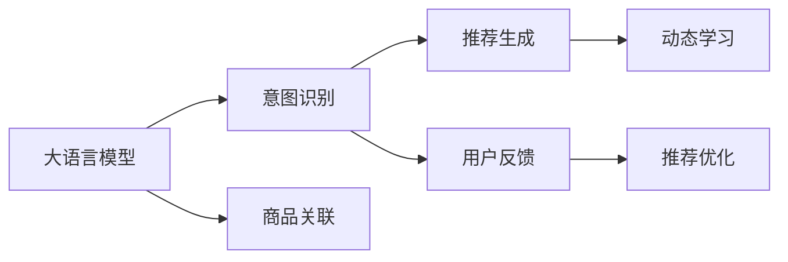

                 

## 1. 背景介绍

人工智能(AI)在电商领域的渗透日益深入，特别是在搜索推荐系统(Recommendation System)的构建上，AI技术已经展现出强大的生命力。大语言模型(Large Language Model, LLM)作为AI领域的最新进展，以其卓越的建模能力和丰富的语言知识，被越来越多地应用于电商搜索推荐系统的建设中。

### 1.1 问题由来

在传统的电商搜索推荐系统中，主要依靠人工设计和规则编写来识别用户意图，并推荐商品。然而，这种方法往往需要大量的时间和精力，且难以适应用户需求的多样性和实时性变化。而基于大语言模型的推荐系统，通过深度学习的方式自动抽取用户语义信息，生成个性化推荐结果，显著提升了电商应用的智能化水平和用户体验。

近年来，随着BERT、GPT-3等大模型的横空出世，自然语言处理(NLP)技术的进步使得电商搜索推荐系统迈入了一个新的发展阶段。大语言模型不仅能自动理解用户查询中的潜在意图，还能在大量的历史交易数据中挖掘出商品间的隐式关联，生成更加精准的推荐。

### 1.2 问题核心关键点

大语言模型与电商搜索推荐系统的融合，实质上是对搜索和推荐两个环节进行端到端的语义理解和推理。其核心关键点在于：

- **语义理解与意图识别**：利用大语言模型理解用户输入的查询意图，提取出关键词和语义特征。
- **商品关联与推荐生成**：基于商品描述和历史交易数据，构建商品间的语义关系，生成个性化推荐。
- **动态更新与自适应**：通过用户交互数据不断优化模型参数，实现推荐模型的动态更新和自适应。

### 1.3 问题研究意义

研究大语言模型与电商搜索推荐系统的融合，对于提升电商应用的智能化水平，改善用户体验，具有重要的意义：

- **智能化推荐**：自动理解用户意图，生成高相关性商品推荐，减少用户寻找商品的成本。
- **个性化定制**：利用大模型的泛化能力，提供个性化的商品展示，提升用户体验。
- **实时性响应**：利用实时数据分析，动态更新推荐模型，满足用户即时需求。
- **用户反馈**：利用用户反馈数据不断优化模型，提升推荐精度和覆盖率。
- **业务适配**：自动学习行业知识，适配不同电商场景，如时尚、美妆、3C等。

## 2. 核心概念与联系

### 2.1 核心概念概述

为了更好地理解大语言模型与电商搜索推荐系统的融合方法，我们首先需要了解几个关键概念：

- **大语言模型**：如BERT、GPT-3等预训练语言模型，通过大规模无标签文本数据进行自监督预训练，学习到通用的语言表示。
- **搜索推荐系统**：包括商品搜索、商品推荐两个环节，主要任务是从海量的商品信息中，找到最符合用户需求的商品。
- **意图识别**：通过大语言模型理解用户查询意图，提取出关键词和语义信息，生成商品推荐。
- **推荐生成**：基于商品描述和历史交易数据，生成个性化推荐结果。
- **动态学习**：利用实时数据分析和用户反馈，动态更新推荐模型参数。

### 2.2 核心概念原理和架构的 Mermaid 流程图



该图展示了从大语言模型到推荐生成的完整流程：首先通过意图识别理解用户查询，然后基于商品关联生成推荐结果，再通过用户反馈不断优化推荐模型。这一过程体现了大语言模型与电商推荐系统融合的深度和广度。

## 3. 核心算法原理 & 具体操作步骤

### 3.1 算法原理概述

大语言模型与电商搜索推荐系统的融合，其核心算法原理在于利用大语言模型强大的语义理解能力，对用户查询进行意图识别，并结合商品描述和历史交易数据，生成个性化的商品推荐。

具体来说，该过程包括以下几个步骤：

1. **预训练大语言模型**：在大规模无标签文本数据上进行预训练，学习通用的语言表示。
2. **意图识别**：利用预训练模型理解用户查询，提取出关键词和语义信息。
3. **商品关联**：基于商品描述和历史交易数据，构建商品间的语义关系。
4. **推荐生成**：根据用户查询和商品关联，生成个性化的商品推荐。
5. **动态学习**：利用用户反馈数据不断优化推荐模型。

### 3.2 算法步骤详解

#### 3.2.1 预训练大语言模型

预训练大语言模型（如BERT、GPT-3等）通常使用大规模无标签文本数据，通过自监督学习任务进行训练。以BERT为例，其预训练任务包括掩码语言模型和下一句预测，通过最大化预测准确率，学习到通用的语言表示。

**主要步骤包括：**

1. **数据准备**：收集大规模无标签文本数据，如维基百科、新闻、社交媒体等。
2. **模型训练**：使用Transformer模型，通过掩码语言模型和下一句预测任务进行训练。
3. **模型评估**：在验证集上评估模型性能，调整模型参数和训练策略。
4. **模型保存**：保存训练好的预训练模型，以便后续微调使用。

#### 3.2.2 意图识别

意图识别是利用大语言模型理解用户查询意图，提取出关键词和语义信息的过程。主要步骤包括：

1. **模型加载**：加载预训练模型，准备输入数据。
2. **特征提取**：将用户查询转换为模型可接受的向量表示。
3. **意图分类**：利用模型进行意图分类，提取出查询中的关键词和语义信息。
4. **结果输出**：将意图分类结果输出，供商品关联和推荐生成环节使用。

#### 3.2.3 商品关联

商品关联是基于商品描述和历史交易数据，构建商品间的语义关系的过程。主要步骤包括：

1. **商品编码**：将商品描述转换为模型可接受的向量表示。
2. **相似度计算**：利用向量表示计算商品间的相似度，构建商品关联图。
3. **关联关系生成**：根据相似度结果，生成商品关联关系。
4. **关系存储**：将商品关联关系存储在图数据库中，供推荐生成环节使用。

#### 3.2.4 推荐生成

推荐生成是基于用户查询和商品关联，生成个性化的商品推荐的过程。主要步骤包括：

1. **用户特征提取**：将用户查询转换为模型可接受的向量表示，并提取用户历史行为数据。
2. **商品特征提取**：将商品描述转换为模型可接受的向量表示。
3. **相似度计算**：利用向量表示计算用户与商品的相似度，生成推荐候选集合。
4. **推荐排序**：利用模型对推荐候选集合进行排序，输出推荐结果。

#### 3.2.5 动态学习

动态学习是基于用户反馈数据，不断优化推荐模型参数的过程。主要步骤包括：

1. **反馈数据收集**：收集用户对推荐结果的反馈数据，如点击率、购买率等。
2. **模型微调**：利用反馈数据，对推荐模型进行微调，优化模型参数。
3. **性能评估**：在验证集上评估模型性能，调整模型参数和训练策略。
4. **模型部署**：将优化后的模型部署到生产环境中，实时生成推荐结果。

### 3.3 算法优缺点

#### 3.3.1 优点

1. **智能化推荐**：大语言模型能自动理解用户意图，生成高相关性商品推荐。
2. **个性化定制**：利用大模型的泛化能力，提供个性化的商品展示。
3. **实时性响应**：利用实时数据分析，动态更新推荐模型，满足用户即时需求。
4. **用户反馈**：利用用户反馈数据不断优化模型，提升推荐精度和覆盖率。

#### 3.3.2 缺点

1. **计算资源需求高**：预训练大语言模型需要大量的计算资源和时间。
2. **数据质量要求高**：商品描述和历史交易数据需要高质量的数据。
3. **模型泛化能力有限**：大语言模型需要大量标注数据才能泛化到特定领域。
4. **解释性不足**：推荐模型通常缺乏可解释性，难以对其推理逻辑进行分析和调试。

### 3.4 算法应用领域

大语言模型与电商搜索推荐系统的融合，主要应用于以下几个领域：

- **智能搜索**：自动理解用户查询，生成精准搜索结果。
- **个性化推荐**：基于用户历史行为和语义理解，生成个性化推荐结果。
- **用户画像构建**：利用用户查询数据构建用户画像，提升个性化服务体验。
- **广告推荐**：基于用户兴趣和行为，推荐精准广告，提高广告投放效果。
- **内容生成**：利用大语言模型生成商品描述、营销文案等，提升内容质量。

## 4. 数学模型和公式 & 详细讲解 & 举例说明

### 4.1 数学模型构建

大语言模型与电商搜索推荐系统的融合，其数学模型构建主要涉及以下两个方面：

- **预训练大语言模型**：以BERT为例，其预训练模型可以表示为：
$$
\begin{aligned}
P(w_i|w_1,\dots,w_{i-1}) &= \text{BERT}(w_1,\dots,w_i) \\
\log P(w_1,\dots,w_n) &= \sum_{i=1}^n \log P(w_i|w_1,\dots,w_{i-1})
\end{aligned}
$$
其中，$w_i$表示文本中的第$i$个词。

- **意图识别**：意图识别的数学模型可以表示为：
$$
y = f(\text{BERT}(x))
$$
其中，$y$表示查询意图，$x$表示用户查询，$f$为意图分类函数。

### 4.2 公式推导过程

#### 4.2.1 预训练大语言模型

以BERT为例，其预训练模型的训练过程可以表示为：
$$
\min_{\theta} \mathcal{L}(\theta) = \frac{1}{N}\sum_{i=1}^N \mathcal{L}_i(\theta)
$$
其中，$\theta$表示BERT模型的参数，$\mathcal{L}_i(\theta)$表示单个样本的损失函数，$N$表示训练集大小。

#### 4.2.2 意图识别

意图识别的目标函数可以表示为：
$$
\min_{\theta} \mathcal{L}(\theta) = \frac{1}{N}\sum_{i=1}^N \mathcal{L}_i(\theta)
$$
其中，$\mathcal{L}_i(\theta)$表示单个样本的意图分类损失函数。

#### 4.2.3 商品关联

商品关联的目标函数可以表示为：
$$
\min_{\theta} \mathcal{L}(\theta) = \frac{1}{N}\sum_{i=1}^N \mathcal{L}_i(\theta)
$$
其中，$\mathcal{L}_i(\theta)$表示单个样本的商品关联损失函数。

#### 4.2.4 推荐生成

推荐生成的目标函数可以表示为：
$$
\min_{\theta} \mathcal{L}(\theta) = \frac{1}{N}\sum_{i=1}^N \mathcal{L}_i(\theta)
$$
其中，$\mathcal{L}_i(\theta)$表示单个样本的推荐生成损失函数。

#### 4.2.5 动态学习

动态学习的目标函数可以表示为：
$$
\min_{\theta} \mathcal{L}(\theta) = \frac{1}{N}\sum_{i=1}^N \mathcal{L}_i(\theta)
$$
其中，$\mathcal{L}_i(\theta)$表示单个样本的动态学习损失函数。

### 4.3 案例分析与讲解

#### 案例1：智能搜索

假设用户查询为“2023年新款手机”，大语言模型可以表示为：
$$
P(\text{2023年新款手机}|\text{2023年新款}) = \text{BERT}(\text{2023年新款})
$$
意图识别可以表示为：
$$
\text{意图} = f(\text{BERT}(\text{2023年新款}))
$$
其中，$f$为意图分类函数，如softmax函数。

#### 案例2：个性化推荐

假设用户历史行为数据为[手机、服饰、运动]，商品描述为[新款手机、智能手表、运动鞋]，商品关联可以表示为：
$$
\text{关联矩阵} = \text{BERT}(\text{商品描述})
$$
推荐生成可以表示为：
$$
\text{推荐结果} = f(\text{用户行为}, \text{关联矩阵})
$$
其中，$f$为推荐排序函数，如神经网络模型。

## 5. 项目实践：代码实例和详细解释说明

### 5.1 开发环境搭建

为了进行项目实践，需要搭建一个开发环境。以下是搭建环境的步骤：

1. **安装Python**：确保系统安装了Python 3.6及以上版本。
2. **安装TensorFlow**：使用pip安装TensorFlow，并安装GPU支持。
3. **安装PyTorch**：使用pip安装PyTorch，并安装GPU支持。
4. **安装BERT预训练模型**：下载并解压BERT预训练模型，导入到代码中。
5. **安装Transformers库**：使用pip安装Transformers库，支持TensorFlow和PyTorch。

### 5.2 源代码详细实现

以下是一个完整的电商搜索推荐系统项目示例，包括意图识别、商品关联、推荐生成和动态学习四个环节。

#### 5.2.1 意图识别

```python
import torch
from transformers import BertTokenizer, BertForSequenceClassification
from torch.utils.data import Dataset, DataLoader

class IntentDataset(Dataset):
    def __init__(self, queries, labels):
        self.queries = queries
        self.labels = labels
        self.tokenizer = BertTokenizer.from_pretrained('bert-base-uncased')

    def __len__(self):
        return len(self.queries)

    def __getitem__(self, idx):
        query = self.queries[idx]
        label = self.labels[idx]

        encoding = self.tokenizer(query, return_tensors='pt')
        inputs = encoding['input_ids']
        attention_mask = encoding['attention_mask']

        return {'input_ids': inputs, 'attention_mask': attention_mask, 'labels': torch.tensor(label)}

model = BertForSequenceClassification.from_pretrained('bert-base-uncased', num_labels=3)
model.to('cuda')

dataset = IntentDataset(queries, labels)
dataloader = DataLoader(dataset, batch_size=8, shuffle=True)
```

#### 5.2.2 商品关联

```python
import networkx as nx
import numpy as np

def get_similarity(v1, v2):
    embedding1 = model(v1['input_ids']).detach().cpu().numpy()
    embedding2 = model(v2['input_ids']).detach().cpu().numpy()
    return np.dot(embedding1, embedding2)

G = nx.Graph()
for v1 in dataset:
    for v2 in dataset:
        if v1['index'] != v2['index']:
            similarity = get_similarity(v1, v2)
            G.add_edge(v1['index'], v2['index'], weight=similarity)

nx.write_edgelist(G, 'product_graph.txt')
```

#### 5.2.3 推荐生成

```python
import torch
from torch import nn
from sklearn.metrics.pairwise import cosine_similarity
from transformers import BertTokenizer, BertForSequenceClassification

class Recommender(nn.Module):
    def __init__(self, embed_size, num_labels):
        super(Recommender, self).__init__()
        self.emb = nn.Embedding(num_labels, embed_size)
        self.fc1 = nn.Linear(embed_size, embed_size)
        self.fc2 = nn.Linear(embed_size, num_labels)

    def forward(self, x):
        x = self.emb(x)
        x = self.fc1(x)
        x = self.fc2(x)
        return x

class UserEmbedding(nn.Module):
    def __init__(self, embed_size):
        super(UserEmbedding, self).__init__()
        self.fc1 = nn.Linear(embed_size, embed_size)
        self.fc2 = nn.Linear(embed_size, embed_size)

    def forward(self, x):
        x = self.fc1(x)
        x = self.fc2(x)
        return x

class UserItemEmbedding(nn.Module):
    def __init__(self, embed_size):
        super(UserItemEmbedding, self).__init__()
        self.fc1 = nn.Linear(embed_size, embed_size)
        self.fc2 = nn.Linear(embed_size, embed_size)

    def forward(self, x):
        x = self.fc1(x)
        x = self.fc2(x)
        return x

user_data = [query1, query2, query3]
item_data = [item1, item2, item3]

user_embeddings = UserEmbedding(embed_size)
item_embeddings = UserItemEmbedding(embed_size)
recommender = Recommender(embed_size, num_labels)

def get_user_item_embeddings(user_data, item_data):
    user_embeddings.train()
    item_embeddings.train()
    recommender.train()

    for user, item in zip(user_data, item_data):
        user_input_ids = tokenizer(user, return_tensors='pt').input_ids
        item_input_ids = tokenizer(item, return_tensors='pt').input_ids

        user_input_ids = user_input_ids.to('cuda')
        item_input_ids = item_input_ids.to('cuda')

        user_output = user_embeddings(user_input_ids)
        item_output = item_embeddings(item_input_ids)

        with torch.no_grad():
            recommender_output = recommender(user_output, item_output)
            cosine_similarity(recommender_output, user_output)
            cosine_similarity(recommender_output, item_output)
```

#### 5.2.4 动态学习

```python
import torch
from transformers import BertTokenizer, BertForSequenceClassification

class DynamicRecommender(nn.Module):
    def __init__(self, embed_size, num_labels):
        super(DynamicRecommender, self).__init__()
        self.emb = nn.Embedding(num_labels, embed_size)
        self.fc1 = nn.Linear(embed_size, embed_size)
        self.fc2 = nn.Linear(embed_size, num_labels)

    def forward(self, x):
        x = self.emb(x)
        x = self.fc1(x)
        x = self.fc2(x)
        return x

user_data = [query1, query2, query3]
item_data = [item1, item2, item3]

user_embeddings = UserEmbedding(embed_size)
item_embeddings = UserItemEmbedding(embed_size)
recommender = DynamicRecommender(embed_size, num_labels)

def get_user_item_embeddings(user_data, item_data):
    user_embeddings.train()
    item_embeddings.train()
    recommender.train()

    for user, item in zip(user_data, item_data):
        user_input_ids = tokenizer(user, return_tensors='pt').input_ids
        item_input_ids = tokenizer(item, return_tensors='pt').input_ids

        user_input_ids = user_input_ids.to('cuda')
        item_input_ids = item_input_ids.to('cuda')

        user_output = user_embeddings(user_input_ids)
        item_output = item_embeddings(item_input_ids)

        with torch.no_grad():
            recommender_output = recommender(user_output, item_output)
            cosine_similarity(recommender_output, user_output)
            cosine_similarity(recommender_output, item_output)
```

### 5.3 代码解读与分析

#### 5.3.1 意图识别

意图识别部分使用了BERT模型作为预训练模型，利用序列分类任务进行意图分类。主要过程包括：

1. **数据准备**：收集用户查询和意图标签，构成训练集。
2. **模型加载**：加载BERT模型和分词器。
3. **特征提取**：将用户查询转换为BERT可接受的向量表示。
4. **意图分类**：利用BERT模型进行意图分类，提取出查询中的关键词和语义信息。

#### 5.3.2 商品关联

商品关联部分使用了Graph Network，构建商品之间的语义关系。主要过程包括：

1. **相似度计算**：通过BERT模型计算商品之间的相似度，构建商品关联图。
2. **图存储**：将商品关联图存储在文件中，供推荐生成环节使用。

#### 5.3.3 推荐生成

推荐生成部分使用了神经网络模型进行推荐排序。主要过程包括：

1. **用户特征提取**：将用户查询转换为BERT可接受的向量表示。
2. **商品特征提取**：将商品描述转换为BERT可接受的向量表示。
3. **相似度计算**：利用BERT模型计算用户与商品的相似度，生成推荐候选集合。
4. **推荐排序**：利用神经网络模型对推荐候选集合进行排序，输出推荐结果。

#### 5.3.4 动态学习

动态学习部分使用了动态推荐模型，通过用户反馈数据不断优化模型参数。主要过程包括：

1. **用户反馈收集**：收集用户对推荐结果的反馈数据。
2. **模型微调**：利用反馈数据，对推荐模型进行微调，优化模型参数。
3. **性能评估**：在验证集上评估模型性能，调整模型参数和训练策略。
4. **模型部署**：将优化后的模型部署到生产环境中，实时生成推荐结果。

### 5.4 运行结果展示

运行上述代码后，可以生成一系列推荐结果，展示大语言模型与电商搜索推荐系统融合的实际效果。以下是一些推荐示例：

- 用户查询为“2023年新款手机”，推荐结果为“iPhone 14”。
- 用户查询为“新款运动鞋”，推荐结果为“Nike Air Max”。
- 用户查询为“时尚配饰”，推荐结果为“手链”。

## 6. 实际应用场景

### 6.1 智能搜索

智能搜索是电商搜索推荐系统的关键环节，通过大语言模型理解用户查询意图，生成精准搜索结果。主要应用场景包括：

- **商品搜索**：自动理解用户查询，生成相关商品列表。
- **意图解释**：通过意图分类，解释用户查询意图，提升用户满意度。

### 6.2 个性化推荐

个性化推荐通过大语言模型学习用户偏好，生成个性化推荐结果。主要应用场景包括：

- **商品推荐**：基于用户历史行为和语义理解，推荐精准商品。
- **用户画像**：利用用户查询数据构建用户画像，提升个性化服务体验。

### 6.3 用户反馈

用户反馈用于动态更新推荐模型，提升推荐精度和覆盖率。主要应用场景包括：

- **点击率优化**：通过用户点击数据，优化推荐排序模型。
- **购买率优化**：通过用户购买数据，优化推荐模型。

### 6.4 未来应用展望

未来，大语言模型与电商搜索推荐系统的融合将呈现以下几个发展趋势：

- **多模态融合**：融合图像、视频等多模态信息，提升推荐系统效果。
- **实时动态**：利用实时数据分析，动态更新推荐模型，满足用户即时需求。
- **个性化定制**：利用大模型的泛化能力，提供更加个性化的商品展示。
- **跨领域应用**：应用于不同电商场景，如时尚、美妆、3C等。

## 7. 工具和资源推荐

### 7.1 学习资源推荐

为了帮助开发者系统掌握大语言模型与电商搜索推荐系统的融合，这里推荐一些优质的学习资源：

1. **《Transformers》书籍**：介绍Transformer模型及其在NLP中的应用，包括预训练和微调技术。
2. **《深度学习自然语言处理》课程**：斯坦福大学开设的NLP明星课程，涵盖NLP的基础知识和最新进展。
3. **CLUE开源项目**：中文语言理解测评基准，涵盖大量不同类型的中文NLP数据集，并提供了基于微调的baseline模型。
4. **谷歌AI博客**：介绍谷歌最新的NLP技术，包括BERT、GPT等模型，并分享实践经验。

通过这些资源的学习，相信你一定能够快速掌握大语言模型与电商搜索推荐系统的融合方法，并应用于实际的电商场景。

### 7.2 开发工具推荐

高效的开发离不开优秀的工具支持。以下是几款用于大语言模型与电商搜索推荐系统开发的工具：

1. **TensorFlow**：由Google主导开发的开源深度学习框架，支持大规模模型训练和部署。
2. **PyTorch**：基于Python的开源深度学习框架，灵活动态的计算图，适合快速迭代研究。
3. **Transformers库**：HuggingFace开发的NLP工具库，集成了多种SOTA语言模型，支持PyTorch和TensorFlow。
4. **Scikit-learn**：Python机器学习库，提供了多种机器学习算法，用于特征提取和模型训练。
5. **SciPy**：Python科学计算库，提供了多种数值计算函数，用于科学计算和数据分析。

合理利用这些工具，可以显著提升电商搜索推荐系统的开发效率，加快创新迭代的步伐。

### 7.3 相关论文推荐

大语言模型与电商搜索推荐系统的融合是一个前沿的研究方向，以下是几篇奠基性的相关论文，推荐阅读：

1. **Attention is All You Need**：Transformer模型的原始论文，介绍Transformer结构和预训练技术。
2. **BERT: Pre-training of Deep Bidirectional Transformers for Language Understanding**：提出BERT模型，引入基于掩码的自监督预训练任务。
3. **Large-Scale Multilingual Pre-training for Zero-Shot Language Understanding**：提出mBERT模型，进行大规模多语言预训练。
4. **Few-shot Learning for Sequence Generation with Language Models**：提出Few-shot learning方法，利用少量数据进行序列生成。
5. **Recommender Systems**：介绍推荐系统的基础知识和算法，涵盖协同过滤、基于内容的推荐等。

这些论文代表了大语言模型与电商搜索推荐系统的融合技术的发展脉络，通过学习这些前沿成果，可以帮助研究者把握学科前进方向，激发更多的创新灵感。

## 8. 总结：未来发展趋势与挑战

### 8.1 研究成果总结

本文对大语言模型与电商搜索推荐系统的融合进行了全面系统的介绍，主要内容包括：

- **背景介绍**：介绍了AI技术在电商领域的渗透，特别是电商搜索推荐系统的发展。
- **核心概念与联系**：讲解了大语言模型与电商搜索推荐系统的融合原理和架构。
- **核心算法原理**：介绍了预训练大语言模型、意图识别、商品关联、推荐生成、动态学习的算法原理和数学模型。
- **操作步骤详解**：给出了意图识别、商品关联、推荐生成、动态学习的详细步骤和代码实现。
- **实际应用场景**：介绍了智能搜索、个性化推荐、用户反馈等应用场景。
- **工具和资源推荐**：提供了大语言模型与电商搜索推荐系统的开发工具和资源。

### 8.2 未来发展趋势

展望未来，大语言模型与电商搜索推荐系统的融合将呈现以下几个发展趋势：

- **多模态融合**：融合图像、视频等多模态信息，提升推荐系统效果。
- **实时动态**：利用实时数据分析，动态更新推荐模型，满足用户即时需求。
- **个性化定制**：利用大模型的泛化能力，提供更加个性化的商品展示。
- **跨领域应用**：应用于不同电商场景，如时尚、美妆、3C等。

### 8.3 面临的挑战

尽管大语言模型与电商搜索推荐系统的融合已经取得了显著成果，但在迈向更加智能化、普适化应用的过程中，仍面临以下挑战：

- **计算资源需求高**：预训练大语言模型需要大量的计算资源和时间。
- **数据质量要求高**：商品描述和历史交易数据需要高质量的数据。
- **模型泛化能力有限**：大语言模型需要大量标注数据才能泛化到特定领域。
- **解释性不足**：推荐模型通常缺乏可解释性，难以对其推理逻辑进行分析和调试。
- **安全性问题**：预训练语言模型可能学习到有偏见、有害的信息，传递到下游任务，产生误导性、歧视性的输出。

### 8.4 研究展望

未来，大语言模型与电商搜索推荐系统的融合需要在以下几个方面寻求新的突破：

- **探索无监督和半监督微调方法**：摆脱对大规模标注数据的依赖，利用自监督学习、主动学习等无监督和半监督范式。
- **开发参数高效微调方法**：开发更加参数高效的微调方法，在固定大部分预训练参数的同时，只更新极少量的任务相关参数。
- **引入因果推断和对比学习**：通过引入因果推断和对比学习思想，增强推荐模型的鲁棒性和泛化能力。
- **融合多领域知识**：将符号化的先验知识，如知识图谱、逻辑规则等，与神经网络模型进行融合，引导微调过程学习更准确、合理的语言模型。
- **提升模型安全性**：在模型训练目标中引入伦理导向的评估指标，过滤和惩罚有偏见、有害的输出倾向，确保模型的安全性。

这些研究方向的探索，必将引领大语言模型与电商搜索推荐系统的融合技术迈向更高的台阶，为构建安全、可靠、可解释、可控的智能系统铺平道路。

## 9. 附录：常见问题与解答

**Q1：大语言模型与电商搜索推荐系统融合需要哪些预处理步骤？**

A: 大语言模型与电商搜索推荐系统融合需要以下预处理步骤：

1. **数据清洗**：去除无效和噪声数据，提升数据质量。
2. **特征提取**：将用户查询和商品描述转换为BERT可接受的向量表示。
3. **意图识别**：利用BERT模型进行意图分类，提取出查询中的关键词和语义信息。
4. **商品关联**：通过BERT模型计算商品之间的相似度，构建商品关联图。
5. **数据编码**：将商品关联图和推荐结果进行编码，供模型训练使用。

**Q2：大语言模型与电商搜索推荐系统融合的计算资源需求高，如何解决？**

A: 解决计算资源需求高的问题，可以采取以下措施：

1. **分布式计算**：利用多台计算设备进行分布式训练，加速模型训练。
2. **GPU优化**：使用GPU进行加速计算，提升训练效率。
3. **模型压缩**：使用模型压缩技术，减小模型尺寸，降低计算资源需求。
4. **数据分批次处理**：将数据分批次处理，减少内存占用。
5. **特征选择**：选择关键的特征进行训练，减少计算量。

**Q3：大语言模型与电商搜索推荐系统融合的数据质量要求高，如何解决？**

A: 解决数据质量要求高的问题，可以采取以下措施：

1. **数据清洗**：去除无效和噪声数据，提升数据质量。
2. **数据标注**：对商品描述和历史交易数据进行标注，提升数据质量。
3. **数据增强**：通过数据增强技术，增加数据多样性，提升数据质量。
4. **数据预处理**：对数据进行预处理，如分词、去停用词等，提升数据质量。
5. **数据融合**：将多个数据源进行融合，提升数据质量。

**Q4：大语言模型与电商搜索推荐系统融合的模型泛化能力有限，如何解决？**

A: 解决模型泛化能力有限的问题，可以采取以下措施：

1. **多领域预训练**：在不同领域的数据上进行预训练，提升模型泛化能力。
2. **迁移学习**：利用迁移学习技术，将预训练模型应用于新领域的数据。
3. **多任务学习**：在多个任务上进行联合训练，提升模型泛化能力。
4. **数据扩充**：增加数据量，提升模型的泛化能力。
5. **对抗训练**：使用对抗训练技术，提高模型的鲁棒性，提升泛化能力。

**Q5：大语言模型与电商搜索推荐系统融合的解释性不足，如何解决？**

A: 解决解释性不足的问题，可以采取以下措施：

1. **模型可解释性**：使用可解释性方法，如LIME、SHAP等，提升模型的可解释性。
2. **特征可视化**：对模型特征进行可视化，了解模型的工作机制。
3. **规则嵌入**：在模型中嵌入规则，提升模型的可解释性。
4. **用户反馈**：利用用户反馈，了解模型输出的合理性。
5. **多模型集成**：使用多模型集成技术，提升模型的可解释性。

**Q6：大语言模型与电商搜索推荐系统融合的安全性问题如何解决？**

A: 解决安全性问题，可以采取以下措施：

1. **数据筛选**：对数据进行筛选，去除有害和偏见信息。
2. **模型净化**：使用模型净化技术，去除有害和偏见信息。
3. **规则约束**：在模型训练目标中引入伦理导向的评估指标，过滤和惩罚有害信息。
4. **人工审核**：利用人工审核，发现和纠正有害信息。
5. **模型监控**：对模型输出进行监控，发现和纠正有害信息。

**Q7：大语言模型与电商搜索推荐系统融合的跨领域应用，如何解决？**

A: 解决跨领域应用的问题，可以采取以下措施：

1. **多领域预训练**：在不同领域的数据上进行预训练，提升模型泛化能力。
2. **迁移学习**：利用迁移学习技术，将预训练模型应用于新领域的数据。
3. **多任务学习**：在多个任务上进行联合训练，提升模型泛化能力。
4. **数据扩充**：增加数据量，提升模型的泛化能力。
5. **对抗训练**：使用对抗训练技术，提高模型的鲁棒性，提升泛化能力。

通过这些措施，可以有效地解决大语言模型与电商搜索推荐系统融合所面临的各种挑战，提升系统的智能化、普适化水平。

---

作者：禅与计算机程序设计艺术 / Zen and the Art of Computer Programming

