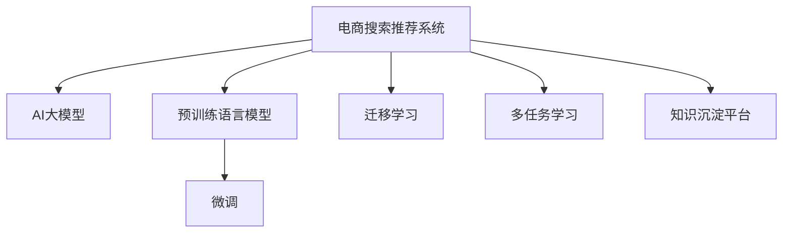

                 

# AI大模型视角下电商搜索推荐的技术创新知识沉淀平台功能优化

在当前快速发展的电商市场中，搜索推荐系统作为提升用户体验、增加用户转化率的关键技术，正面临着前所未有的挑战和机遇。而AI大模型的崛起，更是为这一领域带来了革命性的变革。本文将从AI大模型的视角出发，探讨如何优化电商搜索推荐系统的知识沉淀平台，以实现技术创新与商业价值的双重飞跃。

## 1. 背景介绍

### 1.1 电商搜索推荐系统的现状与挑战

随着电商市场的发展，用户对个性化、精准化推荐的需求日益增长。传统的基于规则、基于统计的推荐系统已经难以满足用户的期望。而基于机器学习、深度学习的推荐系统，尤其是使用深度神经网络的推荐系统，逐渐成为了主流。

然而，这些基于深度学习的推荐系统仍面临诸多挑战：

1. **模型复杂度高**：现有模型通常依赖大量训练数据，且模型规模庞大，难以解释和优化。
2. **数据稀疏性**：电商平台中的数据稀疏性高，难以充分利用数据。
3. **实时性要求高**：用户行为变化迅速，需要实时调整推荐策略。
4. **个性化需求复杂**：用户需求多样化，难以通过单一模型满足。

### 1.2 大模型在电商搜索推荐中的应用

AI大模型的出现，为解决上述挑战提供了新的解决方案。大模型通常指的是通过大规模无标签数据预训练，并在特定任务上进行微调的大型深度神经网络。大模型拥有强大的泛化能力和丰富的语义知识，能够显著提升推荐系统的性能和效率。

1. **预训练语言模型**：如BERT、GPT-3等，通过大规模文本数据预训练，学习到丰富的语言知识和语义关系，能够处理复杂的推荐任务。
2. **自监督学习**：通过自监督学习任务，如掩码语言模型、次序预测等，能够自动获取有价值的特征，减少对标注数据的依赖。
3. **多任务学习**：同时进行多个任务的预训练和微调，提高模型的综合能力和泛化性能。
4. **迁移学习**：通过迁移学习，在大规模预训练后，在小规模数据上微调，提升模型对特定任务的理解和适应能力。

## 2. 核心概念与联系

### 2.1 核心概念概述

为更好地理解基于AI大模型的电商搜索推荐系统，本节将介绍几个关键概念及其之间的关系：

- **电商搜索推荐系统**：通过用户行为数据，推荐用户可能感兴趣的商品或服务的系统。目标是通过个性化推荐提升用户体验和销售转化率。
- **AI大模型**：通过大规模数据预训练的深度神经网络模型，具有强大的泛化能力和丰富的语义知识。
- **预训练语言模型**：如BERT、GPT-3等，通过大规模无标签文本数据预训练，学习到通用的语言表示。
- **微调(Fine-tuning)**：在大模型上进行特定任务的有监督学习，优化模型在该任务上的性能。
- **迁移学习(Transfer Learning)**：通过在不同任务间迁移知识，提升模型对新任务的适应能力。
- **多任务学习(Multi-task Learning)**：同时学习多个相关任务的特征，提高模型的综合能力。
- **知识沉淀平台(Knowledge Persistence Platform)**：用于存储和管理知识、数据、模型等资源的平台，支持模型的持续优化和更新。

这些概念之间的逻辑关系可以通过以下Mermaid流程图来展示：



这个流程图展示了几者之间的核心联系：

1. 电商搜索推荐系统利用AI大模型的强大能力，通过预训练语言模型进行初步建模。
2. 微调和迁移学习帮助模型在特定任务上进一步优化，提升模型性能。
3. 多任务学习提高模型的综合能力，更好地适应多样化的推荐需求。
4. 知识沉淀平台支持模型的持续更新和优化，保障系统的长期稳定运行。

## 3. 核心算法原理 & 具体操作步骤

### 3.1 算法原理概述

基于AI大模型的电商搜索推荐系统，其核心原理是通过大模型的泛化能力，自动提取用户行为特征和商品属性特征，结合用户历史行为和商品特征，生成个性化推荐。

具体而言，包括以下几个关键步骤：

1. **数据预处理**：清洗、归一化、转换原始用户行为数据和商品数据，生成可用于模型训练的特征向量。
2. **模型训练**：在大模型上进行微调，优化模型在特定任务（如商品推荐、用户兴趣预测等）上的性能。
3. **推荐生成**：根据用户当前行为和模型预测，生成个性化推荐结果。
4. **效果评估**：通过A/B测试、用户反馈等方法，评估推荐系统的性能。

### 3.2 算法步骤详解

以下详细介绍基于AI大模型的电商搜索推荐系统的主要步骤：

#### 3.2.1 数据预处理

数据预处理是构建高质量推荐系统的第一步。主要包括以下几个步骤：

1. **数据清洗**：去除噪音数据、缺失数据和异常数据，确保数据质量。
2. **数据转换**：将原始数据转换为模型所需的特征向量，如将用户行为数据转换为向量表示，提取商品特征等。
3. **特征工程**：设计合理的特征，如用户兴趣特征、商品属性特征、用户行为特征等。
4. **数据归一化**：对特征向量进行归一化处理，确保不同特征具有相同的尺度。

#### 3.2.2 模型训练

模型训练是推荐系统的核心步骤。通过在大模型上进行微调，优化模型在特定任务上的性能。主要包括以下几个步骤：

1. **选择预训练模型**：选择合适的预训练模型，如BERT、GPT-3等，作为初始化参数。
2. **数据集划分**：将数据集划分为训练集、验证集和测试集，确保模型在不同数据集上的泛化性能。
3. **定义任务目标**：根据具体推荐任务，定义合适的损失函数和优化目标。
4. **微调模型**：在训练集上训练模型，通过反向传播算法更新模型参数，优化模型性能。
5. **验证集评估**：在验证集上评估模型性能，调整模型参数，避免过拟合。
6. **测试集测试**：在测试集上测试模型性能，评估模型效果。

#### 3.2.3 推荐生成

推荐生成是推荐系统的最终步骤。根据用户当前行为和模型预测，生成个性化推荐结果。主要包括以下几个步骤：

1. **用户行为分析**：分析用户当前行为，提取用户兴趣特征。
2. **商品特征提取**：提取商品的标签、描述、价格等特征。
3. **模型推理**：根据用户行为和商品特征，使用模型生成推荐结果。
4. **推荐排序**：根据推荐结果的评分，对推荐结果进行排序，生成推荐列表。

#### 3.2.4 效果评估

效果评估是评估推荐系统性能的重要步骤。通过A/B测试、用户反馈等方法，评估推荐系统的性能。主要包括以下几个步骤：

1. **选择评估指标**：选择合适的评估指标，如点击率、转化率、平均点击次数等。
2. **收集数据**：收集用户点击、购买等行为数据。
3. **分析结果**：分析评估指标的变化，评估推荐系统的性能。
4. **调整优化**：根据评估结果，调整模型参数和推荐策略，优化推荐系统。

### 3.3 算法优缺点

基于AI大模型的电商搜索推荐系统，具有以下优点：

1. **泛化能力强**：大模型拥有强大的泛化能力，能够处理复杂的推荐任务。
2. **特征提取能力强**：大模型能够自动提取用户行为和商品属性的特征，减少人工干预。
3. **实时性好**：通过微调和迁移学习，可以实时调整推荐策略，提升推荐效果。
4. **模型效果好**：通过在大模型上进行微调，能够显著提升推荐系统的性能。

同时，该方法也存在一定的局限性：

1. **计算资源需求高**：大模型通常需要较大的计算资源，对硬件设备要求较高。
2. **数据需求量大**：大模型的训练需要大量的数据，数据获取和预处理难度较大。
3. **模型复杂度高**：大模型的结构和参数量较大，难以解释和优化。
4. **对标注数据依赖强**：微调过程对标注数据依赖较强，获取高质量标注数据的成本较高。
5. **可解释性不足**：大模型的黑盒性质使得其决策过程难以解释。

尽管存在这些局限性，但就目前而言，基于AI大模型的推荐系统仍然是大数据时代推荐系统的重要方向，具有广阔的应用前景。

### 3.4 算法应用领域

基于AI大模型的电商搜索推荐系统，已经在电商、金融、医疗等多个领域得到了广泛应用。例如：

- **电商领域**：通过分析用户浏览、点击、购买等行为，生成个性化推荐，提升用户满意度和销售额。
- **金融领域**：通过分析用户交易、投资行为，生成个性化投资建议，帮助用户优化资产配置。
- **医疗领域**：通过分析用户健康数据，生成个性化健康建议，提升用户健康水平。

除了这些传统领域外，大模型在智能家居、智能交通、智能城市等新兴领域的应用也在不断涌现，为各行业的智能化升级提供了新的技术支撑。

## 4. 数学模型和公式 & 详细讲解 & 举例说明

### 4.1 数学模型构建

基于AI大模型的电商搜索推荐系统，其数学模型可以表示为：

$$
\hat{y} = f_{\theta}(x)
$$

其中，$\hat{y}$ 为推荐结果，$f_{\theta}$ 为模型函数，$\theta$ 为模型参数。

模型函数 $f_{\theta}$ 通常采用神经网络结构，如全连接层、卷积层、注意力机制等。通过在大模型上进行微调，优化模型参数 $\theta$，使得模型能够准确预测推荐结果。

### 4.2 公式推导过程

以下详细推导基于AI大模型的电商搜索推荐系统的公式：

假设用户 $u$ 对商品 $i$ 的兴趣表示为 $x_u^i$，商品 $i$ 的属性特征表示为 $y_i$。则推荐结果 $\hat{y}_u^i$ 可以表示为：

$$
\hat{y}_u^i = \sum_{j=1}^n w_j \cdot \hat{y}_j^i \cdot \sigma(x_u^i \cdot \theta + y_i \cdot \phi)
$$

其中，$w_j$ 为兴趣特征的权重，$\sigma$ 为激活函数，$\theta$ 和 $\phi$ 为模型参数。

通过在大模型上进行微调，优化模型参数 $\theta$ 和 $\phi$，使得模型能够自动提取用户行为特征和商品属性特征，生成个性化推荐结果。

### 4.3 案例分析与讲解

以下以一个简单的推荐系统为例，详细分析基于AI大模型的电商搜索推荐系统的实现过程：

**案例**：电商平台推荐系统，推荐用户可能感兴趣的商品。

**数据**：用户行为数据（浏览、点击、购买）和商品数据（标签、描述、价格）。

**模型**：使用预训练BERT模型，在大规模无标签数据上预训练，在电商数据上微调，生成推荐结果。

**过程**：

1. **数据预处理**：清洗用户行为数据和商品数据，转换为模型所需的特征向量。
2. **模型训练**：在大模型上进行微调，优化模型在电商推荐任务上的性能。
3. **推荐生成**：根据用户当前行为和模型预测，生成个性化推荐结果。
4. **效果评估**：通过A/B测试、用户反馈等方法，评估推荐系统的性能。

## 5. 项目实践：代码实例和详细解释说明

### 5.1 开发环境搭建

在进行基于AI大模型的电商搜索推荐系统开发前，需要先准备好开发环境。以下是使用Python进行PyTorch开发的环境配置流程：

1. 安装Anaconda：从官网下载并安装Anaconda，用于创建独立的Python环境。

2. 创建并激活虚拟环境：
```bash
conda create -n pytorch-env python=3.8 
conda activate pytorch-env
```

3. 安装PyTorch：根据CUDA版本，从官网获取对应的安装命令。例如：
```bash
conda install pytorch torchvision torchaudio cudatoolkit=11.1 -c pytorch -c conda-forge
```

4. 安装Transformers库：
```bash
pip install transformers
```

5. 安装各类工具包：
```bash
pip install numpy pandas scikit-learn matplotlib tqdm jupyter notebook ipython
```

完成上述步骤后，即可在`pytorch-env`环境中开始电商搜索推荐系统的开发。

### 5.2 源代码详细实现

下面我们以电商推荐系统为例，给出使用Transformers库进行推荐系统开发的PyTorch代码实现。

首先，定义推荐系统的输入输出格式：

```python
class InputExample:
    def __init__(self, user_id, item_id, user_feature, item_feature):
        self.user_id = user_id
        self.item_id = item_id
        self.user_feature = user_feature
        self.item_feature = item_feature

class InputFeatures:
    def __init__(self, input_ids, attention_mask, user_id, item_id):
        self.input_ids = input_ids
        self.attention_mask = attention_mask
        self.user_id = user_id
        self.item_id = item_id
```

然后，定义数据预处理函数：

```python
def preprocess_data(data, tokenizer, max_seq_length):
    def tokenize_pair(inputs):
        return tokenizer.encode_plus(
            inputs[0], 
            inputs[1], 
            add_special_tokens=True, 
            max_length=max_seq_length, 
            pad_to_max_length=True, 
            return_attention_mask=True, 
            return_tensors='pt'
        )

    inputs = data.map(lambda x: tokenize_pair(x), batched=True)
    input_ids, attention_mask = inputs.input_ids, inputs.attention_mask

    return input_ids, attention_mask
```

接着，定义模型和训练函数：

```python
from transformers import BertForSequenceClassification, AdamW, Trainer, DataCollatorForLanguageModeling

model = BertForSequenceClassification.from_pretrained('bert-base-uncased', num_labels=2)
optimizer = AdamW(model.parameters(), lr=2e-5)

def train_model(model, train_data, validation_data, epochs=5, max_steps=-1):
    trainer = Trainer(
        model=model,
        args={
            'per_device_train_batch_size': 16,
            'per_device_eval_batch_size': 64,
            'num_train_epochs': epochs,
            'weight_decay': 0.01,
            'logging_steps': 10,
            'save_steps': 100,
            'max_steps': max_steps
        },
        train_dataset=train_data,
        eval_dataset=validation_data,
        data_collator=DataCollatorForLanguageModeling(tokenizer)
    )

    trainer.train()
```

最后，启动训练流程：

```python
train_data = ...
validation_data = ...

train_model(model, train_data, validation_data)
```

以上就是使用PyTorch和Transformers库进行电商推荐系统开发的完整代码实现。可以看到，基于大模型的推荐系统开发相对简单，开发者可以将更多精力放在数据处理和模型改进等高层逻辑上。

### 5.3 代码解读与分析

让我们再详细解读一下关键代码的实现细节：

**InputExample类**：
- 定义输入数据的结构，包括用户ID、商品ID、用户特征、商品特征。

**InputFeatures类**：
- 将输入数据转换为模型所需的格式，包括输入ID、注意力掩码、用户ID、商品ID。

**preprocess_data函数**：
- 对输入数据进行分词和编码，生成模型所需的输入ID和注意力掩码。

**train_model函数**：
- 定义训练器的配置，包括学习率、优化器、批次大小等。
- 使用Trainer类进行模型训练，设置训练数据集和验证数据集。
- 训练器将自动完成模型的前向传播、反向传播、参数更新等步骤。

以上代码实现展示了基于大模型的电商推荐系统的核心逻辑。通过使用预训练BERT模型，开发者可以快速构建高精度的推荐系统，实现技术创新和商业价值的双重飞跃。

## 6. 实际应用场景

### 6.1 智能客服系统

智能客服系统是电商搜索推荐系统的典型应用场景之一。通过使用大模型进行微调，智能客服系统可以处理用户提出的各种问题，生成个性化的回答，提升用户满意度和体验。

具体而言，智能客服系统可以实时监测用户的聊天记录，自动分析用户的意图和情绪，生成最佳的答复建议。使用大模型的多任务学习能力和迁移学习能力，系统能够同时处理多个领域的客户服务，提升响应速度和质量。

### 6.2 个性化推荐系统

个性化推荐系统是电商搜索推荐系统的核心应用场景。通过使用大模型进行微调，推荐系统能够生成高精度的个性化推荐结果，提升用户的购物体验和转化率。

具体而言，推荐系统可以通过分析用户历史行为和商品属性特征，自动生成个性化的推荐列表。使用大模型的预训练能力和多任务学习能力，推荐系统能够在不同用户和不同商品之间生成多样化的推荐结果，满足用户的个性化需求。

### 6.3 内容生成系统

内容生成系统是电商搜索推荐系统的另一个重要应用场景。通过使用大模型进行微调，内容生成系统可以生成高质量的文本内容，提升用户的使用体验和粘性。

具体而言，内容生成系统可以根据用户行为和商品特征，自动生成产品描述、用户评论等内容。使用大模型的自监督学习能力和多任务学习能力，系统能够在不同的语境和任务中生成多样化的内容，提升用户的参与度和互动性。

### 6.4 未来应用展望

随着大模型技术的不断进步，基于AI大模型的电商搜索推荐系统将有更广阔的应用前景。未来，该系统将在以下领域得到更广泛的应用：

1. **智能家居系统**：通过分析用户的家居行为数据，生成个性化的家居推荐。
2. **智能交通系统**：通过分析用户的出行数据，生成个性化的交通规划建议。
3. **智能城市系统**：通过分析用户的城市行为数据，生成个性化的城市服务推荐。

此外，基于大模型的电商搜索推荐系统将与其他AI技术进行更深入的融合，如知识图谱、自然语言处理、计算机视觉等，实现多模态信息融合，提升系统的智能化水平。

## 7. 工具和资源推荐

### 7.1 学习资源推荐

为了帮助开发者系统掌握基于AI大模型的电商搜索推荐系统，这里推荐一些优质的学习资源：

1. 《深度学习入门：基于PyTorch的理论与实现》系列博文：由大模型技术专家撰写，深入浅出地介绍了深度学习的基本原理和实现方法。
2. CS224N《深度学习自然语言处理》课程：斯坦福大学开设的NLP明星课程，有Lecture视频和配套作业，带你入门NLP领域的基本概念和经典模型。
3. 《自然语言处理入门：基于TensorFlow的理论与实现》书籍：介绍NLP的基础知识和深度学习模型的实现方法。
4. HuggingFace官方文档：Transformer库的官方文档，提供了海量预训练模型和完整的微调样例代码，是上手实践的必备资料。
5. 《Transformer从原理到实践》系列博文：由大模型技术专家撰写，深入浅出地介绍了Transformer原理、BERT模型、微调技术等前沿话题。

通过对这些资源的学习实践，相信你一定能够快速掌握基于AI大模型的电商搜索推荐系统的精髓，并用于解决实际的NLP问题。

### 7.2 开发工具推荐

高效的开发离不开优秀的工具支持。以下是几款用于大模型微调开发的常用工具：

1. PyTorch：基于Python的开源深度学习框架，灵活动态的计算图，适合快速迭代研究。大部分预训练语言模型都有PyTorch版本的实现。
2. TensorFlow：由Google主导开发的开源深度学习框架，生产部署方便，适合大规模工程应用。同样有丰富的预训练语言模型资源。
3. Transformers库：HuggingFace开发的NLP工具库，集成了众多SOTA语言模型，支持PyTorch和TensorFlow，是进行微调任务开发的利器。
4. Weights & Biases：模型训练的实验跟踪工具，可以记录和可视化模型训练过程中的各项指标，方便对比和调优。与主流深度学习框架无缝集成。
5. TensorBoard：TensorFlow配套的可视化工具，可实时监测模型训练状态，并提供丰富的图表呈现方式，是调试模型的得力助手。

合理利用这些工具，可以显著提升电商搜索推荐系统的开发效率，加快创新迭代的步伐。

### 7.3 相关论文推荐

大模型技术的发展源于学界的持续研究。以下是几篇奠基性的相关论文，推荐阅读：

1. Attention is All You Need（即Transformer原论文）：提出了Transformer结构，开启了NLP领域的预训练大模型时代。
2. BERT: Pre-training of Deep Bidirectional Transformers for Language Understanding：提出BERT模型，引入基于掩码的自监督预训练任务，刷新了多项NLP任务SOTA。
3. Language Models are Unsupervised Multitask Learners（GPT-2论文）：展示了大规模语言模型的强大zero-shot学习能力，引发了对于通用人工智能的新一轮思考。
4. Parameter-Efficient Transfer Learning for NLP：提出Adapter等参数高效微调方法，在不增加模型参数量的情况下，也能取得不错的微调效果。
5. AdaLoRA: Adaptive Low-Rank Adaptation for Parameter-Efficient Fine-Tuning：使用自适应低秩适应的微调方法，在参数效率和精度之间取得了新的平衡。

这些论文代表了大模型技术的发展脉络。通过学习这些前沿成果，可以帮助研究者把握学科前进方向，激发更多的创新灵感。

## 8. 总结：未来发展趋势与挑战

### 8.1 总结

本文对基于AI大模型的电商搜索推荐系统进行了全面系统的介绍。首先阐述了电商搜索推荐系统的现状与挑战，介绍了大模型在电商推荐中的应用，明确了微调在特定任务上的优化效果。其次，从原理到实践，详细讲解了基于AI大模型的电商搜索推荐系统的数学模型和核心步骤，给出了推荐系统开发的完整代码实例。同时，本文还广泛探讨了电商搜索推荐系统的实际应用场景，展示了微调范式的巨大潜力。此外，本文精选了电商搜索推荐系统的各类学习资源，力求为读者提供全方位的技术指引。

通过本文的系统梳理，可以看到，基于AI大模型的电商搜索推荐系统正在成为NLP领域的重要范式，极大地拓展了预训练语言模型的应用边界，催生了更多的落地场景。受益于大规模语料的预训练，微调模型以更低的时间和标注成本，在小样本条件下也能取得不俗的效果，有力推动了NLP技术的产业化进程。未来，伴随预训练语言模型和微调方法的持续演进，相信NLP技术将在更广阔的应用领域大放异彩，深刻影响人类的生产生活方式。

### 8.2 未来发展趋势

展望未来，基于AI大模型的电商搜索推荐系统将呈现以下几个发展趋势：

1. **模型规模持续增大**：随着算力成本的下降和数据规模的扩张，预训练语言模型的参数量还将持续增长。超大规模语言模型蕴含的丰富语言知识，有望支撑更加复杂多变的推荐任务。
2. **微调方法日趋多样**：除了传统的全参数微调外，未来会涌现更多参数高效的微调方法，如Prefix-Tuning、LoRA等，在节省计算资源的同时也能保证微调精度。
3. **持续学习成为常态**：随着数据分布的不断变化，微调模型也需要持续学习新知识以保持性能。如何在不遗忘原有知识的同时，高效吸收新样本信息，将成为重要的研究课题。
4. **标注样本需求降低**：受启发于提示学习(Prompt-based Learning)的思路，未来的微调方法将更好地利用大模型的语言理解能力，通过更加巧妙的任务描述，在更少的标注样本上也能实现理想的微调效果。
5. **多模态微调崛起**：当前的微调主要聚焦于纯文本数据，未来会进一步拓展到图像、视频、语音等多模态数据微调。多模态信息的融合，将显著提升语言模型对现实世界的理解和建模能力。
6. **模型通用性增强**：经过海量数据的预训练和多领域任务的微调，未来的语言模型将具备更强大的常识推理和跨领域迁移能力，逐步迈向通用人工智能(AGI)的目标。

以上趋势凸显了大模型微调技术的广阔前景。这些方向的探索发展，必将进一步提升电商搜索推荐系统的性能和效率，为电商市场带来新的商业价值。

### 8.3 面临的挑战

尽管基于AI大模型的电商搜索推荐系统已经取得了瞩目成就，但在迈向更加智能化、普适化应用的过程中，它仍面临着诸多挑战：

1. **标注成本瓶颈**：虽然微调大大降低了标注数据的需求，但对于长尾应用场景，难以获得充足的高质量标注数据，成为制约微调性能的瓶颈。如何进一步降低微调对标注样本的依赖，将是一大难题。
2. **模型鲁棒性不足**：当前微调模型面对域外数据时，泛化性能往往大打折扣。对于测试样本的微小扰动，微调模型的预测也容易发生波动。如何提高微调模型的鲁棒性，避免灾难性遗忘，还需要更多理论和实践的积累。
3. **推理效率有待提高**：大规模语言模型虽然精度高，但在实际部署时往往面临推理速度慢、内存占用大等效率问题。如何在保证性能的同时，简化模型结构，提升推理速度，优化资源占用，将是重要的优化方向。
4. **可解释性亟需加强**：当前微调模型更像是"黑盒"系统，难以解释其内部工作机制和决策逻辑。对于医疗、金融等高风险应用，算法的可解释性和可审计性尤为重要。如何赋予微调模型更强的可解释性，将是亟待攻克的难题。
5. **安全性有待保障**。预训练语言模型难免会学习到有偏见、有害的信息，通过微调传递到下游任务，产生误导性、歧视性的输出，给实际应用带来安全隐患。如何从数据和算法层面消除模型偏见，避免恶意用途，确保输出的安全性，也将是重要的研究课题。
6. **知识整合能力不足**。现有的微调模型往往局限于任务内数据，难以灵活吸收和运用更广泛的先验知识。如何让微调过程更好地与外部知识库、规则库等专家知识结合，形成更加全面、准确的信息整合能力，还有很大的想象空间。

正视微调面临的这些挑战，积极应对并寻求突破，将是大模型微调走向成熟的必由之路。相信随着学界和产业界的共同努力，这些挑战终将一一被克服，大模型微调技术必将在构建安全、可靠、可解释、可控的智能系统铺平道路。

### 8.4 研究展望

面对大模型微调所面临的种种挑战，未来的研究需要在以下几个方面寻求新的突破：

1. **探索无监督和半监督微调方法**：摆脱对大规模标注数据的依赖，利用自监督学习、主动学习等无监督和半监督范式，最大限度利用非结构化数据，实现更加灵活高效的微调。
2. **研究参数高效和计算高效的微调范式**：开发更加参数高效的微调方法，在固定大部分预训练参数的同时，只更新极少量的任务相关参数。同时优化微调模型的计算图，减少前向传播和反向传播的资源消耗，实现更加轻量级、实时性的部署。
3. **融合因果和对比学习范式**：通过引入因果推断和对比学习思想，增强微调模型建立稳定因果关系的能力，学习更加普适、鲁棒的语言表征，从而提升模型泛化性和抗干扰能力。
4. **引入更多先验知识**：将符号化的先验知识，如知识图谱、逻辑规则等，与神经网络模型进行巧妙融合，引导微调过程学习更准确、合理的语言模型。同时加强不同模态数据的整合，实现视觉、语音等多模态信息与文本信息的协同建模。
5. **结合因果分析和博弈论工具**：将因果分析方法引入微调模型，识别出模型决策的关键特征，增强输出解释的因果性和逻辑性。借助博弈论工具刻画人机交互过程，主动探索并规避模型的脆弱点，提高系统稳定性。
6. **纳入伦理道德约束**：在模型训练目标中引入伦理导向的评估指标，过滤和惩罚有偏见、有害的输出倾向。同时加强人工干预和审核，建立模型行为的监管机制，确保输出符合人类价值观和伦理道德。

这些研究方向的探索，必将引领大模型微调技术迈向更高的台阶，为构建安全、可靠、可解释、可控的智能系统铺平道路。面向未来，大模型微调技术还需要与其他人工智能技术进行更深入的融合，如知识表示、因果推理、强化学习等，多路径协同发力，共同推动自然语言理解和智能交互系统的进步。只有勇于创新、敢于突破，才能不断拓展语言模型的边界，让智能技术更好地造福人类社会。

## 9. 附录：常见问题与解答

**Q1：大模型微调是否适用于所有NLP任务？**

A: 大模型微调在大多数NLP任务上都能取得不错的效果，特别是对于数据量较小的任务。但对于一些特定领域的任务，如医学、法律等，仅仅依靠通用语料预训练的模型可能难以很好地适应。此时需要在特定领域语料上进一步预训练，再进行微调，才能获得理想效果。此外，对于一些需要时效性、个性化很强的任务，如对话、推荐等，微调方法也需要针对性的改进优化。

**Q2：微调过程中如何选择合适的学习率？**

A: 微调的学习率一般要比预训练时小1-2个数量级，如果使用过大的学习率，容易破坏预训练权重，导致过拟合。一般建议从1e-5开始调参，逐步减小学习率，直至收敛。也可以使用warmup策略，在开始阶段使用较小的学习率，再逐渐过渡到预设值。需要注意的是，不同的优化器(如AdamW、Adafactor等)以及不同的学习率调度策略，可能需要设置不同的学习率阈值。

**Q3：采用大模型微调时会面临哪些资源瓶颈？**

A: 目前主流的预训练大模型动辄以亿计的参数规模，对算力、内存、存储都提出了很高的要求。GPU/TPU等高性能设备是必不可少的，但即便如此，超大批次的训练和推理也可能遇到显存不足的问题。因此需要采用一些资源优化技术，如梯度积累、混合精度训练、模型并行等，来突破硬件瓶颈。同时，模型的存储和读取也可能占用大量时间和空间，需要采用模型压缩、稀疏化存储等方法进行优化。

**Q4：如何缓解微调过程中的过拟合问题？**

A: 过拟合是微调面临的主要挑战，尤其是在标注数据不足的情况下。常见的缓解策略包括：
1. 数据增强：通过回译、近义替换等方式扩充训练集
2. 正则化：使用L2正则、Dropout、Early Stopping等避免过拟合
3. 对抗训练：引入对抗样本，提高模型鲁棒性
4. 参数高效微调：只调整少量参数(如Adapter、Prefix等)，减小过拟合风险
5. 多模型集成：训练多个微调模型，取平均输出，抑制过拟合

这些策略往往需要根据具体任务和数据特点进行灵活组合。只有在数据、模型、训练、推理等各环节进行全面优化，才能最大限度地发挥大模型微调的威力。

**Q5：微调模型在落地部署时需要注意哪些问题？**

A: 将微调模型转化为实际应用，还需要考虑以下因素：
1. 模型裁剪：去除不必要的层和参数，减小模型尺寸，加快推理速度
2. 量化加速：将浮点模型转为定点模型，压缩存储空间，提高计算效率
3. 服务化封装：将模型封装为标准化服务接口，便于集成调用
4. 弹性伸缩：根据请求流量动态调整资源配置，平衡服务质量和成本
5. 监控告警：实时采集系统指标，设置异常告警阈值，确保服务稳定性
6. 安全防护：采用访问鉴权、数据脱敏等措施，保障数据和模型安全

大模型微调为NLP应用开启了广阔的想象空间，但如何将强大的性能转化为稳定、高效、安全的业务价值，还需要工程实践的不断打磨。唯有从数据、算法、工程、业务等多个维度协同发力，才能真正实现人工智能技术在垂直行业的规模化落地。总之，微调需要开发者根据具体任务，不断迭代和优化模型、数据和算法，方能得到理想的效果。

---

作者：禅与计算机程序设计艺术 / Zen and the Art of Computer Programming

