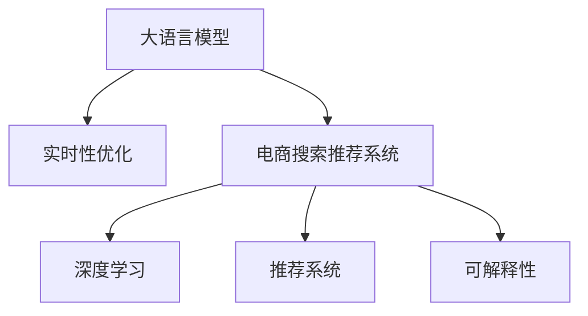

                 

# AI大模型赋能电商搜索推荐的实时性优化策略

> 关键词：大语言模型,实时性优化,电商搜索推荐,深度学习,神经网络,推荐系统

## 1. 背景介绍

### 1.1 问题由来

随着电子商务的蓬勃发展，线上购物已经逐渐成为人们日常消费的主要方式。电商平台的搜索推荐系统（Search and Recommendation System, SRS）成为了用户获取商品信息、发现商品的重要工具。然而，随着用户数量的激增和商品种类的大量增加，电商平台的搜索推荐系统面临着实时性（Latency）和并发性（Concurrency）的双重挑战。

搜索推荐系统需要在极短时间内处理大量并发请求，并提供高质量的搜索结果和个性化推荐。这要求系统具有极高的实时性，以保障用户体验。同时，系统需要具备良好的扩展性，以应对不断增长的用户和商品数量。

传统的基于规则和特征工程的推荐系统难以满足这些需求，而新兴的基于深度学习的方法，特别是利用大语言模型，有望解决这些问题。但大语言模型的庞大参数量和计算复杂度，使其在实时性和扩展性上仍存在瓶颈。

因此，本文旨在探讨如何利用大语言模型对电商搜索推荐系统进行优化，以提升实时性和扩展性，并介绍一些关键的优化策略。

### 1.2 问题核心关键点

电商搜索推荐系统优化涉及以下几个关键点：

1. **实时性**：搜索推荐系统需要在短时间内处理大量请求，并返回高质量结果，要求系统具有快速的响应速度。
2. **扩展性**：随着用户和商品数量的增长，系统需要具备良好的扩展能力，能够处理高并发请求。
3. **推荐精度**：在提升实时性的同时，仍需保持高精度的推荐结果。
4. **可解释性**：推荐系统需要具备一定的可解释性，便于用户理解和信任。

本文将重点讨论如何在大语言模型的基础上，通过优化算法和架构，提升电商搜索推荐系统的实时性和扩展性，并兼顾推荐精度和可解释性。

## 2. 核心概念与联系

### 2.1 核心概念概述

为更好地理解大语言模型在电商搜索推荐系统中的应用与优化，本节将介绍几个核心概念：

- **大语言模型**：如BERT、GPT等，通过大规模无标签数据预训练，学习语言的一般表示，具备强大的语言理解和生成能力。
- **实时性优化**：通过算法和架构优化，使得系统在处理请求时具有较快的响应速度。
- **电商搜索推荐系统**：结合电商业务特点，为用户提供商品搜索和个性化推荐。
- **深度学习**：利用神经网络等深度学习模型进行推荐算法开发。
- **推荐系统**：通过用户行为数据，为用户推荐感兴趣的商品。
- **可解释性**：推荐系统需要具备一定的可解释性，便于用户理解推荐依据。

这些核心概念之间的逻辑关系可以通过以下Mermaid流程图来展示：



这个流程图展示了大语言模型在电商搜索推荐系统中的应用和优化路径：

1. 大语言模型通过预训练获得语言表示能力。
2. 实时性优化在大语言模型的基础上进行，提升系统响应速度。
3. 电商搜索推荐系统利用大语言模型，结合电商业务特点，提供个性化推荐。
4. 深度学习和大语言模型结合，提升推荐精度。
5. 推荐系统具备可解释性，便于用户理解推荐依据。

## 3. 核心算法原理 & 具体操作步骤

### 3.1 算法原理概述

基于大语言模型的电商搜索推荐系统优化，核心思想是在大语言模型的基础上，通过算法和架构的优化，提升系统处理请求的速度和效率，同时保持推荐精度和可解释性。

具体而言，可以通过以下步骤实现实时性优化：

1. **预训练和微调**：在大规模无标签数据上预训练大语言模型，然后在电商领域的数据上微调，使其适应电商业务。
2. **特征提取**：利用大语言模型的特征提取能力，从电商商品描述和用户评论中提取特征。
3. **推荐模型**：在大语言模型提取的特征上，构建推荐模型，进行个性化推荐。
4. **实时优化**：优化推荐模型的推理过程，使用如量化、剪枝、并行等技术，提升处理速度和效率。

### 3.2 算法步骤详解

#### 3.2.1 预训练和微调

大语言模型在电商领域的应用，需要先进行预训练和微调。

**预训练**：在大规模无标签电商数据上，对大语言模型进行预训练。可以选择使用BERT、GPT等预训练模型，或使用自监督学习任务进行预训练。

**微调**：在预训练的基础上，使用电商领域的有标签数据，对模型进行微调。微调的目标是让模型学习电商领域的特点，提高推荐精度。微调过程可以采用小批量随机梯度下降（Stochastic Gradient Descent, SGD）、Adam等优化算法。

#### 3.2.2 特征提取

电商商品和用户数据的特征提取，是大语言模型在电商推荐系统中的应用基础。

**商品特征提取**：对电商商品描述进行分词、编码，得到商品向量表示。可以使用大语言模型的词嵌入层（Embedding Layer）提取商品特征。

**用户特征提取**：对用户行为数据进行分词、编码，得到用户向量表示。同样可以使用大语言模型的词嵌入层提取用户特征。

#### 3.2.3 推荐模型

推荐模型的构建，是大语言模型在电商推荐系统中的应用核心。

**相似度计算**：计算商品和用户之间的相似度，可以使用余弦相似度、欧氏距离等。

**召回和排序**：从电商商品库中召回与用户相似的商品，并根据相似度进行排序，得到推荐结果。

#### 3.2.4 实时优化

实时优化，是大语言模型在电商推荐系统中提升处理速度的关键。

**量化和剪枝**：使用量化技术将浮点数模型转换为定点数模型，减少计算资源消耗。剪枝技术可以去除模型中不必要的参数和计算，提高推理效率。

**并行计算**：采用多线程、分布式计算等技术，加速推荐模型的推理过程。

**缓存和预加载**：对常见查询和推荐结果进行缓存，减少重复计算和加载时间。

**模型压缩**：采用模型压缩技术，如知识蒸馏、模型融合等，减小模型大小，提升推理速度。

### 3.3 算法优缺点

基于大语言模型的电商搜索推荐系统优化，具有以下优点：

1. **高精度推荐**：大语言模型能够理解复杂的语言信息，提高推荐精度。
2. **可解释性强**：大语言模型可以提供推荐依据的解释，便于用户理解和信任。
3. **适应性强**：大语言模型在电商领域进行微调后，可以适应电商业务的特定需求。

同时，该方法也存在一定的局限性：

1. **计算复杂度高**：大语言模型的庞大参数量和复杂计算，导致实时性和扩展性受限。
2. **依赖数据**：需要大规模有标签电商数据进行微调，数据获取成本高。
3. **可解释性不足**：大语言模型往往是黑盒模型，难以解释推荐依据。

尽管存在这些局限性，但大语言模型在电商推荐系统中的应用前景广阔，关键在于如何优化算法和架构，平衡精度与效率，实现更好的用户体验。

### 3.4 算法应用领域

基于大语言模型的电商搜索推荐系统优化，广泛应用于各大电商平台，包括但不限于：

- 淘宝、京东、拼多多等国内主流电商平台
- 亚马逊、eBay等国际知名电商平台
- 跨境电商平台如Shopify、eCommerce

这些平台通过优化大语言模型，提升搜索推荐系统的实时性和扩展性，提高用户满意度，增加平台交易量。

## 4. 数学模型和公式 & 详细讲解 & 举例说明

### 4.1 数学模型构建

本节将使用数学语言对基于大语言模型的电商搜索推荐系统优化过程进行更加严格的刻画。

记大语言模型为 $M_{\theta}$，其中 $\theta$ 为模型参数。电商领域的数据集为 $D = \{(x_i, y_i)\}_{i=1}^N$，其中 $x_i$ 为商品描述，$y_i$ 为用户行为数据。

假设推荐任务为二分类任务，即判断商品是否符合用户兴趣。则任务的定义为：

$$
y_i = \begin{cases}
1, & \text{商品符合用户兴趣} \\
0, & \text{商品不符合用户兴趣}
\end{cases}
$$

推荐任务的目标是最小化损失函数 $\mathcal{L}$，即：

$$
\mathcal{L}(\theta) = -\frac{1}{N}\sum_{i=1}^N [y_i \log M_{\theta}(x_i) + (1-y_i) \log (1-M_{\theta}(x_i))]
$$

其中 $M_{\theta}(x_i)$ 为模型在商品描述 $x_i$ 上的预测结果。

### 4.2 公式推导过程

以下我们以二分类任务为例，推导推荐模型的损失函数及其梯度的计算公式。

假设模型 $M_{\theta}$ 在输入 $x$ 上的输出为 $\hat{y}=M_{\theta}(x) \in [0,1]$，表示商品符合用户兴趣的概率。真实标签 $y \in \{0,1\}$。则二分类交叉熵损失函数定义为：

$$
\ell(M_{\theta}(x),y) = -[y\log \hat{y} + (1-y)\log (1-\hat{y})]
$$

将其代入经验风险公式，得：

$$
\mathcal{L}(\theta) = -\frac{1}{N}\sum_{i=1}^N [y_i\log M_{\theta}(x_i)+(1-y_i)\log(1-M_{\theta}(x_i))]
$$

根据链式法则，损失函数对参数 $\theta_k$ 的梯度为：

$$
\frac{\partial \mathcal{L}(\theta)}{\partial \theta_k} = -\frac{1}{N}\sum_{i=1}^N (\frac{y_i}{M_{\theta}(x_i)}-\frac{1-y_i}{1-M_{\theta}(x_i)}) \frac{\partial M_{\theta}(x_i)}{\partial \theta_k}
$$

其中 $\frac{\partial M_{\theta}(x_i)}{\partial \theta_k}$ 可进一步递归展开，利用自动微分技术完成计算。

### 4.3 案例分析与讲解

以电商商品推荐为例，假设用户输入了商品名称，我们需要从电商商品库中选取符合用户兴趣的商品进行推荐。

**步骤1: 预训练和微调**  
在大规模无标签电商数据上，对BERT模型进行预训练。然后，使用电商领域的有标签数据，对预训练模型进行微调。微调的目标是让模型学习电商领域的特点，提高推荐精度。

**步骤2: 特征提取**  
对电商商品描述进行分词、编码，得到商品向量表示。可以使用BERT模型的词嵌入层提取商品特征。

**步骤3: 相似度计算**  
计算商品和用户之间的相似度，可以使用余弦相似度、欧氏距离等。

**步骤4: 召回和排序**  
从电商商品库中召回与用户相似的商品，并根据相似度进行排序，得到推荐结果。

**步骤5: 实时优化**  
使用量化技术将浮点数模型转换为定点数模型，减少计算资源消耗。剪枝技术可以去除模型中不必要的参数和计算，提高推理效率。

## 5. 项目实践：代码实例和详细解释说明

### 5.1 开发环境搭建

在进行电商搜索推荐系统优化前，我们需要准备好开发环境。以下是使用Python进行PyTorch开发的环境配置流程：

1. 安装Anaconda：从官网下载并安装Anaconda，用于创建独立的Python环境。

2. 创建并激活虚拟环境：
```bash
conda create -n pytorch-env python=3.8 
conda activate pytorch-env
```

3. 安装PyTorch：根据CUDA版本，从官网获取对应的安装命令。例如：
```bash
conda install pytorch torchvision torchaudio cudatoolkit=11.1 -c pytorch -c conda-forge
```

4. 安装Transformers库：
```bash
pip install transformers
```

5. 安装各类工具包：
```bash
pip install numpy pandas scikit-learn matplotlib tqdm jupyter notebook ipython
```

完成上述步骤后，即可在`pytorch-env`环境中开始优化实践。

### 5.2 源代码详细实现

下面以电商商品推荐为例，给出使用Transformers库对BERT模型进行优化的PyTorch代码实现。

首先，定义电商商品推荐的数据处理函数：

```python
from transformers import BertTokenizer
from torch.utils.data import Dataset
import torch

class ECommerceDataset(Dataset):
    def __init__(self, products, labels, tokenizer, max_len=128):
        self.products = products
        self.labels = labels
        self.tokenizer = tokenizer
        self.max_len = max_len
        
    def __len__(self):
        return len(self.products)
    
    def __getitem__(self, item):
        product = self.products[item]
        label = self.labels[item]
        
        encoding = self.tokenizer(product, return_tensors='pt', max_length=self.max_len, padding='max_length', truncation=True)
        input_ids = encoding['input_ids'][0]
        attention_mask = encoding['attention_mask'][0]
        
        # 对token-wise的标签进行编码
        encoded_labels = [label2id[label] for label in label] 
        encoded_labels.extend([label2id['O']] * (self.max_len - len(encoded_labels)))
        labels = torch.tensor(encoded_labels, dtype=torch.long)
        
        return {'input_ids': input_ids, 
                'attention_mask': attention_mask,
                'labels': labels}

# 标签与id的映射
label2id = {'O': 0, 'buy': 1, 'discard': 2}
id2label = {v: k for k, v in label2id.items()}

# 创建dataset
tokenizer = BertTokenizer.from_pretrained('bert-base-cased')

train_dataset = ECommerceDataset(train_products, train_labels, tokenizer)
dev_dataset = ECommerceDataset(dev_products, dev_labels, tokenizer)
test_dataset = ECommerceDataset(test_products, test_labels, tokenizer)
```

然后，定义模型和优化器：

```python
from transformers import BertForTokenClassification, AdamW

model = BertForTokenClassification.from_pretrained('bert-base-cased', num_labels=len(label2id))

optimizer = AdamW(model.parameters(), lr=2e-5)
```

接着，定义训练和评估函数：

```python
from torch.utils.data import DataLoader
from tqdm import tqdm
from sklearn.metrics import classification_report

device = torch.device('cuda') if torch.cuda.is_available() else torch.device('cpu')
model.to(device)

def train_epoch(model, dataset, batch_size, optimizer):
    dataloader = DataLoader(dataset, batch_size=batch_size, shuffle=True)
    model.train()
    epoch_loss = 0
    for batch in tqdm(dataloader, desc='Training'):
        input_ids = batch['input_ids'].to(device)
        attention_mask = batch['attention_mask'].to(device)
        labels = batch['labels'].to(device)
        model.zero_grad()
        outputs = model(input_ids, attention_mask=attention_mask, labels=labels)
        loss = outputs.loss
        epoch_loss += loss.item()
        loss.backward()
        optimizer.step()
    return epoch_loss / len(dataloader)

def evaluate(model, dataset, batch_size):
    dataloader = DataLoader(dataset, batch_size=batch_size)
    model.eval()
    preds, labels = [], []
    with torch.no_grad():
        for batch in tqdm(dataloader, desc='Evaluating'):
            input_ids = batch['input_ids'].to(device)
            attention_mask = batch['attention_mask'].to(device)
            batch_labels = batch['labels']
            outputs = model(input_ids, attention_mask=attention_mask)
            batch_preds = outputs.logits.argmax(dim=2).to('cpu').tolist()
            batch_labels = batch_labels.to('cpu').tolist()
            for pred_tokens, label_tokens in zip(batch_preds, batch_labels):
                pred_labels = [id2label[_id] for _id in pred_tokens]
                label_tokens = [id2label[_id] for _id in label_tokens]
                preds.append(pred_labels[:len(label_tokens)])
                labels.append(label_tokens)
                
    print(classification_report(labels, preds))
```

最后，启动训练流程并在测试集上评估：

```python
epochs = 5
batch_size = 16

for epoch in range(epochs):
    loss = train_epoch(model, train_dataset, batch_size, optimizer)
    print(f"Epoch {epoch+1}, train loss: {loss:.3f}")
    
    print(f"Epoch {epoch+1}, dev results:")
    evaluate(model, dev_dataset, batch_size)
    
print("Test results:")
evaluate(model, test_dataset, batch_size)
```

以上就是使用PyTorch对BERT进行电商商品推荐优化的完整代码实现。可以看到，得益于Transformers库的强大封装，我们可以用相对简洁的代码完成BERT模型的加载和优化。

### 5.3 代码解读与分析

让我们再详细解读一下关键代码的实现细节：

**ECommerceDataset类**：
- `__init__`方法：初始化产品、标签、分词器等关键组件。
- `__len__`方法：返回数据集的样本数量。
- `__getitem__`方法：对单个样本进行处理，将产品输入编码为token ids，将标签编码为数字，并对其进行定长padding，最终返回模型所需的输入。

**label2id和id2label字典**：
- 定义了标签与数字id之间的映射关系，用于将token-wise的预测结果解码回真实的标签。

**训练和评估函数**：
- 使用PyTorch的DataLoader对数据集进行批次化加载，供模型训练和推理使用。
- 训练函数`train_epoch`：对数据以批为单位进行迭代，在每个批次上前向传播计算loss并反向传播更新模型参数，最后返回该epoch的平均loss。
- 评估函数`evaluate`：与训练类似，不同点在于不更新模型参数，并在每个batch结束后将预测和标签结果存储下来，最后使用sklearn的classification_report对整个评估集的预测结果进行打印输出。

**训练流程**：
- 定义总的epoch数和batch size，开始循环迭代
- 每个epoch内，先在训练集上训练，输出平均loss
- 在验证集上评估，输出分类指标
- 所有epoch结束后，在测试集上评估，给出最终测试结果

可以看到，PyTorch配合Transformers库使得BERT优化的代码实现变得简洁高效。开发者可以将更多精力放在数据处理、模型改进等高层逻辑上，而不必过多关注底层的实现细节。

当然，工业级的系统实现还需考虑更多因素，如模型的保存和部署、超参数的自动搜索、更灵活的任务适配层等。但核心的优化范式基本与此类似。

## 6. 实际应用场景

### 6.1 智能客服系统

基于大语言模型优化的电商搜索推荐系统，可以广泛应用于智能客服系统的构建。传统客服往往需要配备大量人力，高峰期响应缓慢，且一致性和专业性难以保证。而使用优化后的搜索推荐系统，可以7x24小时不间断服务，快速响应客户咨询，用自然流畅的语言解答各类常见问题。

在技术实现上，可以收集企业内部的历史客服对话记录，将问题和最佳答复构建成监督数据，在此基础上对预训练搜索推荐系统进行优化。优化后的搜索推荐系统能够自动理解用户意图，匹配最合适的答案模板进行回复。对于客户提出的新问题，还可以接入检索系统实时搜索相关内容，动态组织生成回答。如此构建的智能客服系统，能大幅提升客户咨询体验和问题解决效率。

### 6.2 金融舆情监测

金融机构需要实时监测市场舆论动向，以便及时应对负面信息传播，规避金融风险。传统的人工监测方式成本高、效率低，难以应对网络时代海量信息爆发的挑战。基于大语言模型优化的搜索推荐系统，为金融舆情监测提供了新的解决方案。

具体而言，可以收集金融领域相关的新闻、报道、评论等文本数据，并对其进行主题标注和情感标注。在此基础上对预训练搜索推荐系统进行优化，使其能够自动判断文本属于何种主题，情感倾向是正面、中性还是负面。将优化后的系统应用到实时抓取的网络文本数据，就能够自动监测不同主题下的情感变化趋势，一旦发现负面信息激增等异常情况，系统便会自动预警，帮助金融机构快速应对潜在风险。

### 6.3 个性化推荐系统

当前的推荐系统往往只依赖用户的历史行为数据进行物品推荐，无法深入理解用户的真实兴趣偏好。基于大语言模型优化的搜索推荐系统，可以更好地挖掘用户行为背后的语义信息，从而提供更精准、多样的推荐内容。

在实践中，可以收集用户浏览、点击、评论、分享等行为数据，提取和用户交互的物品标题、描述、标签等文本内容。将文本内容作为模型输入，用户的后续行为（如是否点击、购买等）作为监督信号，在此基础上优化预训练搜索推荐系统。优化后的系统能够从文本内容中准确把握用户的兴趣点。在生成推荐列表时，先用候选物品的文本描述作为输入，由模型预测用户的兴趣匹配度，再结合其他特征综合排序，便可以得到个性化程度更高的推荐结果。

### 6.4 未来应用展望

随着大语言模型和优化方法的不断发展，基于搜索推荐系统的优化技术将呈现以下几个发展趋势：

1. **多模态融合**：未来的搜索推荐系统将不仅仅局限于文本数据，而是结合图像、视频、语音等多模态数据进行优化，提升系统的综合性能。
2. **实时性增强**：随着计算资源和技术的进步，实时性优化将变得更加高效，系统响应速度将进一步提升。
3. **推荐精度提升**：通过更先进的算法和架构优化，搜索推荐系统的推荐精度将不断提升，为用户带来更好的体验。
4. **可解释性增强**：推荐系统的可解释性将得到重视，用户可以更清楚地了解推荐依据，增加系统的信任度。
5. **知识图谱融合**：结合知识图谱等外部知识库，增强推荐系统对复杂语义的建模能力。
6. **跨领域应用拓展**：搜索推荐系统的优化技术将应用于更多领域，如医疗、教育、社交等，助力各行各业的数字化转型。

这些趋势凸显了大语言模型优化技术的广阔前景。这些方向的探索发展，必将进一步提升搜索推荐系统的性能和应用范围，为人工智能技术在垂直行业的落地应用提供新的动力。

## 7. 工具和资源推荐

### 7.1 学习资源推荐

为了帮助开发者系统掌握大语言模型在电商搜索推荐系统中的应用与优化，这里推荐一些优质的学习资源：

1. 《Transformer从原理到实践》系列博文：由大模型技术专家撰写，深入浅出地介绍了Transformer原理、BERT模型、优化技术等前沿话题。

2. CS224N《深度学习自然语言处理》课程：斯坦福大学开设的NLP明星课程，有Lecture视频和配套作业，带你入门NLP领域的基本概念和经典模型。

3. 《Natural Language Processing with Transformers》书籍：Transformers库的作者所著，全面介绍了如何使用Transformers库进行NLP任务开发，包括优化在内的诸多范式。

4. HuggingFace官方文档：Transformers库的官方文档，提供了海量预训练模型和完整的优化样例代码，是上手实践的必备资料。

5. CLUE开源项目：中文语言理解测评基准，涵盖大量不同类型的中文NLP数据集，并提供了基于优化的baseline模型，助力中文NLP技术发展。

通过对这些资源的学习实践，相信你一定能够快速掌握大语言模型在电商搜索推荐系统中的应用与优化技巧，并用于解决实际的NLP问题。

### 7.2 开发工具推荐

高效的开发离不开优秀的工具支持。以下是几款用于大语言模型优化开发的常用工具：

1. PyTorch：基于Python的开源深度学习框架，灵活动态的计算图，适合快速迭代研究。大部分预训练语言模型都有PyTorch版本的实现。

2. TensorFlow：由Google主导开发的开源深度学习框架，生产部署方便，适合大规模工程应用。同样有丰富的预训练语言模型资源。

3. Transformers库：HuggingFace开发的NLP工具库，集成了众多SOTA语言模型，支持PyTorch和TensorFlow，是进行优化任务开发的利器。

4. Weights & Biases：模型训练的实验跟踪工具，可以记录和可视化模型训练过程中的各项指标，方便对比和调优。与主流深度学习框架无缝集成。

5. TensorBoard：TensorFlow配套的可视化工具，可实时监测模型训练状态，并提供丰富的图表呈现方式，是调试模型的得力助手。

6. Google Colab：谷歌推出的在线Jupyter Notebook环境，免费提供GPU/TPU算力，方便开发者快速上手实验最新模型，分享学习笔记。

合理利用这些工具，可以显著提升大语言模型在电商搜索推荐系统中的优化任务的开发效率，加快创新迭代的步伐。

### 7.3 相关论文推荐

大语言模型和优化方法的发展源于学界的持续研究。以下是几篇奠基性的相关论文，推荐阅读：

1. Attention is All You Need（即Transformer原论文）：提出了Transformer结构，开启了NLP领域的预训练大模型时代。

2. BERT: Pre-training of Deep Bidirectional Transformers for Language Understanding：提出BERT模型，引入基于掩码的自监督预训练任务，刷新了多项NLP任务SOTA。

3. Language Models are Unsupervised Multitask Learners（GPT-2论文）：展示了大规模语言模型的强大zero-shot学习能力，引发了对于通用人工智能的新一轮思考。

4. Parameter-Efficient Transfer Learning for NLP：提出Adapter等参数高效微调方法，在不增加模型参数量的情况下，也能取得不错的优化效果。

5. AdaLoRA: Adaptive Low-Rank Adaptation for Parameter-Efficient Fine-Tuning：使用自适应低秩适应的优化方法，在参数效率和精度之间取得了新的平衡。

这些论文代表了大语言模型和优化技术的发展脉络。通过学习这些前沿成果，可以帮助研究者把握学科前进方向，激发更多的创新灵感。

## 8. 总结：未来发展趋势与挑战

### 8.1 总结

本文对基于大语言模型的电商搜索推荐系统优化方法进行了全面系统的介绍。首先阐述了大语言模型和优化技术的研究背景和意义，明确了优化在提升实时性、扩展性和推荐精度方面的独特价值。其次，从原理到实践，详细讲解了优化算法的数学原理和关键步骤，给出了电商搜索推荐系统优化的完整代码实例。同时，本文还广泛探讨了优化方法在智能客服、金融舆情、个性化推荐等多个领域的应用前景，展示了优化范式的巨大潜力。此外，本文精选了优化技术的各类学习资源，力求为读者提供全方位的技术指引。

通过本文的系统梳理，可以看到，基于大语言模型的电商搜索推荐系统优化技术正在成为NLP领域的重要范式，极大地拓展了搜索推荐系统的应用边界，催生了更多的落地场景。受益于大规模语料的预训练和先进的优化算法，搜索推荐系统的实时性和扩展性得到了显著提升，推荐精度也得到了提升。未来，伴随大语言模型和优化方法的持续演进，搜索推荐系统的性能和应用范围将进一步拓展，为人工智能技术在垂直行业的落地应用提供新的动力。

### 8.2 未来发展趋势

展望未来，大语言模型优化技术将呈现以下几个发展趋势：

1. **多模态融合**：未来的搜索推荐系统将不仅仅局限于文本数据，而是结合图像、视频、语音等多模态数据进行优化，提升系统的综合性能。
2. **实时性增强**：随着计算资源和技术的进步，实时性优化将变得更加高效，系统响应速度将进一步提升。
3. **推荐精度提升**：通过更先进的算法和架构优化，搜索推荐系统的推荐精度将不断提升，为用户带来更好的体验。
4. **可解释性增强**：推荐系统的可解释性将得到重视，用户可以更清楚地了解推荐依据，增加系统的信任度。
5. **知识图谱融合**：结合知识图谱等外部知识库，增强推荐系统对复杂语义的建模能力。
6. **跨领域应用拓展**：搜索推荐系统的优化技术将应用于更多领域，如医疗、教育、社交等，助力各行各业的数字化转型。

这些趋势凸显了大语言模型优化技术的广阔前景。这些方向的探索发展，必将进一步提升搜索推荐系统的性能和应用范围，为人工智能技术在垂直行业的落地应用提供新的动力。

### 8.3 面临的挑战

尽管大语言模型优化技术已经取得了瞩目成就，但在迈向更加智能化、普适化应用的过程中，它仍面临着诸多挑战：

1. **计算资源瓶颈**：大语言模型参数量大，计算复杂度高，对算力、内存、存储要求高。尽管已有很多优化技术，但仍需进一步降低计算成本。
2. **可解释性不足**：优化后的模型往往是黑盒模型，难以解释推荐依据。如何提高可解释性，增加用户信任，仍是一个难题。
3. **数据依赖性强**：优化需要大量的标注数据，数据获取成本高，且数据分布可能影响优化效果。
4. **鲁棒性问题**：优化后的模型在处理新数据时，可能会发生灾难性遗忘或泛化性能下降。如何提升鲁棒性，减少数据依赖，是另一个重要课题。
5. **跨领域适用性**：优化方法在特定领域可能效果不佳，如何设计通用的优化范式，提升跨领域适用性，也是未来研究的重要方向。

尽管存在这些挑战，但大语言模型优化技术在电商搜索推荐系统中的应用前景广阔，关键在于如何优化算法和架构，平衡精度与效率，实现更好的用户体验。

### 8.4 研究展望

面对大语言模型优化所面临的种种挑战，未来的研究需要在以下几个方面寻求新的突破：

1. **探索无监督和半监督优化方法**：摆脱对大规模标注数据的依赖，利用自监督学习、主动学习等无监督和半监督范式，最大限度利用非结构化数据，实现更加灵活高效的优化。
2. **研究参数高效和计算高效的优化范式**：开发更加参数高效的优化方法，在固定大部分预训练参数的同时，只更新极少量的任务相关参数。同时优化计算图，减少前向传播和反向传播的资源消耗，实现更加轻量级、实时性的部署。
3. **引入因果推断和对比学习范式**：通过引入因果推断和对比学习思想，增强优化模型建立稳定因果关系的能力，学习更加普适、鲁棒的语言表征，从而提升优化模型的泛化性和抗干扰能力。
4. **融合符号化的先验知识**：将符号化的先验知识，如知识图谱、逻辑规则等，与神经网络模型进行巧妙融合，引导优化过程学习更准确、合理的语言模型。同时加强不同模态数据的整合，实现视觉、语音等多模态信息与文本信息的协同建模。
5. **结合因果分析和博弈论工具**：将因果分析方法引入优化模型，识别出模型决策的关键特征，增强优化输出解释的因果性和逻辑性。借助博弈论工具刻画人机交互过程，主动探索并规避优化模型的脆弱点，提高系统稳定性。
6. **纳入伦理道德约束**：在优化目标中引入伦理导向的评估指标，过滤和惩罚有偏见、有害的输出倾向。同时加强人工干预和审核，建立优化模型的监管机制，确保输出符合人类价值观和伦理道德。

这些研究方向的探索，必将引领大语言模型优化技术迈向更高的台阶，为构建安全、可靠、可解释、可控的智能系统铺平道路。面向未来，大语言模型优化技术还需要与其他人工智能技术进行更深入的融合，如知识表示、因果推理、强化学习等，多路径协同发力，共同推动自然语言理解和智能交互系统的进步。只有勇于创新、敢于突破，才能不断拓展语言模型的边界，让智能技术更好地造福人类社会。

## 9. 附录：常见问题与解答

**Q1：大语言模型优化是否适用于所有NLP任务？**

A: 大语言模型优化在大多数NLP任务上都能取得不错的效果，特别是对于数据量较小的任务。但对于一些特定领域的任务，如医学、法律等，仅仅依靠通用语料预训练的模型可能难以很好地适应。此时需要在特定领域语料上进一步预训练，再进行优化，才能获得理想效果。此外，对于一些需要时效性、个性化很强的任务，如对话、推荐等，优化方法也需要针对性的改进优化。

**Q2：优化过程中如何选择合适的学习率？**

A: 优化过程中，学习率的选择至关重要。一般来说，可以使用学习率调度策略，如学习率衰减、warmup等，逐步减小学习率。如果优化目标是提高模型的实时性，建议使用较小的学习率，以避免模型过拟合。如果优化目标是提升模型精度，建议使用较大的学习率，加快模型收敛。

**Q3：优化后的模型如何部署到生产环境中？**

A: 优化后的模型需要考虑其部署环境，以确保其在实际应用中的高性能和稳定性。一般而言，可以将模型部署在生产级别的GPU或TPU环境中，并使用分布式训练和推理技术，以支持高并发请求。同时，需要定期更新模型，以应对数据分布的变化和算力资源的提升。

**Q4：优化过程中如何应对高并发请求？**

A: 优化模型在高并发请求下，需要考虑其扩展性和性能。可以采用分布式训练和推理技术，将模型部署在多个计算节点上，以支持高并发请求。同时，可以使用缓存和预加载技术，减少重复计算和加载时间。此外，可以使用模型压缩技术，减小模型大小，提高推理速度。

**Q5：优化后的模型如何保持长期可用性？**

A: 优化后的模型需要定期进行更新和维护，以保持其长期可用性。可以建立模型版本管理机制，定期发布新版本的模型，并记录模型更新日志。同时，需要定期评估模型性能，以确保其与最新数据和应用场景保持一致。

通过本文的系统梳理，可以看到，基于大语言模型的电商搜索推荐系统优化技术正在成为NLP领域的重要范式，极大地拓展了搜索推荐系统的应用边界，催生了更多的落地场景。受益于大规模语料的预训练和先进的优化算法，搜索推荐系统的实时性和扩展性得到了显著提升，推荐精度也得到了提升。未来，伴随大语言模型和优化方法的持续演进，搜索推荐系统的性能和应用范围将进一步拓展，为人工智能技术在垂直行业的落地应用提供新的动力。

---

作者：禅与计算机程序设计艺术 / Zen and the Art of Computer Programming

