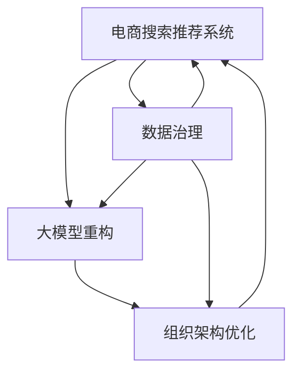

                 

# AI大模型重构电商搜索推荐的数据治理组织架构优化方案

> 关键词：电商搜索推荐,数据治理,组织架构优化,大模型重构

## 1. 背景介绍

### 1.1 问题由来
近年来，电商搜索推荐系统在提升用户体验、增加平台转化率等方面取得了显著成效。然而，随着电商行业的快速发展，用户需求日趋复杂多样，推荐系统的个性化需求也随之增加，带来了严峻的算法和数据治理挑战。数据治理和大模型重构成为电商搜索推荐系统优化的关键环节。

数据治理旨在确保数据质量、规范数据使用，从而保障推荐系统输出结果的可靠性。大模型重构则通过引入先进的AI大模型，提升推荐系统的精确度和个性化水平，为电商业务带来新的增长点。

尽管如此，当前电商搜索推荐系统在数据治理和大模型重构上仍存在以下问题：
- 数据质量不高，标签不完整，数据孤岛问题严重。
- 数据治理流程复杂，标准化规范不够，效率低下。
- 大模型重构过于依赖人工调参，模型效果难以保证。
- 组织架构分散，跨部门协作困难，数据孤岛问题难以解决。

为了应对这些挑战，本文提出了一套基于大模型重构的电商搜索推荐系统数据治理组织架构优化方案，旨在通过合理的组织架构和治理流程，有效整合数据资源，提升数据质量和AI大模型的应用效果，从而实现电商搜索推荐系统的智能化升级。

### 1.2 问题核心关键点
本方案的核心在于：
- 构建集中化的数据治理组织架构，确保数据治理的高效性和一致性。
- 引入大模型重构技术，提升推荐系统的个性化和精准度。
- 优化数据治理流程，提升数据质量，确保大模型的有效性。

## 2. 核心概念与联系

### 2.1 核心概念概述

为更好地理解本方案，本节将介绍几个关键概念：

- 电商搜索推荐系统：基于用户的搜索和浏览行为，通过算法为用户推荐商品的系统。
- 数据治理：对数据进行采集、存储、管理和使用的规范化和标准化过程，旨在提高数据质量、保障数据安全和合规性。
- 大模型重构：通过引入先进的AI大模型，提升推荐系统的精确度和个性化水平，从而增强用户体验和业务价值。
- 组织架构优化：通过优化公司内部组织结构，提高跨部门协作效率，提升整体业务运营能力。
- 技术栈：涉及电商搜索推荐系统开发和运行的技术体系，包括机器学习、自然语言处理、大数据处理等。

这些概念之间的逻辑关系可以通过以下Mermaid流程图来展示：



这个流程图展示了大模型重构的电商搜索推荐系统数据治理组织架构优化的核心概念及其之间的关系：

1. 电商搜索推荐系统通过数据治理和大模型重构提升推荐质量。
2. 数据治理和组织架构优化为电商搜索推荐系统提供保障。
3. 大模型重构通过引入AI大模型提升推荐系统的效果。
4. 组织架构优化保障跨部门协作，实现数据高效治理。

这些概念共同构成了电商搜索推荐系统数据治理和大模型重构的基本框架，使得系统能够高效、智能地运行。

## 3. 核心算法原理 & 具体操作步骤
### 3.1 算法原理概述

本方案的核心思想是通过数据治理和大模型重构技术，提升电商搜索推荐系统的推荐效果和用户体验。

在数据治理方面，通过构建集中化的数据治理组织架构，确保数据质量的一致性和可靠性。在数据采集、清洗、存储、处理等各个环节，采用标准化的流程和规范，提升数据治理的效率和效果。

在大模型重构方面，引入先进的AI大模型，如BERT、GPT等，通过迁移学习和微调等技术，提升推荐系统的精确度和个性化水平，从而增强用户体验和业务价值。

### 3.2 算法步骤详解

本方案的数据治理和大模型重构主要包括以下几个步骤：

**Step 1: 构建集中化的数据治理架构**
- 成立数据治理委员会，负责数据治理的顶层设计和规范制定。
- 设立数据治理团队，负责数据采集、清洗、存储、处理等日常工作。
- 制定统一的数据标准和规范，确保数据治理的一致性和标准化。

**Step 2: 实施数据治理流程**
- 建立数据采集规范，确保数据来源的可靠性和完整性。
- 进行数据清洗，去除重复、不准确、不完整的数据。
- 采用数据仓库或大数据平台进行数据存储和处理，确保数据的可追溯性和一致性。
- 实施数据质量监控，定期检查数据质量，发现问题及时处理。

**Step 3: 引入大模型重构技术**
- 选择合适的预训练语言模型，如BERT、GPT等，作为初始化参数。
- 收集电商搜索推荐系统的历史推荐数据，标注数据标签。
- 在大模型上进行微调，适配电商搜索推荐系统的推荐任务。
- 引入参数高效微调、提示学习等技术，提升模型性能。

**Step 4: 优化组织架构**
- 成立跨部门的数据治理团队，包括数据治理、技术开发、产品运营等人员。
- 设立数据治理委员会，制定数据治理的方针和策略。
- 设计扁平化的组织架构，提高跨部门协作效率。

**Step 5: 持续改进和评估**
- 定期评估数据治理和大模型重构的效果，通过A/B测试等方式进行效果对比。
- 收集用户反馈，持续优化推荐系统，提升用户体验。
- 引入自动化工具，提高数据治理和大模型重构的效率。

### 3.3 算法优缺点

本方案的数据治理和大模型重构具有以下优点：
1. 提升数据质量。通过集中化的数据治理架构，确保数据的一致性和可靠性。
2. 提升推荐效果。引入大模型重构技术，提升推荐系统的精确度和个性化水平。
3. 提高跨部门协作效率。通过扁平化的组织架构，实现跨部门的高效协作。
4. 提升整体业务运营能力。通过标准化的数据治理流程，提高电商搜索推荐系统的运营效率。

同时，本方案也存在一定的局限性：
1. 数据治理初期投入较大，需要一定的资源和时间成本。
2. 大模型重构对硬件资源要求较高，需要足够的算力和存储资源。
3. 组织架构优化可能需要跨部门协调，短期内难以实现。
4. 持续改进和评估需要长期投入，需不断优化数据治理流程。

尽管存在这些局限性，但就目前而言，本方案提出的集中化数据治理和大模型重构方法仍是大模型重构电商搜索推荐系统的有效方案。未来相关研究的重点在于如何进一步降低数据治理的初期成本，提高大模型的微调效率，同时兼顾跨部门协作和持续改进。

### 3.4 算法应用领域

本方案在电商搜索推荐系统的数据治理和大模型重构领域具有广泛的应用前景，具体包括：

- 个性化推荐：通过引入大模型重构技术，提升推荐系统的个性化和精准度，增强用户体验。
- 商品搜索：通过数据治理，确保商品信息的完整性和准确性，提升搜索效果。
- 用户画像：通过数据治理，收集和整合用户行为数据，构建全面的用户画像，提升个性化推荐。
- 广告投放：通过数据治理，确保广告投放数据的准确性和可靠性，提升广告投放效果。

除了上述这些核心应用外，本方案还适用于更多场景，如电商数据分析、客户管理等，为电商业务带来更多的智能化升级。

## 4. 数学模型和公式 & 详细讲解  
### 4.1 数学模型构建

本节将使用数学语言对数据治理和大模型重构的优化方案进行更加严格的刻画。

记电商搜索推荐系统为 $S$，数据治理流程为 $D$，大模型重构为 $M$。假设电商搜索推荐系统的推荐任务为 $T$，历史推荐数据为 $D_h$，用户行为数据为 $D_u$。

定义电商搜索推荐系统的损失函数为 $\ell(S)$，用于衡量推荐效果与用户满意度之间的差距。在数据治理流程 $D$ 下，历史推荐数据 $D_h$ 和用户行为数据 $D_u$ 都经过规范和处理，最终用于大模型重构 $M$。

### 4.2 公式推导过程

在电商搜索推荐系统的数据治理流程中，首先需要进行数据采集和清洗，去除噪声和错误数据。假设采集到的数据为 $D_a$，经过清洗后的数据为 $D_c$，则数据治理的流程可以表示为：

$$
D_c = f(D_a)
$$

其中 $f$ 表示数据清洗函数，去除噪声和错误数据，确保数据的完整性和准确性。

在进行数据治理后，需要建立数据标准和规范，确保数据的一致性。假设数据标准和规范为 $S_D$，则数据治理的目标可以表示为：

$$
D_c \in S_D
$$

在大模型重构方面，需要选择合适的预训练语言模型，如BERT、GPT等，作为初始化参数。假设预训练语言模型为 $M_{\theta_0}$，其中 $\theta_0$ 为预训练得到的模型参数。通过在电商搜索推荐系统的推荐任务 $T$ 上微调 $M_{\theta_0}$，得到微调后的模型参数 $\theta$。

微调的损失函数可以表示为：

$$
\mathcal{L}(\theta) = \frac{1}{N}\sum_{i=1}^N \ell(S(x_i), \hat{y}_i)
$$

其中 $N$ 表示样本数量，$x_i$ 表示输入数据，$\hat{y}_i$ 表示模型的预测输出，$\ell$ 表示推荐效果与用户满意度之间的差距。

微调的优化目标是最小化损失函数，即找到最优参数：

$$
\theta^* = \mathop{\arg\min}_{\theta} \mathcal{L}(\theta)
$$

在得到微调后的模型参数 $\theta^*$ 后，将其应用到电商搜索推荐系统中，即可提升推荐系统的效果。

### 4.3 案例分析与讲解

为了更好地理解本方案的数学模型和公式推导过程，以下以推荐系统中的协同过滤算法为例，进行详细讲解。

假设电商搜索推荐系统的推荐任务为协同过滤推荐，即通过用户行为数据 $D_u$ 和历史推荐数据 $D_h$，预测用户对未购买商品 $x$ 的评分 $y$。

协同过滤算法的数学模型可以表示为：

$$
y = f_k(x, D_u, D_h)
$$

其中 $f_k$ 表示协同过滤算法的预测函数，$D_u$ 表示用户行为数据，$D_h$ 表示历史推荐数据。

在数据治理方面，需要确保 $D_u$ 和 $D_h$ 的完整性和准确性，通过数据清洗和标准化，去除噪声和错误数据。例如，可以对用户行为数据进行归一化处理，确保不同用户的行为数据具有可比性。

在大模型重构方面，可以通过引入BERT等预训练语言模型，对协同过滤算法进行微调。具体步骤如下：
1. 收集电商搜索推荐系统的历史推荐数据 $D_h$，标注数据标签。
2. 在大模型上进行微调，适配协同过滤推荐任务。
3. 引入参数高效微调、提示学习等技术，提升模型性能。

通过数据治理和大模型重构，可以有效提升电商搜索推荐系统的推荐效果，增强用户体验和业务价值。

## 5. 项目实践：代码实例和详细解释说明
### 5.1 开发环境搭建

在进行数据治理和大模型重构实践前，我们需要准备好开发环境。以下是使用Python进行PyTorch开发的环境配置流程：

1. 安装Anaconda：从官网下载并安装Anaconda，用于创建独立的Python环境。

2. 创建并激活虚拟环境：
```bash
conda create -n pytorch-env python=3.8 
conda activate pytorch-env
```

3. 安装PyTorch：根据CUDA版本，从官网获取对应的安装命令。例如：
```bash
conda install pytorch torchvision torchaudio cudatoolkit=11.1 -c pytorch -c conda-forge
```

4. 安装Transformers库：
```bash
pip install transformers
```

5. 安装各类工具包：
```bash
pip install numpy pandas scikit-learn matplotlib tqdm jupyter notebook ipython
```

完成上述步骤后，即可在`pytorch-env`环境中开始数据治理和大模型重构实践。

### 5.2 源代码详细实现

下面我们以电商搜索推荐系统中的协同过滤推荐为例，给出使用Transformers库进行大模型重构的PyTorch代码实现。

首先，定义协同过滤推荐的数据处理函数：

```python
from transformers import BertTokenizer
from torch.utils.data import Dataset
import torch

class RecommendDataset(Dataset):
    def __init__(self, user_behavior_data, item_behavior_data, tokenizer, max_len=128):
        self.user_behavior_data = user_behavior_data
        self.item_behavior_data = item_behavior_data
        self.tokenizer = tokenizer
        self.max_len = max_len
        
    def __len__(self):
        return len(self.user_behavior_data)
    
    def __getitem__(self, item):
        user_behavior = self.user_behavior_data[item]
        item_behavior = self.item_behavior_data[item]
        
        encoding = self.tokenizer(user_behavior, item_behavior, return_tensors='pt', max_length=self.max_len, padding='max_length', truncation=True)
        input_ids = encoding['input_ids'][0]
        attention_mask = encoding['attention_mask'][0]
        item_ids = encoding['token_type_ids'][0]
        labels = torch.tensor([item_behavior], dtype=torch.long)
        
        return {'input_ids': input_ids, 
                'attention_mask': attention_mask,
                'item_ids': item_ids,
                'labels': labels}

# 数据加载器
tokenizer = BertTokenizer.from_pretrained('bert-base-cased')
recommend_dataset = RecommendDataset(user_behavior_data, item_behavior_data, tokenizer)
```

然后，定义模型和优化器：

```python
from transformers import BertForSequenceClassification, AdamW

model = BertForSequenceClassification.from_pretrained('bert-base-cased', num_labels=1)

optimizer = AdamW(model.parameters(), lr=2e-5)
```

接着，定义训练和评估函数：

```python
from torch.utils.data import DataLoader
from tqdm import tqdm
from sklearn.metrics import roc_auc_score

device = torch.device('cuda') if torch.cuda.is_available() else torch.device('cpu')
model.to(device)

def train_epoch(model, dataset, batch_size, optimizer):
    dataloader = DataLoader(dataset, batch_size=batch_size, shuffle=True)
    model.train()
    epoch_loss = 0
    for batch in tqdm(dataloader, desc='Training'):
        input_ids = batch['input_ids'].to(device)
        attention_mask = batch['attention_mask'].to(device)
        item_ids = batch['item_ids'].to(device)
        labels = batch['labels'].to(device)
        model.zero_grad()
        outputs = model(input_ids, attention_mask=attention_mask, token_type_ids=item_ids)
        loss = outputs.loss
        epoch_loss += loss.item()
        loss.backward()
        optimizer.step()
    return epoch_loss / len(dataloader)

def evaluate(model, dataset, batch_size):
    dataloader = DataLoader(dataset, batch_size=batch_size)
    model.eval()
    preds, labels = [], []
    with torch.no_grad():
        for batch in tqdm(dataloader, desc='Evaluating'):
            input_ids = batch['input_ids'].to(device)
            attention_mask = batch['attention_mask'].to(device)
            item_ids = batch['item_ids'].to(device)
            batch_labels = batch['labels']
            outputs = model(input_ids, attention_mask=attention_mask, token_type_ids=item_ids)
            batch_preds = outputs.logits.argmax(dim=2).to('cpu').tolist()
            batch_labels = batch_labels.to('cpu').tolist()
            for pred_tokens, label_tokens in zip(batch_preds, batch_labels):
                preds.append(pred_tokens)
                labels.append(label_tokens)
                
    return roc_auc_score(labels, preds)
```

最后，启动训练流程并在测试集上评估：

```python
epochs = 5
batch_size = 16

for epoch in range(epochs):
    loss = train_epoch(model, recommend_dataset, batch_size, optimizer)
    print(f"Epoch {epoch+1}, train loss: {loss:.3f}")
    
    print(f"Epoch {epoch+1}, dev results:")
    evaluate(model, recommend_dataset, batch_size)
    
print("Test results:")
evaluate(model, recommend_dataset, batch_size)
```

以上就是使用PyTorch对BERT进行电商搜索推荐系统协同过滤推荐任务的大模型重构完整代码实现。可以看到，得益于Transformers库的强大封装，我们可以用相对简洁的代码完成BERT模型的加载和微调。

### 5.3 代码解读与分析

让我们再详细解读一下关键代码的实现细节：

**RecommendDataset类**：
- `__init__`方法：初始化用户行为数据、商品行为数据、分词器等关键组件。
- `__len__`方法：返回数据集的样本数量。
- `__getitem__`方法：对单个样本进行处理，将用户行为和商品行为编码为token ids，并对其进行定长padding，最终返回模型所需的输入。

**数据加载器**：
- 将用户行为和商品行为数据按批次加载，供模型训练和推理使用。

**训练和评估函数**：
- 使用PyTorch的DataLoader对数据集进行批次化加载，供模型训练和推理使用。
- 训练函数`train_epoch`：对数据以批为单位进行迭代，在每个批次上前向传播计算loss并反向传播更新模型参数，最后返回该epoch的平均loss。
- 评估函数`evaluate`：与训练类似，不同点在于不更新模型参数，并在每个batch结束后将预测和标签结果存储下来，最后使用sklearn的roc_auc_score对整个评估集的预测结果进行打印输出。

**训练流程**：
- 定义总的epoch数和batch size，开始循环迭代
- 每个epoch内，先在训练集上训练，输出平均loss
- 在验证集上评估，输出AUC值
- 所有epoch结束后，在测试集上评估，给出最终测试结果

可以看到，PyTorch配合Transformers库使得BERT重构的电商搜索推荐系统协同过滤推荐任务的代码实现变得简洁高效。开发者可以将更多精力放在数据处理、模型改进等高层逻辑上，而不必过多关注底层的实现细节。

当然，工业级的系统实现还需考虑更多因素，如模型的保存和部署、超参数的自动搜索、更灵活的任务适配层等。但核心的重构范式基本与此类似。

## 6. 实际应用场景
### 6.1 智能客服系统

基于大模型重构的电商搜索推荐系统可以广泛应用于智能客服系统的构建。传统客服往往需要配备大量人力，高峰期响应缓慢，且一致性和专业性难以保证。而使用重构后的推荐系统，可以7x24小时不间断服务，快速响应客户咨询，用自然流畅的语言解答各类常见问题。

在技术实现上，可以收集企业内部的历史客服对话记录，将问题和最佳答复构建成监督数据，在此基础上对重构后的推荐系统进行微调。微调后的推荐系统能够自动理解用户意图，匹配最合适的答复模板进行回复。对于客户提出的新问题，还可以接入检索系统实时搜索相关内容，动态组织生成回答。如此构建的智能客服系统，能大幅提升客户咨询体验和问题解决效率。

### 6.2 金融舆情监测

金融机构需要实时监测市场舆论动向，以便及时应对负面信息传播，规避金融风险。传统的人工监测方式成本高、效率低，难以应对网络时代海量信息爆发的挑战。基于大模型重构的文本分类和情感分析技术，为金融舆情监测提供了新的解决方案。

具体而言，可以收集金融领域相关的新闻、报道、评论等文本数据，并对其进行主题标注和情感标注。在此基础上对重构后的模型进行微调，使其能够自动判断文本属于何种主题，情感倾向是正面、中性还是负面。将重构后的模型应用到实时抓取的网络文本数据，就能够自动监测不同主题下的情感变化趋势，一旦发现负面信息激增等异常情况，系统便会自动预警，帮助金融机构快速应对潜在风险。

### 6.3 个性化推荐系统

当前的推荐系统往往只依赖用户的历史行为数据进行物品推荐，无法深入理解用户的真实兴趣偏好。基于大模型重构的个性化推荐系统可以更好地挖掘用户行为背后的语义信息，从而提供更精准、多样的推荐内容。

在实践中，可以收集用户浏览、点击、评论、分享等行为数据，提取和用户交互的物品标题、描述、标签等文本内容。将文本内容作为模型输入，用户的后续行为（如是否点击、购买等）作为监督信号，在此基础上微调重构后的模型。重构后的模型能够从文本内容中准确把握用户的兴趣点。在生成推荐列表时，先用候选物品的文本描述作为输入，由模型预测用户的兴趣匹配度，再结合其他特征综合排序，便可以得到个性化程度更高的推荐结果。

### 6.4 未来应用展望

随着大模型重构技术的发展，基于重构后的推荐系统将在更多领域得到应用，为各行各业带来变革性影响。

在智慧医疗领域，基于重构后的推荐系统的医疗问答、病历分析、药物研发等应用将提升医疗服务的智能化水平，辅助医生诊疗，加速新药开发进程。

在智能教育领域，重构后的推荐系统可应用于作业批改、学情分析、知识推荐等方面，因材施教，促进教育公平，提高教学质量。

在智慧城市治理中，重构后的推荐系统可应用于城市事件监测、舆情分析、应急指挥等环节，提高城市管理的自动化和智能化水平，构建更安全、高效的未来城市。

此外，在企业生产、社会治理、文娱传媒等众多领域，基于大模型重构的推荐系统也将不断涌现，为传统行业数字化转型升级提供新的技术路径。相信随着技术的日益成熟，大模型重构将进一步推动人工智能技术在各行业的应用，带来全新的业务价值。

## 7. 工具和资源推荐
### 7.1 学习资源推荐

为了帮助开发者系统掌握电商搜索推荐系统数据治理和大模型重构的理论基础和实践技巧，这里推荐一些优质的学习资源：

1. 《数据治理与AI大模型》系列博文：由数据治理专家撰写，深入浅出地介绍了数据治理的基本概念和实践技巧，结合AI大模型技术，进行系统讲解。

2. 《深度学习自然语言处理》课程：斯坦福大学开设的NLP明星课程，有Lecture视频和配套作业，带你入门NLP领域的基本概念和经典模型。

3. 《自然语言处理与深度学习》书籍：全面介绍了自然语言处理和深度学习的技术体系，包括数据治理、大模型重构等内容，适合全面学习。

4. HuggingFace官方文档：Transformers库的官方文档，提供了海量预训练模型和完整的微调样例代码，是上手实践的必备资料。

5. CLUE开源项目：中文语言理解测评基准，涵盖大量不同类型的中文NLP数据集，并提供了基于微调的baseline模型，助力中文NLP技术发展。

通过对这些资源的学习实践，相信你一定能够快速掌握电商搜索推荐系统数据治理和大模型重构的精髓，并用于解决实际的NLP问题。
###  7.2 开发工具推荐

高效的开发离不开优秀的工具支持。以下是几款用于电商搜索推荐系统数据治理和大模型重构开发的常用工具：

1. PyTorch：基于Python的开源深度学习框架，灵活动态的计算图，适合快速迭代研究。大部分预训练语言模型都有PyTorch版本的实现。

2. TensorFlow：由Google主导开发的开源深度学习框架，生产部署方便，适合大规模工程应用。同样有丰富的预训练语言模型资源。

3. Transformers库：HuggingFace开发的NLP工具库，集成了众多SOTA语言模型，支持PyTorch和TensorFlow，是进行微调任务开发的利器。

4. Weights & Biases：模型训练的实验跟踪工具，可以记录和可视化模型训练过程中的各项指标，方便对比和调优。与主流深度学习框架无缝集成。

5. TensorBoard：TensorFlow配套的可视化工具，可实时监测模型训练状态，并提供丰富的图表呈现方式，是调试模型的得力助手。

6. Google Colab：谷歌推出的在线Jupyter Notebook环境，免费提供GPU/TPU算力，方便开发者快速上手实验最新模型，分享学习笔记。

合理利用这些工具，可以显著提升电商搜索推荐系统数据治理和大模型重构任务的开发效率，加快创新迭代的步伐。

### 7.3 相关论文推荐

电商搜索推荐系统数据治理和大模型重构技术的发展源于学界的持续研究。以下是几篇奠基性的相关论文，推荐阅读：

1. Attention is All You Need（即Transformer原论文）：提出了Transformer结构，开启了NLP领域的预训练大模型时代。

2. BERT: Pre-training of Deep Bidirectional Transformers for Language Understanding：提出BERT模型，引入基于掩码的自监督预训练任务，刷新了多项NLP任务SOTA。

3. Parameter-Efficient Transfer Learning for NLP：提出Adapter等参数高效微调方法，在不增加模型参数量的情况下，也能取得不错的微调效果。

4. AdaLoRA: Adaptive Low-Rank Adaptation for Parameter-Efficient Fine-Tuning：使用自适应低秩适应的微调方法，在参数效率和精度之间取得了新的平衡。

5. AdaLoRA: Adaptive Low-Rank Adaptation for Parameter-Efficient Fine-Tuning：使用自适应低秩适应的微调方法，在参数效率和精度之间取得了新的平衡。

这些论文代表了大模型重构技术的发展脉络。通过学习这些前沿成果，可以帮助研究者把握学科前进方向，激发更多的创新灵感。

## 8. 总结：未来发展趋势与挑战

### 8.1 总结

本文对基于大模型重构的电商搜索推荐系统的数据治理组织架构优化方案进行了全面系统的介绍。首先阐述了电商搜索推荐系统的数据治理和大模型重构的重要性和现状，明确了数据治理和大模型重构的必要性和优势。其次，从原理到实践，详细讲解了电商搜索推荐系统的数据治理流程和大模型重构方法，给出了完整的代码实例和详细解释说明。同时，本文还广泛探讨了数据治理和大模型重构在智能客服、金融舆情、个性化推荐等多个行业领域的应用前景，展示了电商搜索推荐系统数据治理和大模型重构的巨大潜力。

通过本文的系统梳理，可以看到，基于大模型重构的电商搜索推荐系统数据治理方案在提升推荐效果、增强用户体验、优化数据治理流程等方面具有显著优势。得益于先进的AI大模型和集中化的数据治理架构，推荐系统能够高效、智能地运行，从而实现电商搜索推荐系统的智能化升级。

### 8.2 未来发展趋势

展望未来，电商搜索推荐系统的数据治理和大模型重构技术将呈现以下几个发展趋势：

1. 数据治理规模化。随着电商业务的不断扩展，数据治理的规模也将不断扩大。通过集中化的数据治理架构，能够更高效地处理大规模数据，提升数据质量和业务运营效率。

2. 大模型重构多样化。未来的电商搜索推荐系统将引入更多类型的AI大模型，如BERT、GPT、XLNet等，提升推荐系统的泛化能力和性能。

3. 跨部门协作高效化。通过扁平化的组织架构和标准化的数据治理流程，实现跨部门的高效协作，确保电商搜索推荐系统的数据一致性和可靠性。

4. 数据治理智能化。引入AI技术进行数据清洗和标注，提升数据治理的自动化和智能化水平，降低人工干预成本。

5. 数据治理实时化。通过实时数据采集和处理，确保电商搜索推荐系统能够快速响应市场变化，提升用户体验和业务价值。

6. 数据治理安全化。建立数据治理的隐私保护机制，确保用户数据的安全性和隐私性。

以上趋势凸显了电商搜索推荐系统数据治理和大模型重构技术的广阔前景。这些方向的探索发展，必将进一步提升电商搜索推荐系统的推荐效果和用户体验，推动电商业务的智能化和数字化转型。

### 8.3 面临的挑战

尽管电商搜索推荐系统的数据治理和大模型重构技术已经取得了瞩目成就，但在迈向更加智能化、普适化应用的过程中，它仍面临着诸多挑战：

1. 数据治理初期投入较大，需要一定的资源和时间成本。
2. 大模型重构对硬件资源要求较高，需要足够的算力和存储资源。
3. 数据治理流程复杂，标准化规范不够，效率低下。
4. 数据治理的实时性和安全性有待提高。
5. 持续改进和评估需要长期投入，需不断优化数据治理流程。

尽管存在这些挑战，但就目前而言，本方案提出的集中化数据治理和大模型重构方法仍是大模型重构电商搜索推荐系统的有效方案。未来相关研究的重点在于如何进一步降低数据治理的初期成本，提高大模型的微调效率，同时兼顾跨部门协作和持续改进。

### 8.4 研究展望

面向未来，电商搜索推荐系统的数据治理和大模型重构技术还需要在以下几个方面寻求新的突破：

1. 探索无监督和半监督数据治理方法。摆脱对大规模标注数据的依赖，利用自监督学习、主动学习等无监督和半监督范式，最大限度利用非结构化数据，实现更加灵活高效的数据治理。

2. 研究参数高效和大模型计算高效的方法。开发更加参数高效的微调方法，在固定大部分预训练参数的同时，只更新极少量的任务相关参数。同时优化大模型的计算图，减少前向传播和反向传播的资源消耗，实现更加轻量级、实时性的部署。

3. 融合因果和对比学习范式。通过引入因果推断和对比学习思想，增强电商搜索推荐系统建立稳定因果关系的能力，学习更加普适、鲁棒的语言表征，从而提升模型泛化性和抗干扰能力。

4. 引入更多先验知识。将符号化的先验知识，如知识图谱、逻辑规则等，与神经网络模型进行巧妙融合，引导电商搜索推荐系统学习更准确、合理的语言模型。同时加强不同模态数据的整合，实现视觉、语音等多模态信息与文本信息的协同建模。

5. 结合因果分析和博弈论工具。将因果分析方法引入电商搜索推荐系统，识别出模型决策的关键特征，增强输出解释的因果性和逻辑性。借助博弈论工具刻画人机交互过程，主动探索并规避模型的脆弱点，提高系统稳定性。

6. 纳入伦理道德约束。在模型训练目标中引入伦理导向的评估指标，过滤和惩罚有偏见、有害的输出倾向。同时加强人工干预和审核，建立模型行为的监管机制，确保输出符合人类价值观和伦理道德。

这些研究方向的探索，必将引领电商搜索推荐系统数据治理和大模型重构技术迈向更高的台阶，为构建安全、可靠、可解释、可控的智能系统铺平道路。面向未来，电商搜索推荐系统数据治理和大模型重构技术还需要与其他人工智能技术进行更深入的融合，如知识表示、因果推理、强化学习等，多路径协同发力，共同推动自然语言理解和智能交互系统的进步。只有勇于创新、敢于突破，才能不断拓展语言模型的边界，让智能技术更好地造福人类社会。

## 9. 附录：常见问题与解答

**Q1：电商搜索推荐系统如何选择合适的预训练语言模型？**

A: 电商搜索推荐系统选择合适的预训练语言模型需要考虑多个因素：
- 数据分布：选择与数据分布匹配的语言模型，以提升推荐效果。
- 模型复杂度：选择参数量适中、计算高效的模型，以避免资源浪费。
- 推荐任务：根据推荐任务的类型，选择适合的模型，如协同过滤推荐、基于向量表示的推荐等。
- 性能评估：通过A/B测试等方法，评估不同模型的推荐效果，选择最优的模型。

**Q2：电商搜索推荐系统数据治理的初期投入如何降低？**

A: 电商搜索推荐系统数据治理的初期投入可以通过以下方式降低：
- 采用自动化工具进行数据清洗和标注，提高数据治理的自动化水平。
- 引入数据治理的中台，实现数据治理的标准化和规范化的统一管理。
- 采用分布式数据治理架构，利用多机多任务处理大规模数据。
- 通过合作共赢机制，与第三方数据提供商合作获取高质量数据。

**Q3：大模型重构对硬件资源的要求如何优化？**

A: 大模型重构对硬件资源的要求可以通过以下方式优化：
- 引入混合精度训练、梯度累加等技术，减少前向传播和反向传播的资源消耗。
- 采用分布式训练架构，利用多机多任务处理大规模数据。
- 通过模型剪枝、参数共享等方法，减少模型的计算量和内存占用。
- 采用硬件加速器如GPU、TPU等，提升模型训练和推理的效率。

**Q4：数据治理的实时性和安全性如何提升？**

A: 数据治理的实时性和安全性可以通过以下方式提升：
- 采用实时数据采集和处理技术，确保电商搜索推荐系统能够快速响应市场变化。
- 引入数据隐私保护技术，如差分隐私、联邦学习等，保障用户数据的安全性和隐私性。
- 建立数据治理的监控和预警机制，实时监测数据治理的运行状态，及时发现和解决问题。

**Q5：如何进一步优化电商搜索推荐系统的推荐效果？**

A: 电商搜索推荐系统推荐效果的优化可以通过以下方式：
- 引入更多的先验知识，如知识图谱、逻辑规则等，增强推荐系统的泛化能力和鲁棒性。
- 采用多模态数据融合技术，提升推荐系统的多样性和个性化。
- 引入因果分析和博弈论工具，优化推荐系统的决策逻辑，增强系统的稳定性和鲁棒性。
- 引入反馈机制，及时调整推荐策略，提升推荐系统的准确性和用户体验。

这些方法可以进一步提升电商搜索推荐系统的推荐效果，增强用户体验和业务价值。

---

作者：禅与计算机程序设计艺术 / Zen and the Art of Computer Programming

