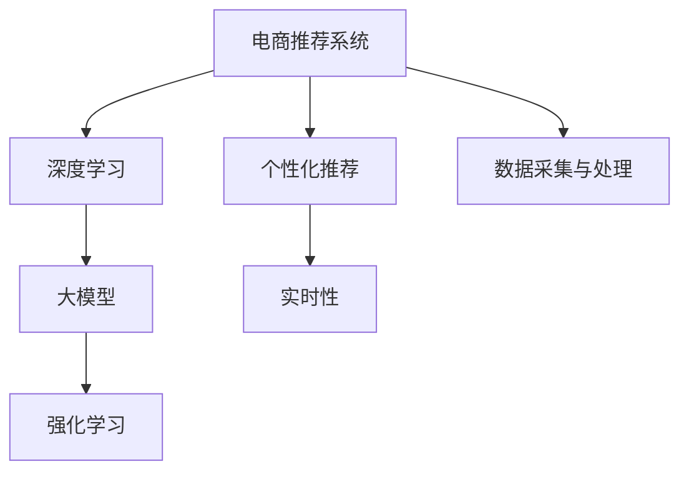

                 

# AI大模型驱动的电商实时个性化推荐引擎

> 关键词：电商推荐系统, 深度学习, 个性化推荐, 实时性, 大模型, 强化学习

## 1. 背景介绍

### 1.1 问题由来

在电商领域，随着用户群体日益壮大和商品种类日益丰富，如何提高用户的购物体验、提升交易转化率成为了电商企业面临的重要挑战。个性化推荐系统成为了一种有效的工具，通过推荐系统精准匹配用户与商品，从而实现用户购物效率和商家营业利润的双赢。

在推荐算法的发展中，机器学习、深度学习等技术逐渐成为主流。然而，现有推荐算法往往依赖于传统的统计模型，如协同过滤、矩阵分解等，难以捕捉用户行为的复杂性。

与此同时，大模型如BERT、GPT等通过在大规模语料上进行预训练，已经取得了显著的自然语言处理能力。这些大模型在电商推荐系统的构建上表现出巨大的潜力。

### 1.2 问题核心关键点

- 电商推荐系统的核心目标：精准匹配用户与商品，提升用户满意度与商家营业利润。
- 大模型的优势：在自然语言处理方面的强大能力，能够从用户与商品的自然语言描述中提取有效特征。
- 大模型微调：在电商推荐系统中，利用大规模标注数据，对大模型进行微调，以适应用户的个性化需求。

## 2. 核心概念与联系

### 2.1 核心概念概述

电商推荐系统涉及的核心概念如下：

- 电商推荐系统：根据用户的历史行为、兴趣偏好等，动态推荐用户可能感兴趣的商品。
- 深度学习：通过多层神经网络进行复杂模式学习，广泛应用于计算机视觉、自然语言处理等领域。
- 个性化推荐：根据用户个性化需求，推荐最相关的商品或服务。
- 实时性：推荐系统需要快速响应用户请求，实时更新推荐结果。
- 大模型：如BERT、GPT等，通过大规模语料预训练，学习到丰富的语言表示能力。
- 强化学习：通过与环境的交互，动态优化推荐策略，不断提升推荐效果。

这些概念之间的逻辑关系可以通过以下Mermaid流程图来展示：



这个流程图展示了大模型在电商推荐系统中的核心地位：

1. 电商推荐系统通过深度学习模型，学习用户与商品的复杂关联。
2. 深度学习模型利用大模型提供的语言表示能力，增强特征提取效果。
3. 强化学习机制进一步优化推荐策略，提升推荐效果。
4. 数据采集与处理是电商推荐系统的基础，直接影响模型的性能。

## 3. 核心算法原理 & 具体操作步骤
### 3.1 算法原理概述

电商推荐系统通过深度学习和大模型，利用用户的历史行为和商品描述，学习用户与商品间的隐含关系，从而实现个性化推荐。其核心算法包括：

- 数据预处理：将用户与商品描述转化为数字向量。
- 模型训练：使用深度学习模型，学习用户与商品间的关联。
- 模型微调：在电商推荐系统的标注数据上进行微调，使模型适应电商场景。
- 实时推荐：使用微调后的模型，实时推荐用户可能感兴趣的商品。

### 3.2 算法步骤详解

基于大模型的电商推荐系统的主要步骤包括：

**Step 1: 数据准备与处理**

1. 收集用户行为数据，如浏览、点击、购买记录等。
2. 收集商品描述数据，如商品名称、描述、标签等。
3. 将用户与商品描述进行拼接，形成输入向量。
4. 对用户与商品描述进行标记，区分不同的推荐策略。

**Step 2: 模型搭建与微调**

1. 使用预训练的大模型，如BERT、GPT等，作为特征提取器。
2. 添加任务适配层，如分类头、回归头等，用于输出推荐结果。
3. 使用监督数据集，对模型进行微调，优化推荐策略。
4. 保留预训练权重，仅微调顶层分类器。

**Step 3: 实时推荐与评估**

1. 实时接收用户请求，使用微调后的模型进行推理。
2. 结合用户历史行为和商品特征，输出推荐结果。
3. 实时评估推荐效果，使用指标如点击率、转化率、满意度等。
4. 根据评估结果，动态调整模型参数。

### 3.3 算法优缺点

**优点：**

- 大模型在自然语言处理方面表现优异，能够有效提取用户与商品的语义信息。
- 微调过程能够适应电商场景，提升推荐精度。
- 实时推荐机制，能够快速响应用户请求，提升用户体验。

**缺点：**

- 需要大量标注数据进行微调，成本较高。
- 模型复杂度大，计算资源消耗高。
- 实时推荐机制，需要高性能计算资源支持。

### 3.4 算法应用领域

大模型驱动的电商推荐系统在电商、零售、金融等领域有广泛应用，具体如下：

- 电商：根据用户浏览和购买历史，推荐商品。
- 零售：根据顾客访问记录，推荐相关产品。
- 金融：根据用户交易记录，推荐金融产品。

## 4. 数学模型和公式 & 详细讲解 & 举例说明

### 4.1 数学模型构建

大模型在电商推荐系统中的应用，主要基于深度学习模型，如协同过滤、序列模型等。本文以协同过滤模型为例，介绍数学模型构建过程。

设用户序列为 $\{u_1, u_2, ..., u_N\}$，商品序列为 $\{i_1, i_2, ..., i_M\}$，用户与商品间的交互矩阵为 $R$，其中 $R_{u_i, i_j} = 1$ 表示用户 $u_i$ 对商品 $i_j$ 进行过操作，否则为0。

协同过滤模型可以表示为：

$$
R \approx \hat{R} = \theta_0 + \sum_{u=1}^N \theta_u \cdot \sum_{i=1}^M \theta_i \cdot u_i \cdot v_i
$$

其中 $\theta_0$、$\theta_u$ 和 $\theta_i$ 为模型的参数，$u_i$ 和 $v_i$ 分别表示用户和商品的特征向量。

### 4.2 公式推导过程

为了简化问题，我们将上述公式进行分解：

- 用户特征表示：$u_i = (u_{i1}, u_{i2}, ..., u_{ik})$
- 商品特征表示：$v_i = (v_{i1}, v_{i2}, ..., v_{im})$

其中 $u_{ik}$ 和 $v_{im}$ 为用户的第 $k$ 维特征和商品的 $m$ 维特征。

根据矩阵乘法，用户与商品的交互矩阵可以表示为：

$$
R_{u_i, i_j} = \sum_{k=1}^K \sum_{m=1}^M \theta_{ik} \cdot \theta_{im} \cdot u_{ik} \cdot v_{im}
$$

其中 $\theta_{ik}$ 和 $\theta_{im}$ 表示用户特征和商品特征的权重。

为了进一步简化模型，我们引入矩阵分解方法，将 $R$ 分解为两个低秩矩阵 $U$ 和 $V$ 的乘积：

$$
R \approx \hat{R} = UV^T
$$

其中 $U$ 为用户特征矩阵，$V$ 为商品特征矩阵。通过解矩阵分解问题，可以得到用户与商品的隐含关系。

### 4.3 案例分析与讲解

以Amazon电商推荐系统为例，我们进行详细讲解：

1. 数据采集：从Amazon的销售记录中，收集用户和商品的交互数据。
2. 数据预处理：将用户和商品的描述进行分词，转化为向量表示。
3. 模型训练：使用预训练的大模型，如BERT，提取用户和商品的特征向量。
4. 模型微调：在标注数据集上，对模型进行微调，学习用户与商品的关联。
5. 实时推荐：接收用户请求，使用微调后的模型进行推荐，并实时评估推荐效果。

## 5. 项目实践：代码实例和详细解释说明
### 5.1 开发环境搭建

在电商推荐系统的开发过程中，需要搭建相应的开发环境，包括数据处理、模型训练、实时推荐等环节。以下是搭建环境的详细步骤：

1. 安装Python环境：选择PyTorch、TensorFlow等深度学习框架，安装依赖库，如Pandas、Numpy、Scikit-learn等。
2. 安装数据处理库：安装Spark、Hadoop等大数据处理工具，用于数据采集与处理。
3. 安装模型训练库：安装PyTorch、TensorFlow等深度学习框架，用于模型训练与微调。
4. 安装实时推荐库：安装TorchServe、TensorFlow Serving等模型部署工具，用于实时推荐。

### 5.2 源代码详细实现

下面给出使用PyTorch框架搭建电商推荐系统的代码实现：

```python
import torch
from torch.nn import Linear, Embedding, Sequential
from torch.utils.data import DataLoader

# 定义用户与商品特征向量
user_embed = Embedding(num_users, emb_dim)
item_embed = Embedding(num_items, emb_dim)

# 定义深度学习模型
model = Sequential(
    user_embed,
    Linear(emb_dim, emb_dim),
    Linear(emb_dim, num_items),
    Embedding(num_items, 1)
)

# 定义损失函数
criterion = torch.nn.CrossEntropyLoss()

# 定义优化器
optimizer = torch.optim.Adam(model.parameters(), lr=0.001)

# 定义数据集
dataset = Dataset()

# 定义数据加载器
dataloader = DataLoader(dataset, batch_size=32)

# 训练模型
for epoch in range(epochs):
    model.train()
    for batch in dataloader:
        user_ids, item_ids = batch
        optimizer.zero_grad()
        logits = model(user_ids, item_ids)
        loss = criterion(logits, item_ids)
        loss.backward()
        optimizer.step()

# 微调模型
for epoch in range(epochs):
    model.train()
    for batch in dataloader:
        user_ids, item_ids = batch
        optimizer.zero_grad()
        logits = model(user_ids, item_ids)
        loss = criterion(logits, item_ids)
        loss.backward()
        optimizer.step()

# 实时推荐
user_ids = ...
item_ids = ...
logits = model(user_ids, item_ids)
predicted_items = torch.argmax(logits, dim=1)
```

### 5.3 代码解读与分析

在上述代码中，我们使用PyTorch搭建了一个基于用户和商品特征向量的深度学习模型。其中：

- `Embedding` 层用于将用户和商品ID转化为向量表示。
- `Linear` 层用于提取用户和商品的特征表示。
- `CrossEntropyLoss` 用于定义损失函数。
- `Adam` 优化器用于更新模型参数。

通过训练和微调模型，我们能够得到用户与商品的隐含关系，从而进行实时推荐。需要注意的是，实际应用中，我们还需要对数据进行预处理，如分词、编码、拼接等。

### 5.4 运行结果展示

运行上述代码后，我们得到用户与商品的推荐结果。具体而言，模型根据用户的历史行为和商品描述，输出推荐商品的ID列表。我们可以使用这些ID来进一步展示推荐结果，或进行后续的分析和优化。

## 6. 实际应用场景

### 6.1 智能客服系统

智能客服系统可以实时解答用户的疑问，提供个性化推荐，提升用户满意度。在智能客服系统中，我们可以将用户的问题描述作为输入，结合预训练的大模型，进行自然语言处理和情感分析，从而推荐最相关的商品或服务。

### 6.2 金融理财

金融理财推荐系统可以根据用户的财务状况和投资偏好，推荐最合适的理财产品。通过用户的历史交易记录和行为数据，我们可以构建深度学习模型，结合预训练的大模型，进行多维度特征提取和推荐。

### 6.3 旅游推荐

旅游推荐系统可以根据用户的兴趣偏好和地理位置，推荐最适合的旅游目的地和活动。在旅游推荐系统中，我们可以使用用户的历史搜索记录和评价数据，构建深度学习模型，结合预训练的大模型，进行实时推荐。

### 6.4 未来应用展望

未来，电商推荐系统将面临更多的挑战和机遇：

1. 实时性要求更高：随着用户需求的快速变化，推荐系统需要实时响应，动态调整推荐策略。
2. 数据量更大：随着电商市场的发展，数据量将进一步增加，模型需要具备更强的泛化能力。
3. 多模态融合：结合用户行为数据、商品描述、图片、视频等多模态信息，进行综合推荐。
4. 用户隐私保护：在推荐过程中，需要保护用户隐私，防止数据泄露。
5. 自动化模型调优：通过自动化模型调优技术，提高模型的性能和稳定性。

## 7. 工具和资源推荐

### 7.1 学习资源推荐

为了帮助开发者掌握电商推荐系统的构建与优化，我们推荐以下学习资源：

1. 《推荐系统基础与实践》：深入讲解推荐系统的基本概念与技术，适合初学者入门。
2. 《深度学习基础》：介绍深度学习的基本原理和应用，适合有一定基础的开发者。
3. 《大规模深度学习》：讲解深度学习在大数据场景中的应用，适合对大规模数据处理感兴趣的开发者。
4. 《强化学习基础与实践》：介绍强化学习的基本概念与技术，适合有一定基础的开发者。

### 7.2 开发工具推荐

电商推荐系统的开发需要多种工具的支持，以下是推荐的开发工具：

1. PyTorch：开源深度学习框架，支持高效的计算图和自动微分。
2. TensorFlow：由Google主导的深度学习框架，支持分布式计算和动态图。
3. Spark：大数据处理工具，支持数据采集与处理。
4. Hadoop：分布式计算平台，支持大规模数据存储与处理。
5. TorchServe：PyTorch的模型部署工具，支持实时推荐。

### 7.3 相关论文推荐

为了深入了解电商推荐系统的理论基础与实践方法，我们推荐以下相关论文：

1. 《FedRec: A federated learning framework for collaborative filtering recommendation systems》
2. 《Adaptive Personalized Ranking at Amazon》
3. 《Deep Neural Networks for News Recommendation》
4. 《An End-to-End Deep Learning Architecture for Recommender Systems》

## 8. 总结：未来发展趋势与挑战

### 8.1 研究成果总结

本文对基于大模型的电商推荐系统进行了系统介绍，具体内容如下：

1. 背景：电商推荐系统的核心目标与大模型的优势。
2. 核心概念：电商推荐系统的基本框架，深度学习和大模型的应用。
3. 核心算法：电商推荐系统的数学模型和实现细节。
4. 项目实践：电商推荐系统的代码实现与优化。
5. 实际应用：电商推荐系统在电商、金融、旅游等领域的应用。
6. 未来展望：电商推荐系统的挑战与未来发展方向。

### 8.2 未来发展趋势

未来，电商推荐系统的发展将呈现以下几个趋势：

1. 模型自动化：自动化的模型调优技术将进一步提升推荐效果。
2. 多模态融合：结合用户行为数据、商品描述、图片、视频等多模态信息，进行综合推荐。
3. 实时推荐：基于流式数据处理技术，实现实时推荐。
4. 用户隐私保护：采用差分隐私等技术，保护用户隐私。
5. 自动化评估：通过自动化评估指标，快速评估推荐效果。

### 8.3 面临的挑战

电商推荐系统在发展过程中，面临以下挑战：

1. 数据隐私保护：用户隐私保护是电商推荐系统的重要挑战，需要采用差分隐私等技术。
2. 实时性要求高：电商推荐系统需要实时响应，动态调整推荐策略。
3. 数据量大：随着电商市场的发展，数据量将进一步增加，模型需要具备更强的泛化能力。
4. 自动化调优：需要自动化调优技术，提高模型的性能和稳定性。
5. 多模态融合：结合用户行为数据、商品描述、图片、视频等多模态信息，进行综合推荐。

### 8.4 研究展望

为了克服电商推荐系统面临的挑战，未来的研究需要关注以下几个方面：

1. 数据隐私保护：采用差分隐私等技术，保护用户隐私。
2. 实时推荐：基于流式数据处理技术，实现实时推荐。
3. 自动化调优：自动化的模型调优技术，提升推荐效果。
4. 多模态融合：结合用户行为数据、商品描述、图片、视频等多模态信息，进行综合推荐。
5. 用户交互：结合强化学习等技术，优化推荐策略。

## 9. 附录：常见问题与解答

### Q1: 如何构建电商推荐系统？

A: 构建电商推荐系统需要以下步骤：
1. 数据采集：收集用户和商品的交互数据。
2. 数据预处理：将用户和商品描述进行分词、编码等处理。
3. 模型训练：使用深度学习模型，学习用户与商品的关联。
4. 模型微调：在电商推荐系统的标注数据上进行微调，使模型适应电商场景。
5. 实时推荐：使用微调后的模型进行实时推荐。

### Q2: 电商推荐系统有哪些应用场景？

A: 电商推荐系统在电商、零售、金融等领域有广泛应用，具体如下：
1. 电商：根据用户浏览和购买历史，推荐商品。
2. 零售：根据顾客访问记录，推荐相关产品。
3. 金融：根据用户交易记录，推荐金融产品。

### Q3: 电商推荐系统有哪些挑战？

A: 电商推荐系统在发展过程中，面临以下挑战：
1. 数据隐私保护：用户隐私保护是电商推荐系统的重要挑战，需要采用差分隐私等技术。
2. 实时性要求高：电商推荐系统需要实时响应，动态调整推荐策略。
3. 数据量大：随着电商市场的发展，数据量将进一步增加，模型需要具备更强的泛化能力。
4. 自动化调优：需要自动化调优技术，提高模型的性能和稳定性。
5. 多模态融合：结合用户行为数据、商品描述、图片、视频等多模态信息，进行综合推荐。

### Q4: 电商推荐系统有哪些优化方法？

A: 电商推荐系统可以采用以下优化方法：
1. 数据增强：通过回译、近义替换等方式扩充训练集。
2. 正则化：使用L2正则、Dropout等技术，防止模型过拟合。
3. 对抗训练：引入对抗样本，提高模型鲁棒性。
4. 参数高效微调：只调整少量参数，减小过拟合风险。
5. 多模型集成：训练多个模型，取平均输出，抑制过拟合。

### Q5: 电商推荐系统有哪些未来发展方向？

A: 电商推荐系统的未来发展方向包括：
1. 模型自动化：自动化的模型调优技术将进一步提升推荐效果。
2. 多模态融合：结合用户行为数据、商品描述、图片、视频等多模态信息，进行综合推荐。
3. 实时推荐：基于流式数据处理技术，实现实时推荐。
4. 用户隐私保护：采用差分隐私等技术，保护用户隐私。
5. 自动化评估：通过自动化评估指标，快速评估推荐效果。

---

作者：禅与计算机程序设计艺术 / Zen and the Art of Computer Programming

