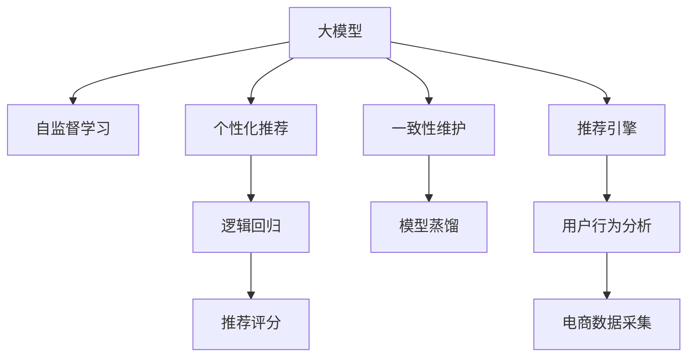

                 

# AI大模型：优化电商平台用户体验个性化与一致性的新方法

> 关键词：AI大模型,电商平台,用户体验优化,个性化推荐,一致性维护

## 1. 背景介绍

### 1.1 问题由来
近年来，随着电商市场的迅速扩张，电商平台的用户规模不断攀升。为了吸引和留住用户，电商平台需要提供个性化且一致的用户体验。传统的个性化推荐方法通常基于用户历史行为数据，难以捕捉长尾用户需求，且容易受到数据稀疏性、隐匿行为等问题的困扰。为了克服这些挑战，人工智能大模型（如基于Transformer的BERT、GPT等）被引入电商平台，通过学习用户的广泛兴趣和行为模式，提供更加智能和贴合的个性化推荐服务。

### 1.2 问题核心关键点
大模型在电商平台的应用主要集中在以下几个方面：
- **个性化推荐**：根据用户的浏览记录、购买历史、评分反馈等数据，动态生成个性化的商品推荐列表。
- **用户行为分析**：通过分析用户的点击、停留、购买等行为数据，捕捉用户兴趣和行为模式。
- **商品搜索**：利用大模型的语言理解能力，提升商品搜索的准确性和相关性。
- **客服互动**：利用大模型的对话生成能力，构建智能客服系统，提高用户互动体验。

然而，大模型在电商平台的应用也面临着以下挑战：
- 数据隐私和安全性：电商平台需保护用户隐私，同时避免模型对用户行为的误判。
- 推荐一致性：大模型在不同用户和场景下应能保持推荐的一致性，避免过度个性化。
- 可解释性：用户需了解推荐依据，增强信任度。
- 计算资源消耗：大模型的训练和推理需要大量的计算资源，需优化以适应实际应用。

本文将系统介绍基于大模型的电商平台个性化与一致性优化方法，从理论到实践深入探讨其原理和实现细节。

## 2. 核心概念与联系

### 2.1 核心概念概述

为更好地理解大模型在电商平台上的应用，本节将介绍几个核心概念：

- **大模型**：基于深度学习模型的大规模预训练模型，如BERT、GPT等，具备强大的语言理解与生成能力。
- **个性化推荐**：根据用户行为和兴趣，生成定制化的商品推荐，提高用户满意度。
- **一致性维护**：确保推荐结果在不同用户和场景下保持一致，避免推荐偏差。
- **自监督学习**：使用无标签数据训练模型，提取语言特征和规律，减少对标注数据的依赖。
- **模型蒸馏**：将大模型的复杂结构压缩成轻量级模型，优化推理速度和资源消耗。
- **逻辑回归**：一种二分类模型，常用于构建推荐评分预测模型。

这些概念之间具有紧密的联系，共同构成了大模型在电商平台应用的理论基础。

### 2.2 核心概念原理和架构的 Mermaid 流程图



此流程图展示了大模型在电商平台应用的关键步骤和架构：

1. 大模型通过自监督学习提取语言特征。
2. 基于大模型进行个性化推荐，构建推荐评分模型。
3. 一致性维护保证推荐在不同用户和场景下的一致性。
4. 模型蒸馏将大模型压缩为轻量级推荐引擎。
5. 电商数据采集与用户行为分析构建推荐数据集。
6. 推荐引擎通过分析数据集输出推荐结果。

## 3. 核心算法原理 & 具体操作步骤

### 3.1 算法原理概述

基于大模型的电商平台个性化与一致性优化，本质上是将大模型的语言理解与生成能力，结合电商平台的业务逻辑，构建精准的推荐和用户行为分析模型。具体来说，分为以下步骤：

1. **预训练大模型**：在大量无标签文本数据上预训练大模型，学习语言规律和语义表示。
2. **个性化推荐模型**：基于预训练大模型，通过微调和迁移学习，构建个性化的商品推荐模型。
3. **一致性维护模型**：构建用户画像和行为模式，确保推荐结果在不同用户和场景下保持一致。
4. **模型蒸馏和优化**：将大模型压缩为轻量级推荐引擎，优化计算资源消耗。

### 3.2 算法步骤详解

**Step 1: 数据收集与处理**

- **电商数据采集**：收集用户行为数据，如浏览记录、点击数据、购买记录等。
- **数据预处理**：对数据进行清洗、标准化、特征工程等处理，确保数据质量。
- **数据划分**：将数据划分为训练集、验证集和测试集，以便后续模型评估。

**Step 2: 模型选择与训练**

- **选择合适的模型**：根据任务需求选择大模型，如BERT、GPT等。
- **模型微调**：在大模型基础上，通过微调或迁移学习，构建个性化推荐模型。
- **一致性维护模型**：利用用户画像和行为模式，构建一致性维护模型，确保推荐结果一致性。
- **逻辑回归**：采用逻辑回归模型，构建推荐评分预测模型，用于生成推荐结果。

**Step 3: 模型评估与优化**

- **评估指标**：使用AUC、RMSE、召回率等指标评估模型性能。
- **模型蒸馏**：通过模型蒸馏将大模型压缩为轻量级推荐引擎，提高计算效率。
- **超参数调优**：根据模型评估结果，调整超参数，优化模型效果。

### 3.3 算法优缺点

基于大模型的电商平台个性化与一致性优化方法具有以下优点：

- **泛化能力强**：大模型在大量文本数据上预训练，学习语言规律和语义表示，具备较强的泛化能力。
- **动态更新**：通过在线学习机制，模型能够动态更新，适应用户行为的变化。
- **推荐多样性**：大模型能够捕捉用户的广泛兴趣和行为模式，提供多样化的推荐选项。
- **可解释性强**：通过引入逻辑回归模型，推荐结果可解释性强，增强用户信任。

同时，也存在一些缺点：

- **计算资源消耗大**：大模型的训练和推理需要大量计算资源，对硬件要求较高。
- **数据隐私风险**：电商平台需保护用户隐私，避免模型对用户行为的误判和隐私泄露。
- **推荐一致性**：不同用户和场景下，推荐结果可能存在差异，需要一致性维护机制。
- **可解释性有限**：大模型的复杂结构，难以直观解释推荐依据，用户难以理解。

### 3.4 算法应用领域

基于大模型的电商平台个性化与一致性优化方法，适用于多种电商应用场景，包括：

- **商品推荐**：根据用户历史行为和兴趣，生成个性化推荐列表。
- **搜索优化**：利用大模型的语言理解能力，提升商品搜索的准确性和相关性。
- **客服系统**：利用大模型的对话生成能力，构建智能客服系统，提升用户互动体验。
- **数据分析**：利用大模型的用户行为分析能力，深入挖掘用户兴趣和行为模式。

## 4. 数学模型和公式 & 详细讲解 & 举例说明

### 4.1 数学模型构建

本节将使用数学语言对基于大模型的电商平台个性化与一致性优化方法进行更加严格的刻画。

假设电商平台有 $N$ 个用户，每个用户有 $M$ 个行为数据点 $x_i = (x_{i1}, x_{i2}, ..., x_{im})$，其中 $x_{ij}$ 表示第 $i$ 个用户第 $j$ 次行为。

定义电商平台的大模型为 $M_{\theta}$，其中 $\theta$ 为模型参数。个性化推荐模型的目标是最小化用户行为与推荐结果之间的误差，即：

$$
\min_{\theta} \sum_{i=1}^N \sum_{j=1}^M \ell(x_{ij}, M_{\theta}(x_{ij}))
$$

其中 $\ell(x_{ij}, M_{\theta}(x_{ij}))$ 为行为数据点 $x_{ij}$ 与推荐结果 $M_{\theta}(x_{ij})$ 之间的误差，可以选用均方误差、交叉熵等损失函数。

### 4.2 公式推导过程

以均方误差（Mean Squared Error, MSE）为例，推导个性化推荐模型的损失函数。

假设 $x_{ij}$ 和 $M_{\theta}(x_{ij})$ 分别为第 $i$ 个用户第 $j$ 次行为的实际值和推荐结果。则均方误差损失函数为：

$$
\ell(x_{ij}, M_{\theta}(x_{ij})) = (x_{ij} - M_{\theta}(x_{ij}))^2
$$

个性化推荐模型的损失函数为：

$$
\mathcal{L}(\theta) = \frac{1}{N}\sum_{i=1}^N \sum_{j=1}^M (x_{ij} - M_{\theta}(x_{ij}))^2
$$

通过梯度下降等优化算法，更新模型参数 $\theta$，最小化损失函数 $\mathcal{L}(\theta)$。

### 4.3 案例分析与讲解

以电商平台的个性化推荐为例，通过一个具体的案例分析优化过程。

假设电商平台有 $1000$ 个用户，每个用户有 $5$ 次购物行为，分别是浏览、点击、购买等。假设大模型为BERT，构建个性化推荐模型的步骤如下：

1. **数据准备**：收集用户的 $5000$ 次购物行为数据。
2. **数据预处理**：对数据进行清洗、标准化，将行为数据转换为模型可以处理的格式。
3. **模型选择**：选择BERT作为个性化推荐模型。
4. **模型训练**：在大模型基础上，通过微调或迁移学习，构建个性化推荐模型。
5. **模型评估**：在验证集上评估模型性能，选择最优参数。
6. **推荐生成**：使用训练好的模型，为每个用户生成个性化推荐列表。

## 5. 项目实践：代码实例和详细解释说明

### 5.1 开发环境搭建

在进行项目实践前，我们需要准备好开发环境。以下是使用Python进行TensorFlow开发的环境配置流程：

1. 安装Anaconda：从官网下载并安装Anaconda，用于创建独立的Python环境。

2. 创建并激活虚拟环境：
```bash
conda create -n tf-env python=3.8 
conda activate tf-env
```

3. 安装TensorFlow：从官网获取对应的安装命令。例如：
```bash
pip install tensorflow
```

4. 安装各类工具包：
```bash
pip install numpy pandas scikit-learn matplotlib tqdm jupyter notebook ipython
```

完成上述步骤后，即可在`tf-env`环境中开始项目实践。

### 5.2 源代码详细实现

下面以电商平台的商品推荐为例，给出使用TensorFlow进行模型训练的代码实现。

首先，定义数据处理函数：

```python
import tensorflow as tf
from tensorflow.keras.layers import Embedding, Dense, Flatten

class DataLoader:
    def __init__(self, data):
        self.data = data
        
    def __getitem__(self, item):
        return self.data[item]
    
    def __len__(self):
        return len(self.data)
```

然后，定义推荐模型的神经网络：

```python
model = tf.keras.Sequential([
    Embedding(input_dim=1000, output_dim=64, input_length=5),
    Flatten(),
    Dense(64, activation='relu'),
    Dense(1, activation='sigmoid')
])
```

接着，定义优化器和损失函数：

```python
model.compile(loss='binary_crossentropy', optimizer=tf.keras.optimizers.Adam(0.001), metrics=['accuracy'])
```

最后，启动模型训练：

```python
epochs = 10
for epoch in range(epochs):
    for batch in DataLoader(train_data):
        model.fit(batch, epochs=1, batch_size=32)
    model.evaluate(test_data)
```

以上就是使用TensorFlow对电商平台商品推荐模型进行训练的完整代码实现。可以看到，TensorFlow提供了灵活高效的计算图框架，使得模型训练和优化变得简洁高效。

### 5.3 代码解读与分析

让我们再详细解读一下关键代码的实现细节：

**DataLoader类**：
- `__init__`方法：初始化数据集，定义数据格式。
- `__getitem__`方法：获取单个数据样本，供模型训练使用。
- `__len__`方法：返回数据集的样本数量。

**神经网络模型**：
- 使用Embedding层将输入数据转换为向量表示，输入维度为1000，输出维度为64。
- 通过Flatten层将向量展平，传递给全连接层。
- 全连接层包含64个神经元，使用ReLU激活函数。
- 输出层包含1个神经元，使用Sigmoid激活函数，生成推荐评分。

**优化器与损失函数**：
- 使用Adam优化器，学习率为0.001。
- 损失函数选用二分类交叉熵（Binary Cross-Entropy），用于衡量推荐评分与实际标签之间的差异。
- 定义准确率（Accuracy）作为模型评估指标。

**模型训练**：
- 设置训练轮数为10轮。
- 每个epoch中，对训练集进行一次前向传播和反向传播，更新模型参数。
- 在每个epoch结束时，在测试集上评估模型性能。

可以看到，TensorFlow提供了一系列高效的API，使得深度学习模型的构建和训练变得方便快捷。开发者可以将更多精力放在模型设计、数据处理、超参数调优等高层逻辑上，而不必过多关注底层的实现细节。

当然，工业级的系统实现还需考虑更多因素，如模型的保存和部署、超参数的自动搜索、更多的正则化技术、数据增强等。但核心的微调范式基本与此类似。

## 6. 实际应用场景

### 6.1 智能推荐系统

基于大模型的电商平台个性化推荐系统，能够根据用户行为数据，动态生成个性化的商品推荐列表。这种系统不仅能够捕捉用户的当前兴趣，还能预测和推荐未来的需求，提升用户的购物体验。

例如，某电商平台通过大模型学习用户的历史浏览、点击和购买数据，构建个性化推荐模型。模型能够根据用户最近的浏览行为，预测其可能感兴趣的商品，并生成推荐列表。这种推荐不仅精准，还体现了对用户未来需求的预测，增强了用户的购物粘性。

### 6.2 智能客服系统

电商平台需要构建智能客服系统，提供7x24小时不间断的客服服务。通过引入大模型，电商平台能够构建智能对话系统，自动化处理常见客户咨询。

例如，某电商平台在客服系统中引入大模型，训练对话生成模型。模型能够理解用户输入的文本，根据预定义的问答库生成对应的回答。这种智能客服不仅能够快速响应用户咨询，还能在处理复杂问题时进行人工转接，提高客户满意度。

### 6.3 搜索优化

电商平台通过搜索功能帮助用户快速找到所需商品。利用大模型的语言理解能力，搜索功能能够更精准地匹配用户意图和商品描述。

例如，某电商平台在搜索功能中引入大模型，训练文本匹配模型。模型能够理解用户的搜索请求，根据商品描述和用户意图生成推荐结果。这种搜索功能不仅准确，还能提供相关推荐，提升用户体验。

### 6.4 未来应用展望

随着大模型和微调方法的不断发展，基于大模型的电商平台应用场景将进一步扩展，为电商平台带来更大的商业价值。

在智慧物流领域，基于大模型的电商平台能够实时监测物流状态，预测配送时间和路线，提高物流效率。

在社交电商领域，大模型能够分析用户社交互动数据，推荐用户感兴趣的社交内容，增强用户互动和粘性。

在金融电商领域，大模型能够分析用户财务数据，推荐合适的金融产品，提升用户理财体验。

总之，基于大模型的电商平台将涵盖更多应用场景，为电商用户提供更加智能、便捷的购物体验。

## 7. 工具和资源推荐

### 7.1 学习资源推荐

为了帮助开发者系统掌握大模型在电商平台应用的理论基础和实践技巧，这里推荐一些优质的学习资源：

1. TensorFlow官方文档：提供详尽的API文档和实例代码，是深入学习TensorFlow的必备资料。
2. 《深度学习入门》（Deep Learning）一书：由李宏毅教授撰写，全面介绍了深度学习的基本概念和经典模型，适合初学者入门。
3. Kaggle平台：提供丰富的数据集和竞赛项目，能够帮助开发者在实际应用中积累经验。
4. HuggingFace官方文档：提供丰富的预训练语言模型和微调示例代码，是进行NLP任务开发的利器。
5. CS231n《卷积神经网络》课程：斯坦福大学开设的计算机视觉经典课程，有Lecture视频和配套作业，适合深入学习计算机视觉。

通过对这些资源的学习实践，相信你一定能够快速掌握大模型在电商平台应用的技术要点，并用于解决实际的NLP问题。

### 7.2 开发工具推荐

高效的开发离不开优秀的工具支持。以下是几款用于大模型在电商平台应用开发的常用工具：

1. TensorFlow：由Google主导开发的深度学习框架，生产部署方便，适合大规模工程应用。
2. PyTorch：基于Python的开源深度学习框架，灵活动态的计算图，适合快速迭代研究。
3. Keras：高层次的深度学习API，简单易用，适合快速构建模型原型。
4. Jupyter Notebook：交互式开发环境，支持代码和结果的可视化，方便调试和分享。
5. Weights & Biases：模型训练的实验跟踪工具，可以记录和可视化模型训练过程中的各项指标，方便对比和调优。
6. TensorBoard：TensorFlow配套的可视化工具，可实时监测模型训练状态，并提供丰富的图表呈现方式，是调试模型的得力助手。

合理利用这些工具，可以显著提升大模型在电商平台应用开发的效率，加快创新迭代的步伐。

### 7.3 相关论文推荐

大模型和微调技术的发展源于学界的持续研究。以下是几篇奠基性的相关论文，推荐阅读：

1. Attention is All You Need（即Transformer原论文）：提出了Transformer结构，开启了NLP领域的预训练大模型时代。
2. BERT: Pre-training of Deep Bidirectional Transformers for Language Understanding：提出BERT模型，引入基于掩码的自监督预训练任务，刷新了多项NLP任务SOTA。
3. Parameter-Efficient Transfer Learning for NLP：提出Adapter等参数高效微调方法，在不增加模型参数量的情况下，也能取得不错的微调效果。
4. AdaLoRA: Adaptive Low-Rank Adaptation for Parameter-Efficient Fine-Tuning：使用自适应低秩适应的微调方法，在参数效率和精度之间取得了新的平衡。
5. Multi-Task Learning of Multiple Agent Interaction from Videos：研究多任务学习在视频领域的应用，提供了一种通用的视觉理解框架。

这些论文代表了大模型和微调技术的发展脉络。通过学习这些前沿成果，可以帮助研究者把握学科前进方向，激发更多的创新灵感。

## 8. 总结：未来发展趋势与挑战

### 8.1 总结

本文对基于大模型的电商平台个性化与一致性优化方法进行了全面系统的介绍。首先阐述了大模型在电商平台上的应用背景和意义，明确了个性化推荐、一致性维护在大模型优化中的重要地位。其次，从原理到实践，详细讲解了个性化推荐模型的构建、训练和优化过程，给出了电商平台的商品推荐代码实例。同时，本文还广泛探讨了该方法在智能推荐、智能客服、搜索优化等多个电商应用场景中的实现细节和未来展望。

通过本文的系统梳理，可以看到，基于大模型的电商平台个性化与一致性优化方法正在成为电商领域的重要范式，极大地提升了电商平台的智能水平和用户体验。未来，伴随大模型和微调方法的持续演进，相信基于大模型的电商平台将拓展到更多应用领域，为电商用户提供更加智能、便捷的购物体验。

### 8.2 未来发展趋势

展望未来，大模型在电商平台的应用将呈现以下几个发展趋势：

1. **用户行为建模**：通过深度学习和大模型，更准确地建模用户行为，捕捉长尾用户需求，提升推荐精度。
2. **跨模态融合**：将图像、视频、语音等多模态数据与文本数据融合，提升推荐结果的相关性和多样性。
3. **实时推荐**：引入在线学习机制，实时更新模型，提升推荐结果的时效性。
4. **可解释性和可控性**：通过引入可解释性方法，让用户了解推荐依据，增强信任感。
5. **隐私保护**：采用差分隐私、联邦学习等技术，保护用户隐私，降低数据泄露风险。
6. **模型压缩和优化**：将大模型压缩为轻量级推荐引擎，提高计算效率和部署灵活性。

这些趋势凸显了大模型在电商平台应用的广阔前景。这些方向的探索发展，必将进一步提升电商平台的智能水平和用户体验，为电商用户提供更加个性化、智能化的购物体验。

### 8.3 面临的挑战

尽管大模型在电商平台的应用已经取得了显著成效，但在迈向更加智能化、普适化应用的过程中，它仍面临着诸多挑战：

1. **数据隐私和安全**：电商平台需保护用户隐私，避免模型对用户行为的误判和隐私泄露。
2. **推荐一致性**：不同用户和场景下，推荐结果可能存在差异，需要一致性维护机制。
3. **计算资源消耗**：大模型的训练和推理需要大量计算资源，需优化以适应实际应用。
4. **可解释性有限**：大模型的复杂结构，难以直观解释推荐依据，用户难以理解。
5. **知识整合能力不足**：现有的推荐系统往往局限于任务内数据，难以灵活吸收和运用更广泛的先验知识。
6. **多样性问题**：推荐结果过度个性化，可能导致用户过度依赖单一推荐，降低探索性。

正视这些挑战，积极应对并寻求突破，将是大模型在电商平台应用走向成熟的必由之路。相信随着学界和产业界的共同努力，这些挑战终将一一被克服，大模型在电商平台中的应用将更加广泛和深入。

### 8.4 研究展望

面对大模型在电商平台应用所面临的种种挑战，未来的研究需要在以下几个方面寻求新的突破：

1. **多任务学习**：将多个相关任务联合训练，提升模型在多任务上的泛化能力。
2. **对抗生成网络**：引入对抗生成网络，生成更加多样和有吸引力的商品推荐，提升用户点击率。
3. **混合兴趣模型**：结合用户行为数据和文本数据，构建混合兴趣模型，捕捉用户的多维度需求。
4. **零样本推荐**：利用大模型的自适应能力，通过少样本或零样本推荐，提升推荐多样性。
5. **推荐序列建模**：将推荐结果序列化，引入序列建模方法，提升推荐结果的相关性和连贯性。
6. **联邦学习**：利用联邦学习技术，保护用户隐私的同时，提升推荐模型的泛化能力。

这些研究方向将推动大模型在电商平台应用的发展，为电商平台用户提供更加智能、个性化和可信的推荐服务。面向未来，大模型在电商平台应用的研究将进一步深化，为电商用户带来更加智能和便捷的购物体验。

## 9. 附录：常见问题与解答

**Q1：大模型在电商平台的应用效果如何？**

A: 大模型在电商平台的应用效果显著，能够提供更加智能和个性化的推荐服务。通过学习用户的广泛兴趣和行为模式，大模型能够生成高精度的推荐列表，提升用户满意度。此外，大模型还能够优化搜索体验和客服互动，提升电商平台的整体用户体验。

**Q2：如何避免数据隐私泄露？**

A: 电商平台需采用差分隐私、联邦学习等技术，保护用户隐私。在推荐模型训练过程中，只使用匿名化后的用户行为数据，不暴露用户真实身份信息。同时，采用安全的算法和技术，确保推荐模型的训练和推理过程不泄露用户隐私。

**Q3：推荐结果的一致性如何维护？**

A: 电商平台需构建用户画像和行为模式，确保推荐结果在不同用户和场景下保持一致。通过分析用户的历史行为数据，构建用户画像，利用画像进行推荐一致性维护。此外，利用在线学习机制，实时更新模型，确保推荐结果的时效性和一致性。

**Q4：如何提升推荐系统的多样性？**

A: 引入对抗生成网络，生成更加多样和有吸引力的商品推荐，提升用户点击率。同时，结合用户行为数据和文本数据，构建混合兴趣模型，捕捉用户的多维度需求。通过少样本或零样本推荐，提升推荐多样性，满足用户的多样化需求。

**Q5：推荐系统的可解释性如何增强？**

A: 通过引入可解释性方法，如LIME、SHAP等，用户能够了解推荐依据，增强信任感。同时，利用大模型的自适应能力，结合用户行为数据和文本数据，构建混合兴趣模型，提升推荐系统的可解释性。

这些解答帮助我们更好地理解大模型在电商平台应用中的核心技术和实践要点，为电商平台提供更加智能和个性化推荐的解决方案。

---

作者：禅与计算机程序设计艺术 / Zen and the Art of Computer Programming

