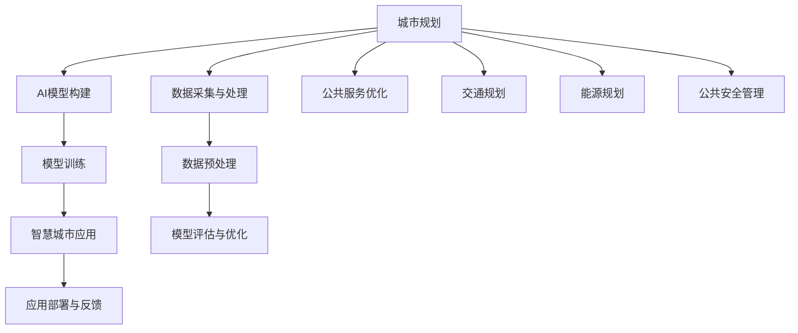

                 

# AI如何改变城市规划和智慧城市发展

## 1. 背景介绍

### 1.1 问题由来

随着人类社会的发展，城市化进程不断加速，如何构建安全、高效、宜居的智慧城市，成为各国政府和研究机构共同关心的重要课题。近年来，人工智能技术的迅猛发展，尤其是深度学习、计算机视觉、自然语言处理等领域的突破，为智慧城市的建设提供了全新的技术手段。

AI技术在城市规划和智慧城市建设中的应用，主要体现在以下几个方面：

1. **交通管理**：AI可以帮助城市交通管理部门优化交通信号灯控制、交通流量预测、智能导航等，减少交通拥堵和事故率，提升道路通行效率。
2. **能源管理**：AI可以用于智能电网建设，通过分析能源消耗数据，优化能源分配，减少能源浪费，提升能源利用效率。
3. **公共安全**：AI在公共安全领域可以用于视频监控、异常行为检测、犯罪预测等，提升城市公共安全水平。
4. **城市规划**：AI可以用于城市规划的优化，通过大数据分析，优化城市空间布局，提升城市环境质量。
5. **市民服务**：AI可以用于智能客服、医疗咨询、教育辅导等，提升市民服务体验和生活质量。

本文将系统介绍AI在城市规划和智慧城市建设中的应用，探讨其原理和实践方法，并展望其未来发展趋势和面临的挑战。

## 2. 核心概念与联系

### 2.1 核心概念概述

为更好地理解AI在城市规划和智慧城市建设中的应用，本节将介绍几个关键概念：

- **城市规划**：指对城市空间布局、基础设施建设、交通流线、公共设施配置等方面的全面规划和管理。城市规划的目标是实现城市的可持续发展，提升居民生活质量。
- **智慧城市**：指通过应用信息技术，将城市的各种服务和资源进行智能化管理和优化，实现城市运行的高效化、智能化、可持续化。智慧城市的核心在于“数据驱动”，利用大数据、物联网、云计算等技术，提升城市治理水平。
- **AI在城市规划中的应用**：指通过人工智能技术，对城市规划数据进行分析和优化，实现规划决策的科学化和智能化。AI在城市规划中的应用包括但不限于交通规划、能源规划、公共安全管理、公共服务优化等。
- **城市规划中的数据采集与处理**：指通过传感器、摄像头、智能设备等手段，采集城市的各类数据，如交通流量、能源消耗、环境质量、人流密度等。
- **AI在智慧城市建设中的应用**：指通过人工智能技术，对城市中的各类数据进行实时监测、分析、预测，提升城市管理效率和决策水平。AI在智慧城市中的应用包括智能交通、智能电网、智能安防、智能市政等。

这些核心概念之间的逻辑关系可以通过以下Mermaid流程图来展示：



这个流程图展示了大语言模型的核心概念及其之间的关系：

1. 城市规划通过数据采集与处理获取数据，构建AI模型进行优化决策。
2. AI模型通过模型训练和评估不断优化，提高预测和决策的准确性。
3. 智慧城市应用将AI模型嵌入到实际城市管理中，提升城市运行效率和服务水平。
4. 公共服务优化、交通规划、能源规划、公共安全管理等多个方面都可以应用AI模型，实现智慧城市目标。
5. 应用部署与反馈环节，通过收集数据和用户反馈，持续改进AI模型和智慧城市系统。

## 3. 核心算法原理 & 具体操作步骤

### 3.1 算法原理概述

AI在城市规划和智慧城市建设中的应用，核心在于利用人工智能技术，对城市数据进行分析和优化。主要涉及以下几类算法：

- **深度学习**：通过构建深度神经网络模型，对城市规划数据进行分类、回归、聚类等任务，提取有价值的信息。
- **计算机视觉**：利用图像识别技术，对城市中的监控视频、地图数据等进行分析和处理，提升城市管理效率。
- **自然语言处理**：通过文本分析和语义理解，对市民的意见和反馈进行分析和处理，优化城市规划和公共服务。
- **强化学习**：通过智能决策模型，对城市规划和智慧城市应用进行优化，提升决策的科学性和有效性。

这些算法在城市规划和智慧城市建设中的应用，主要包括以下步骤：

1. **数据采集与处理**：通过传感器、摄像头、智能设备等手段，采集城市的各类数据，如交通流量、能源消耗、环境质量、人流密度等。
2. **模型构建与训练**：利用深度学习、计算机视觉、自然语言处理等技术，构建AI模型，并通过标注数据进行训练。
3. **模型评估与优化**：对训练好的模型进行评估，通过测试集或实际数据，调整模型参数，提升模型预测和决策的准确性。
4. **应用部署与反馈**：将优化后的模型嵌入到实际城市管理系统中，进行应用部署，并通过数据分析和用户反馈，持续改进模型和系统。

### 3.2 算法步骤详解

**Step 1: 数据采集与预处理**

数据采集是AI在城市规划和智慧城市建设中的重要环节。通过传感器、摄像头、智能设备等手段，获取城市的各类数据，如交通流量、能源消耗、环境质量、人流密度等。

数据预处理包括数据清洗、归一化、特征工程等步骤。主要目的是减少噪音和异常值，提升数据质量，为后续模型训练和应用提供可靠的数据支撑。

**Step 2: 模型构建与训练**

根据具体应用场景，选择合适的AI模型。如交通管理中，可以使用深度学习模型进行交通流量预测；能源管理中，可以使用强化学习模型进行能源分配优化。

模型训练过程包括以下步骤：
1. 数据划分：将数据集划分为训练集、验证集和测试集。
2. 模型选择：选择合适的深度学习框架和模型，如TensorFlow、PyTorch等。
3. 模型训练：通过标注数据进行模型训练，优化模型参数，提升模型预测和决策的准确性。

**Step 3: 模型评估与优化**

模型评估过程包括以下步骤：
1. 模型评估：通过测试集或实际数据，评估模型预测和决策的准确性。
2. 参数调整：根据评估结果，调整模型参数，如学习率、正则化系数等。
3. 模型优化：通过交叉验证、网格搜索等方法，优化模型参数，提升模型性能。

**Step 4: 应用部署与反馈**

模型部署过程包括以下步骤：
1. 应用集成：将优化后的模型嵌入到实际城市管理系统中，进行应用部署。
2. 数据采集：通过传感器、摄像头、智能设备等手段，实时采集城市的各类数据。
3. 模型推理：利用部署后的模型，对实时数据进行分析和处理，生成优化决策。

模型反馈过程包括以下步骤：
1. 数据分析：通过数据分析工具，对模型预测结果和实际效果进行比较，评估模型性能。
2. 用户反馈：收集市民的意见和反馈，用于模型改进和优化。
3. 模型更新：根据数据分析和用户反馈，持续改进和优化模型，提升应用效果。

### 3.3 算法优缺点

AI在城市规划和智慧城市建设中的应用，具有以下优点：
1. **高效性**：AI可以快速处理大量数据，提供高效、精确的决策支持。
2. **实时性**：AI模型可以实时监测和分析城市数据，提升城市管理的实时性和响应速度。
3. **智能性**：AI模型通过学习数据规律，实现智能决策，提升城市管理的智能化水平。

同时，AI在城市规划和智慧城市建设中，也存在一些缺点：
1. **数据依赖**：AI模型的性能依赖于数据的质量和数量，数据采集和处理的质量直接影响模型效果。
2. **模型复杂**：AI模型较为复杂，需要较高的计算资源和技术门槛，应用成本较高。
3. **隐私安全**：城市数据涉及隐私和敏感信息，数据采集和存储过程中需要考虑隐私保护和数据安全问题。
4. **模型透明性**：AI模型往往被视为“黑盒”，缺乏可解释性和可解释性，难以满足高风险场景的需求。

### 3.4 算法应用领域

AI在城市规划和智慧城市建设中的应用，涵盖多个领域，具体如下：

**智慧交通**：通过AI技术，对交通流量进行预测和优化，提升交通管理效率和通行效率。主要应用包括智能交通信号控制、交通流量监测、智能导航等。

**智慧能源**：通过AI技术，对能源消耗进行分析和优化，提升能源利用效率。主要应用包括智能电网建设、能源分配优化、能源消耗预测等。

**智慧安防**：通过AI技术，对视频监控数据进行分析和处理，提升公共安全水平。主要应用包括异常行为检测、犯罪预测、视频智能分析等。

**智慧市政**：通过AI技术，对城市基础设施进行监测和管理，提升市政服务水平。主要应用包括垃圾分类管理、公共设施维护、城市环境监测等。

## 4. 数学模型和公式 & 详细讲解

### 4.1 数学模型构建

本节将使用数学语言对AI在智慧城市建设中的应用进行更加严格的刻画。

记城市数据集为 $D=\{(x_i, y_i)\}_{i=1}^N$，其中 $x_i$ 为输入数据，$y_i$ 为输出标签。假设AI模型为 $M_{\theta}(x)$，其中 $\theta$ 为模型参数。

定义模型 $M_{\theta}(x)$ 在数据样本 $(x,y)$ 上的损失函数为 $\ell(M_{\theta}(x),y)$，则在数据集 $D$ 上的经验风险为：

$$
\mathcal{L}(\theta) = \frac{1}{N}\sum_{i=1}^N \ell(M_{\theta}(x_i),y_i)
$$

微调的目标是最小化经验风险，即找到最优参数：

$$
\theta^* = \mathop{\arg\min}_{\theta} \mathcal{L}(\theta)
$$

在实践中，我们通常使用基于梯度的优化算法（如SGD、Adam等）来近似求解上述最优化问题。设 $\eta$ 为学习率，$\lambda$ 为正则化系数，则参数的更新公式为：

$$
\theta \leftarrow \theta - \eta \nabla_{\theta}\mathcal{L}(\theta) - \eta\lambda\theta
$$

其中 $\nabla_{\theta}\mathcal{L}(\theta)$ 为损失函数对参数 $\theta$ 的梯度，可通过反向传播算法高效计算。

### 4.2 公式推导过程

以下我们以交通流量预测为例，推导AI模型在智慧交通中的应用。

假设模型 $M_{\theta}$ 在输入 $x$ 上的输出为 $\hat{y}=M_{\theta}(x)$，表示预测的交通流量。真实标签 $y$ 为实际交通流量。则均方误差损失函数定义为：

$$
\ell(M_{\theta}(x),y) = \frac{1}{N}\sum_{i=1}^N (\hat{y}_i - y_i)^2
$$

将其代入经验风险公式，得：

$$
\mathcal{L}(\theta) = \frac{1}{N}\sum_{i=1}^N (\hat{y}_i - y_i)^2
$$

根据链式法则，损失函数对参数 $\theta_k$ 的梯度为：

$$
\frac{\partial \mathcal{L}(\theta)}{\partial \theta_k} = \frac{1}{N}\sum_{i=1}^N 2(\hat{y}_i - y_i) \frac{\partial \hat{y}_i}{\partial \theta_k}
$$

其中 $\frac{\partial \hat{y}_i}{\partial \theta_k}$ 可进一步递归展开，利用自动微分技术完成计算。

在得到损失函数的梯度后，即可带入参数更新公式，完成模型的迭代优化。重复上述过程直至收敛，最终得到适应智慧交通模型的最优参数 $\theta^*$。

## 5. 项目实践：代码实例和详细解释说明

### 5.1 开发环境搭建

在进行AI在城市规划和智慧城市建设中的应用开发前，我们需要准备好开发环境。以下是使用Python进行TensorFlow开发的环境配置流程：

1. 安装Anaconda：从官网下载并安装Anaconda，用于创建独立的Python环境。

2. 创建并激活虚拟环境：
```bash
conda create -n tf-env python=3.8 
conda activate tf-env
```

3. 安装TensorFlow：根据CUDA版本，从官网获取对应的安装命令。例如：
```bash
conda install tensorflow -c tf -c conda-forge
```

4. 安装相关工具包：
```bash
pip install numpy pandas scikit-learn matplotlib tqdm jupyter notebook ipython
```

完成上述步骤后，即可在`tf-env`环境中开始AI应用的开发。

### 5.2 源代码详细实现

下面我们以智慧交通中的交通流量预测为例，给出使用TensorFlow对交通流量进行预测的代码实现。

首先，定义交通流量预测数据集：

```python
import numpy as np
import tensorflow as tf
from tensorflow.keras import layers, models

# 生成模拟的交通流量数据
np.random.seed(123)
N = 1000
x = np.random.randn(N, 5)
y = 0.5 * x[:, 0] - 0.2 * x[:, 1] + 0.3 * x[:, 2] + 0.4 * x[:, 3] + 0.1 * x[:, 4] + np.random.normal(scale=0.1, size=N)

# 构建数据集
train_x = x[:800]
train_y = y[:800]
val_x = x[800:]
val_y = y[800:]

# 定义输入输出
input_dim = 5
output_dim = 1

# 定义模型输入和输出
input_layer = tf.keras.layers.Input(shape=(input_dim,))
output_layer = tf.keras.layers.Dense(output_dim, activation='linear')(input_layer)

# 定义模型
model = models.Model(inputs=input_layer, outputs=output_layer)

# 编译模型
model.compile(optimizer=tf.keras.optimizers.Adam(0.01), loss='mse', metrics=['mse'])

# 训练模型
model.fit(train_x, train_y, epochs=50, batch_size=32, validation_data=(val_x, val_y))
```

然后，进行模型的评估和应用：

```python
# 评估模型
mse = model.evaluate(val_x, val_y)

# 应用模型进行交通流量预测
new_x = np.random.randn(10, 5)
predictions = model.predict(new_x)
print(predictions)
```

以上就是使用TensorFlow对交通流量进行预测的完整代码实现。可以看到，TensorFlow提供了强大的深度学习框架，可以轻松构建和训练复杂的神经网络模型。

### 5.3 代码解读与分析

让我们再详细解读一下关键代码的实现细节：

**生成模拟交通流量数据**：
```python
# 生成模拟的交通流量数据
np.random.seed(123)
N = 1000
x = np.random.randn(N, 5)
y = 0.5 * x[:, 0] - 0.2 * x[:, 1] + 0.3 * x[:, 2] + 0.4 * x[:, 3] + 0.1 * x[:, 4] + np.random.normal(scale=0.1, size=N)
```

这里使用NumPy生成了一个包含1000个样本、5个特征的交通流量数据集。特征向量 $x$ 表示不同的交通状况，标签 $y$ 表示实际的交通流量。

**定义数据集**：
```python
# 构建数据集
train_x = x[:800]
train_y = y[:800]
val_x = x[800:]
val_y = y[800:]
```

这里将数据集划分为训练集和验证集。训练集用于模型训练，验证集用于模型评估。

**定义模型输入和输出**：
```python
# 定义输入输出
input_dim = 5
output_dim = 1

# 定义模型输入和输出
input_layer = tf.keras.layers.Input(shape=(input_dim,))
output_layer = tf.keras.layers.Dense(output_dim, activation='linear')(input_layer)
```

这里定义了模型输入为5个特征的向量，输出为1个标量，表示交通流量。使用Dense层实现线性回归，预测交通流量。

**定义模型**：
```python
# 定义模型
model = models.Model(inputs=input_layer, outputs=output_layer)
```

这里使用TensorFlow的Model类定义了整个模型，将输入和输出连接起来。

**编译模型**：
```python
# 编译模型
model.compile(optimizer=tf.keras.optimizers.Adam(0.01), loss='mse', metrics=['mse'])
```

这里使用Adam优化器，均方误差损失函数，评估指标也为均方误差。

**训练模型**：
```python
# 训练模型
model.fit(train_x, train_y, epochs=50, batch_size=32, validation_data=(val_x, val_y))
```

这里使用训练集进行模型训练，验证集进行模型评估。训练50个epoch，每批次32个样本。

**评估模型**：
```python
# 评估模型
mse = model.evaluate(val_x, val_y)
```

这里使用验证集评估模型，得到均方误差。

**应用模型进行交通流量预测**：
```python
# 应用模型进行交通流量预测
new_x = np.random.randn(10, 5)
predictions = model.predict(new_x)
print(predictions)
```

这里使用随机生成的10个样本进行预测，输出预测结果。

可以看到，TensorFlow提供了便捷的API接口，可以轻松构建、训练和应用深度学习模型。开发者只需关注模型设计和算法实现，TensorFlow会负责底层的计算图优化和分布式训练等复杂操作。

## 6. 实际应用场景

### 6.1 智慧交通

智慧交通是AI在城市规划和智慧城市建设中应用最为广泛的领域之一。AI在智慧交通中的应用主要包括以下几个方面：

**交通流量预测**：通过AI模型对交通流量进行预测，优化交通信号灯控制，减少交通拥堵和事故率。

**智能导航**：通过AI模型对交通数据进行分析，生成实时导航信息，提升出行效率。

**智能停车**：通过AI模型对停车场数据进行分析，优化停车管理，提升停车效率。

### 6.2 智慧能源

智慧能源是AI在城市规划和智慧城市建设中的另一个重要应用领域。AI在智慧能源中的应用主要包括以下几个方面：

**智能电网**：通过AI模型对能源消耗数据进行分析和优化，提升能源利用效率。

**能源分配优化**：通过AI模型对能源分配进行优化，减少能源浪费。

**能源消耗预测**：通过AI模型对能源消耗进行预测，提升能源管理水平。

### 6.3 智慧安防

智慧安防是AI在城市规划和智慧城市建设中的重要应用领域。AI在智慧安防中的应用主要包括以下几个方面：

**视频监控**：通过AI模型对视频监控数据进行分析和处理，提升公共安全水平。

**异常行为检测**：通过AI模型对视频数据进行分析，检测异常行为，预防犯罪。

**视频智能分析**：通过AI模型对视频数据进行分析，生成智能分析报告。

### 6.4 未来应用展望

随着AI技术的不断发展，智慧城市的应用场景将不断拓展，未来的发展趋势包括以下几个方面：

1. **多模态融合**：未来AI将实现多模态数据的融合，如视频、音频、传感器数据等，提升智慧城市的数据分析和决策水平。

2. **边缘计算**：未来AI将向边缘计算方向发展，提升数据的实时性和处理效率，降低对中心服务器的依赖。

3. **联邦学习**：未来AI将向联邦学习方向发展，通过分布式学习提升数据隐私保护，同时提升模型泛化能力。

4. **人工智能伦理**：未来AI将更加注重伦理和安全问题，确保算法的透明性和公平性，避免数据滥用和隐私泄露。

## 7. 工具和资源推荐

### 7.1 学习资源推荐

为了帮助开发者系统掌握AI在城市规划和智慧城市建设中的应用，这里推荐一些优质的学习资源：

1. **TensorFlow官方文档**：TensorFlow官方提供的详细文档和示例代码，可以帮助开发者快速上手TensorFlow。

2. **Keras官方文档**：Keras官方提供的详细文档和示例代码，可以帮助开发者快速上手深度学习模型构建。

3. **Coursera《深度学习》课程**：Coursera提供的深度学习课程，由深度学习领域的专家授课，涵盖深度学习的基本概念和应用。

4. **ArXiv预印本**：ArXiv提供的深度学习领域的最新研究论文，可以帮助开发者了解前沿研究方向和应用。

5. **Google AI Lab博客**：Google AI Lab发布的深度学习相关博客，涵盖深度学习领域的最新进展和技术分享。

通过对这些资源的学习实践，相信你一定能够快速掌握AI在城市规划和智慧城市建设中的应用，并用于解决实际的智慧城市问题。

### 7.2 开发工具推荐

高效的开发离不开优秀的工具支持。以下是几款用于AI在城市规划和智慧城市建设中的应用开发的常用工具：

1. **TensorFlow**：由Google主导开发的开源深度学习框架，生产部署方便，适合大规模工程应用。

2. **Keras**：Keras提供了简单易用的API接口，可以快速构建和训练深度学习模型。

3. **Jupyter Notebook**：Jupyter Notebook提供了便捷的交互式开发环境，可以方便地进行模型构建、训练和调试。

4. **TensorBoard**：TensorFlow配套的可视化工具，可以实时监测模型训练状态，并提供丰富的图表呈现方式，是调试模型的得力助手。

5. **Weights & Biases**：模型训练的实验跟踪工具，可以记录和可视化模型训练过程中的各项指标，方便对比和调优。

6. **Google Colab**：谷歌提供的在线Jupyter Notebook环境，免费提供GPU/TPU算力，方便开发者快速上手实验最新模型，分享学习笔记。

合理利用这些工具，可以显著提升AI在城市规划和智慧城市建设中的应用开发效率，加快创新迭代的步伐。

### 7.3 相关论文推荐

AI在城市规划和智慧城市建设中的应用源于学界的持续研究。以下是几篇奠基性的相关论文，推荐阅读：

1. **“Deep Learning for Urban Traffic Management”**：探讨了深度学习在城市交通流量预测中的应用，提出了基于LSTM的交通流量预测模型。

2. **“Deep Learning in Smart City: A Survey”**：综述了深度学习在智慧城市建设中的应用，包括智能交通、智慧能源、智慧安防等领域。

3. **“Federated Learning for Smart City”**：探讨了联邦学习在智慧城市中的应用，提升了数据隐私保护和模型泛化能力。

4. **“Artificial Intelligence in Smart Cities”**：探讨了AI在智慧城市建设中的应用，包括交通管理、能源管理、公共安全等领域。

这些论文代表了大语言模型在城市规划和智慧城市建设中的应用方向，通过学习这些前沿成果，可以帮助研究者把握学科前进方向，激发更多的创新灵感。

## 8. 总结：未来发展趋势与挑战

### 8.1 总结

本文对AI在城市规划和智慧城市建设中的应用进行了全面系统的介绍。首先阐述了AI在城市规划和智慧城市建设中的应用背景和意义，明确了AI在智慧交通、智慧能源、智慧安防等领域的具体应用场景。其次，从原理到实践，详细讲解了AI在智慧城市建设中的应用方法和关键步骤，给出了完整的代码实例和详细解释说明。同时，本文还广泛探讨了AI在城市规划和智慧城市建设中的应用前景，探讨了其未来发展趋势和面临的挑战。

通过本文的系统梳理，可以看到，AI在城市规划和智慧城市建设中的应用前景广阔，已经在智慧交通、智慧能源、智慧安防等领域取得了显著成效。AI技术不仅提升了城市管理的效率和决策水平，还为智慧城市的构建提供了新的技术手段。未来，随着AI技术的不断进步和应用场景的拓展，相信AI将在更多领域发挥重要作用，为城市治理和居民生活带来更多便利和创新。

### 8.2 未来发展趋势

展望未来，AI在城市规划和智慧城市建设中的应用将呈现以下几个发展趋势：

1. **智慧城市数据平台建设**：未来将建设统一的城市数据平台，实现各类数据的集中管理和共享，为智慧城市应用提供可靠的数据支撑。

2. **AI与5G融合发展**：未来AI将与5G技术深度融合，提升数据的实时性和处理效率，实现智慧城市应用的实时化和智能化。

3. **多模态数据融合**：未来AI将实现视频、音频、传感器等多模态数据的融合，提升智慧城市的数据分析和决策水平。

4. **智能决策系统建设**：未来AI将构建智能决策系统，提升城市管理的智能化水平，实现智慧城市应用的精准化和服务化。

5. **智慧城市伦理和安全**：未来AI将更加注重伦理和安全问题，确保算法的透明性和公平性，避免数据滥用和隐私泄露。

以上趋势凸显了AI在城市规划和智慧城市建设中的巨大潜力，AI技术必将在更多领域发挥重要作用，为城市治理和居民生活带来更多便利和创新。

### 8.3 面临的挑战

尽管AI在城市规划和智慧城市建设中的应用已经取得了显著成效，但在迈向更加智能化、普适化应用的过程中，它仍面临诸多挑战：

1. **数据隐私和安全**：城市数据涉及隐私和敏感信息，数据采集和存储过程中需要考虑隐私保护和数据安全问题。如何保障数据隐私和安全，防止数据滥用和泄露，将是重要的研究课题。

2. **模型透明性和可解释性**：AI模型往往被视为“黑盒”，缺乏可解释性和可解释性，难以满足高风险场景的需求。如何赋予AI模型更强的可解释性，提高算法的透明性和可信度，将是亟待攻克的难题。

3. **计算资源和成本**：超大模型的计算资源和成本较高，如何将模型高效部署和优化，提升系统的运行效率和稳定性，将是重要的研究方向。

4. **跨领域融合能力**：AI模型在多领域数据上的泛化能力不足，如何将不同领域的数据和知识进行有效融合，提升智慧城市应用的综合能力，将是重要的研究课题。

5. **伦理和道德约束**：AI模型在应用过程中可能会带来伦理和道德问题，如算法偏见、歧视性输出等，如何确保算法的公平性和公正性，将是重要的研究课题。

6. **模型更新和维护**：智慧城市应用需要持续更新和维护，如何在模型训练和应用过程中，实现高效、便捷的模型更新和优化，将是重要的研究课题。

这些挑战凸显了AI在城市规划和智慧城市建设中的复杂性和多样性，需要从技术、伦理、法律等多个方面进行深入研究。

### 8.4 研究展望

面对AI在城市规划和智慧城市建设中所面临的挑战，未来的研究需要在以下几个方面寻求新的突破：

1. **跨领域知识融合**：未来AI将更加注重跨领域知识融合，将不同领域的知识和数据进行有效整合，提升智慧城市应用的综合能力。

2. **联邦学习和隐私保护**：未来AI将向联邦学习方向发展，通过分布式学习提升数据隐私保护，同时提升模型泛化能力。

3. **智能决策系统建设**：未来AI将构建智能决策系统，提升城市管理的智能化水平，实现智慧城市应用的精准化和服务化。

4. **多模态数据融合**：未来AI将实现视频、音频、传感器等多模态数据的融合，提升智慧城市的数据分析和决策水平。

5. **伦理和安全**：未来AI将更加注重伦理和安全问题，确保算法的透明性和公平性，避免数据滥用和隐私泄露。

6. **边缘计算和实时性**：未来AI将向边缘计算方向发展，提升数据的实时性和处理效率，降低对中心服务器的依赖。

这些研究方向将引领AI在城市规划和智慧城市建设中的应用向更高层次发展，为构建安全、高效、宜居的智慧城市提供新的技术手段。

## 9. 附录：常见问题与解答

**Q1: 什么是智慧城市？**

A: 智慧城市是指通过应用信息技术，将城市的各种服务和资源进行智能化管理和优化，实现城市运行的高效化、智能化、可持续化。智慧城市的核心在于“数据驱动”，利用大数据、物联网、云计算等技术，提升城市治理水平。

**Q2: 智慧城市的主要应用有哪些？**

A: 智慧城市的主要应用包括智慧交通、智慧能源、智慧安防、智慧市政等多个领域。通过AI技术，可以实现交通流量预测、智能电网建设、异常行为检测、垃圾分类管理等功能，提升城市管理的效率和决策水平。

**Q3: 智慧城市的未来发展方向是什么？**

A: 智慧城市的未来发展方向包括智慧城市数据平台建设、AI与5G融合发展、多模态数据融合、智能决策系统建设、智慧城市伦理和安全等多个方面。未来AI将在更多领域发挥重要作用，为城市治理和居民生活带来更多便利和创新。

**Q4: 智慧城市建设过程中需要注意哪些问题？**

A: 智慧城市建设过程中需要注意数据隐私和安全、模型透明性和可解释性、计算资源和成本、跨领域融合能力、伦理和道德约束、模型更新和维护等多个问题。这些问题需要从技术、伦理、法律等多个方面进行深入研究，以确保智慧城市的可持续发展。

**Q5: 如何提升智慧城市应用的综合能力？**

A: 提升智慧城市应用的综合能力需要注重跨领域知识融合、联邦学习和隐私保护、智能决策系统建设、多模态数据融合、伦理和安全等多个方面的研究。通过这些方向的研究，可以有效提升智慧城市应用的综合能力和应用效果。

---

作者：禅与计算机程序设计艺术 / Zen and the Art of Computer Programming

