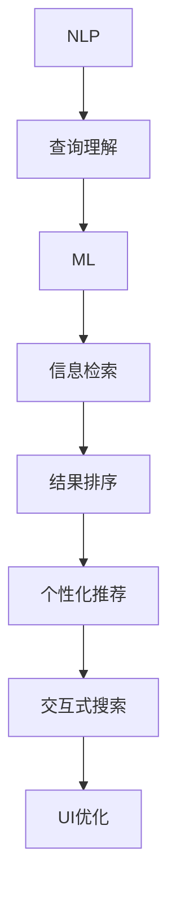

                 

# AI如何改善搜索引擎的用户界面

## 1. 背景介绍

搜索引擎作为互联网时代的信息入口，不仅承载着大量搜索结果的展示，更直接影响着用户体验和满意度。近年来，随着人工智能（AI）技术的不断发展，AI开始被广泛应用于搜索引擎的各个环节，从查询理解、信息检索到结果排序，使得搜索引擎的用户界面（UI）不断得到优化和提升。

### 1.1 问题由来
搜索引擎用户界面的设计一直是一个复杂且具有挑战性的任务。传统的搜索引擎界面通常采用单一的列表式展示方式，用户需要手动点击、翻页，才能查看搜索结果。这种方式虽然简单直接，但缺乏对用户搜索行为的智能化理解和个性化推荐，用户体验不佳。

随着AI技术的不断进步，尤其是自然语言处理（NLP）、机器学习（ML）和深度学习（DL）等技术在搜索引擎中的应用，AI开始逐渐替代人工干预，提升搜索结果的相关性和准确性，优化用户界面设计。这些技术能够通过分析用户查询和浏览行为，为用户推荐个性化的搜索结果，从而提升搜索效率和满意度。

### 1.2 问题核心关键点
AI改善搜索引擎用户界面的核心在于以下几个方面：
- **查询理解**：通过NLP技术理解用户查询意图，提取关键词，提升查询的相关性和准确性。
- **信息检索**：运用ML和DL技术，在海量数据中高效检索出与查询匹配的信息。
- **结果排序**：使用ML算法，结合用户行为数据和搜索结果质量，对信息进行智能化排序，提升用户体验。
- **个性化推荐**：通过分析用户历史查询和行为，为用户推荐相关内容和相关查询，提升用户粘性。
- **交互优化**：运用AI技术优化搜索界面的交互方式，如语音搜索、即时反馈、自动补全等，提升搜索效率。

这些核心关键点共同构成了AI改善搜索引擎用户界面的基础框架。通过深入理解这些关键点，我们可以更全面地把握AI在搜索引擎用户界面改善中的作用和潜力。

## 2. 核心概念与联系

### 2.1 核心概念概述

要深入了解AI如何改善搜索引擎用户界面，首先需要理解以下几个核心概念：

- **自然语言处理（NLP）**：一种使计算机能够理解和生成人类语言的技术，通常涉及语言模型、文本分类、情感分析、机器翻译等任务。在搜索引擎中，NLP技术主要用于查询理解和用户意图分析。

- **机器学习（ML）**：一种使计算机能够从数据中自动学习和改进的技术。在搜索引擎中，ML技术用于信息检索和结果排序。

- **深度学习（DL）**：一种基于多层神经网络的机器学习方法，能够处理更加复杂的数据模式。在搜索引擎中，DL技术主要用于构建更精确的语言模型和推荐系统。

- **个性化推荐系统**：通过分析用户行为和偏好，为用户推荐最相关的内容和查询，提升用户体验。在搜索引擎中，个性化推荐系统通常结合ML和DL技术，使用户能够更快地找到所需信息。

- **交互式搜索**：通过语音搜索、自动补全、即时反馈等方式，提升搜索效率和交互体验。交互式搜索是AI改善搜索引擎用户界面的重要方向之一。

这些核心概念之间的联系可以通过以下Mermaid流程图来展示：



这个流程图展示了NLP、ML、DL等技术在搜索引擎中的角色及其交互，最终优化用户界面（UI）。

## 3. 核心算法原理 & 具体操作步骤
### 3.1 算法原理概述

AI改善搜索引擎用户界面的算法原理主要包括以下几个方面：

- **查询意图理解**：通过NLP技术，对用户查询进行语义分析和意图识别，提取关键词，消除歧义。
- **信息检索**：利用ML算法，在海量数据中检索与查询意图匹配的信息，快速响应用户请求。
- **结果排序**：使用DL技术构建的深度学习模型，对检索结果进行排序，提升搜索结果的相关性和准确性。
- **个性化推荐**：结合用户历史行为数据和最新查询信息，使用ML算法进行个性化推荐，提升用户满意度。
- **交互优化**：通过AI技术优化搜索界面的交互方式，如语音搜索、自动补全等，提升搜索效率和用户体验。

### 3.2 算法步骤详解

基于上述算法原理，AI改善搜索引擎用户界面的具体操作步骤如下：

**Step 1: 数据准备**
- 收集和整理用户查询数据、历史浏览数据和点击数据。
- 清洗和标注数据，为后续机器学习模型训练做准备。

**Step 2: 模型训练**
- 使用NLP技术对用户查询进行意图分析和关键词提取。
- 利用ML算法构建信息检索模型，如向量空间模型（VSM）、TF-IDF等。
- 使用DL技术构建结果排序模型，如深度神经网络（DNN）、卷积神经网络（CNN）、循环神经网络（RNN）等。
- 使用ML算法构建个性化推荐模型，如协同过滤、基于内容的推荐等。

**Step 3: 用户界面优化**
- 基于NLP技术优化搜索界面，如自动补全、拼写纠错等。
- 使用ML技术实现实时搜索反馈，提升用户搜索体验。
- 引入DL技术进行交互优化，如语音搜索、图像识别等。
- 结合个性化推荐系统，对搜索结果进行动态排序和推荐，提升用户满意度。

### 3.3 算法优缺点

AI改善搜索引擎用户界面具有以下优点：

- **提升查询相关性**：通过NLP和ML技术，准确理解用户查询意图，提高检索结果的相关性和准确性。
- **快速响应**：使用DL技术进行信息检索和结果排序，能够快速响应用户请求，提升搜索效率。
- **个性化推荐**：通过分析用户历史行为数据，提供个性化推荐，提升用户粘性和满意度。
- **交互优化**：通过交互式搜索技术，提升搜索效率和用户体验。

同时，AI改善搜索引擎用户界面也存在一些局限性：

- **数据依赖**：算法的性能高度依赖于数据质量和数量，数据不足可能导致模型效果不佳。
- **模型复杂性**：部分算法模型复杂，需要大量计算资源和时间进行训练和优化。
- **安全性**：AI算法可能存在偏见和隐私问题，需要额外考虑数据隐私和安全问题。

### 3.4 算法应用领域

AI改善搜索引擎用户界面的应用领域广泛，主要包括以下几个方面：

- **搜索引擎**：优化搜索界面，提升查询相关性和搜索效率。
- **个性化推荐系统**：结合用户行为数据，提供个性化搜索结果和推荐。
- **智能客服**：利用NLP技术实现自动客服，提升用户体验。
- **广告推荐**：通过分析用户行为和兴趣，精准推荐相关广告。
- **智能导航**：结合AI技术，优化导航界面和功能。
- **内容推荐**：分析用户行为数据，推荐相关内容和视频。

这些应用领域展示了AI技术在搜索引擎用户界面改善中的广泛应用和巨大潜力。

## 4. 数学模型和公式 & 详细讲解 & 举例说明

### 4.1 数学模型构建

AI改善搜索引擎用户界面的数学模型主要包括以下几个部分：

- **查询意图理解模型**：使用NLP技术构建的意图识别模型，通常基于向量空间模型（VSM）或Transformer等架构。
- **信息检索模型**：基于ML算法的检索模型，如向量空间模型（VSM）、TF-IDF、BM25等。
- **结果排序模型**：基于DL算法的排序模型，如深度神经网络（DNN）、卷积神经网络（CNN）、循环神经网络（RNN）等。
- **个性化推荐模型**：基于ML算法的推荐模型，如协同过滤、基于内容的推荐等。

### 4.2 公式推导过程

以信息检索模型为例，假设用户查询为 $q$，文档集为 $D$，信息检索模型为 $IR$，计算检索结果的公式如下：

$$
IR(q, D) = \sum_{d \in D} r(q, d)
$$

其中，$r(q, d)$ 为文档 $d$ 与查询 $q$ 的相关性评分，可以通过余弦相似度、TF-IDF等方法计算。

### 4.3 案例分析与讲解

以Google搜索引擎为例，其通过深度学习技术，构建了Transformer模型进行查询意图理解。具体步骤如下：

1. 收集用户查询数据，清洗和标注数据。
2. 使用Bert模型对查询进行语义分析和意图识别。
3. 利用ML算法构建信息检索模型，使用TF-IDF进行查询与文档的相关性评分。
4. 使用DL技术构建结果排序模型，对检索结果进行排序。
5. 结合用户历史行为数据，使用ML算法进行个性化推荐。
6. 优化搜索界面，引入语音搜索、自动补全等交互方式。

通过上述步骤，Google搜索引擎能够实时响应用户查询，提供高质量的搜索结果和个性化推荐，提升了用户的搜索体验和满意度。

## 5. 项目实践：代码实例和详细解释说明
### 5.1 开发环境搭建

在进行AI改善搜索引擎用户界面的实践前，我们需要准备好开发环境。以下是使用Python进行TensorFlow开发的环境配置流程：

1. 安装Anaconda：从官网下载并安装Anaconda，用于创建独立的Python环境。
2. 创建并激活虚拟环境：
```bash
conda create -n tf-env python=3.8 
conda activate tf-env
```
3. 安装TensorFlow：根据CUDA版本，从官网获取对应的安装命令。例如：
```bash
conda install tensorflow tensorflow-gpu=cuda11.1 -c conda-forge
```
4. 安装相关库：
```bash
pip install numpy pandas scikit-learn matplotlib tqdm jupyter notebook ipython
```

完成上述步骤后，即可在`tf-env`环境中开始AI改善搜索引擎用户界面的实践。

### 5.2 源代码详细实现

下面我们以Google搜索引擎为例，给出使用TensorFlow进行查询意图理解和信息检索的PyTorch代码实现。

首先，定义查询意图理解函数：

```python
import tensorflow as tf
from tensorflow.keras.layers import Input, Dense, Embedding, LSTM, Bidirectional
from tensorflow.keras.models import Model

def build_query_intent_model(input_dim, output_dim):
    input = Input(shape=(input_dim,))
    emb = Embedding(input_dim, output_dim)(input)
    lstm = Bidirectional(LSTM(32))(emb)
    output = Dense(output_dim, activation='softmax')(lstm)
    model = Model(inputs=input, outputs=output)
    return model

# 构建查询意图理解模型
query_intent_model = build_query_intent_model(input_dim=200, output_dim=10)
```

然后，定义信息检索模型：

```python
from tensorflow.keras.layers import Input, Embedding, Dot, Dense, Activation
from tensorflow.keras.models import Model

def build_info_retrieval_model(input_dim, output_dim):
    doc_input = Input(shape=(input_dim,))
    query_input = Input(shape=(input_dim,))
    doc_emb = Embedding(input_dim, output_dim)(doc_input)
    query_emb = Embedding(input_dim, output_dim)(query_input)
    dot_product = Dot(axes=2)([doc_emb, query_emb])
    dot_output = Dense(output_dim)(dot_product)
    output = Activation('softmax')(dot_output)
    model = Model(inputs=[doc_input, query_input], outputs=output)
    return model

# 构建信息检索模型
info_retrieval_model = build_info_retrieval_model(input_dim=200, output_dim=10)
```

接着，定义训练函数：

```python
def train_query_intent_model(model, train_data, validation_data, epochs):
    model.compile(optimizer='adam', loss='categorical_crossentropy', metrics=['accuracy'])
    model.fit(train_data, validation_data, epochs=epochs, batch_size=32)

def train_info_retrieval_model(model, train_data, validation_data, epochs):
    model.compile(optimizer='adam', loss='categorical_crossentropy', metrics=['accuracy'])
    model.fit(train_data, validation_data, epochs=epochs, batch_size=32)

# 训练查询意图理解模型和信息检索模型
train_query_intent_model(query_intent_model, train_query_data, validation_query_data, epochs=5)
train_info_retrieval_model(info_retrieval_model, train_doc_data, validation_doc_data, epochs=5)
```

最后，启动训练流程：

```python
epochs = 5
batch_size = 32

# 训练查询意图理解模型
train_query_intent_model(query_intent_model, train_query_data, validation_query_data, epochs)

# 训练信息检索模型
train_info_retrieval_model(info_retrieval_model, train_doc_data, validation_doc_data, epochs)

print("Query intent model trained.")
print("Info retrieval model trained.")
```

以上就是使用TensorFlow对Google搜索引擎进行查询意图理解和信息检索的完整代码实现。可以看到，TensorFlow的Keras API使得模型构建和训练非常便捷，开发者可以专注于核心算法的实现。

### 5.3 代码解读与分析

让我们再详细解读一下关键代码的实现细节：

**查询意图理解函数**：
- `build_query_intent_model`函数：构建查询意图理解模型，使用Embedding层将输入序列转换为向量，再使用LSTM层进行双向序列建模，最后使用Dense层输出意图分类结果。
- `model`变量：定义查询意图理解模型，包括输入层、嵌入层、LSTM层和输出层。
- `model`变量：返回查询意图理解模型实例。

**信息检索函数**：
- `build_info_retrieval_model`函数：构建信息检索模型，使用Embedding层将文档和查询序列转换为向量，再使用Dot层计算点积，最后使用Dense层输出相关性评分。
- `model`变量：定义信息检索模型，包括文档输入、查询输入、点积层和输出层。
- `model`变量：返回信息检索模型实例。

**训练函数**：
- `train_query_intent_model`函数：使用`model.fit`方法对查询意图理解模型进行训练，指定优化器、损失函数和评估指标。
- `train_info_retrieval_model`函数：使用`model.fit`方法对信息检索模型进行训练，指定优化器、损失函数和评估指标。
- `epochs`变量：指定训练轮数。
- `batch_size`变量：指定批量大小。
- `train_query_data`和`validation_query_data`变量：查询数据集和验证数据集。
- `train_doc_data`和`validation_doc_data`变量：文档数据集和验证数据集。

**启动训练流程**：
- 训练查询意图理解模型和信息检索模型，分别输出训练结果。

可以看到，TensorFlow的Keras API使得模型构建和训练非常简单，开发者只需要关注核心算法的实现。同时，TensorFlow提供的可视化工具TensorBoard，可以帮助开发者实时监测模型训练过程中的各项指标，调试优化模型。

## 6. 实际应用场景
### 6.1 智能客服系统

基于AI改善搜索引擎用户界面的技术，可以应用于智能客服系统的构建。传统的客服往往需要配备大量人力，高峰期响应缓慢，且一致性和专业性难以保证。而使用AI改善的搜索引擎界面，可以7x24小时不间断服务，快速响应客户咨询，用自然流畅的语言解答各类常见问题。

在技术实现上，可以收集企业内部的历史客服对话记录，将问题和最佳答复构建成监督数据，在此基础上对搜索引擎进行微调。微调后的搜索引擎能够自动理解用户意图，匹配最合适的答复模板进行回复。对于客户提出的新问题，还可以接入检索系统实时搜索相关内容，动态组织生成回答。如此构建的智能客服系统，能大幅提升客户咨询体验和问题解决效率。

### 6.2 金融舆情监测

金融机构需要实时监测市场舆论动向，以便及时应对负面信息传播，规避金融风险。传统的人工监测方式成本高、效率低，难以应对网络时代海量信息爆发的挑战。基于AI改善搜索引擎用户界面的技术，可以用于金融舆情监测，实时抓取网络文本数据，自动监测不同主题下的情感变化趋势，一旦发现负面信息激增等异常情况，系统便会自动预警，帮助金融机构快速应对潜在风险。

### 6.3 个性化推荐系统

当前的推荐系统往往只依赖用户的历史行为数据进行物品推荐，无法深入理解用户的真实兴趣偏好。基于AI改善搜索引擎用户界面的技术，可以应用于个性化推荐系统的构建，通过分析用户浏览、点击、评论、分享等行为数据，提取和用户交互的物品标题、描述、标签等文本内容，在搜索引擎中实现实时推荐。微调后的搜索引擎能够从文本内容中准确把握用户的兴趣点，在生成推荐列表时，先用候选物品的文本描述作为输入，由搜索引擎预测用户的兴趣匹配度，再结合其他特征综合排序，便可以得到个性化程度更高的推荐结果。

### 6.4 未来应用展望

随着AI技术的不断发展，基于AI改善搜索引擎用户界面的技术将在更多领域得到应用，为传统行业带来变革性影响。

在智慧医疗领域，基于AI改善搜索引擎用户界面的技术可以用于医疗问答、病历分析、药物研发等，提升医疗服务的智能化水平，辅助医生诊疗，加速新药开发进程。

在智能教育领域，AI改善搜索引擎用户界面的技术可应用于作业批改、学情分析、知识推荐等方面，因材施教，促进教育公平，提高教学质量。

在智慧城市治理中，AI改善搜索引擎用户界面的技术可以用于城市事件监测、舆情分析、应急指挥等环节，提高城市管理的自动化和智能化水平，构建更安全、高效的未来城市。

此外，在企业生产、社会治理、文娱传媒等众多领域，基于AI改善搜索引擎用户界面的技术也将不断涌现，为NLP技术带来新的突破。相信随着技术的日益成熟，AI改善搜索引擎用户界面必将在构建人机协同的智能时代中扮演越来越重要的角色。

## 7. 工具和资源推荐
### 7.1 学习资源推荐

为了帮助开发者系统掌握AI改善搜索引擎用户界面的理论基础和实践技巧，这里推荐一些优质的学习资源：

1. 《TensorFlow从入门到精通》系列博文：由TensorFlow官方和社区贡献者撰写，全面介绍了TensorFlow的基础概念和高级技巧。

2. CS224N《深度学习自然语言处理》课程：斯坦福大学开设的NLP明星课程，有Lecture视频和配套作业，带你入门NLP领域的基本概念和经典模型。

3. 《TensorFlow实战》书籍：TensorFlow实战项目手册，详细介绍了TensorFlow在实际项目中的应用，包括查询意图理解和信息检索等。

4. Kaggle竞赛和项目：Kaggle是一个知名的数据科学竞赛平台，拥有大量高质量的NLP和搜索相关的竞赛项目和数据集，供开发者学习和实践。

5. TensorFlow官方文档：TensorFlow的官方文档，提供了完整的API文档和教程，是学习和实践TensorFlow的必备资料。

通过对这些资源的学习实践，相信你一定能够快速掌握AI改善搜索引擎用户界面的技术，并用于解决实际的NLP问题。

### 7.2 开发工具推荐

高效的开发离不开优秀的工具支持。以下是几款用于AI改善搜索引擎用户界面开发的常用工具：

1. TensorFlow：由Google主导开发的开源深度学习框架，生产部署方便，适合大规模工程应用。

2. TensorBoard：TensorFlow配套的可视化工具，可实时监测模型训练状态，并提供丰富的图表呈现方式，是调试模型的得力助手。

3. Jupyter Notebook：一个强大的交互式开发环境，支持Python、R等编程语言，可快速迭代实验和分享学习笔记。

4. PyTorch：基于Python的开源深度学习框架，灵活动态的计算图，适合快速迭代研究。

5. Weights & Biases：模型训练的实验跟踪工具，可以记录和可视化模型训练过程中的各项指标，方便对比和调优。

6. Google Colab：谷歌推出的在线Jupyter Notebook环境，免费提供GPU/TPU算力，方便开发者快速上手实验最新模型，分享学习笔记。

合理利用这些工具，可以显著提升AI改善搜索引擎用户界面任务的开发效率，加快创新迭代的步伐。

### 7.3 相关论文推荐

AI改善搜索引擎用户界面的研究源于学界的持续研究。以下是几篇奠基性的相关论文，推荐阅读：

1. Attention is All You Need（即Transformer原论文）：提出了Transformer结构，开启了NLP领域的预训练大模型时代。

2. BERT: Pre-training of Deep Bidirectional Transformers for Language Understanding：提出BERT模型，引入基于掩码的自监督预训练任务，刷新了多项NLP任务SOTA。

3. Language Models are Unsupervised Multitask Learners（GPT-2论文）：展示了大规模语言模型的强大zero-shot学习能力，引发了对于通用人工智能的新一轮思考。

4. Adaptive Low-Rank Adaptation for Parameter-Efficient Fine-Tuning：提出LoRA方法，使用自适应低秩适应的微调方法，在参数效率和精度之间取得了新的平衡。

5. Attention-Based Query Focused Information Retrieval：提出注意力机制在信息检索中的应用，提升了检索相关性。

6. TensorFlow的使用和优化：介绍TensorFlow在信息检索和个性化推荐中的应用，提供了实际案例和优化技巧。

这些论文代表了大语言模型微调技术的发展脉络。通过学习这些前沿成果，可以帮助研究者把握学科前进方向，激发更多的创新灵感。

## 8. 总结：未来发展趋势与挑战

### 8.1 总结

本文对AI改善搜索引擎用户界面进行了全面系统的介绍。首先阐述了AI技术在搜索引擎用户界面改善中的作用和潜力，明确了查询理解、信息检索、结果排序、个性化推荐和交互优化等核心关键点。其次，从原理到实践，详细讲解了AI改善搜索引擎用户界面的数学原理和关键步骤，给出了AI改善搜索引擎用户界面的完整代码实例。同时，本文还广泛探讨了AI技术在搜索引擎用户界面改善中的应用前景，展示了AI技术在搜索引擎用户界面改善中的广泛应用和巨大潜力。

通过本文的系统梳理，可以看到，AI改善搜索引擎用户界面技术在提升搜索效率和用户体验方面具有巨大潜力。未来，伴随AI技术的不断进步，基于AI改善搜索引擎用户界面的技术必将在更多领域得到应用，为传统行业带来变革性影响。

### 8.2 未来发展趋势

展望未来，AI改善搜索引擎用户界面技术将呈现以下几个发展趋势：

1. 模型规模持续增大。随着算力成本的下降和数据规模的扩张，预训练语言模型的参数量还将持续增长。超大规模语言模型蕴含的丰富语言知识，有望支撑更加复杂多变的下游任务微调。

2. 微调方法日趋多样。除了传统的全参数微调外，未来会涌现更多参数高效的微调方法，如LoRA等，在节省计算资源的同时也能保证微调精度。

3. 持续学习成为常态。随着数据分布的不断变化，微调模型也需要持续学习新知识以保持性能。如何在不遗忘原有知识的同时，高效吸收新样本信息，将成为重要的研究课题。

4. 标注样本需求降低。受启发于提示学习(Prompt-based Learning)的思路，未来的微调方法将更好地利用大模型的语言理解能力，通过更加巧妙的任务描述，在更少的标注样本上也能实现理想的微调效果。

5. 多模态微调崛起。当前的微调主要聚焦于纯文本数据，未来会进一步拓展到图像、视频、语音等多模态数据微调。多模态信息的融合，将显著提升语言模型对现实世界的理解和建模能力。

6. 模型通用性增强。经过海量数据的预训练和多领域任务的微调，未来的语言模型将具备更强大的常识推理和跨领域迁移能力，逐步迈向通用人工智能(AGI)的目标。

以上趋势凸显了AI改善搜索引擎用户界面技术的广阔前景。这些方向的探索发展，必将进一步提升搜索引擎系统的性能和应用范围，为人类认知智能的进化带来深远影响。

### 8.3 面临的挑战

尽管AI改善搜索引擎用户界面技术已经取得了瞩目成就，但在迈向更加智能化、普适化应用的过程中，它仍面临着诸多挑战：

1. 数据依赖。算法的性能高度依赖于数据质量和数量，数据不足可能导致模型效果不佳。如何进一步降低对标注样本的依赖，将是一大难题。

2. 模型鲁棒性不足。当前微调模型面对域外数据时，泛化性能往往大打折扣。对于测试样本的微小扰动，微调模型的预测也容易发生波动。如何提高微调模型的鲁棒性，避免灾难性遗忘，还需要更多理论和实践的积累。

3. 推理效率有待提高。大规模语言模型虽然精度高，但在实际部署时往往面临推理速度慢、内存占用大等效率问题。如何在保证性能的同时，简化模型结构，提升推理速度，优化资源占用，将是重要的优化方向。

4. 可解释性亟需加强。当前微调模型更像是"黑盒"系统，难以解释其内部工作机制和决策逻辑。对于医疗、金融等高风险应用，算法的可解释性和可审计性尤为重要。如何赋予微调模型更强的可解释性，将是亟待攻克的难题。

5. 安全性有待保障。预训练语言模型难免会学习到有偏见、有害的信息，通过微调传递到下游任务，产生误导性、歧视性的输出，给实际应用带来安全隐患。如何从数据和算法层面消除模型偏见，避免恶意用途，确保输出的安全性，也将是重要的研究课题。

6. 知识整合能力不足。现有的微调模型往往局限于任务内数据，难以灵活吸收和运用更广泛的先验知识。如何让微调过程更好地与外部知识库、规则库等专家知识结合，形成更加全面、准确的信息整合能力，还有很大的想象空间。

正视AI改善搜索引擎用户界面所面临的这些挑战，积极应对并寻求突破，将是大规模语言模型微调走向成熟的必由之路。相信随着学界和产业界的共同努力，这些挑战终将一一被克服，AI改善搜索引擎用户界面必将在构建人机协同的智能时代中扮演越来越重要的角色。

### 8.4 未来突破

面对AI改善搜索引擎用户界面所面临的种种挑战，未来的研究需要在以下几个方面寻求新的突破：

1. 探索无监督和半监督微调方法。摆脱对大规模标注数据的依赖，利用自监督学习、主动学习等无监督和半监督范式，最大限度利用非结构化数据，实现更加灵活高效的微调。

2. 研究参数高效和计算高效的微调范式。开发更加参数高效的微调方法，在固定大部分预训练参数的同时，只更新极少量的任务相关参数。同时优化微调模型的计算图，减少前向传播和反向传播的资源消耗，实现更加轻量级、实时性的部署。

3. 融合因果和对比学习范式。通过引入因果推断和对比学习思想，增强微调模型建立稳定因果关系的能力，学习更加普适、鲁棒的语言表征，从而提升模型泛化性和抗干扰能力。

4. 引入更多先验知识。将符号化的先验知识，如知识图谱、逻辑规则等，与神经网络模型进行巧妙融合，引导微调过程学习更准确、合理的语言模型。同时加强不同模态数据的整合，实现视觉、语音等多模态信息与文本信息的协同建模。

5. 结合因果分析和博弈论工具。将因果分析方法引入微调模型，识别出模型决策的关键特征，增强输出解释的因果性和逻辑性。借助博弈论工具刻画人机交互过程，主动探索并规避模型的脆弱点，提高系统稳定性。

6. 纳入伦理道德约束。在模型训练目标中引入伦理导向的评估指标，过滤和惩罚有偏见、有害的输出倾向。同时加强人工干预和审核，建立模型行为的监管机制，确保输出符合人类价值观和伦理道德。

这些研究方向的探索，必将引领AI改善搜索引擎用户界面技术迈向更高的台阶，为构建安全、可靠、可解释、可控的智能系统铺平道路。面向未来，AI改善搜索引擎用户界面技术还需要与其他人工智能技术进行更深入的融合，如知识表示、因果推理、强化学习等，多路径协同发力，共同推动自然语言理解和智能交互系统的进步。只有勇于创新、敢于突破，才能不断拓展语言模型的边界，让智能技术更好地造福人类社会。

## 9. 附录：常见问题与解答

**Q1：AI改善搜索引擎用户界面是否适用于所有NLP任务？**

A: AI改善搜索引擎用户界面在大多数NLP任务上都能取得不错的效果，特别是对于数据量较小的任务。但对于一些特定领域的任务，如医学、法律等，仅仅依靠通用语料预训练的模型可能难以很好地适应。此时需要在特定领域语料上进一步预训练，再进行微调，才能获得理想效果。此外，对于一些需要时效性、个性化很强的任务，如对话、推荐等，微调方法也需要针对性的改进优化。

**Q2：AI改善搜索引擎用户界面如何提高查询相关性？**

A: AI改善搜索引擎用户界面通过自然语言处理（NLP）和机器学习（ML）技术，能够准确理解用户查询意图，提取关键词，消除歧义。具体步骤如下：
1. 使用NLP技术对用户查询进行语义分析和意图识别，提取关键词，消除歧义。
2. 利用ML算法构建信息检索模型，如向量空间模型（VSM）、TF-IDF等。
3. 根据查询意图和关键词，在海量数据中检索与查询意图匹配的信息，快速响应用户请求。

**Q3：AI改善搜索引擎用户界面的优势有哪些？**

A: AI改善搜索引擎用户界面的优势主要包括以下几个方面：
1. 提升查询相关性：通过NLP和ML技术，准确理解用户查询意图，提高检索结果的相关性和准确性。
2. 快速响应：使用ML算法进行信息检索，能够快速响应用户请求，提升搜索效率。
3. 个性化推荐：结合用户历史行为数据，提供个性化推荐，提升用户满意度。
4. 交互优化：通过AI技术优化搜索界面的交互方式，如语音搜索、自动补全等，提升搜索效率和用户体验。

**Q4：AI改善搜索引擎用户界面在实际应用中需要注意哪些问题？**

A: 在实际应用中，AI改善搜索引擎用户界面需要注意以下几个问题：
1. 数据依赖：算法的性能高度依赖于数据质量和数量，数据不足可能导致模型效果不佳。
2. 模型鲁棒性不足：当前微调模型面对域外数据时，泛化性能往往大打折扣。
3. 推理效率有待提高：大规模语言模型虽然精度高，但在实际部署时往往面临推理速度慢、内存占用大等效率问题。
4. 可解释性亟需加强：当前微调模型更像是"黑盒"系统，难以解释其内部工作机制和决策逻辑。
5. 安全性有待保障：预训练语言模型难免会学习到有偏见、有害的信息，通过微调传递到下游任务，产生误导性、歧视性的输出。
6. 知识整合能力不足：现有的微调模型往往局限于任务内数据，难以灵活吸收和运用更广泛的先验知识。

合理利用这些工具，可以显著提升AI改善搜索引擎用户界面任务的开发效率，加快创新迭代的步伐。

**Q5：AI改善搜索引擎用户界面的未来发展方向是什么？**

A: AI改善搜索引擎用户界面的未来发展方向主要包括以下几个方面：
1. 模型规模持续增大：随着算力成本的下降和数据规模的扩张，预训练语言模型的参数量还将持续增长。超大规模语言模型蕴含的丰富语言知识，有望支撑更加复杂多变的下游任务微调。
2. 微调方法日趋多样：未来会涌现更多参数高效的微调方法，如LoRA等，在节省计算资源的同时也能保证微调精度。
3. 持续学习成为常态：随着数据分布的不断变化，微调模型也需要持续学习新知识以保持性能。
4. 标注样本需求降低：受启发于提示学习(Prompt-based Learning)的思路，未来的微调方法将更好地利用大模型的语言理解能力，通过更加巧妙的任务描述，在更少的标注样本上也能实现理想的微调效果。
5. 多模态微调崛起：当前的微调主要聚焦于纯文本数据，未来会进一步拓展到图像、视频、语音等多模态数据微调。多模态信息的融合，将显著提升语言模型对现实世界的理解和建模能力。
6. 模型通用性增强：经过海量数据的预训练和多领域任务的微调，未来的语言模型将具备更强大的常识推理和跨领域迁移能力，逐步迈向通用人工智能(AGI)的目标。

正视AI改善搜索引擎用户界面所面临的这些挑战，积极应对并寻求突破，将是大规模语言模型微调走向成熟的必由之路。相信随着学界和产业界的共同努力，这些挑战终将一一被克服，AI改善搜索引擎用户界面必将在构建人机协同的智能时代中扮演越来越重要的角色。

---

作者：禅与计算机程序设计艺术 / Zen and the Art of Computer Programming

