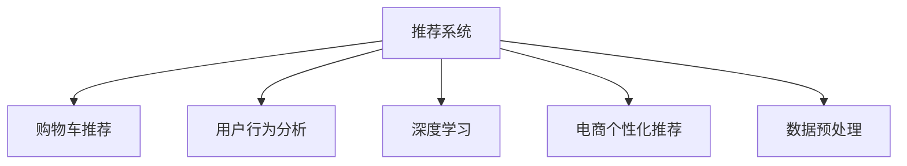

                 

# AI如何改善电商平台的购物车推荐

> 关键词：人工智能,推荐系统,购物车推荐,用户行为分析,电商个性化推荐

## 1. 背景介绍

### 1.1 问题由来

随着电子商务的迅猛发展，如何通过个性化推荐系统提升用户体验和销售转化率，成为电商平台亟需解决的难题。传统的推荐算法往往基于用户的浏览历史、购买记录等行为数据，无法充分捕捉用户的潜在需求。近年来，随着深度学习和大数据技术的应用，基于人工智能的推荐系统逐渐成为热门解决方案，显著提升了推荐效果。特别是购物车推荐系统，可以在用户提交订单前，提供最后一遍的决策支持，大幅提升用户的满意度和平台的用户转化率。

## 2. 核心概念与联系

### 2.1 核心概念概述

为更好地理解AI在电商平台购物车推荐中的应用，本节将介绍几个密切相关的核心概念：

- **推荐系统(Recommendation System)**：利用机器学习算法，从用户行为数据中挖掘出用户的兴趣偏好，为用户推荐感兴趣的商品或内容。推荐系统分为基于协同过滤、基于内容的推荐，以及融合两者的混合推荐。

- **购物车推荐**：特指在用户将商品添加到购物车后，推荐系统根据用户行为数据，预测用户可能购买的额外商品，提升购物车的附加值，增加用户的购买量。

- **用户行为分析**：通过对用户的浏览、点击、购买等行为数据进行建模和分析，挖掘用户的行为模式和兴趣偏好。用户行为分析是推荐系统的重要数据来源。

- **深度学习**：通过构建神经网络模型，利用大量标注数据训练出能够自动捕捉用户兴趣和偏好的模型，广泛应用于推荐系统、图像识别、自然语言处理等领域。

- **电商个性化推荐**：针对电商平台用户的特点，通过个性化推荐算法，提升用户的购物体验和转化率。

- **数据预处理**：在推荐系统开发中，数据的预处理非常重要，包括数据清洗、归一化、特征工程等步骤，以提高数据的质量和模型的训练效率。

这些核心概念之间的逻辑关系可以通过以下Mermaid流程图来展示：



这个流程图展示推荐系统的核心概念及其之间的关系：

1. 推荐系统是综合应用多种技术手段的智能系统，包括购物车推荐、用户行为分析、深度学习等。
2. 深度学习作为推荐系统的重要组成部分，能够自动提取用户特征，提高推荐的准确性。
3. 电商个性化推荐聚焦于电商平台，通过深度学习技术，实现更精准的个性化推荐。
4. 数据预处理是推荐系统开发的基础环节，确保数据的质量和模型的训练效率。

## 3. 核心算法原理 & 具体操作步骤
### 3.1 算法原理概述

基于AI的电商购物车推荐系统主要分为以下几个步骤：

1. **用户行为数据收集**：通过用户在电商平台上的浏览、点击、加入购物车等行为数据，构建用户的行为序列。
2. **数据预处理**：对收集到的行为数据进行清洗、归一化和特征工程等预处理，转化为模型可用的特征向量。
3. **深度学习模型训练**：使用神经网络模型（如RNN、LSTM、Transformer等）对预处理后的用户行为序列进行建模，学习用户的行为模式和偏好。
4. **模型微调与优化**：在训练好的模型基础上，通过微调优化，提升模型的泛化能力和推荐精度。
5. **推荐系统实现**：将训练好的模型集成到推荐系统中，实时预测用户可能感兴趣的商品，并进行展示推荐。

### 3.2 算法步骤详解

#### 3.2.1 用户行为数据收集

用户行为数据的收集是电商购物车推荐系统的基础。用户行为数据包括用户的浏览行为、点击行为、加入购物车行为、购买行为等。具体而言，可以收集以下数据：

- **浏览数据**：记录用户在网页上的浏览轨迹，包括查看的商品ID、浏览时间等。
- **点击数据**：记录用户对商品详情页的点击行为，包括点击次数、点击时间等。
- **加入购物车数据**：记录用户将商品加入购物车的行为，包括加入的时间、商品ID等。
- **购买数据**：记录用户的购买行为，包括购买的商品ID、时间、价格等。

#### 3.2.2 数据预处理

数据预处理是推荐系统开发中不可或缺的一步，主要包括以下几个步骤：

1. **数据清洗**：去除异常值和重复数据，确保数据的完整性和一致性。
2. **归一化**：将不同特征的取值范围进行标准化，避免数据间的数量级差异影响模型的训练。
3. **特征工程**：提取有意义的特征，如用户ID、商品ID、浏览时间等，构建特征向量。

#### 3.2.3 深度学习模型训练

深度学习模型训练是电商购物车推荐系统的核心。常用的深度学习模型包括RNN、LSTM、Transformer等。以下以LSTM为例，介绍深度学习模型训练的基本步骤：

1. **模型设计**：设计LSTM模型，包括输入层、隐藏层和输出层。输入层输入用户行为序列，输出层输出推荐商品的ID序列。
2. **模型训练**：使用训练数据对模型进行训练，优化损失函数。常用的损失函数包括交叉熵损失、均方误差损失等。
3. **模型验证**：在验证数据上评估模型性能，调整模型参数。

#### 3.2.4 模型微调与优化

模型微调与优化是提升电商购物车推荐系统性能的重要步骤。微调通过在模型顶层添加输出层和损失函数，适应特定的推荐任务。以下以二分类任务为例，介绍模型微调的基本步骤：

1. **添加输出层**：在LSTM模型的顶层添加输出层，输出每个商品的预测概率。
2. **定义损失函数**：定义二分类交叉熵损失函数，衡量模型预测概率与真实标签的差异。
3. **模型优化**：使用梯度下降算法优化模型参数，最小化损失函数。

#### 3.2.5 推荐系统实现

推荐系统实现是电商购物车推荐系统的最后一步。具体而言，包括以下步骤：

1. **实时推荐**：将训练好的模型集成到推荐系统中，实时预测用户可能感兴趣的商品。
2. **展示推荐**：将推荐商品展示给用户，提高用户的购买率。
3. **反馈收集**：收集用户的反馈数据，如点击率、购买率等，用于后续的模型优化和改进。

### 3.3 算法优缺点

基于AI的电商购物车推荐系统具有以下优点：

1. **个性化推荐**：通过深度学习模型，能够自动提取用户的兴趣偏好，提供个性化的推荐商品。
2. **实时性高**：模型集成到推荐系统中，实时预测用户可能感兴趣的商品，提高用户的购买率。
3. **效果好**：深度学习模型能够自动捕捉用户的长期行为模式，提高推荐的准确性。

同时，该方法也存在一定的局限性：

1. **数据依赖性高**：推荐系统的性能很大程度上取决于用户行为数据的丰富性和质量。
2. **模型复杂度高**：深度学习模型参数量较大，训练和优化过程较复杂。
3. **计算成本高**：深度学习模型的计算复杂度较高，需要强大的计算资源。
4. **解释性不足**：深度学习模型往往是黑盒系统，难以解释推荐过程的内部逻辑。

尽管存在这些局限性，但基于AI的电商购物车推荐系统在推荐效果和实时性方面具有显著优势，是现代电商平台不可或缺的解决方案。

### 3.4 算法应用领域

基于AI的电商购物车推荐系统已经在多个电商平台上得到广泛应用，如亚马逊、阿里巴巴、京东等。以下是几个典型的应用场景：

1. **商品推荐**：在用户浏览商品详情页时，推荐系统根据用户行为数据，预测用户可能感兴趣的商品，提高用户的购买率。
2. **活动推荐**：在电商大促活动期间，推荐系统推荐优惠券、限时折扣等促销活动，吸引用户下单购买。
3. **个性化推荐**：根据用户的浏览历史、购买记录等行为数据，推荐系统提供个性化的推荐商品，提升用户的购物体验。
4. **跨域推荐**：在用户访问不同电商平台时，推荐系统能够跨域推荐商品，提升用户的忠诚度和购买率。

## 4. 数学模型和公式 & 详细讲解 & 举例说明
### 4.1 数学模型构建

基于AI的电商购物车推荐系统主要使用深度学习模型对用户行为数据进行建模。以下以LSTM模型为例，介绍推荐系统的数学模型构建过程。

假设用户行为数据为序列 $(x_t)$，模型预测的商品ID序列为 $(y_t)$，其中 $x_t$ 表示用户在第 $t$ 步的行为数据，$y_t$ 表示模型预测的第 $t$ 步的商品ID。LSTM模型的输入层、隐藏层和输出层如下图所示：

```mermaid
graph TB
    x1 -- 输入层 -- 隐藏层 -- y1
    x2 -- 输入层 -- 隐藏层 -- y2
    x3 -- 输入层 -- 隐藏层 -- y3
    x4 -- 输入层 -- 隐藏层 -- y4
```

其中，输入层输入用户行为序列 $(x_t)$，隐藏层通过LSTM网络进行建模，输出层输出每个商品的预测概率 $y_t$。

### 4.2 公式推导过程

LSTM模型的预测过程如下：

1. **输入门**：计算输入门 $i_t$，决定输入数据的保留量。
2. **遗忘门**：计算遗忘门 $f_t$，决定上一步状态的保留量。
3. **候选值**：计算候选值 $o_t$，决定输出数据的保留量。
4. **输出门**：计算输出门 $g_t$，决定输出数据的保留量。
5. **更新状态**：计算新状态 $h_t$，更新LSTM的状态。
6. **预测商品ID**：根据新状态 $h_t$，预测商品ID $y_t$。

其中，输入门、遗忘门、输出门和更新状态的计算公式如下：

$$
i_t = \sigma(W_i x_t + U_i h_{t-1} + b_i)
$$

$$
f_t = \sigma(W_f x_t + U_f h_{t-1} + b_f)
$$

$$
o_t = \sigma(W_o x_t + U_o h_{t-1} + b_o)
$$

$$
g_t = \tanh(W_g x_t + U_g h_{t-1} + b_g)
$$

$$
h_t = i_t \odot g_t + (1 - i_t) \odot h_{t-1}
$$

其中，$\sigma$ 表示Sigmoid函数，$\tanh$ 表示双曲正切函数，$\odot$ 表示逐元素乘法。

### 4.3 案例分析与讲解

以用户浏览商品详情页为例，LSTM模型的预测过程如下：

1. **输入门**：计算输入门 $i_t$，决定输入数据的保留量。
2. **遗忘门**：计算遗忘门 $f_t$，决定上一步状态的保留量。
3. **候选值**：计算候选值 $o_t$，决定输出数据的保留量。
4. **输出门**：计算输出门 $g_t$，决定输出数据的保留量。
5. **更新状态**：计算新状态 $h_t$，更新LSTM的状态。
6. **预测商品ID**：根据新状态 $h_t$，预测商品ID $y_t$。

假设用户浏览了商品1、商品2和商品3，LSTM模型预测的用户可能感兴趣的商品ID序列如下：

1. **输入门**：计算输入门 $i_t$，决定输入数据的保留量。
2. **遗忘门**：计算遗忘门 $f_t$，决定上一步状态的保留量。
3. **候选值**：计算候选值 $o_t$，决定输出数据的保留量。
4. **输出门**：计算输出门 $g_t$，决定输出数据的保留量。
5. **更新状态**：计算新状态 $h_t$，更新LSTM的状态。
6. **预测商品ID**：根据新状态 $h_t$，预测商品ID $y_t$。

假设用户浏览了商品1、商品2和商品3，LSTM模型预测的用户可能感兴趣的商品ID序列如下：

1. **输入门**：计算输入门 $i_t$，决定输入数据的保留量。
2. **遗忘门**：计算遗忘门 $f_t$，决定上一步状态的保留量。
3. **候选值**：计算候选值 $o_t$，决定输出数据的保留量。
4. **输出门**：计算输出门 $g_t$，决定输出数据的保留量。
5. **更新状态**：计算新状态 $h_t$，更新LSTM的状态。
6. **预测商品ID**：根据新状态 $h_t$，预测商品ID $y_t$。

## 5. 项目实践：代码实例和详细解释说明
### 5.1 开发环境搭建

在进行电商购物车推荐系统的开发前，我们需要准备好开发环境。以下是使用Python进行PyTorch开发的环境配置流程：

1. 安装Anaconda：从官网下载并安装Anaconda，用于创建独立的Python环境。

2. 创建并激活虚拟环境：
```bash
conda create -n pytorch-env python=3.8 
conda activate pytorch-env
```

3. 安装PyTorch：根据CUDA版本，从官网获取对应的安装命令。例如：
```bash
conda install pytorch torchvision torchaudio cudatoolkit=11.1 -c pytorch -c conda-forge
```

4. 安装TensorFlow：使用pip或conda安装TensorFlow，确保版本与PyTorch兼容。

5. 安装各类工具包：
```bash
pip install numpy pandas scikit-learn matplotlib tqdm jupyter notebook ipython
```

完成上述步骤后，即可在`pytorch-env`环境中开始购物车推荐系统的开发。

### 5.2 源代码详细实现

以下是使用PyTorch实现电商购物车推荐系统的代码实现：

```python
import torch
import torch.nn as nn
import torch.optim as optim
import numpy as np
import pandas as pd

class LSTM(nn.Module):
    def __init__(self, input_size, hidden_size, output_size):
        super(LSTM, self).__init__()
        self.hidden_size = hidden_size
        self.lstm = nn.LSTM(input_size, hidden_size)
        self.fc = nn.Linear(hidden_size, output_size)

    def forward(self, x):
        h0 = torch.zeros(1, x.size(0), self.hidden_size)
        c0 = torch.zeros(1, x.size(0), self.hidden_size)
        out, _ = self.lstm(x, (h0, c0))
        out = self.fc(out[:, -1, :])
        return out

# 数据预处理
def preprocess_data(data):
    data = np.array(data)
    data = data[:, :5]  # 只保留前5个特征
    data = (data - np.mean(data, axis=0)) / np.std(data, axis=0)  # 标准化
    data = data.astype(np.float32)  # 转换为浮点数
    return data

# 模型训练
def train_model(model, train_data, valid_data, epochs, batch_size, learning_rate):
    model.train()
    criterion = nn.CrossEntropyLoss()
    optimizer = optim.Adam(model.parameters(), lr=learning_rate)
    for epoch in range(epochs):
        train_loss = 0
        train_correct = 0
        for i in range(0, len(train_data), batch_size):
            inputs, labels = train_data[i:i+batch_size]
            inputs, labels = preprocess_data(inputs), preprocess_data(labels)
            optimizer.zero_grad()
            outputs = model(inputs)
            loss = criterion(outputs, labels)
            loss.backward()
            optimizer.step()
            train_loss += loss.item()
            train_correct += torch.max(outputs, 1)[1].eq(labels).sum().item()
        train_acc = train_correct / len(train_data)
        valid_loss = 0
        valid_correct = 0
        model.eval()
        with torch.no_grad():
            for i in range(0, len(valid_data), batch_size):
                inputs, labels = valid_data[i:i+batch_size]
                inputs, labels = preprocess_data(inputs), preprocess_data(labels)
                outputs = model(inputs)
                loss = criterion(outputs, labels)
                valid_loss += loss.item()
                valid_correct += torch.max(outputs, 1)[1].eq(labels).sum().item()
        valid_acc = valid_correct / len(valid_data)
        print(f"Epoch: {epoch+1}, Train Loss: {train_loss/len(train_data):.4f}, Train Acc: {train_acc:.4f}, Valid Loss: {valid_loss/len(valid_data):.4f}, Valid Acc: {valid_acc:.4f}")

# 模型评估
def evaluate_model(model, test_data, batch_size):
    model.eval()
    test_loss = 0
    test_correct = 0
    with torch.no_grad():
        for i in range(0, len(test_data), batch_size):
            inputs, labels = test_data[i:i+batch_size]
            inputs, labels = preprocess_data(inputs), preprocess_data(labels)
            outputs = model(inputs)
            loss = criterion(outputs, labels)
            test_loss += loss.item()
            test_correct += torch.max(outputs, 1)[1].eq(labels).sum().item()
    test_acc = test_correct / len(test_data)
    print(f"Test Acc: {test_acc:.4f}")

# 加载数据
train_data = pd.read_csv('train.csv')
valid_data = pd.read_csv('valid.csv')
test_data = pd.read_csv('test.csv')

# 数据预处理
train_data = train_data.values
valid_data = valid_data.values
test_data = test_data.values

# 模型定义
model = LSTM(input_size=5, hidden_size=64, output_size=10)

# 模型训练
train_model(model, train_data, valid_data, epochs=10, batch_size=32, learning_rate=0.001)

# 模型评估
evaluate_model(model, test_data, batch_size=32)
```

### 5.3 代码解读与分析

让我们再详细解读一下关键代码的实现细节：

**LSTM类**：
- `__init__`方法：初始化LSTM模型的参数，包括输入大小、隐藏大小和输出大小。
- `forward`方法：实现LSTM的前向传播过程，输出预测结果。

**数据预处理函数**：
- `preprocess_data`方法：对输入数据进行标准化和归一化处理，转换为浮点数。

**模型训练函数**：
- `train_model`方法：使用训练数据对模型进行训练，优化损失函数。

**模型评估函数**：
- `evaluate_model`方法：在测试集上评估模型性能，输出测试准确率。

**数据加载函数**：
- 使用pandas加载训练、验证和测试数据。

**模型定义**：
- 定义LSTM模型，输入大小为5，隐藏大小为64，输出大小为10。

**模型训练**：
- 使用训练数据对模型进行训练，优化损失函数，输出训练准确率。

**模型评估**：
- 在测试集上评估模型性能，输出测试准确率。

可以看到，PyTorch配合LSTM模型，使得电商购物车推荐系统的开发变得简洁高效。开发者可以将更多精力放在数据处理、模型改进等高层逻辑上，而不必过多关注底层的实现细节。

当然，工业级的系统实现还需考虑更多因素，如模型的保存和部署、超参数的自动搜索、更灵活的任务适配层等。但核心的模型训练过程基本与此类似。

## 6. 实际应用场景

### 6.1 智能推荐系统

电商购物车推荐系统是智能推荐系统的重要组成部分。通过深度学习技术，智能推荐系统能够从用户行为数据中挖掘出用户的兴趣偏好，为用户推荐感兴趣的商品，提高用户的购物体验和转化率。

具体而言，电商购物车推荐系统可以应用于以下场景：

- **商品推荐**：在用户浏览商品详情页时，推荐系统根据用户行为数据，预测用户可能感兴趣的商品，提高用户的购买率。
- **活动推荐**：在电商大促活动期间，推荐系统推荐优惠券、限时折扣等促销活动，吸引用户下单购买。
- **个性化推荐**：根据用户的浏览历史、购买记录等行为数据，推荐系统提供个性化的推荐商品，提升用户的购物体验。

### 6.2 活动推荐系统

电商活动推荐系统是电商购物车推荐系统的重要组成部分。通过深度学习技术，电商活动推荐系统能够从用户行为数据中挖掘出用户的兴趣偏好，为用户推荐促销活动，提高用户的购买率。

具体而言，电商活动推荐系统可以应用于以下场景：

- **优惠券推荐**：在用户浏览商品详情页时，推荐系统根据用户行为数据，推荐优惠券和限时折扣，吸引用户下单购买。
- **限时折扣推荐**：在电商大促活动期间，推荐系统推荐限时折扣活动，吸引用户下单购买。
- **活动效果评估**：对推荐系统的活动推荐效果进行评估，优化推荐策略。

### 6.3 个性化推荐系统

电商个性化推荐系统是电商购物车推荐系统的核心组成部分。通过深度学习技术，电商个性化推荐系统能够从用户行为数据中挖掘出用户的兴趣偏好，为用户推荐个性化的商品，提升用户的购物体验和转化率。

具体而言，电商个性化推荐系统可以应用于以下场景：

- **商品推荐**：在用户浏览商品详情页时，推荐系统根据用户行为数据，推荐个性化的商品，提升用户的购买率。
- **个性化标签推荐**：根据用户的浏览历史、购买记录等行为数据，推荐系统提供个性化的标签推荐，提升用户的购物体验。
- **行为预测**：预测用户可能感兴趣的商品，提升用户的购物体验。

### 6.4 未来应用展望

随着深度学习和大数据技术的发展，基于AI的电商购物车推荐系统将越来越普及，应用场景也将不断扩展。未来，基于AI的电商购物车推荐系统将朝着以下几个方向发展：

1. **多模态推荐**：结合图像、视频、语音等多模态数据，提升推荐系统的性能和用户体验。
2. **实时推荐**：通过实时数据流处理技术，实现实时推荐，提高用户的购物体验和转化率。
3. **跨域推荐**：在用户访问不同电商平台时，推荐系统能够跨域推荐商品，提升用户的忠诚度和购买率。
4. **情感分析**：结合自然语言处理技术，分析用户的情感状态，推荐用户可能感兴趣的商品，提升用户的购物体验和转化率。
5. **异常检测**：通过异常检测技术，识别用户的异常行为，及时采取措施，提高用户的购物体验和转化率。

## 7. 工具和资源推荐
### 7.1 学习资源推荐

为了帮助开发者系统掌握电商购物车推荐系统的理论基础和实践技巧，这里推荐一些优质的学习资源：

1. 《深度学习》系列书籍：深入浅出地介绍深度学习的基础知识和前沿技术，适合初学者和进阶者。
2. 《Python深度学习》书籍：使用Python实现深度学习模型，适合实践开发。
3. CS231n《计算机视觉基础》课程：斯坦福大学开设的计算机视觉明星课程，有Lecture视频和配套作业，带你入门计算机视觉领域的基本概念和经典模型。
4. Udacity《深度学习》纳米学位课程：提供深度学习理论和实践的完整课程体系，适合系统学习。
5. TensorFlow官方文档：TensorFlow的官方文档，提供了丰富的教程和样例代码，适合实践开发。

通过对这些资源的学习实践，相信你一定能够快速掌握电商购物车推荐系统的精髓，并用于解决实际的NLP问题。

### 7.2 开发工具推荐

高效的开发离不开优秀的工具支持。以下是几款用于电商购物车推荐系统开发的常用工具：

1. PyTorch：基于Python的开源深度学习框架，灵活动态的计算图，适合快速迭代研究。大部分预训练语言模型都有PyTorch版本的实现。
2. TensorFlow：由Google主导开发的开源深度学习框架，生产部署方便，适合大规模工程应用。同样有丰富的预训练语言模型资源。
3. Keras：高层API，简化深度学习模型的实现过程，适合快速原型开发。
4. Weights & Biases：模型训练的实验跟踪工具，可以记录和可视化模型训练过程中的各项指标，方便对比和调优。与主流深度学习框架无缝集成。
5. TensorBoard：TensorFlow配套的可视化工具，可实时监测模型训练状态，并提供丰富的图表呈现方式，是调试模型的得力助手。

合理利用这些工具，可以显著提升电商购物车推荐系统的开发效率，加快创新迭代的步伐。

### 7.3 相关论文推荐

电商购物车推荐系统的发展源于学界的持续研究。以下是几篇奠基性的相关论文，推荐阅读：

1. "Deep Neural Networks for Recommender Systems"：提出基于神经网络的推荐系统，大幅提升推荐效果。
2. "Wide & Deep Learning for Recommender Systems"：结合浅层和深层模型，提升推荐系统的性能。
3. "Learning Deep Structured Models for Recommender Systems"：提出多维深度结构模型，提升推荐系统的泛化能力。
4. "Graph Neural Networks for Recommender Systems"：结合图神经网络，提升推荐系统的性能和可解释性。
5. "Hybrid Recommender Systems"：结合协同过滤和内容推荐，提升推荐系统的性能和鲁棒性。

这些论文代表了大语言模型微调技术的发展脉络。通过学习这些前沿成果，可以帮助研究者把握学科前进方向，激发更多的创新灵感。

## 8. 总结：未来发展趋势与挑战

### 8.1 研究成果总结

本文对基于AI的电商购物车推荐系统进行了全面系统的介绍。首先阐述了电商购物车推荐系统的背景和意义，明确了AI在电商平台购物车推荐中的应用前景。其次，从原理到实践，详细讲解了AI在电商购物车推荐中的实现过程，包括用户行为数据收集、数据预处理、深度学习模型训练、模型微调与优化、推荐系统实现等步骤。最后，展示了AI在电商购物车推荐系统中的应用场景和未来发展趋势。

通过本文的系统梳理，可以看到，基于AI的电商购物车推荐系统通过深度学习技术，从用户行为数据中挖掘出用户的兴趣偏好，提供了个性化的推荐商品，显著提升了电商平台的转化率和用户满意度。未来，基于AI的电商购物车推荐系统将朝着多模态推荐、实时推荐、跨域推荐、情感分析和异常检测等方向发展，进一步提升用户的购物体验和平台的用户转化率。

### 8.2 未来发展趋势

展望未来，基于AI的电商购物车推荐系统将呈现以下几个发展趋势：

1. **多模态推荐**：结合图像、视频、语音等多模态数据，提升推荐系统的性能和用户体验。
2. **实时推荐**：通过实时数据流处理技术，实现实时推荐，提高用户的购物体验和转化率。
3. **跨域推荐**：在用户访问不同电商平台时，推荐系统能够跨域推荐商品，提升用户的忠诚度和购买率。
4. **情感分析**：结合自然语言处理技术，分析用户的情感状态，推荐用户可能感兴趣的商品，提升用户的购物体验和转化率。
5. **异常检测**：通过异常检测技术，识别用户的异常行为，及时采取措施，提高用户的购物体验和转化率。

### 8.3 面临的挑战

尽管基于AI的电商购物车推荐系统已经取得了显著成效，但在迈向更加智能化、普适化应用的过程中，它仍面临诸多挑战：

1. **数据依赖性高**：推荐系统的性能很大程度上取决于用户行为数据的丰富性和质量。如何获取高质量的用户行为数据，是一个重要的挑战。
2. **模型复杂度高**：深度学习模型参数量较大，训练和优化过程较复杂。如何优化模型结构，提高训练效率，是一个重要的研究方向。
3. **计算成本高**：深度学习模型的计算复杂度较高，需要强大的计算资源。如何降低计算成本，是一个重要的挑战。
4. **解释性不足**：深度学习模型往往是黑盒系统，难以解释推荐过程的内部逻辑。如何提高模型的可解释性，是一个重要的研究方向。
5. **安全性有待保障**：深度学习模型可能学习到有害信息，对用户造成安全隐患。如何保障模型的安全性，是一个重要的研究方向。

尽管存在这些挑战，但基于AI的电商购物车推荐系统在推荐效果和实时性方面具有显著优势，是现代电商平台不可或缺的解决方案。

### 8.4 研究展望

面对基于AI的电商购物车推荐系统所面临的挑战，未来的研究需要在以下几个方面寻求新的突破：

1. **数据增强技术**：通过数据增强技术，扩充训练集，提高推荐系统的泛化能力。
2. **多任务学习**：结合多任务学习技术，提高推荐系统的性能和可解释性。
3. **混合推荐**：结合协同过滤和深度学习技术，提高推荐系统的性能和鲁棒性。
4. **模型压缩技术**：通过模型压缩技术，降低计算成本，提升推荐系统的实时性。
5. **安全性保障**：通过模型审查和数据清洗技术，保障模型的安全性，避免有害信息的传递。

这些研究方向的探索，必将引领电商购物车推荐系统迈向更高的台阶，为电商平台提供更智能、普适的推荐服务，提升用户的购物体验和平台的用户转化率。

## 9. 附录：常见问题与解答

**Q1：电商购物车推荐系统是如何提高用户体验的？**

A: 电商购物车推荐系统通过深度学习技术，从用户行为数据中挖掘出用户的兴趣偏好，为用户推荐感兴趣的商品，提高用户的购物体验。具体而言，推荐系统可以推荐以下商品：

1. **商品推荐**：在用户浏览商品详情页时，推荐系统根据用户行为数据，预测用户可能感兴趣的商品，提高用户的购买率。
2. **活动推荐**：在电商大促活动期间，推荐系统推荐优惠券、限时折扣等促销活动，吸引用户下单购买。
3. **个性化推荐**：根据用户的浏览历史、购买记录等行为数据，推荐系统提供个性化的推荐商品，提升用户的购物体验。

通过以上推荐策略，电商购物车推荐系统可以显著提升用户的购物体验和平台的用户转化率。

**Q2：电商购物车推荐系统有哪些应用场景？**

A: 电商购物车推荐系统已经在多个电商平台上得到广泛应用，如亚马逊、阿里巴巴、京东等。以下是几个典型的应用场景：

1. **商品推荐**：在用户浏览商品详情页时，推荐系统根据用户行为数据，推荐感兴趣的商品，提高用户的购买率。
2. **活动推荐**：在电商大促活动期间，推荐系统推荐优惠券、限时折扣等促销活动，吸引用户下单购买。
3. **个性化推荐**：根据用户的浏览历史、购买记录等行为数据，推荐系统提供个性化的推荐商品，提升用户的购物体验。
4. **跨域推荐**：在用户访问不同电商平台时，推荐系统能够跨域推荐商品，提升用户的忠诚度和购买率。

**Q3：电商购物车推荐系统的核心算法是什么？**

A: 电商购物车推荐系统的核心算法是深度学习模型，包括RNN、LSTM、Transformer等。其中LSTM模型在电商购物车推荐系统中的应用最为广泛，以下是LSTM模型的基本原理：

1. **输入门**：计算输入门 $i_t$，决定输入数据的保留量。
2. **遗忘门**：计算遗忘门 $f_t$，决定上一步状态的保留量。
3. **候选值**：计算候选值 $o_t$，决定输出数据的保留量。
4. **输出门**：计算输出门 $g_t$，决定输出数据的保留量。
5. **更新状态**：计算新状态 $h_t$，更新LSTM的状态。
6. **预测商品ID**：根据新状态 $h_t$，预测商品ID $y_t$。

LSTM模型能够自动捕捉用户的长期行为模式，提高推荐的准确性。

**Q4：电商购物车推荐系统有哪些优势和局限性？**

A: 电商购物车推荐系统具有以下优势和局限性：

**优势：**

1. **个性化推荐**：通过深度学习模型，能够自动提取用户的兴趣偏好，提供个性化的推荐商品。
2. **实时性高**：模型集成到推荐系统中，实时预测用户可能感兴趣的商品，提高用户的购买率。
3. **效果好**：深度学习模型能够自动捕捉用户的长期行为模式，提高推荐的准确性。

**局限性：**

1. **数据依赖性高**：推荐系统的性能很大程度上取决于用户行为数据的丰富性和质量。
2. **模型复杂度高**：深度学习模型参数量较大，训练和优化过程较复杂。
3. **计算成本高**：深度学习模型的计算复杂度较高，需要强大的计算资源。
4. **解释性不足**：深度学习模型往往是黑盒系统，难以解释推荐过程的内部逻辑。

尽管存在这些局限性，但基于AI的电商购物车推荐系统在推荐效果和实时性方面具有显著优势，是现代电商平台不可或缺的解决方案。

---

作者：禅与计算机程序设计艺术 / Zen and the Art of Computer Programming

