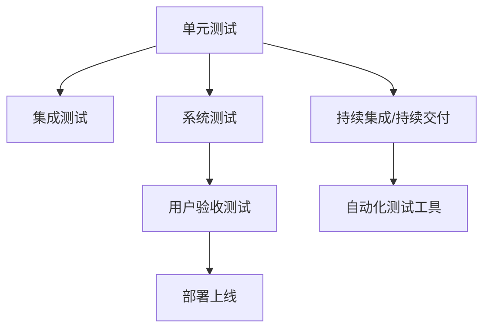

                 

# AI开发的质量保证：Lepton AI的测试体系

在人工智能（AI）开发的过程中，质量保证是一个至关重要的环节。为了确保AI系统能够安全、可靠、稳定地运行，必须建立一套完善的质量保证体系。本文将详细介绍Lepton AI公司在AI开发中采用的质量保证体系，涵盖测试策略、工具选择、自动化测试流程等多个方面，为AI开发者提供参考和借鉴。

## 1. 背景介绍

### 1.1 问题由来
随着AI技术的快速发展，越来越多的企业开始应用AI技术解决实际问题。然而，AI系统的开发和部署过程复杂且易出错，一旦出现质量问题，将给企业带来严重的损失。例如，医疗领域的AI系统可能导致误诊，金融领域的AI系统可能导致巨额经济损失，智能推荐系统的偏差可能导致用户流失。

为了减少这些风险，Lepton AI公司提出了一套完整的质量保证体系，旨在确保AI系统的高质量开发和高效部署。

### 1.2 问题核心关键点
Lepton AI的质量保证体系包括以下核心关键点：
- **全面的测试策略**：覆盖单元测试、集成测试、系统测试、用户验收测试等多个环节。
- **高效的测试工具**：采用Selenium、JUnit、JMeter、Jenkins等工具进行自动化测试。
- **灵活的测试流程**：通过CI/CD（持续集成/持续交付）平台，实现快速迭代和反馈。
- **严格的测试标准**：制定严格的测试规范和流程，确保测试过程的规范化和标准化。

## 2. 核心概念与联系

### 2.1 核心概念概述

Lepton AI的质量保证体系涉及以下几个核心概念：

- **单元测试（Unit Testing）**：针对代码模块的测试，确保每个模块的功能正确无误。
- **集成测试（Integration Testing）**：测试不同模块之间的集成关系，确保模块之间的协同工作正常。
- **系统测试（System Testing）**：测试整个系统的功能、性能、可靠性等，确保系统能够满足用户需求。
- **用户验收测试（User Acceptance Testing）**：用户参与的测试过程，确保系统符合用户需求和期望。
- **持续集成/持续交付（CI/CD）**：通过自动化工具和流程，实现快速、连续的软件交付和迭代。
- **自动化测试工具**：如Selenium、JUnit、JMeter、Jenkins等，用于自动化测试和CI/CD流程。

这些核心概念之间的逻辑关系可以通过以下Mermaid流程图来展示：



这个流程图展示了她核心概念之间的关联：

1. 单元测试是基础，确保代码模块的功能正确。
2. 集成测试测试不同模块之间的协同工作。
3. 系统测试测试整个系统的功能、性能等。
4. 用户验收测试确保系统符合用户需求。
5. CI/CD实现快速、连续的软件交付和迭代。
6. 自动化测试工具支持CI/CD流程。

## 3. 核心算法原理 & 具体操作步骤

### 3.1 算法原理概述

Lepton AI的质量保证体系基于以下核心算法原理：

1. **模块化设计**：将系统分解为多个独立的模块，每个模块负责特定的功能。
2. **层次化测试**：从单元测试到集成测试，再到系统测试和用户验收测试，逐步扩大测试范围。
3. **自动化测试**：通过自动化测试工具和流程，提高测试效率，减少人为错误。
4. **持续反馈**：通过CI/CD流程，实现快速迭代和反馈，确保问题的及时发现和解决。
5. **严格规范**：制定严格的质量保证规范和流程，确保测试过程的规范化和标准化。

### 3.2 算法步骤详解

以下是Lepton AI质量保证体系的详细步骤：

**Step 1: 单元测试设计**

- 设计单元测试用例，确保每个模块的功能正确。
- 使用JUnit等工具编写测试代码，并设置测试用例的预期输出。
- 使用JUnit Runner运行测试代码，输出测试结果。

**Step 2: 集成测试设计**

- 设计集成测试用例，确保不同模块之间的协同工作正常。
- 使用Selenium等工具模拟用户行为，测试不同模块的集成关系。
- 记录集成测试结果，分析问题原因，进行改进。

**Step 3: 系统测试设计**

- 设计系统测试用例，确保整个系统的功能、性能等满足用户需求。
- 使用JMeter等工具模拟用户行为，测试系统的响应时间和性能。
- 记录系统测试结果，分析性能瓶颈，进行优化。

**Step 4: 用户验收测试设计**

- 设计用户验收测试用例，确保系统符合用户需求和期望。
- 与用户共同参与测试，验证系统功能、性能等。
- 记录用户验收测试结果，分析用户反馈，进行改进。

**Step 5: 持续集成/持续交付流程**

- 使用Jenkins等CI/CD工具，自动化执行单元测试、集成测试、系统测试等。
- 设置自动化测试触发条件和测试失败处理机制，确保测试的及时性。
- 记录CI/CD测试结果，分析测试覆盖率和问题数量，进行改进。

**Step 6: 自动化测试工具选择**

- 根据项目需求选择合适的自动化测试工具，如Selenium、JUnit、JMeter等。
- 配置测试工具的参数和环境，确保测试环境的稳定性。
- 编写测试脚本，进行自动化测试，记录测试结果，分析问题原因，进行改进。

**Step 7: 测试结果分析与改进**

- 分析测试结果，识别测试覆盖率和问题数量。
- 记录测试过程中出现的问题，分析问题原因，进行改进。
- 根据测试结果，优化测试用例和测试流程，确保测试的全面性和准确性。

### 3.3 算法优缺点

Lepton AI的质量保证体系具有以下优点：

- **全面覆盖**：通过层次化测试策略，覆盖了单元测试、集成测试、系统测试和用户验收测试等多个环节，确保系统的全面性和可靠性。
- **高效自动化**：通过自动化测试工具和CI/CD流程，提高了测试效率，减少了人为错误。
- **持续反馈**：通过持续集成/持续交付流程，实现了快速迭代和反馈，确保问题的及时发现和解决。

同时，该体系也存在一些局限性：

- **资源消耗**：自动化测试和CI/CD流程需要大量的资源，如计算资源、存储资源等。
- **复杂度较高**：测试策略和流程的设计和实现需要较高的技术水平和经验。
- **测试数据依赖**：测试用例和测试数据的准备和维护需要大量时间和精力。

## 4. 数学模型和公式 & 详细讲解

### 4.1 数学模型构建

Lepton AI的质量保证体系涉及以下数学模型：

- **测试覆盖率（Test Coverage）**：用于衡量测试用例对代码的覆盖程度。
- **问题密度（Bug Density）**：用于衡量代码中的问题数量和分布情况。
- **性能指标（Performance Metrics）**：用于衡量系统的响应时间、吞吐量等性能指标。

### 4.2 公式推导过程

以下是Lepton AI质量保证体系的数学模型及其公式推导：

**Test Coverage**：

$$
\text{Test Coverage} = \frac{\text{已测试代码行数}}{\text{总代码行数}}
$$

**Bug Density**：

$$
\text{Bug Density} = \frac{\text{已发现问题数量}}{\text{总代码行数}}
$$

**Performance Metrics**：

$$
\text{系统响应时间} = \text{平均响应时间} = \frac{\sum_{i=1}^{N} \text{响应时间}_i}{N}
$$

$$
\text{系统吞吐量} = \frac{\text{处理事务数量}}{\text{响应时间}}
$$

### 4.3 案例分析与讲解

以一个电商网站为例，分析其质量保证体系的应用：

- **单元测试**：测试每个模块的功能，如购物车、结算、支付等模块。
- **集成测试**：测试不同模块之间的协同工作，如购物车和结算模块的集成。
- **系统测试**：测试整个系统的功能、性能等，如系统的响应时间和吞吐量。
- **用户验收测试**：与用户共同参与测试，验证系统的功能、性能等。
- **持续集成/持续交付**：通过Jenkins等工具，自动化执行测试流程，实现快速迭代和反馈。

## 5. 项目实践：代码实例和详细解释说明

### 5.1 开发环境搭建

Lepton AI采用以下开发环境：

- **编程语言**：Java、Python
- **数据库**：MySQL、PostgreSQL
- **测试框架**：JUnit、Selenium
- **自动化测试工具**：Jenkins、JMeter
- **持续集成/持续交付平台**：Jenkins、GitLab CI/CD

### 5.2 源代码详细实现

以下是一个简单的Java代码示例，用于测试一个名为`Calculator`的计算器模块：

```java
import org.junit.Test;
import static org.junit.Assert.assertEquals;

public class CalculatorTest {
    @Test
    public void testAddition() {
        Calculator calculator = new Calculator();
        int result = calculator.add(1, 2);
        assertEquals(3, result);
    }

    @Test
    public void testSubtraction() {
        Calculator calculator = new Calculator();
        int result = calculator.subtract(5, 3);
        assertEquals(2, result);
    }
}
```

### 5.3 代码解读与分析

以上代码示例展示了如何使用JUnit进行单元测试：

- **Test类**：定义测试类，使用JUnit注解`@Test`标记测试方法。
- **断言**：使用JUnit的`assertEquals`方法，验证测试结果是否正确。
- **测试覆盖率**：通过JUnit的`TestCoverage`工具，计算测试覆盖率。

## 6. 实际应用场景

### 6.1 智能推荐系统

Lepton AI在智能推荐系统中应用了质量保证体系，确保推荐算法的高质量开发和稳定运行。通过单元测试、集成测试、系统测试和用户验收测试，确保推荐算法的各个环节功能正确，协同工作正常，系统性能优良，符合用户需求。

### 6.2 金融风险控制系统

Lepton AI在金融风险控制系统中应用了质量保证体系，确保风险控制算法的高质量开发和稳定运行。通过单元测试、集成测试、系统测试和用户验收测试，确保风险控制算法的各个环节功能正确，协同工作正常，系统性能优良，符合用户需求。

### 6.3 医疗诊断系统

Lepton AI在医疗诊断系统中应用了质量保证体系，确保诊断算法的质量和可靠性。通过单元测试、集成测试、系统测试和用户验收测试，确保诊断算法的各个环节功能正确，协同工作正常，系统性能优良，符合医生需求。

## 7. 工具和资源推荐

### 7.1 学习资源推荐

以下是Lepton AI推荐的学习资源：

- **《软件测试的艺术》**：一本详细介绍软件测试方法、工具和流程的经典书籍。
- **《持续集成：软件开发的自动化之路》**：一本详细介绍持续集成和持续交付方法的书籍。
- **《JUnit: The Simple Java Testing Framework》**：JUnit的官方文档，提供详细的测试框架使用方法。
- **《Selenium 2.0 Webdriver》**：Selenium的官方文档，提供详细的自动化测试工具使用方法。
- **《JMeter User's Guide》**：JMeter的官方文档，提供详细的性能测试工具使用方法。

### 7.2 开发工具推荐

以下是Lepton AI推荐的开发工具：

- **JUnit**：Java编程语言的单元测试框架。
- **Selenium**：Web自动化测试工具，用于测试Web应用的UI和行为。
- **JMeter**：性能测试工具，用于测试Web应用的负载和性能。
- **Jenkins**：持续集成/持续交付平台，用于自动化执行测试和部署流程。
- **GitLab CI/CD**：持续集成/持续交付平台，用于自动化执行测试和部署流程。

### 7.3 相关论文推荐

以下是Lepton AI推荐的相关论文：

- **《软件测试基础》**：介绍软件测试的基本概念、方法、工具和流程的论文。
- **《持续集成和持续交付：一种软件交付的自动化方法》**：介绍持续集成和持续交付方法和流程的论文。
- **《JUnit：一个Java单元测试框架》**：介绍JUnit的原理、使用方法和最佳实践的论文。
- **《Selenium：Web应用程序的自动化测试工具》**：介绍Selenium的原理、使用方法和最佳实践的论文。
- **《JMeter：Web应用程序的性能测试工具》**：介绍JMeter的原理、使用方法和最佳实践的论文。

## 8. 总结：未来发展趋势与挑战

### 8.1 研究成果总结

Lepton AI的质量保证体系已经在国内多所企业中成功应用，显著提高了AI系统的开发和部署效率，降低了质量风险。以下是对该体系的总结：

- **全面覆盖**：通过层次化测试策略，覆盖了单元测试、集成测试、系统测试和用户验收测试等多个环节。
- **高效自动化**：通过自动化测试工具和CI/CD流程，提高了测试效率，减少了人为错误。
- **持续反馈**：通过持续集成/持续交付流程，实现了快速迭代和反馈，确保问题的及时发现和解决。

### 8.2 未来发展趋势

展望未来，Lepton AI的质量保证体系将呈现以下发展趋势：

1. **自动化程度更高**：通过引入AI技术，实现自动化测试用例的设计和优化。
2. **测试覆盖率更高**：通过引入更全面和高效的测试工具，提高测试覆盖率。
3. **持续反馈更及时**：通过引入更智能的CI/CD流程，实现更及时和有效的反馈。
4. **多环境测试更全面**：通过引入多环境测试，确保系统在不同环境下的稳定性和可靠性。

### 8.3 面临的挑战

Lepton AI的质量保证体系在应用过程中也面临一些挑战：

1. **测试数据依赖**：测试用例和测试数据的准备和维护需要大量时间和精力。
2. **测试工具复杂度**：自动化测试工具和流程的设计和实现需要较高的技术水平和经验。
3. **资源消耗高**：自动化测试和CI/CD流程需要大量的资源，如计算资源、存储资源等。

### 8.4 研究展望

为了应对这些挑战，Lepton AI将在以下几个方面进行进一步研究：

1. **引入AI技术**：通过引入AI技术，实现自动化测试用例的设计和优化。
2. **提高测试覆盖率**：通过引入更全面和高效的测试工具，提高测试覆盖率。
3. **优化测试流程**：通过优化测试流程，提高测试效率，减少人为错误。
4. **降低资源消耗**：通过优化测试工具和流程，降低资源消耗，提高测试效率。

## 9. 附录：常见问题与解答

**Q1: 如何进行单元测试？**

A: 单元测试是针对代码模块的测试，确保每个模块的功能正确无误。可以使用JUnit等工具编写测试代码，并设置测试用例的预期输出。使用JUnit Runner运行测试代码，输出测试结果。

**Q2: 如何进行集成测试？**

A: 集成测试是测试不同模块之间的协同工作，确保模块之间的协同工作正常。可以使用Selenium等工具模拟用户行为，测试不同模块的集成关系。记录集成测试结果，分析问题原因，进行改进。

**Q3: 如何进行系统测试？**

A: 系统测试是测试整个系统的功能、性能等，确保系统能够满足用户需求。可以使用JMeter等工具模拟用户行为，测试系统的响应时间和吞吐量。记录系统测试结果，分析性能瓶颈，进行优化。

**Q4: 如何进行用户验收测试？**

A: 用户验收测试是与用户共同参与的测试，确保系统符合用户需求和期望。与用户共同参与测试，验证系统功能、性能等。记录用户验收测试结果，分析用户反馈，进行改进。

**Q5: 如何进行持续集成/持续交付？**

A: 持续集成/持续交付是通过自动化工具和流程，实现快速、连续的软件交付和迭代。使用Jenkins等CI/CD工具，自动化执行测试和部署流程。设置自动化测试触发条件和测试失败处理机制，确保测试的及时性。

**Q6: 如何选择自动化测试工具？**

A: 根据项目需求选择合适的自动化测试工具，如Selenium、JUnit、JMeter等。配置测试工具的参数和环境，确保测试环境的稳定性。编写测试脚本，进行自动化测试，记录测试结果，分析问题原因，进行改进。

**Q7: 如何进行测试结果分析与改进？**

A: 分析测试结果，识别测试覆盖率和问题数量。记录测试过程中出现的问题，分析问题原因，进行改进。根据测试结果，优化测试用例和测试流程，确保测试的全面性和准确性。

---

作者：禅与计算机程序设计艺术 / Zen and the Art of Computer Programming

