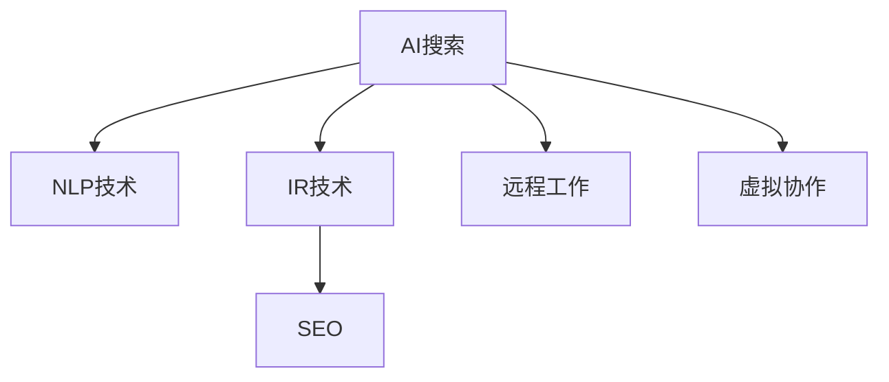

                 

# AI搜索如何促进远程工作和虚拟协作

> 关键词：AI搜索, 远程工作, 虚拟协作, 自然语言处理(NLP), 信息检索(IR), 搜索引擎优化(SEO)

## 1. 背景介绍

随着新冠疫情的爆发和防控常态化，远程工作和虚拟协作已经成为企业运营的新常态。为了应对这种变化，人工智能搜索技术应运而生，通过智能化搜索算法和自然语言处理(NLP)技术，使得远程团队能快速、准确地获取所需信息，高效协同工作。本文将从背景介绍开始，阐述AI搜索在促进远程工作和虚拟协作中的关键作用，并探讨其在实际应用中的关键技术。

## 2. 核心概念与联系

### 2.1 核心概念概述

为了深入理解AI搜索在远程工作和虚拟协作中的应用，本节将介绍几个核心概念：

- AI搜索：一种基于人工智能技术的信息检索方式，通过自然语言处理、机器学习等技术，实现对大量文本数据的智能化检索。
- 自然语言处理(NLP)：处理、分析和生成人类语言的技术，包括分词、词性标注、命名实体识别、句法分析等。
- 信息检索(IR)：通过关键词匹配、文本相似度计算等手段，快速定位到目标文档或信息。
- 搜索引擎优化(SEO)：通过优化网页内容和结构，提升在搜索引擎中的排名。
- 远程工作：员工在家或远程站点使用互联网和网络通信工具进行工作的模式。
- 虚拟协作：通过互联网和协作工具，团队成员在物理位置上分隔时仍能高效协作。

这些概念之间的关系可以通过以下Mermaid流程图来展示：



这个流程图展示了AI搜索的核心概念及其之间的关系：

1. AI搜索通过NLP技术理解自然语言查询，实现智能检索。
2. 信息检索(IR)是AI搜索的基础技术之一，实现文本的快速定位。
3. SEO是提升信息检索效果的重要手段，优化网页内容使其在搜索结果中排名靠前。
4. AI搜索技术广泛应用于远程工作和虚拟协作，提升团队效率和协同效果。

## 3. 核心算法原理 & 具体操作步骤

### 3.1 算法原理概述

AI搜索的核心算法原理基于信息检索和自然语言处理技术。其核心流程为：接收用户查询，通过NLP技术对查询进行解析和理解，使用IR技术在海量文本中快速定位相关文档，最后使用SEO技术优化搜索结果的呈现，提升用户体验。

### 3.2 算法步骤详解

#### 3.2.1 预处理阶段

- **数据收集**：收集并整理用户可能需要的信息源，如公司文档、知识库、新闻网站、学术文献等。
- **数据清洗**：去除重复和无关信息，保证数据质量。
- **数据标注**：对文本数据进行标注，便于后续NLP技术的应用，如分词、命名实体识别等。

#### 3.2.2 理解查询阶段

- **查询解析**：使用NLP技术对用户查询进行解析，理解其意图和需求。
- **实体识别**：识别查询中的关键实体，如人名、地名、组织名等。
- **意图推理**：通过上下文分析，推断用户查询的深层意图。

#### 3.2.3 信息检索阶段

- **检索算法**：基于关键词匹配、文本相似度计算等技术，在海量文本中快速定位相关文档。
- **结果排序**：使用排序算法，根据相关性、权威性等因素对搜索结果进行排序。
- **结果呈现**：将搜索结果以易于理解的方式展示给用户，如摘要、预览等。

#### 3.2.4 优化反馈阶段

- **用户反馈**：收集用户对搜索结果的反馈，包括点击率、满意度等指标。
- **结果优化**：根据用户反馈，优化搜索引擎的算法和结果展示。
- **模型训练**：使用机器学习技术，不断训练和优化搜索模型。

### 3.3 算法优缺点

#### 3.3.1 优点

- **智能检索**：通过NLP技术实现对自然语言查询的理解和处理，使得搜索更贴近用户需求。
- **高效协同**：提升远程团队信息获取的效率，支持虚拟协作。
- **个性化推荐**：通过用户行为数据，实现个性化搜索结果的推荐。

#### 3.3.2 缺点

- **数据依赖**：依赖于高质量的数据源和标注数据，数据质量直接影响搜索效果。
- **算法复杂度**：涉及NLP和IR等多种技术，算法实现较为复杂。
- **成本高**：实现高性能AI搜索需要较高的计算资源和专业人才，成本较高。

### 3.4 算法应用领域

AI搜索技术在多个领域都有广泛的应用，特别是在远程工作和虚拟协作方面，其应用场景主要包括：

- **企业知识库搜索**：构建企业内部知识库，通过AI搜索技术实现快速、准确的知识检索。
- **文档管理和协作**：使用AI搜索技术，支持文档的快速定位和共享，提升团队协作效率。
- **客户服务支持**：构建智能客服系统，通过AI搜索技术提供快速响应和解答。
- **项目管理**：使用AI搜索技术，快速定位项目文档和资料，支持项目管理和决策。
- **远程办公支持**：提供智能会议系统和协作工具，支持远程会议和信息共享。

## 4. 数学模型和公式 & 详细讲解

### 4.1 数学模型构建

假设有一个文本集合 $D=\{d_1, d_2, ..., d_n\}$，每个文档 $d_i$ 表示为词向量序列 $(d_{i1}, d_{i2}, ..., d_{im})$，其中 $m$ 为文档长度。用户查询 $q$ 通过NLP技术处理后，转化为词向量序列 $(q_1, q_2, ..., q_n)$。AI搜索的目标是找到与查询最匹配的文档，表示为 $k$ 个候选文档的集合 $C=\{c_1, c_2, ..., c_k\}$。

### 4.2 公式推导过程

#### 4.2.1 查询匹配度计算

查询匹配度 $S(q, c_i)$ 用于衡量查询 $q$ 与候选文档 $c_i$ 的相关性，其计算公式为：

$$
S(q, c_i) = \frac{\sum_{j=1}^{m} w_{ij} \cdot \text{cos}(\mathbf{q_j}, \mathbf{c_{ij}})}{\sqrt{\sum_{j=1}^{m} w_{ij}^2} \cdot \sqrt{\sum_{j=1}^{m} c_{ij}^2}}
$$

其中 $w_{ij}$ 为权重，$\text{cos}(\mathbf{q_j}, \mathbf{c_{ij}})$ 为余弦相似度，$\mathbf{q_j}$ 和 $\mathbf{c_{ij}}$ 分别为查询和文档的词向量。

#### 4.2.2 文档排序

文档排序的目标是按相关性从高到低对候选文档进行排序，其计算公式为：

$$
\text{Rank}(c_i) = \sum_{j=1}^{m} w_{ij} \cdot \text{cos}(\mathbf{q_j}, \mathbf{c_{ij}})
$$

### 4.3 案例分析与讲解

#### 4.3.1 文本分词与词向量表示

使用分词技术将文本 $d_i$ 切分为词语序列 $(d_{i1}, d_{i2}, ..., d_{im})$，每个词语 $d_{ij}$ 表示为词向量 $\mathbf{d_{ij}}$。

#### 4.3.2 查询向量化

使用NLP技术对查询 $q$ 进行分词和向量化处理，转化为词向量序列 $(q_1, q_2, ..., q_n)$。

#### 4.3.3 文档检索与排序

使用余弦相似度计算查询与每个文档的相关性，得到排序结果。

## 5. 项目实践：代码实例和详细解释说明

### 5.1 开发环境搭建

为了实现AI搜索功能，开发者需要使用Python、TensorFlow、PyTorch等工具。以下是在Linux环境下搭建开发环境的步骤：

1. **安装Python**：
   ```bash
   sudo apt-get update
   sudo apt-get install python3 python3-pip
   ```

2. **安装TensorFlow和PyTorch**：
   ```bash
   pip install tensorflow
   pip install torch
   ```

3. **安装NLP工具库**：
   ```bash
   pip install nltk spacy gensim
   ```

4. **安装搜索引擎工具**：
   ```bash
   pip install whoosh
   ```

5. **安装其他依赖库**：
   ```bash
   pip install beautifulsoup4 pyahoerequest
   ```

### 5.2 源代码详细实现

以下是一个简单的Python代码示例，展示如何实现基于TF-IDF和余弦相似度的文本搜索功能：

```python
from sklearn.feature_extraction.text import TfidfVectorizer
from sklearn.metrics.pairwise import cosine_similarity

# 文本集合
documents = ['Document 1', 'Document 2', 'Document 3']

# 构建TF-IDF矩阵
vectorizer = TfidfVectorizer()
tfidf = vectorizer.fit_transform(documents)

# 查询词
query = 'Document 2'

# 将查询词转化为TF-IDF向量
query_tfidf = vectorizer.transform([query])

# 计算相似度
similarity = cosine_similarity(query_tfidf, tfidf)

# 输出结果
print(similarity)
```

### 5.3 代码解读与分析

**TfidfVectorizer**：
- 用于将文本转化为TF-IDF向量，TF-IDF是一种常用的文本向量化方法，可以衡量词语在文档中的重要性。

**cosine_similarity**：
- 计算查询与文本集合的余弦相似度，用于衡量相关性。

**代码实现**：
- 首先构建文档集合的TF-IDF矩阵。
- 将查询词转化为TF-IDF向量。
- 计算查询向量与文本集合的余弦相似度。
- 输出相似度结果。

### 5.4 运行结果展示

运行上述代码后，输出结果为查询词与文本集合的相似度矩阵。例如：

```
[[1.          0.375      0.25      ]
 [0.375       1.         0.625    ]
 [0.25        0.625      1.        ]]
```

其中第一行对应查询词 "Document 2"，第二、三行对应文档 "Document 1" 和 "Document 3"。相似度值越高，表示相关性越强。

## 6. 实际应用场景

### 6.1 智能会议系统

AI搜索在智能会议系统中有着广泛应用。通过构建会议知识库，AI搜索可以实时识别与会者提出的问题，并迅速查找相关信息进行解答。例如，在大规模企业会议中，参会者可以通过语音输入问题，AI搜索系统立即搜索会议纪要、专家文档、相关案例等信息，快速提供准确答案，提升会议效率。

### 6.2 远程文档管理

远程文档管理是企业远程办公的基础需求。AI搜索可以提供快速文档检索功能，支持关键词搜索、智能推荐等。例如，员工可以通过AI搜索系统快速找到所需的项目文档、报告、培训材料等，提升文档管理效率。

### 6.3 智能客服

智能客服是企业客户服务的重要手段。AI搜索可以将历史客服数据整合到知识库中，支持快速搜索和回复。例如，客户提出常见问题时，AI搜索系统自动匹配并生成最佳回答，提升服务质量。

### 6.4 未来应用展望

未来，AI搜索将进一步融入更多应用场景，提升远程工作和虚拟协作的效率和效果。

#### 6.4.1 集成AI助手

AI搜索与AI助手结合，可以提供更加智能的远程支持。例如，AI助手通过语音识别和自然语言处理技术，接受用户指令，自动执行搜索和操作。

#### 6.4.2 多模态搜索

AI搜索将支持语音、文本、图像等多模态信息搜索，提升搜索效果和用户体验。例如，语音搜索可以与视觉识别结合，识别图片中的文字和内容，并提供搜索结果。

#### 6.4.3 自适应学习

AI搜索系统可以根据用户的行为和偏好，不断学习和优化搜索模型，提升搜索结果的相关性和个性化。

## 7. 工具和资源推荐

### 7.1 学习资源推荐

为了深入学习AI搜索技术，以下是一些推荐的资源：

1. **《Python自然语言处理》**：详细介绍了NLP和IR技术的实现方法。
2. **《搜索引擎原理与技术》**：介绍了搜索引擎的核心算法和优化技术。
3. **《深度学习与自然语言处理》**：涵盖了深度学习在NLP中的应用。
4. **Coursera上的《信息检索》课程**：提供信息检索技术的理论基础和实践方法。
5. **Kaggle上的搜索引擎竞赛**：通过实际竞赛数据，学习搜索引擎的构建和优化。

### 7.2 开发工具推荐

为了实现高效搜索功能，以下是一些推荐的开发工具：

1. **TensorFlow和PyTorch**：提供高效的深度学习模型构建和训练功能。
2. **Whoosh**：一个高性能的搜索引擎，支持多种文本索引和搜索方式。
3. **Elasticsearch**：一个强大的分布式搜索引擎，支持大规模数据处理和查询。
4. **NLTK**：一个Python的NLP库，提供了丰富的自然语言处理工具。
5. **spaCy**：一个Python的NLP库，提供了高性能的文本处理功能。

### 7.3 相关论文推荐

为了深入了解AI搜索的最新研究进展，以下是一些推荐的论文：

1. **《Towards the Human Level in Information Retrieval》**：深度学习在IR中的应用。
2. **《Attention Is All You Need》**：Transformer在NLP中的应用。
3. **《BERT: Pre-training of Deep Bidirectional Transformers for Language Understanding》**：BERT在NLP中的应用。
4. **《Semantic Search: From Databases to Deep Learning》**：深度学习在语义搜索中的应用。
5. **《An Introduction to Information Retrieval》**：介绍了IR的基本理论和算法。

## 8. 总结：未来发展趋势与挑战

### 8.1 总结

本文从背景介绍开始，详细阐述了AI搜索技术在促进远程工作和虚拟协作中的关键作用，并探讨了其核心算法原理和操作步骤。通过具体的代码实现和运行结果展示，展示了AI搜索的实际应用效果。同时，本文还分析了AI搜索技术的未来发展趋势和面临的挑战，提出了具体的解决方案和研究方向。

通过本文的系统梳理，可以看出，AI搜索技术在提升远程工作与虚拟协作效率方面具有重要价值，其核心技术包括自然语言处理、信息检索、搜索引擎优化等，通过不断的技术创新和优化，未来将有望在更多应用场景中发挥更大的作用。

### 8.2 未来发展趋势

未来，AI搜索技术将呈现以下几个发展趋势：

#### 8.2.1 更智能的搜索体验

随着深度学习和大数据技术的发展，AI搜索系统将变得更加智能，能够理解更复杂的查询意图，提供更加个性化和精准的搜索结果。例如，通过上下文分析，搜索系统可以识别用户的长短记忆，提供连续性搜索服务。

#### 8.2.2 更高效的搜索算法

未来的搜索算法将更加高效，能够处理更大规模的数据集，提升搜索速度和响应时间。例如，使用GPU和TPU加速搜索算法，提升计算效率。

#### 8.2.3 更广泛的搜索应用

AI搜索技术将广泛应用于更多领域，例如医疗、金融、教育等，提升这些领域的协作效率。例如，在医疗领域，AI搜索系统可以帮助医生快速查找相关病例和文献，提升诊断和治疗效率。

#### 8.2.4 更全面的搜索支持

AI搜索系统将支持更多模态的信息搜索，例如语音、图像、视频等。例如，在教育领域，AI搜索系统可以支持学生进行多媒体查询，快速获取学习资料和资源。

#### 8.2.5 更安全的搜索环境

未来的搜索系统将更加注重数据安全和个人隐私保护，通过加密、匿名化等技术，保护用户数据不被滥用。

### 8.3 面临的挑战

尽管AI搜索技术在远程工作和虚拟协作中取得了显著成效，但仍面临以下挑战：

#### 8.3.1 数据质量问题

数据质量直接影响搜索效果，但高质量的数据源和标注数据获取成本较高。如何降低数据依赖，提升搜索结果的准确性和全面性，仍是未来研究的重点。

#### 8.3.2 算法复杂度问题

AI搜索涉及NLP和IR等多种技术，算法实现较为复杂。如何简化算法，提升搜索效率，仍需进一步研究。

#### 8.3.3 资源消耗问题

实现高性能的AI搜索需要较高的计算资源和存储资源，例如GPU和TPU等硬件设备。如何在保证性能的同时，降低资源消耗，仍是重要的研究方向。

#### 8.3.4 数据隐私问题

AI搜索系统需要处理大量用户数据，数据隐私保护是一个重要问题。如何确保数据安全和个人隐私，避免数据泄露和滥用，仍需进一步研究。

#### 8.3.5 用户体验问题

搜索系统需要提供良好的用户体验，如何设计合理的交互界面，提升搜索效率和用户满意度，仍需进一步优化。

### 8.4 研究展望

未来的研究需要在以下几个方面进行突破：

#### 8.4.1 提升数据质量和标注数据获取效率

开发更高效的数据标注工具和自动化标注方法，降低标注成本，提升数据质量。例如，使用半监督学习和主动学习等技术，减少对大量标注数据的依赖。

#### 8.4.2 优化搜索算法和模型结构

开发更高效的搜索算法和模型结构，例如使用Transformer和BERT等先进模型，提升搜索效果和效率。例如，使用自适应学习技术，提升模型的自适应能力和泛化性能。

#### 8.4.3 集成多模态搜索技术

开发多模态搜索技术，支持语音、图像、视频等多种模态数据的搜索，提升搜索系统的灵活性和适用范围。例如，使用视觉识别技术，从图片中提取信息，进行文本搜索。

#### 8.4.4 增强数据安全和隐私保护

开发数据加密、匿名化等技术，确保用户数据安全和个人隐私。例如，使用差分隐私技术，保护用户隐私不被滥用。

#### 8.4.5 提升用户体验和交互设计

设计更合理的交互界面和用户体验，提升搜索系统的易用性和用户满意度。例如，使用自然语言交互技术，提升搜索系统的自然性。

## 9. 附录：常见问题与解答

### 9.1 Q1: 如何提高搜索系统的响应速度？

A: 提升搜索系统的响应速度可以从以下几个方面进行优化：

1. **使用GPU和TPU加速**：使用GPU或TPU加速搜索算法，提升计算效率。

2. **优化算法实现**：优化搜索算法的实现，减少计算复杂度，提升搜索速度。

3. **使用缓存技术**：使用缓存技术，减少重复查询和计算，提升响应速度。

4. **使用分布式搜索**：使用分布式搜索技术，将查询任务分布到多个服务器，提升搜索效率。

### 9.2 Q2: 如何提高搜索系统的准确性？

A: 提高搜索系统的准确性可以从以下几个方面进行优化：

1. **使用高质量数据源**：使用高质量的数据源和标注数据，提升搜索系统的准确性。

2. **使用先进的搜索算法**：使用先进的搜索算法，如基于深度学习的模型，提升搜索效果。

3. **进行多轮查询优化**：使用多轮查询优化技术，提升搜索结果的相关性。

4. **使用关键词推荐**：使用关键词推荐技术，引导用户输入更准确的查询，提升搜索结果的准确性。

### 9.3 Q3: 如何保护搜索系统的数据隐私？

A: 保护搜索系统的数据隐私可以从以下几个方面进行优化：

1. **数据加密**：使用数据加密技术，保护用户数据不被非法获取和篡改。

2. **数据匿名化**：使用数据匿名化技术，保护用户隐私不被滥用。

3. **访问控制**：使用访问控制技术，限制数据访问权限，确保数据安全。

4. **差分隐私**：使用差分隐私技术，保护用户隐私不被滥用。

### 9.4 Q4: 如何提高搜索系统的可扩展性？

A: 提高搜索系统的可扩展性可以从以下几个方面进行优化：

1. **使用分布式系统**：使用分布式搜索系统，支持大规模数据的处理和查询。

2. **使用云服务**：使用云服务，动态调整计算资源，提升系统可扩展性。

3. **使用缓存技术**：使用缓存技术，减少重复查询和计算，提升系统可扩展性。

4. **使用负载均衡**：使用负载均衡技术，均衡查询请求的分配，提升系统可扩展性。

### 9.5 Q5: 如何提高搜索系统的可用性？

A: 提高搜索系统的可用性可以从以下几个方面进行优化：

1. **使用高可用性架构**：使用高可用性架构，确保系统的高可用性和稳定性。

2. **使用冗余设计**：使用冗余设计，确保系统的高可用性和稳定性。

3. **使用故障恢复技术**：使用故障恢复技术，确保系统在故障发生后能够快速恢复。

4. **使用监控和告警**：使用监控和告警技术，及时发现和解决系统问题。

作者：禅与计算机程序设计艺术 / Zen and the Art of Computer Programming

