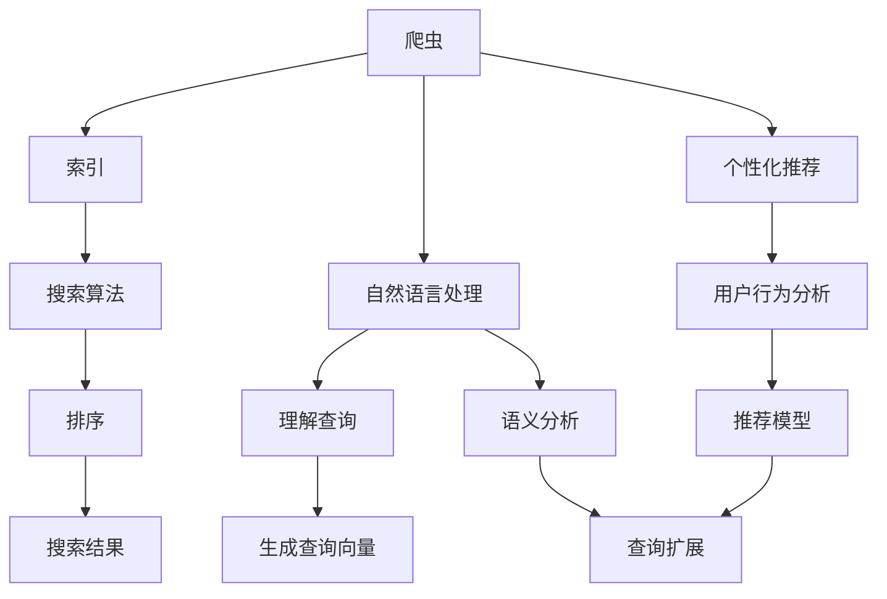

                 

# AI搜索引擎如何促进跨学科研究和创新

## 1. 背景介绍

在数字化时代，搜索引擎已经不仅仅是一种获取信息的工具，更成为了连接学术研究、技术创新、商业应用等多个领域的重要桥梁。AI技术的引入，使得搜索引擎在处理海量数据、提升检索质量、推动跨学科研究等方面发挥了巨大的作用。本文将探讨AI搜索引擎如何促进跨学科研究与创新的各个方面，包括其核心技术、应用场景以及未来发展趋势。

## 2. 核心概念与联系

### 2.1 核心概念概述

搜索引擎是连接用户与信息的重要平台，通过输入查询词，系统能够快速、准确地返回相关信息。AI技术的引入，尤其是自然语言处理（NLP）、机器学习（ML）、深度学习（DL）等技术，使得搜索引擎的检索能力、用户体验和个性化推荐能力显著提升。

AI搜索引擎的核心组件包括：
1. **爬虫**：抓取互联网上的网页内容，构建索引。
2. **搜索算法**：如PageRank算法、深度学习模型等，用于排序搜索结果。
3. **自然语言处理**：理解用户查询意图，进行语义分析。
4. **个性化推荐**：根据用户行为和偏好，提供定制化搜索结果。
5. **知识图谱**：提供结构化知识，帮助推理和关联。

这些组件相互配合，使得AI搜索引擎能够高效处理大规模数据，提供精准的搜索结果和丰富的功能。

### 2.2 核心概念原理和架构的 Mermaid 流程图



该图展示了搜索引擎的各个关键组件及其相互关系。

## 3. 核心算法原理 & 具体操作步骤

### 3.1 算法原理概述

AI搜索引擎的核心算法包括搜索算法、自然语言处理算法和个性化推荐算法。

1. **搜索算法**：如PageRank算法、BM25算法、深度学习模型等，用于计算网页的相关性，排序搜索结果。
2. **自然语言处理算法**：用于理解用户查询意图，进行语义分析和查询扩展。
3. **个性化推荐算法**：基于用户行为数据和偏好，生成个性化搜索结果。

这些算法通过深度学习模型的优化，显著提升了搜索引擎的准确性和用户体验。

### 3.2 算法步骤详解

**步骤1: 网页抓取与索引构建**

- 使用爬虫技术抓取网页内容。
- 提取网页中的文本信息，进行预处理，如分词、去除停用词等。
- 将处理后的文本信息建立索引，方便后续查询。

**步骤2: 自然语言处理**

- 输入用户查询，进行分词和词性标注。
- 通过BERT、GPT等预训练模型，理解查询意图和语义。
- 利用查询扩展技术，如同义词扩展、近义词替换等，提高查询相关性。

**步骤3: 搜索结果排序**

- 使用BM25算法或深度学习模型计算网页的相关性。
- 根据相关性进行排序，生成搜索结果。

**步骤4: 个性化推荐**

- 收集用户的历史行为数据，如搜索记录、点击行为等。
- 基于用户行为数据，使用协同过滤、内容推荐等算法，生成个性化推荐。

### 3.3 算法优缺点

**优点**：
- **高效性**：深度学习模型能够快速处理大规模数据，提供高效的搜索结果。
- **准确性**：通过自然语言处理和语义分析，能够准确理解用户查询意图。
- **个性化**：基于用户行为数据，能够提供高度个性化的搜索结果。

**缺点**：
- **资源消耗**：深度学习模型需要大量计算资源，运行成本较高。
- **数据隐私**：个性化推荐需要收集用户行为数据，可能引发隐私问题。
- **算法复杂性**：深度学习模型的优化和训练过程复杂，需要专业知识和工具。

### 3.4 算法应用领域

AI搜索引擎在多个领域都有广泛应用，包括：
- **科学研究**：提供科研论文、数据集、软件等资源。
- **教育**：提供课程、资料、论坛等学习资源。
- **商业**：提供产品、服务、广告等信息。
- **医疗**：提供医学文献、研究成果等医疗信息。

## 4. 数学模型和公式 & 详细讲解

### 4.1 数学模型构建

AI搜索引擎的核心数学模型包括：
1. **PageRank算法**：用于计算网页相关性，排序搜索结果。
2. **BM25算法**：用于评估文档的相关性。
3. **协同过滤算法**：用于个性化推荐。

### 4.2 公式推导过程

**PageRank算法**：
$$
\text{PR}_{i} = \frac{1 - d}{1 - c} + c \sum_{j=1}^N \frac{PR_{j} \times A_{ij}}{outdegree_{j}}
$$

其中，$PR_i$为网页$i$的PageRank值，$d$为阻尼系数，$c$为迭代次数，$A_{ij}$为网页$i$到网页$j$的链接权重，$outdegree_j$为网页$j$的外链数量。

**BM25算法**：
$$
BM25 = \left(\sum_{i=1}^N \frac{tf_i \times idf_i \times (k_1 + 1) \times (1 - b + k_2 \times l_i) }{df_i + k_1 \times (1 - b) \times l} \times \left(1 - \frac{k_3 \times (1 - b) \times l_i}{k_3 \times l + d_f - tf_i}\right) \right)
$$

其中，$tf_i$为网页$i$的词频，$idf_i$为逆文档频率，$k_1$、$k_2$、$k_3$为调参系数，$l_i$为网页长度，$l$为平均文档长度，$df_i$为包含查询词的文档数量，$d_f$为文档总数。

**协同过滤算法**：
$$
\text{Similarity} = \frac{\sum_{i=1}^N \text{cosine}(\text{item}_i, \text{item}_j)}{\sqrt{\sum_{i=1}^N \text{item}_i^2}} \times \frac{\sqrt{\sum_{j=1}^N \text{item}_j^2}}{\sqrt{N}}
$$

其中，$\text{cosine}$为余弦相似度，$\text{item}_i$和$\text{item}_j$为两个项目的特征向量。

### 4.3 案例分析与讲解

**案例：Google Scholar的搜索结果排序**

Google Scholar使用BM25算法和PageRank算法来排序搜索结果。BM25算法计算网页与查询的相关性，而PageRank算法则根据网页的引用情况排序。这种组合使得搜索结果既相关又权威，大大提升了学术研究的效率和质量。

## 5. 项目实践：代码实例和详细解释说明

### 5.1 开发环境搭建

1. 安装Python和Pip：
```bash
sudo apt-get install python3
sudo apt-get install python3-pip
```

2. 安装TensorFlow和Keras：
```bash
pip install tensorflow keras
```

3. 安装TfidfVectorizer和CountVectorizer：
```bash
pip install scikit-learn
```

### 5.2 源代码详细实现

以下是一个简单的搜索引擎实现代码示例，包括爬虫、索引构建、查询处理和搜索结果排序：

```python
import requests
from bs4 import BeautifulSoup
from sklearn.feature_extraction.text import TfidfVectorizer
from sklearn.metrics.pairwise import cosine_similarity

# 爬虫函数
def fetch_web_content(url):
    response = requests.get(url)
    soup = BeautifulSoup(response.content, 'html.parser')
    return soup.get_text()

# 索引构建函数
def build_index(urls):
    index = {}
    for url in urls:
        content = fetch_web_content(url)
        words = content.split()
        for word in words:
            if word in index:
                index[word].add(url)
            else:
                index[word] = set([url])
    return index

# 查询处理函数
def process_query(query, index):
    query_words = query.split()
    query_vector = TfidfVectorizer().fit_transform(query_words)
    result = []
    for word in query_vector:
        if word in index:
            results = [url for url in index[word]]
            result.append(results)
    return result

# 搜索结果排序函数
def rank_results(query, results, index):
    query_vector = TfidfVectorizer().fit_transform(query)
    query_score = cosine_similarity(query_vector, results)
    return query_score

# 测试代码
index = build_index(['https://www.example.com', 'https://www.anotherexample.com'])
query = 'Python programming'
results = process_query(query, index)
query_score = rank_results(query, results, index)
```

### 5.3 代码解读与分析

**爬虫函数**：使用requests和BeautifulSoup库抓取网页内容，并进行预处理。

**索引构建函数**：将抓取到的网页内容进行分词和词频统计，构建倒排索引。

**查询处理函数**：将用户查询进行分词，根据倒排索引生成搜索结果。

**搜索结果排序函数**：计算查询向量与搜索结果的相关性，使用余弦相似度进行排序。

## 6. 实际应用场景

### 6.1 科学研究

**应用场景**：学术资源搜索

**效果**：Google Scholar、Semantic Scholar等搜索引擎提供了科研论文、数据集、预印本等资源，帮助科研人员快速定位所需文献，加速科研进展。

### 6.2 教育

**应用场景**：在线教育资源搜索

**效果**：Coursera、edX等平台通过搜索引擎，帮助学生快速找到所需的课程和资源，优化学习体验。

### 6.3 商业

**应用场景**：产品搜索

**效果**：Amazon、淘宝等电商平台通过搜索引擎，提供商品推荐和搜索结果排序，提升用户购物体验。

### 6.4 医疗

**应用场景**：医学资源搜索

**效果**：PubMed、WebMD等搜索引擎提供医学文献、研究成果，帮助医疗专业人员查找相关资料，提升医疗水平。

## 7. 工具和资源推荐

### 7.1 学习资源推荐

1. **《搜索引擎：信息检索基础与技术》**：介绍搜索引擎的基本原理和核心技术。
2. **《深度学习与自然语言处理》**：讲解深度学习在自然语言处理中的应用。
3. **《Python网络爬虫实战》**：教你如何使用Python爬虫技术抓取数据。
4. **Coursera《信息检索》课程**：由斯坦福大学教授讲解信息检索基础。
5. **Google Scholar教程**：提供详细的Google Scholar使用指南。

### 7.2 开发工具推荐

1. **BeautifulSoup**：用于HTML解析和网页内容抓取。
2. **TensorFlow**：用于深度学习模型的构建和训练。
3. **scikit-learn**：提供各种机器学习算法和工具。
4. **Elasticsearch**：用于构建搜索引擎的搜索库。
5. **Flask**：用于构建搜索引擎的Web应用。

### 7.3 相关论文推荐

1. **《PageRank算法》**：由L Page等人提出，是网页排序的经典算法。
2. **《BM25算法》**：由Robertson等人提出，用于文档相关性评估。
3. **《协同过滤推荐算法》**：由Herlocker等人提出，用于个性化推荐。

## 8. 总结：未来发展趋势与挑战

### 8.1 研究成果总结

AI搜索引擎的引入，显著提升了信息检索的准确性和效率，成为连接科研、教育、商业等多个领域的重要桥梁。通过自然语言处理和深度学习技术的优化，AI搜索引擎能够更好地理解用户查询，提供精准的搜索结果和个性化推荐。

### 8.2 未来发展趋势

1. **多模态搜索**：结合文本、图像、语音等多模态数据，提供更加丰富和准确的搜索结果。
2. **知识图谱融合**：将结构化知识与自然语言处理结合，增强搜索结果的推理和关联能力。
3. **实时搜索**：通过实时数据流处理技术，提供实时搜索结果。
4. **联邦学习**：在分布式环境中，利用联邦学习技术保护用户隐私，提供隐私保护的搜索引擎。

### 8.3 面临的挑战

1. **计算资源消耗**：深度学习模型需要大量计算资源，运行成本较高。
2. **数据隐私保护**：个性化推荐需要收集用户行为数据，可能引发隐私问题。
3. **算法复杂性**：深度学习模型的优化和训练过程复杂，需要专业知识和工具。

### 8.4 研究展望

未来的搜索引擎研究将重点关注以下几个方向：
1. **多模态搜索技术**：结合多种数据源，提供更加全面和准确的搜索结果。
2. **隐私保护技术**：利用联邦学习和差分隐私等技术，保护用户隐私。
3. **实时搜索技术**：采用流计算和大数据处理技术，实现实时搜索结果。
4. **跨语言搜索**：解决不同语言间的语义理解和搜索问题，推动全球化信息检索。

## 9. 附录：常见问题与解答

**Q1: 深度学习模型在搜索引擎中具体应用有哪些？**

A: 深度学习模型在搜索引擎中的应用主要包括：
1. **语义分析**：通过BERT、GPT等预训练模型，理解查询意图和语义。
2. **自然语言处理**：用于分词、词性标注、实体识别等自然语言处理任务。
3. **排序算法**：如BERT-SVR、DSSM等，用于排序搜索结果。
4. **个性化推荐**：利用协同过滤、深度学习模型等技术，生成个性化推荐。

**Q2: 搜索引擎中的索引构建如何实现？**

A: 索引构建主要分为以下几个步骤：
1. **爬虫抓取网页内容**：使用爬虫技术抓取网页内容。
2. **分词和预处理**：将网页内容进行分词和预处理，去除停用词、标点等。
3. **构建倒排索引**：将处理后的文本信息建立倒排索引，便于后续查询。

**Q3: 如何优化搜索引擎的查询处理速度？**

A: 查询处理速度的优化主要从以下几个方面进行：
1. **数据预处理**：预处理查询和索引数据，去除停用词、标点等，提高查询效率。
2. **向量空间模型**：使用TF-IDF、余弦相似度等技术，提高查询相关性。
3. **缓存机制**：建立缓存机制，减少重复查询和索引构建的时间。

**Q4: 搜索引擎中的个性化推荐如何实现？**

A: 个性化推荐主要通过以下几个步骤实现：
1. **用户行为数据收集**：收集用户的历史行为数据，如搜索记录、点击行为等。
2. **协同过滤算法**：利用协同过滤、基于内容的推荐等算法，生成个性化推荐。
3. **实时更新推荐模型**：根据用户反馈，实时更新推荐模型，提高推荐效果。

作者：禅与计算机程序设计艺术 / Zen and the Art of Computer Programming

