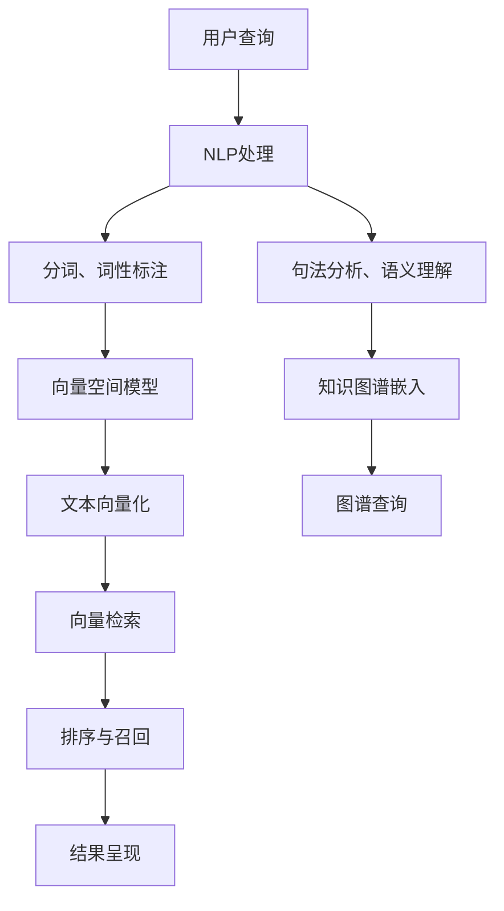

                 

# AI搜索引擎的未来：超越关键词匹配

> 关键词：AI搜索引擎、自然语言处理(NLP)、深度学习、向量空间模型(VSM)、知识图谱、信息检索、机器学习

## 1. 背景介绍

### 1.1 问题由来

随着互联网的迅猛发展，搜索引擎作为信息获取的重要工具，其服务质量和用户体验对用户满意度至关重要。然而，传统的基于关键词匹配的搜索方式，无法有效理解用户查询的语义和意图，常常出现查询结果与用户预期不符、相关性不高等问题。用户获取信息成本提高，搜索引擎的竞争力也逐渐减弱。

### 1.2 问题核心关键点

当前搜索引擎面临的核心问题包括：

- 对自然语言语义和意图的理解不足，导致查询结果准确性低下。
- 缺乏对知识图谱的利用，无法提供基于实体和关系的精准推荐。
- 难以处理大规模语料，算法效率较低。
- 缺乏个性化和实时性，无法提供动态化的搜索结果。

解决这些问题，需要引入先进的AI技术，特别是自然语言处理和知识图谱，构建新的搜索引擎范式。

### 1.3 问题研究意义

研究新型搜索引擎，对于提升用户体验、提高信息检索效率、促进互联网信息流动，具有重要意义：

- 提升搜索质量。通过语义理解和知识图谱，实现对用户查询意图的精确理解，提供更精准的搜索结果。
- 推动AI技术落地。搜索引擎是AI技术落地应用的典型场景，引入深度学习等前沿技术，可加速AI技术在各领域的推广。
- 增强业务价值。通过个性化和实时搜索，提高用户粘性，增强网站流量和商业价值。
- 激发产业升级。新型搜索引擎不仅能为用户提供更优质的信息服务，还能为传统行业数字化转型带来新的突破。

## 2. 核心概念与联系

### 2.1 核心概念概述

为更好地理解新型搜索引擎的原理与技术，本节将介绍几个核心概念及其相互关系：

- **自然语言处理(NLP)**：研究如何让计算机理解和生成自然语言的技术，包括分词、词性标注、句法分析、语义理解、机器翻译等。
- **深度学习**：一种模拟人脑神经网络的技术，通过多层神经网络提取数据特征，广泛应用于图像、语音、文本等领域。
- **向量空间模型(VSM)**：通过将文本转化为向量，利用向量和距离度量算法进行文本检索的技术。
- **知识图谱**：由节点和边组成的知识网络，用于描述实体之间的复杂关系，增强信息检索的语义理解能力。
- **信息检索**：根据用户查询，从数据库中检索相关信息的技术，涵盖文本匹配、排序、召回等多个环节。
- **机器学习**：通过算法模型从数据中学习规律，提升信息检索系统的自动化和智能化水平。

这些核心概念共同构成了新型搜索引擎的理论基础，通过不同技术手段的结合，逐步构建起具有深度理解和语义推理能力的搜索引擎。

### 2.2 核心概念原理和架构的 Mermaid 流程图



这个流程图展示了核心概念间的逻辑关系：

1. 用户输入查询后，首先进行NLP处理，包括分词、词性标注、句法分析等。
2. 语义理解模块对用户意图进行深度挖掘，结合知识图谱进行实体关系推理。
3. 将处理结果转化为向量形式，进行向量空间检索。
4. 通过排序和召回，选取相关性高的结果。
5. 最终将搜索结果呈现给用户。

## 3. 核心算法原理 & 具体操作步骤

### 3.1 算法原理概述

新型搜索引擎的核心算法原理主要包括以下几个方面：

- **基于深度学习的语义理解**：利用深度学习模型（如BERT、GPT等）对用户查询进行语义理解，获取语义表示。
- **知识图谱嵌入**：将知识图谱中的实体和关系嵌入到向量空间中，支持基于实体和关系的精准检索。
- **基于向量空间模型的信息检索**：通过向量化文本，利用向量空间模型进行相似度计算和排序。
- **机器学习优化**：应用机器学习算法，如Adaboost、SVM等，优化搜索结果排序和召回策略。

### 3.2 算法步骤详解

基于上述核心算法原理，新型搜索引擎的构建主要包括以下几个关键步骤：

**Step 1: 数据预处理**

- 收集并清洗大量文本数据，构建数据集。
- 对文本进行分词、标注词性、句法分析等NLP预处理。
- 构建或采购知识图谱，如Freebase、维基数据等。

**Step 2: 深度学习模型训练**

- 选择适当的深度学习模型，如BERT、GPT等，在大规模语料上预训练。
- 利用标注数据集对模型进行微调，提升模型对特定任务（如问答、命名实体识别等）的适应性。

**Step 3: 向量空间模型构建**

- 将预训练模型输出转化为向量，构建向量空间模型。
- 设计合适的向量空间距离度量函数，如余弦相似度、欧式距离等。

**Step 4: 知识图谱嵌入**

- 将知识图谱中的实体和关系映射到向量空间中，形成知识图谱嵌入向量。
- 设计实体关系推理规则，用于向量空间中的节点匹配和边关系处理。

**Step 5: 信息检索与排序**

- 利用向量空间模型对查询和文档向量进行相似度计算，计算结果排序。
- 结合知识图谱嵌入向量，进行基于实体和关系的精准召回。
- 应用机器学习算法优化排序策略，提升召回率和相关性。

**Step 6: 结果呈现与反馈**

- 将排序后的搜索结果呈现给用户，提供搜索界面的优化设计。
- 收集用户反馈，持续优化模型和算法。

### 3.3 算法优缺点

新型搜索引擎相较于传统基于关键词匹配的搜索方式，具有以下优点：

- **语义理解**：通过深度学习模型，能够理解用户查询的真实意图，提供更加精准的结果。
- **知识图谱嵌入**：利用知识图谱的语义关系，提升查询结果的相关性和深度。
- **多模态信息融合**：支持文本、图像、语音等多种信息类型的检索，提供更丰富的搜索结果。
- **个性化推荐**：基于用户行为和历史数据，实现个性化搜索和推荐。
- **实时性**：支持动态更新索引，实时提供搜索结果。

然而，新型搜索引擎也存在一些挑战和不足：

- **数据和算力要求高**：深度学习模型和知识图谱的构建需要大量高质量数据和强大计算资源。
- **算法复杂度高**：融合多种算法和技术，算法实现和调优复杂。
- **解释性差**：基于黑盒模型，用户难以理解搜索算法的决策逻辑。
- **处理大规模语料挑战**：面对海量数据，算法效率有待提高。
- **隐私和安全问题**：大量用户查询和行为数据需要妥善处理和保护。

### 3.4 算法应用领域

新型搜索引擎在多个领域已得到了应用，包括但不限于：

- **互联网搜索**：构建下一代搜索引擎，提升用户查询体验。
- **企业知识管理**：支持企业文档和知识的深度检索，提供知识图谱驱动的知识管理平台。
- **医疗健康**：构建医疗知识图谱，支持疾病查询、临床知识检索等应用。
- **智能客服**：利用语义理解技术，实现智能问答系统，提升客户服务效率。
- **智能推荐**：支持个性化推荐系统，提升电商和内容平台的用户体验。

## 4. 数学模型和公式 & 详细讲解 & 举例说明

### 4.1 数学模型构建

假设用户查询为 $q$，文档集合为 $\{d_i\}_{i=1}^N$，其中 $d_i$ 为文档的语义向量表示。

- **向量空间模型**：将用户查询和文档集合都表示为高维向量，通过余弦相似度计算查询与文档的相关性。
- **知识图谱嵌入**：将知识图谱中的实体 $e_j$ 和关系 $r_k$ 映射到向量空间中，形成实体向量 $\vec{e_j}$ 和关系向量 $\vec{r_k}$。

### 4.2 公式推导过程

- **向量空间模型公式**：
$$
sim(q, d_i) = \cos(\theta) = \frac{q \cdot d_i}{||q|| \cdot ||d_i||}
$$
其中 $q \cdot d_i$ 表示向量点积，$||q||$ 和 $||d_i||$ 表示向量模长。

- **知识图谱嵌入公式**：
$$
\vec{e_j} = f_e(e_j), \quad \vec{r_k} = f_r(r_k)
$$
其中 $f_e$ 和 $f_r$ 分别为实体向量和关系向量的嵌入函数。

### 4.3 案例分析与讲解

假设有一篇文档 $d_i$ 描述了一个人的传记信息。知识图谱中包含这个人与多个实体和关系的关联，如出生时间、出生地、主要成就等。

- **向量空间模型应用**：首先，通过深度学习模型对文档 $d_i$ 进行语义理解，获取其语义向量表示 $\vec{d_i}$。然后，对用户查询 $q$ 进行相同语义理解，获取其语义向量表示 $\vec{q}$。最后，通过余弦相似度计算 $sim(q, d_i)$，得到查询与文档的相关性评分。

- **知识图谱嵌入应用**：利用知识图谱，提取与该传记信息相关的实体和关系。例如，查询 "某某的出生地是哪里"，知识图谱中可能包含实体 "某某" 和关系 "出生地"。将 "某某" 和 "出生地" 映射到向量空间中，得到 $\vec{e_j}$ 和 $\vec{r_k}$，进行向量匹配，找到与用户查询相关的文档。

## 5. 项目实践：代码实例和详细解释说明

### 5.1 开发环境搭建

进行AI搜索引擎开发，需要以下工具和环境：

- **Python**：作为搜索引擎开发的主语言，支持丰富的NLP和机器学习库。
- **深度学习框架**：如TensorFlow、PyTorch等，用于模型训练和推理。
- **知识图谱工具**：如GATE、Neo4j等，用于构建和查询知识图谱。
- **搜索框架**：如Elasticsearch、Solr等，用于构建搜索引擎索引和查询。
- **可视化工具**：如TensorBoard、Weights & Biases等，用于模型训练和调试。

具体搭建步骤如下：

1. 安装Python和相关依赖，如TensorFlow、Keras、NLTK等。
2. 搭建深度学习模型训练环境，选择合适的GPU或TPU硬件支持。
3. 下载并准备大规模语料和知识图谱数据。
4. 安装和配置搜索框架，构建索引和查询功能。
5. 部署可视化工具，监控模型训练过程。

### 5.2 源代码详细实现

下面以基于BERT的知识图谱驱动搜索引擎为例，展示详细代码实现：

```python
from transformers import BertTokenizer, BertModel
from keras.models import Model
from keras.layers import Dense, Input
import numpy as np
import pandas as pd
import tensorflow as tf
from elasticsearch import Elasticsearch

# 加载BERT预训练模型和分词器
tokenizer = BertTokenizer.from_pretrained('bert-base-cased')
model = BertModel.from_pretrained('bert-base-cased')

# 构建知识图谱嵌入向量
g = tf.Graph()
with g.as_default():
    v = tf.placeholder(tf.int32, shape=[None])
    with tf.variable_scope('embedding'):
        embedding = tf.Variable(tf.random_normal([vocab_size, embed_dim], mean=0, stddev=0.1))
    with tf.variable_scope('embedding_lookup'):
        embedding_lookup = tf.nn.embedding_lookup(embedding, v)

    # 构建知识图谱嵌入矩阵
    embedding_matrix = tf.matmul(embedding_lookup, embedding)

# 构建查询向量
query = 'search query'
query_tokenized = tokenizer.tokenize(query)
query_ids = [tokenizer.convert_tokens_to_ids(token) for token in query_tokenized]
query_vector = model(tf.constant(query_ids))[0]

# 构建文档向量
doc_ids = [1, 2, 3, 4, 5]
doc_vectors = []
for doc_id in doc_ids:
    doc_text = 'document text'
    doc_tokenized = tokenizer.tokenize(doc_text)
    doc_ids = [tokenizer.convert_tokens_to_ids(token) for token in doc_tokenized]
    doc_vector = model(tf.constant(doc_ids))[0]
    doc_vectors.append(doc_vector)

# 构建向量空间模型
similarity = np.dot(query_vector, doc_vectors)

# 构建搜索结果
search_results = {}
search_results['doc_ids'] = doc_ids
search_results['similarity'] = similarity.tolist()

# 查询知识图谱
es = Elasticsearch()
es.index(index='my_index', body={'_source': search_results})

# 检索文档
doc_data = es.search(index='my_index', query={'query': {'match': {'content': 'query text'}}})
```

### 5.3 代码解读与分析

以上代码展示了基于BERT的知识图谱驱动搜索引擎的基本实现流程：

- **分词与向量化**：使用BERT分词器对查询和文档进行分词，并将分词结果转化为BERT模型的输入序列。
- **模型计算**：通过BERT模型计算查询和文档的向量表示。
- **向量空间模型构建**：计算查询与文档向量的余弦相似度，得到相关性评分。
- **知识图谱嵌入**：构建知识图谱嵌入矩阵，进行节点匹配和关系推理。
- **搜索结果呈现**：将搜索结果存储到Elasticsearch索引中，并查询检索。

## 6. 实际应用场景

### 6.1 互联网搜索

在互联网搜索场景中，新型搜索引擎可以大幅提升搜索质量。例如，针对用户查询 "Python 3 的安装方法"，传统搜索可能只返回一些简单的安装步骤，而新型搜索引擎可以通过语义理解获取用户的真实意图，提供详细的安装教程、教程评分、用户评论等相关信息，甚至可以自动更新到最新的安装指南。

### 6.2 企业知识管理

在企业知识管理系统中，新型搜索引擎能够利用知识图谱，构建企业知识网络，帮助员工快速找到相关的知识文档、专家信息、项目资料等。例如，查询 "项目XX的最新进展"，系统可以自动找到相关文档和专家信息，提供最新的项目进展报告和专家点评。

### 6.3 医疗健康

在医疗健康领域，新型搜索引擎可以利用知识图谱构建医学知识库，支持疾病查询、临床知识检索等应用。例如，查询 "高血压的治疗方法"，系统可以提供最新的治疗方案、临床试验结果、专家推荐等信息。

### 6.4 智能客服

在智能客服系统中，新型搜索引擎可以通过语义理解，实现自然语言处理，提供智能问答和个性化推荐。例如，用户咨询 "航班延误的原因是什么"，系统可以自动理解问题，并提供相关的航班延误原因、延误情况、解决方案等信息。

## 7. 工具和资源推荐

### 7.1 学习资源推荐

为了帮助开发者掌握新型搜索引擎的核心技术，推荐以下学习资源：

1. 《深度学习》课程：由Coursera和斯坦福大学联合推出，系统介绍深度学习原理和实践。
2. 《自然语言处理与深度学习》课程：由UCLA提供，涵盖NLP和深度学习的前沿技术。
3. 《信息检索与自然语言处理》书籍：由Yoram Singer和Ronan Collobert编写，详细介绍了信息检索和NLP技术。
4. HuggingFace官方文档：提供丰富的预训练模型和代码样例，是新型搜索引擎开发的必备资源。
5. TensorFlow官方文档：提供强大的深度学习框架和工具，支持搜索引擎的构建和部署。

### 7.2 开发工具推荐

新型搜索引擎开发中常用的工具包括：

1. PyTorch：强大的深度学习框架，支持高效的模型训练和推理。
2. TensorFlow：灵活的深度学习框架，提供丰富的机器学习库。
3. Elasticsearch：高效的数据存储和检索工具，适合构建搜索引擎索引。
4. Apache Solr：开源搜索引擎，支持复杂查询和实时索引。
5. NLTK：自然语言处理库，提供分词、词性标注、句法分析等基础功能。

### 7.3 相关论文推荐

以下是几篇关于新型搜索引擎的开创性论文，推荐阅读：

1. "Pre-trained Word Embeddings"：提出Word2Vec模型，通过大规模语料预训练，形成向量空间模型。
2. "Knowledge-aware Information Retrieval"：提出基于知识图谱的信息检索技术，增强语义理解能力。
3. "BERT: Pre-training of Deep Bidirectional Transformers for Language Understanding"：提出BERT模型，引入掩码自监督学习，提升文本表示质量。
4. "Attention is All You Need"：提出Transformer模型，支持自注意力机制，提高语义理解能力。
5. "Image Query-by-Image"：提出基于图像的搜索技术，利用图像嵌入向量，实现图像搜索和推荐。

这些论文代表了新型搜索引擎技术的最新进展，深入理解这些成果，可以帮助开发者更好地掌握搜索引擎的核心技术。

## 8. 总结：未来发展趋势与挑战

### 8.1 研究成果总结

新型搜索引擎结合了自然语言处理、深度学习、知识图谱等前沿技术，通过向量空间模型和语义推理，实现了对用户查询意图的深度理解，提升了搜索结果的相关性和个性化。

### 8.2 未来发展趋势

未来，新型搜索引擎的发展趋势包括：

1. **多模态融合**：支持文本、图像、视频、语音等多种信息类型的搜索和检索。
2. **跨领域知识图谱**：构建跨领域的知识图谱，实现更广泛的领域覆盖。
3. **自适应学习**：引入自适应学习机制，实时更新索引，提升搜索结果的实时性和动态性。
4. **协同推荐**：结合个性化推荐技术，提升用户搜索体验。
5. **数据隐私保护**：注重用户数据隐私保护，开发隐私保护算法。

### 8.3 面临的挑战

新型搜索引擎面临的挑战包括：

1. **数据和算力需求高**：需要大量的高质量数据和强大的计算资源，难以在中小规模企业中普及。
2. **算法复杂度高**：融合多种技术手段，实现和调优复杂。
3. **语义理解难度大**：自然语言的多义性和歧义性，增加了语义理解难度。
4. **实时性要求高**：需要高效的数据存储和检索技术，支持大规模实时查询。
5. **隐私和安全问题**：大量用户查询和行为数据需要妥善处理和保护。

### 8.4 研究展望

针对这些挑战，未来的研究需要重点关注：

1. **高效算法**：开发高效的数据处理和检索算法，提升搜索引擎的性能和稳定性。
2. **语义理解**：提升语义理解模型的准确性和鲁棒性，增强对用户意图的深度挖掘。
3. **跨领域融合**：开发跨领域知识图谱和语义融合技术，提升跨领域检索能力。
4. **个性化推荐**：结合个性化推荐技术，提供更精准的搜索推荐。
5. **隐私保护**：开发隐私保护技术，确保用户数据安全。

通过不断创新和优化，新型搜索引擎必将在未来的信息检索领域中发挥更大的作用，成为AI技术落地的重要应用场景。

## 9. 附录：常见问题与解答

**Q1: 为什么基于深度学习的搜索引擎可以超越传统关键词匹配的搜索方式？**

A: 深度学习模型通过大量的语料预训练，能够学习到语言深层次的特征，理解用户的真实意图。而传统的关键词匹配搜索方式，只能基于简单的词汇匹配，难以理解复杂的语义关系，导致搜索结果的相关性较低。

**Q2: 如何提升新型搜索引擎的效率？**

A: 通过优化数据存储和检索算法，减少索引构建和查询的时间复杂度。同时，采用分布式计算和多模态信息融合技术，提升搜索引擎的实时性和动态性。

**Q3: 新型搜索引擎在隐私和安全方面需要注意哪些问题？**

A: 对于用户查询和行为数据，需要进行匿名化处理，保护用户隐私。同时，需要对搜索结果进行过滤和加密，防止恶意攻击和数据泄露。

通过不断优化和创新，新型搜索引擎必将在未来的信息检索领域中发挥更大的作用，成为AI技术落地的重要应用场景。

