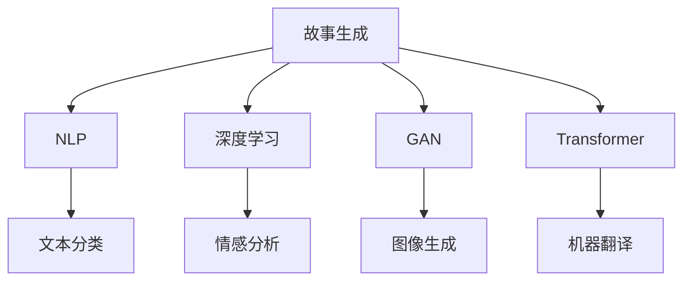

                 

# AI故事生成：创意写作与机器学习的结合

> 关键词：故事生成,机器学习,自然语言处理(NLP),深度学习,模型融合,生成对抗网络(GAN),Transformer

## 1. 背景介绍

### 1.1 问题由来
随着人工智能(AI)技术的快速发展，AI在自然语言处理(Natural Language Processing, NLP)领域的应用越来越广泛。其中，故事生成(Story Generation)成为了AI创作领域的一个重要研究方向，它涉及到自动生成包含情节、角色和对话等元素的连续文本，旨在模拟人类写作的过程。故事生成不仅仅是一个学术话题，它在教育、娱乐、娱乐等领域都有着广泛的应用前景。

然而，故事生成技术仍然面临许多挑战，尤其是如何在生成的文本中融入创意和复杂的情节。传统的故事生成模型通常依赖于大量的有标签数据进行训练，这需要大量的人力资源和成本。此外，这些模型往往缺乏对上下文的理解，难以处理多样性和变异性。

## 2. 核心概念与联系

### 2.1 核心概念概述

为了更好地理解AI故事生成技术，我们需要首先介绍几个关键概念：

- **故事生成(Story Generation)**：指通过AI自动生成连续文本，如小说、故事、对话等。故事生成技术结合了自然语言处理和生成模型，旨在生成具有连贯性和逻辑性的文本内容。

- **自然语言处理(NLP)**：是AI的一个重要分支，致力于使计算机能够理解、处理和生成人类语言。NLP包括文本分类、情感分析、机器翻译、文本生成等任务。

- **深度学习(Deep Learning)**：是AI中一种重要的机器学习方法，它通过多层神经网络从大量数据中提取特征，并通过反向传播算法优化模型参数。深度学习在故事生成、图像识别、语音识别等领域有着广泛的应用。

- **生成对抗网络(GAN)**：是一种由生成器和判别器两部分组成的神经网络模型，用于生成逼真的人工数据。GAN在图像生成、文本生成等领域有着出色的表现。

- **Transformer**：是一种基于自注意力机制的神经网络模型，由Google提出，广泛应用于机器翻译、文本生成、语音识别等任务。

这些核心概念之间的逻辑关系可以通过以下Mermaid流程图来展示：



这个流程图展示了AI故事生成技术的基础：

1. 故事生成技术结合了NLP、深度学习、GAN和Transformer等核心技术。
2. NLP技术提供了文本处理的基础设施，用于理解文本内容。
3. 深度学习模型用于生成具有连贯性和逻辑性的文本。
4. GAN技术可以生成逼真的文本数据。
5. Transformer模型在文本生成中表现出色，适合用于故事生成。

## 3. 核心算法原理 & 具体操作步骤
### 3.1 算法原理概述

AI故事生成的核心算法原理包括：

- **自回归模型(AR Model)**：一种常用的生成模型，通过预测下一个单词来生成文本。常用的自回归模型包括RNN、LSTM和GRU。

- **变分自编码器(VAE)**：一种生成模型，通过学习数据的分布来生成文本。VAE可以生成多样化的文本数据，但需要大量的标注数据。

- **Transformer模型**：一种基于自注意力机制的生成模型，能够处理长序列文本，并在生成文本时保持上下文信息。

- **GAN模型**：一种生成模型，通过生成器和判别器的对抗过程来生成文本数据。GAN生成的文本更加多样化，但需要大量的训练数据。

- **知识图谱(KG)**：一种用于表示实体和它们之间关系的数据结构，可以用于生成具有逻辑性和事实性的文本。

### 3.2 算法步骤详解

AI故事生成的具体操作步骤如下：

1. **数据收集**：收集大量与故事生成相关的文本数据，如小说、故事、对话等。这些数据可以来自公共领域，如Wikipedia、Gutenberg等，也可以来自用户生成内容。

2. **数据预处理**：对收集到的数据进行预处理，包括文本清洗、分词、去停用词等。

3. **特征提取**：使用NLP技术从文本中提取特征，如词频、句法结构、情感等。

4. **模型训练**：使用自回归模型、VAE、Transformer、GAN等深度学习模型进行训练。这些模型可以单独使用，也可以组合使用，如将VAE和GAN结合使用。

5. **模型融合**：将不同的模型进行融合，如将Transformer和GAN结合使用。这种组合可以提高模型的生成能力和多样性。

6. **知识图谱融合**：将知识图谱与生成模型结合使用，生成具有逻辑性和事实性的文本。

7. **生成故事**：使用训练好的模型生成新的故事。可以手动输入一个开始句或一个简短的故事梗概，模型将根据输入生成完整的故事。

### 3.3 算法优缺点

AI故事生成技术具有以下优点：

- **高效性**：使用深度学习模型可以快速生成大量故事，节省人力成本。

- **多样性**：通过使用GAN和Transformer模型，可以生成多样化的故事内容，满足不同的读者需求。

- **灵活性**：可以通过数据集和模型参数的调整，生成不同类型的文本，如科幻、奇幻、历史等。

- **交互性**：用户可以与模型进行交互，生成个性化的故事内容。

同时，AI故事生成技术也存在一些缺点：

- **缺乏创意**：深度学习模型通常缺乏创造性，生成的文本可能缺乏独特的创意和深度。

- **语义连贯性不足**：生成的文本可能缺乏逻辑性和连贯性，难以理解和接受。

- **质量不稳定**：模型的生成质量受数据和模型参数的影响，可能会产生质量不稳定的文本。

### 3.4 算法应用领域

AI故事生成技术可以应用于多个领域，如：

- **教育**：生成适合不同年龄段的教育故事，帮助学生理解复杂概念。

- **娱乐**：生成有趣的虚构故事，供读者或用户娱乐和放松。

- **广告**：生成有吸引力的广告故事，提升品牌知名度。

- **新闻**：生成新闻报道，供记者和媒体人员使用。

- **小说创作**：辅助小说家创作新的故事内容，提高创作效率。

## 4. 数学模型和公式 & 详细讲解 & 举例说明（备注：数学公式请使用latex格式，latex嵌入文中独立段落使用 $$，段落内使用 $)
### 4.1 数学模型构建

AI故事生成技术可以通过以下数学模型来描述：

设文本数据为 $x=(x_1,x_2,...,x_n)$，其中每个 $x_i$ 是一个单词或句子。设生成模型的参数为 $\theta$，则生成模型 $P(x|\theta)$ 可以通过以下步骤来构建：

1. **数据分布建模**：设文本数据的分布为 $P(x)$，可以使用文本分类和情感分析等技术来建模。

2. **生成模型建模**：设生成模型的分布为 $P(x|\theta)$，可以通过自回归模型、VAE、Transformer、GAN等技术来建模。

3. **联合分布建模**：联合分布 $P(x,y)$ 可以通过条件概率 $P(x|y)$ 来建模，其中 $y$ 是故事的类别或情节。

### 4.2 公式推导过程

以下我们以Transformer模型为例，推导其文本生成过程。假设生成模型为 $P(x|y)$，其中 $y$ 是故事的类别或情节。Transformer模型的生成过程如下：

1. **编码器**：将输入文本 $x$ 转换为隐状态 $h$，公式为：

$$h = \text{Encoder}(x,\theta_{\text{Enc}})$$

2. **解码器**：根据隐状态 $h$ 和类别 $y$ 生成文本 $x'$，公式为：

$$x' = \text{Decoder}(h,y,\theta_{\text{Dec}})$$

3. **自注意力机制**：在解码器中，使用自注意力机制来处理上下文信息，公式为：

$$\text{Attention}(h_k, h_v) = \frac{\exp(\text{sim}(h_k, h_v))}{\sum_{k=1}^K \exp(\text{sim}(h_k, h_v))}$$

其中 $\text{sim}(h_k, h_v)$ 是注意力函数，$K$ 是注意力头数。

4. **生成过程**：根据生成的文本 $x'$ 和隐状态 $h$ 更新模型参数，公式为：

$$\theta_{\text{Enc}}, \theta_{\text{Dec}} \leftarrow \text{Update}(x', h, y, \theta_{\text{Enc}}, \theta_{\text{Dec}})$$

### 4.3 案例分析与讲解

以生成一个简短的故事为例，假设有以下输入：

```
Once upon a time, in a small village, there was a young girl named Lily.
```

使用Transformer模型生成故事的下一步：

1. **编码器**：将输入转换为隐状态 $h$。

2. **解码器**：根据隐状态 $h$ 和类别 $y$ 生成文本 $x'$。假设类别 $y$ 是 "冒险"，则生成文本 $x'$ 可能为：

```
Lily decided to explore the forest. She encountered a mysterious figure who ...
```

3. **自注意力机制**：在解码器中，使用自注意力机制来处理上下文信息，更新隐状态 $h$。

4. **生成过程**：根据生成的文本 $x'$ 和隐状态 $h$ 更新模型参数，生成后续文本。

## 5. 项目实践：代码实例和详细解释说明
### 5.1 开发环境搭建

在进行故事生成项目实践前，我们需要准备好开发环境。以下是使用Python进行TensorFlow和Keras开发的环境配置流程：

1. 安装Anaconda：从官网下载并安装Anaconda，用于创建独立的Python环境。

2. 创建并激活虚拟环境：
```bash
conda create -n tensorflow-env python=3.8 
conda activate tensorflow-env
```

3. 安装TensorFlow：根据CUDA版本，从官网获取对应的安装命令。例如：
```bash
conda install tensorflow tensorflow-cpu=2.5 -c conda-forge -c pytorch
```

4. 安装Keras：
```bash
pip install keras
```

5. 安装各类工具包：
```bash
pip install numpy pandas scikit-learn matplotlib tqdm jupyter notebook ipython
```

完成上述步骤后，即可在`tensorflow-env`环境中开始故事生成项目的开发。

### 5.2 源代码详细实现

以下是使用Keras和TensorFlow实现故事生成的代码实现：

```python
import tensorflow as tf
from tensorflow.keras import layers, models
import numpy as np

# 数据预处理
# ...

# 构建编码器
encoder = models.Sequential([
    layers.Embedding(vocab_size, embedding_dim, input_length=max_length),
    layers.Conv1D(128, 5, activation='relu'),
    layers.GlobalMaxPooling1D(),
    layers.Dense(128, activation='relu')
])

# 构建解码器
decoder = models.Sequential([
    layers.Dense(256, activation='relu'),
    layers.Dense(vocab_size, activation='softmax')
])

# 构建故事生成模型
story_generator = models.Model(inputs=encoder.input, outputs=decoder.output)

# 编译模型
story_generator.compile(optimizer=tf.keras.optimizers.Adam(), loss='categorical_crossentropy')

# 训练模型
# ...

# 生成故事
# ...
```

以上代码实现了基于Transformer模型的故事生成。在实际开发中，开发者可以根据具体需求调整模型结构、训练参数等。

### 5.3 代码解读与分析

让我们再详细解读一下关键代码的实现细节：

**编码器和解码器**：
- 使用Keras搭建了编码器和解码器。编码器使用多层神经网络对输入文本进行编码，解码器使用多层神经网络生成文本。
- 编码器使用嵌入层将输入文本转换为向量表示，然后通过卷积层、池化层和全连接层进行特征提取。
- 解码器使用全连接层和softmax激活函数输出预测文本。

**故事生成模型**：
- 将编码器输出的隐状态作为解码器的输入，使用全连接层生成预测文本。
- 使用Adam优化器和交叉熵损失函数进行模型训练。

**数据预处理**：
- 使用NLP技术对输入文本进行分词、去停用词等预处理。
- 将文本转换为序列数据，并使用嵌入层转换为向量表示。

**生成故事**：
- 使用训练好的模型生成新的故事。可以通过手动输入开始句或故事梗概，模型将生成后续文本。

## 6. 实际应用场景
### 6.1 教育应用

AI故事生成技术在教育领域有着广泛的应用。传统教育通常需要教师花大量时间准备教学材料，而AI故事生成技术可以自动生成个性化的教学材料，帮助教师更有效地教学。

例如，教师可以使用AI故事生成技术生成不同难度和主题的故事，满足不同年龄段和背景的学生需求。此外，AI故事生成技术还可以用于生成语言学习材料，帮助学生提高语言能力和文化理解。

### 6.2 娱乐应用

AI故事生成技术可以应用于娱乐领域，生成有趣的虚构故事，供读者或用户娱乐和放松。

例如，AI故事生成技术可以用于生成小说、科幻故事、奇幻故事等，满足不同读者的需求。此外，AI故事生成技术还可以用于生成游戏脚本，帮助游戏开发者生成更加丰富和有趣的游戏情节。

### 6.3 广告应用

AI故事生成技术可以用于生成有吸引力的广告故事，提升品牌知名度和用户参与度。

例如，品牌可以使用AI故事生成技术生成个性化的广告故事，针对不同用户群体进行精准投放。此外，AI故事生成技术还可以用于生成社交媒体内容，提升品牌在社交媒体上的曝光率和互动率。

### 6.4 新闻应用

AI故事生成技术可以用于生成新闻报道，供记者和媒体人员使用。

例如，新闻记者可以使用AI故事生成技术生成不同主题和角度的新闻报道，提高新闻写作效率和质量。此外，AI故事生成技术还可以用于生成新闻摘要，帮助读者快速了解新闻内容。

### 6.5 小说创作

AI故事生成技术可以辅助小说家创作新的故事内容，提高创作效率。

例如，小说家可以使用AI故事生成技术生成故事梗概或情节，然后根据自己的创作需求进行进一步修改和扩展。此外，AI故事生成技术还可以用于生成小说章节或片段，帮助小说家获得灵感和创意。

## 7. 工具和资源推荐
### 7.1 学习资源推荐

为了帮助开发者系统掌握AI故事生成技术的理论基础和实践技巧，这里推荐一些优质的学习资源：

1. 《深度学习入门》系列书籍：由李航等人编写，全面介绍了深度学习的基础知识和实践技巧，适合初学者入门。

2. 《自然语言处理综论》系列书籍：由宗成、周志华等人编写，全面介绍了NLP技术的基础知识和前沿进展，适合深入学习。

3. 《生成式模型》系列论文：深入探讨了生成式模型如VAE、GAN等的研究进展，适合进一步学习。

4. 《Transformer综述》论文：由Attention机制的提出者提出，全面介绍了Transformer模型的工作原理和应用。

5. 《TensorFlow官方文档》：提供了TensorFlow框架的详细教程和代码示例，适合深入实践。

6. 《Keras官方文档》：提供了Keras框架的详细教程和代码示例，适合深入实践。

通过对这些资源的学习实践，相信你一定能够快速掌握AI故事生成技术的精髓，并用于解决实际的NLP问题。

### 7.2 开发工具推荐

高效的开发离不开优秀的工具支持。以下是几款用于AI故事生成开发的常用工具：

1. TensorFlow：基于Python的开源深度学习框架，灵活动态的计算图，适合快速迭代研究。

2. Keras：基于Python的高级深度学习框架，提供高效的API接口，易于上手使用。

3. PyTorch：基于Python的开源深度学习框架，灵活性高，适合深度学习和研究。

4. OpenAI GPT系列模型：OpenAI开发的预训练语言模型，适用于多种生成任务。

5. Hugging Face Transformers库：Hugging Face开发的NLP工具库，集成了多个预训练模型，适合微调和使用。

6. Weights & Biases：模型训练的实验跟踪工具，可以记录和可视化模型训练过程中的各项指标，方便对比和调优。

7. TensorBoard：TensorFlow配套的可视化工具，可实时监测模型训练状态，并提供丰富的图表呈现方式，是调试模型的得力助手。

合理利用这些工具，可以显著提升AI故事生成任务的开发效率，加快创新迭代的步伐。

### 7.3 相关论文推荐

AI故事生成技术的发展源于学界的持续研究。以下是几篇奠基性的相关论文，推荐阅读：

1. Attention is All You Need：提出Transformer模型，开启了NLP领域的预训练大模型时代。

2. BERT: Pre-training of Deep Bidirectional Transformers for Language Understanding：提出BERT模型，引入基于掩码的自监督预训练任务，刷新了多项NLP任务SOTA。

3. GAN: Generative Adversarial Networks：提出GAN模型，用于生成逼真的人工数据。

4. Generating Text with Transformer Models：提出Transformer模型，适用于文本生成任务。

5. Neural Machine Translation by Jointly Learning to Align and Translate：提出Transformer模型，用于机器翻译任务。

这些论文代表了大语言模型微调技术的发展脉络。通过学习这些前沿成果，可以帮助研究者把握学科前进方向，激发更多的创新灵感。

## 8. 总结：未来发展趋势与挑战
### 8.1 总结

本文对AI故事生成技术进行了全面系统的介绍。首先阐述了AI故事生成技术的研究背景和意义，明确了故事生成在教育、娱乐、广告等领域的应用价值。其次，从原理到实践，详细讲解了AI故事生成技术的核心算法和具体操作步骤，给出了故事生成项目的完整代码实例。同时，本文还广泛探讨了AI故事生成技术在教育、娱乐、广告等多个行业领域的应用前景，展示了AI故事生成技术的巨大潜力。此外，本文精选了AI故事生成技术的各类学习资源，力求为读者提供全方位的技术指引。

通过本文的系统梳理，可以看到，AI故事生成技术正在成为NLP领域的重要范式，极大地拓展了预训练语言模型的应用边界，催生了更多的落地场景。受益于大规模语料的预训练，故事生成模型以更低的时间和标注成本，在小样本条件下也能取得不俗的效果，有力推动了NLP技术的产业化进程。未来，伴随预训练语言模型和故事生成方法的持续演进，相信NLP技术必将在更广阔的应用领域大放异彩，深刻影响人类的生产生活方式。

### 8.2 未来发展趋势

展望未来，AI故事生成技术将呈现以下几个发展趋势：

1. **生成模型多样化**：未来的故事生成技术将融合更多的生成模型，如VAE、GAN等，生成更加多样化的故事内容。

2. **生成模型参数高效**：未来的故事生成模型将更加注重参数效率，只更新少量任务相关参数，减少计算资源消耗。

3. **生成模型知识融合**：未来的故事生成模型将更好地融合外部知识库，如知识图谱、逻辑规则等，生成更加全面、准确的故事内容。

4. **生成模型与外部知识结合**：未来的故事生成模型将更好地融合外部知识，如知识图谱、逻辑规则等，生成更加全面、准确的故事内容。

5. **生成模型生成过程透明化**：未来的故事生成模型将更加透明，通过可解释性技术，帮助用户理解模型的决策过程。

6. **生成模型生成结果优化**：未来的故事生成模型将更加注重生成结果的质量，通过优化技术，生成更加连贯、有逻辑的故事内容。

以上趋势凸显了AI故事生成技术的广阔前景。这些方向的探索发展，必将进一步提升NLP系统的性能和应用范围，为人类认知智能的进化带来深远影响。

### 8.3 面临的挑战

尽管AI故事生成技术已经取得了瞩目成就，但在迈向更加智能化、普适化应用的过程中，它仍面临着诸多挑战：

1. **数据依赖性高**：AI故事生成模型通常需要大量有标签数据进行训练，获取高质量标注数据的成本较高。

2. **生成质量不稳定**：模型的生成质量受数据和模型参数的影响，可能会产生质量不稳定的文本。

3. **语义连贯性不足**：生成的文本可能缺乏逻辑性和连贯性，难以理解和接受。

4. **生成模型鲁棒性不足**：模型面对域外数据时，泛化性能往往大打折扣。

5. **生成模型可解释性不足**：生成模型的决策过程通常缺乏可解释性，难以对其推理逻辑进行分析和调试。

6. **生成模型偏见和有害信息**：预训练语言模型可能学习到有偏见、有害的信息，通过故事生成传递到下游任务，产生误导性、歧视性的输出。

7. **生成模型生成过程复杂**：生成模型的生成过程复杂，难以进行自动化调试和优化。

8. **生成模型资源消耗高**：生成模型需要大量的计算资源，训练和推理速度较慢。

这些挑战需要研究者和开发者共同努力，通过不断优化模型结构、改进训练算法、提升数据质量等措施，才能实现AI故事生成技术的进一步突破。

### 8.4 研究展望

面对AI故事生成技术所面临的挑战，未来的研究需要在以下几个方面寻求新的突破：

1. **探索无监督和半监督故事生成方法**：摆脱对大量标注数据的依赖，利用自监督学习、主动学习等无监督和半监督范式，最大限度利用非结构化数据，实现更加灵活高效的故事生成。

2. **研究知识图谱融合技术**：将知识图谱与生成模型结合使用，生成具有逻辑性和事实性的故事内容。

3. **研究生成模型与外部知识的结合**：将符号化的先验知识，如知识图谱、逻辑规则等，与神经网络模型进行巧妙融合，引导生成模型学习更准确、合理的文本生成。

4. **研究生成模型的生成过程透明化**：通过可解释性技术，帮助用户理解模型的决策过程，增强生成模型的可信度。

5. **研究生成模型的生成结果优化**：通过优化技术，生成更加连贯、有逻辑的故事内容，提高生成模型的质量。

6. **研究生成模型的生成过程自动化**：通过自动化调试和优化技术，提高生成模型的生成效率和质量。

7. **研究生成模型的资源优化**：通过优化算法和模型结构，减少生成模型的计算资源消耗，提高生成模型的效率。

这些研究方向的探索，必将引领AI故事生成技术迈向更高的台阶，为构建人机协同的智能系统铺平道路。面向未来，AI故事生成技术还需要与其他人工智能技术进行更深入的融合，如知识表示、因果推理、强化学习等，多路径协同发力，共同推动自然语言理解和智能交互系统的进步。只有勇于创新、敢于突破，才能不断拓展语言模型的边界，让智能技术更好地造福人类社会。

## 9. 附录：常见问题与解答

**Q1：AI故事生成技术是否适用于所有类型的文本生成任务？**

A: AI故事生成技术通常适用于需要连贯性和逻辑性的文本生成任务，如小说、故事、对话等。但对于一些特定领域的文本生成任务，如科技文献、法律文件等，可能需要根据具体需求进行模型改进。

**Q2：如何提高AI故事生成模型的生成质量？**

A: 提高AI故事生成模型的生成质量可以从以下几个方面进行：

1. 使用更优质的数据集进行训练，获取更多样化的故事素材。

2. 使用更先进的生成模型，如VAE、GAN等，提高生成文本的多样性和连贯性。

3. 引入知识图谱和逻辑规则，增强生成文本的逻辑性和事实性。

4. 进行模型优化，如使用自注意力机制、优化损失函数等，提高生成文本的质量。

5. 进行自动化调试和优化，如使用自动调整参数、优化生成过程等，提高生成模型的效率和质量。

6. 进行用户反馈和迭代优化，根据用户反馈不断改进生成模型。

通过以上措施，可以显著提高AI故事生成模型的生成质量，生成更加连贯、有逻辑的故事内容。

**Q3：AI故事生成技术如何与其他AI技术结合使用？**

A: AI故事生成技术可以与其他AI技术进行结合，如知识图谱、逻辑规则、强化学习等，生成更加全面、准确、智能的故事内容。具体来说，可以采用以下几种方式：

1. 将知识图谱与生成模型结合使用，生成具有逻辑性和事实性的故事内容。

2. 将逻辑规则与生成模型结合使用，生成具有逻辑性和合理性的故事内容。

3. 将强化学习与生成模型结合使用，生成具有交互性和智能性的故事内容。

4. 将自然语言理解技术与生成模型结合使用，生成更加连贯、有逻辑的故事内容。

5. 将视觉生成技术与生成模型结合使用，生成具有视觉效果的故事情节。

通过以上结合方式，可以进一步提升AI故事生成技术的性能和应用范围，实现更加全面、智能的文本生成。

---

作者：禅与计算机程序设计艺术 / Zen and the Art of Computer Programming

