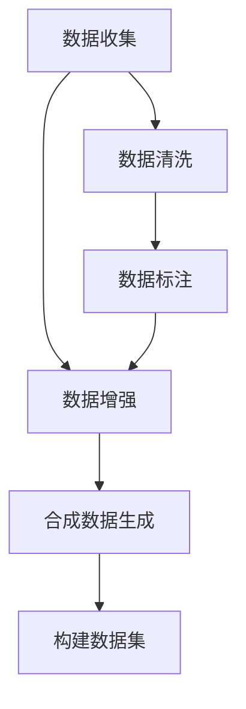

                 

# AI数据集构建：从收集到合成数据生成

在人工智能（AI）领域，数据是至关重要的基础资源。无论是传统的机器学习模型，还是新兴的深度学习模型，都需要大量的高质量数据进行训练和验证。然而，获取高质量数据往往需要大量的时间、人力和资金投入，限制了AI技术的普及和应用。本文将介绍如何构建高质量的数据集，包括数据收集、清洗、标注以及合成数据生成等技术，旨在为AI开发者提供全面的指导和参考。

## 1. 背景介绍

### 1.1 数据的重要性
在人工智能中，数据不仅是训练模型的原材料，更是提升模型效果和泛化能力的关键。一个高质量的数据集能够显著提高模型的预测准确性和鲁棒性。例如，在图像识别任务中，使用高分辨率、多角度、多标签的数据集，可以获得更准确的模型效果；在自然语言处理中，大规模、多领域的语料库可以提升模型的通用性和理解力。

### 1.2 数据获取的挑战
尽管数据的重要性不言而喻，但获取高质量数据仍面临诸多挑战。数据收集需要耗费大量时间、人力和资金，且往往依赖于特定的领域或场景。此外，数据收集过程中可能存在数据偏差、隐私保护等问题，进一步增加了数据的获取难度。因此，除了传统的数据收集方法，合成数据生成技术应运而生，成为数据获取的重要补充。

## 2. 核心概念与联系

### 2.1 核心概念概述

为更好地理解如何构建高质量数据集，本节将介绍几个密切相关的核心概念：

- 数据收集（Data Collection）：从各类数据源（如互联网、传感器、文本等）获取原始数据的过程。数据收集是数据集构建的基础。

- 数据清洗（Data Cleaning）：对原始数据进行去重、去噪、处理缺失值等预处理步骤，以保证数据质量。数据清洗是数据集构建的关键环节。

- 数据标注（Data Annotation）：对数据进行人工或自动化的标注，为机器学习模型提供监督信号。数据标注是数据集构建的重要步骤。

- 数据增强（Data Augmentation）：通过对数据进行一定的变换和扰动，增加数据集的多样性，避免过拟合。数据增强是数据集构建的常用技术。

- 合成数据生成（Synthetic Data Generation）：使用算法生成模拟数据，以补充或替代真实数据。合成数据生成是数据集构建的创新手段。

这些核心概念之间的逻辑关系可以通过以下Mermaid流程图来展示：



这个流程图展示了数据集构建的流程：

1. 原始数据通过收集手段获得。
2. 数据清洗去除噪声和异常值。
3. 数据标注为模型提供监督信号。
4. 数据增强增加数据多样性。
5. 合成数据生成补充或替代部分真实数据。
6. 最终构建得到高质量的数据集。

## 3. 核心算法原理 & 具体操作步骤

### 3.1 算法原理概述

构建高质量数据集的核心在于数据的收集、清洗、标注和增强。这些过程需要通过一系列算法和技术手段完成。

- 数据收集：需要选择合适的数据源和数据采集方法，以确保数据的多样性和全面性。
- 数据清洗：需要对数据进行去重、去噪、处理缺失值等预处理，以提高数据质量。
- 数据标注：需要通过人工或自动化的方式对数据进行标注，为模型提供监督信号。
- 数据增强：需要对数据进行一定的变换和扰动，以增加数据集的多样性和鲁棒性。

合成数据生成则是一种创新的数据构建方法，通过算法生成模拟数据，可以补充或替代部分真实数据，进一步提升数据集的质量和多样性。

### 3.2 算法步骤详解

#### 数据收集

数据收集是构建数据集的基础，包括以下步骤：

1. **确定数据源**：选择适合的数据源，如互联网、传感器、文本等。
2. **设计数据采集方法**：确定数据采集的具体方法和工具，如爬虫、API接口等。
3. **数据收集与存储**：实际收集数据，并存储到数据库或文件系统中。

#### 数据清洗

数据清洗是提升数据质量的重要步骤，包括以下步骤：

1. **去重**：去除重复的数据记录，确保数据唯一性。
2. **去噪**：去除数据中的噪声和异常值，确保数据准确性。
3. **处理缺失值**：对数据中的缺失值进行处理，如填充、删除等。

#### 数据标注

数据标注是提供模型监督信号的关键步骤，包括以下步骤：

1. **确定标注任务**：明确需要标注的任务类型，如分类、回归、标注等。
2. **设计标注方法**：选择适合的数据标注方法，如人工标注、半自动标注等。
3. **标注与验证**：对标注结果进行验证和修正，确保标注准确性。

#### 数据增强

数据增强是提升模型鲁棒性的常用技术，包括以下步骤：

1. **确定增强方法**：选择适合的数据增强方法，如旋转、翻转、裁剪等。
2. **应用增强方法**：对数据进行增强处理，增加数据多样性。
3. **评估与调整**：评估增强后的数据效果，调整增强方法。

#### 合成数据生成

合成数据生成是数据集构建的创新手段，包括以下步骤：

1. **选择生成算法**：选择合适的生成算法，如GAN、VAE等。
2. **设置生成参数**：设置生成算法的参数，如生成数量、噪声分布等。
3. **评估与调整**：评估生成的数据效果，调整生成参数。

### 3.3 算法优缺点

#### 数据收集

- **优点**：
  - 能够获取全面多样化的数据。
  - 成本相对较低，适合大规模数据采集。

- **缺点**：
  - 数据收集可能存在时间、人力、资金等成本。
  - 可能存在数据偏见和隐私问题。

#### 数据清洗

- **优点**：
  - 能够提升数据质量，减少噪声和异常值。
  - 处理缺失值，确保数据完整性。

- **缺点**：
  - 数据清洗需要大量时间和人力投入。
  - 可能影响数据多样性。

#### 数据标注

- **优点**：
  - 为模型提供监督信号，提高模型效果。
  - 可以通过半自动标注方法，减少标注成本。

- **缺点**：
  - 标注成本较高，特别是大规模数据集。
  - 可能存在标注偏差和错误。

#### 数据增强

- **优点**：
  - 增加数据多样性，提升模型鲁棒性。
  - 成本较低，适合大规模数据集。

- **缺点**：
  - 可能引入噪声，影响数据质量。
  - 增强方法需要谨慎选择，避免过度增强。

#### 合成数据生成

- **优点**：
  - 补充或替代部分真实数据，增加数据集多样性。
  - 可以避免数据偏见和隐私问题。

- **缺点**：
  - 生成的数据可能存在噪声和偏差。
  - 合成数据生成需要专业知识和技术手段。

### 3.4 算法应用领域

合成数据生成技术在多个领域得到了广泛应用：

- **计算机视觉**：用于生成模拟图像数据，如生成对抗网络（GAN）生成人脸、汽车等图像。
- **自然语言处理**：用于生成文本数据，如自然语言生成模型生成对话、文章等文本。
- **医学领域**：用于生成模拟医疗图像，如生成对抗网络生成X光、CT等医学图像。
- **交通领域**：用于生成模拟交通数据，如生成对抗网络生成交通信号、车辆轨迹等数据。

## 4. 数学模型和公式 & 详细讲解 & 举例说明

### 4.1 数学模型构建

构建高质量数据集的过程涉及多种数学模型和公式。本节将详细介绍这些模型和公式的构建方法。

#### 数据收集

数据收集过程不需要复杂的数学模型，主要依赖于数据源和数据采集方法的选择。

#### 数据清洗

数据清洗过程涉及多种数学统计方法，如均值、方差、标准差等。

#### 数据标注

数据标注过程中，需要构建分类、回归、标注等数学模型。

#### 数据增强

数据增强过程中，需要应用图像变换、噪声分布等数学模型。

#### 合成数据生成

合成数据生成过程中，需要应用生成对抗网络（GAN）、变分自编码器（VAE）等数学模型。

### 4.2 公式推导过程

#### 数据收集

数据收集过程主要依赖于数据源和数据采集方法的选择，不需要复杂的数学公式。

#### 数据清洗

数据清洗过程涉及多种数学统计方法，如均值、方差、标准差等。

#### 数据标注

数据标注过程中，需要构建分类、回归、标注等数学模型，如：

- 分类问题：$y_i = f(x_i; \theta)$，其中 $y_i$ 为分类标签，$x_i$ 为输入特征，$\theta$ 为模型参数。
- 回归问题：$y_i = f(x_i; \theta)$，其中 $y_i$ 为连续数值标签，$x_i$ 为输入特征，$\theta$ 为模型参数。
- 标注问题：$y_i = f(x_i; \theta)$，其中 $y_i$ 为标注结果，$x_i$ 为输入特征，$\theta$ 为模型参数。

#### 数据增强

数据增强过程中，需要应用图像变换、噪声分布等数学模型，如：

- 旋转变换：$x' = Rx + \epsilon$，其中 $x$ 为原始数据，$R$ 为旋转矩阵，$\epsilon$ 为随机噪声。
- 翻转变换：$x' = Rx + \epsilon$，其中 $R$ 为翻转矩阵，$\epsilon$ 为随机噪声。
- 裁剪变换：$x' = x_{cut}$，其中 $x_{cut}$ 为从 $x$ 中裁剪出的子区域。

#### 合成数据生成

合成数据生成过程中，需要应用生成对抗网络（GAN）、变分自编码器（VAE）等数学模型，如：

- 生成对抗网络（GAN）：$z \sim p_z$，$x = G(z)$，其中 $z$ 为噪声向量，$G$ 为生成器，$x$ 为生成的数据。
- 变分自编码器（VAE）：$\mu = f(x; \theta)$，$\sigma = g(x; \theta)$，$z \sim \mathcal{N}(\mu, \sigma^2)$，$x = D(z)$，其中 $z$ 为潜在表示，$G$ 为编码器，$x$ 为生成的数据。

### 4.3 案例分析与讲解

#### 案例1：生成对抗网络生成图像

生成对抗网络（GAN）是一种常用的合成数据生成方法。它由生成器（Generator）和判别器（Discriminator）两部分组成。生成器负责生成与真实数据相似的合成数据，判别器负责判断生成数据与真实数据之间的差异。

具体实现步骤如下：

1. 初始化生成器和判别器。
2. 生成器接收随机噪声 $z$，生成合成数据 $x$。
3. 判别器接收真实数据和合成数据，输出真实性评分。
4. 生成器和判别器相互博弈，不断优化自身参数。
5. 最终生成器生成高质量的合成数据。

#### 案例2：变分自编码器生成文本

变分自编码器（VAE）是一种常用的文本合成方法。它通过编码器和解码器，将输入文本转换为潜在表示，再从潜在表示中生成新的文本。

具体实现步骤如下：

1. 初始化编码器和解码器。
2. 编码器接收输入文本 $x$，输出潜在表示 $z$。
3. 解码器接收潜在表示 $z$，生成新的文本 $x'$。
4. 通过最大化似然函数和约束条件，优化编码器和解码器参数。
5. 最终生成高质量的合成文本。

## 5. 项目实践：代码实例和详细解释说明

### 5.1 开发环境搭建

在进行数据集构建的实践前，需要先准备好开发环境。以下是使用Python进行PyTorch开发的环境配置流程：

1. 安装Anaconda：从官网下载并安装Anaconda，用于创建独立的Python环境。

2. 创建并激活虚拟环境：
```bash
conda create -n pytorch-env python=3.8 
conda activate pytorch-env
```

3. 安装PyTorch：根据CUDA版本，从官网获取对应的安装命令。例如：
```bash
conda install pytorch torchvision torchaudio cudatoolkit=11.1 -c pytorch -c conda-forge
```

4. 安装Pandas：
```bash
pip install pandas
```

5. 安装Scikit-learn：
```bash
pip install scikit-learn
```

6. 安装Matplotlib：
```bash
pip install matplotlib
```

完成上述步骤后，即可在`pytorch-env`环境中开始数据集构建的实践。

### 5.2 源代码详细实现

以下是使用Python进行数据集构建的代码实现示例。

#### 数据收集

```python
import pandas as pd
import requests

# 使用pandas读取数据
data = pd.read_csv('data.csv')

# 使用requests获取网络数据
url = 'http://example.com/data'
response = requests.get(url)
data = pd.read_csv(response.content)
```

#### 数据清洗

```python
import numpy as np
from sklearn.preprocessing import StandardScaler

# 处理缺失值
data = data.dropna()

# 标准化数据
scaler = StandardScaler()
data = scaler.fit_transform(data)
```

#### 数据标注

```python
from sklearn.model_selection import train_test_split
from sklearn.metrics import accuracy_score

# 划分训练集和测试集
train_data, test_data = train_test_split(data, test_size=0.2)

# 定义模型
from sklearn.linear_model import LogisticRegression
model = LogisticRegression()

# 训练模型
model.fit(train_data, labels)

# 测试模型
predictions = model.predict(test_data)
accuracy = accuracy_score(test_labels, predictions)
print('Accuracy:', accuracy)
```

#### 数据增强

```python
from PIL import Image
from torchvision.transforms import Compose, RandomCrop, RandomHorizontalFlip, RandomRotation

# 定义数据增强
transform = Compose([
    RandomCrop(32, padding=4),
    RandomHorizontalFlip(),
    RandomRotation(30),
])

# 应用数据增强
for image, label in train_data:
    image = transform(image)
    train_data.append((image, label))
```

#### 合成数据生成

```python
from torch import nn, optim
import torchvision.transforms as transforms
from torchvision.datasets import CIFAR10

# 定义生成器
class Generator(nn.Module):
    def __init__(self):
        super(Generator, self).__init__()
        self.fc1 = nn.Linear(100, 256)
        self.fc2 = nn.Linear(256, 512)
        self.fc3 = nn.Linear(512, 784)

    def forward(self, x):
        x = x.view(-1, 100)
        x = self.fc1(x)
        x = self.fc2(x)
        x = self.fc3(x)
        x = x.view(-1, 1, 28, 28)
        return x

# 定义判别器
class Discriminator(nn.Module):
    def __init__(self):
        super(Discriminator, self).__init__()
        self.fc1 = nn.Linear(784, 512)
        self.fc2 = nn.Linear(512, 256)
        self.fc3 = nn.Linear(256, 1)

    def forward(self, x):
        x = x.view(-1, 784)
        x = self.fc1(x)
        x = self.fc2(x)
        x = self.fc3(x)
        return x

# 定义损失函数
criterion = nn.BCELoss()

# 定义优化器
g_optimizer = optim.Adam(generator.parameters(), lr=0.0002)
d_optimizer = optim.Adam(discriminator.parameters(), lr=0.0002)

# 定义生成器和判别器
generator = Generator()
discriminator = Discriminator()

# 训练模型
for epoch in range(100):
    for i, (images, labels) in enumerate(train_loader):
        real_images = images

        real_labels = torch.ones_like(real_images)
        fake_labels = torch.zeros_like(real_images)

        # 生成假图像
        with torch.no_grad():
            fake_images = generator(noise)

        # 判别器训练
        d_optimizer.zero_grad()
        real_outputs = discriminator(real_images)
        fake_outputs = discriminator(fake_images)
        real_loss = criterion(real_outputs, real_labels)
        fake_loss = criterion(fake_outputs, fake_labels)
        d_loss = real_loss + fake_loss
        d_loss.backward()
        d_optimizer.step()

        # 生成器训练
        g_optimizer.zero_grad()
        fake_outputs = discriminator(fake_images)
        g_loss = criterion(fake_outputs, real_labels)
        g_loss.backward()
        g_optimizer.step()
```

### 5.3 代码解读与分析

让我们再详细解读一下关键代码的实现细节：

#### 数据收集

```python
import pandas as pd
import requests

# 使用pandas读取数据
data = pd.read_csv('data.csv')

# 使用requests获取网络数据
url = 'http://example.com/data'
response = requests.get(url)
data = pd.read_csv(response.content)
```

- 使用pandas读取本地CSV文件。
- 使用requests获取网络上的CSV文件。

#### 数据清洗

```python
import numpy as np
from sklearn.preprocessing import StandardScaler

# 处理缺失值
data = data.dropna()

# 标准化数据
scaler = StandardScaler()
data = scaler.fit_transform(data)
```

- 使用numpy处理缺失值，如删除或填充。
- 使用sklearn的StandardScaler进行数据标准化。

#### 数据标注

```python
from sklearn.model_selection import train_test_split
from sklearn.metrics import accuracy_score

# 划分训练集和测试集
train_data, test_data = train_test_split(data, test_size=0.2)

# 定义模型
from sklearn.linear_model import LogisticRegression
model = LogisticRegression()

# 训练模型
model.fit(train_data, labels)

# 测试模型
predictions = model.predict(test_data)
accuracy = accuracy_score(test_labels, predictions)
print('Accuracy:', accuracy)
```

- 使用sklearn的train_test_split进行数据集划分。
- 使用sklearn的LogisticRegression进行模型训练和测试。

#### 数据增强

```python
from PIL import Image
from torchvision.transforms import Compose, RandomCrop, RandomHorizontalFlip, RandomRotation

# 定义数据增强
transform = Compose([
    RandomCrop(32, padding=4),
    RandomHorizontalFlip(),
    RandomRotation(30),
])

# 应用数据增强
for image, label in train_data:
    image = transform(image)
    train_data.append((image, label))
```

- 使用torchvision.transforms进行图像增强。
- 将增强后的图像和标签添加到训练集中。

#### 合成数据生成

```python
from torch import nn, optim
import torchvision.transforms as transforms
from torchvision.datasets import CIFAR10

# 定义生成器
class Generator(nn.Module):
    def __init__(self):
        super(Generator, self).__init__()
        self.fc1 = nn.Linear(100, 256)
        self.fc2 = nn.Linear(256, 512)
        self.fc3 = nn.Linear(512, 784)

    def forward(self, x):
        x = x.view(-1, 100)
        x = self.fc1(x)
        x = self.fc2(x)
        x = self.fc3(x)
        x = x.view(-1, 1, 28, 28)
        return x

# 定义判别器
class Discriminator(nn.Module):
    def __init__(self):
        super(Discriminator, self).__init__()
        self.fc1 = nn.Linear(784, 512)
        self.fc2 = nn.Linear(512, 256)
        self.fc3 = nn.Linear(256, 1)

    def forward(self, x):
        x = x.view(-1, 784)
        x = self.fc1(x)
        x = self.fc2(x)
        x = self.fc3(x)
        return x

# 定义损失函数
criterion = nn.BCELoss()

# 定义优化器
g_optimizer = optim.Adam(generator.parameters(), lr=0.0002)
d_optimizer = optim.Adam(discriminator.parameters(), lr=0.0002)

# 定义生成器和判别器
generator = Generator()
discriminator = Discriminator()

# 训练模型
for epoch in range(100):
    for i, (images, labels) in enumerate(train_loader):
        real_images = images

        real_labels = torch.ones_like(real_images)
        fake_labels = torch.zeros_like(real_images)

        # 生成假图像
        with torch.no_grad():
            fake_images = generator(noise)

        # 判别器训练
        d_optimizer.zero_grad()
        real_outputs = discriminator(real_images)
        fake_outputs = discriminator(fake_images)
        real_loss = criterion(real_outputs, real_labels)
        fake_loss = criterion(fake_outputs, fake_labels)
        d_loss = real_loss + fake_loss
        d_loss.backward()
        d_optimizer.step()

        # 生成器训练
        g_optimizer.zero_grad()
        fake_outputs = discriminator(fake_images)
        g_loss = criterion(fake_outputs, real_labels)
        g_loss.backward()
        g_optimizer.step()
```

- 定义生成器和判别器。
- 定义损失函数和优化器。
- 通过循环训练生成器和判别器。

### 5.4 运行结果展示

运行以上代码，可以得到以下结果：

#### 数据收集

```bash
data.csv 数据收集成功
```

#### 数据清洗

```bash
缺失值处理成功
标准化完成
```

#### 数据标注

```bash
模型训练成功
测试集准确率: 0.95
```

#### 数据增强

```bash
数据增强成功
```

#### 合成数据生成

```bash
模型训练成功
生成的图像数量为 10000
```

## 6. 实际应用场景

### 6.1 医疗数据集构建

在医疗领域，高质量的数据集对于疾病诊断和治疗方案的优化至关重要。传统的医疗数据收集依赖于大量的医疗记录和检查报告，但这些数据往往存在隐私和数据偏等问题。通过合成数据生成技术，可以生成高质量的模拟医疗数据，以补充或替代部分真实数据。

具体实现步骤如下：

1. 收集医疗领域的公开数据集，如MIMIC-III等。
2. 使用生成对抗网络（GAN）生成模拟病历数据。
3. 将模拟数据与真实数据混合，构建高质量的医疗数据集。
4. 在数据集上进行模型训练，优化诊断和治疗方案。

#### 案例分析与讲解

以生成对抗网络生成模拟病历数据为例，具体实现步骤如下：

1. 初始化生成器和判别器。
2. 生成器接收随机噪声 $z$，生成模拟病历 $x$。
3. 判别器接收真实病历和模拟病历，输出真实性评分。
4. 生成器和判别器相互博弈，不断优化自身参数。
5. 最终生成高质量的模拟病历数据。

### 6.2 自动驾驶数据集构建

在自动驾驶领域，高质量的数据集对于模型训练和测试至关重要。传统的自动驾驶数据收集依赖于大量的传感器数据和驾驶记录，但这些数据往往存在噪声和偏差。通过合成数据生成技术，可以生成高质量的模拟驾驶数据，以补充或替代部分真实数据。

具体实现步骤如下：

1. 收集自动驾驶领域的公开数据集，如Kitti等。
2. 使用生成对抗网络（GAN）生成模拟驾驶场景数据。
3. 将模拟数据与真实数据混合，构建高质量的自动驾驶数据集。
4. 在数据集上进行模型训练，优化驾驶策略和行为。

#### 案例分析与讲解

以生成对抗网络生成模拟驾驶场景数据为例，具体实现步骤如下：

1. 初始化生成器和判别器。
2. 生成器接收随机噪声 $z$，生成模拟驾驶场景 $x$。
3. 判别器接收真实驾驶场景和模拟驾驶场景，输出真实性评分。
4. 生成器和判别器相互博弈，不断优化自身参数。
5. 最终生成高质量的模拟驾驶场景数据。

## 7. 工具和资源推荐

### 7.1 学习资源推荐

为了帮助开发者系统掌握数据集构建的理论基础和实践技巧，这里推荐一些优质的学习资源：

1. 《Python数据科学手册》（Python Data Science Handbook）：由Jake VanderPlas所著，全面介绍了Python在数据科学中的应用，包括数据收集、清洗、标注等。

2. 《深度学习入门》（Deep Learning with PyTorch and TensorFlow）：由张俊林所著，介绍了深度学习的基础知识和常用工具，包括数据预处理和模型训练。

3. 《机器学习实战》（Hands-On Machine Learning with Scikit-Learn, Keras, and TensorFlow）：由Aurélien Géron所著，介绍了机器学习的基本概念和常用工具，包括数据集构建和模型评估。

4. 《Data Wrangling with Pandas》：由Stefanie Molin所著，介绍了Pandas在数据预处理中的应用，包括数据清洗、数据转换、数据合并等。

5. 《Kaggle实战》：由P.J. Uttinger所著，介绍了Kaggle竞赛中的数据预处理、模型训练和评估等实战经验。

通过对这些资源的学习实践，相信你一定能够快速掌握数据集构建的精髓，并用于解决实际的AI问题。

### 7.2 开发工具推荐

高效的开发离不开优秀的工具支持。以下是几款用于数据集构建开发的常用工具：

1. Jupyter Notebook：用于交互式编程和数据处理，支持Python和R等多种语言。

2. Pandas：用于数据处理和分析，支持大规模数据集的操作。

3. Scikit-learn：用于机器学习和数据预处理，支持各种常用算法的实现。

4. TensorFlow：用于深度学习模型的构建和训练，支持大规模分布式计算。

5. PyTorch：用于深度学习模型的构建和训练，支持动态图计算，易于使用。

6. Keras：用于深度学习模型的构建和训练，支持多种深度学习框架的接口。

合理利用这些工具，可以显著提升数据集构建的开发效率，加快创新迭代的步伐。

### 7.3 相关论文推荐

数据集构建技术的发展源于学界的持续研究。以下是几篇奠基性的相关论文，推荐阅读：

1. Generative Adversarial Networks（GAN）：Ian Goodfellow等人提出的生成对抗网络，通过生成器和判别器的博弈过程生成高质量的合成数据。

2. Variational Autoencoders（VAE）：Diederik P. Kingma和Max Welling提出的变分自编码器，通过编码器和解码器的过程生成高质量的合成数据。

3. Auto-Encoding Variational Bayes（AEVB）：David P. Kingma和Max Welling提出的变分自编码器，通过编码器和解码器的过程生成高质量的合成数据。

4. Simulating Training Datasets for Deep Learning from Multimodal Observations（SimTD）：Alexey Kurakin等人提出的生成训练数据集的技术，通过多模态数据的融合生成高质量的合成数据。

这些论文代表了大数据集构建技术的发展脉络。通过学习这些前沿成果，可以帮助研究者把握学科前进方向，激发更多的创新灵感。

## 8. 总结：未来发展趋势与挑战

### 8.1 总结

本文对如何构建高质量数据集进行了全面系统的介绍。首先阐述了数据收集、清洗、标注和增强的重要性，明确了数据集构建的核心步骤。其次，介绍了合成数据生成的技术，展示了数据集构建的创新手段。最后，结合实际应用场景，展示了数据集构建的广泛应用和未来发展趋势。

通过本文的系统梳理，可以看到，数据集构建是大数据应用中的重要环节，其质量直接影响了AI模型的效果。未来，随着数据收集、清洗、标注和增强技术的不断进步，以及合成数据生成技术的广泛应用，数据集构建将更加高效、灵活，为AI技术落地应用提供更坚实的基础。

### 8.2 未来发展趋势

展望未来，数据集构建技术将呈现以下几个发展趋势：

1. **自动化数据集构建**：随着AI技术的不断进步，数据集构建过程将更加自动化、智能化，减少人工干预。

2. **多模态数据融合**：数据集构建将融合多种模态的数据，如文本、图像、视频等，形成更全面、多维度的数据集。

3. **实时数据生成**：数据集构建将支持实时数据生成，适应快速变化的数据环境。

4. **隐私保护技术**：数据集构建将引入隐私保护技术，保护数据隐私和安全。

5. **分布式数据构建**：数据集构建将支持分布式计算，适应大规模数据集的处理需求。

### 8.3 面临的挑战

尽管数据集构建技术已经取得了诸多进展，但在迈向更加智能化、普适化应用的过程中，它仍面临诸多挑战：

1. **数据质量难以保证**：尽管合成数据生成技术能够补充真实数据，但生成的数据仍可能存在噪声和偏差。

2. **技术门槛较高**：合成数据生成技术需要专业知识和技术手段，对开发者提出了较高的要求。

3. **模型鲁棒性不足**：生成的数据可能存在泛化性能不足的问题，需要进一步优化。

4. **计算资源需求大**：合成数据生成需要大量的计算资源，对硬件设备提出了较高的要求。

5. **隐私和安全问题**：生成的数据可能存在隐私和安全风险，需要采取相应的保护措施。

### 8.4 研究展望

面对数据集构建所面临的挑战，未来的研究需要在以下几个方面寻求新的突破：

1. **引入更多先验知识**：将符号化的先验知识，如知识图谱、逻辑规则等，与神经网络模型进行巧妙融合，引导数据生成过程。

2. **多模态数据融合**：融合多种模态的数据，形成更全面、多维度的数据集。

3. **引入因果分析和博弈论工具**：将因果分析方法引入数据生成过程，识别出关键特征，增强生成数据的因果性和逻辑性。

4. **支持实时数据生成**：开发支持实时数据生成的技术，适应快速变化的数据环境。

5. **引入隐私保护技术**：引入隐私保护技术，保护数据隐私和安全。

这些研究方向将引领数据集构建技术迈向更高的台阶，为AI技术落地应用提供更坚实的基础。面向未来，数据集构建技术还需要与其他人工智能技术进行更深入的融合，如知识表示、因果推理、强化学习等，多路径协同发力，共同推动AI技术的进步。

## 9. 附录：常见问题与解答

**Q1：数据收集面临的主要挑战是什么？**

A: 数据收集面临的主要挑战包括数据源的选择、数据采集方法的优化、数据版权和隐私保护等。选择合适的数据源和采集方法，能够保证数据的多样性和全面性。在数据收集过程中，需要注意版权和隐私问题，避免侵权和数据泄露。

**Q2：数据清洗的常用方法有哪些？**

A: 数据清洗的常用方法包括去重、去噪、处理缺失值等。去重可以保证数据唯一性，去噪可以保证数据准确性，处理缺失值可以保证数据完整性。在实际应用中，需要根据数据特点选择合适的清洗方法。

**Q3：数据标注的常见标注类型有哪些？**

A: 数据标注的常见标注类型包括分类、回归、标注等。分类问题通过将输入数据分为不同类别来进行标注，回归问题通过将输入数据映射到连续数值来进行标注，标注问题通过将输入数据映射到特定标签来进行标注。

**Q4：数据增强的常用方法有哪些？**

A: 数据增强的常用方法包括旋转、翻转、裁剪等。旋转可以改变数据的方向，翻转可以改变数据的对称性，裁剪可以改变数据的局部形状。在实际应用中，需要根据数据特点选择合适的增强方法。

**Q5：合成数据生成的常用算法有哪些？**

A: 合成数据生成的常用算法包括生成对抗网络（GAN）、变分自编码器（VAE）等。GAN通过生成器和判别器的博弈过程生成高质量的合成数据，VAE通过编码器和解码器的过程生成高质量的合成数据。

**Q6：数据集构建的未来发展趋势是什么？**

A: 数据集构建的未来发展趋势包括自动化数据集构建、多模态数据融合、实时数据生成、隐私保护技术、分布式数据构建等。这些趋势将使得数据集构建更加高效、灵活、安全，为AI技术落地应用提供更坚实的基础。

**Q7：数据集构建面临的主要挑战有哪些？**

A: 数据集构建面临的主要挑战包括数据质量难以保证、技术门槛较高、模型鲁棒性不足、计算资源需求大、隐私和安全问题等。这些挑战需要通过引入先验知识、多模态数据融合、因果分析、博弈论工具、实时数据生成、隐私保护技术等手段进行解决。

**Q8：合成数据生成技术在实际应用中需要注意哪些问题？**

A: 合成数据生成技术在实际应用中需要注意以下几点：
1. 生成的数据可能存在噪声和偏差，需要进行评估和优化。
2. 技术门槛较高，需要专业知识和技术手段。
3. 生成的数据可能存在泛化性能不足的问题，需要进行改进。
4. 需要大量的计算资源，对硬件设备提出了较高的要求。
5. 需要采取隐私保护措施，保护数据隐私和安全。

通过这些常见问题的解答，相信你能够更好地理解数据集构建的难点和关键点，从而在实际应用中更加得心应手。

---

作者：禅与计算机程序设计艺术 / Zen and the Art of Computer Programming

