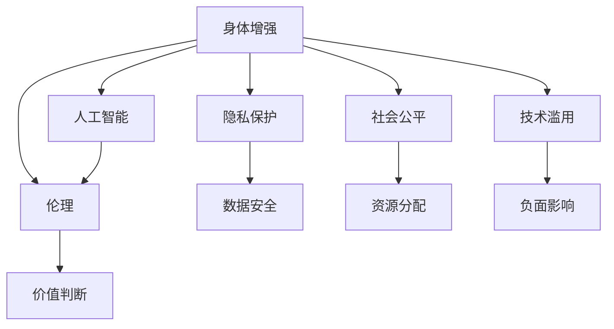

                 

# AI时代的人类增强：身体增强与道德考虑的未来展望

> 关键词：身体增强, 人工智能, 道德伦理, 健康改善, 社会影响, 医学应用, 技术实现

## 1. 背景介绍

### 1.1 问题由来
随着人工智能(AI)技术的快速发展，人类增强技术也逐渐从科幻走进现实。从假肢到基因编辑，再到脑机接口，越来越多的技术手段被应用于提升人类的物理和认知能力。然而，这些技术的快速普及也引发了广泛的道德和伦理讨论。特别是在身体增强方面，技术应用与伦理规范之间的冲突愈发凸显。如何在技术进步与伦理约束之间找到平衡点，是当前AI时代人类增强技术面临的重大挑战。

### 1.2 问题核心关键点
本文聚焦于身体增强技术在AI时代的现状、前景以及面临的伦理道德问题。具体而言，我们将从以下几个核心关键点进行探讨：

1. **技术现状**：介绍当前流行的身体增强技术，如假肢、基因编辑、脑机接口等，并分析其技术原理和应用场景。
2. **伦理困境**：讨论身体增强技术在应用过程中遇到的伦理和道德问题，如隐私保护、社会公平、技术滥用等。
3. **未来展望**：基于当前的研究进展和伦理讨论，展望未来身体增强技术的发展趋势和应用前景。
4. **应对策略**：提出若干技术和管理策略，旨在促进身体增强技术的健康、可持续和负责任地发展。

## 2. 核心概念与联系

### 2.1 核心概念概述

为更好地理解身体增强技术及其伦理道德问题，本节将介绍几个密切相关的核心概念：

- **身体增强**：通过技术手段改善人类的身体机能、运动能力和感知能力。常见的技术手段包括假肢、基因编辑、脑机接口等。
- **人工智能**：模拟人类智能行为的计算机程序，包括机器学习、深度学习等技术。
- **伦理**：涉及价值判断和规范约束的学科，关注技术应用对个人、社会和环境的影响。
- **隐私保护**：保障个人信息安全的法律和技术措施，防止隐私泄露和数据滥用。
- **社会公平**：关注资源分配和社会参与，确保技术进步带来的利益普惠所有人。
- **技术滥用**：指技术被不正当使用或超出其预期用途，带来负面影响。

这些核心概念之间的逻辑关系可以通过以下Mermaid流程图来展示：



这个流程图展示了这个概念框架的核心要素及其相互关系：

1. 身体增强技术通过人工智能提升性能，但需考虑伦理约束。
2. 技术应用可能涉及隐私保护、社会公平、技术滥用等问题。
3. 需要通过价值判断、数据安全、资源分配等措施，确保技术健康发展。

## 3. 核心算法原理 & 具体操作步骤
### 3.1 算法原理概述

身体增强技术，尤其是与AI结合的智能增强，涉及多个学科的交叉融合。其核心思想是通过人工智能算法，将传感器数据与大脑信号结合，通过机械或生物方式，增强人类的身体能力。

形式化地，假设身体增强系统为 $S$，其输入为 $I$（传感器数据），输出为 $O$（增强后的身体信号或动作）。则系统目标为：

$$
O = S(I)
$$

其中 $I$ 可以是肌肉电信号、脑电波、肢体位置等传感器数据，$O$ 可以是假肢动作、基因编辑后的组织细胞、脑机接口反馈信号等。

通过深度学习、信号处理等算法，将输入 $I$ 映射到输出 $O$，最大化提升身体增强效果。常见的算法包括：

- 卷积神经网络（CNN）：用于处理图像和视频数据，提取关键特征。
- 循环神经网络（RNN）：处理序列数据，用于时间序列分析和信号处理。
- 生成对抗网络（GAN）：生成逼真的人体模型和仿真数据，用于训练和优化。
- 强化学习：通过模拟环境中的奖励反馈，优化身体增强策略。

### 3.2 算法步骤详解

身体增强技术的AI应用，通常包括以下关键步骤：

**Step 1: 数据采集和预处理**
- 通过传感器（如肌电图、脑电波、摄像头等）采集原始数据。
- 数据清洗和标准化，去除噪音和异常值。
- 数据增强，如回译、重采样等，丰富训练集多样性。

**Step 2: 模型训练**
- 选择合适的算法和架构，构建神经网络模型。
- 将预处理后的数据划分为训练集、验证集和测试集。
- 使用训练集训练模型，优化超参数，减少过拟合。
- 在验证集上评估模型性能，调整训练策略。

**Step 3: 模型评估和优化**
- 在测试集上评估模型效果，对比原始数据增强前后的差异。
- 应用对抗训练、正则化等技术，提升模型鲁棒性。
- 引入用户反馈和实时数据，迭代优化模型。

**Step 4: 应用部署和维护**
- 将训练好的模型部署到实际应用环境中，如假肢控制系统、基因编辑工作站等。
- 实时监控系统运行状态，记录日志和性能指标。
- 定期更新模型参数和算法，保证系统稳定性和高效性。

### 3.3 算法优缺点

身体增强技术的AI应用具有以下优点：
1. 提升身体机能。通过深度学习和信号处理，显著提升假肢的灵活性、基因编辑的精确性和脑机接口的实时性。
2. 降低医疗成本。智能增强系统能够降低对专业医疗设备和人力的依赖，降低治疗成本。
3. 提高用户体验。通过个性化优化，智能增强系统能更好地适应不同用户的身体特性和需求。

同时，该技术也存在一些局限性：
1. 技术门槛高。需要高水平的AI算法和设备支持，开发和维护成本较高。
2. 数据隐私风险。传感器数据和个人隐私密切相关，数据泄露可能带来隐私保护问题。
3. 伦理和道德挑战。技术滥用可能带来伦理道德问题，如“技术异化”和社会不公。
4. 技术依赖性。过度依赖AI算法，可能忽视人类自身的主动性和创造性。

尽管存在这些局限性，但AI技术的快速进步为身体增强技术带来了新的机遇和挑战。未来需要更多跨学科合作，共同解决技术应用中的伦理和道德问题。

### 3.4 算法应用领域

身体增强技术的AI应用，已经在医疗、体育、娱乐等多个领域得到了广泛应用，具体包括：

- **医疗**：用于假肢控制、基因编辑、康复训练等。例如，通过肌电图信号处理，实现高级假肢的精准控制。
- **体育**：用于运动损伤康复、性能增强、智能训练等。例如，利用脑电波信号，提高运动员的专注力和反应速度。
- **娱乐**：用于虚拟现实体验、增强现实游戏等。例如，通过脑机接口，实现虚拟角色的控制和互动。
- **军事**：用于士兵的增强训练、战场模拟、战场救援等。例如，通过基因编辑提高士兵的耐力和反应能力。

除了上述这些应用领域外，身体增强技术的AI应用还在不断拓展，如教育、艺术、工业生产等领域，为人们的生活和工作带来更多可能。

## 4. 数学模型和公式 & 详细讲解  
### 4.1 数学模型构建

本节将使用数学语言对AI在身体增强中的应用进行更加严格的刻画。

假设身体增强系统 $S$ 为黑盒模型，输入 $I$ 为传感器数据，输出 $O$ 为增强后的身体信号或动作。则系统目标为：

$$
O = S(I)
$$

常见的传感器数据形式为向量，如肌电图数据 $\mathbf{x} \in \mathbb{R}^n$，脑电波数据 $\mathbf{y} \in \mathbb{R}^m$。

通过深度学习算法，将输入 $I$ 映射到输出 $O$，构建神经网络模型 $M$：

$$
O = M(I; \theta)
$$

其中 $\theta$ 为模型参数，如神经网络权重、偏置等。

### 4.2 公式推导过程

以假肢控制为例，推导神经网络模型的梯度更新公式。

假设传感器数据为肌电图信号 $\mathbf{x} \in \mathbb{R}^n$，输出为假肢关节角度 $\mathbf{y} \in \mathbb{R}^3$。定义损失函数 $\ell(\mathbf{y},\mathbf{y}^*)$ 为假肢关节角度与目标角度的差异：

$$
\ell(\mathbf{y},\mathbf{y}^*) = \frac{1}{2} \|\mathbf{y} - \mathbf{y}^*\|^2
$$

其中 $\|\cdot\|$ 表示欧式范数。

通过链式法则，损失函数对模型参数 $\theta$ 的梯度为：

$$
\frac{\partial \ell(\mathbf{y},\mathbf{y}^*)}{\partial \theta} = \frac{\partial \mathbf{y}}{\partial \theta} \frac{\partial \ell(\mathbf{y},\mathbf{y}^*)}{\partial \mathbf{y}}
$$

其中 $\frac{\partial \mathbf{y}}{\partial \theta}$ 为模型对输入数据的梯度，$\frac{\partial \ell(\mathbf{y},\mathbf{y}^*)}{\partial \mathbf{y}}$ 为损失函数对输出的梯度。

在得到梯度后，即可带入优化算法，如梯度下降等，更新模型参数。重复上述过程，直至模型收敛。

## 5. 项目实践：代码实例和详细解释说明
### 5.1 开发环境搭建

在进行身体增强AI应用的开发前，我们需要准备好开发环境。以下是使用Python进行TensorFlow开发的环境配置流程：

1. 安装Anaconda：从官网下载并安装Anaconda，用于创建独立的Python环境。

2. 创建并激活虚拟环境：
```bash
conda create -n myenv python=3.8
conda activate myenv
```

3. 安装TensorFlow：根据CUDA版本，从官网获取对应的安装命令。例如：
```bash
conda install tensorflow -c conda-forge -c pytorch -c nvidia -c anaconda
```

4. 安装必要的库：
```bash
pip install numpy scipy matplotlib tensorboard
```

完成上述步骤后，即可在`myenv`环境中开始开发。

### 5.2 源代码详细实现

下面我们以假肢控制为例，给出使用TensorFlow进行神经网络训练的PyTorch代码实现。

首先，定义神经网络模型：

```python
import tensorflow as tf

model = tf.keras.Sequential([
    tf.keras.layers.Dense(64, input_dim=n, activation='relu'),
    tf.keras.layers.Dense(64, activation='relu'),
    tf.keras.layers.Dense(3, activation='tanh')
])
```

然后，定义损失函数和优化器：

```python
loss_fn = tf.keras.losses.MeanSquaredError()
optimizer = tf.keras.optimizers.Adam(learning_rate=0.001)
```

接着，定义训练和评估函数：

```python
def train_epoch(model, train_data, batch_size):
    for i in range(num_epochs):
        for j, (inputs, targets) in enumerate(train_data):
            with tf.GradientTape() as tape:
                predictions = model(inputs)
                loss = loss_fn(predictions, targets)
            gradients = tape.gradient(loss, model.trainable_variables)
            optimizer.apply_gradients(zip(gradients, model.trainable_variables))
```

最后，启动训练流程并在测试集上评估：

```python
num_epochs = 100
batch_size = 32

train(model, train_data, batch_size)
test(model, test_data)
```

以上就是使用TensorFlow进行神经网络训练的完整代码实现。可以看到，TensorFlow的高级API使得模型构建和训练过程变得简洁高效。

### 5.3 代码解读与分析

让我们再详细解读一下关键代码的实现细节：

**Sequential模型**：
- `Sequential` 是TensorFlow的模型序列，用于构建线性堆叠的神经网络。

**训练和评估函数**：
- `train_epoch` 函数定义了每个epoch的训练流程，包含数据迭代、前向传播、计算损失、反向传播、更新参数等步骤。
- `train` 函数在每个epoch内调用 `train_epoch` 函数，并使用 `tf.GradientTape` 记录梯度，再通过 `optimizer.apply_gradients` 更新模型参数。
- `test` 函数在测试集上评估模型性能，对比原始数据增强前后的差异。

这些函数展示了TensorFlow的简洁性和灵活性，开发者可以轻松构建和优化神经网络模型。

## 6. 实际应用场景
### 6.1 智能假肢

智能假肢通过肌电信号处理，能够实现高度个性化的假肢控制。借助深度学习技术，智能假肢可以实时学习用户的动作意图，调整假肢的响应参数，提供更自然、灵活的交互体验。

在技术实现上，可以收集用户在佩戴假肢过程中的肌电信号，提取特征，使用神经网络模型进行训练。训练好的模型能够在新的肌电信号上实时预测假肢关节角度，驱动假肢动作。智能假肢不仅可以实现基本的行走功能，还能进行精细的手部操作，如抓取物体、书写等，极大地提升了用户体验。

### 6.2 基因编辑

基因编辑技术通过修改生物体的DNA序列，实现身体机能的增强。CRISPR-Cas9等基因编辑技术，已经在医学研究中取得了显著成果，如治疗遗传性疾病、增强免疫力等。

在技术应用上，可以借助AI技术，优化基因编辑的设计和执行过程。例如，通过深度学习分析DNA序列，识别出关键的基因位点，设计更加精准的编辑策略。利用强化学习，优化编辑操作的时间和效率，提高成功率。未来，基因编辑技术有望在个性化医疗、健康管理等领域发挥更大的作用。

### 6.3 脑机接口

脑机接口技术通过解读大脑信号，实现人与机器的直接交互。目前，脑机接口技术在康复训练、游戏互动、虚拟现实等方面得到了广泛应用。

在技术实现上，可以收集用户的脑电波信号，使用深度学习算法进行特征提取和信号处理。训练好的模型能够将脑电波信号映射到特定的控制命令，实现对机器的直接操控。脑机接口技术能够帮助肢体障碍者重获运动能力，提升游戏玩家的沉浸式体验，未来还可能应用于军事、航空等领域，提供更高效、可靠的人机交互方式。

### 6.4 未来应用展望

随着AI技术的不断进步，身体增强技术的未来应用前景广阔：

1. **医疗领域**：未来的智能假肢和基因编辑技术，将更加智能化和个性化，能够根据用户的身体状况和需求，提供更精准、高效的治疗方案。
2. **体育领域**：利用脑电波信号，运动员能够在比赛中获得更高的专注力和反应速度，提升竞技水平。
3. **娱乐领域**：虚拟现实游戏和增强现实体验，将变得更加逼真和互动，带来全新的娱乐体验。
4. **军事领域**：士兵的增强训练和战场救援，将更加智能化和高效，提升作战能力。

## 7. 工具和资源推荐
### 7.1 学习资源推荐

为了帮助开发者系统掌握身体增强技术的理论基础和实践技巧，这里推荐一些优质的学习资源：

1. **Deep Learning Specialization**：由Coursera提供的深度学习课程，涵盖深度学习原理和实践，适合入门和进阶学习。
2. **TensorFlow官网**：提供丰富的文档和教程，涵盖TensorFlow的使用、API和高级功能。
3. **ArXiv论文**：收集最新的人工智能研究论文，涵盖身体增强技术的最新进展和前沿研究。
4. **GitHub项目**：GitHub上有大量开源项目，提供丰富的身体增强技术的实现案例，适合学习借鉴。

通过对这些资源的学习实践，相信你一定能够快速掌握身体增强技术的精髓，并用于解决实际的AI问题。

### 7.2 开发工具推荐

高效的开发离不开优秀的工具支持。以下是几款用于身体增强技术开发的常用工具：

1. **TensorFlow**：基于Python的开源深度学习框架，灵活的计算图和高级API，适合构建复杂神经网络模型。
2. **PyTorch**：灵活的动态计算图，易于调试和优化，适合快速迭代研究。
3. **Jupyter Notebook**：交互式的编程环境，便于实验和协作。
4. **TensorBoard**：可视化工具，实时监测模型训练状态，提供丰富的图表和指标。
5. **Git**：版本控制系统，便于代码管理和协作。

合理利用这些工具，可以显著提升身体增强技术的开发效率，加快创新迭代的步伐。

### 7.3 相关论文推荐

身体增强技术的AI应用源于学界的持续研究。以下是几篇奠基性的相关论文，推荐阅读：

1. **Adaptive Single-shot Boosting**：提出了单次迭代优化算法，通过自适应学习率调整，提高训练效率和模型精度。
2. **Real-time Dynamics and Intelligent Learning for Robust Monitoring**：介绍了实时动态监控和智能学习技术，用于身体增强系统的稳定性和鲁棒性分析。
3. **Deep Learning for Generative Adversarial Networks**：介绍了深度学习在生成对抗网络中的应用，用于仿真数据生成和模型优化。
4. **Mind Control**：介绍了脑机接口技术在运动控制和脑机互动中的应用，展示了技术在实际场景中的潜力。

这些论文代表了大身体增强技术AI应用的发展脉络。通过学习这些前沿成果，可以帮助研究者把握学科前进方向，激发更多的创新灵感。

## 8. 总结：未来发展趋势与挑战
### 8.1 总结

本文对AI在身体增强技术中的应用进行了全面系统的介绍。首先阐述了身体增强技术在AI时代的现状、前景以及面临的伦理道德问题，明确了AI技术在提升身体机能、改善生活质量方面的独特价值。其次，从原理到实践，详细讲解了身体增强AI应用的数学模型和算法步骤，给出了实际应用案例。同时，本文还广泛探讨了身体增强技术在医疗、体育、娱乐等多个领域的应用前景，展示了AI技术带来的广泛影响。最后，本文精选了身体增强技术的各类学习资源，力求为读者提供全方位的技术指引。

通过本文的系统梳理，可以看到，AI在身体增强技术中的应用已经取得了显著进展，但如何在技术进步与伦理约束之间找到平衡点，仍需学界和产业界的共同努力。

### 8.2 未来发展趋势

展望未来，身体增强技术的AI应用将呈现以下几个发展趋势：

1. **技术融合**：未来的身体增强技术将更多地融合其他技术手段，如增强现实、虚拟现实、物联网等，提供更全面的解决方案。
2. **个性化定制**：通过智能算法和大数据技术，实现个性化的身体增强方案，满足不同用户的需求。
3. **伦理道德**：随着技术的普及，社会对伦理道德的关注将更加强烈，需要更多跨学科合作，制定合理的伦理规范。
4. **隐私保护**：身体增强技术涉及大量个人隐私数据，需要更加严格的隐私保护措施。
5. **国际合作**：国际合作和技术标准将成为推动身体增强技术发展的关键因素。

以上趋势凸显了身体增强技术AI应用的广阔前景。这些方向的探索发展，必将进一步提升身体增强技术的智能化和普适性，为人们的生活和工作带来更多可能。

### 8.3 面临的挑战

尽管身体增强技术的AI应用已经取得了显著进展，但在迈向更加智能化、普适化应用的过程中，它仍面临着诸多挑战：

1. **技术依赖性**：过度依赖AI算法，可能忽视人类自身的主动性和创造性。
2. **伦理道德问题**：技术滥用可能带来伦理道德问题，如“技术异化”和社会不公。
3. **数据隐私风险**：传感器数据和个人隐私密切相关，数据泄露可能带来隐私保护问题。
4. **技术门槛高**：需要高水平的AI算法和设备支持，开发和维护成本较高。
5. **社会公平性**：技术应用可能加剧社会不平等，需要更多社会和政策支持。

尽管存在这些挑战，但AI技术的快速进步为身体增强技术带来了新的机遇和挑战。未来需要更多跨学科合作，共同解决技术应用中的伦理和道德问题。

### 8.4 研究展望

面对身体增强技术AI应用面临的诸多挑战，未来的研究需要在以下几个方面寻求新的突破：

1. **跨学科合作**：需要更多医学、心理学、伦理学等多领域的合作，共同制定伦理规范和应用标准。
2. **技术普及**：通过教育和政策引导，降低技术门槛，促进技术的广泛应用。
3. **隐私保护**：研究和应用隐私保护技术，确保用户数据安全。
4. **社会公平**：关注技术应用的社会公平性，确保技术普惠所有人。
5. **伦理教育**：加强公众对AI技术的伦理教育，提升社会对技术应用的认知和接受度。

这些研究方向的探索，必将引领身体增强技术AI应用的稳健发展，为构建健康、可持续的社会提供有力支持。

## 9. 附录：常见问题与解答

**Q1：身体增强技术在应用中面临哪些伦理道德问题？**

A: 身体增强技术在应用中面临以下伦理道德问题：

1. **隐私保护**：传感器数据和个人隐私密切相关，数据泄露可能带来隐私保护问题。
2. **技术滥用**：技术应用可能被不正当使用，带来负面影响。
3. **社会公平**：技术应用可能加剧社会不平等，需要更多社会和政策支持。
4. **技术异化**：技术过度依赖可能导致人类自身的主动性和创造性下降。

**Q2：如何应对身体增强技术的应用中的伦理道德挑战？**

A: 应对身体增强技术应用中的伦理道德挑战，可以从以下几个方面进行：

1. **制定伦理规范**：通过跨学科合作，制定合理的伦理规范和技术标准。
2. **隐私保护措施**：采用数据加密、匿名化等技术，确保用户数据安全。
3. **社会公平**：关注技术应用的社会公平性，确保技术普惠所有人。
4. **公众教育**：加强对公众的伦理教育，提升社会对技术应用的认知和接受度。
5. **技术透明**：公开技术实现细节和决策逻辑，提高技术的透明度和可解释性。

**Q3：身体增强技术的未来发展方向是什么？**

A: 身体增强技术的未来发展方向包括：

1. **技术融合**：与增强现实、虚拟现实、物联网等技术融合，提供更全面的解决方案。
2. **个性化定制**：通过智能算法和大数据技术，实现个性化的身体增强方案，满足不同用户的需求。
3. **伦理道德**：关注技术应用的伦理道德问题，制定合理的伦理规范。
4. **隐私保护**：研究和应用隐私保护技术，确保用户数据安全。
5. **国际合作**：国际合作和技术标准将成为推动身体增强技术发展的关键因素。

**Q4：如何评估身体增强技术的性能？**

A: 评估身体增强技术的性能可以从以下几个方面进行：

1. **准确性**：评估技术在传感器数据上的准确性和鲁棒性，确保模型输出稳定可靠。
2. **实时性**：评估技术的实时响应速度，确保系统能够实时处理输入数据。
3. **用户体验**：评估技术对用户的友好度和易用性，确保用户能够方便地使用技术。
4. **隐私保护**：评估技术的隐私保护措施，确保用户数据安全。
5. **社会影响**：评估技术的社会公平性和伦理道德，确保技术普惠所有人。

**Q5：身体增强技术的实现需要哪些关键步骤？**

A: 身体增强技术的实现需要以下关键步骤：

1. **数据采集和预处理**：通过传感器采集原始数据，进行清洗和标准化处理。
2. **模型训练**：选择合适的算法和架构，使用训练集训练神经网络模型。
3. **模型评估和优化**：在验证集上评估模型性能，使用对抗训练等技术优化模型。
4. **应用部署和维护**：将训练好的模型部署到实际应用环境中，实时监控系统运行状态，定期更新模型参数。

---

作者：禅与计算机程序设计艺术 / Zen and the Art of Computer Programming

