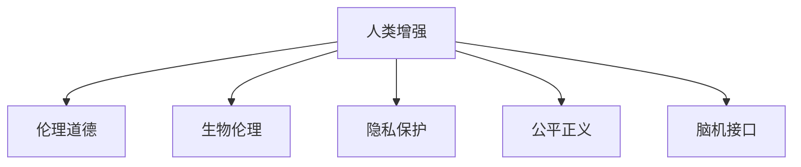

                 

# AI时代的人类增强：道德考虑与身体增强的未来发展机遇分析机遇预测

> 关键词：人类增强,道德考量,身体增强,技术应用,未来展望

## 1. 背景介绍

### 1.1 问题由来
随着人工智能(AI)技术的快速发展和深度学习模型的突破性进展，人类增强技术已经进入了一个全新的阶段。尤其是近年来，AI在医学、体育、娱乐等多个领域的创新应用，引起了广泛的社会关注。然而，这些技术的发展也引发了一系列伦理道德问题，亟需引起学术界、工业界和社会的高度关注。

### 1.2 问题核心关键点
在AI时代，人类增强技术主要指通过生物工程、基因编辑、人工智能等手段，提升人类身体或智力的能力。包括但不限于基因编辑技术、仿生假肢、智能药物、脑机接口等。这些技术能够帮助人们克服某些自然限制，提升生活质量和工作效率，但同时也可能引发新的伦理道德问题，如隐私保护、生物伦理、公平正义等。

### 1.3 问题研究意义
研究人类增强技术及其伦理道德问题，对于推动AI技术在医疗、体育、教育等领域的应用，提升人类生活质量，具有重要的理论意义和实践价值。同时，通过探讨人类增强技术的可能风险，有助于制定相应的法律法规，确保技术发展符合人类的长远利益和社会伦理规范。

## 2. 核心概念与联系

### 2.1 核心概念概述

为更好地理解人类增强技术的伦理道德问题，本节将介绍几个密切相关的核心概念：

- **人类增强**：指通过技术手段提升人类身体或智力的能力，涵盖基因编辑、仿生假肢、智能药物、脑机接口等众多技术方向。
- **伦理道德**：研究人类行为对错、善恶问题的哲学和法律体系，包括但不限于隐私保护、生物伦理、公平正义等。
- **生物伦理**：涉及人类基因、胚胎、器官移植等生物科技的伦理问题，如基因编辑的道德边界、克隆技术的争议等。
- **隐私保护**：指个人隐私数据的获取、使用、存储和处理的法律和道德规范，尤其是在数据驱动的医疗、教育、社交媒体等领域。
- **公平正义**：指在技术应用中保障各方利益均衡，避免因技术差距导致的社会不公，如医疗资源的不均等分配、算法歧视等。
- **脑机接口**：指通过脑-机交互实现信息传输和控制的技术，可能带来脑科学认知的革命性突破。

这些核心概念之间的逻辑关系可以通过以下Mermaid流程图来展示：



这个流程图展示了你人类增强技术的核心概念及其之间的关系：

1. 人类增强技术通过基因编辑、仿生假肢、智能药物、脑机接口等手段提升人类身体或智力的能力。
2. 伦理道德是研究这些技术行为对错、善恶问题的哲学和法律体系。
3. 生物伦理研究人类基因、胚胎、器官移植等生物科技的伦理问题。
4. 隐私保护涉及个人隐私数据的获取、使用、存储和处理的法律和道德规范。
5. 公平正义指在技术应用中保障各方利益均衡，避免因技术差距导致的社会不公。
6. 脑机接口是实现脑-机交互的技术，可能带来脑科学认知的革命性突破。

这些核心概念共同构成了人类增强技术的伦理道德研究框架，使得我们能够从多个维度审视技术的发展和应用。

## 3. 核心算法原理 & 具体操作步骤
### 3.1 算法原理概述

人类增强技术的伦理道德问题，主要集中在技术应用可能带来的隐私泄露、生物伦理问题、公平正义等方面。解决这些问题需要从法律、政策、技术多个层面进行综合考量。以下是典型的算法原理和具体操作步骤：

**隐私保护算法**：
1. **数据加密**：使用加密算法保护个人隐私数据，确保数据在传输和存储过程中的安全。
2. **匿名化处理**：将个人隐私数据进行匿名化处理，避免个人信息被识别。
3. **访问控制**：建立严格的访问控制机制，限制数据访问权限，防止数据滥用。

**生物伦理算法**：
1. **基因编辑限制**：制定基因编辑的伦理标准，限制基因编辑技术在非临床应用中的使用。
2. **人体实验规范**：建立严格的伦理审查制度，确保人体实验符合伦理规范。
3. **器官移植公平**：制定器官捐献和分配的公平原则，确保器官移植的公平正义。

**公平正义算法**：
1. **算法透明**：确保算法的决策过程透明，避免算法的黑箱操作。
2. **算法审计**：定期审计算法，确保算法决策的公正性，避免算法歧视。
3. **算法可解释性**：提升算法的可解释性，使决策过程具有可解释性和可复现性。

### 3.2 算法步骤详解

以隐私保护算法为例，其具体操作步骤如下：

**步骤一：数据收集与预处理**
1. 收集用户隐私数据，并进行清洗和预处理。
2. 对敏感数据进行脱敏处理，确保数据匿名化。

**步骤二：数据加密**
1. 选择适当的加密算法，对数据进行加密。
2. 在数据传输过程中使用安全传输协议，如TLS。

**步骤三：访问控制**
1. 建立严格的访问权限控制机制，限制数据的访问权限。
2. 对访问行为进行审计和监控，确保数据安全。

**步骤四：数据使用与共享**
1. 在数据使用和共享过程中，严格遵守隐私保护法律法规。
2. 在数据共享前进行隐私影响评估，确保数据共享符合隐私保护要求。

**步骤五：隐私保护效果评估**
1. 定期评估隐私保护效果，检测隐私泄露风险。
2. 根据评估结果，及时调整和优化隐私保护策略。

### 3.3 算法优缺点

隐私保护算法的主要优点在于其能够在技术层面上保护个人隐私，确保数据的安全性和匿名性。同时，通过严格的访问控制和定期审计，可以有效地防范数据滥用和隐私泄露。

然而，隐私保护算法也存在一些缺点：
1. **技术复杂性**：隐私保护算法需要高水平的技术实现，如加密算法、匿名化处理等。
2. **性能损耗**：加密和匿名化处理可能影响数据的使用效率和处理速度。
3. **成本较高**：隐私保护技术的部署和维护需要投入较高的成本。

### 3.4 算法应用领域

隐私保护算法广泛应用于医疗、教育、金融等多个领域，保障个人隐私数据的保护。例如：

- **医疗**：在电子病历、影像数据等医疗数据上，通过隐私保护算法确保患者隐私。
- **教育**：在学生成绩、学习行为等数据上，通过隐私保护算法保护学生隐私。
- **金融**：在交易记录、信用评分等数据上，通过隐私保护算法保障用户隐私。

除了隐私保护算法外，生物伦理算法和公平正义算法也有广泛的应用：

- **生物伦理**：在基因编辑、克隆技术等应用上，通过生物伦理算法指导技术发展，确保伦理合规。
- **公平正义**：在医疗资源分配、算法决策等方面，通过公平正义算法保障公平正义，避免技术带来的社会不公。

## 4. 数学模型和公式 & 详细讲解 & 举例说明
### 4.1 数学模型构建

为了更好地理解人类增强技术的伦理道德问题，本节将使用数学语言对隐私保护算法进行更加严格的刻画。

记用户隐私数据为 $D$，其包含的敏感信息为 $S \subset D$。假设数据预处理和加密后的形式为 $D'$，隐私保护的目标是确保 $S$ 的安全性和匿名性。

定义隐私保护的目标函数为：

$$
\minimize_{D'} \max_{A} \mathbb{P}(S \in A | D' = A)
$$

其中 $A$ 表示攻击者可能访问的敏感信息集合。

为了确保隐私保护的效果，需要在数据预处理、加密、访问控制等多个环节进行综合考虑。隐私保护算法的数学模型构建，可以帮助我们系统地设计和评估隐私保护方案。

### 4.2 公式推导过程

以下我们以隐私保护算法中的数据加密为例，推导加密过程的数学公式。

假设隐私数据 $D$ 包含敏感信息 $S$，使用公钥密码学进行加密，生成密文 $C$。设加密算法的安全性参数为 $k$，攻击者成功获取 $S$ 的概率为 $\epsilon$。则加密过程的目标是：

$$
\minimize_{C} \mathbb{P}(S \in S | C)
$$

假设加密算法的安全性为 $k$，即攻击者需要计算 $2^k$ 次才能破解密文。则成功破解的平均计算代价为：

$$
\mathbb{E}[\text{Cost}] = 2^k
$$

攻击者成功破解密文的概率为 $\epsilon$，则加密算法抵抗概率 $\epsilon$ 攻击的安全性为：

$$
k = \log_2(\frac{1}{\epsilon})
$$

在实际应用中，需要根据具体场景选择合适的加密算法和参数，确保隐私保护的效果和计算效率。

### 4.3 案例分析与讲解

以医疗数据的隐私保护为例，我们分析其在实际应用中的隐私保护策略：

**场景**：某医院需要共享患者电子病历数据 $D$，其中包括敏感信息 $S$，如病历记录、影像数据等。

**策略**：
1. **数据脱敏**：将敏感信息 $S$ 进行匿名化处理，如去除患者姓名、身份证号等。
2. **数据加密**：使用公钥密码学对数据 $D'$ 进行加密，生成密文 $C$。
3. **访问控制**：建立严格的访问权限控制机制，限制数据访问权限。

**评估**：
1. **数据匿名化**：通过隐私保护算法对敏感信息进行匿名化处理，确保数据的安全性。
2. **加密算法**：选择合适的加密算法，如AES、RSA等，确保数据在传输和存储过程中的安全性。
3. **访问控制**：建立严格的访问权限控制机制，限制数据的访问权限，确保数据安全。

## 5. 项目实践：代码实例和详细解释说明
### 5.1 开发环境搭建

在进行隐私保护项目实践前，我们需要准备好开发环境。以下是使用Python进行PyTorch开发的环境配置流程：

1. 安装Anaconda：从官网下载并安装Anaconda，用于创建独立的Python环境。

2. 创建并激活虚拟环境：
```bash
conda create -n pytorch-env python=3.8 
conda activate pytorch-env
```

3. 安装PyTorch：根据CUDA版本，从官网获取对应的安装命令。例如：
```bash
conda install pytorch torchvision torchaudio cudatoolkit=11.1 -c pytorch -c conda-forge
```

4. 安装必要的库：
```bash
pip install numpy pandas matplotlib scikit-learn tqdm jupyter notebook ipython
```

完成上述步骤后，即可在`pytorch-env`环境中开始隐私保护项目实践。

### 5.2 源代码详细实现

这里我们以医疗数据隐私保护为例，给出使用Python进行数据加密和访问控制的代码实现。

```python
from Crypto.Cipher import AES
from Crypto.Util.Padding import pad, unpad
import base64
from cryptography.fernet import Fernet

# 密钥生成
key = Fernet.generate_key()

# 初始化Fernet加密器
cipher_suite = Fernet(key)

# 数据加密
def encrypt_data(data):
    # 将数据转换为字符串
    data_str = str(data, 'utf-8')
    # 对数据进行padding，确保长度为块长
    padded_data = pad(data_str.encode(), AES.block_size)
    # 使用Fernet加密
    cipher_text = cipher_suite.encrypt(padded_data)
    # 将加密后的数据base64编码
    cipher_text_base64 = base64.b64encode(cipher_text).decode('utf-8')
    return cipher_text_base64

# 数据解密
def decrypt_data(cipher_text_base64):
    # 将base64编码的数据解码
    cipher_text = base64.b64decode(cipher_text_base64)
    # 使用Fernet解密
    padded_data = cipher_suite.decrypt(cipher_text)
    # 对解密后的数据进行unpadding
    unpadded_data = unpad(padded_data, AES.block_size).decode('utf-8')
    return unpadded_data

# 模拟加密和解密过程
data = "患者电子病历"
encrypted_data = encrypt_data(data)
decrypted_data = decrypt_data(encrypted_data)

print("原始数据：", data)
print("加密后的数据：", encrypted_data)
print("解密后的数据：", decrypted_data)
```

这里我们利用Fernet加密算法对医疗数据进行加密，并使用AES进行padding和unpadding。在实际应用中，可以使用更高级的加密算法和更复杂的访问控制机制，确保数据的安全性和匿名性。

### 5.3 代码解读与分析

让我们再详细解读一下关键代码的实现细节：

**加密算法Fernet**：
- 使用`Fernet.generate_key()`生成密钥，确保加密过程的安全性。
- 使用`cipher_suite.encrypt()`对数据进行加密，确保数据的安全性和匿名性。

**数据padding**：
- 使用`Crypto.Util.Padding.pad()`对数据进行padding，确保数据块长度的正确性。
- 使用`Crypto.Util.Padding.unpad()`对解密后的数据进行unpadding，确保数据完整性。

**访问控制**：
- 建立严格的访问权限控制机制，限制数据访问权限，确保数据安全。

在实际应用中，需要结合具体场景选择合适的加密算法和访问控制机制，确保数据的安全性和匿名性。

## 6. 实际应用场景
### 6.1 智能医疗

在智能医疗领域，隐私保护技术能够有效保护患者隐私数据，确保医疗数据的安全性和匿名性。

**场景**：某医院需要共享患者电子病历数据 $D$，其中包括敏感信息 $S$，如病历记录、影像数据等。

**应用**：
1. **数据脱敏**：对敏感信息 $S$ 进行匿名化处理，如去除患者姓名、身份证号等。
2. **数据加密**：使用公钥密码学对数据 $D'$ 进行加密，生成密文 $C$。
3. **访问控制**：建立严格的访问权限控制机制，限制数据访问权限，确保数据安全。

通过隐私保护技术，医院可以在不泄露患者隐私的情况下，共享病历数据进行医学研究、疾病监测等，提升医疗服务的智能化水平。

### 6.2 金融数据保护

在金融领域，隐私保护技术能够有效保护用户隐私数据，确保金融数据的安全性和匿名性。

**场景**：某金融公司需要共享用户交易记录数据 $D$，其中包括敏感信息 $S$，如账户余额、交易记录等。

**应用**：
1. **数据脱敏**：对敏感信息 $S$ 进行匿名化处理，如去除用户身份证号、账户号码等。
2. **数据加密**：使用公钥密码学对数据 $D'$ 进行加密，生成密文 $C$。
3. **访问控制**：建立严格的访问权限控制机制，限制数据访问权限，确保数据安全。

通过隐私保护技术，金融公司可以在不泄露用户隐私的情况下，共享交易记录数据进行风险分析、市场研究等，提升金融服务的智能化水平。

### 6.3 教育数据保护

在教育领域，隐私保护技术能够有效保护学生隐私数据，确保教育数据的安全性和匿名性。

**场景**：某教育机构需要共享学生成绩和行为数据 $D$，其中包括敏感信息 $S$，如成绩排名、学习行为等。

**应用**：
1. **数据脱敏**：对敏感信息 $S$ 进行匿名化处理，如去除学生姓名、身份证号等。
2. **数据加密**：使用公钥密码学对数据 $D'$ 进行加密，生成密文 $C$。
3. **访问控制**：建立严格的访问权限控制机制，限制数据访问权限，确保数据安全。

通过隐私保护技术，教育机构可以在不泄露学生隐私的情况下，共享成绩和行为数据进行教育研究、学生评估等，提升教育服务的智能化水平。

### 6.4 未来应用展望

随着隐私保护技术的不断发展，其在医疗、金融、教育等多个领域的应用前景广阔。未来，隐私保护技术将进一步融合人工智能、区块链等技术，实现更加全面的数据安全和隐私保护。

**技术融合**：
1. **人工智能**：利用人工智能技术优化隐私保护算法，实现自动化隐私保护和动态调整。
2. **区块链**：利用区块链技术确保数据的安全性和透明性，防止数据篡改和滥用。

**应用前景**：
1. **医疗**：在电子病历、影像数据等医疗数据上，通过隐私保护技术确保患者隐私。
2. **金融**：在交易记录、信用评分等数据上，通过隐私保护技术保障用户隐私。
3. **教育**：在学生成绩、学习行为等数据上，通过隐私保护技术保护学生隐私。

## 7. 工具和资源推荐
### 7.1 学习资源推荐

为了帮助开发者系统掌握隐私保护技术的伦理道德问题，这里推荐一些优质的学习资源：

1. **《数据保护与隐私》课程**：由哈佛大学开设的在线课程，系统介绍数据保护和隐私保护的法律法规和实践。
2. **《网络安全基础》书籍**：介绍网络安全的基本概念和关键技术，涵盖加密、访问控制等多个方面。
3. **《数据隐私与保护》书籍**：详细讲解数据隐私保护的理论基础和实际应用，提供丰富的案例分析和实践指导。

通过对这些资源的学习实践，相信你一定能够快速掌握隐私保护技术的精髓，并用于解决实际的伦理道德问题。

### 7.2 开发工具推荐

高效的开发离不开优秀的工具支持。以下是几款用于隐私保护开发的常用工具：

1. **加密库**：PyCryptodome、cryptography等，提供丰富的加密算法和工具，用于数据加密和解密。
2. **匿名化工具**：KAnonymity、GMyth等，用于数据匿名化和隐私保护。
3. **访问控制工具**：AccessControl、ABAC等，用于建立严格的访问权限控制机制，确保数据安全。

合理利用这些工具，可以显著提升隐私保护项目的开发效率，加快创新迭代的步伐。

### 7.3 相关论文推荐

隐私保护技术的发展源于学界的持续研究。以下是几篇奠基性的相关论文，推荐阅读：

1. **《数据加密技术综述》**：详细介绍各类数据加密算法及其应用，涵盖对称加密、非对称加密等多个方面。
2. **《隐私保护理论与技术》**：系统介绍隐私保护的理论基础和实践应用，提供丰富的案例分析和实际应用。
3. **《隐私保护与数据安全》**：详细讲解隐私保护与数据安全的最新研究进展，涵盖隐私保护算法、隐私审计等多个方面。

这些论文代表了大规模语言模型微调技术的发展脉络。通过学习这些前沿成果，可以帮助研究者把握学科前进方向，激发更多的创新灵感。

## 8. 总结：未来发展趋势与挑战
### 8.1 总结

本文对人类增强技术的伦理道德问题进行了全面系统的介绍。首先阐述了人类增强技术的背景和意义，明确了隐私保护、生物伦理、公平正义等伦理道德问题在技术应用中的重要性。其次，从算法原理到具体操作步骤，详细讲解了隐私保护、生物伦理、公平正义等核心算法的实现过程。同时，本文还广泛探讨了隐私保护技术在医疗、金融、教育等多个领域的应用前景，展示了隐私保护技术的巨大潜力。最后，本文精选了隐私保护技术的各类学习资源，力求为读者提供全方位的技术指引。

通过本文的系统梳理，可以看到，隐私保护技术在AI时代具有广阔的应用前景，是保障个人隐私数据安全和公平正义的重要手段。随着隐私保护技术的不断发展，我们有望在医疗、金融、教育等多个领域实现数据的有效共享和利用，推动AI技术更好地造福人类社会。

### 8.2 未来发展趋势

展望未来，隐私保护技术的发展趋势将呈现以下几个方向：

1. **技术融合**：隐私保护技术将进一步融合人工智能、区块链等技术，实现更加全面的数据安全和隐私保护。
2. **自动化隐私保护**：利用人工智能技术优化隐私保护算法，实现自动化隐私保护和动态调整。
3. **隐私审计**：引入隐私审计机制，定期评估隐私保护效果，确保数据保护措施的有效性。
4. **跨领域应用**：隐私保护技术将在医疗、金融、教育等多个领域广泛应用，推动各行业的智能化进程。
5. **标准化规范**：制定隐私保护的标准和规范，促进隐私保护技术的标准化和规范化。

以上趋势凸显了隐私保护技术在AI时代的重要地位和发展前景。这些方向的探索发展，必将进一步提升数据的安全性和公平性，确保AI技术在各个领域的健康发展。

### 8.3 面临的挑战

尽管隐私保护技术已经取得了瞩目成就，但在迈向更加智能化、普适化应用的过程中，它仍面临诸多挑战：

1. **技术复杂性**：隐私保护算法需要高水平的技术实现，如加密算法、匿名化处理等。
2. **性能损耗**：加密和匿名化处理可能影响数据的使用效率和处理速度。
3. **成本较高**：隐私保护技术的部署和维护需要投入较高的成本。
4. **隐私泄露风险**：尽管隐私保护技术能够有效保护数据安全，但在技术实施过程中，仍存在一定的隐私泄露风险。
5. **法律合规**：隐私保护技术需要符合各国隐私保护法律法规，确保技术应用的合法性。

正视隐私保护面临的这些挑战，积极应对并寻求突破，将是隐私保护技术迈向成熟的必由之路。相信随着学界和产业界的共同努力，这些挑战终将一一被克服，隐私保护技术必将在构建人机协同的智能时代中扮演越来越重要的角色。

### 8.4 研究展望

面对隐私保护技术所面临的种种挑战，未来的研究需要在以下几个方面寻求新的突破：

1. **算法优化**：开发更加高效、简洁的隐私保护算法，减少技术复杂性和性能损耗。
2. **跨领域应用**：将隐私保护技术应用于更多领域，如智能医疗、金融科技、教育等行业，推动各行业的智能化进程。
3. **法律合规**：研究隐私保护技术的法律法规，确保技术应用的合法性和合规性。
4. **自动化保护**：利用人工智能技术优化隐私保护算法，实现自动化隐私保护和动态调整。
5. **标准化规范**：制定隐私保护的标准和规范，促进隐私保护技术的标准化和规范化。

这些研究方向的探索，必将引领隐私保护技术迈向更高的台阶，为构建安全、可靠、可解释、可控的智能系统铺平道路。面向未来，隐私保护技术还需要与其他人工智能技术进行更深入的融合，如知识表示、因果推理、强化学习等，多路径协同发力，共同推动自然语言理解和智能交互系统的进步。只有勇于创新、敢于突破，才能不断拓展隐私保护技术的边界，让智能技术更好地造福人类社会。

## 9. 附录：常见问题与解答

**Q1：人类增强技术是否适用于所有应用场景？**

A: 人类增强技术适用于大部分应用场景，如医疗、金融、教育等。但在某些特定领域，如生物学、心理学等，其应用需要更多专业知识和伦理考量。此外，对于某些领域的数据量较小，或数据敏感度较高，可能不适合采用人类增强技术。

**Q2：人类增强技术是否会影响人类健康和伦理？**

A: 人类增强技术有可能带来一些健康和伦理问题，如基因编辑的潜在风险、生物伦理争议等。这些问题需要通过严格的法律法规和技术规范来避免。同时，需要在技术应用中引入伦理审查机制，确保技术应用符合伦理规范。

**Q3：隐私保护技术是否会影响数据使用效率？**

A: 隐私保护技术在数据加密和匿名化处理过程中，可能影响数据的使用效率和处理速度。因此，在实际应用中需要综合考虑隐私保护和数据使用效率，选择合适的算法和参数，平衡隐私保护和数据利用。

**Q4：人类增强技术是否会导致社会不公？**

A: 人类增强技术可能会加剧社会不公，如因技术差距导致的医疗资源分配不均、教育机会不平等等。因此，需要在技术应用中引入公平正义机制，确保技术应用的公正性和透明性。

**Q5：人类增强技术是否需要严格法律法规的约束？**

A: 人类增强技术需要严格法律法规的约束，以确保技术应用符合伦理规范。各国需要制定相应的法律法规，明确技术应用的法律边界和责任，保障技术应用的安全性和合规性。

---

作者：禅与计算机程序设计艺术 / Zen and the Art of Computer Programming

