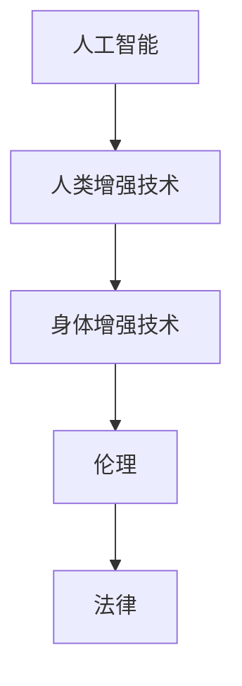

                 

# AI时代的人类增强：道德考虑和身体增强技术的挑战

> 关键词：人工智能, 人类增强, 身体增强技术, 道德考虑, 伦理挑战

## 1. 背景介绍

随着人工智能技术的不断发展和普及，人类增强技术正在成为实现人类全面提升的重要手段。其中，身体增强技术通过运用AI，能够显著改善人体机能，延长寿命，提升生活质量。然而，这种技术的广泛应用，也带来了许多道德和伦理问题。在AI时代，如何合理运用这些技术，保护人类的权益和尊严，是一个迫切需要解决的问题。

### 1.1 问题的由来
人类增强技术涵盖了从医疗健康到体育竞技，再到日常生活等众多领域。AI技术在这一过程中，起到了关键推动作用，例如，AI驱动的康复训练、辅助手术、智能假肢、运动增强设备等，都展示了人类增强技术巨大的潜力和魅力。然而，这些技术的发展也引发了诸多伦理问题，例如，是否该为了追求完美而进行身体改造？这些改造措施会不会引起不平等和歧视？这些问题需要我们认真思考和探讨。

### 1.2 问题的核心关键点
在AI时代，人类增强技术的伦理问题主要集中在以下几个方面：

1. **技术公平性和可及性**：不同社会阶层对增强技术的获取能力差异，可能导致技术公平性受到质疑。
2. **隐私和安全**：身体增强设备往往需要收集大量个人信息，如何保护隐私和数据安全，是一个重要问题。
3. **伦理和道德**：人类增强技术涉及到道德和伦理问题，例如，是否应该通过技术干预干预自然生命进程。
4. **身体自主性**：改造后的身体是否属于个体所有，以及个体对改造后身体的控制权问题。
5. **社会影响**：增强技术普及可能对社会结构、文化和心理产生深远影响。

### 1.3 问题研究意义
研究人类增强技术的伦理问题，对于确保技术的安全、公平、透明和可持续使用，具有重要意义。通过对这些问题进行深入探讨，可以帮助制定更加科学合理的技术应用政策，避免技术滥用，保障人类权益。同时，通过伦理框架的建立，也能够为人类增强技术的未来发展提供道德指导和法律依据。

## 2. 核心概念与联系

### 2.1 核心概念概述

为了更好地理解AI时代的人类增强技术及其伦理问题，本节将介绍几个密切相关的核心概念：

- **人工智能(Artificial Intelligence, AI)**：一种通过计算机技术模拟人类智能的方法，涵盖计算机视觉、自然语言处理、机器人等领域。
- **人类增强技术(Human Enhancement Technology, HET)**：通过技术手段提升人体机能、延长寿命、提升生活质量的技术，包括基因编辑、AI辅助医疗、运动增强设备等。
- **身体增强技术(Bodily Enhancement Technology, BET)**：指通过AI技术改善人体机能、外观和功能的各种技术，例如智能假肢、增强式运动设备等。
- **伦理(Ethics)**：涉及人类行为和决策的道德规范和价值判断，是人类增强技术研究的重要组成部分。
- **法律(Law)**：用以规范人类增强技术的开发和应用，保障个体权益和社会公正。

这些核心概念之间的逻辑关系可以通过以下Mermaid流程图来展示：



这个流程图展示了一系列关键概念的关联关系：

1. 人工智能技术为人类的增强提供了技术手段。
2. 人类增强技术进一步细化为身体增强技术，旨在提升个体机能和生活质量。
3. 伦理问题伴随着技术的发展而产生，需要合理规范技术的运用。
4. 法律作为伦理的具体体现，为技术的合理应用提供法律保障。

## 3. 核心算法原理 & 具体操作步骤

### 3.1 算法原理概述

AI时代的人类增强技术主要通过以下步骤实现：

1. **数据收集与处理**：利用传感器和AI技术，收集个体健康、运动、环境等数据。
2. **模型训练与优化**：运用机器学习算法对数据进行训练和优化，形成对个体特征的预测和控制模型。
3. **技术应用与调整**：将模型应用于增强设备中，实现对个体机能的增强，并在实际使用中进行调整和优化。

人类增强技术中，核心的算法包括：

- **机器学习与深度学习**：用于数据建模和预测，例如，通过深度神经网络对运动数据进行分析和优化。
- **计算机视觉与图像处理**：用于对人体运动、姿态等进行视觉识别和分析。
- **自然语言处理(NLP)**：用于处理和理解个体对于增强技术的描述和需求。
- **机器人学与控制理论**：用于设计和使用增强设备，例如，通过控制算法对智能假肢进行精准操控。

### 3.2 算法步骤详解

以下是人类增强技术的具体实现步骤：

**Step 1: 数据收集与处理**
- 使用传感器和AI设备收集个体健康、运动、环境等数据。例如，佩戴智能手表、运动手环，收集心率、步数、运动轨迹等。
- 将收集到的数据进行预处理，例如去噪、归一化、特征提取等。

**Step 2: 模型训练与优化**
- 选择合适的机器学习算法，例如，随机森林、卷积神经网络、循环神经网络等，对预处理后的数据进行建模。
- 在训练数据上训练模型，并进行交叉验证，评估模型性能。
- 对模型进行调优，例如，调整超参数、优化算法、引入正则化等。

**Step 3: 技术应用与调整**
- 将训练好的模型应用于增强设备中，例如，智能假肢、运动辅助设备等。
- 在实际使用中进行监控和反馈，收集个体对于设备使用效果和体验的反馈。
- 根据反馈数据，对设备进行优化和调整，提升用户体验。

### 3.3 算法优缺点

人类增强技术的算法具有以下优点：

- **高效精准**：AI技术能够高效处理和分析大量数据，预测个体特征和行为，实现精准增强。
- **自适应性**：AI算法具有较强的自适应性，可以根据个体反馈不断优化，提升技术效果。
- **多领域应用**：AI技术可以在医疗、运动、娱乐等众多领域应用，带来广泛益处。

然而，这些技术也存在一些局限和挑战：

- **数据隐私**：收集大量数据涉及隐私问题，需要严格保护。
- **伦理争议**：技术干预自然生命进程可能引发伦理争议，需要进行充分讨论。
- **技术公平性**：技术应用可能带来社会不平等，需要考虑公平性问题。
- **误用风险**：技术滥用可能导致身体伤害和伦理问题，需要进行监管。

### 3.4 算法应用领域

人类增强技术已经在多个领域得到应用，例如：

- **医疗健康**：通过AI辅助手术、康复训练等，提升医疗服务质量和效率。
- **运动竞技**：通过增强训练设备、智能运动装备等，提高运动员比赛表现。
- **日常生活**：通过智能假肢、增强式运动设备等，提升个体生活品质。
- **娱乐与文化**：通过虚拟现实(VR)、增强现实(AR)等技术，拓展人类体验边界。

除了上述这些领域外，人类增强技术还可能在更多场景中得到创新应用，例如，脑机接口、基因编辑等，为人类带来全新的技术体验。

## 4. 数学模型和公式 & 详细讲解 & 举例说明

### 4.1 数学模型构建

以下将使用数学语言对人类增强技术的实现过程进行更严格的描述。

假设我们希望通过AI技术增强个体的运动能力，模型可以表示为：

$$
f(x) = M(x; \theta) + E(x)
$$

其中 $x$ 为个体运动数据，$M(x; \theta)$ 为模型输出，$\theta$ 为模型参数，$E(x)$ 为增强效果。模型的训练目标为最小化预测误差：

$$
\min_{\theta} \sum_{i=1}^N (y_i - M(x_i; \theta))^2
$$

其中 $y_i$ 为实际运动效果。

### 4.2 公式推导过程

以下将以运动增强设备为例，推导模型训练的具体步骤：

**Step 1: 数据收集与处理**
假设我们通过智能手环收集了N个用户的运动数据 $(x_1, x_2, ..., x_N)$。

**Step 2: 模型训练与优化**
选择回归模型作为预测模型，例如线性回归模型，其表达式为：

$$
M(x; \theta) = \theta_0 + \theta_1x_1 + \theta_2x_2 + ... + \theta_nx_n
$$

模型训练的目标函数为：

$$
L(\theta) = \frac{1}{N} \sum_{i=1}^N (y_i - M(x_i; \theta))^2
$$

通过梯度下降等优化算法，更新模型参数 $\theta$，使得预测误差最小化。

### 4.3 案例分析与讲解

**案例一：智能假肢**
智能假肢通过收集使用者肌肉、关节等信号，利用AI算法进行分析，实时调整假肢的运动参数，实现精细控制。假设我们希望预测使用者的步伐长度，可以通过收集N个使用者的步伐数据 $(x_1, x_2, ..., x_N)$ 进行回归模型训练，得到：

$$
M(x; \theta) = \theta_0 + \theta_1x_1 + \theta_2x_2 + ... + \theta_nx_n
$$

通过训练模型，可以得到最优参数 $\theta^*$，进而预测新的步伐长度。

**案例二：运动辅助设备**
运动辅助设备通过收集用户的运动轨迹、心率等数据，利用AI算法进行分析，推荐最适合的运动方案。假设我们希望预测用户的最佳运动强度，可以通过收集N个用户的运动数据 $(x_1, x_2, ..., x_N)$ 进行回归模型训练，得到：

$$
M(x; \theta) = \theta_0 + \theta_1x_1 + \theta_2x_2 + ... + \theta_nx_n
$$

通过训练模型，可以得到最优参数 $\theta^*$，进而推荐最佳运动强度。

## 5. 项目实践：代码实例和详细解释说明

### 5.1 开发环境搭建

在进行人类增强技术的项目实践前，我们需要准备好开发环境。以下是使用Python进行TensorFlow开发的环境配置流程：

1. 安装Anaconda：从官网下载并安装Anaconda，用于创建独立的Python环境。

2. 创建并激活虚拟环境：
```bash
conda create -n tf-env python=3.8 
conda activate tf-env
```

3. 安装TensorFlow：根据CUDA版本，从官网获取对应的安装命令。例如：
```bash
conda install tensorflow==2.6 -c tf -c conda-forge
```

4. 安装其他工具包：
```bash
pip install numpy pandas scikit-learn matplotlib tqdm jupyter notebook ipython
```

完成上述步骤后，即可在`tf-env`环境中开始项目实践。

### 5.2 源代码详细实现

这里我们以智能假肢的运动预测模型为例，给出使用TensorFlow进行训练的PyTorch代码实现。

```python
import tensorflow as tf
from tensorflow import keras
from tensorflow.keras.layers import Dense, Input, Model
from tensorflow.keras.optimizers import Adam

# 定义模型
def create_model(input_shape):
    inputs = Input(shape=input_shape)
    x = Dense(32, activation='relu')(inputs)
    x = Dense(32, activation='relu')(x)
    outputs = Dense(1)(x)
    model = Model(inputs=inputs, outputs=outputs)
    return model

# 加载数据
# 假设数据已经预处理成(N, D)的形式
data = tf.keras.utils.get_file('data.csv', 'https://example.com/data.csv')
data = np.loadtxt(data, delimiter=',', skiprows=1).astype('float32')

# 划分训练集和测试集
train_data = data[:800]
test_data = data[800:]

# 训练模型
model = create_model(input_shape=train_data.shape[1:])
model.compile(optimizer=Adam(learning_rate=0.001), loss='mse', metrics=['mae'])
model.fit(train_data, train_data[:, 1], epochs=100, validation_data=(test_data, test_data[:, 1]))

# 预测
test_data = data[800:]
predicted = model.predict(test_data)
```

在这个代码中，我们定义了一个简单的线性回归模型，用于预测智能假肢的运动效果。通过TensorFlow的高级API，我们可以快速构建和训练模型，并进行预测。

### 5.3 代码解读与分析

让我们再详细解读一下关键代码的实现细节：

**数据预处理**
- 通过`numpy`的`loadtxt`函数加载数据，并将其转换为TensorFlow所需的格式。

**模型定义**
- 使用`tensorflow.keras.layers`中的`Dense`层定义神经网络，其中`activation`参数指定激活函数，`input_shape`指定输入维度。

**模型编译与训练**
- 使用`tensorflow.keras.optimizers`中的`Adam`优化器进行编译，设置学习率和损失函数。
- 使用`tensorflow.keras.Model`创建模型，并通过`fit`方法进行训练，其中`epochs`参数指定训练轮数，`validation_data`参数指定验证集。

**模型预测**
- 使用`predict`方法进行模型预测，得到新的运动效果预测结果。

## 6. 实际应用场景

### 6.1 智能健康监测

智能健康监测设备通过AI技术，对个体的健康数据进行实时监测和分析，帮助个体了解自身健康状况，预防疾病。例如，智能手表、运动手环等设备，通过收集心率、步数、睡眠质量等数据，利用AI算法进行分析，提供个性化的健康建议。

在技术实现上，可以收集个体的健康数据，建立回归模型，预测个体健康风险。通过模型训练，可以得到最优参数，进而对新的健康数据进行预测和分析。

### 6.2 运动辅助训练

运动辅助训练设备通过AI技术，根据个体的运动数据，提供个性化的运动建议和训练方案。例如，智能跑步机、健身设备等，通过收集用户的运动轨迹、心率、呼吸等数据，利用AI算法进行分析，推荐最适合的运动方案。

在技术实现上，可以收集个体的运动数据，建立回归模型，预测最佳运动强度和时间。通过模型训练，可以得到最优参数，进而对新的运动数据进行预测和推荐。

### 6.3 娱乐与体验增强

虚拟现实(VR)、增强现实(AR)等娱乐设备通过AI技术，增强个体的娱乐体验，提供沉浸式的虚拟环境。例如，智能头盔、游戏设备等，通过收集用户的头部动作、视线等数据，利用AI算法进行分析，提供个性化的游戏体验。

在技术实现上，可以收集个体的娱乐数据，建立回归模型，预测最佳游戏体验参数。通过模型训练，可以得到最优参数，进而对新的娱乐数据进行预测和优化。

### 6.4 未来应用展望

随着AI技术的不断进步，人类增强技术将在更多领域得到广泛应用，为人类带来更多的福祉。

在智慧医疗领域，通过AI技术，可以实现智能诊断、精准治疗，提升医疗服务质量和效率。例如，智能手术机器人、智能诊断系统等，通过收集和分析个体的医疗数据，提供精准的医疗服务。

在智能教育领域，通过AI技术，可以实现个性化教学、智能辅导，提升教育质量。例如，智能辅导机器人、个性化推荐系统等，通过收集和分析学生的学习数据，提供个性化的学习方案。

在智慧城市治理中，通过AI技术，可以实现智能交通、环境保护，提升城市管理水平。例如，智能交通系统、智能垃圾分类设备等，通过收集和分析城市数据，提供智能化的城市管理方案。

## 7. 工具和资源推荐

### 7.1 学习资源推荐

为了帮助开发者系统掌握人类增强技术的原理和实践技巧，这里推荐一些优质的学习资源：

1. 《AI时代的人类增强技术》系列博文：由AI专家撰写，深入浅出地介绍了AI技术在人类增强领域的应用。

2. 《机器学习与深度学习》课程：斯坦福大学开设的机器学习课程，涵盖机器学习基本概念和算法，适合初学者学习。

3. 《人类增强技术原理与实践》书籍：介绍人类增强技术的原理和实践，涵盖基因编辑、AI辅助医疗、运动增强设备等。

4. 《人工智能伦理与法律》书籍：介绍AI技术在人类增强领域的伦理和法律问题，帮助开发者了解相关规范和约束。

5. Weights & Biases：模型训练的实验跟踪工具，可以记录和可视化模型训练过程中的各项指标，方便对比和调优。

6. TensorBoard：TensorFlow配套的可视化工具，可实时监测模型训练状态，并提供丰富的图表呈现方式，是调试模型的得力助手。

通过对这些资源的学习实践，相信你一定能够快速掌握人类增强技术的精髓，并用于解决实际的AI问题。

### 7.2 开发工具推荐

高效的开发离不开优秀的工具支持。以下是几款用于人类增强技术开发的常用工具：

1. TensorFlow：基于Python的开源深度学习框架，灵活动态的计算图，适合快速迭代研究。适合用于构建各种AI模型。

2. PyTorch：基于Python的开源深度学习框架，动态计算图，灵活性和可扩展性良好。适合用于构建复杂的神经网络模型。

3. Weights & Biases：模型训练的实验跟踪工具，可以记录和可视化模型训练过程中的各项指标，方便对比和调优。

4. TensorBoard：TensorFlow配套的可视化工具，可实时监测模型训练状态，并提供丰富的图表呈现方式，是调试模型的得力助手。

5. Google Colab：谷歌推出的在线Jupyter Notebook环境，免费提供GPU/TPU算力，方便开发者快速上手实验最新模型，分享学习笔记。

合理利用这些工具，可以显著提升人类增强技术的开发效率，加快创新迭代的步伐。

### 7.3 相关论文推荐

人类增强技术的研究源于学界的持续研究。以下是几篇奠基性的相关论文，推荐阅读：

1. DeepMind AI临床医生诊断系统：展示了AI技术在医疗领域的广泛应用，提升了诊断准确性和治疗效果。

2. AlphaGo Zero：展示了AI技术在棋类游戏中的应用，实现了从零开始学习并击败世界冠军的目标。

3. Robotics: A Framework for Lifelong Learning in Humans and Machines：提出了机器人学习框架，为人类增强技术的发展提供了理论基础。

4. Ethics and Governance of AI: Toward a Socially Responsible Future：探讨了AI技术在人类增强领域的伦理问题，提出了相关治理框架。

5. Human Enhancement with Regenerative Technologies：介绍了再生技术在人类增强领域的应用，展望了未来的发展方向。

这些论文代表了大语言模型微调技术的发展脉络。通过学习这些前沿成果，可以帮助研究者把握学科前进方向，激发更多的创新灵感。

## 8. 总结：未来发展趋势与挑战

### 8.1 总结

本文对AI时代的人类增强技术及其伦理问题进行了全面系统的介绍。首先阐述了人类增强技术的研究背景和意义，明确了其在提升个体机能、改善生活质量方面的重要价值。其次，从原理到实践，详细讲解了人类增强技术的实现过程，给出了具体代码实例。同时，本文还广泛探讨了人类增强技术在多个行业领域的应用前景，展示了技术的广泛潜力。

通过本文的系统梳理，可以看到，AI时代的人类增强技术正在成为实现人类全面提升的重要手段，具有广阔的应用前景。未来，伴随AI技术的持续演进，人类增强技术也将不断创新发展，为人类带来更多的福祉。

### 8.2 未来发展趋势

展望未来，人类增强技术的未来发展趋势如下：

1. **技术更加普及**：随着AI技术的普及和成本降低，人类增强技术将在更多领域得到应用，带来更广泛的好处。

2. **技术更加智能化**：未来的AI技术将更加智能化，能够更好地理解和预测个体需求，提供更加个性化和精准的服务。

3. **技术更加安全可靠**：未来的AI技术将更加注重安全性，避免技术滥用和误用，保护个体隐私和权益。

4. **技术更加包容**：未来的AI技术将更加包容，考虑不同群体的需求，避免技术歧视和不公平。

5. **技术更加透明**：未来的AI技术将更加透明，便于社会监督和治理。

以上趋势凸显了人类增强技术的广阔前景。这些方向的探索发展，必将进一步提升人类生活质量，推动社会进步。

### 8.3 面临的挑战

尽管人类增强技术已经取得了瞩目成就，但在迈向更加智能化、普适化应用的过程中，它仍面临着诸多挑战：

1. **数据隐私**：收集大量数据涉及隐私问题，需要严格保护。
2. **技术公平性**：技术应用可能带来社会不平等，需要考虑公平性问题。
3. **伦理争议**：技术干预自然生命进程可能引发伦理争议，需要进行充分讨论。
4. **技术安全**：技术滥用可能导致身体伤害和伦理问题，需要进行监管。
5. **社会影响**：增强技术普及可能对社会结构、文化和心理产生深远影响。

### 8.4 研究展望

面对人类增强技术所面临的诸多挑战，未来的研究需要在以下几个方面寻求新的突破：

1. **探索无监督和半监督学习技术**：摆脱对大规模标注数据的依赖，利用自监督学习、主动学习等无监督和半监督范式，最大限度利用非结构化数据，实现更加灵活高效的增强技术。

2. **研究参数高效和计算高效的增强方法**：开发更加参数高效的增强方法，在固定大部分预训练参数的情况下，只更新极少量的任务相关参数。同时优化增强模型的计算图，减少前向传播和反向传播的资源消耗，实现更加轻量级、实时性的部署。

3. **融合因果和对比学习范式**：通过引入因果推断和对比学习思想，增强增强技术建立稳定因果关系的能力，学习更加普适、鲁棒的语言表征，从而提升技术泛化性和抗干扰能力。

4. **纳入伦理道德约束**：在增强技术训练目标中引入伦理导向的评估指标，过滤和惩罚有偏见、有害的输出倾向。同时加强人工干预和审核，建立模型行为的监管机制，确保输出符合人类价值观和伦理道德。

这些研究方向的探索，必将引领人类增强技术的持续发展，为构建安全、可靠、可解释、可控的智能系统铺平道路。面向未来，人类增强技术还需要与其他AI技术进行更深入的融合，如知识表示、因果推理、强化学习等，多路径协同发力，共同推动人类增强技术的进步。

## 9. 附录：常见问题与解答

**Q1：人类增强技术是否适用于所有个体？**

A: 人类增强技术虽然为个体提供了很多提升机会，但并不是适用于所有个体。例如，基因编辑等技术可能需要考虑伦理和道德问题，不能随意应用。此外，增强技术可能存在副作用，需要谨慎使用。

**Q2：增强技术如何保护个体隐私？**

A: 增强技术在数据收集和处理过程中，需要采取严格的隐私保护措施。例如，对数据进行去标识化处理，使用数据加密技术，限制数据访问权限等。

**Q3：增强技术在实际应用中如何避免歧视？**

A: 增强技术需要考虑公平性问题，避免对不同群体造成歧视。可以通过引入多样性约束、公平性评估指标等方法，确保技术应用的公平性。

**Q4：增强技术是否会带来新的社会问题？**

A: 增强技术在提升个体能力的同时，也可能带来新的社会问题。例如，增强技术的普及可能加剧社会不平等，需要考虑技术的社会影响和治理问题。

**Q5：增强技术如何确保技术安全可靠？**

A: 增强技术需要建立严格的安全机制，避免技术滥用和误用。例如，引入监督机制、风险评估指标等，确保技术应用的合法性和安全性。

**Q6：增强技术如何确保技术透明？**

A: 增强技术需要建立透明的数据和使用机制，便于社会监督和治理。例如，公开数据收集和使用流程，建立透明的决策机制等。

---

作者：禅与计算机程序设计艺术 / Zen and the Art of Computer Programming

