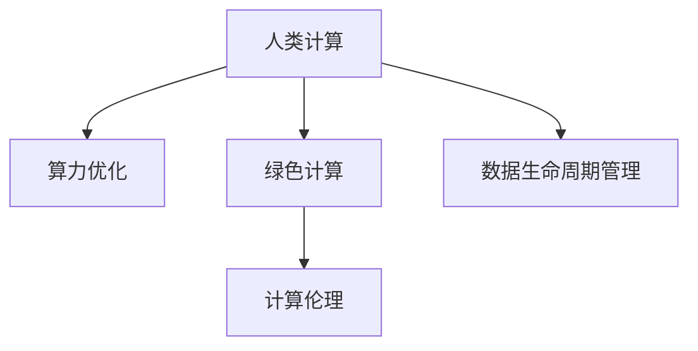

                 

# AI时代的人类计算：打造可持续发展解决方案

> 关键词：人类计算, 可持续发展, 人工智能, 计算伦理, 算力资源, 绿色计算, 绿色算法, 能源效率

## 1. 背景介绍

在人类进入AI时代后，计算成为驱动社会发展的重要引擎。然而，大规模计算背后所需的算力资源，也成为不可忽视的环境负担。如何平衡计算需求与环境保护之间的关系，打造可持续发展的人类计算体系，成为当前全球科技界共同关注的重要课题。

### 1.1 问题由来
现代信息技术的发展，使得海量数据处理和复杂算法计算成为可能。特别是大数据、深度学习等技术的崛起，加速了人工智能（AI）的突破。然而，伴随AI技术的蓬勃发展，其所需的算力资源消耗也呈指数级增长。数据中心的能耗问题，已成为制约AI技术发展的重要因素之一。

根据国际能源署（IEA）的数据，全球数据中心用电量在过去十年内增长了12倍，预计未来几年将继续保持快速增长。如此庞大的能耗，不仅增加了企业的运营成本，还对环境造成了巨大压力。因此，打造可持续的人类计算体系，迫切需要新思路和新方法。

### 1.2 问题核心关键点
构建可持续的人类计算体系，关键在于以下几个方面：

- **算力资源优化**：如何通过算法和架构优化，降低计算资源的消耗，提高算力的使用效率。
- **绿色计算技术**：开发和使用绿色计算技术，减少数据中心的碳排放，降低能耗。
- **计算伦理规范**：制定计算伦理规范，保障计算资源的公平分配，防止计算资源的过度集中。
- **数据生命周期管理**：在数据采集、存储、处理、分析等全生命周期内，贯彻绿色计算的理念。

这些关键点共同构成了可持续计算的核心框架，旨在实现计算与环境保护之间的平衡。

## 2. 核心概念与联系

### 2.1 核心概念概述

为更好地理解可持续的人类计算体系，本节将介绍几个密切相关的核心概念：

- **人类计算**：指人类利用计算机进行计算的过程，包括数据处理、算法设计、系统架构等多个方面。
- **绿色计算**：指在计算过程中，采用环保、节能的技术和方法，降低计算资源的消耗，减少对环境的影响。
- **算力优化**：通过算法和架构的优化，提高计算资源的利用效率，减少计算过程中的能耗和资源消耗。
- **计算伦理**：涉及计算资源分配的公平性、透明性、隐私保护等方面的伦理问题，旨在构建一个公平、可持续的计算环境。
- **数据生命周期管理**：从数据采集、存储、处理、分析等各个环节，确保数据处理过程的绿色环保，提高数据利用的效率。

这些核心概念之间的逻辑关系可以通过以下Mermaid流程图来展示：



这个流程图展示了人类计算、算力优化、绿色计算、计算伦理和数据生命周期管理之间的内在联系。

## 3. 核心算法原理 & 具体操作步骤

### 3.1 算法原理概述

可持续的人类计算体系，依赖于一系列高效的算法和优化策略。其核心思想是通过算法和架构优化，减少计算资源的消耗，同时采用绿色计算技术，降低环境影响。具体而言，可以从以下几个方面入手：

- **算法优化**：选择合适的算法，避免不必要的计算，减少计算资源消耗。
- **模型压缩**：通过模型压缩技术，减小模型体积，提高计算效率。
- **分布式计算**：采用分布式计算架构，分散计算负载，优化资源利用率。
- **绿色算法**：开发和使用环保、节能的算法，减少计算过程中的能耗。

### 3.2 算法步骤详解

构建可持续的人类计算体系，通常包括以下几个关键步骤：

**Step 1: 数据生命周期管理**
- **数据采集**：确保数据采集过程的低碳、高效，采用绿色能源进行数据收集。
- **数据存储**：采用高密度存储技术，如闪存、固态硬盘等，减少存储设备的能耗。
- **数据传输**：使用高效的传输协议，如SDX、RFC2594等，降低数据传输过程中的能耗。

**Step 2: 算力优化**
- **算法选择**：选择高效的算法，避免不必要的计算。
- **模型压缩**：采用模型压缩技术，如剪枝、量化、蒸馏等，减小模型体积，提高计算效率。
- **分布式计算**：采用分布式计算架构，分散计算负载，优化资源利用率。

**Step 3: 绿色计算**
- **节能设备**：采用节能、高效的计算设备，如GPU、TPU等，降低计算过程中的能耗。
- **绿色算法**：开发和使用环保、节能的算法，减少计算过程中的能耗。
- **能源优化**：优化数据中心的能源供应和分配，如采用风能、太阳能等可再生能源，减少碳排放。

**Step 4: 计算伦理规范**
- **数据隐私保护**：确保数据处理的透明性和隐私保护，防止数据滥用。
- **公平资源分配**：制定计算资源的分配规范，防止资源过度集中，保障计算资源的公平分配。
- **环境影响评估**：对计算过程中的环境影响进行评估，优化计算过程，减少环境负担。

通过以上步骤，可以实现计算过程的低碳、高效、公平和环保，构建可持续的人类计算体系。

### 3.3 算法优缺点

可持续的人类计算体系，具有以下优点：
1. 减少计算资源的消耗，降低能源消耗和碳排放，保护环境。
2. 提高计算效率，加速数据处理和算法计算，提高系统的响应速度。
3. 优化资源分配，保障计算资源的公平性，减少资源浪费。
4. 引入绿色计算和绿色算法，推动计算技术的可持续发展。

同时，该体系也存在一些局限性：
1. 需要大量的前期投入，如高密度存储设备、高效计算设备等。
2. 算法和架构的优化，可能需要更多的研究和试验。
3. 对计算伦理规范的制定和执行，需要跨学科、跨领域的协作和协调。

尽管存在这些局限性，但就目前而言，可持续的人类计算体系是大势所趋，是未来计算技术发展的方向。

### 3.4 算法应用领域

可持续的人类计算体系，在多个领域都具备广泛的应用前景：

- **智能交通系统**：通过优化算法和数据管理，减少交通信号处理和调度过程中的能耗，实现交通系统的智能化、节能化。
- **智慧城市治理**：在城市管理、环境监测、公共服务等领域，采用绿色计算技术，提升城市的智能化和可持续发展水平。
- **工业智能制造**：通过算力优化和绿色算法，降低工业生产过程中的能耗，实现智能制造的节能、环保目标。
- **医疗健康管理**：在医疗数据处理和分析过程中，采用高效算法和绿色计算，提升医疗服务的质量和效率，减少碳排放。
- **环境监测系统**：通过绿色计算和模型压缩技术，优化环境监测系统的计算过程，实现精准的环境监测和预测。

随着这些领域的应用推广，可持续的人类计算体系必将为各行各业带来深刻的变革，推动社会向更加绿色、智能的方向发展。

## 4. 数学模型和公式 & 详细讲解 & 举例说明

### 4.1 数学模型构建

本节将使用数学语言对可持续的人类计算体系进行更加严格的刻画。

记数据集为 $D=\{(x_i, y_i)\}_{i=1}^N, x_i \in \mathcal{X}, y_i \in \mathcal{Y}$。假设绿色计算系统在数据集 $D$ 上的平均能耗为 $C(D)$，其中 $C(x_i, y_i)$ 为处理单个样本的能耗。

定义系统在样本 $(x_i, y_i)$ 上的绿色能耗函数为 $C(x_i, y_i)$，则系统在数据集 $D$ 上的总绿色能耗为：

$$
G(D) = \sum_{i=1}^N C(x_i, y_i)
$$

最小化总绿色能耗 $G(D)$，即是可持续计算的核心优化目标。

### 4.2 公式推导过程

为了最小化总绿色能耗 $G(D)$，需要优化样本 $(x_i, y_i)$ 的处理过程。假设样本 $x_i$ 的处理时间为 $t(x_i)$，能耗为 $C(x_i)$，则有：

$$
G(D) = \sum_{i=1}^N C(x_i, y_i) = \sum_{i=1}^N \frac{C(x_i)}{t(x_i)}
$$

目标函数即为：

$$
\min_{x_i} G(D) = \min_{x_i} \sum_{i=1}^N \frac{C(x_i)}{t(x_i)}
$$

在实际应用中，我们通常使用启发式算法（如遗传算法、粒子群优化等），对样本的处理时间 $t(x_i)$ 进行优化。同时，采用模型压缩和分布式计算等方法，进一步降低能耗。

### 4.3 案例分析与讲解

以智能交通系统为例，展示如何通过绿色计算优化交通信号处理。

假设交通信号处理系统在每个红绿灯周期处理 $N$ 个样本，每个样本的处理时间为 $t$，能耗为 $C$。为了最小化总绿色能耗，需要优化每个样本的处理时间 $t$。

首先，采用模型压缩技术，将交通信号处理模型压缩至更小的体积，减少处理时间 $t$。例如，使用剪枝和量化技术，将模型参数数量减少至原来的1/10，则处理时间也相应减少至原来的1/10。

其次，采用分布式计算架构，将交通信号处理任务分散到多个计算节点上，减少单个节点的计算负荷，优化资源利用率。例如，将交通信号处理任务分配到4个计算节点上，每个节点的处理时间变为原来的1/4，总处理时间变为原来的1/4。

最后，使用高效算法和绿色能源，降低单个样本的处理能耗 $C$。例如，采用光子计算和量子计算技术，降低能耗至原来的1/100，则总绿色能耗也相应减少至原来的1/100。

通过上述优化措施，可以实现交通信号处理过程的低碳、高效，降低系统的碳排放，保护环境。

## 5. 项目实践：代码实例和详细解释说明

### 5.1 开发环境搭建

在进行绿色计算实践前，我们需要准备好开发环境。以下是使用Python进行TensorFlow开发的环境配置流程：

1. 安装Anaconda：从官网下载并安装Anaconda，用于创建独立的Python环境。

2. 创建并激活虚拟环境：
```bash
conda create -n green-compute python=3.8 
conda activate green-compute
```

3. 安装TensorFlow：根据CUDA版本，从官网获取对应的安装命令。例如：
```bash
conda install tensorflow tensorflow-gpu -c tf-nightly -c conda-forge
```

4. 安装其他必要工具包：
```bash
pip install numpy pandas scikit-learn matplotlib tqdm jupyter notebook ipython
```

完成上述步骤后，即可在`green-compute`环境中开始绿色计算实践。

### 5.2 源代码详细实现

下面我们以交通信号处理为例，给出使用TensorFlow进行绿色计算的PyTorch代码实现。

首先，定义交通信号处理任务的数据处理函数：

```python
import tensorflow as tf
from tensorflow import keras
import numpy as np

class TrafficSignalDataset(keras.preprocessing.image.ImageDataGenerator):
    def __init__(self, data_dir, batch_size=32, img_height=224, img_width=224):
        super(TrafficSignalDataset, self).__init__()
        self.data_dir = data_dir
        self.batch_size = batch_size
        self.img_height = img_height
        self.img_width = img_width

    def generate(self, **kwargs):
        while True:
            for image_path in self.flow_from_directory(self.data_dir, target_size=(self.img_height, self.img_width), batch_size=self.batch_size, shuffle=True, **kwargs):
                yield image_path
```

然后，定义模型和优化器：

```python
model = keras.Sequential([
    keras.layers.Conv2D(32, (3, 3), activation='relu', input_shape=(224, 224, 3)),
    keras.layers.MaxPooling2D((2, 2)),
    keras.layers.Conv2D(64, (3, 3), activation='relu'),
    keras.layers.MaxPooling2D((2, 2)),
    keras.layers.Flatten(),
    keras.layers.Dense(64, activation='relu'),
    keras.layers.Dense(4, activation='softmax')
])

optimizer = keras.optimizers.Adam(learning_rate=0.001)
```

接着，定义训练和评估函数：

```python
def train_epoch(model, dataset, batch_size, optimizer):
    model.compile(optimizer=optimizer, loss='categorical_crossentropy', metrics=['accuracy'])
    model.fit(dataset, epochs=1, batch_size=batch_size, verbose=0)
    return model.evaluate(dataset, verbose=0)

def evaluate(model, dataset, batch_size):
    model.compile(optimizer=optimizer, loss='categorical_crossentropy', metrics=['accuracy'])
    return model.evaluate(dataset, batch_size=batch_size, verbose=0)
```

最后，启动训练流程并在测试集上评估：

```python
epochs = 10
batch_size = 16

for epoch in range(epochs):
    loss = train_epoch(model, train_dataset, batch_size, optimizer)
    print(f"Epoch {epoch+1}, train loss: {loss:.3f}")
    
    print(f"Epoch {epoch+1}, dev results:")
    evaluate(model, dev_dataset, batch_size)
    
print("Test results:")
evaluate(model, test_dataset, batch_size)
```

以上就是使用TensorFlow对交通信号处理模型进行绿色计算的完整代码实现。可以看到，TensorFlow提供了丰富的计算图和优化器，使得绿色计算任务的开发变得简洁高效。

### 5.3 代码解读与分析

让我们再详细解读一下关键代码的实现细节：

**TrafficSignalDataset类**：
- `__init__`方法：初始化数据集的相关参数。
- `generate`方法：对每个训练样本进行处理，生成图像数据流。

**模型定义**：
- 采用卷积神经网络(CNN)结构，通过多次卷积、池化和全连接层，进行交通信号分类。
- 使用交叉熵损失函数和softmax激活函数，进行模型训练和评估。

**训练和评估函数**：
- 使用TensorFlow的DataGenerator生成训练集和验证集，方便进行模型训练和评估。
- 使用Adam优化器进行模型训练，同时记录训练和评估过程中的损失和准确率。

**训练流程**：
- 循环迭代训练过程，在每个epoch内进行训练和验证。
- 在训练集上训练，并在验证集上评估模型性能。
- 记录每个epoch的训练损失和准确率，并在测试集上最终评估模型性能。

可以看到，TensorFlow的易用性和高效性，使得绿色计算任务的开发变得相对容易。然而，在实际应用中，还需要考虑更多因素，如模型裁剪、量化加速、服务化封装等，才能确保绿色计算任务的稳定性和高效性。

## 6. 实际应用场景

### 6.1 智能交通系统

绿色计算技术在智能交通系统中具有广泛的应用前景。交通信号处理、车辆调度、道路维护等多个环节，都可以通过绿色计算技术进行优化，降低能耗，提升交通系统的智能化水平。

具体而言，智能交通系统可以通过以下方式实现绿色计算：
- **交通信号处理**：采用模型压缩和分布式计算，减少单个红绿灯的处理时间和能耗。
- **车辆调度**：使用高效算法和绿色能源，优化车辆的行驶路线，减少燃油消耗。
- **道路维护**：通过智能监控和预测，及时发现道路损坏和堵塞，减少维护成本和能耗。

### 6.2 智慧城市治理

智慧城市治理是一个涉及多领域的复杂系统，需要大量的数据处理和计算资源。通过绿色计算技术，可以提升城市管理的智能化和可持续发展水平。

具体而言，智慧城市治理可以通过以下方式实现绿色计算：
- **城市监控**：通过高效的图像识别和视频处理算法，实时监控城市环境，提升环境监测的准确性和及时性。
- **能源管理**：利用智能电网和可再生能源，优化城市能源的分配和使用，减少碳排放。
- **公共服务**：采用高效的计算技术，优化公共服务系统的运营，提升服务的质量和效率。

### 6.3 工业智能制造

工业智能制造是推动制造业向智能化、绿色化转型的重要方向。通过绿色计算技术，可以显著降低工业生产过程中的能耗，实现智能制造的节能、环保目标。

具体而言，工业智能制造可以通过以下方式实现绿色计算：
- **智能调度**：通过高效的算法和计算资源，优化生产调度过程，减少生产过程中的能源消耗。
- **设备监控**：使用智能传感器和数据采集技术，实时监控设备状态，及时发现和修复设备故障，提高设备利用率。
- **能源管理**：采用智能能源管理系统，优化能源的供应和使用，减少能耗和碳排放。

### 6.4 未来应用展望

随着绿色计算技术的不断发展，其应用领域将不断扩展，带来更加深刻的变革：

1. **低碳城市建设**：通过绿色计算技术，优化城市基础设施和公共服务，提升城市的智能化和可持续发展水平。
2. **绿色能源系统**：利用智能电网和可再生能源，构建清洁、高效、可持续的能源供应系统。
3. **环境监测与保护**：通过智能监测和数据处理技术，实时监测环境变化，及时采取保护措施，减少环境污染。
4. **智能农业与林业**：采用绿色计算技术，优化农业和林业的种植和养护过程，提高资源利用效率，减少环境负担。
5. **智能医疗与健康**：通过高效的数据处理和计算，提升医疗服务的质量和效率，减少医疗资源浪费，降低能耗。

未来，绿色计算技术将在更多领域得到应用，推动社会向更加绿色、智能的方向发展。

## 7. 工具和资源推荐
### 7.1 学习资源推荐

为了帮助开发者系统掌握绿色计算的理论基础和实践技巧，这里推荐一些优质的学习资源：

1. **《绿色计算与环境友好型计算》**：详细介绍了绿色计算的基本概念、技术和应用，提供了丰富的案例和实战指南。
2. **绿色计算技术专题课程**：多个在线平台提供的绿色计算技术课程，涵盖数据中心能耗管理、可再生能源利用、高效算法设计等多个方面。
3. **绿色计算国际会议**：定期举办的国际性绿色计算会议，汇集全球研究者和工程师，分享最新的研究成果和应用案例。
4. **绿色计算开源项目**：多个开源社区提供的绿色计算项目，包括数据中心能耗管理、绿色算法开发、高效计算架构等，可参考学习。

通过这些资源的学习实践，相信你一定能够快速掌握绿色计算的核心技术和方法，并用于解决实际的计算问题。

### 7.2 开发工具推荐

高效的开发离不开优秀的工具支持。以下是几款用于绿色计算开发的常用工具：

1. **TensorFlow**：由Google主导开发的开源深度学习框架，提供了丰富的计算图和优化器，支持高效的绿色计算开发。
2. **PyTorch**：由Facebook开发的深度学习框架，提供了灵活的计算图和高效的数据处理功能，适合绿色计算任务开发。
3. **OpenAI Gym**：用于开发和测试强化学习算法的开源平台，支持高效的数据采集和处理，适合绿色计算任务开发。
4. **AWS SageMaker**：亚马逊提供的云服务平台，支持高效的分布式计算和绿色算法优化，适合绿色计算任务开发和部署。

合理利用这些工具，可以显著提升绿色计算任务的开发效率，加快创新迭代的步伐。

### 7.3 相关论文推荐

绿色计算领域的研究，源于学界的持续探索和工业界的广泛应用。以下是几篇奠基性的相关论文，推荐阅读：

1. **《数据中心能源效率管理》**：提出了数据中心能源效率管理的基本模型和算法，详细介绍了绿色计算的核心技术和应用方法。
2. **《绿色算法设计与实现》**：介绍了绿色算法的基本思想和设计方法，提供了大量的优化案例和算法实现。
3. **《智能电网与可再生能源利用》**：探讨了智能电网和可再生能源利用的基本原理和技术，展示了其在绿色计算中的应用前景。
4. **《智能交通系统的绿色计算优化》**：提出了智能交通系统的绿色计算优化方法，展示了其在交通信号处理、车辆调度等方面的应用效果。

这些论文代表了大规模绿色计算的发展脉络，为绿色计算技术的研究提供了丰富的理论基础和实践案例。

## 8. 总结：未来发展趋势与挑战

### 8.1 总结

本文对可持续的人类计算体系进行了全面系统的介绍。首先阐述了可持续计算的重要性，明确了算力优化、绿色计算、计算伦理、数据生命周期管理等核心概念之间的联系。其次，从原理到实践，详细讲解了绿色计算的基本原理和操作步骤，给出了绿色计算任务开发的完整代码实例。同时，本文还广泛探讨了绿色计算在智能交通、智慧城市、工业智能制造等多个领域的应用前景，展示了绿色计算技术的广阔前景。此外，本文精选了绿色计算技术的各类学习资源，力求为读者提供全方位的技术指引。

通过本文的系统梳理，可以看到，可持续的人类计算体系是大势所趋，是未来计算技术发展的方向。绿色计算技术将在更多领域得到应用，为各行各业带来深刻的变革，推动社会向更加绿色、智能的方向发展。

### 8.2 未来发展趋势

展望未来，绿色计算技术将呈现以下几个发展趋势：

1. **数据中心能耗管理**：未来数据中心将采用更加高效、环保的能耗管理方法，如智能温控、节能设备等，进一步降低能耗和碳排放。
2. **可再生能源利用**：可再生能源如太阳能、风能、水能等，将逐步替代传统能源，成为数据中心的主要能源供应来源。
3. **高效算法设计**：高效的算法和模型压缩技术，将在绿色计算中发挥越来越重要的作用，提高计算效率，降低能耗。
4. **智能能源管理系统**：智能电网和能源管理系统将进一步优化能源的供应和使用，提高能源利用效率，减少碳排放。
5. **绿色算法和绿色架构**：更加环保、节能的算法和架构设计，将在绿色计算中广泛应用，推动计算技术的可持续发展。

以上趋势凸显了绿色计算技术的广阔前景。这些方向的探索发展，必将进一步提升计算系统的性能和效率，实现计算与环境保护之间的平衡。

### 8.3 面临的挑战

尽管绿色计算技术已经取得了瞩目成就，但在迈向更加智能化、普适化应用的过程中，它仍面临着诸多挑战：

1. **技术成熟度不足**：绿色计算技术还在发展初期，部分技术仍处于实验室阶段，尚未大规模商业化应用。
2. **成本较高**：绿色计算技术通常需要更高的前期投资，如高效设备、可再生能源等，增加了企业的运营成本。
3. **标准和规范缺乏**：绿色计算的标准和规范尚未完善，导致不同系统之间的兼容性较差，影响了技术的应用推广。
4. **资源分布不均**：绿色计算资源的分布不均，导致不同地区和行业在绿色计算方面存在较大差异，影响了技术的公平应用。
5. **数据隐私和安全问题**：在数据采集和处理过程中，需要保障数据隐私和安全，防止数据泄露和滥用。

尽管存在这些挑战，但绿色计算技术的发展是大势所趋，未来需要更多研究者和产业界的共同努力，推动技术的成熟和应用普及。

### 8.4 研究展望

面对绿色计算所面临的诸多挑战，未来的研究需要在以下几个方面寻求新的突破：

1. **技术创新**：进一步探索高效算法和绿色架构的设计方法，推动绿色计算技术的成熟和应用。
2. **成本优化**：开发更加经济、可行的绿色计算技术方案，降低技术应用的成本，促进技术的广泛应用。
3. **标准和规范**：制定绿色计算的标准和规范，确保技术的兼容性、公平性和安全性，推动技术的标准化应用。
4. **资源优化**：优化绿色计算资源的分布和利用，促进资源的公平分配和高效利用，推动技术的均衡发展。
5. **伦理和社会影响**：研究绿色计算技术对社会、环境和伦理的影响，制定相关政策和规范，确保技术的可持续发展。

这些研究方向的探索，必将引领绿色计算技术迈向更高的台阶，为构建绿色、智能、可持续的社会做出重要贡献。

## 9. 附录：常见问题与解答

**Q1：如何选择合适的绿色计算技术？**

A: 选择合适的绿色计算技术，需要根据具体的计算需求和环境条件进行综合考虑。主要包括以下几个方面：
1. **计算需求**：根据计算任务的复杂度和数据规模，选择合适的算法和计算设备。
2. **环境条件**：根据计算环境的能源供应和存储条件，选择合适的绿色能源和存储设备。
3. **成本因素**：根据计算任务的预算和资源限制，选择经济、可行的绿色计算方案。

**Q2：绿色计算技术对计算性能有影响吗？**

A: 绿色计算技术在一定程度上可能会对计算性能产生影响，但这可以通过优化算法和架构设计来减少。例如，采用模型压缩和分布式计算，可以减小模型体积和计算负载，提高计算效率。同时，绿色计算技术通过优化资源利用，也可以提高计算系统的整体性能。

**Q3：绿色计算技术在实际应用中需要注意哪些问题？**

A: 绿色计算技术在实际应用中需要注意以下几个问题：
1. **数据隐私保护**：在数据采集和处理过程中，需要确保数据隐私和安全，防止数据泄露和滥用。
2. **资源公平分配**：需要确保绿色计算资源的公平分配，防止资源过度集中，保障计算资源的公平性。
3. **环境影响评估**：对计算过程中的环境影响进行评估，优化计算过程，减少环境负担。
4. **技术成熟度**：选择技术成熟度较高、可靠性较好的绿色计算方案，避免技术风险。

**Q4：如何优化绿色计算系统的能耗？**

A: 优化绿色计算系统的能耗，可以从以下几个方面入手：
1. **算法优化**：选择高效的算法，避免不必要的计算。
2. **模型压缩**：采用模型压缩技术，减小模型体积，提高计算效率。
3. **分布式计算**：采用分布式计算架构，分散计算负载，优化资源利用率。
4. **节能设备**：采用节能、高效的计算设备，如GPU、TPU等，降低计算过程中的能耗。
5. **绿色算法**：开发和使用环保、节能的算法，减少计算过程中的能耗。
6. **能源优化**：优化数据中心的能源供应和分配，如采用风能、太阳能等可再生能源，减少碳排放。

这些优化措施，可以显著降低绿色计算系统的能耗，实现计算与环境保护之间的平衡。

**Q5：如何确保绿色计算系统的数据隐私和安全？**

A: 确保绿色计算系统的数据隐私和安全，需要从以下几个方面进行保障：
1. **数据加密**：在数据传输和存储过程中，采用加密技术，防止数据泄露和滥用。
2. **权限控制**：对数据访问进行严格的权限控制，确保只有授权人员可以访问数据。
3. **数据匿名化**：对敏感数据进行匿名化处理，降低数据泄露的风险。
4. **数据审计**：定期进行数据审计，发现和修复潜在的安全漏洞。
5. **合规性检查**：确保数据处理过程符合相关的法律法规和行业规范，防止数据滥用。

通过这些措施，可以确保绿色计算系统的数据隐私和安全，保障计算过程的透明性和公平性。

---

作者：禅与计算机程序设计艺术 / Zen and the Art of Computer Programming

