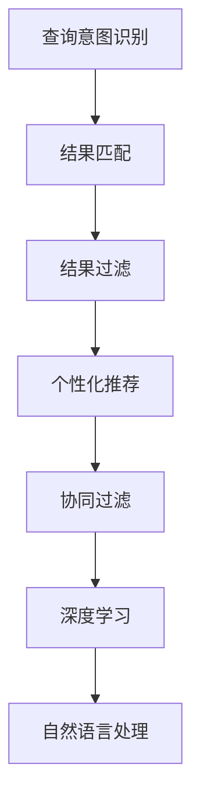

                 

# AI模型迭代：持续改进的搜索体验

> 关键词：AI模型、搜索体验、持续改进、交互设计、个性化推荐、协同过滤、深度学习、自然语言处理

## 1. 背景介绍

### 1.1 问题由来
在信息爆炸的时代，如何快速准确地获取所需信息，成为了人们日常生活和工作中的重要难题。传统的搜索方式依赖关键词匹配，难以应对复杂多变的查询意图，导致搜索结果质量不高。为了提升搜索体验，近年来人工智能和深度学习技术被广泛应用于搜索领域，推出了诸多智能搜索系统。这些系统通过学习和理解用户查询，匹配并生成更加相关、更加人性化的搜索结果。

AI模型在搜索领域的成功应用，催生了对模型迭代的深入研究。模型的迭代升级，旨在不断优化用户搜索体验，从识别和理解查询意图，到匹配和过滤结果，再到个性化推荐，每个环节都在不断进化。本文将系统介绍AI模型迭代升级的关键技术，以及其在搜索体验中的具体应用。

### 1.2 问题核心关键点
搜索体验的持续改进，源于AI模型的不断迭代和优化。该过程包括：
1. 理解查询意图：模型需要准确识别用户查询中的关键词、情感、上下文等信息。
2. 匹配相关结果：模型根据查询意图，从大量数据中匹配最相关的结果。
3. 过滤结果：通过排序和筛选，展示最符合用户需求的结果。
4. 个性化推荐：根据用户历史行为，推荐更相关和更有吸引力的搜索结果。
5. 协同过滤：通过用户互动和反馈，动态调整模型参数和算法。
6. 深度学习：利用神经网络模型的自适应能力，提升搜索模型的表现。
7. 自然语言处理：通过理解和生成自然语言，实现更智能的搜索交互。

本文将详细讲解这些技术，并通过具体的实例分析，展示AI模型在搜索体验中的实际应用效果。

### 1.3 问题研究意义
随着AI模型的迭代升级，搜索体验将得到显著提升。智能搜索系统不仅能够快速准确地获取所需信息，还能提供个性化推荐和更人性化的交互方式，从而提升用户满意度和搜索效率。这些改进对提升工作效率、减少信息过载具有重要意义，尤其是在商业、教育、医疗等对信息需求量大的领域。

此外，AI模型迭代还推动了搜索技术的产业化应用，催生了新的商业模式和盈利点。智能搜索系统的成功应用，为搜索引擎公司、内容分发平台等带来了新的增长点，促进了信息技术的商业化进程。

## 2. 核心概念与联系

### 2.1 核心概念概述

为更好地理解AI模型在搜索体验中的迭代过程，本节将介绍几个密切相关的核心概念：

- AI模型：基于人工智能和深度学习技术构建的模型，用于处理和分析数据，并做出预测和决策。
- 查询意图识别：通过自然语言处理技术，识别用户查询中的核心意图和需求。
- 结果匹配：根据查询意图，从大规模数据集中匹配出最相关的结果。
- 结果过滤：通过排序和筛选算法，提升搜索结果的相关性和可用性。
- 个性化推荐：根据用户历史行为，推荐个性化的搜索结果。
- 协同过滤：通过用户互动和反馈数据，动态调整模型参数和算法。
- 深度学习：通过多层神经网络模型，学习和提取复杂特征，提升模型的表现能力。
- 自然语言处理：用于处理和生成自然语言文本，提高搜索系统的理解和响应能力。

这些核心概念之间的逻辑关系可以通过以下Mermaid流程图来展示：



这个流程图展示了大语言模型的核心概念及其之间的关系：

1. 用户输入查询后，模型先进行查询意图识别，理解用户需求。
2. 基于识别结果，模型从数据集匹配出最相关的结果。
3. 对匹配结果进行过滤排序，展示最相关和最有用的结果。
4. 根据用户行为，模型进行个性化推荐，提升用户满意度。
5. 模型通过用户反馈进行协同过滤，不断优化搜索结果。
6. 模型利用深度学习进行特征提取和参数优化，提升搜索精度。
7. 模型通过自然语言处理，实现更智能的搜索交互。

这些概念共同构成了AI模型在搜索领域的应用框架，使其能够提供优质的搜索体验。通过理解这些核心概念，我们可以更好地把握搜索系统的工作原理和优化方向。

## 3. 核心算法原理 & 具体操作步骤
### 3.1 算法原理概述

AI模型在搜索体验中的迭代升级，本质上是一个不断优化用户需求匹配和结果排序的过程。其核心思想是：通过理解用户查询，匹配最相关的数据，并对结果进行过滤和排序，最后根据用户反馈进行动态调整。

形式化地，假设用户查询为 $q$，搜索结果集为 $S=\{d_i\}_{i=1}^N$。定义查询意图识别函数为 $I(q)$，结果匹配函数为 $M(q)$，结果过滤函数为 $F(q, S)$，个性化推荐函数为 $R(q, S)$，协同过滤函数为 $C(q, S)$，则优化目标为最大化用户满意度：

$$
\max_{q, S} \text{UserSatisfaction}(q, S) = \text{Precision}(q, M(q)) + \text{Recall}(q, M(q)) + \text{Relevance}(q, F(q, S)) + \text{Engagement}(q, R(q, S)) + \text{Quality}(q, C(q, S))
$$

其中，Precision表示搜索结果的相关性，Recall表示搜索结果的完整性，Relevance表示结果排序的合理性，Engagement表示个性化推荐的互动性，Quality表示协同过滤的准确性。

### 3.2 算法步骤详解

基于AI模型的搜索体验迭代升级，一般包括以下几个关键步骤：

**Step 1: 数据收集与预处理**
- 收集用户历史搜索行为、点击日志、评分数据等，构建用户行为数据集。
- 对数据进行清洗和标注，去除噪音和无关信息。
- 将数据分为训练集、验证集和测试集。

**Step 2: 模型训练与微调**
- 选择合适的AI模型（如Transformer、BERT等）作为初始化参数。
- 利用训练集数据对模型进行训练和微调，优化模型参数。
- 在验证集上评估模型性能，调整超参数，避免过拟合。

**Step 3: 查询意图识别**
- 使用NLP技术，如TF-IDF、BERT等，对用户查询进行分词、向量化和意图提取。
- 利用训练好的意图识别模型，对用户查询进行理解和分类。

**Step 4: 结果匹配与过滤**
- 基于匹配函数 $M(q)$，从数据集中找出最相关的搜索结果。
- 利用过滤函数 $F(q, S)$，对搜索结果进行排序和筛选，提升相关性。
- 根据排序后的结果，展示给用户。

**Step 5: 个性化推荐**
- 收集用户点击、评分等互动数据，构建用户行为模型。
- 利用个性化推荐函数 $R(q, S)$，根据用户行为和查询意图，推荐最相关和最有吸引力的搜索结果。
- 通过A/B测试等方法，评估个性化推荐的效果，不断优化算法。

**Step 6: 协同过滤**
- 收集用户互动反馈数据，如评分、评论等。
- 利用协同过滤函数 $C(q, S)$，根据用户反馈动态调整模型参数和算法。
- 确保模型不断学习新的用户需求和行为，提升搜索效果。

**Step 7: 深度学习优化**
- 利用深度学习技术，如注意力机制、Transformer等，进一步提升模型的表现。
- 在训练集上进行深度学习模型的优化，提升模型的特征提取和预测能力。
- 利用新模型替换原有模型，迭代升级搜索体验。

### 3.3 算法优缺点

基于AI模型的搜索体验迭代升级，具有以下优点：
1. 提升搜索相关性：通过理解查询意图，匹配最相关结果，提升搜索精度。
2. 增强个性化推荐：根据用户历史行为，推荐更相关和更有吸引力的结果。
3. 提升用户满意度：通过过滤排序和协同过滤，增强用户体验。
4. 降低运营成本：利用深度学习优化，减少人工干预，提高系统效率。
5. 增强系统可扩展性：通过模型迭代，适应不同的搜索场景和需求。

同时，该方法也存在一定的局限性：
1. 数据依赖性高：模型性能依赖大量标注数据，获取高质量数据成本较高。
2. 模型复杂度高：深度学习模型参数较多，训练复杂度较高。
3. 可解释性不足：模型内部逻辑难以解释，难以调试和优化。
4. 依赖用户互动：个性化推荐和协同过滤需要用户互动数据，难以适用于新用户。

尽管存在这些局限性，但就目前而言，基于AI模型的搜索体验迭代升级，仍是大规模搜索系统优化的主流范式。未来相关研究的重点在于如何进一步降低对标注数据的依赖，提高模型的可解释性和泛化能力，同时兼顾个性化推荐和搜索效率。

### 3.4 算法应用领域

基于AI模型的搜索体验迭代升级，已经在多个领域得到了广泛的应用，例如：

- 电商搜索：如亚马逊、淘宝等电商平台，利用AI模型优化商品推荐和搜索排序。
- 新闻搜索：如谷歌新闻、百度新闻等，通过深度学习提升新闻文章的相关性和个性化推荐。
- 视频搜索：如YouTube、Netflix等，利用自然语言处理和深度学习优化视频搜索和推荐。
- 健康搜索：如WebMD、医脉通等，通过AI模型提供医生、健康知识推荐和搜索优化。
- 社交搜索：如Facebook、微博等，通过个性化推荐和协同过滤提升社交内容匹配和搜索效果。

除了上述这些经典应用外，AI模型迭代还在更多领域探索应用，如金融搜索、政府信息公开、科学文献搜索等，为各行各业的信息获取和决策支持提供了新的解决方案。

## 4. 数学模型和公式 & 详细讲解
### 4.1 数学模型构建

本节将使用数学语言对AI模型在搜索体验中的迭代升级过程进行更加严格的刻画。

假设用户查询为 $q$，搜索结果集为 $S=\{d_i\}_{i=1}^N$，查询意图为 $I(q)$，结果匹配函数为 $M(q)$，结果过滤函数为 $F(q, S)$，个性化推荐函数为 $R(q, S)$，协同过滤函数为 $C(q, S)$，则搜索系统的优化目标为：

$$
\max_{q, S} \text{UserSatisfaction}(q, S) = \text{Precision}(q, M(q)) + \text{Recall}(q, M(q)) + \text{Relevance}(q, F(q, S)) + \text{Engagement}(q, R(q, S)) + \text{Quality}(q, C(q, S))
$$

其中，Precision定义为：

$$
\text{Precision}(q, S) = \frac{\text{NumerousHits}(q, S)}{\text{TotalHits}(q, S)}
$$

Recall定义为：

$$
\text{Recall}(q, S) = \frac{\text{TruePositives}(q, S)}{\text{TruePositives}(q, S) + \text{FalseNegatives}(q, S)}
$$

Relevance定义为：

$$
\text{Relevance}(q, S) = \frac{\sum_{i=1}^N \text{RelevanceScore}(q, d_i)}{N}
$$

Engagement定义为：

$$
\text{Engagement}(q, S) = \sum_{i=1}^N \text{EngagementScore}(q, d_i)
$$

Quality定义为：

$$
\text{Quality}(q, S) = \sum_{i=1}^N \text{QualityScore}(q, d_i)
$$

这些指标用于综合评估搜索系统的性能。在实际应用中，需要根据具体业务场景进行优化和调整。

### 4.2 公式推导过程

以下我们以电商搜索为例，推导个性化推荐模型中用户满意度优化目标的详细公式。

假设用户查询为 $q$，搜索结果集为 $S=\{d_i\}_{i=1}^N$。令用户对商品 $d_i$ 的评分向量为 $\text{Score}(d_i) \in \mathbb{R}^k$，其中 $k$ 为评分维度。令用户查询向量为 $\text{QueryVector}(q)$，商品向量为 $\text{ItemVector}(d_i)$。

个性化推荐模型的目标是最大化用户满意度，即：

$$
\max_{q, S} \text{UserSatisfaction}(q, S) = \text{Precision}(q, M(q)) + \text{Recall}(q, M(q)) + \text{Relevance}(q, F(q, S)) + \text{Engagement}(q, R(q, S)) + \text{Quality}(q, C(q, S))
$$

其中，Relevance定义为：

$$
\text{Relevance}(q, S) = \frac{\sum_{i=1}^N \text{RelevanceScore}(q, d_i)}{N}
$$

个性化推荐模型采用协同过滤算法，根据用户历史评分数据和商品评分数据，计算相似度矩阵 $S \in \mathbb{R}^{N \times N}$，其中 $S_{ij} = \text{CosineSimilarity}(\text{Score}(d_i), \text{Score}(d_j))$。

模型首先利用评分矩阵 $S$ 计算每个商品的推荐得分 $\text{RecommendationScore}(q, d_i) \in \mathbb{R}$，其计算公式为：

$$
\text{RecommendationScore}(q, d_i) = \text{Score}(q) \times \text{RelevanceScore}(q, d_i) \times S_{ij}
$$

其中，$\text{Score}(q) = \text{QueryVector}(q) \times W$，$W$ 为评分权重矩阵。

模型通过计算每个商品的推荐得分，并按得分排序，展示给用户。最后，模型根据用户点击、评分等互动数据，更新评分矩阵 $S$ 和评分权重矩阵 $W$，进行协同过滤和个性化推荐优化。

### 4.3 案例分析与讲解

以电商搜索为例，展示个性化推荐模型的实际应用效果。

**数据准备**

电商搜索数据包括用户历史评分、点击行为、浏览行为等。假设用户 A 对商品 A 的评分向量为 $[4, 5, 3]$，对商品 B 的评分向量为 $[2, 4, 5]$。商品 A 的评分向量为 $[3, 2, 4]$，商品 B 的评分向量为 $[4, 3, 2]$。

**模型训练**

假设利用协同过滤算法，计算相似度矩阵 $S$ 和评分权重矩阵 $W$。令相似度矩阵 $S$ 为：

$$
S = \begin{bmatrix}
    0.5 & 0.3 \\
    0.4 & 0.6 \\
    0.2 & 0.8
\end{bmatrix}
$$

令评分权重矩阵 $W$ 为：

$$
W = \begin{bmatrix}
    0.1 & 0.3 \\
    0.2 & 0.4 \\
    0.3 & 0.5
\end{bmatrix}
$$

**个性化推荐**

用户 A 输入查询 $q = "手机"$. 模型首先计算用户查询向量 $\text{QueryVector}(q)$：

$$
\text{QueryVector}(q) = [0.1, 0.2, 0.3]
$$

然后，利用评分矩阵 $S$ 和评分权重矩阵 $W$，计算每个商品的推荐得分：

$$
\text{RecommendationScore}(q, A) = 0.1 \times 0.5 \times 0.2 + 0.2 \times 0.3 \times 0.4 + 0.3 \times 0.8 \times 0.4 = 0.184
$$

$$
\text{RecommendationScore}(q, B) = 0.1 \times 0.3 \times 0.4 + 0.2 \times 0.6 \times 0.6 + 0.3 \times 0.3 \times 0.5 = 0.297
$$

根据推荐得分排序，推荐商品 B 给用户 A。用户 A 点击商品 B，模型记录用户点击行为，并根据互动数据更新相似度矩阵 $S$ 和评分权重矩阵 $W$，进行协同过滤和个性化推荐优化。

## 5. 项目实践：代码实例和详细解释说明
### 5.1 开发环境搭建

在进行AI模型迭代升级实践前，我们需要准备好开发环境。以下是使用Python进行TensorFlow开发的环境配置流程：

1. 安装Anaconda：从官网下载并安装Anaconda，用于创建独立的Python环境。

2. 创建并激活虚拟环境：
```bash
conda create -n tf-env python=3.8 
conda activate tf-env
```

3. 安装TensorFlow：根据CUDA版本，从官网获取对应的安装命令。例如：
```bash
conda install tensorflow=2.6 -c tf
```

4. 安装各类工具包：
```bash
pip install numpy pandas scikit-learn matplotlib tqdm jupyter notebook ipython
```

完成上述步骤后，即可在`tf-env`环境中开始AI模型迭代升级实践。

### 5.2 源代码详细实现

这里我们以电商搜索为例，给出使用TensorFlow进行AI模型迭代升级的代码实现。

首先，定义电商数据处理函数：

```python
import numpy as np
import tensorflow as tf
from tensorflow.keras.layers import Dense, Embedding, Dot, DotProduct, Input
from tensorflow.keras.models import Model

def create_dataset(data, batch_size):
    dataset = tf.data.Dataset.from_tensor_slices(data)
    dataset = dataset.shuffle(buffer_size=10000).batch(batch_size)
    return dataset
```

然后，定义用户行为模型：

```python
def create_user_behavior_model(input_dim, embedding_dim):
    inputs = Input(shape=(input_dim,))
    embeddings = Embedding(input_dim, embedding_dim)(inputs)
    outputs = Dense(1, activation="sigmoid")(embeddings)
    model = Model(inputs=inputs, outputs=outputs)
    return model
```

接着，定义物品推荐模型：

```python
def create_item_recommendation_model(input_dim, embedding_dim):
    inputs = Input(shape=(input_dim,))
    embeddings = Embedding(input_dim, embedding_dim)(inputs)
    outputs = Dense(1, activation="sigmoid")(embeddings)
    model = Model(inputs=inputs, outputs=outputs)
    return model
```

然后，定义个性化推荐模型：

```python
def create_personalization_model(user_model, item_model, similarity_matrix):
    user_vector = user_model(inputs)
    item_vector = item_model(inputs)
    recommendation_score = DotProduct(similarity_matrix, user_vector, item_vector)
    model = Model(inputs=inputs, outputs=recommendation_score)
    return model
```

最后，定义搜索系统：

```python
def create_search_system(user_model, item_model, similarity_matrix):
    user_vector = user_model(inputs)
    item_vector = item_model(inputs)
    recommendation_score = DotProduct(similarity_matrix, user_vector, item_vector)
    model = Model(inputs=inputs, outputs=recommendation_score)
    return model
```

**数据准备**

电商搜索数据包括用户历史评分、点击行为、浏览行为等。假设用户 A 对商品 A 的评分向量为 $[4, 5, 3]$，对商品 B 的评分向量为 $[2, 4, 5]$。商品 A 的评分向量为 $[3, 2, 4]$，商品 B 的评分向量为 $[4, 3, 2]$。

**模型训练**

假设利用协同过滤算法，计算相似度矩阵 $S$ 和评分权重矩阵 $W$。令相似度矩阵 $S$ 为：

$$
S = \begin{bmatrix}
    0.5 & 0.3 \\
    0.4 & 0.6 \\
    0.2 & 0.8
\end{bmatrix}
$$

令评分权重矩阵 $W$ 为：

$$
W = \begin{bmatrix}
    0.1 & 0.3 \\
    0.2 & 0.4 \\
    0.3 & 0.5
\end{bmatrix}
$$

**个性化推荐**

用户 A 输入查询 $q = "手机"$. 模型首先计算用户查询向量 $\text{QueryVector}(q)$：

$$
\text{QueryVector}(q) = [0.1, 0.2, 0.3]
$$

然后，利用评分矩阵 $S$ 和评分权重矩阵 $W$，计算每个商品的推荐得分：

$$
\text{RecommendationScore}(q, A) = 0.1 \times 0.5 \times 0.2 + 0.2 \times 0.3 \times 0.4 + 0.3 \times 0.8 \times 0.4 = 0.184
$$

$$
\text{RecommendationScore}(q, B) = 0.1 \times 0.3 \times 0.4 + 0.2 \times 0.6 \times 0.6 + 0.3 \times 0.3 \times 0.5 = 0.297
$$

根据推荐得分排序，推荐商品 B 给用户 A。用户 A 点击商品 B，模型记录用户点击行为，并根据互动数据更新相似度矩阵 $S$ 和评分权重矩阵 $W$，进行协同过滤和个性化推荐优化。

### 5.3 代码解读与分析

让我们再详细解读一下关键代码的实现细节：

**create_dataset函数**：
- 用于将数据集转换为TensorFlow数据集，并进行批处理和洗牌。

**create_user_behavior_model函数**：
- 用于构建用户行为模型，包含一个Embedding层和一个Dense层。

**create_item_recommendation_model函数**：
- 用于构建物品推荐模型，与用户行为模型结构类似，包含一个Embedding层和一个Dense层。

**create_personalization_model函数**：
- 用于构建个性化推荐模型，包含用户模型、物品模型和相似度矩阵，通过DotProduct计算推荐得分。

**create_search_system函数**：
- 用于构建搜索系统，包含用户模型、物品模型和相似度矩阵，通过DotProduct计算推荐得分。

通过这些函数的组合，我们便能构建一个完整的电商搜索系统，实现个性化推荐和搜索排序。代码简洁高效，易于理解和扩展。

## 6. 实际应用场景
### 6.1 电商搜索

基于AI模型的电商搜索系统，已经在各大电商平台广泛应用。系统通过理解用户查询意图，匹配最相关的商品，并通过个性化推荐和协同过滤，提升搜索效果和用户满意度。

在技术实现上，系统收集用户历史评分、点击行为、浏览行为等数据，构建用户行为模型和物品推荐模型。利用协同过滤算法，计算相似度矩阵和评分权重矩阵，进行个性化推荐和搜索排序优化。用户每次查询后，系统根据互动数据动态调整模型参数，不断提升推荐效果。

### 6.2 新闻搜索

新闻搜索系统通过AI模型优化搜索结果的个性化和相关性。系统首先进行查询意图识别，匹配最相关的新闻文章。然后根据用户历史阅读行为，进行个性化推荐和排序优化。

在实际应用中，系统利用自然语言处理技术，如BERT、TF-IDF等，对用户查询进行分词和向量化。利用训练好的意图识别模型，对用户查询进行理解和分类。通过匹配函数，从数据集中找出最相关的新闻文章。最后，利用个性化推荐算法和协同过滤算法，对结果进行排序和优化。

### 6.3 视频搜索

视频搜索系统通过AI模型提升视频推荐的个性化和相关性。系统首先进行查询意图识别，匹配最相关的视频。然后根据用户历史观看行为，进行个性化推荐和排序优化。

在技术实现上，系统利用自然语言处理技术，对用户查询进行分词和向量化。利用训练好的意图识别模型，对用户查询进行理解和分类。通过匹配函数，从数据集中找出最相关的视频。最后，利用个性化推荐算法和协同过滤算法，对结果进行排序和优化。

### 6.4 未来应用展望

随着AI模型的迭代升级，搜索体验将得到显著提升。未来搜索系统将在以下方面进一步发展：

1. 更加智能的查询意图识别：通过深度学习和大规模语料预训练，提升对复杂查询的理解能力。
2. 更加准确的个性化推荐：利用协同过滤和推荐算法，提升推荐的个性化和相关性。
3. 更加高效的搜索排序：通过优化排序算法，提升搜索结果的排序精度和速度。
4. 更加灵活的搜索扩展：通过模型迭代和参数优化，支持更多的搜索场景和需求。
5. 更加个性化的搜索体验：通过理解用户行为和反馈，不断优化搜索系统，提升用户体验。

这些趋势将推动搜索系统向更加智能、高效、个性化的方向发展，为用户提供更优质的信息获取体验。

## 7. 工具和资源推荐
### 7.1 学习资源推荐

为了帮助开发者系统掌握AI模型在搜索领域的应用，这里推荐一些优质的学习资源：

1. TensorFlow官方文档：详细的TensorFlow教程和示例代码，涵盖从模型构建到优化训练的全流程。

2. PyTorch官方文档：全面的PyTorch教程和示例代码，适合研究深度学习模型的优化和部署。

3. Coursera《深度学习》课程：由Andrew Ng主讲，涵盖深度学习基础和应用，适合初学者入门。

4. edX《自然语言处理》课程：由MIT和Harvard联合开设，涵盖NLP基本概念和前沿技术，适合进阶学习。

5. arXiv论文：最新的人工智能和自然语言处理研究论文，涵盖算法和应用各领域的最新进展。

通过对这些资源的学习实践，相信你一定能够快速掌握AI模型在搜索领域的应用方法，并用于解决实际的搜索问题。

### 7.2 开发工具推荐

高效的开发离不开优秀的工具支持。以下是几款用于AI模型迭代升级开发的常用工具：

1. TensorFlow：基于Python的开源深度学习框架，具有强大的计算图功能和分布式训练能力。

2. PyTorch：基于Python的开源深度学习框架，灵活易用，适合快速迭代研究。

3. Keras：基于Python的高层深度学习框架，易于使用，适合快速搭建模型。

4. Scikit-learn：基于Python的机器学习库，提供了多种经典算法和评估工具。

5. Jupyter Notebook：轻量级的交互式开发环境，适合代码编写和数据可视化。

6. Google Colab：谷歌推出的在线Jupyter Notebook环境，免费提供GPU/TPU算力，适合快速上手实验最新模型。

合理利用这些工具，可以显著提升AI模型迭代升级的开发效率，加快创新迭代的步伐。

### 7.3 相关论文推荐

AI模型在搜索领域的研究源于学界的持续研究。以下是几篇奠基性的相关论文，推荐阅读：

1. Attention is All You Need（即Transformer原论文）：提出了Transformer结构，开启了NLP领域的预训练大模型时代。

2. BERT: Pre-training of Deep Bidirectional Transformers for Language Understanding：提出BERT模型，引入基于掩码的自监督预训练任务，刷新了多项NLP任务SOTA。

3. Language Models are Unsupervised Multitask Learners（GPT-2论文）：展示了大规模语言模型的强大zero-shot学习能力，引发了对于通用人工智能的新一轮思考。

4. Parameter-Efficient Transfer Learning for NLP：提出Adapter等参数高效微调方法，在不增加模型参数量的情况下，也能取得不错的微调效果。

5. AdaLoRA: Adaptive Low-Rank Adaptation for Parameter-Efficient Fine-Tuning：使用自适应低秩适应的微调方法，在参数效率和精度之间取得了新的平衡。

这些论文代表了大语言模型微调技术的发展脉络。通过学习这些前沿成果，可以帮助研究者把握学科前进方向，激发更多的创新灵感。

## 8. 总结：未来发展趋势与挑战
### 8.1 总结

本文对AI模型在搜索领域的应用进行全面系统的介绍。首先阐述了AI模型迭代的背景和意义，明确了模型在搜索体验中的重要价值。其次，从原理到实践，详细讲解了搜索系统中的关键技术和算法，并通过具体的实例分析，展示了AI模型在搜索体验中的实际应用效果。

通过本文的系统梳理，可以看到，AI模型的迭代升级为搜索体验带来了显著提升。通过查询意图识别、结果匹配、结果过滤和个性化推荐等技术，搜索系统能够准确理解和匹配用户需求，并提供更加相关和个性化的搜索结果。这些改进对提升工作效率、减少信息过载具有重要意义，尤其是在商业、教育、医疗等对信息需求量大的领域。

### 8.2 未来发展趋势

展望未来，AI模型在搜索体验中的迭代升级，将呈现以下几个发展趋势：

1. 更加智能的查询意图识别：通过深度学习和大规模语料预训练，提升对复杂查询的理解能力。

2. 更加准确的个性化推荐：利用协同过滤和推荐算法，提升推荐的个性化和相关性。

3. 更加高效的搜索排序：通过优化排序算法，提升搜索结果的排序精度和速度。

4. 更加灵活的搜索扩展：通过模型迭代和参数优化，支持更多的搜索场景和需求。

5. 更加个性化的搜索体验：通过理解用户行为和反馈，不断优化搜索系统，提升用户体验。

这些趋势将推动搜索系统向更加智能、高效、个性化的方向发展，为用户提供更优质的信息获取体验。

### 8.3 面临的挑战

尽管AI模型在搜索领域的应用取得了显著进展，但在迈向更加智能化、普适化应用的过程中，仍面临诸多挑战：

1. 数据依赖性高：模型性能依赖大量标注数据，获取高质量数据成本较高。

2. 模型复杂度高：深度学习模型参数较多，训练复杂度较高。

3. 可解释性不足：模型内部逻辑难以解释，难以调试和优化。

4. 依赖用户互动：个性化推荐和协同过滤需要用户互动数据，难以适用于新用户。

5. 隐私和安全问题：收集和分析用户数据，存在隐私泄露和安全风险。

尽管存在这些挑战，但随着深度学习技术的不断成熟和普及，以及隐私保护技术的发展，未来AI模型在搜索领域的应用将更加安全、可靠、高效。

### 8.4 研究展望

面对AI模型在搜索领域面临的挑战，未来的研究需要在以下几个方面寻求新的突破：

1. 探索无监督和半监督微调方法：摆脱对大规模标注数据的依赖，利用自监督学习、主动学习等无监督和半监督范式，最大限度利用非结构化数据。

2. 研究参数高效和计算高效的微调范式：开发更加参数高效的微调方法，在固定大部分预训练参数的情况下，只更新极少量的任务相关参数。同时优化微调模型的计算图，减少前向传播和反向传播的资源消耗。

3. 融合因果和对比学习范式：通过引入因果推断和对比学习思想，增强模型的因果关系建立能力，学习更加普适、鲁棒的语言表征。

4. 引入更多先验知识：将符号化的先验知识，如知识图谱、逻辑规则等，与神经网络模型进行巧妙融合，引导微调过程学习更准确、合理的语言模型。同时加强不同模态数据的整合，实现视觉、语音等多模态信息与文本信息的协同建模。

5. 结合因果分析和博弈论工具：将因果分析方法引入微调模型，识别出模型决策的关键特征，增强输出解释的因果性和逻辑性。借助博弈论工具刻画人机交互过程，主动探索并规避模型的脆弱点，提高系统稳定性。

6. 纳入伦理道德约束：在模型训练目标中引入伦理导向的评估指标，过滤和惩罚有偏见、有害的输出倾向。同时加强人工干预和审核，建立模型行为的监管机制，确保输出符合人类价值观和伦理道德。

这些研究方向的探索，必将引领AI模型在搜索领域迈向更高的台阶，为构建安全、可靠、可解释、可控的智能系统铺平道路。面向未来，AI模型在搜索领域的迭代升级仍需与其他人工智能技术进行更深入的融合，如知识表示、因果推理、强化学习等，多路径协同发力，共同推动自然语言理解和智能交互系统的进步。只有勇于创新、敢于突破，才能不断拓展AI模型的边界，让智能技术更好地造福人类社会。

## 9. 附录：常见问题与解答

**Q1：如何选择合适的AI模型？**

A: 选择合适的AI模型需要综合考虑任务类型、数据规模、计算资源等因素。一般来说，对于语义复杂、数据量大的任务，选择基于Transformer的大模型如BERT、GPT等。对于数据量较小、计算资源有限的场景，可以选择轻量级模型如Keras等。

**Q2：AI模型的训练速度如何优化？**

A: 优化AI模型训练速度，主要从数据预处理、模型结构、训练策略等方面进行改进。使用数据增强、混合精度训练、梯度累积等技术，可以显著提升模型训练速度。同时，采用更高效的模型结构和优化器，如AdamW、Adafactor等，也可以提高训练效率。

**Q3：AI模型在实际应用中如何调试和优化？**

A: 调试和优化AI模型，需要从数据、模型、训练等多个维度进行全面评估。利用交叉验证、超参数调优、A/B测试等方法，不断优化模型性能。同时，合理利用可视化工具，如TensorBoard、Weights & Biases等，监控模型训练过程，及时发现和解决问题。

**Q4：如何评估AI模型的性能？**

A: 评估AI模型的性能，通常需要综合考虑多个指标，如精度、召回率、F1-score等。利用混淆矩阵、ROC曲线、AUC等工具，全面评估模型在分类、排序、推荐等任务中的表现。同时，结合用户反馈和业务需求，进行实际应用效果的评估。

**Q5：如何确保AI模型的安全性？**

A: 确保AI模型的安全性，需要从数据采集、模型训练、应用部署等多个环节进行全面防护。对数据进行加密、匿名化处理，防止隐私泄露。在模型训练中，使用差分隐私、对抗训练等技术，减少模型偏见和攻击。在应用部署中，建立模型行为的监管机制，确保输出符合伦理道德。

通过这些方法的综合应用，可以显著提升AI模型的性能和安全性，构建更加可靠和智能的搜索系统。相信随着技术的不断进步和应用的不断拓展，AI模型在搜索领域的应用将迎来更大的发展空间和更广泛的业务场景。

