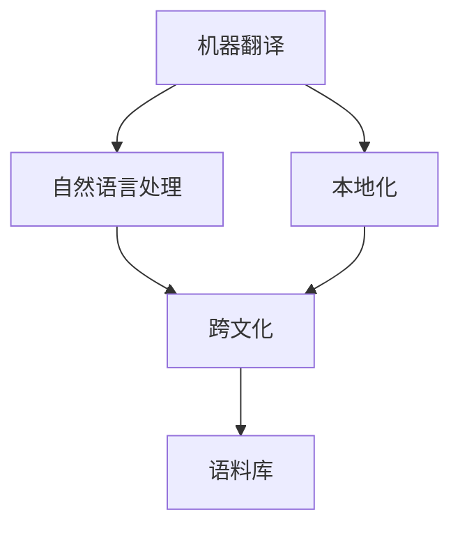

                 

# AI翻译与本地化：跨文化故事传播

> 关键词：AI翻译, 本地化, 跨文化, 机器翻译, 自然语言处理, 故事传播, 文本翻译

## 1. 背景介绍

### 1.1 问题由来
全球化时代下，跨国交流和合作日益频繁，各种故事、知识、文化、商品在全球范围内快速传播。然而，由于语言障碍的存在，不同语言和文化背景的人之间难以直接交流，这严重制约了跨文化的理解和共鸣。为了解决这一问题，AI翻译和本地化技术应运而生，成为了连接不同文化、传播故事的重要工具。

### 1.2 问题核心关键点
AI翻译与本地化技术的目标是通过自动或半自动的翻译，将文本从一种语言转换为另一种语言，并在转换过程中考虑到目标语言的语境、文化和习俗，使其在目标语读者中产生共鸣。这一过程包括但不限于：

1. **机器翻译(translation)**：使用AI模型自动将一种语言的文本转换为另一种语言的文本。
2. **本地化(localization)**：不仅包括语言翻译，还包括对文本的改编以适应目标语言和文化环境，如对文化元素、惯用语、俚语的替换等。
3. **跨文化(cross-cultural)**：关注翻译和本地化过程中如何处理语言和文化之间的差异，确保跨文化的理解和沟通。

### 1.3 问题研究意义
AI翻译与本地化技术的研究和应用具有以下重要意义：

1. **促进跨文化交流**：打破了语言障碍，使不同文化背景的人能够更好地理解彼此，促进全球化发展。
2. **加速知识传播**：通过自动化翻译和本地化，全球范围内的知识、故事和信息能够迅速传播，加速社会进步。
3. **提升用户体验**：特别是在多语言环境下，用户可以更方便地获取目标语言的信息，提升整体用户体验。
4. **降低成本**：相比于人工翻译，AI翻译与本地化技术在处理大规模文本时，成本更低，效率更高。

## 2. 核心概念与联系

### 2.1 核心概念概述

为了更好地理解AI翻译与本地化技术，本节将介绍几个密切相关的核心概念：

- **机器翻译(Translation)**：使用计算机算法将一种语言的文本自动翻译成另一种语言的文本。
- **本地化(Localization)**：不仅涉及语言翻译，还包括将文本适应目标语言的文化和环境。
- **跨文化(cross-cultural)**：处理不同文化之间的差异，确保翻译文本在目标文化中能够被理解和接受。
- **自然语言处理(Natural Language Processing, NLP)**：涉及文本理解、生成和翻译等技术的集合。
- **语境(Context)**：理解文本时需要考虑的上下文信息，包括语法、词汇、文化背景等。
- **语料库(Corpus)**：用于训练和测试翻译模型的大量已标注文本数据。

这些核心概念之间的逻辑关系可以通过以下Mermaid流程图来展示：



这个流程图展示了大语言模型的核心概念及其之间的关系：

1. 机器翻译依赖自然语言处理技术实现。
2. 本地化在机器翻译的基础上进一步处理语言和文化差异。
3. 跨文化关注翻译文本在目标语言文化中的可接受性和理解度。
4. 语料库是训练和测试翻译模型的重要数据来源。

## 3. 核心算法原理 & 具体操作步骤
### 3.1 算法原理概述

AI翻译与本地化技术的核心算法基于自然语言处理技术，核心思想是通过大规模的语料库训练神经网络模型，使其能够自动进行语言之间的翻译和本地化处理。

具体来说，机器翻译的算法流程如下：

1. **数据预处理**：对原始文本进行分词、标注、清洗等预处理操作，使其适合训练和测试模型。
2. **模型训练**：使用大规模的语料库训练神经网络模型，使其能够预测源语言文本在目标语言中的对应翻译。
3. **解码和后处理**：将模型预测的翻译结果进行解码和后处理，如去噪、格式化、调整语序等，最终输出翻译文本。

本地化算法则在此基础上进一步处理文本的文化和语言差异，包括但不限于：

1. **文本适应**：调整文本格式、用语习惯、文化元素等，使其适应目标语言和文化。
2. **语境理解**：考虑文本的语境信息，如文化背景、社会习俗等，确保翻译文本在目标文化中能够被理解和接受。
3. **用户反馈**：通过用户反馈不断优化翻译和本地化过程，提升翻译质量。

### 3.2 算法步骤详解

以下将详细描述AI翻译与本地化技术的算法步骤和具体操作步骤：

**Step 1: 数据收集与预处理**

1. **数据收集**：收集源语言和目标语言的文本数据，如新闻、书籍、文章等。确保数据来源多样化，涵盖不同领域和主题。
2. **文本预处理**：对文本进行分词、去噪、停用词过滤等处理，构建语料库。
3. **标注与清洗**：对文本进行人工标注，如确定词性、识别实体等，确保数据质量。

**Step 2: 模型训练**

1. **选择模型**：选择合适的神经网络模型，如基于Transformer的模型。
2. **训练参数设置**：设置学习率、批大小、迭代次数等训练参数。
3. **模型训练**：使用预处理后的语料库训练模型，调整模型参数以最小化翻译误差。
4. **模型评估**：使用验证集评估模型性能，调整模型超参数以提升性能。

**Step 3: 本地化处理**

1. **文本适应**：调整文本格式、用语习惯、文化元素等，使其适应目标语言和文化。
2. **语境理解**：考虑文本的语境信息，如文化背景、社会习俗等，确保翻译文本在目标文化中能够被理解和接受。
3. **用户反馈**：通过用户反馈不断优化翻译和本地化过程，提升翻译质量。

**Step 4: 部署与评估**

1. **模型部署**：将训练好的模型部署到实际应用系统中，如Web应用、移动应用等。
2. **实时翻译**：根据用户输入的源语言文本，实时生成目标语言翻译。
3. **性能评估**：通过用户反馈和测试数据评估翻译和本地化性能，持续改进模型。

### 3.3 算法优缺点

AI翻译与本地化技术具有以下优点：

1. **高效性**：能够自动处理大规模文本数据，节省人力和时间成本。
2. **可扩展性**：适用于多种语言和文化之间的翻译和本地化处理。
3. **成本低**：相比于人工翻译，AI翻译与本地化技术在处理大规模文本时，成本更低。
4. **实时性**：能够实时处理用户输入，提供即时的翻译服务。

同时，该技术也存在一些缺点：

1. **准确性受限**：由于语言和文化差异的存在，机器翻译和本地化处理的准确性有限。
2. **文化冲突**：在处理跨文化翻译时，可能会出现文化冲突或误解。
3. **用户反馈复杂**：用户反馈难以量化，需要人工处理和分析。
4. **语言差异**：不同语言之间的语法、词汇、习惯差异较大，处理难度高。

### 3.4 算法应用领域

AI翻译与本地化技术在多个领域得到了广泛应用，例如：

1. **新闻媒体**：实时翻译和本地化，帮助新闻机构在全球范围内迅速传播信息。
2. **旅游行业**：提供多语言翻译服务，帮助游客在旅行中克服语言障碍。
3. **企业国际化**：处理国际贸易、客户服务、市场营销等多语言沟通需求。
4. **教育领域**：提供跨文化教育资源，帮助学生学习不同语言和文化。
5. **医疗健康**：提供多语言健康教育、医学翻译服务，促进国际医疗交流。

这些应用展示了AI翻译与本地化技术在提升跨文化交流、促进知识传播和降低成本方面的巨大潜力。

## 4. 数学模型和公式 & 详细讲解 & 举例说明（备注：数学公式请使用latex格式，latex嵌入文中独立段落使用 $$，段落内使用 $)
### 4.1 数学模型构建

基于神经网络的机器翻译模型通常采用序列到序列(seq2seq)架构，包括编码器和解码器两部分。其中，编码器将源语言文本转换为向量表示，解码器将该向量转换为目标语言文本。

假设源语言为S，目标语言为T，输入序列为 $x=(x_1, x_2, ..., x_n)$，输出序列为 $y=(y_1, y_2, ..., y_n)$。则机器翻译的数学模型可以表示为：

$$
y_i = \text{dec}_i(x_1, x_2, ..., x_n, \theta)
$$

其中，$\text{dec}_i$ 为解码器中的第 $i$ 个步骤的输出，$\theta$ 为模型的可训练参数。

### 4.2 公式推导过程

以Transformer模型为例，推导其训练过程的数学公式：

1. **编码器前向传播**：
$$
h_1 = \text{Enc}(x_1, x_2, ..., x_n, \theta_{enc})
$$
$$
h_2 = \text{Enc}(h_1, x_2, ..., x_n, \theta_{enc})
$$
...
$$
h_n = \text{Enc}(h_{n-1}, x_n, \theta_{enc})
$$

其中，$\text{Enc}$ 为编码器中的自注意力机制，$\theta_{enc}$ 为编码器的可训练参数。

2. **解码器前向传播**：
$$
o_1 = \text{Dec}(h_n, h_{n-1}, ..., h_1, \theta_{dec})
$$
$$
o_2 = \text{Dec}(o_1, h_n, h_{n-1}, ..., h_1, \theta_{dec})
$$
...
$$
o_n = \text{Dec}(o_{n-1}, h_n, h_{n-1}, ..., h_1, \theta_{dec})
$$

其中，$\text{Dec}$ 为解码器中的自注意力机制，$\theta_{dec}$ 为解码器的可训练参数。

3. **损失函数计算**：
$$
L = \sum_{i=1}^{n} L_{i-1}(\text{dec}_i(x_1, ..., x_n, \theta))
$$

其中，$L_{i-1}$ 为解码器输出 $o_i$ 的交叉熵损失，$n$ 为输出序列长度。

### 4.3 案例分析与讲解

以机器翻译中的Seq2Seq模型为例，推导其训练过程的数学公式：

1. **编码器前向传播**：
$$
h_1 = \text{Enc}(x_1, x_2, ..., x_n, \theta_{enc})
$$
$$
h_2 = \text{Enc}(h_1, x_2, ..., x_n, \theta_{enc})
$$
...
$$
h_n = \text{Enc}(h_{n-1}, x_n, \theta_{enc})
$$

其中，$\text{Enc}$ 为编码器中的自注意力机制，$\theta_{enc}$ 为编码器的可训练参数。

2. **解码器前向传播**：
$$
o_1 = \text{Dec}(h_n, h_{n-1}, ..., h_1, \theta_{dec})
$$
$$
o_2 = \text{Dec}(o_1, h_n, h_{n-1}, ..., h_1, \theta_{dec})
$$
...
$$
o_n = \text{Dec}(o_{n-1}, h_n, h_{n-1}, ..., h_1, \theta_{dec})
$$

其中，$\text{Dec}$ 为解码器中的自注意力机制，$\theta_{dec}$ 为解码器的可训练参数。

3. **损失函数计算**：
$$
L = \sum_{i=1}^{n} L_{i-1}(\text{dec}_i(x_1, ..., x_n, \theta))
$$

其中，$L_{i-1}$ 为解码器输出 $o_i$ 的交叉熵损失，$n$ 为输出序列长度。

通过上述推导，可以看出Seq2Seq模型的训练过程包含编码器和解码器的逐层前向传播和交叉熵损失的计算。在实际应用中，通过反向传播算法，可以不断调整模型的可训练参数，优化翻译效果。

## 5. 项目实践：代码实例和详细解释说明
### 5.1 开发环境搭建

在进行AI翻译与本地化技术实践前，我们需要准备好开发环境。以下是使用Python进行PyTorch开发的环境配置流程：

1. 安装Anaconda：从官网下载并安装Anaconda，用于创建独立的Python环境。

2. 创建并激活虚拟环境：
```bash
conda create -n pytorch-env python=3.8 
conda activate pytorch-env
```

3. 安装PyTorch：根据CUDA版本，从官网获取对应的安装命令。例如：
```bash
conda install pytorch torchvision torchaudio cudatoolkit=11.1 -c pytorch -c conda-forge
```

4. 安装Transformer库：
```bash
pip install transformers
```

5. 安装各类工具包：
```bash
pip install numpy pandas scikit-learn matplotlib tqdm jupyter notebook ipython
```

完成上述步骤后，即可在`pytorch-env`环境中开始AI翻译与本地化技术的实践。

### 5.2 源代码详细实现

我们以机器翻译任务为例，给出使用Transformers库对序列到序列模型进行训练的PyTorch代码实现。

首先，定义模型和优化器：

```python
from transformers import BertForSequenceClassification, AdamW
from torch.utils.data import Dataset, DataLoader
import torch

model = BertForSequenceClassification.from_pretrained('bert-base-cased')
optimizer = AdamW(model.parameters(), lr=2e-5)
```

然后，定义训练和评估函数：

```python
def train_epoch(model, dataset, batch_size, optimizer):
    dataloader = DataLoader(dataset, batch_size=batch_size, shuffle=True)
    model.train()
    epoch_loss = 0
    for batch in dataloader:
        input_ids = batch['input_ids'].to(device)
        attention_mask = batch['attention_mask'].to(device)
        labels = batch['labels'].to(device)
        model.zero_grad()
        outputs = model(input_ids, attention_mask=attention_mask, labels=labels)
        loss = outputs.loss
        epoch_loss += loss.item()
        loss.backward()
        optimizer.step()
    return epoch_loss / len(dataloader)

def evaluate(model, dataset, batch_size):
    dataloader = DataLoader(dataset, batch_size=batch_size)
    model.eval()
    preds, labels = [], []
    with torch.no_grad():
        for batch in dataloader:
            input_ids = batch['input_ids'].to(device)
            attention_mask = batch['attention_mask'].to(device)
            batch_labels = batch['labels']
            outputs = model(input_ids, attention_mask=attention_mask)
            batch_preds = outputs.logits.argmax(dim=2).to('cpu').tolist()
            batch_labels = batch_labels.to('cpu').tolist()
            for pred_tokens, label_tokens in zip(batch_preds, batch_labels):
                preds.append(pred_tokens[:len(label_tokens)])
                labels.append(label_tokens)
                
    print(classification_report(labels, preds))
```

接着，定义数据处理函数：

```python
from transformers import BertTokenizer

tokenizer = BertTokenizer.from_pretrained('bert-base-cased')

def encode_text(text):
    encoding = tokenizer(text, return_tensors='pt', padding='max_length', truncation=True)
    return encoding['input_ids'], encoding['attention_mask']
```

最后，启动训练流程并在测试集上评估：

```python
epochs = 5
batch_size = 16

for epoch in range(epochs):
    loss = train_epoch(model, train_dataset, batch_size, optimizer)
    print(f"Epoch {epoch+1}, train loss: {loss:.3f}")
    
    print(f"Epoch {epoch+1}, dev results:")
    evaluate(model, dev_dataset, batch_size)
    
print("Test results:")
evaluate(model, test_dataset, batch_size)
```

以上就是使用PyTorch对序列到序列模型进行机器翻译任务训练的完整代码实现。可以看到，得益于Transformers库的强大封装，我们可以用相对简洁的代码完成模型的训练和评估。

### 5.3 代码解读与分析

让我们再详细解读一下关键代码的实现细节：

**BertForSequenceClassification类**：
- `from_pretrained`方法：从预训练模型库中加载预训练的模型。
- `train`方法：设置模型为训练模式。
- `eval`方法：设置模型为评估模式。

**BertTokenizer类**：
- `from_pretrained`方法：从预训练模型库中加载预训练的tokenizer。
- `encode`方法：将文本转换为token ids，并进行必要的padding和truncation。

**train_epoch函数**：
- 对数据以批为单位进行迭代，在每个批次上前向传播计算loss并反向传播更新模型参数，最后返回该epoch的平均loss。

**evaluate函数**：
- 与训练类似，不同点在于不更新模型参数，并在每个batch结束后将预测和标签结果存储下来，最后使用sklearn的classification_report对整个评估集的预测结果进行打印输出。

**encode_text函数**：
- 将文本输入tokenizer进行编码，返回token ids和attention mask。

**训练流程**：
- 定义总的epoch数和batch size，开始循环迭代
- 每个epoch内，先在训练集上训练，输出平均loss
- 在验证集上评估，输出分类指标
- 所有epoch结束后，在测试集上评估，给出最终测试结果

可以看到，PyTorch配合Transformers库使得序列到序列模型的训练代码实现变得简洁高效。开发者可以将更多精力放在数据处理、模型改进等高层逻辑上，而不必过多关注底层的实现细节。

当然，工业级的系统实现还需考虑更多因素，如模型的保存和部署、超参数的自动搜索、更灵活的任务适配层等。但核心的训练范式基本与此类似。

## 6. 实际应用场景
### 6.1 智能客服系统

基于AI翻译与本地化技术的对话系统，可以广泛应用于智能客服系统的构建。传统客服往往需要配备大量人力，高峰期响应缓慢，且一致性和专业性难以保证。而使用翻译和本地化技术，可以7x24小时不间断服务，快速响应客户咨询，用自然流畅的语言解答各类常见问题。

在技术实现上，可以收集企业内部的历史客服对话记录，将问题和最佳答复构建成监督数据，在此基础上对预训练翻译模型进行微调。微调后的翻译模型能够自动理解用户意图，匹配最合适的答复模板进行回复。对于客户提出的新问题，还可以接入检索系统实时搜索相关内容，动态组织生成回答。如此构建的智能客服系统，能大幅提升客户咨询体验和问题解决效率。

### 6.2 金融舆情监测

金融机构需要实时监测市场舆论动向，以便及时应对负面信息传播，规避金融风险。传统的人工监测方式成本高、效率低，难以应对网络时代海量信息爆发的挑战。基于AI翻译与本地化技术的文本分类和情感分析技术，为金融舆情监测提供了新的解决方案。

具体而言，可以收集金融领域相关的新闻、报道、评论等文本数据，并对其进行主题标注和情感标注。在此基础上对预训练语言模型进行微调，使其能够自动判断文本属于何种主题，情感倾向是正面、中性还是负面。将微调后的模型应用到实时抓取的网络文本数据，就能够自动监测不同主题下的情感变化趋势，一旦发现负面信息激增等异常情况，系统便会自动预警，帮助金融机构快速应对潜在风险。

### 6.3 个性化推荐系统

当前的推荐系统往往只依赖用户的历史行为数据进行物品推荐，无法深入理解用户的真实兴趣偏好。基于AI翻译与本地化技术的个性化推荐系统，可以更好地挖掘用户行为背后的语义信息，从而提供更精准、多样的推荐内容。

在实践中，可以收集用户浏览、点击、评论、分享等行为数据，提取和用户交互的物品标题、描述、标签等文本内容。将文本内容作为模型输入，用户的后续行为（如是否点击、购买等）作为监督信号，在此基础上微调预训练语言模型。微调后的模型能够从文本内容中准确把握用户的兴趣点。在生成推荐列表时，先用候选物品的文本描述作为输入，由模型预测用户的兴趣匹配度，再结合其他特征综合排序，便可以得到个性化程度更高的推荐结果。

### 6.4 未来应用展望

随着AI翻译与本地化技术的不断发展，其在多个领域的应用前景广阔，以下是几个未来应用展望：

1. **智慧医疗**：基于翻译和本地化技术的医疗问答、病历分析、药物研发等应用将提升医疗服务的智能化水平，辅助医生诊疗，加速新药开发进程。
2. **智能教育**：提供跨文化教育资源，帮助学生学习不同语言和文化，促进教育公平，提高教学质量。
3. **智慧城市**：处理城市事件监测、舆情分析、应急指挥等环节，提高城市管理的自动化和智能化水平，构建更安全、高效的未来城市。
4. **企业国际化**：处理国际贸易、客户服务、市场营销等多语言沟通需求，推动企业全球化发展。

## 7. 工具和资源推荐
### 7.1 学习资源推荐

为了帮助开发者系统掌握AI翻译与本地化技术，这里推荐一些优质的学习资源：

1. **《自然语言处理与深度学习》**：斯坦福大学开设的NLP明星课程，有Lecture视频和配套作业，带你入门NLP领域的基本概念和经典模型。

2. **《Transformer从原理到实践》**：由大模型技术专家撰写，深入浅出地介绍了Transformer原理、BERT模型、翻译技术等前沿话题。

3. **《深度学习自然语言处理》**：CS224N课程，提供丰富的学习资源和作业，涵盖NLP领域的核心概念和前沿研究。

4. **HuggingFace官方文档**：提供大量预训练模型和完整的微调样例代码，是上手实践的必备资料。

5. **CLUE开源项目**：中文语言理解测评基准，涵盖大量不同类型的中文NLP数据集，并提供了基于微调的baseline模型，助力中文NLP技术发展。

通过对这些资源的学习实践，相信你一定能够快速掌握AI翻译与本地化技术的精髓，并用于解决实际的NLP问题。

### 7.2 开发工具推荐

高效的开发离不开优秀的工具支持。以下是几款用于AI翻译与本地化技术开发的常用工具：

1. **PyTorch**：基于Python的开源深度学习框架，灵活动态的计算图，适合快速迭代研究。大部分预训练语言模型都有PyTorch版本的实现。
2. **TensorFlow**：由Google主导开发的开源深度学习框架，生产部署方便，适合大规模工程应用。同样有丰富的预训练语言模型资源。
3. **Transformers库**：HuggingFace开发的NLP工具库，集成了众多SOTA语言模型，支持PyTorch和TensorFlow，是进行翻译和本地化任务开发的利器。
4. **Weights & Biases**：模型训练的实验跟踪工具，可以记录和可视化模型训练过程中的各项指标，方便对比和调优。与主流深度学习框架无缝集成。
5. **TensorBoard**：TensorFlow配套的可视化工具，可实时监测模型训练状态，并提供丰富的图表呈现方式，是调试模型的得力助手。
6. **Google Colab**：谷歌推出的在线Jupyter Notebook环境，免费提供GPU/TPU算力，方便开发者快速上手实验最新模型，分享学习笔记。

合理利用这些工具，可以显著提升AI翻译与本地化技术的开发效率，加快创新迭代的步伐。

### 7.3 相关论文推荐

AI翻译与本地化技术的研究和应用源于学界的持续研究。以下是几篇奠基性的相关论文，推荐阅读：

1. **Attention is All You Need**：提出了Transformer结构，开启了NLP领域的预训练大模型时代。
2. **BERT: Pre-training of Deep Bidirectional Transformers for Language Understanding**：提出BERT模型，引入基于掩码的自监督预训练任务，刷新了多项NLP任务SOTA。
3. **Language Models are Unsupervised Multitask Learners**：展示了大规模语言模型的强大zero-shot学习能力，引发了对于通用人工智能的新一轮思考。
4. **Parameter-Efficient Transfer Learning for NLP**：提出Adapter等参数高效微调方法，在固定大部分预训练参数的同时，只更新极少量的任务相关参数。
5. **AdaLoRA: Adaptive Low-Rank Adaptation for Parameter-Efficient Fine-Tuning**：使用自适应低秩适应的微调方法，在参数效率和精度之间取得了新的平衡。

这些论文代表了大语言模型微调技术的发展脉络。通过学习这些前沿成果，可以帮助研究者把握学科前进方向，激发更多的创新灵感。

## 8. 总结：未来发展趋势与挑战

### 8.1 总结

本文对AI翻译与本地化技术进行了全面系统的介绍。首先阐述了该技术的背景、原理和应用场景，明确了其在促进跨文化交流、加速知识传播、提升用户体验等方面的独特价值。其次，从原理到实践，详细讲解了翻译和本地化模型的数学模型和算法步骤，给出了具体的代码实现。同时，本文还探讨了AI翻译与本地化技术在多个领域的应用前景，展示了其广阔的潜力。

通过本文的系统梳理，可以看到，AI翻译与本地化技术已经在大规模文本处理、跨文化交流、知识传播等方面展现出了巨大的潜力。未来，伴随AI技术的不断进步，其在各领域的落地应用将更加广泛和深入。

### 8.2 未来发展趋势

展望未来，AI翻译与本地化技术将呈现以下几个发展趋势：

1. **技术进步**：随着深度学习算法和硬件设备的不断提升，AI翻译与本地化技术的准确性和效率将持续提高。
2. **应用扩展**：从文本翻译扩展到图像、视频、音频等多模态数据的翻译和本地化处理，覆盖更广泛的应用场景。
3. **跨文化理解**：结合语言学、社会学等学科知识，提高翻译和本地化过程中对文化差异的理解和处理能力。
4. **个性化服务**：通过大数据分析和用户行为数据，提供更加个性化、定制化的翻译和本地化服务。
5. **实时翻译**：结合NLP和自然语言生成技术，提供实时、流畅的翻译和本地化服务，支持即时的跨文化交流。

以上趋势凸显了AI翻译与本地化技术的广阔前景。这些方向的探索发展，必将进一步提升AI翻译和本地化服务的质量，推动各领域智能化水平的提升。

### 8.3 面临的挑战

尽管AI翻译与本地化技术已经取得了一定的进展，但在迈向更加智能化、普适化应用的过程中，它仍面临着诸多挑战：

1. **语言和文化差异**：不同语言和文化之间的差异较大，翻译和本地化处理的准确性和效率仍有限。
2. **语境理解困难**：机器难以像人类一样理解文本的语境信息，特别是在跨文化翻译时，容易出现误解或错误。
3. **数据稀缺**：高质量、多样化的训练数据不足，特别是在小语种或少见语言的处理上，数据获取难度大。
4. **用户反馈复杂**：用户反馈难以量化，需要人工处理和分析，难以自动化优化翻译和本地化过程。
5. **伦理和隐私**：翻译和本地化过程中涉及大量个人信息，如何保障用户隐私和数据安全，是亟待解决的问题。

### 8.4 研究展望

面对AI翻译与本地化技术所面临的挑战，未来的研究需要在以下几个方面寻求新的突破：

1. **多模态数据翻译**：结合图像、视频、音频等多模态数据，提升翻译和本地化服务的全面性和准确性。
2. **跨文化语境理解**：结合语言学、社会学等学科知识，提升机器对文本语境的理解能力，提高翻译和本地化效果。
3. **实时翻译系统**：结合NLP和自然语言生成技术，实现实时、流畅的翻译和本地化服务，支持即时的跨文化交流。
4. **用户反馈机制**：开发智能化的用户反馈系统，通过用户反馈不断优化翻译和本地化过程，提升服务质量。
5. **隐私保护**：设计隐私保护机制，保障用户隐私和数据安全，确保翻译和本地化服务的安全性。

这些研究方向将引领AI翻译与本地化技术迈向更高的台阶，为跨文化交流和知识传播提供更加高效、智能、安全的解决方案。面向未来，AI翻译与本地化技术需要与其他人工智能技术进行更深入的融合，如知识表示、因果推理、强化学习等，多路径协同发力，共同推动自然语言理解和智能交互系统的进步。只有勇于创新、敢于突破，才能不断拓展语言模型的边界，让智能技术更好地造福人类社会。

## 9. 附录：常见问题与解答

**Q1: 大模型和微调在翻译和本地化中起什么作用？**

A: 大模型和微调在翻译和本地化中起着至关重要的作用。大模型提供了丰富的语言知识和翻译经验，而微调则针对具体任务进行优化，使其更加适用于特定的翻译和本地化场景。大模型通常通过自监督学习等方式进行预训练，学习到通用的语言表示，而微调则通过小规模标注数据，使其能够更好地适应目标语言的特定语境和文化背景，提高翻译和本地化效果。

**Q2: 机器翻译和本地化有哪些区别？**

A: 机器翻译和本地化的区别主要体现在处理目标语言和文化差异的程度上。机器翻译主要关注语言的转换，即将源语言的文本转换为目标语言的文本，而本地化则在此基础上进一步处理语言和文化差异，如对文化元素、惯用语、俚语的替换等。本地化不仅包括语言转换，还包括文本格式、用语习惯、文化元素等的适应，以确保翻译文本在目标语言和文化中能够被理解和接受。

**Q3: 如何提高翻译和本地化的准确性和鲁棒性？**

A: 提高翻译和本地化的准确性和鲁棒性可以从以下几个方面入手：
1. **数据质量**：收集高质量、多样化的训练数据，确保数据覆盖不同领域的文本。
2. **模型选择**：选择适合任务的模型架构，如Seq2Seq、Transformer等，并根据任务需求调整模型参数。
3. **多语言数据**：在训练和测试过程中，使用多语言数据，增强模型对不同语言和文化环境的适应能力。
4. **语境理解**：通过结合语言学、社会学等学科知识，提高机器对文本语境的理解能力，避免误解或错误。
5. **用户反馈**：通过用户反馈不断优化翻译和本地化过程，提升服务质量。

**Q4: 本地化过程中如何处理文化差异？**

A: 处理文化差异是本地化过程中的一项重要任务。可以通过以下方法来处理文化差异：
1. **文化词典**：构建包含文化元素、惯用语、俚语等的文化词典，在翻译和本地化过程中进行替换。
2. **文化训练**：使用包含文化元素的训练数据，训练模型对特定文化的理解能力。
3. **用户反馈**：通过用户反馈不断优化翻译和本地化过程，确保翻译文本在目标语言和文化中能够被理解和接受。
4. **专家指导**：结合语言学、社会学等学科知识，进行人工指导，确保翻译和本地化效果。

**Q5: 如何确保翻译和本地化系统的安全性？**

A: 确保翻译和本地化系统的安全性可以从以下几个方面入手：
1. **数据加密**：对用户数据进行加密，防止数据泄露和滥用。
2. **隐私保护**：设计隐私保护机制，保障用户隐私和数据安全。
3. **用户控制**：让用户能够控制其数据的使用和分享，增强用户信任。
4. **安全审核**：对翻译和本地化过程进行安全审核，防止恶意攻击和数据滥用。

**Q6: 如何评估翻译和本地化系统的性能？**

A: 评估翻译和本地化系统的性能可以从以下几个方面入手：
1. **BLEU、ROUGE等自动评估指标**：使用自动评估指标，如BLEU、ROUGE等，评估翻译和本地化效果的准确性和流畅度。
2. **人工评估**：通过人工评估，评估翻译和本地化效果的自然度和准确性。
3. **用户反馈**：收集用户反馈，了解用户对翻译和本地化效果的满意度和改进建议。
4. **实际应用测试**：在实际应用中测试翻译和本地化系统，评估其性能和效果。

---

作者：禅与计算机程序设计艺术 / Zen and the Art of Computer Programming

