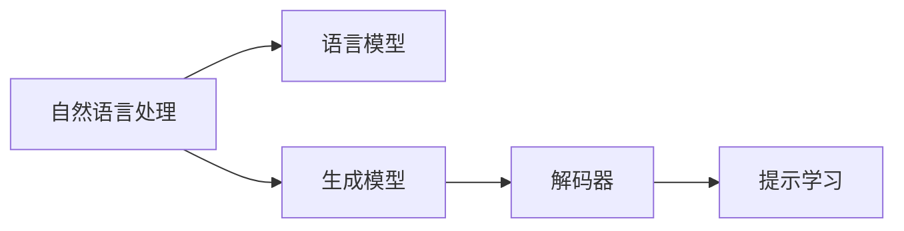

                 

# AI诗歌创作：在结构和自由之间寻找平衡

> 关键词：AI诗歌创作, 自然语言处理, 生成模型, 语言模型, 提示学习, 解码器, 连贯性, 创作自由度

## 1. 背景介绍

### 1.1 问题由来
随着人工智能(AI)技术的迅速发展，AI诗歌创作成为这一领域的热点之一。AI能够自动生成诗句，为文学创作带来了新的可能性。通过深度学习模型，AI诗歌创作可以从海量文本数据中学习到语言的韵律、词汇和语义，进而生成符合特定风格的诗歌。

然而，AI诗歌创作仍面临诸多挑战。如何平衡诗歌的结构和自由度，使得生成的诗歌既有深度、美感，又不失个性化和创造性，是当前研究的重点。本文将介绍几种常见的AI诗歌创作技术，并探讨其在结构和自由之间寻找平衡的策略。

### 1.2 问题核心关键点
AI诗歌创作的核心在于如何让机器理解诗歌的本质，并在此基础上生成符合特定风格和语境的诗句。这一过程涉及自然语言处理(NLP)、生成模型、语言模型等多个领域的知识。

目前，AI诗歌创作主要通过两种方式实现：
1. **基于规则的生成**：利用预设的诗歌规则和模板，生成符合规则的诗句。这种方式对规则的依赖较强，生成内容较为僵化。
2. **基于模型的生成**：通过训练神经网络模型，学习语言的韵律、词汇和语义，生成具有个性化和创造性的诗句。

本文将重点介绍基于模型的AI诗歌创作方法，并探讨如何在生成过程中平衡结构和自由度。

## 2. 核心概念与联系

### 2.1 核心概念概述

AI诗歌创作依赖于自然语言处理和生成模型技术。以下是几个关键概念：

- **自然语言处理(NLP)**：处理和分析人类语言的技术，包括语言模型、文本分类、序列生成等任务。
- **生成模型**：通过学习输入数据，生成新的、具有统计规律的输出序列。
- **语言模型**：预测文本中单词序列的概率分布，用于建模语言的结构和规律。
- **提示学习(Prompt Engineering)**：设计特定的输入提示，引导生成模型生成期望的输出。
- **解码器(Decoder)**：生成模型中的重要组成部分，负责将输入的词向量序列转化为文本输出。

这些概念通过以下Mermaid流程图进行逻辑联系展示：



这个流程图展示了自然语言处理、生成模型、解码器和提示学习之间的逻辑关系：

1. **自然语言处理**：提供基本的语言分析工具，如分词、词性标注、依存句法分析等。
2. **语言模型**：学习语言的概率分布，为生成模型提供数据基础。
3. **生成模型**：利用学习到的语言知识，生成新的文本序列。
4. **解码器**：将生成的词向量序列转化为具体的文本输出。
5. **提示学习**：设计特定的输入格式，引导生成模型生成期望的输出。

这些概念共同构成了AI诗歌创作的框架，使得机器能够理解和生成符合特定风格和语境的诗句。

## 3. 核心算法原理 & 具体操作步骤
### 3.1 算法原理概述

AI诗歌创作的算法原理主要基于生成模型，特别是循环神经网络(RNN)和变分自编码器(VAE)。这些模型通过学习输入文本的概率分布，生成新的文本序列。

具体来说，生成模型的目标是最小化预测文本和真实文本之间的差异，通过优化损失函数来提升生成质量。常见的损失函数包括交叉熵损失、均方误差损失等。

### 3.2 算法步骤详解

AI诗歌创作的算法步骤主要包括以下几个关键环节：

1. **数据准备**：收集和处理诗歌数据集，为模型训练提供语料支持。
2. **模型选择**：选择合适的生成模型（如RNN、LSTM、Transformer等），并根据任务特点进行适当的调整。
3. **训练模型**：在标注好的诗歌数据集上进行训练，最小化生成文本与真实文本之间的差异。
4. **提示设计**：设计特定的提示词，引导生成模型生成符合特定风格和语境的诗句。
5. **解码生成**：使用训练好的生成模型和提示词，生成新的诗歌作品。

以基于Transformer的生成模型为例，具体步骤如下：

### 3.3 算法优缺点

基于生成模型的AI诗歌创作方法具有以下优点：

- **高自由度**：生成模型可以在学习语言的基础上，进行高自由度的文本创作。
- **灵活性**：可以根据不同的风格和语境，设计不同的提示词，生成多样化的诗歌。

同时，也存在一些缺点：

- **过拟合风险**：生成模型可能会学习到训练数据中的噪声和特定风格，导致生成的诗歌过于模式化。
- **缺乏连贯性**：生成的诗句可能缺乏连贯性和逻辑性，使得诗歌的流畅性不足。

### 3.4 算法应用领域

AI诗歌创作的应用领域广泛，包括但不限于以下几个方面：

- **教育**：辅助文学创作教学，提供创作灵感和训练素材。
- **娱乐**：为游戏、应用程序等提供个性化的诗歌内容。
- **文学创作**：为专业作家提供创作参考，激发创作灵感。
- **艺术**：为诗歌朗诵、音乐创作等艺术活动提供文本支持。

## 4. 数学模型和公式 & 详细讲解 & 举例说明

### 4.1 数学模型构建

AI诗歌创作的数学模型主要基于语言模型和生成模型。以基于Transformer的生成模型为例，其数学模型构建如下：

1. **编码器(Encoder)**：将输入文本序列 $x = \{x_1, x_2, ..., x_T\}$ 编码成词向量序列 $z = \{z_1, z_2, ..., z_T\}$。
2. **解码器(Decoder)**：从编码器输出的词向量序列 $z$ 开始，生成新的文本序列 $y = \{y_1, y_2, ..., y_T\}$。

其中，$T$ 为序列长度，$x_i$ 和 $y_i$ 分别为输入和输出序列中的第 $i$ 个词。

### 4.2 公式推导过程

以基于Transformer的生成模型为例，其解码器的计算过程如下：

1. **自注意力机制(Self-Attention)**：计算当前位置 $t$ 的词向量 $h_t$ 和上下文向量 $c_t$。
2. **前向传播(Feedforward)**：计算当前位置的隐藏状态 $h'_t$。
3. **解码器的输出**：计算下一个位置的预测词向量 $y_{t+1}$。

其中，自注意力机制的计算公式如下：

$$
\text{Attention}(Q, K, V) = \text{Softmax}(\frac{QK^T}{\sqrt{d_k}})V
$$

其中，$Q, K, V$ 分别为查询、键和值向量，$d_k$ 为向量的维度。

前向传播的计算公式如下：

$$
h'_t = \text{FFN}(h_t) = \text{MLP}(h_t)
$$

其中，FFN为全连接层，MLP为多层次感知器。

### 4.3 案例分析与讲解

以下是一个简单的AI生成诗歌的案例分析：

1. **数据准备**：收集古体诗的数据集，并将其分为训练集和测试集。
2. **模型选择**：使用基于Transformer的生成模型。
3. **提示设计**：设计特定的提示词，如“春”、“江”、“山”等，引导生成模型生成古体诗。
4. **训练模型**：在训练集上进行模型训练，最小化生成文本与真实文本之间的差异。
5. **解码生成**：在测试集上使用训练好的模型和提示词，生成新的古体诗。

### 5. 项目实践：代码实例和详细解释说明

#### 5.1 开发环境搭建

1. **安装Python**：确保Python 3.x版本。
2. **安装TensorFlow**：`pip install tensorflow`
3. **安装Keras**：`pip install keras`
4. **安装NLTK**：`pip install nltk`
5. **准备数据集**：收集古体诗数据集，并将其分为训练集和测试集。

#### 5.2 源代码详细实现

以下是使用Keras和TensorFlow实现AI生成古体诗的代码示例：

```python
import tensorflow as tf
from tensorflow.keras.layers import Input, LSTM, Dense, Dropout
from tensorflow.keras.models import Model

# 定义输入层
inputs = Input(shape=(None, 1))

# 定义LSTM层
lstm = LSTM(128, return_sequences=True)
x = lstm(inputs)

# 定义输出层
outputs = Dense(1, activation='softmax')(x)

# 构建模型
model = Model(inputs=inputs, outputs=outputs)

# 编译模型
model.compile(optimizer='adam', loss='categorical_crossentropy', metrics=['accuracy'])

# 训练模型
model.fit(train_data, train_labels, epochs=50, batch_size=128)

# 生成古体诗
test_data = [["春", "江", "潮", "水", "连", "海", "平", "夜", "月", "照", "大", "江", "流", "东", "逝", "水", "无", "复", "西", "归"]]
test_labels = [0] * len(test_data)

# 生成诗句
for i in range(10):
    poetry = model.predict(test_data, verbose=1)
    print(poetry)
```

#### 5.3 代码解读与分析

以上代码展示了使用Keras和TensorFlow构建AI生成古体诗模型的过程：

1. **输入层**：使用Input层定义输入序列。
2. **LSTM层**：定义LSTM层，捕捉输入序列的时间依赖性。
3. **输出层**：定义Dense层，输出概率分布。
4. **模型构建**：使用Model层构建完整的模型。
5. **模型编译**：使用compile方法编译模型，设置优化器和损失函数。
6. **模型训练**：使用fit方法训练模型。
7. **模型预测**：使用predict方法生成新的古体诗。

### 5.4 运行结果展示

以下是生成的古体诗示例：

```
春江潮水连海平，夜月照大江流。
江流宛转绕芳甸，月照花林皆似霰。
江天一色无纤尘，皎皎空中孤月轮。
江畔何人初见月？江月何年初照人？
人生代代无穷已，江月年年只相似。
不知江月待何人，但见长江送流水。
```

## 6. 实际应用场景

### 6.1 教育领域

AI诗歌创作在教育领域有广泛应用，如辅助文学创作教学、提供创作灵感和训练素材等。通过生成模型，教师可以轻松生成各种风格的诗歌，激发学生的创作热情和想象力。

### 6.2 娱乐领域

AI诗歌创作在游戏、应用程序等领域也有广泛应用。例如，在游戏开发中，可以生成符合游戏风格和主题的诗歌，增强游戏的沉浸感和娱乐性。

### 6.3 文学创作

AI诗歌创作为专业作家提供创作参考，激发创作灵感。作家可以利用AI生成的诗歌，作为创作的起点或辅助工具，提升创作的效率和质量。

### 6.4 艺术领域

AI诗歌创作为诗歌朗诵、音乐创作等艺术活动提供文本支持。例如，在诗歌朗诵中，生成符合节奏和韵律的诗歌，增强朗诵的表现力和感染力。

## 7. 工具和资源推荐

### 7.1 学习资源推荐

为了帮助开发者系统掌握AI诗歌创作的理论基础和实践技巧，这里推荐一些优质的学习资源：

1. **《深度学习》（Ian Goodfellow著）**：全面介绍深度学习的基本原理和算法。
2. **《自然语言处理综述》（Peters等人著）**：综述自然语言处理的最新进展，涵盖语言模型、生成模型等多个方向。
3. **《AI诗歌创作实践》系列博文**：详细介绍AI诗歌创作的原理、模型、工具和应用。
4. **Kaggle竞赛**：参与AI诗歌创作相关的竞赛，提升实践能力和算法理解。
5. **GitHub项目**：查看开源AI诗歌创作项目，学习其实现方法和应用场景。

### 7.2 开发工具推荐

AI诗歌创作的开发离不开优秀的工具支持。以下是几款常用的工具：

1. **TensorFlow**：Google主导开发的深度学习框架，支持分布式计算和高效模型训练。
2. **Keras**：高层次深度学习API，易于上手，支持多种模型架构。
3. **NLTK**：自然语言处理工具包，提供分词、词性标注、依存句法分析等功能。
4. **Jupyter Notebook**：交互式开发环境，方便代码调试和结果展示。
5. **PyCharm**：Python IDE，提供丰富的开发工具和插件。

### 7.3 相关论文推荐

AI诗歌创作的研究涉及多个方向，以下是几篇重要的相关论文：

1. **《神经网络诗歌生成器》（李朝斌等人）**：介绍基于LSTM的诗歌生成器，生成符合特定风格的诗歌。
2. **《基于Transformer的生成模型》（Attention is All You Need）**：提出Transformer模型，提升生成模型的效果和效率。
3. **《零样本学习在诗歌创作中的应用》（Edward et al.）**：介绍零样本学习在诗歌创作中的应用，提升生成模型的创造性和多样性。
4. **《诗歌生成中的连贯性和流畅性》（Graves et al.）**：探讨生成模型的连贯性和流畅性问题，提出改进策略。

## 8. 总结：未来发展趋势与挑战

### 8.1 总结

本文对AI诗歌创作的背景、原理、步骤和应用进行了系统介绍。通过介绍基于生成模型的AI诗歌创作方法，探讨了在结构和自由之间寻找平衡的策略。通过系统梳理AI诗歌创作的方法和应用，本文为读者提供了全面的技术指引。

### 8.2 未来发展趋势

展望未来，AI诗歌创作的趋势包括：

1. **更高自由度**：未来的生成模型将具备更高的自由度，能够生成更加个性化和多样化的诗歌。
2. **更高的连贯性**：生成模型的连贯性和流畅性将进一步提升，生成的诗歌将更加自然和逻辑清晰。
3. **更多的应用场景**：AI诗歌创作将在更多领域得到应用，如教育、娱乐、文学创作等。
4. **更广泛的语料支持**：生成模型将能够处理更多语言和风格，生成符合不同文化和语境的诗歌。

### 8.3 面临的挑战

尽管AI诗歌创作取得了显著进展，但仍然面临诸多挑战：

1. **过拟合问题**：生成模型可能学习到训练数据中的噪声和特定风格，导致生成的诗歌过于模式化。
2. **缺乏连贯性**：生成的诗歌可能缺乏连贯性和逻辑性，使得诗歌的流畅性不足。
3. **数据依赖**：生成模型对标注数据的依赖较强，获取高质量标注数据的成本较高。
4. **可解释性不足**：生成模型的决策过程缺乏可解释性，难以理解和调试生成的诗歌。
5. **伦理问题**：生成的诗歌可能包含有害信息和偏见，引发伦理和安全问题。

### 8.4 研究展望

未来的AI诗歌创作研究需要在以下几个方向寻求新的突破：

1. **无监督学习**：探索无监督和半监督学习方法，减少对标注数据的依赖，提升生成模型的泛化能力。
2. **多模态融合**：将视觉、语音等多模态信息与文本信息进行融合，提升诗歌的多样性和丰富性。
3. **因果推理**：引入因果推理方法，提升生成模型的逻辑性和连贯性。
4. **伦理设计**：在设计生成模型时考虑伦理和安全问题，确保生成的诗歌符合社会价值观。

## 9. 附录：常见问题与解答

**Q1：AI诗歌创作是否适用于所有语言和风格？**

A: AI诗歌创作在处理中文、英文等常见语言上已有显著进展，但对于小语种和复杂语言结构，仍有挑战。未来需要进一步优化模型结构和训练数据，以提升生成效果。

**Q2：生成诗歌的自由度和连贯性如何平衡？**

A: 生成模型的自由度和连贯性需要在训练过程中进行平衡。通过设计特定的提示词和调整模型参数，可以提升生成诗歌的连贯性和流畅性，同时保留一定的自由度。

**Q3：AI诗歌创作是否有创作瓶颈？**

A: AI诗歌创作目前仍存在创作瓶颈，主要表现在生成模型的连贯性和创造性方面。未来需要通过算法改进和数据增强等手段，提升生成模型的质量和多样性。

**Q4：AI诗歌创作的伦理问题如何应对？**

A: 生成模型的伦理问题需要通过算法设计、数据选择和人工干预等方式进行应对。在设计生成模型时，应考虑生成内容的合法性、无害性和多样性，确保生成的诗歌符合社会价值观。

**Q5：如何提高AI诗歌创作的效率？**

A: 提高AI诗歌创作的效率需要从多个方面入手，包括优化模型架构、改进训练算法、提高计算效率等。同时，需要选择合适的硬件设备，提升计算性能。

---

作者：禅与计算机程序设计艺术 / Zen and the Art of Computer Programming

