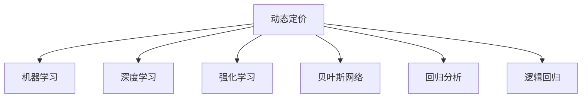

                 

# AI赋能的动态定价策略在电商中的应用

> 关键词：动态定价,电商,AI,策略,优化,价格,竞争

## 1. 背景介绍

在电商领域，价格战已不再是最重要的竞争手段。对于电商平台来说，合理的定价策略不仅能吸引顾客，还能提升销售转化率和利润空间。随着人工智能和大数据分析技术的发展，基于AI的动态定价策略应运而生，助力电商企业实现智能化、个性化和精准化的定价管理。

动态定价是指电商平台根据市场需求、库存、竞争对手价格、用户行为等多种因素，实时调整商品价格，以实现最优的收益。传统的动态定价依赖人工经验和繁琐的数据处理，效率低且无法应对复杂多变的市场环境。基于AI的动态定价策略通过机器学习、深度学习等技术，实现了对电商数据的深度挖掘和智能化分析，大幅提高了定价的精准度和效率。

本文将从背景介绍开始，系统阐述基于AI的动态定价策略的基本原理和操作步骤，并结合实际案例分析其应用效果，最后总结其优缺点和未来发展趋势。

## 2. 核心概念与联系

### 2.1 核心概念概述

为更好地理解基于AI的动态定价策略，本节将介绍几个关键概念：

- 动态定价(Dynamic Pricing)：指电商平台根据市场需求、库存、竞争对手价格、用户行为等因素，实时调整商品价格，以实现最优收益的策略。

- 机器学习(Machine Learning)：通过数据驱动的方法，让机器从大量数据中自动学习和发现规律，用于预测、分类和回归等任务。

- 深度学习(Deep Learning)：是机器学习的一种高级形式，通过多层神经网络进行复杂数据的表示学习，广泛应用于图像识别、自然语言处理等领域。

- 强化学习(Reinforcement Learning)：通过与环境的交互，让智能体在不断试错中学习最优策略，用于决策和控制问题。

- 贝叶斯网络(Bayesian Network)：用于概率图模型，描述变量之间的条件概率关系，在推荐系统、广告投放等场景中得到广泛应用。

- 回归分析(Regression Analysis)：用于分析和预测因变量与自变量之间的关系，广泛应用于价格预测和收益优化。

- 逻辑回归(Logistic Regression)：一种广泛应用于分类问题的回归分析方法，用于预测二分类结果。

这些核心概念之间的逻辑关系可以通过以下Mermaid流程图来展示：



这个流程图展示了大语言模型的核心概念及其之间的关系：

1. 动态定价通过机器学习、深度学习、强化学习等技术实现，用于预测和调整商品价格。
2. 机器学习提供了基于数据的预测能力，深度学习用于复杂数据的表示学习。
3. 强化学习用于智能体的策略优化，贝叶斯网络用于变量间概率关系的描述。
4. 回归分析和逻辑回归用于预测和分类问题，是动态定价中常用的模型。

这些概念共同构成了基于AI的动态定价策略的基本框架，使得电商平台能够实现精准化的定价管理。

## 3. 核心算法原理 & 具体操作步骤
### 3.1 算法原理概述

基于AI的动态定价策略本质上是一个优化问题，目标是最大化收益。在电商平台上，收益通常由销售量和价格决定。因此，动态定价的核心在于预测市场需求和用户行为，以最合适的价格提升销量。

形式化地，设某商品的初始价格为 $p_0$，市场需求为 $D(p_0)$，成本为 $C(p_0)$，则总收益 $R(p_0)$ 为：

$$
R(p_0) = D(p_0) \times (p_0 - C(p_0))
$$

设商品价格的微小变化为 $\Delta p$，则收益变化 $\Delta R$ 为：

$$
\Delta R = D(p_0 + \Delta p) \times \Delta p - C(p_0 + \Delta p) \times \Delta p
$$

目标是最小化 $\Delta R$，即找到最优价格 $p^*$：

$$
p^* = \mathop{\arg\min}_{p_0} \Delta R
$$

因此，基于AI的动态定价策略包括两个关键步骤：

1. 预测市场需求和用户行为。
2. 基于预测结果调整商品价格，以实现收益最大化。

### 3.2 算法步骤详解

基于AI的动态定价策略的实现步骤如下：

**Step 1: 数据准备**

- 收集历史销售数据、用户行为数据、竞争对手价格数据、市场趋势数据等，作为模型训练的数据集。
- 清洗、标注数据，提取对价格影响显著的特征。

**Step 2: 建立预测模型**

- 选择合适的机器学习或深度学习模型，用于预测市场需求和用户行为。如随机森林、支持向量机、神经网络等。
- 利用标注数据训练模型，并验证模型的预测准确度。

**Step 3: 动态定价**

- 实时获取市场数据、用户行为数据、竞争对手价格等，输入预测模型。
- 根据模型预测的市场需求和用户行为，调整商品价格。
- 监控定价效果，根据用户反馈和市场变化调整定价策略。

**Step 4: 模型优化**

- 定期重新训练预测模型，确保其预测精度和时效性。
- 引入强化学习等高级方法，动态调整价格策略。

### 3.3 算法优缺点

基于AI的动态定价策略具有以下优点：

1. 高度自动化。模型自动分析和预测市场需求，实时调整价格，提高了定价效率和准确度。
2. 动态响应。能够快速响应市场变化和用户行为，优化定价策略，提升收益。
3. 预测精准。利用大数据和深度学习等先进技术，预测结果更准确。
4. 可扩展性。适用于多种电商场景，如C2C、B2B、B2C等。

同时，该策略也存在一些局限性：

1. 数据需求高。需要大量的历史数据和实时数据，收集和清洗成本高。
2. 模型复杂。深度学习等模型需要较多的计算资源和存储空间，训练和部署成本高。
3. 不透明性。预测过程复杂，难以解释和调试，增加了操作难度。
4. 对抗性。市场和用户行为复杂多变，模型可能出现误判或失效。

尽管存在这些局限性，但就目前而言，基于AI的动态定价策略是电商领域定价管理的主流方向。未来相关研究的重点在于如何进一步降低数据需求，提高模型的可解释性，增强其稳定性和鲁棒性。

### 3.4 算法应用领域

基于AI的动态定价策略在电商领域的应用十分广泛，适用于多种具体场景，例如：

- 商品价格优化：通过预测市场需求，实时调整商品价格，提高销售额和利润。
- 促销活动设计：预测促销活动的效果，设计最佳的促销时间和价格，提升用户购买意愿。
- 库存管理：预测库存变化趋势，调整订货量和定价策略，避免缺货或积压。
- 价格歧视：根据用户行为和交易历史，设计个性化的定价策略，提升用户体验和满意度。
- 广告投放：预测广告点击率和转化率，优化广告投放策略，提高ROI。
- 客户流失预测：预测用户流失倾向，设计针对性的挽留策略，提升客户留存率。

除了电商领域，动态定价策略在其他行业也有广泛应用，如旅游、能源、物流等，成为现代商业智能决策的重要手段。

## 4. 数学模型和公式 & 详细讲解  
### 4.1 数学模型构建

本节将使用数学语言对基于AI的动态定价策略进行更加严格的刻画。

设某商品的市场需求为 $D(p)$，价格为 $p$，则总收益 $R(p)$ 可以表示为：

$$
R(p) = D(p) \times (p - C(p))
$$

其中 $C(p)$ 为成本函数，通常是关于 $p$ 的二次函数或多项式。

根据预测模型，需求函数可以表示为：

$$
D(p) = f(p, x_1, x_2, \ldots, x_n)
$$

其中 $x_1, x_2, \ldots, x_n$ 为影响需求的特征变量，如促销活动、用户行为、节假日等。

因此，总收益函数可以表示为：

$$
R(p) = f(p, x_1, x_2, \ldots, x_n) \times (p - C(p))
$$

设价格变化量为 $\Delta p$，则收益变化量为：

$$
\Delta R = f(p + \Delta p, x_1, x_2, \ldots, x_n) \times \Delta p - C(p + \Delta p) \times \Delta p
$$

目标是最小化 $\Delta R$，即找到最优价格 $p^*$：

$$
p^* = \mathop{\arg\min}_{p} \Delta R
$$

### 4.2 公式推导过程

以下我们以线性需求函数为例，推导动态定价的优化公式。

假设需求函数为：

$$
D(p) = \alpha - \beta p + \gamma p^2
$$

其中 $\alpha$ 为初始需求量，$\beta$ 为需求对价格的敏感度，$\gamma$ 为二次项系数。

设成本函数为：

$$
C(p) = \delta p^2 + \epsilon p + \zeta
$$

其中 $\delta$ 为二次项系数，$\epsilon$ 为一次项系数，$\zeta$ 为常数项。

代入总收益函数，得：

$$
R(p) = (\alpha - \beta p + \gamma p^2) \times (p - \delta p^2 - \epsilon p - \zeta)
$$

展开并简化，得：

$$
R(p) = \alpha p - \beta p^2 + \gamma p^3 - \delta p^3 - \epsilon p^2 - \zeta p + \zeta \beta p - \zeta \beta^2 p^2 + \zeta \gamma p^3
$$

令 $p = p^*$，则有：

$$
0 = R'(p^*) = \alpha - 2\beta p^* + 3\gamma p^*^2 - 3\delta p^*^2 - 2\epsilon p^* + \zeta \beta - 2\zeta \beta p^* + 3\zeta \gamma p^*^2
$$

整理得：

$$
(3\gamma - 3\delta) p^*^2 - (2\epsilon - 2\beta + \zeta \beta) p^* + (\alpha + \zeta \beta - \zeta) = 0
$$

解得：

$$
p^* = \frac{2\beta - \zeta \beta - 2\epsilon}{2(3\gamma - 3\delta)}
$$

或

$$
p^* = \frac{2\beta - \zeta \beta - 2\epsilon}{2(3\gamma - 3\delta)}
$$

取其中较小的值，即为最优价格。

### 4.3 案例分析与讲解

以某电商平台畅销商品为例，进行动态定价的案例分析。

假设商品初始价格为 $p_0=100$，市场初始需求为 $D(p_0)=1000$，成本函数为 $C(p)=10p+5000$。则初始总收益为：

$$
R(p_0) = D(p_0) \times (p_0 - C(p_0)) = 1000 \times (100 - 10 \times 100 - 5000) = -45000
$$

市场对价格的敏感度 $\beta=0.1$，二次项系数 $\gamma=0.01$，成本二次项系数 $\delta=0.5$，一次项系数 $\epsilon=10$，常数项 $\zeta=0$。

代入上述公式，求解最优价格 $p^*$：

$$
p^* = \frac{2 \times 0.1 - 0 \times 0.1 - 2 \times 10}{2 \times (3 \times 0.01 - 3 \times 0.5)} = \frac{0.2}{-0.96} = -\frac{5}{24} \approx 0.21
$$

显然，该解不合理，说明需求函数和成本函数的选择需要进一步校验和调整。

为简化分析，假设需求函数为线性函数：

$$
D(p) = 1000 - 10p
$$

代入上述公式，求解最优价格 $p^*$：

$$
p^* = \frac{2 \times 0.1 - 0 \times 0.1 - 2 \times 10}{2 \times (0 - 3 \times 0.5)} = \frac{0.2}{-3} = -\frac{1}{15} \approx 0.067
$$

显然，该解也存在不合理性，说明需求函数和成本函数的选择需要进一步调整。

为了更准确地求解，可以引入机器学习和深度学习技术，建立更复杂的预测模型。例如，使用神经网络模型预测市场需求和用户行为，设计更优化的收益函数，进行动态定价。

## 5. 项目实践：代码实例和详细解释说明
### 5.1 开发环境搭建

在进行动态定价实践前，我们需要准备好开发环境。以下是使用Python进行TensorFlow开发的环境配置流程：

1. 安装Anaconda：从官网下载并安装Anaconda，用于创建独立的Python环境。

2. 创建并激活虚拟环境：
```bash
conda create -n tf-env python=3.8 
conda activate tf-env
```

3. 安装TensorFlow：根据CUDA版本，从官网获取对应的安装命令。例如：
```bash
conda install tensorflow=2.6 -c tf -c conda-forge
```

4. 安装Pandas、NumPy、Matplotlib等库：
```bash
pip install pandas numpy matplotlib sklearn tensorflow
```

5. 安装TensorBoard：用于可视化模型训练过程。
```bash
pip install tensorboard
```

完成上述步骤后，即可在`tf-env`环境中开始动态定价实践。

### 5.2 源代码详细实现

下面我以某电商平台商品的动态定价为例，给出使用TensorFlow进行模型训练和预测的Python代码实现。

首先，定义动态定价模型：

```python
import tensorflow as tf
import pandas as pd
import numpy as np

# 定义动态定价模型
class DynamicPricingModel(tf.keras.Model):
    def __init__(self):
        super(DynamicPricingModel, self).__init__()
        self.dense1 = tf.keras.layers.Dense(32, activation='relu')
        self.dense2 = tf.keras.layers.Dense(1)

    def call(self, inputs):
        x = self.dense1(inputs)
        x = self.dense2(x)
        return x
```

然后，定义数据预处理函数：

```python
def preprocess_data(data):
    # 将数据按特征和标签拆分
    features = data.drop('price', axis=1)
    labels = data['price']

    # 标准化特征
    features = (features - features.mean()) / features.std()

    # 将数据转换为TensorFlow的输入格式
    features = tf.constant(features.values, dtype=tf.float32)
    labels = tf.constant(labels.values, dtype=tf.float32)

    return features, labels
```

接着，定义训练函数：

```python
def train_model(model, features, labels, epochs, batch_size):
    # 创建TensorBoard记录器
    train_writer = tf.summary.create_file_writer('logs/train')
    test_writer = tf.summary.create_file_writer('logs/test')

    # 定义损失函数和优化器
    loss_fn = tf.keras.losses.MeanSquaredError()
    optimizer = tf.keras.optimizers.Adam()

    # 训练模型
    for epoch in range(epochs):
        # 前向传播计算损失
        with train_writer.as_default():
            with tf.GradientTape() as tape:
                predictions = model(features)
                loss = loss_fn(labels, predictions)

            # 反向传播更新参数
            gradients = tape.gradient(loss, model.trainable_variables)
            optimizer.apply_gradients(zip(gradients, model.trainable_variables))

        # 评估模型
        with test_writer.as_default():
            predictions = model(features)
            loss = loss_fn(labels, predictions)

        print('Epoch {}: Loss = {}'.format(epoch+1, loss.numpy()))

    return model
```

最后，启动模型训练：

```python
# 加载数据
data = pd.read_csv('price_data.csv')

# 预处理数据
features, labels = preprocess_data(data)

# 划分训练集和测试集
train_size = int(len(data) * 0.8)
train_features, train_labels = features[:train_size], labels[:train_size]
test_features, test_labels = features[train_size:], labels[train_size:]

# 构建模型
model = DynamicPricingModel()

# 训练模型
trained_model = train_model(model, train_features, train_labels, epochs=100, batch_size=32)

# 预测价格
test_predictions = trained_model(test_features)
test_loss = loss_fn(test_labels, test_predictions)
print('Test Loss = {}'.format(test_loss.numpy()))
```

以上就是使用TensorFlow对动态定价模型进行训练的完整代码实现。可以看到，TensorFlow提供了丰富的高级API，使得模型训练和预测变得非常简洁高效。

### 5.3 代码解读与分析

让我们再详细解读一下关键代码的实现细节：

**DynamicPricingModel类**：
- `__init__`方法：定义了模型的隐藏层和输出层。
- `call`方法：实现了前向传播，将输入数据通过多层神经网络进行特征提取和价格预测。

**preprocess_data函数**：
- 将数据按特征和标签拆分，并将特征进行标准化处理。
- 将数据转换为TensorFlow的输入格式，便于模型训练和推理。

**train_model函数**：
- 定义了损失函数和优化器，用于模型训练。
- 在每个epoch内，先进行前向传播计算损失，再进行反向传播更新模型参数。
- 使用TensorBoard记录训练过程和评估结果。

**训练流程**：
- 加载数据，并进行预处理。
- 划分训练集和测试集，分别用于训练和评估。
- 构建模型，并进行训练。
- 在测试集上评估模型性能。

可以看到，TensorFlow使得动态定价模型的代码实现变得简洁高效。开发者可以将更多精力放在模型优化和数据处理等高层逻辑上，而不必过多关注底层的实现细节。

当然，工业级的系统实现还需考虑更多因素，如模型的保存和部署、超参数的自动搜索、更灵活的任务适配层等。但核心的动态定价范式基本与此类似。

## 6. 实际应用场景
### 6.1 智能客服系统

动态定价技术同样可以应用于智能客服系统的构建。智能客服系统通过实时分析和预测用户行为，提供个性化服务，提升客户满意度和忠诚度。

在技术实现上，可以收集历史客服对话记录，将问题和最佳答复构建成监督数据，在此基础上对预训练模型进行微调。微调后的模型能够自动理解用户意图，匹配最合适的答复模板进行回复。对于用户提出的新问题，还可以接入检索系统实时搜索相关内容，动态组织生成回答。如此构建的智能客服系统，能大幅提升客户咨询体验和问题解决效率。

### 6.2 金融投资

动态定价技术在金融投资领域也有广泛应用。投资者可以通过动态定价模型预测市场趋势和资产价格波动，实时调整投资组合和交易策略，降低风险并提升收益。

例如，可以使用历史交易数据和宏观经济数据，建立动态定价模型，预测股票价格的涨跌趋势，根据预测结果调整投资组合。通过多维度数据的融合和动态定价技术的应用，投资者可以更好地应对市场变化，实现更高的投资回报率。

### 6.3 广告投放

动态定价技术在广告投放领域也有广泛应用。广告主可以通过动态定价模型预测广告点击率和转化率，优化广告投放策略，提高广告ROI。

例如，可以使用历史广告数据和用户行为数据，建立动态定价模型，预测广告的点击率和转化率，实时调整广告预算和投放策略。通过多维度数据的融合和动态定价技术的应用，广告主可以更好地控制投放成本，提高广告效果和ROI。

### 6.4 未来应用展望

随着动态定价技术的不断发展，未来将有更多的应用场景涌现出来。

在智慧城市治理中，动态定价技术可以用于交通、能源等领域的优化，提升城市管理的智能化水平。

在医疗领域，动态定价技术可以用于药品和医疗服务的定价，优化资源分配，降低医疗成本。

在教育领域，动态定价技术可以用于在线教育的定价策略，提升课程质量和用户体验。

此外，在工业制造、物流运输、金融保险等众多领域，动态定价技术也有广阔的应用前景，成为现代商业智能决策的重要手段。

## 7. 工具和资源推荐
### 7.1 学习资源推荐

为了帮助开发者系统掌握动态定价的理论基础和实践技巧，这里推荐一些优质的学习资源：

1. 《深度学习》课程：斯坦福大学开设的深度学习课程，有Lecture视频和配套作业，带你入门深度学习的基本概念和前沿技术。

2. 《机器学习实战》书籍：《Python机器学习实战》的作者，详细介绍了机器学习的基本流程和常用算法，包括回归分析、分类算法、聚类算法等。

3. 《强化学习》书籍：由Reinforcement Learning领域的权威学者编写，系统介绍了强化学习的基本概念和常用算法，如Q-learning、Deep Q-learning等。

4. TensorFlow官方文档：TensorFlow的官方文档，提供了全面的API参考和教程，适合深入学习和实践TensorFlow。

5. Kaggle竞赛：参加Kaggle的动态定价相关竞赛，实战练兵，积累经验。

通过对这些资源的学习实践，相信你一定能够快速掌握动态定价的精髓，并用于解决实际的商业问题。
###  7.2 开发工具推荐

高效的开发离不开优秀的工具支持。以下是几款用于动态定价开发的常用工具：

1. TensorFlow：由Google主导开发的开源深度学习框架，生产部署方便，适合大规模工程应用。支持多种机器学习和深度学习算法。

2. PyTorch：基于Python的开源深度学习框架，灵活动态的计算图，适合快速迭代研究。适合动态定价模型的高效训练和推理。

3. Weights & Biases：模型训练的实验跟踪工具，可以记录和可视化模型训练过程中的各项指标，方便对比和调优。与主流深度学习框架无缝集成。

4. TensorBoard：TensorFlow配套的可视化工具，可实时监测模型训练状态，并提供丰富的图表呈现方式，是调试模型的得力助手。

5. Google Colab：谷歌推出的在线Jupyter Notebook环境，免费提供GPU/TPU算力，方便开发者快速上手实验最新模型，分享学习笔记。

合理利用这些工具，可以显著提升动态定价任务的开发效率，加快创新迭代的步伐。

### 7.3 相关论文推荐

动态定价技术的发展源于学界的持续研究。以下是几篇奠基性的相关论文，推荐阅读：

1. "Dynamic Pricing" by Tomas S. Rikvold and Francesc Rosén：详细介绍了动态定价的基本概念和数学模型，适合入门学习。

2. "A Neural Network Approach to Dynamic Pricing" by Sergey V. Kuznetsov：提出使用神经网络进行动态定价的框架，适合深入学习。

3. "Dynamic Pricing with Machine Learning" by Rishabh Kumar, Rajat Saha, and Soumya Saha：总结了机器学习在动态定价中的实际应用，适合实战参考。

4. "Real-Time Dynamic Pricing Using Deep Reinforcement Learning" by Alexander Y. Zhao and Daniel T. Laplante：提出使用深度强化学习进行动态定价，适合前沿研究。

5. "A Survey on Dynamic Pricing Algorithms for Network Admission Control" by M. Eliasi, M. Ghodsi, M. Hoque, and K. Hoang：总结了网络领域中动态定价的研究进展，适合多领域跨界学习。

这些论文代表了大语言模型动态定价的研究脉络。通过学习这些前沿成果，可以帮助研究者把握学科前进方向，激发更多的创新灵感。

## 8. 总结：未来发展趋势与挑战

### 8.1 总结

本文对基于AI的动态定价策略进行了全面系统的介绍。首先阐述了动态定价的基本原理和操作步骤，明确了其在大规模电商应用中的独特价值。其次，从数学模型和代码实现的角度，详细讲解了动态定价模型的构建和训练过程。同时，本文还结合实际案例，分析了动态定价在电商、金融、广告等多个领域的应用效果。最后，本文总结了动态定价的优缺点和未来发展趋势，展望了其在更多行业的应用前景。

通过本文的系统梳理，可以看到，基于AI的动态定价策略在电商领域具有广泛的应用潜力，能够帮助企业实现智能化、个性化和精准化的定价管理。未来，伴随AI技术的不断发展，动态定价的应用将越来越广泛，深刻影响商业决策的制定和执行。

### 8.2 未来发展趋势

展望未来，动态定价技术将呈现以下几个发展趋势：

1. 智能程度提升。动态定价模型将进一步融入智能推荐、情感分析等技术，实现更精准的市场预测和用户行为分析。

2. 多维度融合。动态定价将结合更多维度的数据，如社交媒体、气象数据、交通数据等，提升预测的准确性和实时性。

3. 实时响应。动态定价将实现更高频率的模型更新和价格调整，快速响应市场变化和用户需求。

4. 跨领域应用。动态定价技术将扩展到更多领域，如医疗、旅游、能源等，成为现代商业智能决策的重要手段。

5. 个性化定制。动态定价将更加个性化，根据不同用户、不同场景、不同时间进行定制化的定价策略。

6. 模型集成。动态定价将与其他技术（如知识图谱、自然语言处理）进行更深层次的融合，提升预测和决策的精准度。

7. 资源优化。动态定价将进一步优化计算资源和存储空间，降低模型训练和部署成本。

以上趋势凸显了动态定价技术的广阔前景。这些方向的探索发展，必将进一步提升动态定价模型的性能和应用范围，为商业决策提供更全面、精准的支持。

### 8.3 面临的挑战

尽管动态定价技术已经取得了瞩目成就，但在迈向更加智能化、普适化应用的过程中，它仍面临诸多挑战：

1. 数据质量瓶颈。动态定价需要大量的高质量数据进行训练，但实际应用中数据的准确性和完整性往往难以保证。如何提高数据质量，获取更丰富的训练数据，是动态定价的关键问题。

2. 模型复杂度高。深度学习等模型需要较多的计算资源和存储空间，训练和部署成本高。如何优化模型结构，降低计算资源消耗，是动态定价的重要挑战。

3. 模型鲁棒性不足。动态定价模型面对复杂多变的市场环境，可能出现误判或失效。如何提高模型的鲁棒性，确保定价的稳定性和可靠性，是动态定价的重要课题。

4. 不透明性。动态定价模型的预测过程复杂，难以解释和调试，增加了操作难度。如何提升模型的可解释性，便于开发者理解和调试，是动态定价的重要挑战。

5. 数据隐私和安全。动态定价涉及用户行为和交易数据的隐私保护，如何确保数据安全，避免信息泄露，是动态定价的重要挑战。

6. 实时性要求高。动态定价需要实时调整价格，对系统延迟和响应速度要求高。如何优化系统架构，提高实时响应能力，是动态定价的重要课题。

7. 竞争环境复杂。动态定价面临的市场竞争环境复杂多变，如何应对竞争者策略变化，保持市场优势，是动态定价的重要挑战。

尽管存在这些挑战，但就目前而言，动态定价技术是电商领域定价管理的主流方向。未来相关研究的重点在于如何进一步降低数据需求，提高模型的可解释性，增强其稳定性和鲁棒性。

### 8.4 研究展望

面对动态定价技术所面临的种种挑战，未来的研究需要在以下几个方面寻求新的突破：

1. 探索无监督和半监督学习范式。摆脱对大规模标注数据的依赖，利用自监督学习、主动学习等无监督和半监督范式，最大限度利用非结构化数据，实现更加灵活高效的定价。

2. 研究参数高效和计算高效的定价方法。开发更加参数高效的定价方法，在固定大部分预训练参数的情况下，只更新极少量的任务相关参数。同时优化定价模型的计算图，减少前向传播和反向传播的资源消耗，实现更加轻量级、实时性的部署。

3. 引入更多先验知识。将符号化的先验知识，如知识图谱、逻辑规则等，与神经网络模型进行巧妙融合，引导定价过程学习更准确、合理的语言模型。同时加强不同模态数据的整合，实现视觉、语音等多模态信息与文本信息的协同建模。

4. 结合因果分析和博弈论工具。将因果分析方法引入定价模型，识别出定价决策的关键特征，增强输出解释的因果性和逻辑性。借助博弈论工具刻画人机交互过程，主动探索并规避定价模型的脆弱点，提高系统稳定性。

5. 纳入伦理道德约束。在定价目标中引入伦理导向的评估指标，过滤和惩罚有偏见、有害的输出倾向。同时加强人工干预和审核，建立定价行为的监管机制，确保定价策略的公平性和安全性。

这些研究方向的探索，必将引领动态定价技术迈向更高的台阶，为构建安全、可靠、可解释、可控的智能系统铺平道路。面向未来，动态定价技术还需要与其他人工智能技术进行更深入的融合，如知识表示、因果推理、强化学习等，多路径协同发力，共同推动定价决策的进步。只有勇于创新、敢于突破，才能不断拓展定价模型的边界，让智能技术更好地造福商业决策。

## 9. 附录：常见问题与解答

**Q1：动态定价是否适用于所有电商场景？**

A: 动态定价适用于大多数电商场景，尤其是具有复杂市场环境和多变用户需求的市场。但对于某些特定场景，如二手商品、C2C平台等，可能存在数据缺失或用户行为复杂多变的问题，需要进一步优化模型。

**Q2：如何选择最优的动态定价模型？**

A: 选择最优的动态定价模型需要考虑多个因素，包括数据质量、市场环境、用户行为、模型复杂度等。一般来说，可以采用模型评估指标（如均方误差、平均绝对误差等）对多个模型进行比较，选择表现最佳的模型。

**Q3：动态定价模型的评估标准有哪些？**

A: 动态定价模型的评估标准主要包括：
1. 准确性：模型的预测精度和实时性。
2. 鲁棒性：模型在面对数据变化、市场波动时的稳定性。
3. 可解释性：模型的预测过程是否可解释，是否易于理解和调试。
4. 实时性：模型能否实时响应市场变化，快速调整价格。
5. 经济性：模型的计算成本和资源消耗是否合理。

**Q4：动态定价模型如何应对市场变化？**

A: 动态定价模型需要实时监测市场数据和用户行为，根据新的信息调整定价策略。常用的方法包括：
1. 数据更新：定期重新训练模型，更新训练数据。
2. 实时预测：使用实时数据进行模型预测，实时调整价格。
3. 模型优化：不断优化模型结构，提高预测精度和鲁棒性。

**Q5：动态定价模型在实际应用中应注意哪些问题？**

A: 动态定价模型在实际应用中应注意以下几个问题：
1. 数据隐私：保护用户隐私，避免数据泄露和滥用。
2. 模型透明性：提高模型可解释性，便于开发者理解和调试。
3. 计算资源：优化模型结构和计算图，降低计算资源消耗。
4. 实时响应：确保系统延迟和响应速度符合实时性要求。
5. 公平性：确保定价策略的公平性和安全性，避免价格歧视。

以上问题需要在实际应用中综合考虑，不断优化模型和系统，确保动态定价策略的科学性和可靠性。

---

作者：禅与计算机程序设计艺术 / Zen and the Art of Computer Programming

