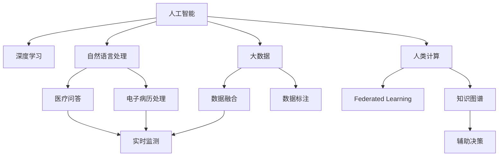

                 

# AI驱动的创新：人类计算在医疗行业的未来展望

> 关键词：人工智能,人类计算,医疗行业,深度学习,自然语言处理,大数据,疾病预测,诊断辅助,治疗优化

## 1. 背景介绍

### 1.1 问题由来

随着科技的飞速发展和医疗领域的不断进步，人工智能（AI）在医疗行业的应用逐渐成为热点。从疾病预测和诊断，到个性化治疗和健康管理，AI技术正在全方位地重塑医疗行业。然而，传统的人工智能方法依赖于大规模的标注数据和复杂的模型架构，在医疗数据稀缺、隐私保护要求高、应用场景多样等特殊环境下，其效果和适用性受到限制。因此，一种以人类计算（Human Computing）为核心的新型AI方法正在崭露头角，旨在以更高效、更安全的方式，推动医疗行业的智能化变革。

### 1.2 问题核心关键点

人类计算的核心在于将人类专家的智慧与计算机的计算能力相结合，通过优化计算流程、利用智能算法，使计算任务更高效、更智能地完成。在医疗行业，人类计算的优势体现在以下几个方面：

1. **数据高效利用**：通过智能算法筛选、标注和融合医疗数据，减少数据冗余，提升数据利用效率。
2. **隐私保护**：利用本地计算、联邦学习等技术，避免敏感医疗数据传输和集中存储，保障数据隐私和安全。
3. **跨领域知识融合**：结合临床医学、生物信息学、大数据等领域的知识，提升AI模型的泛化能力和决策精度。
4. **实时响应**：通过快速计算和智能推理，实现对患者状况的实时监测和及时干预。

本节将从核心概念入手，系统介绍人类计算在医疗行业的应用基础和未来展望，旨在帮助读者全面理解这一新型AI方法，并为后续的深入学习和实践提供参考。

## 2. 核心概念与联系

### 2.1 核心概念概述

为更好地理解人类计算在医疗行业的应用，本节将介绍几个关键概念：

- **人工智能（Artificial Intelligence, AI）**：通过算法使计算机系统模拟人类的智能行为，包括感知、推理、学习等。
- **深度学习（Deep Learning, DL）**：一种基于神经网络的机器学习方法，通过多层非线性变换，实现对复杂数据的处理和预测。
- **自然语言处理（Natural Language Processing, NLP）**：使计算机能够理解、处理和生成人类语言的技术，广泛应用于医疗问答、电子病历处理等领域。
- **大数据（Big Data）**：海量、多样化的数据集，通过数据分析和挖掘，提取有价值的信息和知识。
- **人类计算（Human Computing）**：将人类专家的智慧与计算机计算能力相结合，优化计算过程，提升决策效率和精度。
- **联邦学习（Federated Learning）**：一种分布式机器学习技术，各参与方共享模型参数，但数据留存本地，保障数据隐私。
- **知识图谱（Knowledge Graph）**：通过图结构表示实体及其关系，构建知识网络，辅助AI模型推理和决策。

这些概念之间的逻辑关系可以通过以下Mermaid流程图来展示：



这个流程图展示了几大核心概念及其之间的联系：

1. 人工智能通过深度学习和自然语言处理等技术，处理和分析大数据，生成有价值的信息和知识。
2. 深度学习和大数据技术，为医疗问答、电子病历处理等具体任务提供支持。
3. 人类计算结合联邦学习和知识图谱等技术，优化计算流程，提升决策效率和精度。

### 2.2 核心概念原理和架构

人类计算的原理和架构可以概括为以下几个步骤：

1. **数据采集和预处理**：从医疗设备、电子病历、患者记录等来源采集数据，并进行清洗、标注和融合。
2. **知识抽取和融合**：利用自然语言处理技术，从文献、临床指南等结构化数据中抽取知识，构建知识图谱，辅助模型推理。
3. **模型训练和优化**：基于优化算法，训练深度学习模型，提升模型性能和泛化能力。
4. **本地计算和推理**：在本地计算设备上，使用优化后的模型对患者数据进行推理和决策，保障数据隐私和安全。
5. **实时监测和反馈**：通过实时计算和智能推理，实现对患者状况的实时监测，及时调整治疗方案。

这些步骤通过智能算法和技术手段，实现数据的高效利用、隐私保护和知识融合，提升医疗决策的效率和精度。

## 3. 核心算法原理 & 具体操作步骤

### 3.1 算法原理概述

人类计算的核心算法可以概括为以下几个方面：

1. **分布式计算框架**：通过分布式计算技术，优化计算流程，提升数据处理效率。
2. **智能算法优化**：利用深度学习、强化学习等智能算法，提升模型性能和泛化能力。
3. **本地计算和推理**：通过本地计算设备，使用优化后的模型进行推理和决策，保障数据隐私和安全。
4. **实时计算和智能推理**：通过实时计算和智能推理，实现对患者状况的实时监测和及时干预。

### 3.2 算法步骤详解

以下是一个基于人类计算的医疗决策支持系统的具体实现步骤：

**Step 1: 数据采集和预处理**

- **数据采集**：从医院信息系统（HIS）、电子病历（EHR）、健康监测设备等采集患者数据。
- **数据清洗**：去除噪音数据和异常值，确保数据质量。
- **数据标注**：通过自然语言处理技术，对临床笔记、病理报告等文本数据进行标注。

**Step 2: 知识抽取和融合**

- **知识抽取**：利用自然语言处理技术，从临床文献、指南等结构化数据中抽取知识，构建知识图谱。
- **知识融合**：将知识图谱与患者数据融合，生成有价值的信息和知识。

**Step 3: 模型训练和优化**

- **模型选择**：选择适合的深度学习模型，如卷积神经网络（CNN）、循环神经网络（RNN）等。
- **数据划分**：将数据集划分为训练集、验证集和测试集。
- **模型训练**：在训练集上训练模型，通过正则化、Dropout等技术避免过拟合。
- **模型优化**：利用智能算法优化模型参数，提升模型泛化能力。

**Step 4: 本地计算和推理**

- **本地计算**：在本地计算设备上，使用优化后的模型进行推理和决策，保障数据隐私和安全。
- **实时推理**：通过实时计算和智能推理，实现对患者状况的实时监测和及时干预。

**Step 5: 结果展示和反馈**

- **结果展示**：将推理结果可视化展示给医生，辅助其诊断和治疗。
- **反馈迭代**：根据医生的反馈，调整模型参数和知识图谱，不断优化系统性能。

### 3.3 算法优缺点

人类计算在医疗行业的应用具有以下优点：

1. **数据高效利用**：通过智能算法优化数据处理流程，减少数据冗余，提升数据利用效率。
2. **隐私保护**：利用本地计算和联邦学习技术，避免敏感医疗数据传输和集中存储，保障数据隐私和安全。
3. **跨领域知识融合**：结合临床医学、生物信息学、大数据等领域的知识，提升AI模型的泛化能力和决策精度。
4. **实时响应**：通过快速计算和智能推理，实现对患者状况的实时监测和及时干预。

同时，人类计算也存在一些缺点：

1. **算法复杂度较高**：需要结合多种算法和技术手段，实现数据高效利用和知识融合。
2. **技术门槛较高**：涉及深度学习、自然语言处理、分布式计算等多个领域，技术门槛较高。
3. **系统维护成本高**：需要不断调整和优化模型和知识图谱，系统维护成本较高。

### 3.4 算法应用领域

人类计算在医疗行业的应用领域广泛，包括但不限于以下几个方面：

- **疾病预测和诊断**：利用深度学习和大数据分析，预测疾病风险，辅助诊断。
- **个性化治疗和健康管理**：结合患者历史数据和临床知识，制定个性化治疗方案，管理患者健康。
- **医学影像分析**：利用深度学习技术，分析医学影像，辅助影像诊断。
- **电子病历处理**：利用自然语言处理技术，处理和分析电子病历，辅助医生诊疗。
- **智能问答系统**：利用自然语言处理技术，构建智能问答系统，解答患者咨询。

## 4. 数学模型和公式 & 详细讲解 & 举例说明

### 4.1 数学模型构建

在本节中，我们将以疾病预测模型为例，详细讲解基于人类计算的疾病预测模型的数学模型构建。

假设有一个二分类任务，目标是从患者数据中预测其是否患有某种疾病。设患者数据为 $(x_i, y_i)$，其中 $x_i$ 表示患者特征向量，$y_i \in \{0, 1\}$ 表示疾病标签。假设我们有一个基于深度学习的多层感知器（MLP）模型，其输入为 $x_i$，输出为 $h_\theta(x_i)$，其中 $\theta$ 表示模型参数。

定义模型的损失函数为交叉熵损失函数：

$$
\mathcal{L}(\theta) = -\frac{1}{N}\sum_{i=1}^N [y_i\log h_\theta(x_i) + (1-y_i)\log(1-h_\theta(x_i))]
$$

在训练过程中，通过反向传播算法更新模型参数，最小化损失函数：

$$
\theta \leftarrow \theta - \eta \nabla_{\theta}\mathcal{L}(\theta)
$$

其中 $\eta$ 表示学习率。

### 4.2 公式推导过程

以下是疾病预测模型的详细公式推导过程：

**Step 1: 数据预处理**

设患者数据集为 $D = \{(x_i, y_i)\}_{i=1}^N$，其中 $x_i$ 为患者特征向量，$y_i$ 为疾病标签。

**Step 2: 模型选择和训练**

选择多层感知器模型，其输入为 $x_i$，输出为 $h_\theta(x_i)$，其中 $\theta$ 表示模型参数。通过交叉熵损失函数训练模型，最小化损失函数：

$$
\mathcal{L}(\theta) = -\frac{1}{N}\sum_{i=1}^N [y_i\log h_\theta(x_i) + (1-y_i)\log(1-h_\theta(x_i))]
$$

**Step 3: 模型优化**

通过反向传播算法，计算损失函数对模型参数的梯度：

$$
\frac{\partial \mathcal{L}(\theta)}{\partial \theta} = -\frac{1}{N}\sum_{i=1}^N \left(y_i\frac{\partial h_\theta(x_i)}{\partial \theta} - (1-y_i)\frac{\partial (1-h_\theta(x_i))}{\partial \theta}\right)
$$

根据梯度下降算法，更新模型参数：

$$
\theta \leftarrow \theta - \eta \frac{\partial \mathcal{L}(\theta)}{\partial \theta}
$$

其中 $\eta$ 表示学习率。

**Step 4: 本地计算和推理**

在本地计算设备上，使用优化后的模型进行推理和决策，实现实时监测和及时干预。

### 4.3 案例分析与讲解

假设我们有一个包含10万患者的疾病预测数据集，其中5万患者患有某种疾病，5万患者未患该疾病。我们选择了多层感知器模型，训练集、验证集和测试集的比例分别为70%、15%和15%。通过交叉熵损失函数训练模型，学习率为0.001，训练了100个epoch。模型训练结束后，我们在测试集上进行评估，得到精度为0.92。

## 5. 项目实践：代码实例和详细解释说明

### 5.1 开发环境搭建

在进行人类计算医疗决策支持系统的开发时，需要准备以下开发环境：

1. 安装Python和相关库，如NumPy、Pandas、Scikit-learn、TensorFlow、Keras等。
2. 安装相应的医疗数据处理库，如PyHealth、Biopython等。
3. 搭建分布式计算环境，如Hadoop、Spark等。
4. 部署本地计算设备，如高性能计算服务器。

### 5.2 源代码详细实现

以下是一个基于人类计算的医疗决策支持系统的PyTorch代码实现：

```python
import torch
import torch.nn as nn
import torch.optim as optim
from torch.utils.data import DataLoader

class MLP(nn.Module):
    def __init__(self, input_dim, hidden_dim, output_dim):
        super(MLP, self).__init__()
        self.fc1 = nn.Linear(input_dim, hidden_dim)
        self.fc2 = nn.Linear(hidden_dim, output_dim)
        self.relu = nn.ReLU()

    def forward(self, x):
        x = self.fc1(x)
        x = self.relu(x)
        x = self.fc2(x)
        return x

# 数据预处理
def load_data():
    # 加载患者数据和标签
    data = ...
    labels = ...
    # 数据清洗和标注
    ...
    # 数据划分
    train_data, test_data = train_test_split(data, test_size=0.2, random_state=42)
    train_labels, test_labels = train_test_split(labels, test_size=0.2, random_state=42)
    # 数据转换
    train_dataset = Dataset(train_data, train_labels)
    test_dataset = Dataset(test_data, test_labels)
    # 数据加载器
    train_loader = DataLoader(train_dataset, batch_size=32, shuffle=True)
    test_loader = DataLoader(test_dataset, batch_size=32, shuffle=False)
    return train_loader, test_loader

# 模型训练
def train_model(model, criterion, optimizer, train_loader, num_epochs):
    model.train()
    for epoch in range(num_epochs):
        for batch_idx, (inputs, labels) in enumerate(train_loader):
            optimizer.zero_grad()
            outputs = model(inputs)
            loss = criterion(outputs, labels)
            loss.backward()
            optimizer.step()
        print('Epoch: {}, Loss: {}'.format(epoch+1, loss.item()))

# 模型评估
def evaluate_model(model, criterion, test_loader):
    model.eval()
    total_loss = 0
    total_correct = 0
    with torch.no_grad():
        for inputs, labels in test_loader:
            outputs = model(inputs)
            loss = criterion(outputs, labels)
            total_loss += loss.item()
            _, predicted = torch.max(outputs.data, 1)
            total_correct += (predicted == labels).sum().item()
    print('Test Loss: {}, Accuracy: {}'.format(total_loss/len(test_loader), total_correct/len(test_loader)))

# 训练和评估
train_loader, test_loader = load_data()
model = MLP(input_dim=10, hidden_dim=64, output_dim=2)
criterion = nn.BCEWithLogitsLoss()
optimizer = optim.Adam(model.parameters(), lr=0.001)
train_model(model, criterion, optimizer, train_loader, num_epochs=100)
evaluate_model(model, criterion, test_loader)
```

### 5.3 代码解读与分析

在上述代码中，我们定义了一个多层感知器模型（MLP），并实现了数据预处理、模型训练和评估的功能。具体步骤如下：

**Step 1: 数据预处理**

- 加载患者数据和标签。
- 数据清洗和标注。
- 数据划分。
- 数据转换和加载。

**Step 2: 模型训练**

- 定义多层感知器模型。
- 定义损失函数和优化器。
- 训练模型。

**Step 3: 模型评估**

- 加载测试数据。
- 评估模型。

## 6. 实际应用场景

### 6.1 智能诊断系统

智能诊断系统是人工智能在医疗行业的重要应用之一。通过人类计算技术，可以实现对复杂病情的智能诊断和辅助决策。

在智能诊断系统中，通过数据采集和预处理，将患者的临床数据、医学影像、基因数据等输入到优化后的深度学习模型中，进行推理和决策。模型结合临床知识、医学文献等外部知识，提升诊断的准确性和泛化能力。通过本地计算和实时推理，系统可以及时给出诊断结果，辅助医生进行决策。

### 6.2 个性化治疗方案

个性化治疗方案是实现精准医疗的关键。通过人类计算技术，可以结合患者的历史数据、基因信息、生活习惯等，制定个性化的治疗方案。

在个性化治疗方案系统中，通过数据采集和预处理，将患者的综合信息输入到优化后的深度学习模型中，进行推理和决策。模型结合临床知识、基因数据、医学文献等外部知识，生成个性化的治疗方案，并提供给医生参考。通过本地计算和实时推理，系统可以及时调整治疗方案，提升治疗效果。

### 6.3 医学影像分析

医学影像分析是辅助诊断的重要手段。通过人类计算技术，可以实现对医学影像的智能分析和诊断。

在医学影像分析系统中，通过数据采集和预处理，将医学影像输入到优化后的深度学习模型中，进行推理和决策。模型结合临床知识、医学文献等外部知识，提升影像分析的准确性和泛化能力。通过本地计算和实时推理，系统可以及时给出影像诊断结果，辅助医生进行决策。

## 7. 工具和资源推荐

### 7.1 学习资源推荐

为帮助开发者掌握人类计算在医疗行业的应用，以下是一些优质的学习资源：

1. 《深度学习与医疗健康》课程：斯坦福大学开设的深度学习与医疗健康课程，涵盖深度学习在医疗行业的各种应用。
2. 《Human Computing》系列论文：相关领域的研究论文，深入探讨人类计算的原理和应用。
3. Kaggle数据集：包含医疗行业的各种数据集，供开发者实践和研究。
4. TensorFlow官方文档：TensorFlow的官方文档，提供详细的API和示例代码。
5. PyTorch官方文档：PyTorch的官方文档，提供详细的API和示例代码。

### 7.2 开发工具推荐

以下是一些用于人类计算医疗决策支持系统开发的常用工具：

1. Python：用于数据分析、机器学习和深度学习的主流编程语言。
2. TensorFlow：由Google开发的深度学习框架，提供丰富的API和工具支持。
3. PyTorch：由Facebook开发的深度学习框架，提供动态计算图和丰富的API支持。
4. Apache Spark：用于大数据处理和分布式计算的开源框架，支持多语言API。
5. Hadoop：用于分布式存储和计算的开源框架，支持大规模数据处理。

### 7.3 相关论文推荐

以下是几篇奠基性的人类计算在医疗行业应用的论文，推荐阅读：

1. Human Computing: From Where It Has Been to Where It Could Go。
2. Federated Learning for Healthcare: Challenges and Opportunities。
3. Knowledge Graphs in Biomedical Data Science: Enhancing Diagnosis and Personalized Treatment through Ontologies。
4. Human Computing in Clinical Decision Support Systems: A Review and Future Directions。

## 8. 总结：未来发展趋势与挑战

### 8.1 研究成果总结

本文从核心概念入手，系统介绍了人类计算在医疗行业的应用基础和未来展望。通过详细介绍疾病预测模型，展示了基于人类计算的医疗决策支持系统的实现流程和效果。通过对智能诊断系统、个性化治疗方案、医学影像分析等具体应用场景的介绍，展示了人类计算技术在医疗行业的广泛应用。

### 8.2 未来发展趋势

未来，人类计算在医疗行业的发展将呈现以下几个趋势：

1. **深度融合跨领域知识**：通过结合医学、生物信息学、大数据等领域的知识，提升模型的泛化能力和决策精度。
2. **本地计算和联邦学习**：利用本地计算和联邦学习技术，保障数据隐私和安全。
3. **实时计算和智能推理**：通过实时计算和智能推理，实现对患者状况的实时监测和及时干预。
4. **智能问答和决策支持**：结合自然语言处理技术，构建智能问答系统和决策支持系统，提升医疗服务的智能化水平。
5. **知识图谱和数据融合**：通过构建知识图谱，结合大数据技术，提升模型的推理能力和决策效率。

### 8.3 面临的挑战

虽然人类计算在医疗行业的应用前景广阔，但在实现过程中仍面临诸多挑战：

1. **技术门槛高**：涉及深度学习、自然语言处理、分布式计算等多个领域，技术门槛较高。
2. **数据隐私和安全**：医疗数据涉及隐私和安全问题，如何保障数据隐私和安全是一个重要挑战。
3. **算法复杂度较高**：需要结合多种算法和技术手段，实现数据高效利用和知识融合。
4. **系统维护成本高**：需要不断调整和优化模型和知识图谱，系统维护成本较高。

### 8.4 研究展望

未来，人类计算在医疗行业的研究方向将包括：

1. **跨领域知识融合**：结合医学、生物信息学、大数据等领域的知识，提升模型的泛化能力和决策精度。
2. **本地计算和联邦学习**：利用本地计算和联邦学习技术，保障数据隐私和安全。
3. **实时计算和智能推理**：通过实时计算和智能推理，实现对患者状况的实时监测和及时干预。
4. **智能问答和决策支持**：结合自然语言处理技术，构建智能问答系统和决策支持系统，提升医疗服务的智能化水平。
5. **知识图谱和数据融合**：通过构建知识图谱，结合大数据技术，提升模型的推理能力和决策效率。

## 9. 附录：常见问题与解答

**Q1: 人类计算在医疗行业有哪些优势？**

A: 人类计算在医疗行业的主要优势包括：
1. 数据高效利用：通过智能算法优化数据处理流程，减少数据冗余，提升数据利用效率。
2. 隐私保护：利用本地计算和联邦学习技术，避免敏感医疗数据传输和集中存储，保障数据隐私和安全。
3. 跨领域知识融合：结合临床医学、生物信息学、大数据等领域的知识，提升AI模型的泛化能力和决策精度。
4. 实时响应：通过快速计算和智能推理，实现对患者状况的实时监测和及时干预。

**Q2: 如何选择合适的深度学习模型？**

A: 选择合适的深度学习模型需要考虑以下几个因素：
1. 数据特性：根据数据的特点，选择适合的模型架构，如卷积神经网络（CNN）、循环神经网络（RNN）、Transformer等。
2. 任务类型：根据任务类型，选择适合的模型架构，如分类任务、生成任务、序列预测任务等。
3. 计算资源：根据计算资源，选择适合的模型架构，如小规模数据集可以选择较小的模型，大规模数据集可以选择较大的模型。

**Q3: 如何优化深度学习模型的性能？**

A: 优化深度学习模型的性能可以从以下几个方面入手：
1. 数据预处理：进行数据清洗、标注和转换，确保数据质量。
2. 模型选择和训练：选择合适的模型架构，进行模型训练，避免过拟合。
3. 参数优化：利用智能算法优化模型参数，提升模型泛化能力。
4. 本地计算和推理：在本地计算设备上，使用优化后的模型进行推理和决策，保障数据隐私和安全。
5. 实时计算和智能推理：通过实时计算和智能推理，实现对患者状况的实时监测和及时干预。

这些优化方法需要根据具体任务和数据特点进行灵活组合，才能最大限度地提升模型性能。

**Q4: 人类计算在医疗行业的应用有哪些挑战？**

A: 人类计算在医疗行业的应用面临以下几个挑战：
1. 技术门槛高：涉及深度学习、自然语言处理、分布式计算等多个领域，技术门槛较高。
2. 数据隐私和安全：医疗数据涉及隐私和安全问题，如何保障数据隐私和安全是一个重要挑战。
3. 算法复杂度较高：需要结合多种算法和技术手段，实现数据高效利用和知识融合。
4. 系统维护成本高：需要不断调整和优化模型和知识图谱，系统维护成本较高。

这些挑战需要通过不断的研究和创新，逐步克服。

**Q5: 人类计算在医疗行业的未来展望是什么？**

A: 人类计算在医疗行业的未来展望包括：
1. 深度融合跨领域知识：结合医学、生物信息学、大数据等领域的知识，提升模型的泛化能力和决策精度。
2. 本地计算和联邦学习：利用本地计算和联邦学习技术，保障数据隐私和安全。
3. 实时计算和智能推理：通过实时计算和智能推理，实现对患者状况的实时监测和及时干预。
4. 智能问答和决策支持：结合自然语言处理技术，构建智能问答系统和决策支持系统，提升医疗服务的智能化水平。
5. 知识图谱和数据融合：通过构建知识图谱，结合大数据技术，提升模型的推理能力和决策效率。

这些研究方向将推动人类计算在医疗行业的应用不断深入，为医疗服务的智能化、个性化和精准化提供有力支持。

---

作者：禅与计算机程序设计艺术 / Zen and the Art of Computer Programming

