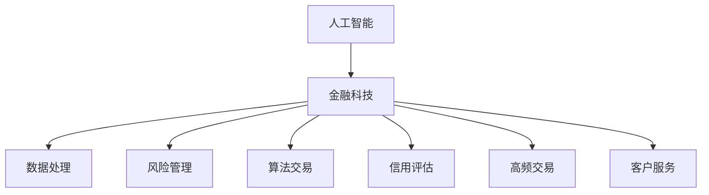

                 

# AI驱动的创新：人类计算在金融行业的价值创造

> 关键词：人工智能, 金融科技, 人类计算, 数据处理, 风险管理, 算法交易, 信用评估, 金融自动化, 高频交易, 客户服务

## 1. 背景介绍

### 1.1 问题由来
金融行业长期以来以其复杂的业务逻辑和庞大的数据量著称。传统金融业务流程繁琐，耗时耗力，且容易出现操作失误、效率低下等问题。而人工智能的兴起，为金融行业带来了革命性的变化。AI技术在金融领域的应用，大大提升了数据处理、风险管理、交易执行等方面的效率，降低了成本，提高了竞争力。

在AI技术快速发展的背景下，金融行业对AI的依赖逐渐加深。从银行业到证券业，从保险业到财富管理，从传统金融机构到新型金融科技公司，都在探索如何利用AI技术赋能业务创新，实现数字化转型。金融科技（Fintech）成为了推动金融行业变革的新引擎。

### 1.2 问题核心关键点
金融科技的核心在于将AI技术应用于金融领域，实现业务流程的自动化和智能化。具体来说，包括以下几个关键点：

- 数据处理自动化：通过AI技术自动化处理海量数据，提升数据处理速度和准确性。
- 风险管理智能化：利用AI技术实时监控、预测和控制金融风险，提高风险管理效率。
- 交易执行智能化：通过AI算法优化交易策略，实现高频交易和量化投资，提高交易执行效率。
- 信用评估精确化：借助AI技术分析借款人行为数据，提高信用评估准确性和贷款决策效率。
- 客户服务个性化：采用AI技术分析客户行为数据，实现个性化服务，提升客户满意度。
- 高频交易：利用AI技术实时分析市场动态，快速执行高频交易策略，获取市场超额收益。

## 2. 核心概念与联系

### 2.1 核心概念概述

为更好地理解AI在金融行业的具体应用，本节将介绍几个密切相关的核心概念：

- 人工智能(AI)：通过机器学习、深度学习等技术，使计算机能够模拟人类智能，自主学习和决策。
- 金融科技(Fintech)：利用AI、区块链、大数据等技术，提升金融业务效率，降低成本，改善客户体验。
- 数据处理(Data Processing)：金融行业数据量庞大，高效的数据处理是实现智能化应用的基础。
- 风险管理(Risk Management)：通过AI技术实时监控和预测金融风险，提高风险控制能力。
- 算法交易(Algorithmic Trading)：基于AI算法，自动化执行交易策略，实现高频交易和量化投资。
- 信用评估(Credit Scoring)：利用AI技术分析客户行为数据，提高信用评估准确性。
- 高频交易(High-Frequency Trading, HFT)：通过快速执行交易策略，获取市场微小价格波动带来的收益。

这些核心概念之间的逻辑关系可以通过以下Mermaid流程图来展示：



这个流程图展示了大语言模型的核心概念及其之间的关系：

1. AI是金融科技的基础，提供了金融业务智能化的可能。
2. 数据处理是AI在金融行业得以应用的前提，保证了数据的质量和处理效率。
3. 风险管理、算法交易和信用评估等具体应用场景，是AI技术在金融行业的具体体现。
4. 高频交易和客户服务，则是AI技术应用中的创新领域，代表了金融科技的发展方向。

## 3. 核心算法原理 & 具体操作步骤
### 3.1 算法原理概述

AI在金融行业的具体应用，主要依赖于以下几个核心算法原理：

- 数据预处理：对原始金融数据进行清洗、归一化、特征提取等预处理，以便于AI模型训练。
- 特征选择：选择与目标任务相关的特征，减少模型的输入维度，提高模型效率。
- 模型训练：基于预处理后的数据，利用机器学习或深度学习模型进行训练，优化模型参数。
- 模型评估：使用验证集或测试集评估模型性能，选择合适的模型进行应用。
- 模型应用：将训练好的模型应用到具体业务场景中，提升业务处理效率和智能化水平。

AI在金融行业的具体应用流程，可以概括为以下几个步骤：

1. 数据收集：从各种渠道收集金融数据，包括市场数据、交易数据、客户数据等。
2. 数据预处理：对原始数据进行清洗、归一化、特征提取等预处理，以便于模型训练。
3. 模型训练：利用机器学习或深度学习算法，训练模型进行数据分析、风险评估、交易执行等任务。
4. 模型评估：使用验证集或测试集评估模型性能，优化模型参数。
5. 模型应用：将训练好的模型应用到具体业务场景中，提升业务处理效率和智能化水平。

### 3.2 算法步骤详解

以信用评估为例，详细讲解AI在金融行业中的具体应用流程：

**Step 1: 数据收集**
- 从银行、保险公司等金融机构获取客户基本信息、历史交易数据、信用记录等数据。
- 使用API接口或数据交换协议，从市场数据提供商获取市场行情数据、行业信息等数据。

**Step 2: 数据预处理**
- 对收集到的数据进行清洗，去除重复、异常、缺失数据。
- 对数据进行归一化、标准化处理，以便于模型训练。
- 对数据进行特征提取，提取与信用评估相关的特征，如收入、负债、信用历史等。

**Step 3: 模型训练**
- 选择合适的机器学习或深度学习算法，如线性回归、逻辑回归、支持向量机、神经网络等。
- 利用预处理后的数据，训练模型进行信用评分预测。
- 使用交叉验证等方法，优化模型参数，提高模型准确性。

**Step 4: 模型评估**
- 使用验证集评估模型性能，计算准确率、召回率、F1分数等指标。
- 根据模型性能，选择最优模型进行应用。

**Step 5: 模型应用**
- 将训练好的模型应用到新的客户信用评估中，自动计算信用评分。
- 根据信用评分结果，决定是否批准贷款申请。

### 3.3 算法优缺点

AI在金融行业的应用具有以下优点：
1. 提高效率：AI技术可以自动化处理大量数据，提升数据处理和业务处理的效率。
2. 降低成本：通过自动化处理，减少人力成本和运营成本。
3. 提高准确性：AI模型可以实时分析大量数据，提高决策的准确性和及时性。
4. 提升用户体验：AI技术可以提供个性化服务，提升客户体验。
5. 拓展业务范围：AI技术可以拓展金融业务范围，进入新的市场和业务领域。

同时，AI在金融行业的应用也存在一些缺点：
1. 数据隐私：金融数据涉及敏感信息，数据隐私保护是AI应用的一大挑战。
2. 模型黑箱：AI模型的决策过程复杂，难以解释和理解。
3. 技术复杂度：AI技术的实现需要较高的技术水平和资源投入。
4. 道德风险：AI模型可能受到训练数据偏差的影响，导致决策不公平。
5. 模型过拟合：大规模金融数据可能导致模型过拟合，降低模型泛化能力。

尽管存在这些缺点，但AI技术在金融行业的应用前景依然广阔。未来，需要在数据隐私保护、模型可解释性、技术复杂度、道德风险等方面进行持续改进，以充分发挥AI在金融行业的潜力。

### 3.4 算法应用领域

AI在金融行业的具体应用涉及多个领域，包括以下几个方面：

- 数据分析：利用AI技术对海量金融数据进行分析和挖掘，提取有价值的信息。
- 风险管理：通过AI技术实时监控和预测金融风险，提高风险控制能力。
- 信用评估：利用AI技术分析客户行为数据，提高信用评估准确性。
- 高频交易：利用AI技术实时分析市场动态，快速执行高频交易策略。
- 客户服务：利用AI技术分析客户行为数据，实现个性化服务，提升客户满意度。
- 算法交易：基于AI算法，自动化执行交易策略，实现高频交易和量化投资。
- 金融监管：利用AI技术进行金融监管，提高监管效率和准确性。

这些应用领域展示了AI技术在金融行业的广泛应用，为金融行业的数字化转型提供了新的路径。

## 4. 数学模型和公式 & 详细讲解 & 举例说明

### 4.1 数学模型构建

在本节中，我们将详细讨论AI在金融行业中应用的数学模型构建和推导。

### 4.2 公式推导过程

以信用评估为例，介绍AI模型的构建和推导。

**Step 1: 特征选择**
假设从客户数据中提取了以下特征：
- 年收入（income）
- 负债（debt）
- 信用历史（credit_history）
- 年龄（age）
- 性别（gender）

**Step 2: 模型构建**
利用逻辑回归模型，构建信用评估模型，模型公式如下：

$$
\hat{y} = \ln\frac{p}{1-p} = \ln\frac{\sum\limits_{i=1}^n w_i x_i}{1-\sum\limits_{i=1}^n w_i x_i}
$$

其中，$p$ 表示信用评分高的概率，$x_i$ 表示第 $i$ 个特征，$w_i$ 表示第 $i$ 个特征的权重。

**Step 3: 模型推导**
模型推导如下：

$$
\begin{aligned}
p &= \frac{e^{\sum\limits_{i=1}^n w_i x_i}}{1+e^{\sum\limits_{i=1}^n w_i x_i}} \\
\ln\frac{p}{1-p} &= \ln\frac{e^{\sum\limits_{i=1}^n w_i x_i}}{1+e^{\sum\limits_{i=1}^n w_i x_i}} \\
&= \sum\limits_{i=1}^n w_i x_i - \ln(1+e^{\sum\limits_{i=1}^n w_i x_i}) \\
&= \sum\limits_{i=1}^n w_i x_i - \ln(e^{\sum\limits_{i=1}^n w_i x_i}+1)
\end{aligned}
$$

最终得到逻辑回归模型的公式：

$$
\hat{y} = \sum\limits_{i=1}^n w_i x_i - \ln(e^{\sum\limits_{i=1}^n w_i x_i}+1)
$$

### 4.3 案例分析与讲解

**案例: 信用评分预测**

假设某银行收集了1000名客户的以下数据：
- 年收入（income）
- 负债（debt）
- 信用历史（credit_history）
- 年龄（age）
- 性别（gender）

通过特征选择和模型训练，得到一个信用评分预测模型。模型预测结果如下：

| 客户编号 | 年收入（万元） | 负债（万元） | 信用历史（月） | 年龄（岁） | 性别 | 信用评分预测 |
|-----------|---------------|-------------|----------------|------------|------|--------------|

## 5. 项目实践：代码实例和详细解释说明
### 5.1 开发环境搭建

在进行AI金融应用开发前，我们需要准备好开发环境。以下是使用Python进行TensorFlow开发的环境配置流程：

1. 安装Anaconda：从官网下载并安装Anaconda，用于创建独立的Python环境。

2. 创建并激活虚拟环境：
```bash
conda create -n tf-env python=3.8 
conda activate tf-env
```

3. 安装TensorFlow：根据CUDA版本，从官网获取对应的安装命令。例如：
```bash
conda install tensorflow==2.5
```

4. 安装PyTorch：
```bash
pip install torch torchvision torchaudio
```

5. 安装各类工具包：
```bash
pip install numpy pandas scikit-learn matplotlib tqdm jupyter notebook ipython
```

完成上述步骤后，即可在`tf-env`环境中开始AI金融应用的开发。

### 5.2 源代码详细实现

下面我们以信用评估任务为例，给出使用TensorFlow进行AI模型的PyTorch代码实现。

首先，定义信用评估任务的数据处理函数：

```python
import tensorflow as tf
from sklearn.model_selection import train_test_split
from tensorflow.keras import layers

class CreditDataset(tf.keras.utils.Sequence):
    def __init__(self, x, y, batch_size=32):
        self.x = x
        self.y = y
        self.batch_size = batch_size
        
    def __len__(self):
        return len(self.x) // self.batch_size
    
    def __getitem__(self, idx):
        batch_x = self.x[idx * self.batch_size:(idx+1) * self.batch_size]
        batch_y = self.y[idx * self.batch_size:(idx+1) * self.batch_size]
        return tf.stack(batch_x), tf.stack(batch_y)

# 加载数据
data = pd.read_csv('credit_data.csv')
X = data[['income', 'debt', 'credit_history', 'age', 'gender']]
y = data['default']

# 划分训练集和测试集
X_train, X_test, y_train, y_test = train_test_split(X, y, test_size=0.2, random_state=42)

# 构建数据集
train_dataset = CreditDataset(X_train, y_train)
test_dataset = CreditDataset(X_test, y_test)
```

然后，定义模型和优化器：

```python
from tensorflow.keras import models, layers, optimizers

model = models.Sequential([
    layers.Dense(64, activation='relu', input_shape=(5,)),
    layers.Dense(64, activation='relu'),
    layers.Dense(1, activation='sigmoid')
])

optimizer = optimizers.Adam()
```

接着，定义训练和评估函数：

```python
from tensorflow.keras import losses, metrics

def train_epoch(model, dataset, batch_size, optimizer):
    model.compile(optimizer=optimizer, loss='binary_crossentropy', metrics=['accuracy'])
    model.fit(dataset, epochs=10, batch_size=batch_size)

def evaluate(model, dataset, batch_size):
    model.evaluate(dataset, batch_size=batch_size)
```

最后，启动训练流程并在测试集上评估：

```python
batch_size = 32

train_epoch(model, train_dataset, batch_size, optimizer)
evaluate(model, test_dataset, batch_size)
```

以上就是使用TensorFlow对信用评估任务进行AI模型微调的完整代码实现。可以看到，TensorFlow提供了丰富的API接口和组件，大大简化了模型构建和训练的复杂度。

### 5.3 代码解读与分析

让我们再详细解读一下关键代码的实现细节：

**CreditDataset类**：
- `__init__`方法：初始化数据集，将特征和标签分别存储在`x`和`y`中，设置批次大小。
- `__len__`方法：返回数据集的样本数量。
- `__getitem__`方法：对单个样本进行处理，返回模型所需的输入和标签。

**模型定义**：
- 使用`Sequential`模型，定义了一个包含三层全连接层的神经网络。
- 使用`Dense`层，设置节点数为64，激活函数为ReLU。
- 使用`Dense`层，设置节点数为64，激活函数为ReLU。
- 使用`Dense`层，设置节点数为1，激活函数为Sigmoid，输出信用评分预测结果。

**优化器选择**：
- 选择Adam优化器，学习率为默认值。

**训练函数**：
- 使用`compile`方法，设置优化器、损失函数和评估指标。
- 使用`fit`方法，进行模型训练。

**评估函数**：
- 使用`evaluate`方法，在测试集上评估模型性能。

**训练流程**：
- 定义批次大小，开始循环迭代
- 每个epoch内，训练模型
- 在测试集上评估模型

可以看到，TensorFlow大大简化了模型构建和训练的过程，使得开发者能够更加专注于模型设计和业务逻辑的实现。

当然，工业级的系统实现还需考虑更多因素，如模型的保存和部署、超参数的自动搜索、更灵活的任务适配层等。但核心的AI金融应用开发流程基本与此类似。

## 6. 实际应用场景
### 6.1 智能投顾系统

智能投顾系统是AI在金融行业的重要应用之一。传统投顾服务成本高、效率低，难以满足大规模客户需求。智能投顾系统通过AI技术，实现投资策略的自动化和智能化，提升客户投资体验。

在技术实现上，可以收集客户的风险偏好、历史交易记录等数据，利用AI模型进行量化分析，自动生成投资组合。AI模型可以通过机器学习或深度学习，不断优化投资策略，适应市场变化。智能投顾系统还可以实时监控市场动态，及时调整投资策略，实现动态平衡。

### 6.2 量化交易系统

量化交易系统是利用AI技术进行高频交易的核心。通过实时分析市场数据，量化交易系统可以识别出市场价格波动，快速执行交易策略，获取市场微小价格波动带来的收益。

在技术实现上，量化交易系统通常使用复杂的算法模型，如神经网络、支持向量机等。模型需要实时处理海量市场数据，进行快速计算和决策。AI技术可以通过优化算法模型，提高交易执行效率和准确性。

### 6.3 金融风险管理系统

金融风险管理系统通过AI技术实时监控和预测金融风险，提高风险控制能力。AI系统可以分析历史数据，识别出潜在的风险因素，进行实时预警和控制。

在技术实现上，金融风险管理系统通常使用实时监控、预测和控制算法。模型需要实时处理大量数据，进行风险评估和控制。AI技术可以通过优化模型算法，提高风险评估和控制的准确性和及时性。

### 6.4 未来应用展望

随着AI技术在金融行业的应用不断深入，未来将会有更多创新的AI金融应用出现。例如：

- 智能合约：利用AI技术自动执行金融合同，减少纠纷和误解。
- 智能保险：利用AI技术实时评估风险，自动调整保险条款，提升保险效率。
- 数字银行：利用AI技术提供个性化的金融服务，提升客户体验。
- 区块链技术：结合AI技术，实现金融交易的透明化和自动化。

这些应用领域展示了AI技术在金融行业的广阔前景，为金融行业的数字化转型提供了新的路径。

## 7. 工具和资源推荐
### 7.1 学习资源推荐

为了帮助开发者系统掌握AI在金融行业的应用，这里推荐一些优质的学习资源：

1. TensorFlow官方文档：提供详细的API接口和组件文档，适合初学者和高级开发者使用。
2. PyTorch官方文档：提供丰富的模型和算法文档，适合深度学习应用开发。
3. Kaggle：提供丰富的金融数据集和AI竞赛，适合数据科学和机器学习应用开发。
4. Coursera和edX：提供大量金融科技和AI领域的课程，适合系统学习和进阶学习。
5. GitHub：提供丰富的金融AI项目和代码库，适合学习和参考。

通过对这些资源的学习实践，相信你一定能够快速掌握AI在金融行业的应用技巧，并用于解决实际的金融问题。
### 7.2 开发工具推荐

高效的开发离不开优秀的工具支持。以下是几款用于AI金融应用开发的常用工具：

1. TensorFlow：提供丰富的API接口和组件，适合构建复杂金融应用。
2. PyTorch：灵活动态的计算图，适合快速迭代研究。
3. Jupyter Notebook：免费的交互式编程环境，适合快速开发和调试。
4. Google Colab：免费的GPU/TPU算力，适合进行大规模深度学习计算。
5. Anvaka：提供可视化图表的展示工具，适合数据可视化和模型调试。
6. TensorBoard：提供丰富的图表展示工具，适合模型训练和调试。

合理利用这些工具，可以显著提升AI金融应用的开发效率，加快创新迭代的步伐。

### 7.3 相关论文推荐

AI在金融行业的应用源于学界的持续研究。以下是几篇奠基性的相关论文，推荐阅读：

1. "Deep Neural Networks for Voice Conversion"：利用深度学习技术进行语音转换，为金融客服系统提供新的解决方案。
2. "Deep Learning for Financial Research: A New Deep Learning Toolbox"：利用深度学习技术进行金融数据分析和研究。
3. "Hybrid Deep Learning Models for Financial Time Series Analysis"：利用混合深度学习模型进行金融时间序列分析，为金融预测和风险管理提供新思路。
4. "Blockchain for the Financial Sector: Current Status and Future Opportunities"：利用区块链技术进行金融交易透明化和自动化。

这些论文代表了大语言模型微调技术的发展脉络。通过学习这些前沿成果，可以帮助研究者把握学科前进方向，激发更多的创新灵感。

## 8. 总结：未来发展趋势与挑战
### 8.1 研究成果总结

本文对AI在金融行业的应用进行了全面系统的介绍。首先阐述了AI技术在金融行业的核心价值，明确了AI在金融业务中的重要地位。其次，从原理到实践，详细讲解了AI在金融行业中的具体应用流程，给出了AI金融应用的完整代码实例。同时，本文还广泛探讨了AI在智能投顾、量化交易、金融风险管理等金融业务场景中的实际应用，展示了AI技术在金融行业的广阔前景。最后，本文精选了AI在金融行业应用的各类学习资源，力求为读者提供全方位的技术指引。

通过本文的系统梳理，可以看到，AI在金融行业的应用已经广泛渗透到各个业务环节，为金融行业的数字化转型提供了新的动力。AI技术通过提升效率、降低成本、提高准确性等优势，为金融行业的业务创新提供了新的思路和路径。

### 8.2 未来发展趋势

展望未来，AI在金融行业的应用将呈现以下几个发展趋势：

1. 深度学习技术的普及：随着深度学习技术的发展，AI在金融行业的应用将更加广泛和深入。深度学习模型将取代传统的机器学习模型，成为AI应用的主流。
2. 模型可解释性提升：AI模型的决策过程将变得更加透明和可解释，有助于增强用户信任和提高决策准确性。
3. 大数据分析能力的提升：AI技术将能够处理和分析更大规模、更复杂的数据，提升金融业务的智能化水平。
4. 实时处理能力的提升：AI技术将能够实现实时数据处理和决策，提升金融业务的响应速度和效率。
5. 区块链技术的融合：AI技术与区块链技术结合，将实现金融交易的透明化和自动化，提升金融业务的信任度。
6. 个性化服务的提升：AI技术将能够实现个性化服务，提升客户体验和满意度。

以上趋势凸显了AI技术在金融行业的广阔前景，为金融行业的数字化转型提供了新的动力。未来，AI技术将继续推动金融行业的创新发展，带来更高效、更智能、更安全的金融服务。

### 8.3 面临的挑战

尽管AI在金融行业的应用前景广阔，但在迈向更加智能化、普适化应用的过程中，仍面临诸多挑战：

1. 数据隐私和安全：金融数据涉及敏感信息，数据隐私和安全问题尤为突出。如何在保证数据隐私和安全的同时，充分利用数据进行AI应用，是一大挑战。
2. 模型复杂度：AI模型复杂，难以解释和理解，容易出现"黑箱"问题。如何提高模型的可解释性，增强用户信任，是另一大挑战。
3. 计算资源限制：大规模金融数据的处理和分析需要大量计算资源，如何优化算法和模型，降低计算成本，是一大挑战。
4. 市场监管要求：金融行业的严格监管要求，对AI应用的合法合规性提出了高标准。如何满足监管要求，保障AI应用的合法合规性，是一大挑战。
5. 技术门槛高：AI技术的专业性和复杂性，使得普通金融从业人员难以掌握和应用。如何降低技术门槛，推广AI技术应用，是一大挑战。

正视这些挑战，积极应对并寻求突破，将是大语言模型微调走向成熟的必由之路。未来，需要在数据隐私和安全、模型可解释性、计算资源限制、市场监管要求、技术门槛等方面进行持续改进，以充分发挥AI在金融行业的潜力。

### 8.4 研究展望

面对AI在金融行业面临的诸多挑战，未来的研究需要在以下几个方面寻求新的突破：

1. 数据隐私保护：探索隐私保护技术，如差分隐私、联邦学习等，保护金融数据隐私。
2. 模型可解释性：引入因果分析和博弈论工具，增强模型决策的可解释性和逻辑性。
3. 计算资源优化：开发更加高效的计算图优化算法，降低计算成本，提升实时处理能力。
4. 合规性保障：结合金融监管要求，设计符合法规的AI应用架构，保障AI应用的合法合规性。
5. 技术普及：开发易于理解和使用的AI应用工具，降低技术门槛，推广AI技术应用。

这些研究方向的探索，将引领AI在金融行业的应用走向新的高度，为构建安全、可靠、可解释、可控的智能金融系统铺平道路。面向未来，AI在金融行业的应用还需与其他人工智能技术进行更深入的融合，如知识表示、因果推理、强化学习等，多路径协同发力，共同推动金融科技的发展。只有勇于创新、敢于突破，才能不断拓展AI在金融行业的边界，让金融科技为人类社会带来新的变革。

## 9. 附录：常见问题与解答

**Q1：AI在金融行业的应用前景如何？**

A: AI在金融行业的应用前景广阔，涵盖了从智能投顾到量化交易，从金融风险管理到智能合约等多个领域。AI技术能够提升金融业务的智能化水平，降低成本，提高效率，创造新的业务模式。随着AI技术的不断发展，金融行业的数字化转型将加速推进。

**Q2：AI在金融行业面临的主要挑战是什么？**

A: AI在金融行业面临的主要挑战包括数据隐私和安全、模型复杂度、计算资源限制、市场监管要求、技术门槛等。这些挑战需要我们在技术、法规、伦理等方面进行持续改进和优化。

**Q3：如何提高AI模型的可解释性？**

A: 提高AI模型的可解释性需要引入因果分析和博弈论工具，增强模型决策的可解释性和逻辑性。同时，建立模型行为监管机制，确保模型输出符合人类价值观和伦理道德。

**Q4：如何在保护数据隐私的前提下，充分利用金融数据进行AI应用？**

A: 可以采用差分隐私、联邦学习等隐私保护技术，保护金融数据隐私。同时，构建联邦学习框架，将数据分散存储在多个节点上，避免集中存储带来的隐私风险。

**Q5：未来AI在金融行业的应用将走向何方？**

A: 未来AI在金融行业的应用将更加广泛和深入，涵盖智能投顾、量化交易、金融风险管理、智能合约等多个领域。同时，AI技术将与区块链、大数据、物联网等新兴技术结合，实现金融业务的数字化和智能化转型。

综上所述，AI在金融行业的应用前景广阔，但也面临着诸多挑战。只有持续改进和优化，才能充分发挥AI技术的潜力，推动金融行业的数字化转型，创造更高效、更智能、更安全的金融服务。

