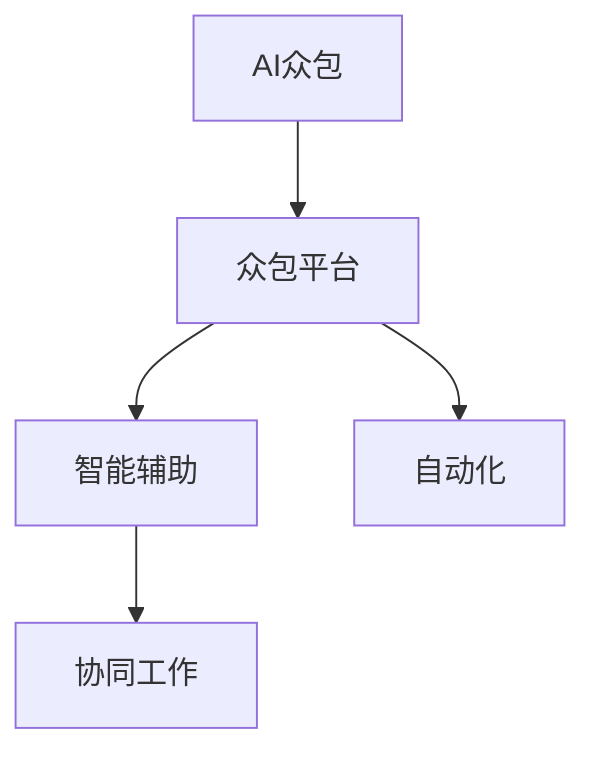

                 

# AI驱动的创新：利用众包的力量

> 关键词：AI众包, 人工智能, 人工智能众包, 众包, 创新, 智能辅助, 自动化, 协同工作

## 1. 背景介绍

### 1.1 问题由来
在过去的几十年里，人工智能(AI)技术取得了长足的发展，已经从早期的专家系统、决策支持系统逐步演进到深度学习、机器学习、自然语言处理等领域。随着技术水平的不断提高，AI开始被广泛应用于各个行业，例如自动驾驶、医疗诊断、金融分析、教育等领域。

然而，尽管AI技术的进步令人瞩目，但仍然面临着诸多挑战。例如，数据收集和标注的高成本、模型训练的复杂性、算力的高要求等。这些问题不仅限制了AI技术的应用范围，也成为了进一步发展的瓶颈。

在这样的背景下，众包（Crowdsourcing）作为一种新兴的协作模式，开始被引入到AI领域。通过众包，AI系统可以借助人类的智慧和力量，以较低的成本、较快的速度和较高的精度完成各种任务。众包与AI技术的结合，为创新和应用提供了新的思路和可能性。

### 1.2 问题核心关键点
AI众包的核心在于利用众包平台聚集大量人类劳动力的智慧，通过众包任务的形式，将复杂繁琐的AI任务分解为可执行的子任务，交由众包工人进行处理。这一过程中，AI系统负责提供算法和工具，并对众包工人的处理结果进行筛选和优化，最终得到高质量的输出结果。

AI众包的应用范围非常广泛，包括但不限于以下几个方面：
- 数据收集与标注：利用众包平台，快速高效地收集和标注大量数据，减少AI模型训练和优化时的数据瓶颈。
- 模型验证与优化：通过众包方式进行模型验证和优化，收集众包工人的反馈，调整和改进AI模型。
- 用户交互与体验优化：借助众包平台，收集用户对AI系统的反馈，改进用户体验和系统功能。

AI众包不仅能够大幅降低AI应用的成本，还能加速创新进程，提升AI系统的准确性和可用性。

### 1.3 问题研究意义
AI众包的研究和应用，对于拓展AI技术的应用范围，提升AI系统的性能和用户体验，具有重要意义：

1. 降低应用开发成本。AI众包能够有效降低数据收集和标注的成本，提高数据质量和多样性，减少AI模型的训练和优化时间，缩短从研发到落地的周期。
2. 提升模型性能。通过众包方式进行模型验证和优化，可以更有效地利用大量数据和智慧，提高AI模型的泛化能力和准确性。
3. 加速创新进程。AI众包能够快速集成来自全球不同地区和领域的智慧，促进跨学科、跨文化的协同创新。
4. 改善用户体验。通过众包方式进行用户交互和反馈收集，能够及时优化AI系统功能和用户体验，提高AI系统的可用性和满意度。
5. 拓展应用场景。AI众包能够将AI技术应用于更多垂直领域，为各行各业带来创新和变革。

## 2. 核心概念与联系

### 2.1 核心概念概述

为更好地理解AI众包的原理和应用，本节将介绍几个密切相关的核心概念：

- **AI众包**：利用众包平台，将复杂的AI任务分解为可执行的子任务，通过众包工人进行处理，并结合AI算法进行优化和筛选。
- **众包平台**：提供任务发布、任务分配、任务完成、结果审核等功能的在线协作平台。例如Amazon Mechanical Turk、CrowdFlower等。
- **智能辅助**：AI系统在众包平台中发挥作用，通过提供算法和工具，指导众包工人的操作，筛选和优化处理结果。
- **自动化**：利用AI算法，实现部分任务的自动化处理，提高效率和精度。
- **协同工作**：AI系统和众包工人之间的协作，共同完成复杂任务。

这些核心概念之间的逻辑关系可以通过以下Mermaid流程图来展示：



这个流程图展示了大语言模型的核心概念及其之间的关系：

1. AI众包通过众包平台进行任务发布和分配。
2. 在众包平台上，AI系统和众包工人共同协作，完成任务。
3. 智能辅助和自动化技术提高了众包任务的执行效率和精度。
4. 协同工作使AI系统和众包工人能够相互配合，优化最终结果。

## 3. 核心算法原理 & 具体操作步骤
### 3.1 算法原理概述

AI众包的原理是基于任务分解和智能辅助的协作机制。其核心思想是：将复杂的AI任务分解为可执行的子任务，通过众包平台分配给众包工人进行处理，再通过AI算法进行智能辅助和优化筛选，最终得到高质量的输出结果。

形式化地，假设AI任务为 $T$，需要处理的数据为 $D$，通过众包平台分配的子任务为 $\{t_i\}_{i=1}^N$，每个子任务的处理结果为 $r_i$。AI众包的优化目标是最小化任务完成的总成本，同时保证输出结果的质量。具体数学表示如下：

$$
\mathop{\arg\min}_{r_1,...,r_N} \left(\sum_{i=1}^N c_i + \lambda \sum_{i=1}^N \epsilon_i \right)
$$

其中 $c_i$ 为子任务 $t_i$ 的处理成本，$\epsilon_i$ 为处理结果 $r_i$ 与真实结果之间的误差，$\lambda$ 为误差惩罚系数。

通过求解上述优化问题，可以找到最优的众包任务分配方案，使得总成本最小，同时处理结果质量最优。

### 3.2 算法步骤详解

AI众包的具体操作步骤可以分为以下几个阶段：

**Step 1: 任务分解**
- 将AI任务 $T$ 分解为若干可执行的子任务 $\{t_i\}_{i=1}^N$，每个子任务需要明确的处理步骤和要求。

**Step 2: 任务发布**
- 将分解后的子任务发布到众包平台，并指定每个子任务的报酬和完成时间限制。

**Step 3: 任务分配**
- 众包平台根据任务需求和工人能力，将子任务 $\{t_i\}_{i=1}^N$ 分配给合适的众包工人进行处理。

**Step 4: 任务执行**
- 众包工人在众包平台上完成子任务 $\{t_i\}_{i=1}^N$，提交处理结果 $r_i$。

**Step 5: 结果审核与筛选**
- AI系统结合预设的评价标准，对处理结果 $r_i$ 进行筛选和优化，剔除不合格的低质量结果。
- 对合格的处理结果进行汇总，得到最终的任务处理结果 $R$。

**Step 6: 任务反馈与改进**
- 根据最终处理结果 $R$ 和预期结果 $T$ 之间的差异，进一步优化AI系统和众包平台的算法和工具。

### 3.3 算法优缺点

AI众包具有以下优点：
1. 降低成本。利用众包平台，可以快速获取大量数据和智慧，减少AI模型训练和优化时的数据瓶颈，降低开发成本。
2. 提高效率。通过任务分解和智能辅助，可以将复杂任务拆解为多个可执行子任务，提高执行效率。
3. 提升精度。利用AI系统的筛选和优化，可以保证处理结果的质量，提高系统的精度和可用性。
4. 加速创新。通过众包方式进行模型验证和优化，可以更有效地利用大量数据和智慧，促进跨学科、跨文化的协同创新。

同时，AI众包也存在一定的局限性：
1. 数据隐私问题。众包任务中可能包含敏感数据，需要采取相应的隐私保护措施。
2. 工人质量差异。众包平台上工人质量参差不齐，需要设置合适的筛选标准和机制。
3. 任务复杂度限制。对于过于复杂或需要高度专业知识的任务，可能难以通过众包平台有效完成。
4. 系统负载不均。众包平台上任务分配和执行可能不均衡，导致系统负载不均。

尽管存在这些局限性，但AI众包仍然是当前AI技术应用中的重要范式，具有广泛的应用前景。

### 3.4 算法应用领域

AI众包在多个领域中得到了广泛的应用，具体包括：

- **自然语言处理**：利用众包平台进行文本分类、情感分析、机器翻译等任务的数据收集和标注。
- **计算机视觉**：通过众包平台进行图像识别、对象检测、图像分割等任务的数据标注和模型验证。
- **金融分析**：借助众包平台进行金融市场分析、信用评估、风险管理等任务的数据收集和处理。
- **医疗诊断**：利用众包平台进行医疗影像分析、疾病诊断、治疗方案推荐等任务的数据标注和模型验证。
- **教育**：通过众包平台进行在线教育、智能评估、智能辅助等任务的数据收集和处理。

除了上述这些经典领域，AI众包还广泛应用于智能制造、智慧城市、社交媒体分析、人力资源管理等众多领域，为各行各业带来了新的机遇和挑战。

## 4. 数学模型和公式 & 详细讲解  
### 4.1 数学模型构建

本节将使用数学语言对AI众包任务进行严格的刻画。

假设AI任务 $T$ 需要处理的数据为 $D$，众包平台将任务分解为 $N$ 个子任务 $\{t_i\}_{i=1}^N$，每个子任务的处理成本为 $c_i$，处理结果为 $r_i$，真实结果为 $R$。AI系统对处理结果的筛选和优化函数为 $f(r_i)$，目标是最小化任务完成的总成本，同时保证输出结果的质量。数学模型如下：

$$
\mathop{\arg\min}_{r_1,...,r_N} \left(\sum_{i=1}^N c_i + \lambda \sum_{i=1}^N (1-f(r_i)) \right)
$$

其中 $f(r_i)$ 表示处理结果 $r_i$ 与真实结果 $R$ 之间的误差，$\lambda$ 为误差惩罚系数。

### 4.2 公式推导过程

以下我们以文本分类任务为例，推导AI众包任务的具体实现步骤。

假设AI任务为文本分类，将文本 $x_i$ 分为 $C$ 类，真实结果为 $y_i$。众包平台将文本分类任务分解为若干子任务，每个子任务对应一个文本分类的结果。

**Step 1: 任务分解**
- 将文本 $x_i$ 分配给众包工人进行分类，得到多个可能的分类结果 $r_{i1}, r_{i2}, ..., r_{im}$。

**Step 2: 任务发布**
- 发布每个文本的子任务，并指定每个子任务的报酬和完成时间限制。

**Step 3: 任务分配**
- 众包平台根据任务需求和工人能力，将子任务 $\{r_{ij}\}_{j=1}^m$ 分配给合适的众包工人进行处理。

**Step 4: 任务执行**
- 众包工人在众包平台上完成每个文本的子任务，提交多个分类结果 $r_{ij}$。

**Step 5: 结果审核与筛选**
- AI系统结合预设的分类标准，对每个文本的分类结果进行筛选和优化，剔除不合格的低质量结果。
- 对合格的处理结果进行汇总，得到最终文本的分类结果 $y'$。

**Step 6: 任务反馈与改进**
- 根据最终分类结果 $y'$ 和真实结果 $y_i$ 之间的差异，进一步优化AI系统和众包平台的算法和工具。

通过上述步骤，AI系统能够利用众包平台的智慧，快速高效地完成文本分类任务，同时保证输出结果的质量。

## 5. 项目实践：代码实例和详细解释说明
### 5.1 开发环境搭建

在进行AI众包实践前，我们需要准备好开发环境。以下是使用Python进行Amazon Mechanical Turk进行数据收集和标注的开发环境配置流程：

1. 安装AWS SDK for Python：通过pip安装`boto3`库，用于与Amazon Mechanical Turk API进行交互。
```bash
pip install boto3
```

2. 创建Amazon Mechanical Turk账户：访问Amazon Mechanical Turk官网，创建账户并获取Access Key ID和Secret Access Key。

3. 设置AWS配置：配置`~/.aws/credentials`和`~/.aws/region`文件，用于后续的API调用。

4. 安装其他必要库：
```bash
pip install pandas numpy requests beautifulsoup4
```

完成上述步骤后，即可在本地搭建Amazon Mechanical Turk的开发环境。

### 5.2 源代码详细实现

下面我们以文本分类任务为例，给出使用Amazon Mechanical Turk进行数据收集和标注的Python代码实现。

```python
import boto3
import pandas as pd
from botocore.exceptions import ClientError
import requests

# 创建Amazon Mechanical Turk客户端
mtc_client = boto3.client('mechanicalturk', aws_access_key_id='YOUR_ACCESS_KEY', aws_secret_access_key='YOUR_SECRET_KEY', region_name='us-east-1')

# 定义任务信息
task_name = 'Text Classification Task'
assignment_duration = 10 # 任务执行时间（分钟）
max_num_assignments = 100 # 最大任务数量

# 定义任务描述
task_description = 'Please classify the given text into one of the following categories: (1) Sports, (2) Business, (3) Entertainment, (4) Technology. Text:\n{}\nInput: [{}]'

# 定义分类标签
labels = ['Sports', 'Business', 'Entertainment', 'Technology']

# 定义数据收集函数
def collect_data(text):
    # 创建任务请求
    response = mtc_client.create_human_task(
        TaskName=task_name,
        AssignmentDurationInSeconds=assignment_duration,
        PaymentAmount='1.00',
        HITsPerRequest=max_num_assignments,
        Title='Text Classification Task',
        Keywords='Text Classification',
        Description=task_description.format(text, ', '.join(labels))
    )
    hit_id = response['TaskAssignmentResult']['AssignmentId']
    # 获取任务结果
    results = []
    while True:
        try:
            response = mtc_client.get_human_task_assignment(hit_id)
            if response['TaskAssignmentResult']['AssignmentStatus'] == 'COMPLETED':
                results.append(response['TaskAssignmentResult']['Answer'])
                if len(results) == max_num_assignments:
                    break
            elif response['TaskAssignmentResult']['AssignmentStatus'] == 'REQUEST_CANCELED':
                break
            else:
                continue
        except ClientError as e:
            print('Error: {}'.format(e))
            break
    return results

# 定义数据预处理函数
def preprocess_data(text, labels, results):
    df = pd.DataFrame(results, columns=['Label'])
    df['Text'] = text
    df['Label'] = df['Label'].apply(lambda x: labels.index(x))
    return df

# 定义模型训练函数
def train_model(text, labels, results):
    # 数据预处理
    df = preprocess_data(text, labels, results)
    # 训练模型（代码略）
    return df

# 定义数据收集和模型训练流程
def main():
    # 收集文本数据
    texts = ['This is a news article about the latest technology in 2022.', 'The game played last night was very exciting.', 'I watched a movie about a sports star last night.', 'The company announced a new business venture yesterday.']
    results = [collect_data(text) for text in texts]

    # 预处理和训练模型
    labels = ['Sports', 'Business', 'Entertainment', 'Technology']
    results = [preprocess_data(text, labels, result) for text, result in zip(texts, results)]
    df = train_model(texts, labels, results)

    # 输出训练结果
    print(df)

# 运行数据收集和模型训练流程
main()
```

### 5.3 代码解读与分析

让我们再详细解读一下关键代码的实现细节：

**collect_data函数**：
- 创建Amazon Mechanical Turk任务请求，指定任务名称、执行时间、报酬、最大任务数量、任务标题和描述。
- 返回任务结果，包括所有众包工人的分类结果。

**preprocess_data函数**：
- 对收集到的分类结果进行处理，将结果转换为DataFrame格式，并将文本和标签转换为模型所需格式。

**train_model函数**：
- 对预处理后的数据进行模型训练（代码略）。

**main函数**：
- 定义文本数据和分类标签。
- 使用collect_data函数收集数据，并对数据进行预处理和模型训练。
- 输出训练结果。

以上代码实现展示了如何使用Amazon Mechanical Turk进行文本分类任务的数据收集和标注，并在本地进行模型训练。可以看到，通过AWS SDK和众包平台的结合，AI系统可以高效地完成数据收集和标注任务，进一步提升模型性能。

## 6. 实际应用场景
### 6.1 智能客服系统

基于AI众包技术，智能客服系统可以实现自动化处理客户咨询和反馈，大幅提升客服效率和服务质量。传统客服模式依赖大量人力，高峰期响应缓慢，且难以保持一致性。而利用AI众包技术，可以构建智能客服机器人，实现7x24小时不间断服务，快速响应客户需求，提高客户满意度。

在技术实现上，可以通过众包平台收集用户反馈，构建用户画像和行为模型，生成智能问答和回复。当用户提交咨询时，系统根据用户画像和行为模型推荐合适的答案，并根据用户反馈不断优化模型，提升客服系统的智能化水平。

### 6.2 医疗影像分析

在医疗影像分析领域，AI众包技术可以大幅提升影像诊断的准确性和效率。传统影像诊断依赖放射科医生的经验，但医生数量有限，诊断速度较慢。而通过AI众包技术，可以借助众包平台的智慧，快速完成大量影像的分析工作，为医生提供辅助决策支持。

在具体应用中，可以设计众包平台的任务，将影像数据和标注结果提交给众包工人，让他们进行初步诊断和标注。AI系统结合众包结果，进行数据筛选和优化，最终生成高质量的诊断报告。通过这种方式，AI系统能够持续学习新的医学知识和影像分析技巧，提升诊断准确性。

### 6.3 金融市场分析

在金融市场分析领域，AI众包技术可以用于构建多维度的市场分析模型。传统市场分析依赖分析师的经验和知识，但分析师数量有限，且分析结果受主观因素影响较大。而利用AI众包技术，可以借助众包平台的智慧，快速完成多维度的市场分析工作，为投资者提供决策支持。

在具体应用中，可以设计众包平台的任务，将市场数据和分析结果提交给众包工人，让他们进行分析和标注。AI系统结合众包结果，进行数据筛选和优化，最终生成高质量的市场分析报告。通过这种方式，AI系统能够持续学习新的市场知识和分析技巧，提升分析准确性。

### 6.4 未来应用展望

随着AI众包技术的不断发展，其在更多领域的应用前景将更加广阔。未来，AI众包技术将为各行各业带来新的机遇和挑战：

1. 智慧城市治理：利用AI众包技术进行城市事件监测、舆情分析、应急指挥等任务，提高城市管理的智能化水平，构建更安全、高效的未来城市。
2. 工业生产优化：通过AI众包技术进行工业生产数据收集和分析，优化生产流程，提高生产效率和质量。
3. 环境保护监测：借助AI众包技术进行环境监测和数据分析，及时发现和应对环境问题，保护生态环境。
4. 社会治理创新：利用AI众包技术进行社会事件监测、舆情分析、应急响应等任务，提高社会治理的智能化水平，构建更和谐的社会环境。

以上领域的应用将充分展示AI众包技术的巨大潜力和广阔前景。

## 7. 工具和资源推荐
### 7.1 学习资源推荐

为了帮助开发者系统掌握AI众包的理论基础和实践技巧，这里推荐一些优质的学习资源：

1. 《众包经济学》（Joel Mokyr著）：本书从经济学角度，探讨了众包平台的运行机制和潜在问题，为理解AI众包提供了理论基础。
2. 《AI众包：利用众包平台进行数据收集和标注》（Lance Corcoran著）：本书详细介绍了众包平台的使用方法，包括Amazon Mechanical Turk、CrowdFlower等。
3. 《自然语言处理：众包与数据标注》（Jakob R. Nielsen著）：本书介绍了自然语言处理中常用的众包平台和数据标注方法，适合NLP从业者参考。
4. 《人工智能众包平台设计》（Michael A. Hanna著）：本书详细介绍了AI众包平台的设计原理和实现方法，适合系统开发者和架构师参考。
5. 《Crowdsourcing: A Design and Analysis of Online Labor Markets》（Nancy E. Cotterman, Thomas C. Houle, Michael C. Green, Michael M. Toffel, Joshua R. Tyson著）：本书从商业角度，探讨了众包平台的运行机制和应用案例，适合企业开发者参考。

通过学习这些资源，相信你一定能够快速掌握AI众包的精髓，并用于解决实际的NLP问题。

### 7.2 开发工具推荐

高效的开发离不开优秀的工具支持。以下是几款用于AI众包开发的常用工具：

1. AWS SDK for Python：用于与Amazon Mechanical Turk API进行交互，提供简单易用的API接口。
2. Pandas：用于数据处理和分析，支持大规模数据集的操作。
3. Scikit-learn：用于机器学习和数据建模，提供丰富的算法和工具。
4. TensorFlow：用于深度学习模型的训练和推理，支持分布式计算和GPU加速。
5. PyTorch：用于深度学习模型的训练和推理，提供动态计算图和丰富的预训练模型。
6. Jupyter Notebook：用于数据探索和模型验证，支持交互式编程和可视化。

合理利用这些工具，可以显著提升AI众包任务的开发效率，加快创新迭代的步伐。

### 7.3 相关论文推荐

AI众包技术的发展得益于学界的持续研究。以下是几篇奠基性的相关论文，推荐阅读：

1. "Crowdsourcing and the Economy"（Alex Imasogbon, Charles A. Mason, Nicholas Nering, Noah Rosenberg, Jina E. Ryu）：探讨了众包平台在经济中的作用和影响，为理解AI众包提供了理论基础。
2. "Leveraging Crowdsourcing to Accelerate AI Development: A Survey"（Lei Bai, Jia Wan, Qunfei Wang, Xuewu Jia）：综述了AI众包的研究进展和应用案例，适合科研工作者参考。
3. "Enhancing AI Models through Crowdsourcing"（Arash Dezfouli, Andrew Zhao, David W. Aha）：探讨了通过众包平台进行模型验证和优化的方法，适合实践工作者参考。
4. "Crowdsourced Data Annotation for Deep Learning: Towards a Better Understanding of Classifier Quality and Bias"（Racheal Pinto, Erik Bergman, Elena G. Poliakova, Yarden DeLong）：探讨了通过众包平台进行数据标注的方法和技巧，适合数据标注工作者参考。

这些论文代表了大语言模型微调技术的发展脉络。通过学习这些前沿成果，可以帮助研究者把握学科前进方向，激发更多的创新灵感。

## 8. 总结：未来发展趋势与挑战
### 8.1 总结

本文对AI众包技术进行了全面系统的介绍。首先阐述了AI众包的研究背景和意义，明确了众包在拓展AI技术应用、提升AI系统性能方面的独特价值。其次，从原理到实践，详细讲解了AI众包的具体操作步骤和关键技术，给出了AI众包任务开发的完整代码实例。同时，本文还广泛探讨了AI众包技术在多个行业领域的应用前景，展示了其巨大的潜力和广泛的应用场景。

通过本文的系统梳理，可以看到，AI众包技术正在成为AI技术应用的重要范式，极大地拓展了AI系统的应用范围，提升了AI系统的性能和用户体验。未来，伴随AI技术的不断进步，AI众包将带来更多的创新和变革。

### 8.2 未来发展趋势

展望未来，AI众包技术将呈现以下几个发展趋势：

1. 平台化发展：未来，AI众包平台将更加专业化、智能化，提供更丰富的任务类型和工具支持，促进任务的自动化和标准化。
2. 多模态融合：AI众包技术将更加注重多模态数据的融合，结合文本、图像、语音等多种信息，提升任务的准确性和鲁棒性。
3. 社会化计算：AI众包平台将更加注重社会化计算和社会化协作，构建更加开放、灵活的计算生态。
4. 实时计算：AI众包技术将更加注重实时计算和实时反馈，提升任务的响应速度和效率。
5. 人工智能辅助：AI众包平台将更加注重人工智能的辅助，提供更智能化的任务管理和任务分析，提升任务的智能化水平。

以上趋势凸显了AI众包技术的广阔前景。这些方向的探索发展，必将进一步提升AI系统的性能和用户体验，为各行各业带来更多的创新和变革。

### 8.3 面临的挑战

尽管AI众包技术已经取得了显著进展，但在迈向更加智能化、普适化应用的过程中，仍然面临着诸多挑战：

1. 数据隐私问题：众包任务中可能包含敏感数据，需要采取相应的隐私保护措施。
2. 工人质量差异：众包平台上工人质量参差不齐，需要设置合适的筛选标准和机制。
3. 任务复杂度限制：对于过于复杂或需要高度专业知识的任务，可能难以通过众包平台有效完成。
4. 系统负载不均：众包平台上任务分配和执行可能不均衡，导致系统负载不均。
5. 自动化水平不足：现有的AI众包平台和工具在自动化水平上仍有提升空间，需要进一步优化算法和工具。

尽管存在这些挑战，但AI众包技术的潜在价值毋庸置疑。未来，通过技术创新和优化，AI众包技术必将在更多领域得到广泛应用，推动各行各业的智能化进程。

### 8.4 研究展望

面向未来，AI众包技术需要在以下几个方面寻求新的突破：

1. 探索更高效的任务分配算法。通过优化任务分配策略，提高任务的执行效率和质量。
2. 引入更智能化的质量控制机制。利用机器学习等技术，自动识别和筛选低质量结果，提高任务完成率。
3. 融合更多先验知识和规则。将符号化的先验知识与神经网络模型进行巧妙融合，引导众包任务的学习方向。
4. 增强跨学科和多模态的协同创新。将AI众包技术与其他AI技术进行更深入的融合，推动跨学科和多模态的协同创新。
5. 建立更全面的隐私保护机制。在数据隐私保护方面，采用匿名化、差分隐私等技术，保障数据安全和隐私权益。
6. 提升系统的实时计算能力。通过分布式计算和边缘计算等技术，提高AI众包系统的实时计算能力，提升任务的响应速度。

这些研究方向的探索，必将引领AI众包技术迈向更高的台阶，为构建安全、可靠、可解释、可控的智能系统铺平道路。面向未来，AI众包技术还需要与其他人工智能技术进行更深入的融合，共同推动自然语言理解和智能交互系统的进步。只有勇于创新、敢于突破，才能不断拓展AI众包技术的边界，让智能技术更好地造福人类社会。

## 9. 附录：常见问题与解答

**Q1：AI众包是否适用于所有任务？**

A: AI众包技术在大多数任务上都能取得不错的效果，特别是在数据量较小的任务上。但对于一些特定领域的任务，如医学、法律等，仅仅依靠通用语料预训练的模型可能难以很好地适应。此时需要在特定领域语料上进一步预训练，再进行众包，才能获得理想效果。此外，对于一些需要时效性、个性化很强的任务，如对话、推荐等，AI众包方法也需要针对性的改进优化。

**Q2：如何选择合适的任务发布平台？**

A: 选择合适的任务发布平台，需要考虑多个因素，如平台的用户质量、任务类型支持、工具支持、隐私保护机制等。常见的任务发布平台包括Amazon Mechanical Turk、CrowdFlower、Google Tasks等。通过对比不同平台的特点和优势，选择合适的平台进行任务发布。

**Q3：如何优化AI众包系统的质量控制？**

A: 优化AI众包系统的质量控制，可以从以下几个方面入手：
1. 设置合适的筛选标准。通过预设的评价标准，自动筛选和剔除低质量结果。
2. 引入人工审核机制。对于复杂任务，引入人工审核机制，对结果进行进一步筛选和优化。
3. 利用机器学习技术。利用机器学习技术自动识别和筛选低质量结果，提高任务完成率。

**Q4：AI众包系统如何保护数据隐私？**

A: AI众包系统需要采取多种措施保护数据隐私，包括：
1. 数据匿名化。对数据进行匿名化处理，隐藏敏感信息。
2. 差分隐私。利用差分隐私技术，保护单个样本的隐私权益。
3. 访问控制。对数据访问进行严格的访问控制，限制数据访问权限。

**Q5：AI众包系统如何提升自动化水平？**

A: 提升AI众包系统的自动化水平，可以从以下几个方面入手：
1. 引入自动任务分配算法。利用算法优化任务分配策略，提高任务执行效率。
2. 利用机器学习技术。利用机器学习技术自动识别和筛选低质量结果，提高任务完成率。
3. 引入自动化质量控制机制。利用自动化质量控制机制，对任务进行实时监控和优化。

这些措施将有助于提升AI众包系统的自动化水平，提高任务的执行效率和质量。

---

作者：禅与计算机程序设计艺术 / Zen and the Art of Computer Programming

