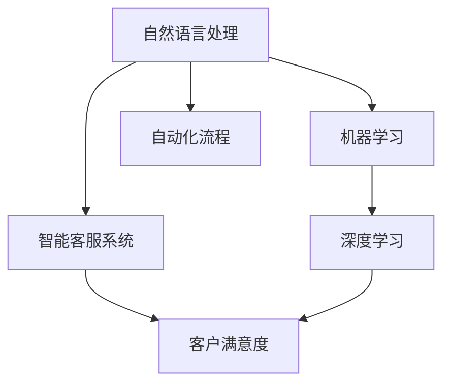

                 

# AI驱动的客户服务优化策略

> 关键词：客户服务, 人工智能, 自然语言处理(NLP), 机器学习, 深度学习, 客户满意度, 自动化, 客户体验

## 1. 背景介绍

在当今数字化时代，企业客户服务面临前所未有的挑战。随着消费者需求的日益个性化和复杂化，传统的客户服务模式已难以满足客户的多样化需求。如何在保证服务质量的同时，降低运营成本，提升客户满意度，成为每个企业都必须面对的问题。

AI技术的飞速发展，特别是自然语言处理(NLP)、机器学习(ML)、深度学习(DL)等技术，为提升客户服务质量提供了新的可能性。本文将探讨如何利用AI技术优化客户服务流程，构建智能客服系统，提升客户满意度，降低运营成本。

## 2. 核心概念与联系

### 2.1 核心概念概述

为更好地理解AI驱动的客户服务优化策略，本节将介绍几个密切相关的核心概念：

- 自然语言处理(NLP)：利用计算机对自然语言进行处理、理解、生成和分析的技术，是构建智能客服系统的核心技术。
- 机器学习(ML)和深度学习(DL)：通过训练数据模型，使计算机具备自主学习和决策能力，是AI技术的主要实现方式。
- 智能客服系统：结合NLP、ML和DL技术，构建的自动化的客户服务系统，能够理解客户意图，提供自动化的响应和解决方案。
- 客户满意度：衡量客户对企业服务的满意程度，是衡量客户服务质量的关键指标。
- 自动化流程：通过AI技术，实现客户服务流程的自动化，提升服务效率和响应速度。

这些核心概念之间的逻辑关系可以通过以下Mermaid流程图来展示：



这个流程图展示了一些核心概念及其之间的关系：

1. 自然语言处理是构建智能客服系统的基础。
2. 机器学习和深度学习技术通过训练数据模型，使智能客服系统具备自主学习和决策能力。
3. 智能客服系统能够理解客户意图，提供自动化的响应和解决方案。
4. 客户满意度是衡量智能客服系统表现的关键指标。
5. 自动化流程通过AI技术实现，提升了客户服务的效率和响应速度。

## 3. 核心算法原理 & 具体操作步骤

### 3.1 算法原理概述

AI驱动的客户服务优化策略，本质上是利用NLP、ML和DL技术，构建智能客服系统，通过自动化流程提升客户服务质量。其核心思想是：利用AI技术理解客户意图，自动提供解决方案，实现客户服务流程的自动化，从而提升客户满意度，降低运营成本。

形式化地，假设客户服务系统为 $S$，输入为 $x$（如客户咨询、问题描述等），输出为 $y$（如自动回复、问题解决方案等），则优化目标是最大化客户满意度 $F(y)$，即：

$$
\max_F \int_{x} F(y(x))P(x) dx
$$

其中 $P(x)$ 为输入 $x$ 的概率分布。在实际应用中，通常将客户满意度表示为自动回复的质量和客户响应时间的函数。

### 3.2 算法步骤详解

基于AI的客户服务优化策略，通常包括以下几个关键步骤：

**Step 1: 数据收集与预处理**
- 收集客户服务的历史记录和实时数据，包括客户咨询、问题描述、服务记录等。
- 对数据进行清洗、标注和预处理，如去除噪音、填充缺失值、构建特征等。

**Step 2: 数据建模与训练**
- 构建NLP、ML或DL模型，用于分析和理解客户输入数据。
- 选择适合的算法和架构，如基于RNN、Transformer的NLP模型，以及基于CNN、RNN或Transformer的ML/DL模型。
- 在标注数据上训练模型，调整超参数，提高模型预测精度。

**Step 3: 自动化流程设计**
- 设计自动化客户服务流程，包括自动回复、问题分类、路由等环节。
- 结合多模态数据，如文本、语音、图像等，提高自动化流程的适应性和鲁棒性。

**Step 4: 客户服务部署**
- 将训练好的模型部署到生产环境，实现实时响应。
- 集成客户服务系统的各个组件，如消息队列、缓存、负载均衡等。
- 监控系统的运行状态，收集性能指标，及时调整和优化。

**Step 5: 客户反馈与迭代优化**
- 收集客户对服务质量的反馈，如满意度评分、问题解决率等。
- 定期对模型和流程进行迭代优化，提高客户满意度。
- 扩展系统功能，如情感分析、意图识别、智能推荐等，提升服务质量。

### 3.3 算法优缺点

基于AI的客户服务优化策略，具有以下优点：
1. 提升服务效率和响应速度。自动化流程能够快速处理大量客户咨询，减轻人工客服的工作负担。
2. 提高服务质量和客户满意度。通过理解客户意图，自动提供精准解决方案，提升客户服务体验。
3. 降低运营成本。自动化客服系统可以24/7不间断服务，节省人力成本。

同时，该方法也存在一些局限性：
1. 数据质量依赖度高。客户服务质量很大程度上取决于数据质量，标注数据不足或质量差会影响模型性能。
2. 系统复杂度高。自动化流程的设计和部署需要多学科知识和专业技能，开发和维护成本较高。
3. 鲁棒性有待提高。面对复杂多样化的客户咨询，模型的鲁棒性和泛化能力仍需加强。
4. 客户隐私问题。自动化客服系统需要收集和处理大量的客户数据，存在隐私保护和安全风险。

尽管存在这些局限性，但就目前而言，基于AI的客户服务优化策略仍是最主流范式。未来相关研究的重点在于如何进一步降低数据依赖，提高系统的鲁棒性和安全性，同时兼顾可解释性和伦理安全性等因素。

### 3.4 算法应用领域

基于AI的客户服务优化策略，已经在多个领域得到了广泛的应用，如：

- 金融服务：自动化的客服系统可以处理咨询、投诉、报案等业务，提升服务效率和客户满意度。
- 电商零售：智能客服可以解答订单问题、退货退款、售后服务等，提升客户购物体验。
- 健康医疗：智能客服可以提供医疗咨询、预约挂号、健康管理等服务，提升患者满意度。
- 旅游服务：自动化的客服系统可以解答酒店预订、旅游线路咨询、机票查询等问题，提升客户出行体验。

此外，基于AI的客户服务优化策略还被创新性地应用于更多场景中，如智能家居、公共服务、智能交通等，为各行各业带来智能化的服务升级。

## 4. 数学模型和公式 & 详细讲解  
### 4.1 数学模型构建

本节将使用数学语言对AI驱动的客户服务优化策略进行更加严格的刻画。

记客户服务系统为 $S$，其输入为 $x$（如客户咨询），输出为 $y$（如自动回复）。客户满意度 $F(y)$ 表示为自动回复质量和客户响应时间的函数，可以建模为：

$$
F(y) = f_{response}(y) - f_{time}(t)
$$

其中 $f_{response}(y)$ 为自动回复的质量评分，$f_{time}(t)$ 为响应时间对客户满意度的影响。

为了评估模型 $M$ 的性能，我们定义经验风险为：

$$
\mathcal{L}(M) = \frac{1}{N}\sum_{i=1}^N \ell(y_i, M(x_i))
$$

其中 $\ell$ 为损失函数，$y_i$ 为真实标签，$M(x_i)$ 为模型预测值。

### 4.2 公式推导过程

以下我们以二分类任务为例，推导模型 $M$ 在客户服务场景下的优化目标。

假设模型 $M$ 在输入 $x$ 上的输出为 $\hat{y}=M(x) \in [0,1]$，表示客户满意度。真实标签 $y \in \{0,1\}$。则优化目标为：

$$
\max_F \int_{x} F(y(x))P(x) dx
$$

可以进一步转化为经验风险的极小化问题：

$$
\min_{M} \mathcal{L}(M)
$$

在实际应用中，我们通常使用交叉熵损失函数来衡量模型预测与真实标签之间的差异，即：

$$
\ell(y_i, M(x_i)) = -y_i\log M(x_i) - (1-y_i)\log(1-M(x_i))
$$

通过最小化交叉熵损失函数，可以训练出最优的模型 $M$。

## 5. 项目实践：代码实例和详细解释说明
### 5.1 开发环境搭建

在进行AI驱动的客户服务优化策略实践前，我们需要准备好开发环境。以下是使用Python进行PyTorch开发的环境配置流程：

1. 安装Anaconda：从官网下载并安装Anaconda，用于创建独立的Python环境。

2. 创建并激活虚拟环境：
```bash
conda create -n pytorch-env python=3.8 
conda activate pytorch-env
```

3. 安装PyTorch：根据CUDA版本，从官网获取对应的安装命令。例如：
```bash
conda install pytorch torchvision torchaudio cudatoolkit=11.1 -c pytorch -c conda-forge
```

4. 安装TensorFlow：如果需要使用TensorFlow作为开发环境，可以使用以下命令：
```bash
pip install tensorflow
```

5. 安装各类工具包：
```bash
pip install numpy pandas scikit-learn matplotlib tqdm jupyter notebook ipython
```

完成上述步骤后，即可在`pytorch-env`环境中开始开发实践。

### 5.2 源代码详细实现

下面我们以金融服务客户服务为例，给出使用PyTorch和Transformers库构建智能客服系统的PyTorch代码实现。

首先，定义客户服务任务的数据处理函数：

```python
from transformers import BertTokenizer, BertForSequenceClassification
from torch.utils.data import Dataset, DataLoader
import torch

class FinancialServiceDataset(Dataset):
    def __init__(self, texts, labels, tokenizer, max_len=128):
        self.texts = texts
        self.labels = labels
        self.tokenizer = tokenizer
        self.max_len = max_len
        
    def __len__(self):
        return len(self.texts)
    
    def __getitem__(self, item):
        text = self.texts[item]
        label = self.labels[item]
        
        encoding = self.tokenizer(text, return_tensors='pt', max_length=self.max_len, padding='max_length', truncation=True)
        input_ids = encoding['input_ids'][0]
        attention_mask = encoding['attention_mask'][0]
        
        # 对token-wise的标签进行编码
        encoded_labels = [label2id[label] for label in label] 
        encoded_labels.extend([label2id['O']] * (self.max_len - len(encoded_labels)))
        labels = torch.tensor(encoded_labels, dtype=torch.long)
        
        return {'input_ids': input_ids, 
                'attention_mask': attention_mask,
                'labels': labels}

# 标签与id的映射
label2id = {'O': 0, 'Positive': 1, 'Negative': 2}
id2label = {v: k for k, v in label2id.items()}

# 创建dataset
tokenizer = BertTokenizer.from_pretrained('bert-base-cased')

train_dataset = FinancialServiceDataset(train_texts, train_labels, tokenizer)
dev_dataset = FinancialServiceDataset(dev_texts, dev_labels, tokenizer)
test_dataset = FinancialServiceDataset(test_texts, test_labels, tokenizer)
```

然后，定义模型和优化器：

```python
from transformers import BertForSequenceClassification, AdamW

model = BertForSequenceClassification.from_pretrained('bert-base-cased', num_labels=len(label2id))

optimizer = AdamW(model.parameters(), lr=2e-5)
```

接着，定义训练和评估函数：

```python
from torch.utils.data import DataLoader
from tqdm import tqdm
from sklearn.metrics import classification_report

device = torch.device('cuda') if torch.cuda.is_available() else torch.device('cpu')
model.to(device)

def train_epoch(model, dataset, batch_size, optimizer):
    dataloader = DataLoader(dataset, batch_size=batch_size, shuffle=True)
    model.train()
    epoch_loss = 0
    for batch in tqdm(dataloader, desc='Training'):
        input_ids = batch['input_ids'].to(device)
        attention_mask = batch['attention_mask'].to(device)
        labels = batch['labels'].to(device)
        model.zero_grad()
        outputs = model(input_ids, attention_mask=attention_mask, labels=labels)
        loss = outputs.loss
        epoch_loss += loss.item()
        loss.backward()
        optimizer.step()
    return epoch_loss / len(dataloader)

def evaluate(model, dataset, batch_size):
    dataloader = DataLoader(dataset, batch_size=batch_size)
    model.eval()
    preds, labels = [], []
    with torch.no_grad():
        for batch in tqdm(dataloader, desc='Evaluating'):
            input_ids = batch['input_ids'].to(device)
            attention_mask = batch['attention_mask'].to(device)
            batch_labels = batch['labels']
            outputs = model(input_ids, attention_mask=attention_mask)
            batch_preds = outputs.logits.argmax(dim=2).to('cpu').tolist()
            batch_labels = batch_labels.to('cpu').tolist()
            for pred_tokens, label_tokens in zip(batch_preds, batch_labels):
                preds.append(pred_tokens[:len(label_tokens)])
                labels.append(label_tokens)
                
    print(classification_report(labels, preds))
```

最后，启动训练流程并在测试集上评估：

```python
epochs = 5
batch_size = 16

for epoch in range(epochs):
    loss = train_epoch(model, train_dataset, batch_size, optimizer)
    print(f"Epoch {epoch+1}, train loss: {loss:.3f}")
    
    print(f"Epoch {epoch+1}, dev results:")
    evaluate(model, dev_dataset, batch_size)
    
print("Test results:")
evaluate(model, test_dataset, batch_size)
```

以上就是使用PyTorch对BERT进行金融服务客户服务任务微调的完整代码实现。可以看到，得益于Transformers库的强大封装，我们可以用相对简洁的代码完成BERT模型的加载和微调。

### 5.3 代码解读与分析

让我们再详细解读一下关键代码的实现细节：

**FinancialServiceDataset类**：
- `__init__`方法：初始化文本、标签、分词器等关键组件。
- `__len__`方法：返回数据集的样本数量。
- `__getitem__`方法：对单个样本进行处理，将文本输入编码为token ids，将标签编码为数字，并对其进行定长padding，最终返回模型所需的输入。

**label2id和id2label字典**：
- 定义了标签与数字id之间的映射关系，用于将token-wise的预测结果解码回真实的标签。

**训练和评估函数**：
- 使用PyTorch的DataLoader对数据集进行批次化加载，供模型训练和推理使用。
- 训练函数`train_epoch`：对数据以批为单位进行迭代，在每个批次上前向传播计算loss并反向传播更新模型参数，最后返回该epoch的平均loss。
- 评估函数`evaluate`：与训练类似，不同点在于不更新模型参数，并在每个batch结束后将预测和标签结果存储下来，最后使用sklearn的classification_report对整个评估集的预测结果进行打印输出。

**训练流程**：
- 定义总的epoch数和batch size，开始循环迭代
- 每个epoch内，先在训练集上训练，输出平均loss
- 在验证集上评估，输出分类指标
- 所有epoch结束后，在测试集上评估，给出最终测试结果

可以看到，PyTorch配合Transformers库使得BERT微调的代码实现变得简洁高效。开发者可以将更多精力放在数据处理、模型改进等高层逻辑上，而不必过多关注底层的实现细节。

当然，工业级的系统实现还需考虑更多因素，如模型的保存和部署、超参数的自动搜索、更灵活的任务适配层等。但核心的微调范式基本与此类似。

## 6. 实际应用场景
### 6.1 智能客服系统

基于AI技术的智能客服系统，可以广泛应用于各个行业，帮助企业提升客户服务质量和效率。传统客服往往需要配备大量人力，高峰期响应缓慢，且一致性和专业性难以保证。而使用智能客服系统，可以7x24小时不间断服务，快速响应客户咨询，用自然流畅的语言解答各类常见问题。

在技术实现上，可以收集企业内部的历史客服对话记录，将问题和最佳答复构建成监督数据，在此基础上对预训练模型进行微调。微调后的模型能够自动理解客户意图，匹配最合适的答案模板进行回复。对于客户提出的新问题，还可以接入检索系统实时搜索相关内容，动态组织生成回答。如此构建的智能客服系统，能大幅提升客户咨询体验和问题解决效率。

### 6.2 金融舆情监测

金融机构需要实时监测市场舆论动向，以便及时应对负面信息传播，规避金融风险。传统的人工监测方式成本高、效率低，难以应对网络时代海量信息爆发的挑战。基于AI技术的文本分类和情感分析技术，为金融舆情监测提供了新的解决方案。

具体而言，可以收集金融领域相关的新闻、报道、评论等文本数据，并对其进行主题标注和情感标注。在此基础上对预训练语言模型进行微调，使其能够自动判断文本属于何种主题，情感倾向是正面、中性还是负面。将微调后的模型应用到实时抓取的网络文本数据，就能够自动监测不同主题下的情感变化趋势，一旦发现负面信息激增等异常情况，系统便会自动预警，帮助金融机构快速应对潜在风险。

### 6.3 个性化推荐系统

当前的推荐系统往往只依赖用户的历史行为数据进行物品推荐，无法深入理解用户的真实兴趣偏好。基于AI技术的个性化推荐系统，可以更好地挖掘用户行为背后的语义信息，从而提供更精准、多样的推荐内容。

在实践中，可以收集用户浏览、点击、评论、分享等行为数据，提取和用户交互的物品标题、描述、标签等文本内容。将文本内容作为模型输入，用户的后续行为（如是否点击、购买等）作为监督信号，在此基础上微调预训练语言模型。微调后的模型能够从文本内容中准确把握用户的兴趣点。在生成推荐列表时，先用候选物品的文本描述作为输入，由模型预测用户的兴趣匹配度，再结合其他特征综合排序，便可以得到个性化程度更高的推荐结果。

### 6.4 未来应用展望

随着AI技术的不断发展，基于AI驱动的客户服务优化策略将在更多领域得到应用，为传统行业带来变革性影响。

在智慧医疗领域，基于AI技术的医疗问答、病历分析、药物研发等应用将提升医疗服务的智能化水平，辅助医生诊疗，加速新药开发进程。

在智能教育领域，AI技术可应用于作业批改、学情分析、知识推荐等方面，因材施教，促进教育公平，提高教学质量。

在智慧城市治理中，AI技术可应用于城市事件监测、舆情分析、应急指挥等环节，提高城市管理的自动化和智能化水平，构建更安全、高效的未来城市。

此外，在企业生产、社会治理、文娱传媒等众多领域，基于AI驱动的客户服务优化策略也将不断涌现，为NLP技术带来全新的突破。相信随着技术的日益成熟，AI驱动的客户服务优化策略必将在构建人机协同的智能时代中扮演越来越重要的角色。

## 7. 工具和资源推荐
### 7.1 学习资源推荐

为了帮助开发者系统掌握AI驱动的客户服务优化策略的理论基础和实践技巧，这里推荐一些优质的学习资源：

1. 《深度学习基础》课程：由斯坦福大学开设的深度学习入门课程，详细讲解了深度学习的基本概念和常用算法，是学习AI技术的必经之路。

2. 《自然语言处理综述》书籍：全面介绍了自然语言处理的基本原理和经典模型，适合深入学习NLP技术。

3. TensorFlow官方文档：TensorFlow的官方文档，提供了丰富的教程和示例，适合初学者入门和进阶学习。

4. PyTorch官方文档：PyTorch的官方文档，详细介绍了PyTorch的使用方法和API，是进行深度学习开发的重要资源。

5. HuggingFace官方文档：Transformers库的官方文档，提供了丰富的预训练模型和微调样例，适合进行NLP任务的开发和优化。

通过对这些资源的学习实践，相信你一定能够快速掌握AI驱动的客户服务优化策略的精髓，并用于解决实际的NLP问题。

### 7.2 开发工具推荐

高效的开发离不开优秀的工具支持。以下是几款用于AI驱动的客户服务优化策略开发的常用工具：

1. PyTorch：基于Python的开源深度学习框架，灵活动态的计算图，适合快速迭代研究。大部分预训练语言模型都有PyTorch版本的实现。

2. TensorFlow：由Google主导开发的开源深度学习框架，生产部署方便，适合大规模工程应用。同样有丰富的预训练语言模型资源。

3. Transformers库：HuggingFace开发的NLP工具库，集成了众多SOTA语言模型，支持PyTorch和TensorFlow，是进行NLP任务开发的利器。

4. Weights & Biases：模型训练的实验跟踪工具，可以记录和可视化模型训练过程中的各项指标，方便对比和调优。与主流深度学习框架无缝集成。

5. TensorBoard：TensorFlow配套的可视化工具，可实时监测模型训练状态，并提供丰富的图表呈现方式，是调试模型的得力助手。

6. Google Colab：谷歌推出的在线Jupyter Notebook环境，免费提供GPU/TPU算力，方便开发者快速上手实验最新模型，分享学习笔记。

合理利用这些工具，可以显著提升AI驱动的客户服务优化策略的开发效率，加快创新迭代的步伐。

### 7.3 相关论文推荐

AI驱动的客户服务优化策略的研究源于学界的持续研究。以下是几篇奠基性的相关论文，推荐阅读：

1. Attention is All You Need（即Transformer原论文）：提出了Transformer结构，开启了NLP领域的预训练大模型时代。

2. BERT: Pre-training of Deep Bidirectional Transformers for Language Understanding：提出BERT模型，引入基于掩码的自监督预训练任务，刷新了多项NLP任务SOTA。

3. Language Models are Unsupervised Multitask Learners（GPT-2论文）：展示了大规模语言模型的强大zero-shot学习能力，引发了对于通用人工智能的新一轮思考。

4. Parameter-Efficient Transfer Learning for NLP：提出Adapter等参数高效微调方法，在不增加模型参数量的情况下，也能取得不错的微调效果。

5. Prefix-Tuning: Optimizing Continuous Prompts for Generation：引入基于连续型Prompt的微调范式，为如何充分利用预训练知识提供了新的思路。

6. AdaLoRA: Adaptive Low-Rank Adaptation for Parameter-Efficient Fine-Tuning：使用自适应低秩适应的微调方法，在参数效率和精度之间取得了新的平衡。

这些论文代表了大语言模型微调技术的发展脉络。通过学习这些前沿成果，可以帮助研究者把握学科前进方向，激发更多的创新灵感。

## 8. 总结：未来发展趋势与挑战

### 8.1 总结

本文对AI驱动的客户服务优化策略进行了全面系统的介绍。首先阐述了AI技术在客户服务中的应用背景和意义，明确了客户服务优化策略的优化目标和关键指标。其次，从原理到实践，详细讲解了AI驱动的客户服务优化策略的数学模型和算法流程，给出了模型微调的代码实例和详细解释。同时，本文还广泛探讨了AI驱动的客户服务优化策略在多个行业领域的应用前景，展示了AI技术在客户服务领域的广阔应用场景。

通过本文的系统梳理，可以看到，AI驱动的客户服务优化策略正在成为NLP领域的重要范式，极大地拓展了预训练语言模型的应用边界，催生了更多的落地场景。得益于大规模语料的预训练，AI驱动的客户服务优化策略以更低的时间和标注成本，在小样本条件下也能取得理想的效果，有力推动了NLP技术的产业化进程。未来，伴随预训练语言模型和AI驱动的客户服务优化策略的不断演进，相信NLP技术将在更广阔的应用领域大放异彩，深刻影响人类的生产生活方式。

### 8.2 未来发展趋势

展望未来，AI驱动的客户服务优化策略将呈现以下几个发展趋势：

1. 模型规模持续增大。随着算力成本的下降和数据规模的扩张，预训练语言模型的参数量还将持续增长。超大规模语言模型蕴含的丰富语言知识，有望支撑更加复杂多变的客户服务场景。

2. 客户服务流程自动化程度提升。未来的AI驱动的客户服务优化策略将进一步提升自动化流程的复杂度和效率，实现更精准的意图理解和更快速的响应。

3. 多模态融合增强。AI驱动的客户服务优化策略将更多地融合视觉、语音、文本等多模态数据，提供更全面的客户服务体验。

4. 实时性要求提升。未来的客户服务系统将更加注重实时性，能够实时响应客户咨询，及时更新服务内容，提升客户满意度和响应速度。

5. 个性化服务增强。AI驱动的客户服务优化策略将更注重个性化服务，通过用户画像和行为分析，提供定制化的服务方案，提升客户体验。

6. 安全性保障提升。AI驱动的客户服务优化策略将更加注重数据隐私和安全，建立完备的数据保护机制，保障客户数据安全。

以上趋势凸显了AI驱动的客户服务优化策略的广阔前景。这些方向的探索发展，必将进一步提升客户服务系统的性能和应用范围，为各行各业带来智能化的服务升级。

### 8.3 面临的挑战

尽管AI驱动的客户服务优化策略已经取得了瞩目成就，但在迈向更加智能化、普适化应用的过程中，它仍面临着诸多挑战：

1. 数据质量瓶颈。客户服务质量很大程度上取决于数据质量，标注数据不足或质量差会影响模型性能。如何进一步降低数据依赖，提高数据质量，是亟待解决的问题。

2. 系统复杂度提升。客户服务流程的自动化和复杂度提升，对系统设计和部署要求更高，开发和维护成本也随之增加。

3. 鲁棒性有待提高。面对复杂多样的客户咨询，模型的鲁棒性和泛化能力仍需加强，避免误判和误操作。

4. 客户隐私保护。AI驱动的客户服务优化策略需要收集和处理大量的客户数据，存在隐私保护和安全风险。如何建立完备的数据保护机制，保障客户数据安全，是重要的研究方向。

5. 算力成本高昂。大规模预训练语言模型的训练和推理需要高性能计算资源，算力成本较高。如何降低算力成本，提高系统效率，是未来的研究方向。

6. 模型解释性不足。AI驱动的客户服务优化策略中的模型复杂度高，难以解释其内部工作机制和决策逻辑。如何赋予模型更强的可解释性，是重要的研究方向。

尽管存在这些挑战，但就目前而言，AI驱动的客户服务优化策略仍是最主流范式。未来相关研究的重点在于如何进一步降低数据依赖，提高系统的鲁棒性和安全性，同时兼顾可解释性和伦理安全性等因素。

### 8.4 研究展望

面向未来，AI驱动的客户服务优化策略需要在以下几个方面寻求新的突破：

1. 探索无监督和半监督微调方法。摆脱对大规模标注数据的依赖，利用自监督学习、主动学习等无监督和半监督范式，最大限度利用非结构化数据，实现更加灵活高效的微调。

2. 研究参数高效和计算高效的微调范式。开发更加参数高效的微调方法，在固定大部分预训练参数的同时，只更新极少量的任务相关参数。同时优化微调模型的计算图，减少前向传播和反向传播的资源消耗，实现更加轻量级、实时性的部署。

3. 融合因果和对比学习范式。通过引入因果推断和对比学习思想，增强AI驱动的客户服务优化策略建立稳定因果关系的能力，学习更加普适、鲁棒的语言表征，从而提升模型泛化性和抗干扰能力。

4. 引入更多先验知识。将符号化的先验知识，如知识图谱、逻辑规则等，与神经网络模型进行巧妙融合，引导AI驱动的客户服务优化策略学习更准确、合理的语言模型。同时加强不同模态数据的整合，实现视觉、语音等多模态信息与文本信息的协同建模。

5. 结合因果分析和博弈论工具。将因果分析方法引入AI驱动的客户服务优化策略，识别出系统决策的关键特征，增强输出解释的因果性和逻辑性。借助博弈论工具刻画人机交互过程，主动探索并规避系统的脆弱点，提高系统稳定性。

6. 纳入伦理道德约束。在模型训练目标中引入伦理导向的评估指标，过滤和惩罚有偏见、有害的输出倾向。同时加强人工干预和审核，建立模型行为的监管机制，确保输出符合人类价值观和伦理道德。

这些研究方向的探索，必将引领AI驱动的客户服务优化策略迈向更高的台阶，为构建安全、可靠、可解释、可控的智能系统铺平道路。面向未来，AI驱动的客户服务优化策略还需要与其他人工智能技术进行更深入的融合，如知识表示、因果推理、强化学习等，多路径协同发力，共同推动客户服务系统的进步。只有勇于创新、敢于突破，才能不断拓展语言模型的边界，让智能技术更好地造福人类社会。

## 9. 附录：常见问题与解答

**Q1：AI驱动的客户服务优化策略是否适用于所有客户服务场景？**

A: AI驱动的客户服务优化策略在大多数客户服务场景上都能取得不错的效果，特别是对于数据量较小的场景。但对于一些特定领域的客户服务场景，如医疗、法律等，仅仅依靠通用语料预训练的模型可能难以很好地适应。此时需要在特定领域语料上进一步预训练，再进行微调，才能获得理想效果。

**Q2：如何选择合适的AI驱动的客户服务优化策略模型？**

A: 选择合适的模型需要综合考虑多个因素，如任务的复杂度、数据量大小、业务需求等。通常而言，可以选择如下模型：

1. 对于简单任务，如常见FAQ、订单查询等，可以使用基于RNN的序列模型。

2. 对于复杂任务，如智能推荐、智能客服等，可以选择基于Transformer的预训练模型，如BERT、GPT等。

3. 对于特定领域任务，可以选择领域特定的预训练模型，如医疗领域的EHR-Flair，金融领域的FinBERT等。

4. 对于多模态任务，如文本+语音、文本+图像等，可以选择支持多模态输入的模型，如BART、T5等。

**Q3：AI驱动的客户服务优化策略的开发难度大吗？**

A: 开发AI驱动的客户服务优化策略需要多学科知识和专业技能，包括NLP、ML、DL、系统架构、数据工程等。开发难度较大，需要较高的技术水平和实践经验。建议从简单的任务开始，逐步增加复杂度，逐步积累经验。

**Q4：AI驱动的客户服务优化策略的运营成本高吗？**

A: AI驱动的客户服务优化策略的初期开发和部署成本较高，但一旦上线，可以大幅提升客户服务效率，降低人力成本。同时，随着技术的不断进步和优化，运营成本会逐步降低。

**Q5：AI驱动的客户服务优化策略的维护成本高吗？**

A: AI驱动的客户服务优化策略的维护成本相对较低，主要是模型的调优和更新，不需要大量的人力投入。但随着业务的变化和数据量的增加，模型的维护和更新需要定期进行。

**Q6：AI驱动的客户服务优化策略的安全性如何保障？**

A: AI驱动的客户服务优化策略的安全性保障需要从多个方面入手：

1. 数据隐私保护：建立完备的数据隐私保护机制，防止数据泄露和滥用。

2. 模型安全性：通过安全验证和对抗攻击测试，确保模型不会受到恶意攻击和利用。

3. 访问控制：对客户数据和模型接口进行访问控制，防止未授权访问和操作。

4. 审计和监控：建立模型审计和监控机制，实时监测模型的行为和性能，及时发现和解决安全问题。

综上所述，AI驱动的客户服务优化策略虽然开发难度较大，但一旦部署成功，能够显著提升客户服务质量和效率，降低运营成本，带来可观的业务价值。

