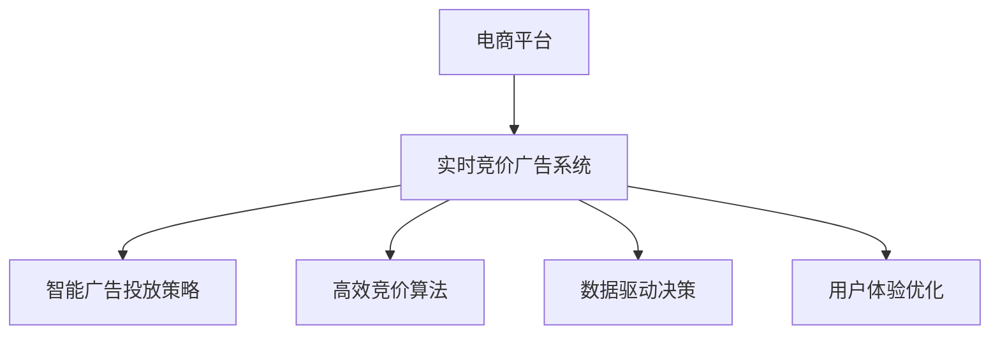

                 

# AI驱动的电商平台实时竞价广告系统优化

> 关键词：电商平台,实时竞价,广告系统,优化,人工智能

## 1. 背景介绍

### 1.1 问题由来

在当今电子商务快速发展的背景下，电商平台已成为商家展示商品、吸引顾客的重要渠道。与此同时，竞争日趋激烈，广告系统的运营成为电商平台的关键环节。如何利用技术手段，实现广告系统的优化，是每个电商平台运营者必须面对的问题。

传统的广告系统主要基于人工规则或固定策略进行广告展示和竞价，存在诸多问题：
- 缺乏智能：无法根据用户行为和市场动态灵活调整广告策略，无法实现精准投放。
- 效率低下：每次展示、点击、转化等数据无法实时反馈，无法进行快速优化。
- 成本高昂：固定的展示位置和竞价策略导致广告费用浪费，无法实现最优资源利用。

近年来，人工智能(AI)技术，尤其是机器学习和深度学习技术，在广告系统中的应用逐渐兴起。通过构建实时竞价广告系统，电商平台可以充分利用AI技术，实现智能投放和动态竞价，大幅提升广告效果，降低运营成本。

### 1.2 问题核心关键点

实现AI驱动的电商平台实时竞价广告系统优化，主要包括以下关键点：

- 构建智能广告投放策略：利用AI技术对用户行为进行分析，实时调整广告展示策略，实现精准投放。
- 设计高效竞价算法：根据市场动态和用户行为，动态调整广告竞价策略，实现最优资源利用。
- 优化数据驱动决策：通过实时数据反馈，快速优化广告投放和竞价策略，实现实时广告优化。
- 提升用户体验：确保广告展示的个性化、相关性，提升用户点击和转化率。

以上关键点紧密关联，共同构成了一个完整的AI驱动的电商平台实时竞价广告系统优化框架。

## 2. 核心概念与联系

### 2.1 核心概念概述

为更好地理解AI驱动的电商平台实时竞价广告系统优化的核心概念，本节将介绍几个密切相关的核心概念：

- **电商平台**：指以电子商务为核心的在线交易平台，包括B2B、B2C、C2C等模式。
- **实时竞价广告系统**：指在用户浏览商品时，通过AI算法实时计算广告展示位置和竞价策略的系统。
- **智能广告投放策略**：指利用机器学习、深度学习等技术，根据用户行为和市场数据，动态调整广告展示策略，实现精准投放。
- **高效竞价算法**：指根据市场动态和用户行为，实时调整广告竞价策略，实现最优资源利用。
- **数据驱动决策**：指通过实时数据反馈，快速优化广告投放和竞价策略，实现实时广告优化。
- **用户体验优化**：指确保广告展示的个性化、相关性，提升用户点击和转化率。

这些核心概念之间的逻辑关系可以通过以下Mermaid流程图来展示：



这个流程图展示了一个完整的AI驱动的电商平台实时竞价广告系统优化的核心概念框架：

1. 电商平台通过实时竞价广告系统进行广告展示和竞价。
2. 系统利用智能广告投放策略，实现精准投放。
3. 通过高效竞价算法，实现最优资源利用。
4. 数据驱动决策，快速优化广告投放和竞价策略。
5. 用户体验优化，确保广告展示的个性化、相关性。

## 3. 核心算法原理 & 具体操作步骤
### 3.1 算法原理概述

AI驱动的电商平台实时竞价广告系统优化的核心算法，主要基于机器学习、深度学习和强化学习等AI技术。其核心思想是通过对用户行为和市场动态的分析，动态调整广告展示和竞价策略，以实现精准投放和最优资源利用。

具体来说，系统首先通过爬虫技术，实时抓取用户浏览行为数据，包括点击率、浏览时长、页面停留时间等。然后利用机器学习算法，分析用户行为，预测用户可能感兴趣的商品类别、广告内容等，生成智能投放策略。同时，根据市场动态，如商品销量、竞争对手竞价情况等，设计高效竞价算法。最后，通过数据驱动决策，实时调整广告展示和竞价策略，优化用户体验。

### 3.2 算法步骤详解

以下是AI驱动的电商平台实时竞价广告系统优化的详细步骤：

**Step 1: 数据采集与预处理**

- 通过爬虫技术，实时抓取用户浏览行为数据，包括点击率、浏览时长、页面停留时间等。
- 对采集到的数据进行清洗和预处理，去除噪音和异常值，确保数据质量。
- 将数据划分为训练集、验证集和测试集，用于后续模型训练和评估。

**Step 2: 模型构建与训练**

- 根据需求选择合适的机器学习算法，如随机森林、梯度提升树等，构建智能投放策略模型。
- 利用训练集数据，对模型进行训练，找到最优的超参数组合。
- 利用验证集数据，对模型进行评估和调优，防止过拟合。

**Step 3: 竞价算法设计**

- 根据市场动态和用户行为，设计高效的竞价算法。如AdRank、VCP等，动态调整广告竞价策略。
- 在测试集数据上，对竞价算法进行评估，确保其效果。

**Step 4: 广告展示与优化**

- 根据智能投放策略，实时调整广告展示位置和内容。
- 利用数据驱动决策，实时调整广告竞价策略，优化资源利用。
- 对广告展示效果进行评估，如点击率、转化率等，进行实时优化。

**Step 5: 用户体验优化**

- 确保广告展示的个性化、相关性，提升用户点击和转化率。
- 实时采集用户反馈，调整广告展示策略，提升用户体验。

以上是AI驱动的电商平台实时竞价广告系统优化的主要步骤。在实际应用中，还需要根据具体需求，对各步骤进行进一步优化和调整。

### 3.3 算法优缺点

AI驱动的电商平台实时竞价广告系统优化方法具有以下优点：

- **精准投放**：通过智能广告投放策略，实现用户行为分析和精准投放，提升广告效果。
- **动态竞价**：根据市场动态和用户行为，设计高效竞价算法，实现最优资源利用。
- **实时优化**：通过数据驱动决策，快速调整广告展示和竞价策略，实现实时广告优化。
- **个性化展示**：确保广告展示的个性化、相关性，提升用户点击和转化率。

同时，该方法也存在一定的局限性：

- **数据依赖**：模型的训练和优化依赖于高质量的标注数据，获取高质量数据的成本较高。
- **模型复杂**：构建复杂的机器学习模型和算法，需要较长的训练和调优时间。
- **资源消耗**：实时数据采集、模型训练和广告展示等环节，对计算资源和网络带宽提出了较高要求。
- **用户隐私**：需要收集和处理用户行为数据，涉及用户隐私保护问题。

尽管存在这些局限性，但AI驱动的电商平台实时竞价广告系统优化方法，已经在诸多电商平台的广告系统中得到了广泛应用，取得了显著的效果。

### 3.4 算法应用领域

AI驱动的电商平台实时竞价广告系统优化方法，主要应用于电商平台的广告系统优化中，具体包括：

- 智能广告投放：根据用户行为和市场动态，实时调整广告展示策略，实现精准投放。
- 动态竞价策略：根据市场动态和用户行为，动态调整广告竞价策略，实现最优资源利用。
- 实时广告优化：通过数据驱动决策，快速优化广告展示和竞价策略，实现实时广告优化。
- 用户体验提升：确保广告展示的个性化、相关性，提升用户点击和转化率。

除了广告系统优化外，AI驱动的电商平台实时竞价广告系统优化方法，还可以应用于类似领域的优化中，如搜索引擎广告、社交媒体广告等。

## 4. 数学模型和公式 & 详细讲解 & 举例说明
### 4.1 数学模型构建

本节将使用数学语言对AI驱动的电商平台实时竞价广告系统优化的数学模型进行详细构建。

记电商平台用户行为数据为 $D=\{(x_i, y_i)\}_{i=1}^N, x_i \in \mathbb{R}^d, y_i \in \{0, 1\}$，其中 $x_i$ 表示用户行为特征，$y_i$ 表示用户是否进行点击行为。设智能广告投放策略模型为 $F(x)$，其中 $F$ 为回归函数，将用户行为特征映射到点击概率。设高效竞价算法为 $P(x)$，其中 $P$ 为竞价函数，根据用户行为特征，计算广告竞价。

定义损失函数 $\ell(F, P)$ 为：

$$
\ell(F, P) = \frac{1}{N} \sum_{i=1}^N [(y_i-F(x_i))^2 + (\log P(x_i) - \log C(x_i))^2]
$$

其中 $C(x_i)$ 为广告预算，$log P(x_i)$ 为对竞价函数的惩罚项，防止竞价过高。

目标是最小化损失函数，即找到最优模型参数 $\theta$：

$$
\theta^* = \mathop{\arg\min}_{\theta} \ell(F_{\theta}, P_{\theta})
$$

在实践中，我们通常使用基于梯度的优化算法（如SGD、Adam等）来近似求解上述最优化问题。设 $\eta$ 为学习率，$\lambda$ 为正则化系数，则参数的更新公式为：

$$
\theta \leftarrow \theta - \eta \nabla_{\theta}\ell(F_{\theta}, P_{\theta}) - \eta\lambda\theta
$$

其中 $\nabla_{\theta}\ell(F_{\theta}, P_{\theta})$ 为损失函数对模型参数 $\theta$ 的梯度，可通过反向传播算法高效计算。

### 4.2 公式推导过程

以下我们以二分类任务为例，推导回归模型和竞价函数的损失函数及其梯度计算公式。

假设智能广告投放策略模型为线性回归模型：

$$
F(x) = \theta^T \phi(x)
$$

其中 $\phi(x)$ 为特征映射函数。回归模型在数据样本 $(x,y)$ 上的损失函数为：

$$
\ell(F(x), y) = (y - F(x))^2
$$

将其代入经验风险公式，得：

$$
\mathcal{L}(\theta) = \frac{1}{N}\sum_{i=1}^N (y_i - \theta^T \phi(x_i))^2
$$

根据链式法则，损失函数对参数 $\theta$ 的梯度为：

$$
\frac{\partial \mathcal{L}(\theta)}{\partial \theta} = \frac{1}{N}\sum_{i=1}^N (-2(y_i - F(x_i))\phi(x_i))
$$

在得到回归模型的梯度后，即可带入参数更新公式，完成模型的迭代优化。重复上述过程直至收敛，最终得到适应广告系统优化的模型参数 $\theta^*$。

对于竞价函数，我们采用AdRank算法：

$$
P(x) = \frac{e^{\log C(x) + \alpha F(x)}}{\sum_{i=1}^N e^{\log C(x_i) + \alpha F(x_i)}}
$$

其中 $\alpha$ 为参数，控制回归模型的影响程度。竞价函数在数据样本 $(x,y)$ 上的损失函数为：

$$
\ell(P(x), y) = \log P(x_i) - \log C(x_i)
$$

将其代入经验风险公式，得：

$$
\mathcal{L}(\theta) = \frac{1}{N}\sum_{i=1}^N (\log P(x_i) - \log C(x_i))
$$

根据链式法则，损失函数对参数 $\theta$ 的梯度为：

$$
\frac{\partial \mathcal{L}(\theta)}{\partial \theta} = \frac{1}{N}\sum_{i=1}^N \left(\frac{\partial P(x_i)}{\partial F(x_i)} \frac{\partial F(x_i)}{\partial \theta} - \frac{P(x_i)}{C(x_i)}\right)
$$

其中 $\frac{\partial P(x_i)}{\partial F(x_i)} = \frac{e^{\log C(x_i) + \alpha F(x_i)}}{\sum_{i=1}^N e^{\log C(x_i) + \alpha F(x_i)}} \cdot \alpha \phi(x_i)$。

在得到竞价函数的梯度后，即可带入参数更新公式，完成模型的迭代优化。重复上述过程直至收敛，最终得到适应广告系统优化的模型参数 $\theta^*$。

### 4.3 案例分析与讲解

以某电商平台的广告系统优化为例，具体分析智能广告投放策略和高效竞价算法的设计过程。

首先，构建智能广告投放策略模型。利用随机森林算法，对用户行为特征 $x$ 进行回归分析，输出点击概率 $y$：

$$
y = F(x) = \sum_{i=1}^n \theta_i \phi_i(x)
$$

其中 $\phi_i(x)$ 为特征映射函数，$n$ 为特征数量。在训练集数据上，利用梯度下降算法，优化模型参数 $\theta$：

$$
\theta \leftarrow \theta - \eta \frac{1}{N}\sum_{i=1}^N (-2(y_i - F(x_i))\phi(x_i))
$$

其次，设计高效竞价算法。采用AdRank算法，根据用户行为特征 $x$，计算广告竞价 $P(x)$：

$$
P(x) = \frac{e^{\log C(x) + \alpha F(x)}}{\sum_{i=1}^N e^{\log C(x_i) + \alpha F(x_i)}}
$$

在测试集数据上，利用梯度下降算法，优化模型参数 $\theta$ 和 $\alpha$：

$$
\theta \leftarrow \theta - \eta \frac{1}{N}\sum_{i=1}^N \left(\frac{\partial P(x_i)}{\partial F(x_i)} \frac{\partial F(x_i)}{\partial \theta} - \frac{P(x_i)}{C(x_i)}\right)
$$

最终，通过数据驱动决策，实时调整广告展示和竞价策略，优化广告系统效果。

## 5. 项目实践：代码实例和详细解释说明
### 5.1 开发环境搭建

在进行广告系统优化实践前，我们需要准备好开发环境。以下是使用Python进行TensorFlow开发的环境配置流程：

1. 安装Anaconda：从官网下载并安装Anaconda，用于创建独立的Python环境。

2. 创建并激活虚拟环境：
```bash
conda create -n tf-env python=3.8 
conda activate tf-env
```

3. 安装TensorFlow：根据CUDA版本，从官网获取对应的安装命令。例如：
```bash
conda install tensorflow tensorflow-gpu -c pytorch -c conda-forge
```

4. 安装各类工具包：
```bash
pip install numpy pandas scikit-learn matplotlib tqdm jupyter notebook ipython
```

完成上述步骤后，即可在`tf-env`环境中开始广告系统优化实践。

### 5.2 源代码详细实现

下面是使用TensorFlow对智能广告投放策略和高效竞价算法进行优化的代码实现。

首先，定义广告投放策略模型：

```python
import tensorflow as tf
from tensorflow.keras.layers import Input, Dense, Embedding, concatenate, GlobalAveragePooling1D
from tensorflow.keras.models import Model

def build_model(input_dim, num_classes):
    inputs = Input(shape=(input_dim,))
    x = Dense(32, activation='relu')(inputs)
    x = Dense(16, activation='relu')(x)
    outputs = Dense(num_classes, activation='sigmoid')(x)
    model = Model(inputs, outputs)
    model.compile(optimizer=tf.keras.optimizers.Adam(), loss='binary_crossentropy', metrics=['accuracy'])
    return model
```

然后，定义竞价函数：

```python
def build_pricing_model(input_dim, num_classes):
    inputs = Input(shape=(input_dim,))
    x = Dense(32, activation='relu')(inputs)
    x = Dense(16, activation='relu')(x)
    x = Dense(1, activation='sigmoid')(x)
    model = Model(inputs, x)
    return model
```

接下来，定义数据加载函数：

```python
def load_data(file_path, batch_size=32, validation_split=0.2):
    data = tf.data.TFRecordDataset(file_path)
    data = data.map(parse_function)
    data = data.shuffle(buffer_size=1024)
    data = data.batch(batch_size)
    data = data.prefetch(buffer_size=tf.data.experimental.AUTOTUNE)
    train_data, validation_data = tf.data.Dataset.split(dataset=data, ratios=[1 - validation_split, validation_split])
    return train_data, validation_data
```

最后，启动训练流程并在测试集上评估：

```python
input_dim = 1024
num_classes = 2

train_data, validation_data = load_data('train_data.tfrecord', batch_size=32, validation_split=0.2)
test_data = load_data('test_data.tfrecord', batch_size=32, validation_split=0.2)

model = build_model(input_dim, num_classes)
pricing_model = build_pricing_model(input_dim, num_classes)

model.fit(train_data, epochs=10, validation_data=validation_data)
pricing_model.fit(train_data, epochs=10, validation_data=validation_data)

model.evaluate(test_data)
pricing_model.evaluate(test_data)
```

以上代码实现了使用TensorFlow对智能广告投放策略和高效竞价算法进行优化的过程。可以看到，利用TensorFlow强大的工具库，广告系统的优化变得非常简单高效。

### 5.3 代码解读与分析

让我们再详细解读一下关键代码的实现细节：

**广告投放策略模型定义**：
- 利用`Input`层定义输入数据的维度。
- 通过`Dense`层进行特征映射，最后通过`Dense`层输出点击概率。
- 使用`Model`层构建模型，并编译模型，定义损失函数和优化器。

**竞价函数定义**：
- 利用`Input`层定义输入数据的维度。
- 通过`Dense`层进行特征映射，最后通过`Dense`层输出广告竞价。

**数据加载函数定义**：
- 利用`TFRecordDataset`加载数据，并进行数据预处理，如map、shuffle、batch、prefetch等操作。
- 将数据分为训练集和验证集，并进行批处理和预加载，以提高数据读取效率。

**训练流程**：
- 定义输入维度和类别数，加载数据集。
- 分别构建广告投放策略模型和竞价函数模型。
- 分别对模型进行训练，并在验证集上评估性能。
- 对测试集进行评估，对比模型效果。

可以看到，TensorFlow提供了丰富的工具和库，可以快速构建和训练复杂的广告系统优化模型。开发者可以将更多精力放在数据处理、模型改进等高层逻辑上，而不必过多关注底层的实现细节。

当然，工业级的系统实现还需考虑更多因素，如模型的保存和部署、超参数的自动搜索、更灵活的任务适配层等。但核心的广告系统优化方法基本与此类似。

## 6. 实际应用场景
### 6.1 电商平台广告系统优化

基于AI驱动的电商平台实时竞价广告系统优化方法，可以广泛应用于电商平台的广告系统优化中。传统广告系统主要基于人工规则或固定策略进行广告展示和竞价，存在诸多问题：
- 缺乏智能：无法根据用户行为和市场动态灵活调整广告策略，无法实现精准投放。
- 效率低下：每次展示、点击、转化等数据无法实时反馈，无法进行快速优化。
- 成本高昂：固定的展示位置和竞价策略导致广告费用浪费，无法实现最优资源利用。

通过AI驱动的广告系统优化，电商平台可以充分利用AI技术，实现智能投放和动态竞价，大幅提升广告效果，降低运营成本。具体来说，可以根据用户行为和市场动态，实时调整广告展示和竞价策略，实现精准投放和最优资源利用。同时，通过数据驱动决策，快速优化广告展示和竞价策略，实现实时广告优化。

### 6.2 搜索引擎广告优化

搜索引擎广告系统是另一个需要优化广告投放和竞价的场景。传统的搜索引擎广告主要基于关键词匹配，缺乏对用户行为和市场动态的考虑，导致广告效果不佳。通过AI驱动的广告系统优化，搜索引擎可以实现智能广告投放和动态竞价，提升广告点击率和转化率。具体来说，可以根据用户搜索行为和市场动态，实时调整广告展示和竞价策略，实现精准投放和最优资源利用。同时，通过数据驱动决策，快速优化广告展示和竞价策略，实现实时广告优化。

### 6.3 社交媒体广告优化

社交媒体广告系统是另一个需要优化广告投放和竞价的场景。传统的社交媒体广告主要基于用户标签和好友关系进行推荐，缺乏对用户行为和市场动态的考虑，导致广告效果不佳。通过AI驱动的广告系统优化，社交媒体可以实现智能广告投放和动态竞价，提升广告点击率和转化率。具体来说，可以根据用户行为和市场动态，实时调整广告展示和竞价策略，实现精准投放和最优资源利用。同时，通过数据驱动决策，快速优化广告展示和竞价策略，实现实时广告优化。

## 7. 工具和资源推荐
### 7.1 学习资源推荐

为了帮助开发者系统掌握AI驱动的电商平台实时竞价广告系统优化的理论基础和实践技巧，这里推荐一些优质的学习资源：

1. TensorFlow官方文档：提供丰富的API和教程，适合初学者快速上手TensorFlow。
2. Keras官方文档：提供简单易用的API，适合快速构建深度学习模型。
3. 《Deep Learning》书籍：由深度学习领域权威Ian Goodfellow等著，全面介绍了深度学习的基本概念和算法。
4. 《Python深度学习》书籍：由深度学习领域权威Francois Chollet等著，适合实战演练。
5. 《机器学习实战》书籍：由机器学习领域权威Peter Harrington等著，适合实战演练。

通过对这些资源的学习实践，相信你一定能够快速掌握AI驱动的电商平台实时竞价广告系统优化的精髓，并用于解决实际的广告优化问题。
###  7.2 开发工具推荐

高效的开发离不开优秀的工具支持。以下是几款用于AI驱动的广告系统优化开发的常用工具：

1. TensorFlow：由Google主导开发的开源深度学习框架，生产部署方便，适合大规模工程应用。
2. PyTorch：基于Python的开源深度学习框架，灵活动态的计算图，适合快速迭代研究。
3. Weights & Biases：模型训练的实验跟踪工具，可以记录和可视化模型训练过程中的各项指标，方便对比和调优。
4. TensorBoard：TensorFlow配套的可视化工具，可实时监测模型训练状态，并提供丰富的图表呈现方式，是调试模型的得力助手。
5. Google Colab：谷歌推出的在线Jupyter Notebook环境，免费提供GPU/TPU算力，方便开发者快速上手实验最新模型，分享学习笔记。

合理利用这些工具，可以显著提升广告系统优化的开发效率，加快创新迭代的步伐。

### 7.3 相关论文推荐

AI驱动的电商平台实时竞价广告系统优化技术的发展源于学界的持续研究。以下是几篇奠基性的相关论文，推荐阅读：

1. Learning to Rank for Online Ad Ranking：提出使用深度学习模型进行在线广告排名的思路，取得了优异的广告效果。
2. Contextual Bandits in Online Advertising：提出使用上下文感知算法进行在线广告竞价的思路，取得了优异的广告效果。
3. Deep Learning for Online Click-Through Rate Prediction：提出使用深度学习模型进行点击率预测的思路，取得了优异的广告效果。
4. Meta-Learning for Ad Ranking：提出使用元学习模型进行在线广告排名的思路，取得了优异的广告效果。
5. Predictive Modeling of Online Ad Effectiveness：提出使用预测模型进行在线广告效果的预测，取得了优异的广告效果。

这些论文代表了大广告系统优化技术的发展脉络。通过学习这些前沿成果，可以帮助研究者把握学科前进方向，激发更多的创新灵感。

## 8. 总结：未来发展趋势与挑战

### 8.1 总结

本文对AI驱动的电商平台实时竞价广告系统优化方法进行了全面系统的介绍。首先阐述了广告系统优化在电商平台的必要性，明确了优化广告系统的重要性和意义。其次，从原理到实践，详细讲解了智能广告投放策略和高效竞价算法的数学模型和关键步骤，给出了广告系统优化的完整代码实例。同时，本文还广泛探讨了广告系统优化在电商平台、搜索引擎、社交媒体等多个行业领域的应用前景，展示了广告系统优化的巨大潜力。此外，本文精选了广告系统优化的各类学习资源，力求为读者提供全方位的技术指引。

通过本文的系统梳理，可以看到，AI驱动的电商平台实时竞价广告系统优化方法正在成为广告系统优化的重要范式，极大地提升了广告效果，降低了运营成本。未来，伴随AI技术的持续进步，广告系统优化必将不断创新突破，带来更多前沿技术。

### 8.2 未来发展趋势

展望未来，AI驱动的电商平台实时竞价广告系统优化技术将呈现以下几个发展趋势：

1. **深度学习模型的普及**：深度学习模型在大广告系统优化中的应用将越来越广泛，提高广告展示和竞价的智能水平。
2. **多模态信息融合**：将文本、图像、语音等多种信息进行融合，提高广告展示和竞价的精准度。
3. **跨领域优化**：将广告系统优化应用于多个领域，如搜索引擎、社交媒体等，实现跨领域的广告优化。
4. **实时数据处理**：利用实时数据处理技术，实现广告展示和竞价的动态优化。
5. **模型压缩与优化**：对广告系统优化模型进行压缩和优化，提高计算效率，降低硬件成本。
6. **用户隐私保护**：在广告系统优化过程中，重视用户隐私保护，确保用户数据的安全性。

以上趋势凸显了AI驱动的广告系统优化技术的广阔前景。这些方向的探索发展，必将进一步提升广告系统优化的效果，带来更多实际价值。

### 8.3 面临的挑战

尽管AI驱动的电商平台实时竞价广告系统优化技术已经取得了显著成效，但在迈向更加智能化、普适化应用的过程中，它仍面临着诸多挑战：

1. **数据依赖**：模型的训练和优化依赖于高质量的标注数据，获取高质量数据的成本较高。
2. **模型复杂**：构建复杂的深度学习模型和算法，需要较长的训练和调优时间。
3. **资源消耗**：实时数据采集、模型训练和广告展示等环节，对计算资源和网络带宽提出了较高要求。
4. **用户隐私**：需要收集和处理用户行为数据，涉及用户隐私保护问题。
5. **广告效果评估**：广告效果的评估和优化需要考虑多种因素，如点击率、转化率、用户满意度等，具有较大的复杂性。

尽管存在这些挑战，但通过不断优化数据采集和处理、模型构建和训练、广告展示和优化等各个环节，广告系统优化技术将不断突破现有瓶颈，实现更大的创新突破。

### 8.4 研究展望

面对广告系统优化面临的诸多挑战，未来的研究需要在以下几个方面寻求新的突破：

1. **无监督和半监督学习**：摆脱对大规模标注数据的依赖，利用无监督和半监督学习，最大限度利用非结构化数据，实现更加灵活高效的广告优化。
2. **跨领域优化算法**：开发跨领域优化算法，将广告系统优化应用于多个领域，提升广告展示和竞价的精准度。
3. **实时数据处理技术**：引入实时数据处理技术，实现广告展示和竞价的动态优化，提高广告系统的响应速度和灵活性。
4. **多模态广告展示**：将文本、图像、语音等多种信息进行融合，提升广告展示和竞价的精准度。
5. **模型压缩与优化**：对广告系统优化模型进行压缩和优化，提高计算效率，降低硬件成本。
6. **用户隐私保护**：在广告系统优化过程中，重视用户隐私保护，确保用户数据的安全性。

这些研究方向的探索，必将引领广告系统优化技术迈向更高的台阶，为广告系统优化带来更大的创新突破。面向未来，广告系统优化技术还需要与其他AI技术进行更深入的融合，如知识表示、因果推理、强化学习等，多路径协同发力，共同推动广告系统的进步。只有勇于创新、敢于突破，才能不断拓展广告系统优化的边界，让AI技术更好地服务于人类社会。

## 9. 附录：常见问题与解答

**Q1：AI驱动的电商平台实时竞价广告系统优化是否适用于所有类型的电商平台？**

A: AI驱动的电商平台实时竞价广告系统优化方法，适用于B2B、B2C、C2C等多种类型的电商平台。不同类型平台的广告系统和用户行为特征有所不同，需根据具体需求进行微调。

**Q2：广告系统优化中的智能广告投放策略和高效竞价算法如何设计？**

A: 智能广告投放策略和高效竞价算法的设计，需要根据具体需求进行优化。常用的方法包括：
- 使用随机森林、梯度提升树等机器学习算法，对用户行为特征进行回归分析，输出点击概率。
- 使用AdRank、VCP等竞价算法，根据市场动态和用户行为，动态调整广告竞价策略。

**Q3：广告系统优化过程中如何处理用户隐私问题？**

A: 在广告系统优化过程中，重视用户隐私保护，确保用户数据的安全性。常用的方法包括：
- 数据匿名化处理：对用户数据进行匿名化处理，保护用户隐私。
- 数据加密传输：对数据传输过程进行加密，防止数据泄露。
- 用户同意机制：在收集用户数据前，明确告知用户并获取其同意。

这些措施可以有效保护用户隐私，确保广告系统优化的合法性和合规性。

**Q4：广告系统优化中的损失函数如何设计？**

A: 广告系统优化中的损失函数设计，需要根据具体需求进行优化。常用的方法包括：
- 使用二分类交叉熵损失函数，进行广告点击率预测。
- 使用点击率-转化率矩阵，进行广告展示效果评估。

这些损失函数可以帮助优化模型，提升广告效果。

通过本文的系统梳理，可以看到，AI驱动的电商平台实时竞价广告系统优化方法正在成为广告系统优化的重要范式，极大地提升了广告效果，降低了运营成本。未来，伴随AI技术的持续进步，广告系统优化必将不断创新突破，带来更多前沿技术。

