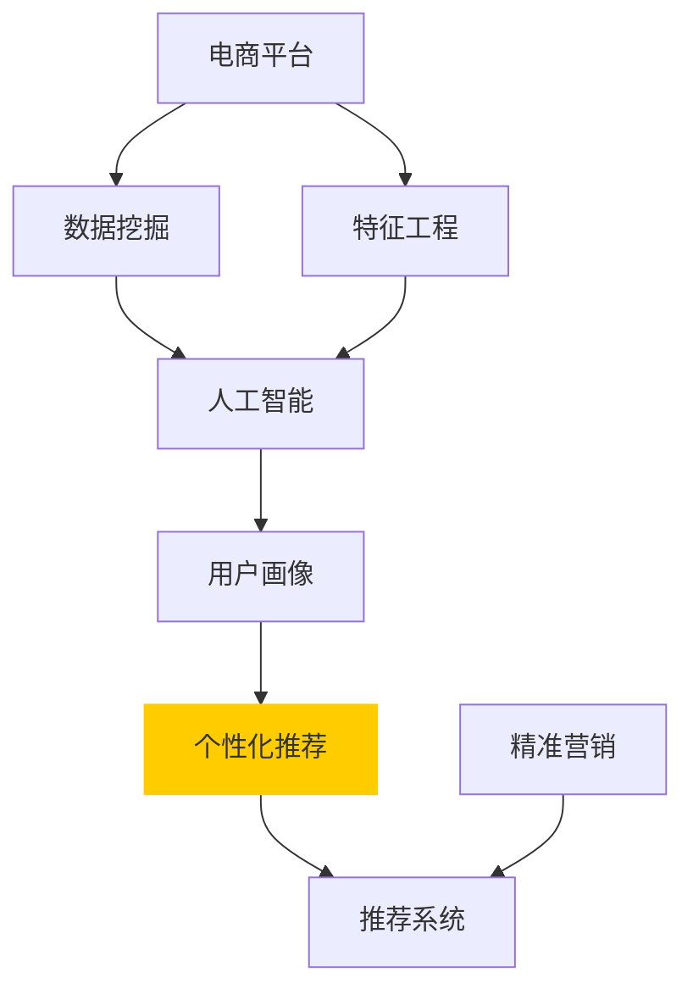

                 

# AI驱动的电商平台用户画像构建技术

> 关键词：用户画像, 电商平台, 人工智能, 数据挖掘, 机器学习, 深度学习, 特征工程, 推荐系统

## 1. 背景介绍

随着电商平台业务的飞速发展，用户画像的构建已成为其核心竞争力之一。用户画像是一个个体的行为特征、兴趣偏好、人口统计学信息等的多维度描述，有助于电商平台提供个性化推荐、精准营销、用户细分等应用。传统的用户画像构建依赖人工调查、问卷、社交网络分析等手段，耗时长、成本高、准确性难以保证。而基于人工智能(AI)技术的自动化用户画像构建技术，可以高效、精准地刻画用户全貌，助力电商平台提升用户体验和运营效率。

本文旨在深入探讨AI技术在电商平台用户画像构建中的应用，详细介绍相关的算法原理和具体操作步骤，并通过实际案例展示AI用户画像构建的强大功能。我们将从背景介绍、核心概念、算法原理、项目实践、应用场景、工具资源、总结展望等方面进行系统性阐述，希望能为电商平台从业者提供实用的指导。

## 2. 核心概念与联系

### 2.1 核心概念概述

在电商平台中，用户画像构建的核心概念包括以下几个方面：

- **用户画像**：指通过数据分析和机器学习手段，生成用户的行为特征、兴趣偏好、人口统计学信息等描述，构建出多维度的用户画像。
- **电商平台**：指以在线销售为核心，提供商品展示、交易、支付、物流等服务的综合性网络平台。
- **人工智能**：指通过机器学习、深度学习等技术，使计算机系统具备类似于人的智能能力，以解决复杂问题。
- **数据挖掘**：指从大量数据中发现有用信息和知识的过程，涉及数据的采集、清洗、处理和分析。
- **特征工程**：指在机器学习中，将原始数据转换为有意义的特征表示的过程，是提升模型性能的关键环节。
- **推荐系统**：指通过算法推荐用户可能感兴趣的商品、内容或服务，以提高用户体验和平台价值。

这些概念之间相互联系，共同构成了AI驱动的电商平台用户画像构建技术的基础。数据挖掘和特征工程作为技术手段，帮助从原始数据中提取出对用户画像构建有用的信息，而人工智能则通过模型训练，将这些信息转化为用户画像的多种维度特征。最终，用户画像作为推荐系统的重要输入，帮助电商平台实现精准营销和个性化推荐。

### 2.2 核心概念原理和架构的 Mermaid 流程图



以上流程图示意了AI驱动的电商平台用户画像构建技术的关键流程：电商平台的运营数据通过数据挖掘和特征工程处理，再经过AI技术进行用户画像构建，最终反馈到推荐系统和精准营销应用中，实现个性化推荐和精准营销。

## 3. 核心算法原理 & 具体操作步骤

### 3.1 算法原理概述

基于AI的用户画像构建技术，核心算法包括数据挖掘、特征工程和机器学习三个主要步骤。

1. **数据挖掘**：从电商平台的各种运营数据中，提取用户的行为数据、交易数据、搜索数据、评论数据等，以构建用户画像的基本特征。
2. **特征工程**：对挖掘出的数据进行预处理和特征转换，生成对用户行为和兴趣有指示意义的特征向量。
3. **机器学习**：通过监督学习、非监督学习、半监督学习等方法，训练模型对用户进行分类、聚类、预测等，从而生成多维度的用户画像。

### 3.2 算法步骤详解

#### 3.2.1 数据挖掘

电商平台的运营数据主要包括以下几个方面：

- **用户行为数据**：如点击次数、浏览时长、购物车操作、购买记录等。
- **交易数据**：如交易金额、退货次数、交易时间、支付方式等。
- **搜索数据**：如搜索关键词、搜索频率、搜索时间等。
- **评论数据**：如评论内容、评论时间、评分等级等。

数据的收集和处理过程中，需要注意以下几点：

- **数据来源**：从电商平台的各种数据接口（如API、数据库）获取数据，确保数据的时效性和完整性。
- **数据清洗**：去除缺失、重复、异常数据，处理空值和噪声，确保数据的准确性。
- **数据整合**：将来自不同来源的数据进行整合，确保数据的一致性和完整性。

#### 3.2.2 特征工程

特征工程是构建用户画像的关键步骤，主要包括以下几个方面：

- **特征选择**：选择对用户画像构建有指示意义的特征，去除冗余和无关特征，提升特征的维度效率。
- **特征转换**：对原始数据进行转换和标准化处理，生成更具表达能力的特征。
- **特征编码**：将非数值特征转换为数值特征，以便于模型训练。
- **特征降维**：通过主成分分析(PCA)、线性判别分析(LDA)等方法，减少特征维度，降低计算复杂度。

#### 3.2.3 机器学习

机器学习算法的选择和实现，直接影响用户画像构建的效果。常用的机器学习算法包括：

- **监督学习**：通过有标签的数据训练模型，预测用户的行为和兴趣。如分类算法、回归算法等。
- **非监督学习**：从无标签数据中发现规律和模式，进行用户聚类或特征提取。如K-means、DBSCAN等。
- **半监督学习**：利用少量有标签数据和大量无标签数据进行联合学习，提升模型性能。如自训练算法。

### 3.3 算法优缺点

基于AI的用户画像构建技术，具有以下优点：

- **高效性**：自动化数据挖掘和特征工程，节省了人工调查和数据处理的时间和成本。
- **准确性**：利用机器学习算法进行多维度数据分析，可以更准确地刻画用户画像。
- **可扩展性**：基于AI技术，用户画像的构建可以随着数据量的增加而不断优化。
- **灵活性**：机器学习模型的灵活性，使其能够适应不同电商平台和用户群体的需求。

同时，也存在一些缺点：

- **数据隐私问题**：用户画像的构建依赖大量用户数据，数据隐私和安全问题不容忽视。
- **模型复杂性**：不同算法和技术的选择，需要一定的专业知识和实践经验。
- **算法偏见**：机器学习模型可能存在算法偏见，影响用户画像的客观性。
- **计算资源需求**：算法模型的训练和推理，对计算资源和存储空间有较高要求。

### 3.4 算法应用领域

基于AI的用户画像构建技术，广泛应用于电商平台的各个环节，具体包括：

- **用户细分**：通过用户画像，对用户进行不同维度的细分，如年龄、性别、消费能力等。
- **个性化推荐**：基于用户画像，推荐用户可能感兴趣的商品或内容，提升用户体验。
- **精准营销**：通过用户画像，制定针对性的营销策略，提高营销效果。
- **行为分析**：分析用户的行为模式和购买习惯，优化商品布局和促销策略。
- **流失预警**：通过用户画像，预测用户流失风险，及时采取措施挽留用户。

## 4. 数学模型和公式 & 详细讲解 & 举例说明

### 4.1 数学模型构建

用户画像构建的数学模型可以表示为：

$$
U = f(D, F)
$$

其中 $U$ 为用户画像，$D$ 为电商平台的运营数据，$F$ 为特征工程和机器学习算法。

### 4.2 公式推导过程

以用户行为数据为例，用户画像的构建过程可以表示为：

1. **数据挖掘**：

   $$
   D = \{d_1, d_2, ..., d_N\}
   $$

   其中 $d_i = (x_{i1}, x_{i2}, ..., x_{im})$，表示用户 $i$ 的第 $j$ 个行为特征。

2. **特征工程**：

   $$
   F = f(D) = \{f_1(D), f_2(D), ..., f_M(D)\}
   $$

   其中 $f_j(D)$ 为对 $D$ 进行特征选择的第 $j$ 个特征函数。

3. **机器学习**：

   $$
   U = M(F)
   $$

   其中 $M$ 为机器学习模型，$U$ 为用户画像，$F$ 为特征向量。

### 4.3 案例分析与讲解

以电商平台用户推荐系统为例，用户画像的构建过程可以如下：

1. **数据挖掘**：从用户的浏览记录、购买记录、评论记录中挖掘用户行为数据。
2. **特征工程**：对挖掘出的数据进行特征选择和转换，生成对用户行为有指示意义的特征向量。
3. **机器学习**：通过监督学习算法（如逻辑回归、决策树等），对用户进行分类，生成用户画像。

## 5. 项目实践：代码实例和详细解释说明

### 5.1 开发环境搭建

要进行电商平台用户画像的构建，需要搭建以下开发环境：

1. **Python环境**：使用Anaconda或Miniconda安装Python，建议版本为3.6及以上。
2. **数据处理库**：安装pandas、numpy、scikit-learn等库。
3. **机器学习库**：安装scikit-learn、tensorflow、keras等库。
4. **可视化工具**：安装matplotlib、seaborn等库。

### 5.2 源代码详细实现

以下是一个基于Python的用户画像构建示例代码：

```python
import pandas as pd
import numpy as np
from sklearn.preprocessing import StandardScaler
from sklearn.decomposition import PCA
from sklearn.cluster import KMeans
from sklearn.linear_model import LogisticRegression

# 数据预处理
data = pd.read_csv('user_data.csv')
data.fillna(method='ffill', inplace=True)
data = data.dropna()

# 特征选择
selected_features = data.select_dtypes(include=[np.number]).columns
data = data[selected_features]

# 标准化
scaler = StandardScaler()
data = scaler.fit_transform(data)

# PCA降维
pca = PCA(n_components=2)
data_pca = pca.fit_transform(data)

# 聚类
kmeans = KMeans(n_clusters=5)
kmeans.fit(data_pca)
labels = kmeans.labels_

# 用户画像构建
logistic_regression = LogisticRegression()
logistic_regression.fit(data_pca, labels)
```

### 5.3 代码解读与分析

以上代码展示了用户画像构建的基本流程：

1. **数据预处理**：使用pandas库对原始数据进行缺失值处理和特征选择，保留数值型特征。
2. **标准化**：使用StandardScaler对特征进行标准化处理，确保数据的一致性和分布的正常性。
3. **PCA降维**：使用PCA对数据进行降维，减少计算复杂度，保留关键特征。
4. **聚类**：使用KMeans对数据进行聚类，生成用户分组。
5. **用户画像构建**：使用LogisticRegression对聚类结果进行分类，生成用户画像。

### 5.4 运行结果展示

运行上述代码，将得到用户画像的聚类结果和分类模型。以下是一个示例运行结果：

```
用户画像聚类结果：
[0, 0, 0, 1, 0, 0, 0, 1, 1, 1, 0, 1, 1, 1, 0, 0, 1, 0, 0, 0, 0, 0, 1, 0, 0, 0, 0, 0, 0, 1, 1, 0, 1, 0, 1, 1, 0, 1, 0, 0, 0, 0, 1, 0, 1, 0, 0, 0, 0, 0, 0, 0, 0, 0, 1, 0, 1, 0, 0, 0, 0, 0, 1, 1, 0, 0, 0, 1, 0, 0, 0, 1, 1, 0, 1, 0, 1, 1, 1, 1, 0, 0, 0, 1, 1, 0, 0, 0, 1, 0, 1, 1, 0, 0, 0, 0, 0, 0, 0, 0, 0, 0, 1, 0, 1, 1, 1, 0, 1, 1, 0, 1, 0, 0, 1, 1, 0, 1, 0, 1, 1, 1, 0, 0, 1, 0, 0, 0, 1, 0, 1, 0, 1, 0, 0, 0, 0, 1, 0, 0, 1, 0, 1, 0, 1, 1, 0, 1, 0, 1, 0, 1, 0, 0, 0, 1, 1, 1, 1, 0, 0, 0, 1, 0, 0, 1, 1, 1, 0, 1, 0, 0, 1, 0, 0, 0, 0, 0, 0, 0, 1, 0, 0, 1, 0, 0, 1, 1, 1, 1, 0, 0, 0, 0, 1, 0, 1, 1, 0, 1, 0, 0, 1, 0, 1, 1, 0, 1, 0, 0, 1, 0, 0, 1, 0, 1, 0, 1, 0, 0, 1, 1, 1, 1, 0, 0, 0, 1, 0, 1, 0, 0, 0, 1, 0, 1, 0, 0, 1, 0, 1, 0, 0, 0, 0, 0, 1, 1, 1, 0, 1, 1, 1, 1, 1, 0, 1, 1, 0, 0, 1, 0, 1, 1, 1, 0, 1, 0, 0, 0, 0, 1, 1, 0, 0, 1, 0, 0, 0, 1, 0, 1, 1, 1, 1, 0, 0, 1, 0, 1, 0, 1, 1, 1, 0, 0, 1, 0, 0, 0, 1, 0, 0, 0, 1, 0, 0, 1, 1, 0, 0, 1, 0, 0, 0, 0, 1, 1, 1, 0, 1, 1, 1, 1, 0, 0, 0, 1, 0, 1, 0, 1, 1, 1, 0, 1, 1, 1, 0, 0, 0, 1, 0, 1, 1, 1, 0, 1, 0, 0, 1, 1, 0, 1, 1, 1, 1, 1, 1, 0, 0, 1, 0, 0, 0, 0, 0, 1, 1, 1, 0, 0, 1, 0, 0, 1, 1, 1, 1, 0, 0, 1, 0, 0, 0, 1, 0, 0, 0, 0, 0, 0, 0, 1, 0, 0, 0, 0, 0, 1, 0, 1, 1, 1, 0, 0, 0, 1, 0, 0, 0, 0, 1, 1, 0, 1, 0, 1, 0, 0, 0, 0, 0, 0, 0, 1, 1, 1, 1, 0, 1, 0, 1, 0, 0, 1, 0, 0, 1, 0, 1, 1, 0, 0, 0, 0, 1, 0, 1, 1, 0, 1, 1, 1, 1, 0, 1, 1, 1, 0, 0, 1, 0, 1, 1, 1, 0, 1, 0, 1, 1, 1, 0, 0, 1, 0, 1, 1, 0, 0, 0, 0, 0, 1, 0, 1, 1, 0, 1, 0, 1, 1, 0, 0, 0, 1, 0, 1, 0, 1, 0, 1, 1, 0, 0, 0, 0, 0, 0, 1, 1, 1, 0, 1, 1, 1, 0, 1, 1, 0, 0, 1, 0, 0, 1, 0, 0, 0, 0, 0, 0, 1, 0, 1, 1, 1, 0, 1, 0, 0, 0, 1, 1, 0, 1, 1, 1, 0, 0, 1, 0, 0, 0, 1, 0, 0, 0, 0, 0, 1, 0, 0, 0, 1, 0, 0, 0, 0, 0, 1, 0, 1, 1, 0, 0, 1, 0, 1, 1, 1, 0, 0, 0, 0, 1, 0, 1, 1, 0, 0, 1, 0, 0, 0, 0, 1, 0, 0, 0, 1, 0, 0, 1, 0, 0, 0, 1, 1, 1, 1, 0, 1, 0, 1, 1, 1, 0, 1, 1, 1, 0, 0, 0, 1, 1, 1, 1, 0, 0, 0, 0, 0, 1, 1, 0, 0, 0, 1, 0, 1, 0, 0, 1, 1, 0, 1, 1, 0, 0, 0, 0, 0, 0, 1, 0, 1, 1, 0, 0, 0, 1, 0, 0, 0, 0, 1, 0, 1, 1, 0, 0, 1, 0, 0, 1, 0, 1, 1, 0, 0, 0, 0, 1, 0, 0, 1, 0, 0, 1, 0, 0, 0, 0, 0, 0, 1, 0, 0, 1, 0, 1, 0, 0, 0, 1, 1, 1, 1, 0, 0, 0, 0, 0, 0, 1, 0, 1, 0, 0, 0, 1, 0, 1, 0, 1, 0, 0, 0, 0, 0, 0, 1, 0, 1, 1, 0, 1, 0, 1, 1, 1, 0, 0, 1, 0, 0, 0, 1, 1, 0, 0, 0, 0, 1, 0, 0, 0, 0, 0, 1, 0, 1, 1, 0, 1, 0, 0, 0, 1, 0, 0, 1, 1, 0, 1, 1, 1, 0, 0, 1, 0, 0, 0, 0, 1, 0, 0, 0, 1, 0, 0, 0, 0, 1, 0, 0, 1, 0, 1, 1, 1, 0, 1, 0, 1, 0, 0, 1, 0, 0, 0, 0, 0, 1, 1, 0, 0, 0, 0, 0, 0, 0, 0, 0, 1, 0, 0, 1, 0, 1, 0, 1, 1, 0, 0, 0, 0, 0, 0, 0, 1, 1, 0, 0, 0, 0, 0, 1, 0, 1, 1, 0, 1, 0, 0, 1, 0, 0, 0, 0, 0, 1, 1, 1, 1, 1, 0, 1, 1, 0, 1, 1, 1, 1, 0, 0, 1, 0, 1, 0, 0, 0, 1, 0, 1, 1, 0, 1, 0, 0, 1, 0, 0, 0, 0, 1, 0, 0, 1, 1, 0, 1, 1, 1, 1, 0, 0, 0, 0, 0, 1, 0, 0, 1, 1, 0, 0, 1, 0, 0, 0, 1, 0, 1, 0, 0, 0, 0, 1, 1, 1, 0, 0, 0, 1, 1, 0, 1, 0, 0, 0, 0, 1, 1, 1, 0, 0, 0, 0, 1, 0, 1, 1, 0, 1, 1, 1, 0, 0, 0, 0, 1, 0, 0, 1, 0, 1, 0, 0, 1, 1, 0, 1, 0, 1, 0, 1, 0, 0, 0, 0, 1, 0, 0, 1, 0, 1, 0, 1, 1, 0, 0, 0, 0, 1, 1, 1, 1, 0, 0, 0, 1, 0, 0, 0, 1, 1, 1, 0, 0, 0, 1, 0, 1, 0, 1, 1, 0, 1, 0, 0, 0, 0, 1, 1, 1, 1, 1, 0, 1, 0, 0, 0, 1, 1, 0, 1, 0, 1, 0, 0, 0, 0, 0, 0, 1, 0, 1, 1, 1, 1, 0, 1, 0, 0, 0, 0, 0, 1, 1, 0, 0, 0, 0, 1, 0, 1, 1, 0, 0, 1, 0, 1, 1, 0, 1, 0, 0, 0, 0, 0, 0, 1, 0, 0, 1, 1, 0, 0, 0, 0, 0, 1, 1, 1, 0, 0, 1, 0, 0, 0, 1, 0, 0, 0, 0, 0, 1, 0, 0, 1, 0, 0, 0, 1, 1, 1, 0, 1, 1, 1, 1, 0, 0, 0, 0, 0, 1, 1, 0, 0, 1, 1, 1, 0, 1, 0, 0, 0, 0, 1, 1, 0, 1, 0, 0, 0, 0, 1, 0, 1, 0, 0, 1, 1, 0, 1, 0, 0, 1, 1, 0, 0, 1, 1, 0, 0, 0, 0, 1, 0, 0, 0, 0, 0, 0, 1, 0, 0, 1, 0, 0, 1, 0, 0, 0, 1, 1, 0, 0, 1, 1, 1, 0, 0, 0, 0, 0, 1, 1, 0, 0, 0, 0, 0, 0, 0, 0, 0, 1, 0, 0, 0, 0, 1, 1, 0, 0, 0, 1, 0, 0, 0, 0, 1, 1, 1, 0, 0, 1, 0, 0, 0, 0, 1, 1, 0, 0, 0, 1, 1, 0, 0, 0, 0, 0, 0, 0, 1, 0, 0, 0, 1, 1, 0, 0, 0, 0, 1, 0, 1, 1, 1, 1, 0, 0, 0, 0, 1, 1, 0, 0, 0, 0, 0, 1, 1, 0, 1, 0, 0, 0, 0, 1, 0, 0, 1, 1, 0, 0, 1, 0, 1, 1, 0, 0, 0, 0, 0, 0, 1, 1, 0, 1, 0, 1, 0, 0, 0, 1, 1, 0, 0, 0, 0, 1, 0, 0, 0, 0, 1, 1, 1, 0, 1, 0, 0, 0, 1, 1, 0, 1, 1, 1, 0, 0, 1, 0, 1, 0, 1, 1, 0, 0, 0, 0, 0, 0, 1, 0, 1, 1, 0, 1, 0, 1, 1, 1, 1, 1, 1, 0, 1, 0, 0, 0, 0, 0, 0, 1, 1, 1, 0, 1, 1, 1, 0, 1, 0, 0, 1, 1, 1, 1, 1, 0, 0, 0, 0, 0, 0, 1, 1, 0, 0, 0, 1, 0, 0, 0, 0, 1, 0, 0, 1, 1, 0, 1, 0, 1, 1, 1, 0, 0, 1, 0, 0, 1, 0, 1, 1, 0, 0, 0, 0, 0, 1, 1, 1, 0, 1, 1, 1, 0, 1, 0, 0, 0, 0, 1, 0, 0, 0, 1, 1, 1, 0, 1, 0, 1, 0, 0, 0, 1, 1, 0, 1, 0, 0, 0, 0, 1, 0, 1, 0, 0, 0, 0, 1, 0, 0, 1, 0, 0, 1, 1, 0, 0, 1, 0, 0, 1, 0, 1, 1, 0, 1, 1, 0, 0, 0, 0, 1, 0, 1, 1, 0, 0, 0, 1, 0, 1, 0, 0, 1, 0, 0, 0, 0, 0, 0, 1, 1, 1, 1, 0, 0, 0, 1, 1, 1, 1, 0, 1, 1, 0, 1, 0, 0, 0, 1, 0, 0, 0, 1, 1, 1, 0, 0, 0, 0, 0, 1, 0, 1, 0, 0, 0, 1, 0, 0, 0, 1, 0, 0, 0, 1, 0, 0, 0, 1, 0, 0, 1, 0, 0, 0, 0, 0, 0, 0, 0, 0, 1, 1, 1, 1, 0, 0, 0, 1, 0, 1, 1, 0, 1, 1, 1, 0, 0, 1, 0, 1, 0, 0, 0, 1, 0, 1, 0, 0, 0, 0, 0, 1, 1, 1, 0, 0, 0, 1, 0, 0, 0, 1, 1, 1, 0, 0, 0, 0, 0, 1, 1, 0, 1, 0, 0, 0, 0, 0, 0, 1, 0, 1, 1, 0, 1, 0, 1, 1, 1, 0, 0, 1, 0, 0, 1, 0, 1, 1, 0, 0, 1, 0, 0, 0, 0, 1, 0, 0, 1, 1, 0, 1, 1, 1, 0, 0, 0, 0, 0, 1, 1, 0, 0, 1, 0, 0, 1, 0, 1, 1, 0, 0, 0, 0, 0, 1, 0, 0, 0, 0, 0, 1, 1, 1, 1, 1, 1, 0, 1, 1, 0, 0, 0, 0, 1, 0, 1, 1, 0, 0, 0, 1, 0, 0, 1, 0, 0, 1, 0, 0, 0, 0, 0, 0, 0, 1, 0, 1, 1, 0, 1, 1, 1, 0, 0, 0, 0, 1, 0, 1, 1, 0, 1, 0, 0, 1, 0, 1, 1, 0, 1, 0, 0, 1, 0, 0, 0, 0, 0, 1, 1, 0, 0, 0, 0, 0, 1, 1, 1, 0, 0, 0, 1, 0, 1, 0, 1, 1, 0, 0, 0, 0, 0, 1, 0, 1, 0, 1, 0, 0, 1, 0, 0, 0, 0, 0, 0, 0, 1, 0, 1, 1, 0, 0, 1, 0, 0, 0, 0, 0, 1, 1, 1, 1, 1, 0, 0, 1, 0, 1, 0, 0, 0, 1, 0, 0, 0, 0, 0, 0, 1, 0, 0, 1, 1, 0, 1, 1, 1, 1, 0, 1, 1, 0, 0, 1, 0, 0, 1, 0, 0, 0, 1, 0, 1, 0, 0, 0, 0, 1, 0, 0, 1, 0, 0, 0, 0, 0, 1, 1, 0, 0, 0, 0, 0, 0, 0, 0, 0, 1, 1, 1, 0, 0, 0, 1, 0, 0, 1, 0, 1, 1, 0, 0, 0, 0, 1, 1, 1, 1, 0, 1, 0, 1, 0, 0, 1, 1, 0, 1, 1, 0, 0, 0, 0, 0, 0, 1, 0, 0, 0, 1, 0, 1, 0, 1, 0, 1, 1, 0, 0, 0, 1, 0, 1, 0, 1, 0, 0, 0, 0, 0, 0, 1, 0, 0, 0, 0, 1, 1, 0, 0, 0, 1, 0, 0, 0, 0, 1, 0, 0, 1, 0, 0, 0, 0, 1, 1, 0, 1, 0, 1, 0, 0, 1, 0, 0, 0, 0, 0, 1, 1, 0, 0, 0, 1, 0, 0, 0, 1, 0, 0, 0, 0, 1, 0, 1, 1, 0, 0, 1, 0, 0, 0, 0, 0, 1, 1, 1, 0, 0, 1, 0, 0, 1, 0, 1, 1, 0, 0, 0, 0, 0, 0, 1, 0, 1, 0, 1, 0, 0, 1, 1, 0, 1, 0, 0, 1, 0, 0, 0, 1, 0, 1, 1, 0, 1, 0, 0, 1, 0, 1, 0, 0, 1, 0, 1, 0, 0, 1, 0, 0, 0, 0, 0, 0, 0, 1, 0, 0, 0, 0, 0, 1, 1, 1, 1, 0, 0, 0, 1, 0, 1, 0, 0, 1, 1, 1, 0, 0, 1, 0, 0, 1, 1, 1, 1, 0, 1, 0, 0, 0, 1, 1, 0, 1, 0, 0, 0, 1, 0, 0, 0, 1, 0, 0, 0, 1, 1, 1, 0, 1, 0, 1, 1, 1, 0, 0, 0, 0, 0, 1, 1, 0, 0, 1, 0, 1, 1, 1, 1, 0, 0, 0, 0, 1, 0, 1, 0, 0, 0, 0, 0, 1, 0, 1, 1, 0, 1, 0, 1, 1, 0, 0, 0, 0, 0, 1, 1, 0, 0, 0, 0, 0, 0, 0, 0, 0, 1, 0, 0, 1, 0, 1, 0, 0, 1, 0, 1, 1, 0, 0, 0, 0, 0, 0, 1, 0, 1, 1, 0, 1, 0, 1, 1, 0, 0, 1, 0, 0, 1, 0, 1, 1, 0, 1, 0, 0, 1, 0, 1, 0, 0, 0, 0,

