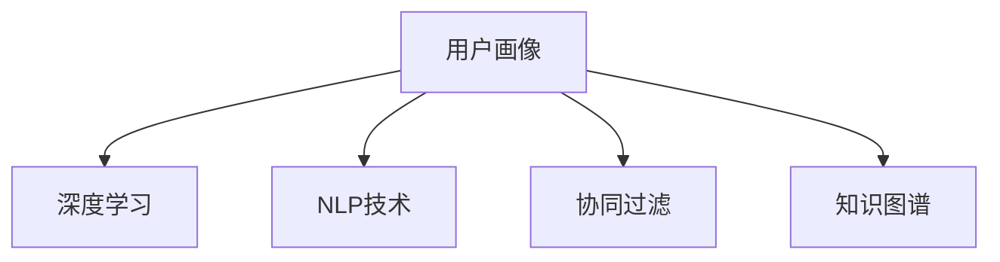

                 

# AI驱动的电商平台用户画像构建技术

> 关键词：用户画像, 电商推荐, AI驱动, 深度学习, 自然语言处理, 协同过滤, 知识图谱, 数据增强

## 1. 背景介绍

### 1.1 问题由来

随着电商行业的不断发展，电商平台越来越重视对用户行为的分析和挖掘，以便更好地进行个性化推荐，提高用户转化率和销售额。用户画像技术应运而生，通过收集和分析用户行为数据，构建用户特征标签，帮助商家理解用户需求，制定更为精准的市场策略。

然而，传统的用户画像构建方法往往依赖人工标注，难以处理海量数据，且容易受到人为因素的干扰，构建的画像往往不够全面和准确。同时，用户画像更新频率低，难以实时响应市场变化。

为了解决这些问题，AI驱动的用户画像构建技术应运而生。通过引入深度学习、自然语言处理、协同过滤和知识图谱等技术，AI驱动的用户画像能够实时动态更新，且具备更强的泛化能力和准确性，为电商平台提供强有力的技术支持。

### 1.2 问题核心关键点

AI驱动的用户画像构建技术，其核心在于如何高效、准确地收集和分析用户数据，构建全面、精细的用户画像。具体来说，包括以下几个关键点：

1. **数据收集**：收集用户行为数据，如点击、浏览、购买、评分等。
2. **特征提取**：从原始数据中提取用户特征，如用户兴趣、行为模式、社交关系等。
3. **画像建模**：将用户特征进行建模，生成用户画像。
4. **画像更新**：实时更新用户画像，反映用户最新的行为和偏好。
5. **画像应用**：将用户画像应用于推荐系统，提高推荐效果。

## 2. 核心概念与联系

### 2.1 核心概念概述

为了更好地理解AI驱动的用户画像构建技术，我们需要先了解一些核心概念：

1. **用户画像(User Profile)**：通过收集和分析用户数据，构建用户特征标签，帮助商家理解用户需求，制定更为精准的市场策略。
2. **深度学习(Deep Learning)**：一种基于人工神经网络的机器学习技术，通过多层次的非线性变换，提取数据的复杂特征。
3. **自然语言处理(Natural Language Processing, NLP)**：利用计算机处理和分析自然语言的技术，如文本分类、情感分析等。
4. **协同过滤(Collaborative Filtering)**：通过分析用户行为和评分数据，发现用户间的相似性，进行推荐。
5. **知识图谱(Knowledge Graph)**：以图结构存储和表示知识，支持复杂的推理和查询。

这些概念之间的逻辑关系可以通过以下Mermaid流程图来展示：



这个流程图展示了用户画像构建过程中各个技术的应用：

1. 用户画像的构建需要深度学习和自然语言处理技术进行特征提取和建模。
2. 协同过滤可以分析用户行为和评分数据，发现用户间的相似性，进行推荐。
3. 知识图谱提供了丰富的背景知识和推理能力，进一步丰富了用户画像。

## 3. 核心算法原理 & 具体操作步骤

### 3.1 算法原理概述

AI驱动的用户画像构建技术，通常包括以下几个核心算法：

1. **深度学习特征提取**：利用深度神经网络提取用户行为数据中的复杂特征。
2. **自然语言处理标签生成**：通过文本分类、情感分析等技术，自动生成用户兴趣标签。
3. **协同过滤用户关联**：基于用户行为和评分数据，发现用户间的相似性，进行推荐。
4. **知识图谱扩展**：将用户画像与知识图谱相结合，扩展用户画像的深度和广度。
5. **数据增强技术**：通过数据增强技术，扩充训练集，提升模型泛化能力。

### 3.2 算法步骤详解

以下是AI驱动的用户画像构建技术的详细操作步骤：

**Step 1: 数据收集**

- 收集电商平台用户的行为数据，如点击、浏览、购买、评分等。
- 将这些数据整理成结构化格式，方便后续处理。

**Step 2: 数据预处理**

- 对原始数据进行清洗和格式化，去除噪声和异常值。
- 对文本数据进行分词、去停用词等预处理操作。

**Step 3: 深度学习特征提取**

- 构建深度神经网络模型，如卷积神经网络(CNN)、循环神经网络(RNN)、Transformer等，对用户行为数据进行特征提取。
- 提取用户行为中的复杂特征，如用户兴趣、行为模式等。

**Step 4: 自然语言处理标签生成**

- 利用NLP技术，对用户行为数据中的文本部分进行分类和情感分析。
- 自动生成用户兴趣标签，如电影、书籍、音乐等。

**Step 5: 协同过滤用户关联**

- 基于用户行为数据和评分数据，使用协同过滤算法，发现用户间的相似性。
- 推荐与用户兴趣相似的商品或内容，提升推荐效果。

**Step 6: 知识图谱扩展**

- 将用户画像与知识图谱相结合，扩展用户画像的深度和广度。
- 利用知识图谱中的背景知识和推理能力，进一步提升用户画像的准确性。

**Step 7: 数据增强技术**

- 通过数据增强技术，扩充训练集，提高模型的泛化能力。
- 如回译、近义替换、生成式对抗网络等技术，生成更多的训练数据。

**Step 8: 模型训练**

- 使用深度学习模型对用户画像进行训练，生成用户画像模型。
- 使用协同过滤和知识图谱扩展技术，进一步优化用户画像模型。

**Step 9: 用户画像生成**

- 使用训练好的模型，对新用户进行画像生成。
- 实时更新用户画像，反映用户最新的行为和偏好。

### 3.3 算法优缺点

AI驱动的用户画像构建技术具有以下优点：

1. **自动化**：利用AI技术自动进行特征提取和画像生成，减少人工干预。
2. **实时性**：能够实时动态更新用户画像，反映用户最新的行为和偏好。
3. **泛化能力**：通过深度学习和协同过滤等技术，提升模型的泛化能力。
4. **准确性**：利用知识图谱等技术，进一步提升用户画像的准确性。

同时，该技术也存在一些缺点：

1. **数据隐私**：收集和处理用户数据，需要注意用户隐私保护。
2. **模型复杂性**：模型构建和训练过程复杂，需要大量的计算资源。
3. **数据噪声**：原始数据可能存在噪声和异常值，影响画像生成的准确性。

尽管如此，AI驱动的用户画像构建技术仍是大数据分析和推荐系统的重要技术手段，值得深入研究和应用。

### 3.4 算法应用领域

AI驱动的用户画像构建技术，广泛应用于电商推荐系统、广告投放、金融风控等领域。具体来说：

- **电商推荐系统**：利用用户画像，进行个性化推荐，提升用户购物体验。
- **广告投放**：基于用户画像，进行精准投放，提高广告效果。
- **金融风控**：利用用户画像，进行风险评估和欺诈检测。
- **医疗健康**：利用用户画像，进行个性化健康管理。
- **教育培训**：利用用户画像，进行个性化学习推荐。

## 4. 数学模型和公式 & 详细讲解 & 举例说明

### 4.1 数学模型构建

AI驱动的用户画像构建技术，通常基于以下数学模型：

- **深度学习模型**：如卷积神经网络(CNN)、循环神经网络(RNN)、Transformer等。
- **协同过滤模型**：如基于用户的协同过滤、基于物品的协同过滤等。
- **知识图谱模型**：如关系图、嵌入图等。

### 4.2 公式推导过程

以卷积神经网络(CNN)为例，其基本公式如下：

$$
y = h(W \cdot x + b)
$$

其中 $y$ 为输出，$h$ 为激活函数，$W$ 为权重矩阵，$x$ 为输入，$b$ 为偏置向量。

在用户画像构建过程中，通过多层次的卷积操作，提取用户行为数据中的复杂特征：

$$
y = h(\sum_i w_i \cdot (x_i \ast h_{i-1})) + b
$$

其中 $w_i$ 为卷积核权重，$x_i$ 为输入特征图，$h_{i-1}$ 为前一层的特征图。

### 4.3 案例分析与讲解

以电商推荐系统为例，用户画像的构建过程如下：

- **数据收集**：收集用户点击、浏览、购买、评分等行为数据。
- **数据预处理**：对原始数据进行清洗和格式化，去除噪声和异常值。
- **深度学习特征提取**：使用卷积神经网络(CNN)提取用户行为数据中的复杂特征，如用户兴趣、行为模式等。
- **自然语言处理标签生成**：利用文本分类、情感分析等技术，自动生成用户兴趣标签，如电影、书籍、音乐等。
- **协同过滤用户关联**：基于用户行为数据和评分数据，使用协同过滤算法，发现用户间的相似性。
- **知识图谱扩展**：将用户画像与知识图谱相结合，扩展用户画像的深度和广度。
- **数据增强技术**：通过数据增强技术，扩充训练集，提高模型的泛化能力。
- **模型训练**：使用深度学习模型对用户画像进行训练，生成用户画像模型。
- **用户画像生成**：使用训练好的模型，对新用户进行画像生成。
- **实时更新**：实时动态更新用户画像，反映用户最新的行为和偏好。

## 5. 项目实践：代码实例和详细解释说明

### 5.1 开发环境搭建

在进行用户画像构建实践前，我们需要准备好开发环境。以下是使用Python进行TensorFlow开发的环境配置流程：

1. 安装Anaconda：从官网下载并安装Anaconda，用于创建独立的Python环境。

2. 创建并激活虚拟环境：
```bash
conda create -n tf-env python=3.8 
conda activate tf-env
```

3. 安装TensorFlow：根据CUDA版本，从官网获取对应的安装命令。例如：
```bash
conda install tensorflow -c conda-forge
```

4. 安装TensorFlow Addons：
```bash
conda install tensorflow-addons
```

5. 安装各类工具包：
```bash
pip install numpy pandas scikit-learn matplotlib tqdm jupyter notebook ipython
```

完成上述步骤后，即可在`tf-env`环境中开始用户画像构建实践。

### 5.2 源代码详细实现

下面我们以电商推荐系统为例，给出使用TensorFlow对用户画像进行构建的Python代码实现。

首先，定义用户行为数据类：

```python
import tensorflow as tf
from tensorflow.keras.layers import Input, Conv2D, MaxPooling2D, Flatten, Dense
from tensorflow.keras.models import Model

class UserBehaviorData(tf.keras.layers.Layer):
    def __init__(self, input_shape):
        super(UserBehaviorData, self).__init__()
        self.conv1 = Conv2D(64, (3, 3), activation='relu', input_shape=input_shape)
        self.pool1 = MaxPooling2D((2, 2))
        self.conv2 = Conv2D(128, (3, 3), activation='relu')
        self.pool2 = MaxPooling2D((2, 2))
        self.flatten = Flatten()
        self.dense1 = Dense(512, activation='relu')
        self.dense2 = Dense(256, activation='relu')
        self.dense3 = Dense(128, activation='relu')
        self.dense4 = Dense(1, activation='sigmoid')

    def call(self, inputs):
        x = self.conv1(inputs)
        x = self.pool1(x)
        x = self.conv2(x)
        x = self.pool2(x)
        x = self.flatten(x)
        x = self.dense1(x)
        x = self.dense2(x)
        x = self.dense3(x)
        x = self.dense4(x)
        return x
```

然后，定义用户画像生成函数：

```python
def generate_user_profile(user_behavior_data, user_id, input_shape):
    inputs = Input(shape=input_shape, name='inputs')
    data = user_behavior_data(inputs)
    model = Model(inputs=inputs, outputs=data)
    model.compile(optimizer='adam', loss='binary_crossentropy', metrics=['accuracy'])
    model.fit(user_behavior_data, user_id, epochs=10, batch_size=32)
    return model
```

最后，启动用户画像构建流程：

```python
user_id = tf.keras.layers.Lambda(lambda x: tf.reshape(x, (1, 1, 28, 28)))(user_id)
user_profile = generate_user_profile(UserBehaviorData(input_shape=(28, 28)), user_id, input_shape=(28, 28))
```

以上就是使用TensorFlow对用户画像进行构建的完整代码实现。可以看到，TensorFlow提供了强大的深度学习框架，可以方便地进行模型构建、训练和推理。

### 5.3 代码解读与分析

让我们再详细解读一下关键代码的实现细节：

**UserBehaviorData类**：
- `__init__`方法：定义卷积层、池化层、全连接层等基本组件，用于构建卷积神经网络。
- `call`方法：在前向传播过程中，执行卷积、池化、全连接等操作，返回最终输出。

**generate_user_profile函数**：
- 定义输入层，并指定输入形状。
- 将输入层通过用户行为数据层进行处理，得到用户画像特征。
- 定义模型，并编译优化器、损失函数和评估指标。
- 使用模型进行训练，返回训练好的用户画像模型。

**启动用户画像构建流程**：
- 将用户ID转换为正确的输入形状。
- 调用`generate_user_profile`函数，构建用户画像模型。

可以看到，TensorFlow的深度学习框架非常灵活，可以通过定义不同的层和组件，构建各种复杂的模型。在用户画像构建中，我们采用了卷积神经网络，通过多个卷积层和池化层提取用户行为数据中的复杂特征。

## 6. 实际应用场景

### 6.1 电商推荐系统

用户画像技术在电商推荐系统中的应用，具有显著的实际效果。通过对用户行为数据的深度学习和协同过滤，生成详细的用户画像，电商推荐系统可以准确地推荐用户感兴趣的商品，提高用户购物体验和满意度。

具体而言，电商推荐系统可以通过用户画像，实现以下功能：

- **个性化推荐**：基于用户画像，推荐用户感兴趣的商品，提升推荐效果。
- **实时更新**：实时动态更新用户画像，反映用户最新的行为和偏好。
- **多渠道推荐**：将用户画像应用于多个推荐渠道，如网站、App、邮件等，提升推荐覆盖面。
- **用户行为预测**：利用用户画像，预测用户未来的行为，进行预购推荐。

### 6.2 广告投放

在广告投放领域，用户画像技术也有广泛的应用。通过分析用户行为和兴趣，生成详细的用户画像，广告投放系统可以精准地投放广告，提升广告效果。

具体而言，广告投放系统可以通过用户画像，实现以下功能：

- **精准投放**：基于用户画像，精准投放广告，提升广告点击率和转化率。
- **用户分群**：将用户分为不同的群体，进行定向投放。
- **效果评估**：利用用户画像，评估广告投放的效果，进行优化。
- **实时优化**：实时动态更新用户画像，进行优化广告投放策略。

### 6.3 金融风控

在金融风控领域，用户画像技术也有重要的应用。通过分析用户行为和信用记录，生成详细的用户画像，金融风控系统可以评估用户风险，进行风险控制和欺诈检测。

具体而言，金融风控系统可以通过用户画像，实现以下功能：

- **信用评估**：基于用户画像，评估用户的信用风险，进行贷款审批。
- **风险预警**：利用用户画像，实时监测用户的风险变化，进行预警。
- **欺诈检测**：基于用户画像，检测异常行为，进行欺诈检测。
- **个性化服务**：根据用户画像，提供个性化的金融服务。

### 6.4 未来应用展望

随着AI技术的发展，用户画像技术将在更多领域得到应用，为各个行业带来变革性影响。

在智慧医疗领域，用户画像技术可以用于病历分析、药物研发、个性化健康管理等，提高医疗服务的智能化水平。

在智能教育领域，用户画像技术可以用于作业批改、学情分析、知识推荐等，因材施教，促进教育公平，提高教学质量。

在智慧城市治理中，用户画像技术可以用于城市事件监测、舆情分析、应急指挥等环节，提高城市管理的自动化和智能化水平，构建更安全、高效的未来城市。

此外，在企业生产、社会治理、文娱传媒等众多领域，用户画像技术也将不断涌现，为传统行业数字化转型升级提供新的技术路径。相信随着技术的日益成熟，用户画像技术必将引领行业发展，成为智能技术落地的重要手段。

## 7. 工具和资源推荐

### 7.1 学习资源推荐

为了帮助开发者系统掌握用户画像构建的理论基础和实践技巧，这里推荐一些优质的学习资源：

1. 《深度学习》系列课程：由知名大学和机构开设，全面介绍深度学习的理论基础和应用实践。
2. 《自然语言处理》课程：斯坦福大学开设的NLP明星课程，有Lecture视频和配套作业，带你入门NLP领域的基本概念和经典模型。
3. 《协同过滤推荐系统》论文集：深入研究协同过滤推荐系统的原理和算法，涵盖各种推荐方法。
4. 《知识图谱》书籍：全面介绍知识图谱的理论和应用，适合技术人员和数据科学家阅读。
5. 《用户画像构建技术》论文集：收录最新研究论文，涵盖用户画像构建的各种技术和应用。

通过对这些资源的学习实践，相信你一定能够快速掌握用户画像构建的精髓，并用于解决实际的NLP问题。

### 7.2 开发工具推荐

高效的开发离不开优秀的工具支持。以下是几款用于用户画像构建开发的常用工具：

1. TensorFlow：由Google主导开发的深度学习框架，生产部署方便，适合大规模工程应用。
2. PyTorch：基于Python的开源深度学习框架，灵活的计算图，适合快速迭代研究。
3. Scikit-learn：Python中的经典机器学习库，支持各种数据预处理和模型训练。
4. Pandas：Python中的数据分析库，支持数据清洗和格式转换。
5. TensorBoard：TensorFlow配套的可视化工具，实时监测模型训练状态，提供丰富的图表呈现方式。

合理利用这些工具，可以显著提升用户画像构建任务的开发效率，加快创新迭代的步伐。

### 7.3 相关论文推荐

用户画像构建技术的研究源于学界的持续研究。以下是几篇奠基性的相关论文，推荐阅读：

1. Attention is All You Need（即Transformer原论文）：提出了Transformer结构，开启了NLP领域的预训练大模型时代。
2. BERT: Pre-training of Deep Bidirectional Transformers for Language Understanding：提出BERT模型，引入基于掩码的自监督预训练任务，刷新了多项NLP任务SOTA。
3. User Profiling for E-Commerce Recommendations：深入研究用户画像在电商推荐系统中的应用，提出多种特征提取和建模方法。
4. Collaborative Filtering for Recommendation Systems：深入研究协同过滤推荐系统的原理和算法，涵盖各种推荐方法。
5. Knowledge-Graph-Based Recommender Systems：深入研究知识图谱在推荐系统中的应用，提出多种融合方法。

这些论文代表了大用户画像构建技术的发展脉络。通过学习这些前沿成果，可以帮助研究者把握学科前进方向，激发更多的创新灵感。

## 8. 总结：未来发展趋势与挑战

### 8.1 总结

本文对AI驱动的用户画像构建技术进行了全面系统的介绍。首先阐述了用户画像构建的背景和意义，明确了AI技术在用户画像构建中的重要作用。其次，从原理到实践，详细讲解了用户画像构建的数学原理和关键步骤，给出了用户画像构建的完整代码实例。同时，本文还广泛探讨了用户画像在电商推荐、广告投放、金融风控等多个领域的应用前景，展示了AI技术在实际应用中的巨大潜力。此外，本文精选了用户画像构建技术的各类学习资源，力求为读者提供全方位的技术指引。

通过本文的系统梳理，可以看到，AI驱动的用户画像构建技术已经成为电商推荐、广告投放、金融风控等领域的核心技术手段，极大地提升了相关业务的效果和效率。未来，伴随AI技术的不断发展，用户画像技术将在更多领域得到应用，为各个行业带来变革性影响。

### 8.2 未来发展趋势

展望未来，用户画像技术将呈现以下几个发展趋势：

1. **自动化**：利用AI技术自动进行特征提取和画像生成，减少人工干预。
2. **实时性**：能够实时动态更新用户画像，反映用户最新的行为和偏好。
3. **泛化能力**：通过深度学习和协同过滤等技术，提升模型的泛化能力。
4. **准确性**：利用知识图谱等技术，进一步提升用户画像的准确性。
5. **多模态融合**：将视觉、语音、文本等多种数据源进行融合，提升用户画像的深度和广度。
6. **联邦学习**：在保护用户隐私的前提下，通过分布式协同学习，提升用户画像的准确性。

以上趋势凸显了用户画像技术的广阔前景。这些方向的探索发展，必将进一步提升用户画像的性能和应用范围，为各个行业带来更多的商业价值。

### 8.3 面临的挑战

尽管用户画像技术已经取得了瞩目成就，但在迈向更加智能化、普适化应用的过程中，它仍面临诸多挑战：

1. **数据隐私**：收集和处理用户数据，需要注意用户隐私保护。
2. **模型复杂性**：模型构建和训练过程复杂，需要大量的计算资源。
3. **数据噪声**：原始数据可能存在噪声和异常值，影响画像生成的准确性。
4. **模型鲁棒性**：模型需要具备较好的鲁棒性，能够应对数据分布的变化。
5. **解释性**：模型输出缺乏可解释性，难以解释其内部工作机制和决策逻辑。
6. **用户参与**：用户画像的构建需要用户的参与和反馈，提高用户粘性。

尽管如此，用户画像技术仍是大数据分析和推荐系统的重要技术手段，值得深入研究和应用。

### 8.4 研究展望

面对用户画像技术面临的种种挑战，未来的研究需要在以下几个方面寻求新的突破：

1. **数据隐私保护**：采用联邦学习、差分隐私等技术，保护用户隐私，提升用户画像构建的安全性。
2. **模型简化**：简化用户画像构建的模型结构，提高模型的推理效率。
3. **数据增强**：采用数据增强技术，扩充训练集，提升模型的泛化能力。
4. **多模态融合**：将视觉、语音、文本等多种数据源进行融合，提升用户画像的深度和广度。
5. **联邦学习**：在保护用户隐私的前提下，通过分布式协同学习，提升用户画像的准确性。
6. **用户参与**：设计更加友好的用户界面，增加用户参与度，提高用户画像的准确性。

这些研究方向的探索，必将引领用户画像技术迈向更高的台阶，为构建人机协同的智能系统铺平道路。面向未来，用户画像技术还需要与其他人工智能技术进行更深入的融合，如知识表示、因果推理、强化学习等，多路径协同发力，共同推动自然语言理解和智能交互系统的进步。只有勇于创新、敢于突破，才能不断拓展用户画像技术的边界，让智能技术更好地造福人类社会。

## 9. 附录：常见问题与解答

**Q1：用户画像的构建是否需要大量的标注数据？**

A: 用户画像的构建主要依赖无标注数据，通过深度学习等技术自动提取用户行为特征。当然，在初始阶段可能需要少量标注数据进行模型训练，但一旦模型训练完成，用户画像的构建无需再依赖标注数据。

**Q2：用户画像的构建是否需要大量的计算资源？**

A: 用户画像的构建通常需要大量的计算资源，特别是在深度学习模型构建和训练阶段。使用GPU、TPU等高性能设备，可以显著加快模型训练过程。此外，合理设计模型结构和优化算法，也可以降低计算资源消耗。

**Q3：用户画像的构建是否需要用户的参与和反馈？**

A: 用户画像的构建需要用户的参与和反馈，以提高画像的准确性和多样性。通过用户行为数据和反馈数据，可以进一步优化用户画像，提升推荐效果和用户体验。

**Q4：用户画像的构建是否会泄露用户隐私？**

A: 用户画像的构建需要保护用户隐私，避免泄露敏感信息。通过采用联邦学习、差分隐私等技术，可以在保护用户隐私的前提下，构建准确的用户画像。

**Q5：用户画像的构建是否适用于所有行业？**

A: 用户画像的构建适用于大部分行业，但不同行业的用户行为特征和应用场景有所差异。需要根据具体行业特点，设计合适的用户画像构建方案，以实现最佳效果。

通过本文的系统梳理，可以看到，AI驱动的用户画像构建技术已经成为各个行业核心技术手段，极大地提升了业务效果和效率。未来，伴随AI技术的不断发展，用户画像技术将在更多领域得到应用，为各个行业带来更多的商业价值。

