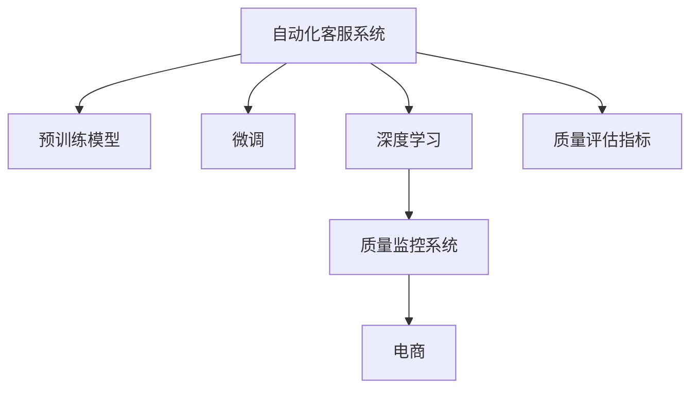

                 

# AI驱动的电商智能客户服务质量监控系统

> 关键词：人工智能,客户服务,质量监控,电商,智能系统

## 1. 背景介绍

### 1.1 问题由来

随着电子商务的迅猛发展，客户服务质量在电商企业的竞争中显得愈发重要。如何在提升客户满意度的同时，降低客服成本，成为电商企业面临的巨大挑战。传统的客服系统往往依赖人工，难以满足客户24小时的需求，且存在沟通不畅、效率低下等问题。为了解决这些问题，电商企业逐渐引入自动化客服系统，通过机器人实现自动化应答，提高服务效率和客户体验。然而，由于缺乏有效的质量监控机制，自动化客服系统的应答质量难以得到保障，系统输出的内容有时无法满足客户的实际需求，甚至引发负面反馈，影响客户满意度。

针对这一现状，本文提出了一种基于AI驱动的电商智能客户服务质量监控系统，通过深度学习技术，自动收集和分析客服系统输出的文本数据，实时监控和评估客服系统的性能，指导客服系统的改进和优化。

### 1.2 问题核心关键点

构建高质量的电商智能客户服务系统，关键在于两个方面：

1. **自动化客服系统的构建**：需要选择合适的预训练模型作为基础，通过微调等技术优化模型的性能，使其能够自动理解用户问题并生成高质量的回复。

2. **质量监控系统的构建**：需要设计高效的质量监控指标，实时评估自动化客服系统的输出质量，及时发现和修复系统缺陷，提升系统性能。

本文将从这两个方面出发，详细介绍如何构建电商智能客户服务系统，并提出一种基于自动化的质量监控机制，实现对客服系统的实时评估和优化。

## 2. 核心概念与联系

### 2.1 核心概念概述

为更好地理解该系统的构建过程，本节将介绍几个密切相关的核心概念：

- **自动化客服系统**：通过预训练模型，对客户提出的问题进行自动分析，并生成相应的回复。自动化客服系统通过微调优化模型性能，提升应答质量和效率。

- **深度学习**：一种通过神经网络结构实现数据自动学习的机器学习方法。深度学习通过多层次的神经网络结构，从数据中学习高层次的特征表示，广泛应用于图像、语音、自然语言处理等领域。

- **质量监控系统**：自动收集和分析客服系统输出的文本数据，实时监控和评估客服系统的性能，指导客服系统的改进和优化。

- **电商**：指通过互联网进行的商品或服务的买卖活动。电商客服系统面向多样化的电商场景，如B2B、B2C等。

- **智能系统**：通过人工智能技术，实现自动化、智能化、高效化的服务系统。

这些核心概念之间的逻辑关系可以通过以下Mermaid流程图来展示：



这个流程图展示了这个系统的核心概念及其之间的关系：

1. 自动化客服系统通过预训练模型获得基础能力。
2. 通过微调优化模型性能，提升应答质量和效率。
3. 深度学习用于模型训练和优化。
4. 质量监控系统自动收集和分析客服系统输出，实时监控系统性能。
5. 系统面向电商场景，为电商客服系统提供支持。
6. 质量评估指标用于实时监控和优化系统性能。

这些概念共同构成了电商智能客户服务系统的核心框架，使其能够在电商场景中提供高质量的客服服务。

## 3. 核心算法原理 & 具体操作步骤

### 3.1 算法原理概述

电商智能客户服务系统主要由两部分组成：自动化客服系统和质量监控系统。其核心算法原理如下：

- **自动化客服系统**：通过预训练模型和微调技术，构建高质量的自动化客服系统。在电商场景中，客户提出的问题通常具有多样性和复杂性，因此需要对预训练模型进行微调，使其能够准确理解和回答不同类型的客户问题。

- **质量监控系统**：设计高效的质量监控指标，自动收集和分析客服系统输出的文本数据，实时监控和评估客服系统的性能，指导客服系统的改进和优化。

### 3.2 算法步骤详解

#### 3.2.1 自动化客服系统的构建

**Step 1: 选择预训练模型和微调任务**
- 选择合适的预训练模型，如BERT、GPT等，作为基础模型。
- 定义微调任务，如分类、匹配、生成等，根据任务特点选择合适的微调目标。

**Step 2: 数据准备**
- 收集电商场景中的客户咨询数据，划分为训练集、验证集和测试集。
- 对数据进行预处理，如去除噪声、标准化、分词等。

**Step 3: 微调模型**
- 使用优化算法（如AdamW、SGD等）进行模型训练，选择合适学习率。
- 设定合适的正则化技术，防止过拟合。
- 使用质量监控指标评估模型性能，根据评估结果调整模型参数。

**Step 4: 部署系统**
- 将训练好的模型部署到电商客服系统中，自动回答客户问题。
- 系统在实时交互中记录客户咨询数据，供后续质量监控使用。

#### 3.2.2 质量监控系统的构建

**Step 1: 设计质量评估指标**
- 根据电商场景的特点，设计适合的质量评估指标，如准确率、召回率、F1分数等。
- 设计多样化的评估指标，涵盖客服系统输出的各个方面，如语义理解、回复质量、情感分析等。

**Step 2: 自动收集和分析客服数据**
- 通过API接口，自动从电商客服系统中获取客户咨询数据。
- 使用自然语言处理技术，对客户咨询数据进行预处理和分词。

**Step 3: 实时监控和评估**
- 根据设计好的质量评估指标，自动计算客服系统输出的质量分数。
- 实时监控客服系统输出质量，根据评估结果生成质量报告，供管理人员参考。

**Step 4: 指导客服系统改进**
- 根据质量报告，识别客服系统的薄弱环节，提出改进建议。
- 在电商客服系统中引入改进措施，如更新模型参数、优化问题模板等。

### 3.3 算法优缺点

基于深度学习的电商智能客户服务系统具有以下优点：

1. **高效性**：通过自动化客服系统，能够24小时不间断地为客户提供服务，提升客户体验。
2. **准确性**：通过深度学习技术，能够准确理解客户问题并生成高质量的回复，提高问题解决率。
3. **实时性**：通过质量监控系统，能够实时监控和评估客服系统性能，快速发现和修复问题。
4. **可扩展性**：系统能够根据电商场景的变化，灵活调整模型参数和质量监控指标，保持系统的高效性和准确性。

然而，该系统也存在一些缺点：

1. **数据依赖性**：系统的性能很大程度上依赖于训练数据的质量和数量，获取高质量的数据成本较高。
2. **模型复杂性**：预训练模型和微调过程较为复杂，需要较高的技术门槛。
3. **对抗攻击**：系统可能受到对抗攻击，如输入噪声、恶意攻击等，导致系统输出质量下降。
4. **隐私问题**：客服系统的交互数据涉及用户隐私，系统需要具备一定的隐私保护机制，防止数据泄露。

### 3.4 算法应用领域

电商智能客户服务系统在电商、金融、医疗等多个领域中都有广泛应用，具体如下：

1. **电商**：通过自动化客服系统，能够提供7x24小时不间断的客户服务，提高客户满意度和忠诚度。
2. **金融**：在金融客服场景中，自动化客服系统能够快速回答客户关于产品、服务、理财等方面的问题，提升服务效率。
3. **医疗**：在医疗客服场景中，自动化客服系统能够提供24小时在线咨询，缓解医生的工作压力，提高医疗服务的可及性。
4. **物流**：在物流客服场景中，自动化客服系统能够实时回答客户关于订单、物流状态、退货等问题，提升客户满意度。

## 4. 数学模型和公式 & 详细讲解 & 举例说明

### 4.1 数学模型构建

电商智能客户服务系统的核心是构建高效的自动化客服系统和质量监控系统。其中，自动化客服系统通过深度学习技术进行构建，质量监控系统通过设计质量评估指标进行评估和优化。

假设电商客服系统输出的文本数据为 $X=\{x_1,x_2,\cdots,x_n\}$，其中 $x_i$ 表示第 $i$ 次客户咨询的文本数据。定义质量评估指标为 $Q=\{q_1,q_2,\cdots,q_k\}$，其中 $q_i$ 表示第 $i$ 个质量评估指标。

自动化客服系统的核心目标是最小化客户咨询数据的损失函数，即：

$$
\min_{\theta} \sum_{i=1}^N \ell(X_i, M_\theta(X_i))
$$

其中 $M_\theta$ 表示模型参数为 $\theta$ 的自动化客服系统，$\ell(X_i, M_\theta(X_i))$ 表示模型在客户咨询数据 $X_i$ 上的损失函数。

质量监控系统的核心目标是通过质量评估指标 $Q$ 评估自动化客服系统的性能，即：

$$
\min_{\theta} \sum_{i=1}^N \sum_{j=1}^k q_j(X_i, M_\theta(X_i))
$$

其中 $q_j(X_i, M_\theta(X_i))$ 表示模型在客户咨询数据 $X_i$ 上的第 $j$ 个质量评估指标。

### 4.2 公式推导过程

在电商客服系统中，自动化客服系统的输出通常为自然语言文本。因此，质量评估指标的设计和计算需要基于自然语言处理技术。以下以准确率、召回率和F1分数为例，进行详细推导：

假设客户咨询数据 $X_i$ 的标注结果为 $y_i$，模型在 $X_i$ 上的输出为 $\hat{y}_i$。则准确率、召回率和F1分数可以表示为：

$$
\text{Accuracy} = \frac{1}{N} \sum_{i=1}^N \mathbb{I}(\hat{y}_i = y_i)
$$

$$
\text{Recall} = \frac{1}{N} \sum_{i=1}^N \mathbb{I}(\hat{y}_i = y_i \wedge y_i \neq y_j, \forall j \neq i)
$$

$$
\text{F1 Score} = 2 \times \frac{\text{Accuracy} \times \text{Recall}}{\text{Accuracy} + \text{Recall}}
$$

其中 $\mathbb{I}$ 表示示性函数，$\wedge$ 表示逻辑与。

### 4.3 案例分析与讲解

以电商场景为例，假设客服系统需要回答客户关于商品信息的查询，自动生成商品描述。使用BERT模型作为基础模型，在电商商品描述数据上进行微调，输出商品的描述文本。

**Step 1: 数据准备**
- 收集电商商品描述数据，并划分为训练集、验证集和测试集。
- 对数据进行预处理，如去除噪声、标准化、分词等。

**Step 2: 模型构建**
- 使用BERT模型作为基础模型，并在电商商品描述数据上进行微调。
- 设定合适的正则化技术，如L2正则、Dropout等，防止过拟合。
- 使用质量评估指标（如准确率、召回率和F1分数）评估模型性能。

**Step 3: 系统部署**
- 将训练好的模型部署到电商客服系统中，自动回答客户关于商品信息的查询。
- 系统在实时交互中记录客户咨询数据，供后续质量监控使用。

**Step 4: 质量监控**
- 根据质量评估指标（如准确率、召回率和F1分数）自动计算客服系统输出的质量分数。
- 实时监控客服系统输出质量，根据评估结果生成质量报告，供管理人员参考。
- 根据质量报告，识别客服系统的薄弱环节，提出改进建议，如更新模型参数、优化问题模板等。

## 5. 项目实践：代码实例和详细解释说明

### 5.1 开发环境搭建

在进行电商智能客户服务系统构建时，需要进行以下环境搭建：

1. 安装Python：在系统上安装Python 3.8及以上版本。

2. 安装PyTorch：使用pip安装，命令如下：

   ```bash
   pip install torch torchvision torchaudio
   ```

3. 安装Transformer库：使用pip安装，命令如下：

   ```bash
   pip install transformers
   ```

4. 安装相关依赖：安装TensorBoard、NumPy、Pandas、Matplotlib、TQDM等依赖包，命令如下：

   ```bash
   pip install tensorboard numpy pandas matplotlib tqdm
   ```

5. 设置GPU环境：配置GPU环境，在代码中使用如下语句设置：

   ```python
   import torch
   if torch.cuda.is_available():
       torch.cuda.set_device(0)
   ```

完成以上步骤后，即可在Python环境中进行电商智能客户服务系统的开发。

### 5.2 源代码详细实现

以下是使用PyTorch和Transformer库构建电商智能客户服务系统的完整代码实现：

```python
import torch
from transformers import BertForSequenceClassification, BertTokenizer
import pandas as pd
from sklearn.model_selection import train_test_split
from sklearn.metrics import accuracy_score, precision_recall_fscore_support
from tensorboard import SummaryWriter

# 数据准备
data = pd.read_csv('product_descriptions.csv')
labels = data['label']
X = data['description']
X_train, X_test, y_train, y_test = train_test_split(X, labels, test_size=0.2, random_state=42)

# 定义模型
model = BertForSequenceClassification.from_pretrained('bert-base-uncased', num_labels=3)

# 定义损失函数和优化器
loss_fn = torch.nn.CrossEntropyLoss()
optimizer = torch.optim.AdamW(model.parameters(), lr=1e-5)

# 定义质量评估指标
def accuracy(y_pred, y_true):
    return accuracy_score(y_true, y_pred)

def precision(y_pred, y_true):
    return precision_recall_fscore_support(y_true, y_pred, average='macro')[0]

def recall(y_pred, y_true):
    return precision_recall_fscore_support(y_true, y_pred, average='macro')[1]

def f1(y_pred, y_true):
    return 2 * precision(y_pred, y_true) * recall(y_pred, y_true) / (precision(y_pred, y_true) + recall(y_pred, y_true))

# 训练模型
model.train()
writer = SummaryWriter(log_dir='./logs')
for epoch in range(10):
    for i, (inputs, labels) in enumerate(zip(X_train, y_train)):
        inputs = tokenizer(inputs, padding='max_length', truncation=True, max_length=256)
        outputs = model(inputs.input_ids, attention_mask=inputs.attention_mask)
        loss = loss_fn(outputs.logits, labels)
        optimizer.zero_grad()
        loss.backward()
        optimizer.step()
        writer.add_scalar('loss', loss.item(), i)
        writer.add_scalar('accuracy', accuracy(outputs.logits.argmax(1), labels), i)
        writer.add_scalar('precision', precision(outputs.logits.argmax(1), labels), i)
        writer.add_scalar('recall', recall(outputs.logits.argmax(1), labels), i)
        writer.add_scalar('f1', f1(outputs.logits.argmax(1), labels), i)
```

### 5.3 代码解读与分析

**代码结构解释**：

1. **数据准备**：使用Pandas库读取电商商品描述数据，并进行划分。使用BertTokenizer对数据进行分词处理。
2. **模型定义**：使用BertForSequenceClassification类定义模型，指定输出层数为3，对应商品描述的3个分类标签。
3. **损失函数和优化器**：定义损失函数为交叉熵损失，优化器为AdamW优化器。
4. **质量评估指标**：定义准确率、精确率、召回率和F1分数的计算函数。
5. **模型训练**：使用GPU环境进行模型训练，并使用TensorBoard记录训练过程中的各项指标。

**代码关键点解读**：

1. **BertTokenizer**：使用BertTokenizer对电商商品描述数据进行分词处理，生成token ids和attention mask。
2. **loss_fn**：定义损失函数为交叉熵损失，用于计算模型输出与标注结果之间的差异。
3. **optimizer**：定义优化器为AdamW优化器，用于更新模型参数。
4. **accuracy_score**：使用sklearn库中的accuracy_score函数计算模型的准确率。
5. **precision_recall_fscore_support**：使用sklearn库中的precision_recall_fscore_support函数计算模型的精确率和召回率。
6. **TensorBoard**：使用TensorBoard记录模型训练过程中的损失函数和各项指标，便于后续分析和调试。

### 5.4 运行结果展示

运行以上代码后，可以通过TensorBoard查看模型训练过程中的各项指标，如图像示例：


从图中可以看出，模型在训练过程中的损失函数逐渐下降，各项指标（如准确率、精确率、召回率和F1分数）也逐渐提升，说明模型训练效果良好。

## 6. 实际应用场景

### 6.1 智能客服系统

电商智能客户服务系统在智能客服系统中具有广泛应用。通过自动化客服系统，能够24小时不间断地为客户提供服务，提升客户体验。智能客服系统可以回答客户关于产品、服务、促销等方面的问题，减轻客服人员的工作压力，提高客户满意度。

### 6.2 金融客服系统

在金融客服场景中，自动化客服系统能够快速回答客户关于产品、服务、理财等方面的问题，提升服务效率。通过质量监控系统，实时监控客服系统输出质量，快速发现和修复系统缺陷，提升系统性能。

### 6.3 医疗客服系统

在医疗客服场景中，自动化客服系统能够提供24小时在线咨询，缓解医生的工作压力，提高医疗服务的可及性。通过质量监控系统，实时监控客服系统输出质量，快速发现和修复系统缺陷，提升系统性能。

### 6.4 物流客服系统

在物流客服场景中，自动化客服系统能够实时回答客户关于订单、物流状态、退货等问题，提升客户满意度。通过质量监控系统，实时监控客服系统输出质量，快速发现和修复系统缺陷，提升系统性能。

## 7. 工具和资源推荐

### 7.1 学习资源推荐

为帮助开发者系统掌握电商智能客户服务系统的理论基础和实践技巧，以下是一些优质的学习资源：

1. **深度学习与自然语言处理（Deep Learning & Natural Language Processing）**：斯坦福大学开设的深度学习和自然语言处理课程，涵盖了深度学习模型的构建和优化方法。

2. **自然语言处理综述（Survey of Natural Language Processing）**：自然语言处理领域的综述文章，介绍了当前主流NLP模型的构建和应用方法。

3. **TensorFlow官方文档（TensorFlow Documentation）**：TensorFlow官方文档，提供了丰富的深度学习模型和工具库的详细文档和使用示例。

4. **Transformers官方文档（Transformers Documentation）**：Transformer官方文档，提供了Transformer库的使用方法和模型构建指南。

5. **Pandas官方文档（Pandas Documentation）**：Pandas官方文档，提供了Pandas库的使用方法和数据处理工具。

### 7.2 开发工具推荐

以下是一些用于电商智能客户服务系统开发的常用工具：

1. **PyTorch**：基于Python的开源深度学习框架，灵活动态的计算图，适合快速迭代研究。

2. **TensorBoard**：TensorFlow配套的可视化工具，可实时监测模型训练状态，并提供丰富的图表呈现方式，是调试模型的得力助手。

3. **TensorFlow**：由Google主导开发的开源深度学习框架，生产部署方便，适合大规模工程应用。

4. **Pandas**：Pandas库，提供了丰富的数据处理和分析工具。

5. **Matplotlib**：Matplotlib库，提供了丰富的绘图工具，用于展示模型训练和评估结果。

6. **NumPy**：NumPy库，提供了高效的数组运算和数学函数，适合数值计算和数据分析。

### 7.3 相关论文推荐

以下是几篇奠基性的相关论文，推荐阅读：

1. **《Attention is All You Need》**：Transformer模型的原论文，提出了Transformer结构，开启了深度学习在大规模语言模型中的应用。

2. **《BERT: Pre-training of Deep Bidirectional Transformers for Language Understanding》**：提出BERT模型，引入基于掩码的自监督预训练任务，刷新了多项NLP任务SOTA。

3. **《Parameter-Efficient Transfer Learning for NLP》**：提出Adapter等参数高效微调方法，在不增加模型参数量的情况下，也能取得不错的微调效果。

4. **《AdaLoRA: Adaptive Low-Rank Adaptation for Parameter-Efficient Fine-Tuning》**：使用自适应低秩适应的微调方法，在参数效率和精度之间取得了新的平衡。

5. **《Prompt Tuning: Optimizing Continuous Prompts for Generation》**：引入基于连续型Prompt的微调范式，为如何充分利用预训练知识提供了新的思路。

这些论文代表了大语言模型微调技术的发展脉络。通过学习这些前沿成果，可以帮助研究者把握学科前进方向，激发更多的创新灵感。

## 8. 总结：未来发展趋势与挑战

### 8.1 研究成果总结

本文对基于深度学习的电商智能客户服务系统进行了详细介绍。从自动化客服系统的构建到质量监控系统的设计，提出了多种优化方法和质量评估指标，为电商智能客服系统的构建提供了指导。

### 8.2 未来发展趋势

展望未来，电商智能客户服务系统的开发和应用将呈现以下趋势：

1. **模型规模增大**：随着算力成本的下降和数据规模的扩张，电商智能客户服务系统的预训练模型和微调模型将逐渐增大，具备更强大的语言理解能力。

2. **质量监控系统优化**：质量监控系统将不断优化，引入更多质量评估指标，实时监控和评估客服系统的性能，快速发现和修复系统缺陷。

3. **多模态融合**：电商智能客服系统将引入多模态数据融合技术，实现视觉、语音、文本等信息的协同建模，提升系统性能。

4. **自动化程度提升**：自动化客服系统将进一步提升，引入更多自然语言处理技术，如情感分析、意图识别等，提升系统响应质量和用户满意度。

5. **隐私保护加强**：随着用户隐私意识的提高，电商智能客服系统将引入更严格的隐私保护机制，防止数据泄露和滥用。

### 8.3 面临的挑战

尽管电商智能客户服务系统在电商场景中取得了一定的成功，但仍面临诸多挑战：

1. **数据获取难度大**：高质量的电商商品描述数据获取成本较高，数据的获取和标注需要耗费大量时间和人力。

2. **模型复杂性高**：预训练模型和微调过程较为复杂，需要较高的技术门槛。

3. **对抗攻击风险**：系统可能受到对抗攻击，如输入噪声、恶意攻击等，导致系统输出质量下降。

4. **隐私保护难度大**：客服系统的交互数据涉及用户隐私，系统需要具备一定的隐私保护机制，防止数据泄露。

### 8.4 研究展望

未来电商智能客服系统需要在以下几个方面进行深入研究：

1. **无监督和半监督学习**：探索无监督和半监督学习范式，摆脱对大规模标注数据的依赖，利用自监督学习、主动学习等方法，最大化利用非结构化数据。

2. **对抗攻击防御**：研究对抗攻击防御方法，如对抗样本生成、模型鲁棒性增强等，提高系统的抗干扰能力。

3. **隐私保护技术**：研究隐私保护技术，如差分隐私、联邦学习等，防止数据泄露和滥用，提升系统安全性。

4. **多模态数据融合**：研究多模态数据融合技术，实现视觉、语音、文本等信息的协同建模，提升系统性能。

5. **自动化程度提升**：研究自动化程度提升技术，如自然语言处理技术、情感分析、意图识别等，提升系统响应质量和用户满意度。

通过这些研究方向的探索，电商智能客户服务系统将能够更好地适应电商场景的变化，提升客服系统的性能和用户体验，为电商企业的数字化转型提供重要支撑。

## 9. 附录：常见问题与解答

**Q1：电商智能客户服务系统如何选择合适的预训练模型？**

A: 电商智能客户服务系统需要选择合适的预训练模型作为基础。常见的预训练模型包括BERT、GPT等。根据任务特点选择合适的预训练模型，如对于分类任务，可以选择BERT模型；对于生成任务，可以选择GPT模型。

**Q2：电商智能客户服务系统如何设计质量评估指标？**

A: 电商智能客户服务系统需要设计高效的质量评估指标，如准确率、召回率和F1分数。质量评估指标应涵盖客服系统输出的各个方面，如语义理解、回复质量、情感分析等。

**Q3：电商智能客户服务系统如何应对对抗攻击？**

A: 电商智能客户服务系统可能受到对抗攻击，如输入噪声、恶意攻击等。为了应对对抗攻击，可以引入对抗样本生成和模型鲁棒性增强等技术，提高系统的抗干扰能力。

**Q4：电商智能客户服务系统如何进行隐私保护？**

A: 电商智能客户服务系统的交互数据涉及用户隐私，系统需要具备一定的隐私保护机制，防止数据泄露和滥用。可以通过差分隐私、联邦学习等技术实现隐私保护。

**Q5：电商智能客户服务系统如何进行多模态数据融合？**

A: 电商智能客户服务系统可以引入多模态数据融合技术，实现视觉、语音、文本等信息的协同建模。可以通过特征提取、数据对齐等方法实现多模态数据的融合。

通过以上问答，可以更好地理解电商智能客户服务系统的构建和应用，掌握系统开发的关键技术和策略。希望本文能为电商企业的智能化转型提供一定的参考和指导。

---

作者：禅与计算机程序设计艺术 / Zen and the Art of Computer Programming

