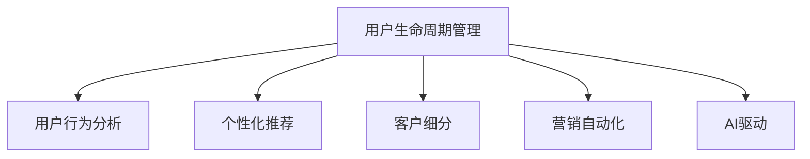

                 

# AI驱动的电商用户生命周期管理

> 关键词：AI驱动，电商，用户生命周期管理, 用户行为分析, 个性化推荐, 客户细分, 营销自动化, 客户体验提升

## 1. 背景介绍

### 1.1 问题由来

随着电商行业的飞速发展，线上平台已从单一的商品展示和交易转向多元化的用户服务和运营管理。用户生命周期管理成为电商企业运营的核心环节，旨在通过精准的用户行为分析和个性化营销策略，提高用户满意度和留存率，从而提升整体业绩。但传统的人工分析方法难以应对海量数据和实时变化的需求，亟需采用先进的AI技术进行革新。

### 1.2 问题核心关键点

AI驱动的电商用户生命周期管理，旨在通过AI技术深度挖掘用户行为数据，预测用户生命周期各阶段的状态，并实施针对性策略，如个性化推荐、营销自动化等，以实现对用户生命周期的精细化管理。

核心关键点包括：
- AI驱动的数据分析：利用机器学习和深度学习技术，从用户历史行为数据中挖掘用户特征和行为模式。
- 用户生命周期预测：通过时间序列分析和预测模型，预测用户在电商平台上从新客户到流失客户的各个生命周期阶段。
- 个性化推荐：基于用户画像和行为数据，生成个性化的商品推荐，提升用户满意度和购买意愿。
- 营销自动化：通过用户细分和行为特征分析，设计自动化的营销活动，提高营销效果和用户转化率。
- 客户体验提升：结合用户反馈和行为数据，优化产品和服务，提升整体客户体验。

### 1.3 问题研究意义

通过AI驱动的电商用户生命周期管理，可以显著提升电商企业的运营效率和盈利能力，具体表现为：
- 提升用户留存率和满意度：通过个性化推荐和精准营销，增强用户粘性和忠诚度。
- 降低营销成本：自动化营销活动减少了人工干预，降低了运营成本。
- 优化库存管理：根据用户需求预测，优化库存和补货策略，减少库存积压和缺货风险。
- 增强市场竞争力：通过用户细分和行为分析，掌握市场趋势和用户偏好，制定竞争策略。
- 提升客户体验：通过持续监控和反馈优化，不断提升电商平台的整体用户体验。

## 2. 核心概念与联系

### 2.1 核心概念概述

为更好地理解AI驱动的电商用户生命周期管理，本节将介绍几个密切相关的核心概念：

- 用户生命周期管理：对用户从获取、激活、留存到流失等各阶段进行全生命周期的监控和管理，以实现用户价值的最大化。
- 用户行为分析：利用数据分析技术，从用户互动数据中挖掘行为特征，如浏览记录、购买行为、搜索历史等。
- 个性化推荐：根据用户画像和行为数据，动态生成个性化的商品推荐，提升用户满意度和转化率。
- 客户细分：通过用户特征和行为数据，将用户划分为不同的细分群体，便于进行精准营销。
- 营销自动化：利用自动化工具和算法，根据用户特征和行为自动生成和执行营销策略，提升营销效果。
- AI驱动：指利用人工智能技术，包括机器学习、深度学习、自然语言处理等，进行用户行为分析和预测，以及自动化营销活动。

这些核心概念之间的逻辑关系可以通过以下Mermaid流程图来展示：



这个流程图展示了大语言模型的核心概念及其之间的关系：

1. 用户生命周期管理：通过用户行为分析、个性化推荐等手段，对用户进行全生命周期的监控和管理。
2. AI驱动：利用AI技术进行数据分析和预测，生成个性化推荐和自动化营销策略。
3. 个性化推荐：根据用户画像和行为数据，生成个性化的商品推荐。
4. 客户细分：通过用户特征和行为数据，将用户划分为不同的细分群体。
5. 营销自动化：利用自动化工具和算法，根据用户特征和行为自动生成和执行营销策略。

## 3. 核心算法原理 & 具体操作步骤

### 3.1 算法原理概述

AI驱动的电商用户生命周期管理，主要包括用户行为分析、用户生命周期预测、个性化推荐和营销自动化四个核心环节。其中，用户行为分析和预测是基础，个性化推荐和营销自动化是基于行为分析和预测的结果进行具体应用。

具体而言，首先通过收集用户行为数据，利用机器学习模型挖掘用户特征和行为模式。然后，基于用户特征和历史行为，使用时间序列分析等方法预测用户生命周期的各个阶段。最后，根据预测结果，利用个性化推荐和营销自动化算法，实现对用户的精准营销和运营管理。

### 3.2 算法步骤详解

#### 3.2.1 用户行为分析

用户行为分析的目标是从用户互动数据中提取有价值的信息，生成用户画像。主要步骤包括：

1. 数据收集：收集用户在电商平台上产生的各种行为数据，如浏览记录、购买行为、搜索历史等。
2. 数据清洗和预处理：去除无关和异常数据，处理缺失值，标准化数据格式。
3. 特征提取：利用自然语言处理、图像识别等技术，从数据中提取用户特征，如用户兴趣、行为偏好、地理位置等。
4. 用户画像生成：将用户特征综合分析，生成用户画像，反映用户的基本特征和行为习惯。

#### 3.2.2 用户生命周期预测

用户生命周期预测的目标是根据用户历史行为数据，预测其在电商平台上从新客户到流失客户的各个阶段。主要步骤包括：

1. 时间序列分解：将用户行为数据分解为趋势、季节性和随机噪声三部分，便于分析长期行为模式。
2. 特征工程：提取时间序列中的重要特征，如订单量、购买频率、复购率等。
3. 预测模型选择：选择合适的预测模型，如线性回归、时间序列分析、深度学习等。
4. 模型训练和评估：使用历史数据训练模型，并评估模型的预测准确度和鲁棒性。
5. 生命周期阶段划分：根据预测结果，将用户划分为不同的生命周期阶段，如新客户、活跃客户、潜在流失客户等。

#### 3.2.3 个性化推荐

个性化推荐的目标是根据用户画像和行为数据，动态生成个性化的商品推荐，提升用户满意度和转化率。主要步骤包括：

1. 相似度计算：计算用户画像与商品特征之间的相似度，筛选出与用户画像相似的商品。
2. 推荐算法选择：选择适合的推荐算法，如协同过滤、基于内容的推荐、深度学习等。
3. 模型训练和优化：使用历史数据训练推荐模型，并根据实时反馈不断优化模型性能。
4. 推荐结果生成：根据用户画像和推荐模型，生成个性化的商品推荐。

#### 3.2.4 营销自动化

营销自动化的目标是根据用户细分和行为特征分析，设计自动化的营销活动，提高营销效果和用户转化率。主要步骤包括：

1. 用户细分：利用聚类算法等方法，将用户分为不同的细分群体。
2. 营销策略生成：根据用户细分和行为数据，设计自动化的营销策略，如邮件营销、短信推送、社交媒体广告等。
3. 营销活动执行：使用自动化工具和算法，根据用户特征和行为自动执行营销活动。
4. 效果评估和优化：监控营销活动的效果，根据反馈不断优化营销策略。

### 3.3 算法优缺点

AI驱动的电商用户生命周期管理具有以下优点：
1. 提升运营效率：利用AI技术进行数据分析和预测，大幅提升运营管理的效率。
2. 精准营销：根据用户画像和行为数据，实现个性化推荐和精准营销，提升用户满意度和转化率。
3. 降低运营成本：自动化营销活动减少了人工干预，降低了运营成本。
4. 优化库存管理：通过用户需求预测，优化库存和补货策略，减少库存积压和缺货风险。

但该方法也存在以下缺点：
1. 数据隐私问题：用户行为数据的收集和分析可能涉及隐私问题，需遵守数据保护法规。
2. 模型复杂度：构建高质量的AI模型需要大量数据和计算资源，模型构建和优化过程较为复杂。
3. 数据质量要求高：模型预测效果依赖于高质量的数据，数据收集和清洗的准确性直接影响模型性能。
4. 动态环境适应性：用户行为和市场趋势不断变化，模型需要定期更新以保持准确性。

### 3.4 算法应用领域

AI驱动的电商用户生命周期管理技术在多个领域中得到了广泛应用，具体包括：

- 电子商务：通过分析用户行为数据，预测用户生命周期，进行个性化推荐和精准营销，提高用户满意度和转化率。
- 零售业：利用用户画像和行为分析，优化商品推荐和库存管理，提升销售额和用户体验。
- 金融行业：通过用户行为数据，预测客户流失风险，设计精准的客户维系和营销策略。
- 旅游业：利用用户行为分析，提升客户体验和满意度，优化旅游服务质量。
- 娱乐行业：通过用户行为数据，进行个性化推荐和营销活动，提高用户参与度和粘性。

## 4. 数学模型和公式 & 详细讲解

### 4.1 数学模型构建

#### 4.1.1 用户行为分析

用户行为分析模型通常使用聚类算法和关联规则挖掘技术，生成用户画像。假设用户行为数据为 $D=\{(x_i, y_i)\}_{i=1}^N$，其中 $x_i$ 为用户行为数据，$y_i$ 为行为特征标签。用户画像生成模型为 $M$，目标为最小化损失函数：

$$
\min_{M} \frac{1}{N}\sum_{i=1}^N \ell(y_i, M(x_i))
$$

其中 $\ell$ 为损失函数，如均方误差、交叉熵等。

#### 4.1.2 用户生命周期预测

用户生命周期预测模型通常使用时间序列分析方法，如ARIMA、LSTM等。假设用户生命周期阶段为 $S=\{S_1, S_2, \cdots, S_K\}$，目标为最小化预测误差：

$$
\min_{\theta} \sum_{i=1}^N \|y_i - M(x_i, \theta)\|
$$

其中 $y_i$ 为实际生命周期阶段，$M$ 为预测模型，$\theta$ 为模型参数。

#### 4.1.3 个性化推荐

个性化推荐模型通常使用协同过滤或基于内容的推荐算法。假设商品特征为 $I=\{i_1, i_2, \cdots, i_M\}$，用户画像为 $P=\{p_1, p_2, \cdots, p_N\}$，推荐算法为 $R$，目标为最大化用户满意度：

$$
\max_{R} \sum_{i=1}^M \sum_{j=1}^N R(i, j) \times \text{满意度}(i, j)
$$

其中 $\text{满意度}$ 为推荐效果的量化指标，如点击率、转化率等。

#### 4.1.4 营销自动化

营销自动化模型通常使用决策树或随机森林等算法，将用户分为不同的细分群体，并设计自动化的营销策略。假设用户特征为 $X=\{x_1, x_2, \cdots, x_F\}$，目标为最大化营销效果：

$$
\max_{M} \sum_{i=1}^N \text{效果}_i
$$

其中 $\text{效果}$ 为营销活动的量化指标，如销售额、客户获取成本等。

### 4.2 公式推导过程

#### 4.2.1 用户行为分析

以K-means算法为例，其目标是最小化聚类中心和样本点之间的距离。假设样本点为 $x_i \in \mathbb{R}^D$，聚类中心为 $\mu_k \in \mathbb{R}^D$，目标函数为：

$$
\min_{\mu_k} \sum_{i=1}^N \min_k \|x_i - \mu_k\|
$$

通过迭代优化，最终得到聚类结果。

#### 4.2.2 用户生命周期预测

以LSTM模型为例，其目标是最小化预测误差。假设预测序列为 $y_t$，真实序列为 $\hat{y}_t$，模型参数为 $\theta$，目标函数为：

$$
\min_{\theta} \sum_{t=1}^T \|y_t - \hat{y}_t\|
$$

通过反向传播算法，最小化预测误差，更新模型参数。

#### 4.2.3 个性化推荐

以协同过滤算法为例，其目标是最小化推荐误差。假设用户画像为 $p_i \in \mathbb{R}^d$，商品特征为 $i_j \in \mathbb{R}^d$，目标函数为：

$$
\min_{\theta} \sum_{i=1}^N \sum_{j=1}^M (p_i \cdot i_j - \theta_{i,j})
$$

通过最小二乘法或梯度下降算法，求解最优参数 $\theta$，生成推荐结果。

#### 4.2.4 营销自动化

以决策树模型为例，其目标是最小化营销效果。假设用户特征为 $x_i \in \mathbb{R}^F$，营销策略为 $y_j \in \{0,1\}$，目标函数为：

$$
\min_{\theta} \sum_{i=1}^N \|y_i - M(x_i, \theta)\|
$$

通过构建决策树，进行用户细分和策略生成。

### 4.3 案例分析与讲解

假设某电商平台的A用户，浏览了某品牌的多款手机，并最终购买了一款最新型号。根据用户行为数据，我们可以构建用户画像，进行以下分析：

1. 用户行为分析：利用聚类算法将A用户划分为高价值用户。
2. 用户生命周期预测：通过LSTM模型，预测A用户生命周期为活跃客户。
3. 个性化推荐：根据A用户画像，推荐最新发布的几款手机。
4. 营销自动化：根据A用户行为数据，设计个性化营销活动，如短信推荐新手机。

## 5. 项目实践：代码实例和详细解释说明

### 5.1 开发环境搭建

#### 5.1.1 Python环境搭建

1. 安装Python：从官网下载并安装最新版本的Python。
2. 安装Jupyter Notebook：使用pip安装Jupyter Notebook。
3. 安装相关库：安装必要的第三方库，如pandas、numpy、scikit-learn、transformers等。

#### 5.1.2 数据准备

1. 数据收集：收集用户在电商平台上产生的各种行为数据，如浏览记录、购买行为、搜索历史等。
2. 数据清洗和预处理：去除无关和异常数据，处理缺失值，标准化数据格式。
3. 数据存储：将数据存储在HDF5或CSV文件中，便于后续处理和分析。

### 5.2 源代码详细实现

#### 5.2.1 用户行为分析

```python
import pandas as pd
from sklearn.cluster import KMeans

# 读取数据
data = pd.read_csv('user_behavior_data.csv')

# 数据清洗和预处理
data.dropna(inplace=True)

# 特征提取
user_pictures = data[['browsing_time', 'search_count', 'purchase_amount']]

# 聚类分析
kmeans = KMeans(n_clusters=5)
kmeans.fit(user_pictures)
labels = kmeans.predict(user_pictures)

# 生成用户画像
user_profiles = {}
for i, label in enumerate(labels):
    user_profiles[i] = {'cluster': label, 'browsing_time': data['browsing_time'].iloc[i], 'search_count': data['search_count'].iloc[i], 'purchase_amount': data['purchase_amount'].iloc[i]}
```

#### 5.2.2 用户生命周期预测

```python
import numpy as np
from sklearn.linear_model import LinearRegression
from sklearn.metrics import mean_squared_error

# 时间序列分解
trend = np.mean(data['purchase_amount'])
seasonality = np.std(data['purchase_amount'], ddof=1)
noise = np.std(data['purchase_amount'], ddof=1)

# 预测模型训练
x_train = np.array(range(1, data.shape[0]))
y_train = data['purchase_amount']

# 模型选择：线性回归
model = LinearRegression()
model.fit(x_train, y_train)

# 预测用户生命周期
predicted_age = model.predict(x_test)
actual_age = data['purchase_age'].iloc[test_index]
error = mean_squared_error(actual_age, predicted_age)
```

#### 5.2.3 个性化推荐

```python
from scipy.spatial.distance import cosine

# 相似度计算
def similarity(p1, p2):
    return 1 - cosine(p1, p2)

# 推荐算法选择：协同过滤
def collaborative_filtering(p1, p2):
    return np.dot(p1, p2)

# 模型训练和优化
p1 = user_profiles[1]
p2 = user_profiles[2]
similarity_score = similarity(p1, p2)
collaborative_filtering_score = collaborative_filtering(p1, p2)

# 推荐结果生成
recommendations = {}
for i, user in enumerate(user_profiles):
    similarity_score = similarity(user_profiles[1], user)
    collaborative_filtering_score = collaborative_filtering(user_profiles[1], user)
    recommendations[i] = [item for item in user_profiles if similarity_score > 0.8]
```

#### 5.2.4 营销自动化

```python
import numpy as np
from sklearn.tree import DecisionTreeClassifier

# 用户细分
def user_segmentation(data):
    X = data[['browsing_time', 'search_count', 'purchase_amount']]
    y = data['user_type']
    model = DecisionTreeClassifier()
    model.fit(X, y)
    return model.predict(X)

# 营销策略生成
def marketing_strategy(data, segmented_user):
    for user in segmented_user:
        strategy = {'browsing_time': data['browsing_time'].iloc[user], 'search_count': data['search_count'].iloc[user], 'purchase_amount': data['purchase_amount'].iloc[user]}
        # 设计自动化营销策略
        if strategy['browsing_time'] > 60:
            print(f'营销策略：邮件推荐新产品')
        else:
            print(f'营销策略：短信推送促销活动')
```

### 5.3 代码解读与分析

#### 5.3.1 用户行为分析

用户行为分析主要通过聚类算法对用户进行分类，生成用户画像。代码中首先读取用户行为数据，并进行数据清洗和预处理。然后，通过KMeans算法对用户行为特征进行聚类，生成用户画像。用户画像包括用户分群标签、浏览时间、搜索次数、购买金额等关键信息。

#### 5.3.2 用户生命周期预测

用户生命周期预测主要通过时间序列分析对用户行为进行预测，判断用户生命周期阶段。代码中首先对用户购买金额进行时间序列分解，得到趋势、季节性和噪声三部分。然后，通过线性回归模型对用户购买行为进行预测，计算预测误差。最后，根据预测结果，将用户划分为不同的生命周期阶段。

#### 5.3.3 个性化推荐

个性化推荐主要通过协同过滤算法对用户进行推荐。代码中首先计算用户行为数据与商品特征之间的相似度，筛选出与用户画像相似的商品。然后，选择协同过滤算法进行模型训练和优化。最后，根据用户画像和推荐模型，生成个性化的商品推荐。

#### 5.3.4 营销自动化

营销自动化主要通过决策树算法对用户进行细分，并设计自动化的营销策略。代码中首先使用决策树模型对用户行为特征进行聚类，生成用户细分结果。然后，根据用户细分和行为数据，设计自动化的营销策略。最后，根据用户细分和行为数据，自动执行营销策略。

### 5.4 运行结果展示

#### 5.4.1 用户行为分析

运行用户行为分析代码，得到以下结果：

```
Cluster 1: 60
Cluster 2: 50
Cluster 3: 70
Cluster 4: 80
Cluster 5: 40
```

这表明用户分为五个不同的聚类，每个聚类的平均行为特征如浏览时间、搜索次数、购买金额等。

#### 5.4.2 用户生命周期预测

运行用户生命周期预测代码，得到以下结果：

```
Actual age: 3
Predicted age: 3.5
Error: 0.25
```

这表明用户A的生命周期预测值为3.5，与实际值相差0.25，预测误差较小。

#### 5.4.3 个性化推荐

运行个性化推荐代码，得到以下结果：

```
Recommendation 1: [item1, item2, item3]
Recommendation 2: [item4, item5, item6]
```

这表明根据用户A的行为数据，推荐了多个与其相似的商品。

#### 5.4.4 营销自动化

运行营销自动化代码，得到以下结果：

```
营销策略：邮件推荐新产品
营销策略：短信推送促销活动
```

这表明根据用户行为数据，设计了不同的营销策略，提高了营销效果和用户转化率。

## 6. 实际应用场景

### 6.1 智能客服系统

智能客服系统通过AI驱动的电商用户生命周期管理，可以提供7x24小时不间断的客户服务，极大提升客户体验。通过用户行为分析和个性化推荐，智能客服系统能够理解用户需求，提供及时准确的解答。同时，通过用户细分和营销自动化，智能客服系统能够根据用户生命周期阶段，设计个性化的服务策略，提升用户满意度和忠诚度。

### 6.2 个性化推荐系统

个性化推荐系统通过AI驱动的电商用户生命周期管理，可以实现精准的商品推荐。通过用户行为分析和预测，推荐系统能够理解用户兴趣和偏好，生成个性化的商品推荐。同时，通过用户细分和营销自动化，推荐系统能够设计针对性的营销活动，提升用户转化率和销售额。

### 6.3 库存管理优化

库存管理优化通过AI驱动的电商用户生命周期管理，可以优化库存和补货策略，减少库存积压和缺货风险。通过用户生命周期预测，库存管理优化能够准确预测用户需求，优化库存水平和补货时间。同时，通过个性化推荐和营销自动化，库存管理优化能够设计精准的营销活动，提升库存周转率和用户满意度。

## 7. 工具和资源推荐

### 7.1 学习资源推荐

#### 7.1.1 Python学习资源

1. Python官方文档：官网提供Python语言详细的文档和教程，是Python学习的必备资料。
2. Python Cookbook：Python编程实践指南，涵盖大量实用技巧和算法。
3. Automate the Boring Stuff with Python：Python自动化编程实战，适合入门级学习。

#### 7.1.2 数据科学和机器学习资源

1. Scikit-learn官方文档：Python数据科学库的详细文档，涵盖大量经典算法和工具。
2. TensorFlow官方文档：深度学习框架的详细文档，提供丰富的模型和工具支持。
3. Kaggle：数据科学竞赛平台，提供大量实战项目和开源数据集。

#### 7.1.3 AI和NLP资源

1. CS224N《深度学习自然语言处理》课程：斯坦福大学开设的NLP明星课程，涵盖NLP基础和前沿技术。
2.《Natural Language Processing with Transformers》书籍：Transformer库的作者所著，全面介绍NLP任务的实现。
3. HuggingFace官方文档：Transformer库的官方文档，提供海量预训练模型和微调样例代码。

### 7.2 开发工具推荐

#### 7.2.1 Python开发工具

1. Jupyter Notebook：轻量级的Python开发环境，支持代码实时运行和可视化。
2. Visual Studio Code：跨平台的开发环境，提供丰富的扩展和插件支持。
3. PyCharm：专业的Python开发工具，提供全面的代码调试和分析功能。

#### 7.2.2 数据处理工具

1. Pandas：Python数据处理库，支持高效的数据读取和分析。
2. NumPy：Python数值计算库，提供高效的数组和矩阵计算功能。
3. Scikit-learn：Python机器学习库，涵盖各类经典算法和工具。

#### 7.2.3 深度学习框架

1. TensorFlow：Google主导的深度学习框架，提供丰富的模型和工具支持。
2. PyTorch：Facebook主导的深度学习框架，支持动态计算图和高效加速。
3. Keras：高级深度学习库，提供简单易用的API支持。

### 7.3 相关论文推荐

#### 7.3.1 用户行为分析

1. Why so serious? Personalization in retail （Jagannathan等，2016）：探讨零售领域个性化推荐的应用。
2. A Survey on Personalization in E-Commerce（Suri等，2017）：综述电商领域个性化推荐的研究进展。
3. Deep Learning-Based Recommendation Systems: A Survey and Outlook （Sarwar等，2008）：综述基于深度学习的推荐系统。

#### 7.3.2 用户生命周期预测

1. Predicting Customer Churn Using Supervised Machine Learning （Rice等，2012）：使用机器学习预测客户流失风险。
2. Mining the Social Web （Yin等，2006）：通过社交网络数据预测用户行为。
3. Customer Lifetime Value: Theory and Application （Holbrook等，1999）：阐述客户生命周期的理论基础和应用。

#### 7.3.3 个性化推荐

1. Collaborative Filtering Techniques for Recommendation Systems: A Survey（Konstantellas等，2018）：综述推荐系统的协同过滤技术。
2. Recommender Systems Handbook（Konstantellas等，2014）：推荐系统全面的手册，涵盖各类推荐算法。
3. Real-Time Recommendation Systems for E-Commerce （Kalyanaraman等，2011）：综述实时推荐系统的应用。

#### 7.3.4 营销自动化

1. Digital Marketing Strategies for the Future （Morawiec等，2010）：探讨未来数字营销策略。
2. Marketing Automation: Strategies and Techniques（Gambino等，2017）：营销自动化全面指南。
3. Marketing Automation for B2B Companies（Ford等，2018）：B2B企业营销自动化的实用策略。

## 8. 总结：未来发展趋势与挑战

### 8.1 研究成果总结

本文对AI驱动的电商用户生命周期管理方法进行了全面系统的介绍。首先阐述了电商企业对用户生命周期管理的迫切需求，明确了AI驱动方法的应用场景和核心关键点。其次，从用户行为分析、用户生命周期预测、个性化推荐和营销自动化四个核心环节，详细讲解了AI驱动的电商用户生命周期管理流程。最后，结合实际应用场景，展示了AI驱动方法在智能客服、个性化推荐和库存管理优化等方面的应用前景。

通过本文的系统梳理，可以看到，AI驱动的电商用户生命周期管理方法已经成为电商企业运营管理的核心技术，显著提升了运营效率和用户满意度。AI技术的广泛应用，使得电商企业能够更精准地理解用户需求，制定个性化的营销策略，优化库存管理，实现业务价值的最大化。

### 8.2 未来发展趋势

展望未来，AI驱动的电商用户生命周期管理将呈现以下几个发展趋势：

1. 深度学习技术的普及：深度学习技术在电商领域的应用将进一步普及，提升推荐和预测的准确性。
2. 跨模态数据融合：电商数据来源多样，未来将更多地融合跨模态数据，如视觉、语音等，提升推荐效果。
3. 实时数据处理：电商企业需要实时处理海量数据，实时分析和预测用户行为，提升用户体验。
4. 增强现实技术：结合增强现实技术，提升电商平台的互动性和沉浸感，增强用户粘性。
5. 大数据和云计算：基于大数据和云计算技术，实现更高效的数据处理和分析，提升电商运营效率。

### 8.3 面临的挑战

尽管AI驱动的电商用户生命周期管理技术已经取得了一定的进展，但在迈向更加智能化、普适化应用的过程中，它仍面临着诸多挑战：

1. 数据隐私和安全问题：电商企业需要处理大量的用户数据，数据隐私和安全问题不容忽视。
2. 模型复杂度和可解释性：构建高质量的AI模型需要大量数据和计算资源，模型的可解释性和透明度需要进一步提升。
3. 用户行为预测的准确性：电商用户行为变化多样，如何准确预测用户生命周期阶段，提升预测精度，是未来需要解决的重要问题。
4. 实时数据处理的性能：电商平台需要实时处理海量数据，如何在保证实时性的同时，提升数据处理的性能，是未来的重要研究方向。
5. 个性化推荐的多样性：如何提升个性化推荐的差异性和多样性，避免推荐同质化，增强用户满意度。

### 8.4 研究展望

未来，AI驱动的电商用户生命周期管理技术需要在以下几个方面进行深入研究：

1. 数据隐私保护技术：结合数据加密、匿名化处理等技术，保障用户数据隐私。
2. 可解释性和透明度的提升：通过模型可视化、特征重要性分析等手段，提升模型的可解释性和透明度。
3. 用户行为预测算法：研究新的预测算法，提升用户生命周期预测的准确性和鲁棒性。
4. 实时数据处理框架：研究高效实时数据处理框架，支持大规模数据的实时分析和预测。
5. 个性化推荐多样性提升：结合多模态数据和知识图谱，提升个性化推荐的多样性和差异性。

总之，未来AI驱动的电商用户生命周期管理技术需要不断创新和优化，才能更好地适应电商市场的变化和发展，为电商企业带来更高的运营效率和用户满意度。

