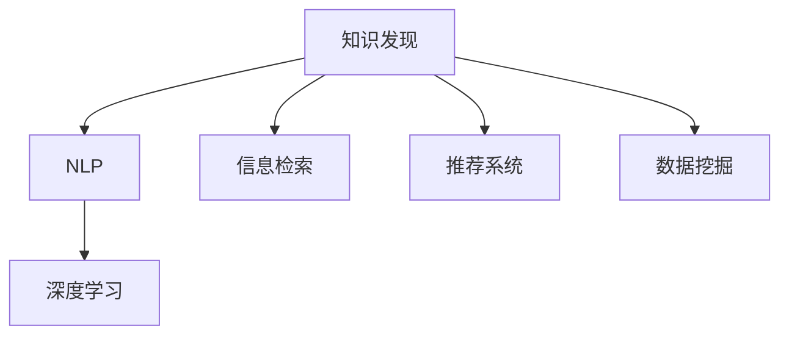

                 

# AI驱动的知识发现：超越简单搜索

> 关键词：知识发现, 自然语言处理(NLP), 深度学习, 信息检索, 推荐系统, 数据挖掘, 智能问答, 语义理解

## 1. 背景介绍

### 1.1 问题由来
在信息爆炸的时代，知识的海量积累和快速获取成为人们日常生活中不可或缺的需求。传统的搜索引擎、知识库和文档管理系统虽然有效，但仍面临着许多局限性：搜索结果的相关性和准确性不足，用户获取信息的过程繁琐且难以个性化。因此，如何从海量数据中快速、准确地发现和提炼知识，成为亟待解决的难题。

近年来，随着人工智能技术的快速发展，特别是深度学习在自然语言处理(NLP)、信息检索、推荐系统等领域的应用，AI驱动的知识发现方法开始崭露头角。这类方法利用机器学习模型，结合大数据技术和先进的算法，能够从文本数据中自动挖掘和提取知识，并提供个性化和精准的信息推荐，突破了传统搜索引擎的瓶颈。

### 1.2 问题核心关键点
本文聚焦于如何利用AI技术，特别是深度学习模型，高效地从文本数据中发现和提炼知识，并通过个性化的推荐系统，提供给用户所需的信息。核心关键点包括：

1. **知识发现的深度和广度**：如何从大规模无结构文本中挖掘出具有实际应用价值的知识，如实体、关系、主题等。
2. **知识提取的精度和召回率**：如何提高知识提取的准确性和全面性，确保用户获取的信息既相关又完整。
3. **个性化推荐**：如何根据用户的行为和偏好，提供定制化的知识推荐，增强用户体验。
4. **系统可扩展性**：如何构建一个高效、可扩展的AI知识发现系统，适应不同规模和复杂度的应用场景。

### 1.3 问题研究意义
研究AI驱动的知识发现方法，对于推动信息社会的知识共享和智慧化进程，具有重要意义：

1. **提升信息检索效率**：通过深度学习模型的知识发现能力，提供更相关、更精准的搜索结果，节省用户搜索时间。
2. **促进知识共享**：利用AI技术自动提炼和推荐知识，打破信息孤岛，促进跨领域的知识交流。
3. **驱动个性化服务**：通过分析用户行为和偏好，提供定制化的知识推荐，满足用户个性化需求，提升用户体验。
4. **加速知识创新**：通过大规模数据上的知识发现和提取，加速科学研究和技术创新的步伐，推动社会进步。

## 2. 核心概念与联系

### 2.1 核心概念概述

为更好地理解AI驱动的知识发现方法，本节将介绍几个密切相关的核心概念：

- **知识发现(Knowledge Discovery)**：从大规模数据中自动识别、发现和提炼出隐含的知识、模式和关系。
- **自然语言处理(NLP)**：通过机器学习技术处理和分析自然语言文本，实现信息的自动化理解和生成。
- **深度学习(Deep Learning)**：一种模拟人脑神经网络的学习方式，能够自动学习并抽象出数据中的高级特征。
- **信息检索(Information Retrieval, IR)**：从大量文本数据中检索出与用户查询相关的文档或信息片段。
- **推荐系统(Recommendation System)**：根据用户的历史行为和偏好，提供个性化的信息推荐，提升用户满意度。
- **数据挖掘(Data Mining)**：从数据中自动发现规律和知识，用于商业智能、市场分析等领域。

这些核心概念之间的逻辑关系可以通过以下Mermaid流程图来展示：



这个流程图展示了一体化知识发现系统中的关键组件及其作用：

1. 知识发现作为核心目标，通过NLP和深度学习技术从文本数据中提炼知识。
2. 信息检索用于获取相关文档，推荐系统用于个性化推荐。
3. 数据挖掘为知识发现和推荐系统提供数据支持。

## 3. 核心算法原理 & 具体操作步骤
### 3.1 算法原理概述

AI驱动的知识发现方法，通常基于深度学习模型和NLP技术，通过自动学习从文本数据中提取和理解知识。其核心思想是：将文本数据视为符号和语义的集合，利用深度学习模型进行特征表示和知识抽取，生成结构化或半结构化的知识图谱、关系网络等。

形式化地，假设文本数据集为 $D=\{x_i\}_{i=1}^N$，其中 $x_i$ 为长度为 $l$ 的文本。知识发现的目标是从文本数据中提取有价值的信息，如实体、关系、主题等。常见的知识发现方法包括：

1. **实体识别(Entity Recognition)**：从文本中识别出具体的实体，如人名、地名、组织名等。
2. **关系抽取(Relation Extraction)**：发现文本中实体之间的关系，如主谓宾结构。
3. **主题建模(Thematic Modeling)**：从文本中提取主题或话题，描述文本内容的核心主题。
4. **事件抽取(Event Extraction)**：从文本中识别出事件及其参与者、时间、地点等相关信息。

### 3.2 算法步骤详解

AI驱动的知识发现过程一般包括以下几个关键步骤：

**Step 1: 数据预处理**
- 对原始文本进行清洗，去除噪声和无用信息，如HTML标签、停用词等。
- 进行分词、词性标注、命名实体识别等预处理操作，构建文本的符号和语义表示。

**Step 2: 特征提取**
- 利用NLP技术对文本进行词向量化或子句表示，生成高维特征向量。
- 使用深度学习模型，如BERT、GPT等，进一步学习文本的语义表示，生成更抽象的特征向量。

**Step 3: 知识抽取**
- 根据具体任务，设计知识抽取模型，如实体识别、关系抽取、主题建模等。
- 使用卷积神经网络(CNN)、循环神经网络(RNN)、Transformer等模型，对文本特征进行分类或预测。

**Step 4: 知识融合**
- 将不同模型提取的知识进行融合，构建统一的知识图谱或关系网络。
- 使用图神经网络(GNN)、图注意力网络(GAT)等技术，对知识图谱进行聚合和推理。

**Step 5: 知识应用**
- 将抽取和融合的知识应用于信息检索、推荐系统、问答系统等任务中。
- 利用检索模型和推荐算法，对用户进行个性化推荐，回答用户的问题。

### 3.3 算法优缺点

AI驱动的知识发现方法具有以下优点：
1. 自动化处理大规模文本数据，节省人力和时间成本。
2. 自动学习文本的语义和结构特征，提高知识抽取的准确性。
3. 能够处理多种文本格式和语言，具有通用性和可扩展性。
4. 可以提供个性化的知识推荐和智能问答，提升用户体验。

同时，该方法也存在一定的局限性：
1. 对标注数据和高质量语料依赖较大，难以处理数据稀疏的问题。
2. 深度学习模型需要大量的计算资源，训练和推理过程较慢。
3. 知识抽取的精度和召回率受限于模型复杂度和数据质量。
4. 模型过度依赖数据分布，泛化能力有限。

尽管存在这些局限性，但就目前而言，AI驱动的知识发现方法仍是信息挖掘和个性化服务的重要技术手段。未来相关研究的重点在于如何进一步降低数据依赖，提高模型效率和泛化能力，同时兼顾可解释性和伦理安全性等因素。

### 3.4 算法应用领域

AI驱动的知识发现方法在多个领域已得到广泛应用，具体包括：

- **信息检索**：如搜索引擎、图书馆检索系统等。通过抽取文本中的实体、关系等，构建知识图谱，优化搜索结果。
- **智能问答**：如智能客服、智能助手等。利用知识抽取和推荐系统，回答用户的问题。
- **推荐系统**：如电商推荐、视频推荐等。通过知识抽取和模型融合，提供个性化推荐。
- **智能广告**：通过文本分析和知识发现，提升广告投放的精准度和效果。
- **舆情监测**：如社交媒体情感分析、舆情预警等。通过情感分析和主题建模，监测舆情动态。
- **健康医疗**：如电子病历分析、疾病诊断等。通过知识抽取和融合，辅助医生诊疗决策。

除了上述这些应用领域外，AI驱动的知识发现方法也在更多场景中得到创新性的应用，如金融分析、法律检索、教育推荐等，为各行业的信息处理和智能化提供了新的解决方案。

## 4. 数学模型和公式 & 详细讲解 & 举例说明
### 4.1 数学模型构建

在深度学习框架下，知识发现过程的数学模型可以描述为：

设文本数据集为 $D=\{x_i\}_{i=1}^N$，其中 $x_i$ 为长度为 $l$ 的文本。假设模型 $M_{\theta}$ 为深度学习模型，如BERT，则模型在输入文本 $x_i$ 上的输出表示为 $\hat{y}_i = M_{\theta}(x_i)$。

知识抽取的目标是将 $M_{\theta}(x_i)$ 转换为结构化知识表示，如实体、关系、主题等。设 $y_i$ 为知识表示，可以表示为：

$$
y_i = f(M_{\theta}(x_i))
$$

其中 $f$ 为知识抽取函数。

### 4.2 公式推导过程

以实体识别任务为例，我们推导BERT模型在实体识别中的知识抽取过程。

假设模型 $M_{\theta}$ 为BERT模型，输入文本 $x_i$ 的BERT表示为 $h_i$，实体标签为 $t_i$。则实体识别任务的目标为最大化概率 $P(t_i | h_i)$，即：

$$
P(t_i | h_i) = \frac{e^{z_i(t_i)}}{\sum_{t_j} e^{z_i(t_j)}}
$$

其中 $z_i(t_i)$ 为模型对实体标签 $t_i$ 的得分，可以表示为：

$$
z_i(t_i) = \hat{y}_i^T W t_i + b
$$

其中 $W$ 为线性变换矩阵，$b$ 为偏置向量。

在训练过程中，我们最小化交叉熵损失函数：

$$
\mathcal{L}(\theta) = -\frac{1}{N} \sum_{i=1}^N \sum_{t_j} t_j \log P(t_j | h_i)
$$

通过反向传播更新模型参数 $\theta$，使得模型能够准确地预测实体标签 $t_i$。

### 4.3 案例分析与讲解

以Google Scholar为例，其使用BERT模型进行知识发现，从科研论文中自动抽取作者、关键词、引用关系等知识。具体流程如下：

1. 对每篇论文进行预处理，包括分词、词性标注、命名实体识别等操作。
2. 使用BERT模型将论文文本转换为向量表示。
3. 设计实体识别模型，利用BERT输出向量作为输入，训练分类器识别作者、关键词等实体。
4. 使用图神经网络对实体关系进行建模，发现论文之间的引用关系。
5. 将抽取的知识整合到知识图谱中，用于信息检索、推荐等任务。

通过这样的流程，Google Scholar能够自动从数百万篇论文中提炼知识，并生成高质量的搜索结果和推荐，极大地提升了学术信息检索的效率和准确性。

## 5. 项目实践：代码实例和详细解释说明
### 5.1 开发环境搭建

在进行知识发现项目开发前，我们需要准备好开发环境。以下是使用Python进行PyTorch开发的环境配置流程：

1. 安装Anaconda：从官网下载并安装Anaconda，用于创建独立的Python环境。

2. 创建并激活虚拟环境：
```bash
conda create -n pytorch-env python=3.8 
conda activate pytorch-env
```

3. 安装PyTorch：根据CUDA版本，从官网获取对应的安装命令。例如：
```bash
conda install pytorch torchvision torchaudio cudatoolkit=11.1 -c pytorch -c conda-forge
```

4. 安装PyTorch-Transformers库：
```bash
pip install torchtransformers
```

5. 安装各类工具包：
```bash
pip install numpy pandas scikit-learn matplotlib tqdm jupyter notebook ipython
```

完成上述步骤后，即可在`pytorch-env`环境中开始知识发现项目的开发。

### 5.2 源代码详细实现

下面我们以命名实体识别(NER)任务为例，给出使用Transformers库对BERT模型进行知识抽取的PyTorch代码实现。

首先，定义NER任务的数据处理函数：

```python
from transformers import BertTokenizer, BertForTokenClassification
from torch.utils.data import Dataset
import torch

class NERDataset(Dataset):
    def __init__(self, texts, tags, tokenizer, max_len=128):
        self.texts = texts
        self.tags = tags
        self.tokenizer = tokenizer
        self.max_len = max_len
        
    def __len__(self):
        return len(self.texts)
    
    def __getitem__(self, item):
        text = self.texts[item]
        tags = self.tags[item]
        
        encoding = self.tokenizer(text, return_tensors='pt', max_length=self.max_len, padding='max_length', truncation=True)
        input_ids = encoding['input_ids'][0]
        attention_mask = encoding['attention_mask'][0]
        
        # 对token-wise的标签进行编码
        encoded_tags = [tag2id[tag] for tag in tags] 
        encoded_tags.extend([tag2id['O']] * (self.max_len - len(encoded_tags)))
        labels = torch.tensor(encoded_tags, dtype=torch.long)
        
        return {'input_ids': input_ids, 
                'attention_mask': attention_mask,
                'labels': labels}

# 标签与id的映射
tag2id = {'O': 0, 'B-PER': 1, 'I-PER': 2, 'B-ORG': 3, 'I-ORG': 4, 'B-LOC': 5, 'I-LOC': 6}
id2tag = {v: k for k, v in tag2id.items()}

# 创建dataset
tokenizer = BertTokenizer.from_pretrained('bert-base-cased')

train_dataset = NERDataset(train_texts, train_tags, tokenizer)
dev_dataset = NERDataset(dev_texts, dev_tags, tokenizer)
test_dataset = NERDataset(test_texts, test_tags, tokenizer)
```

然后，定义模型和优化器：

```python
from transformers import BertForTokenClassification, AdamW

model = BertForTokenClassification.from_pretrained('bert-base-cased', num_labels=len(tag2id))

optimizer = AdamW(model.parameters(), lr=2e-5)
```

接着，定义训练和评估函数：

```python
from torch.utils.data import DataLoader
from tqdm import tqdm
from sklearn.metrics import classification_report

device = torch.device('cuda') if torch.cuda.is_available() else torch.device('cpu')
model.to(device)

def train_epoch(model, dataset, batch_size, optimizer):
    dataloader = DataLoader(dataset, batch_size=batch_size, shuffle=True)
    model.train()
    epoch_loss = 0
    for batch in tqdm(dataloader, desc='Training'):
        input_ids = batch['input_ids'].to(device)
        attention_mask = batch['attention_mask'].to(device)
        labels = batch['labels'].to(device)
        model.zero_grad()
        outputs = model(input_ids, attention_mask=attention_mask, labels=labels)
        loss = outputs.loss
        epoch_loss += loss.item()
        loss.backward()
        optimizer.step()
    return epoch_loss / len(dataloader)

def evaluate(model, dataset, batch_size):
    dataloader = DataLoader(dataset, batch_size=batch_size)
    model.eval()
    preds, labels = [], []
    with torch.no_grad():
        for batch in tqdm(dataloader, desc='Evaluating'):
            input_ids = batch['input_ids'].to(device)
            attention_mask = batch['attention_mask'].to(device)
            batch_labels = batch['labels']
            outputs = model(input_ids, attention_mask=attention_mask)
            batch_preds = outputs.logits.argmax(dim=2).to('cpu').tolist()
            batch_labels = batch_labels.to('cpu').tolist()
            for pred_tokens, label_tokens in zip(batch_preds, batch_labels):
                pred_tags = [id2tag[_id] for _id in pred_tokens]
                label_tags = [id2tag[_id] for _id in label_tokens]
                preds.append(pred_tags[:len(label_tags)])
                labels.append(label_tags)
                
    print(classification_report(labels, preds))
```

最后，启动训练流程并在测试集上评估：

```python
epochs = 5
batch_size = 16

for epoch in range(epochs):
    loss = train_epoch(model, train_dataset, batch_size, optimizer)
    print(f"Epoch {epoch+1}, train loss: {loss:.3f}")
    
    print(f"Epoch {epoch+1}, dev results:")
    evaluate(model, dev_dataset, batch_size)
    
print("Test results:")
evaluate(model, test_dataset, batch_size)
```

以上就是使用PyTorch对BERT进行命名实体识别任务知识抽取的完整代码实现。可以看到，得益于Transformers库的强大封装，我们可以用相对简洁的代码完成BERT模型的加载和知识抽取。

### 5.3 代码解读与分析

让我们再详细解读一下关键代码的实现细节：

**NERDataset类**：
- `__init__`方法：初始化文本、标签、分词器等关键组件。
- `__len__`方法：返回数据集的样本数量。
- `__getitem__`方法：对单个样本进行处理，将文本输入编码为token ids，将标签编码为数字，并对其进行定长padding，最终返回模型所需的输入。

**tag2id和id2tag字典**：
- 定义了标签与数字id之间的映射关系，用于将token-wise的预测结果解码回真实的标签。

**训练和评估函数**：
- 使用PyTorch的DataLoader对数据集进行批次化加载，供模型训练和推理使用。
- 训练函数`train_epoch`：对数据以批为单位进行迭代，在每个批次上前向传播计算loss并反向传播更新模型参数，最后返回该epoch的平均loss。
- 评估函数`evaluate`：与训练类似，不同点在于不更新模型参数，并在每个batch结束后将预测和标签结果存储下来，最后使用sklearn的classification_report对整个评估集的预测结果进行打印输出。

**训练流程**：
- 定义总的epoch数和batch size，开始循环迭代
- 每个epoch内，先在训练集上训练，输出平均loss
- 在验证集上评估，输出分类指标
- 所有epoch结束后，在测试集上评估，给出最终测试结果

可以看到，PyTorch配合Transformers库使得BERT知识抽取的代码实现变得简洁高效。开发者可以将更多精力放在数据处理、模型改进等高层逻辑上，而不必过多关注底层的实现细节。

当然，工业级的系统实现还需考虑更多因素，如模型的保存和部署、超参数的自动搜索、更灵活的任务适配层等。但核心的知识抽取范式基本与此类似。

## 6. 实际应用场景
### 6.1 智能客服系统

基于大语言模型知识发现方法，智能客服系统能够实时处理和理解用户的查询，快速响应用户需求。具体而言，系统可以自动从历史客服对话中抽取常见问题和最佳答复，构建知识库。当用户提出新的查询时，系统能够从知识库中匹配最相关的信息，并给出最佳答复。

在技术实现上，可以收集企业内部的历史客服对话记录，将问题和最佳答复构建成监督数据，在此基础上对预训练模型进行知识抽取。抽取后的知识可以动态更新，形成实时可用的知识库。对于用户提出的新问题，系统还可以接入检索系统实时搜索相关内容，动态生成回复。如此构建的智能客服系统，能够大幅提升客户咨询体验和问题解决效率。

### 6.2 金融舆情监测

金融机构需要实时监测市场舆论动向，以便及时应对负面信息传播，规避金融风险。传统的人工监测方式成本高、效率低，难以应对网络时代海量信息爆发的挑战。基于大语言模型知识发现方法，金融舆情监测系统能够自动从社交媒体、新闻报道等数据中提取舆情信息，进行情感分析，及时预警市场动态。

具体而言，可以收集金融领域相关的新闻、报道、评论等文本数据，并对其进行主题标注和情感标注。在此基础上对预训练语言模型进行知识抽取，使其能够自动判断文本属于何种主题，情感倾向是正面、中性还是负面。将抽取后的知识应用于实时抓取的网络文本数据，就能够自动监测不同主题下的情感变化趋势，一旦发现负面信息激增等异常情况，系统便会自动预警，帮助金融机构快速应对潜在风险。

### 6.3 个性化推荐系统

当前的推荐系统往往只依赖用户的历史行为数据进行物品推荐，无法深入理解用户的真实兴趣偏好。基于大语言模型知识发现方法，个性化推荐系统可以更好地挖掘用户行为背后的语义信息，从而提供更精准、多样的推荐内容。

在实践中，可以收集用户浏览、点击、评论、分享等行为数据，提取和用户交互的物品标题、描述、标签等文本内容。将文本内容作为模型输入，用户的后续行为（如是否点击、购买等）作为监督信号，在此基础上微调预训练语言模型。抽取后的知识可以动态更新，形成实时可用的知识库。对于用户提出的新问题，系统还可以接入检索系统实时搜索相关内容，动态生成回复。

### 6.4 未来应用展望

随着大语言模型知识发现方法的发展，基于知识发现的应用场景将不断拓展，为各行各业带来变革性影响。

在智慧医疗领域，基于知识发现医疗问答、病历分析、药物研发等应用将提升医疗服务的智能化水平，辅助医生诊疗，加速新药开发进程。

在智能教育领域，知识发现技术可应用于作业批改、学情分析、知识推荐等方面，因材施教，促进教育公平，提高教学质量。

在智慧城市治理中，知识发现模型可应用于城市事件监测、舆情分析、应急指挥等环节，提高城市管理的自动化和智能化水平，构建更安全、高效的未来城市。

此外，在企业生产、社会治理、文娱传媒等众多领域，基于知识发现的人工智能应用也将不断涌现，为经济社会发展注入新的动力。相信随着技术的日益成熟，知识发现方法将成为人工智能落地应用的重要范式，推动人工智能技术在更多场景中发挥作用。

## 7. 工具和资源推荐
### 7.1 学习资源推荐

为了帮助开发者系统掌握大语言模型知识发现理论基础和实践技巧，这里推荐一些优质的学习资源：

1. 《Transformer从原理到实践》系列博文：由大模型技术专家撰写，深入浅出地介绍了Transformer原理、BERT模型、知识发现技术等前沿话题。

2. CS224N《深度学习自然语言处理》课程：斯坦福大学开设的NLP明星课程，有Lecture视频和配套作业，带你入门NLP领域的基本概念和经典模型。

3. 《Natural Language Processing with Transformers》书籍：Transformers库的作者所著，全面介绍了如何使用Transformers库进行NLP任务开发，包括知识发现在内的诸多范式。

4. HuggingFace官方文档：Transformers库的官方文档，提供了海量预训练模型和完整的知识发现样例代码，是上手实践的必备资料。

5. CLUE开源项目：中文语言理解测评基准，涵盖大量不同类型的中文NLP数据集，并提供了基于知识发现的baseline模型，助力中文NLP技术发展。

通过对这些资源的学习实践，相信你一定能够快速掌握大语言模型知识发现的精髓，并用于解决实际的NLP问题。
###  7.2 开发工具推荐

高效的开发离不开优秀的工具支持。以下是几款用于大语言模型知识发现开发的常用工具：

1. PyTorch：基于Python的开源深度学习框架，灵活动态的计算图，适合快速迭代研究。大部分预训练语言模型都有PyTorch版本的实现。

2. TensorFlow：由Google主导开发的开源深度学习框架，生产部署方便，适合大规模工程应用。同样有丰富的预训练语言模型资源。

3. Transformers库：HuggingFace开发的NLP工具库，集成了众多SOTA语言模型，支持PyTorch和TensorFlow，是进行知识发现任务开发的利器。

4. Weights & Biases：模型训练的实验跟踪工具，可以记录和可视化模型训练过程中的各项指标，方便对比和调优。与主流深度学习框架无缝集成。

5. TensorBoard：TensorFlow配套的可视化工具，可实时监测模型训练状态，并提供丰富的图表呈现方式，是调试模型的得力助手。

6. Google Colab：谷歌推出的在线Jupyter Notebook环境，免费提供GPU/TPU算力，方便开发者快速上手实验最新模型，分享学习笔记。

合理利用这些工具，可以显著提升大语言模型知识发现的开发效率，加快创新迭代的步伐。

### 7.3 相关论文推荐

大语言模型和知识发现技术的发展源于学界的持续研究。以下是几篇奠基性的相关论文，推荐阅读：

1. Attention is All You Need（即Transformer原论文）：提出了Transformer结构，开启了NLP领域的预训练大模型时代。

2. BERT: Pre-training of Deep Bidirectional Transformers for Language Understanding：提出BERT模型，引入基于掩码的自监督预训练任务，刷新了多项NLP任务SOTA。

3. Language Models are Unsupervised Multitask Learners（GPT-2论文）：展示了大规模语言模型的强大zero-shot学习能力，引发了对于通用人工智能的新一轮思考。

4. Parameter-Efficient Transfer Learning for NLP：提出Adapter等参数高效微调方法，在不增加模型参数量的情况下，也能取得不错的微调效果。

5. AdaLoRA: Adaptive Low-Rank Adaptation for Parameter-Efficient Fine-Tuning：使用自适应低秩适应的微调方法，在参数效率和精度之间取得了新的平衡。

这些论文代表了大语言模型知识发现技术的发展脉络。通过学习这些前沿成果，可以帮助研究者把握学科前进方向，激发更多的创新灵感。

## 8. 总结：未来发展趋势与挑战

### 8.1 总结

本文对基于深度学习模型的大语言模型知识发现方法进行了全面系统的介绍。首先阐述了知识发现和人工智能技术结合的背景和意义，明确了知识发现方法在提高信息检索效率、促进知识共享、驱动个性化服务等方面的独特价值。其次，从原理到实践，详细讲解了知识发现的过程、关键步骤和关键技术，给出了知识发现任务开发的完整代码实例。同时，本文还广泛探讨了知识发现方法在智能客服、金融舆情、个性化推荐等多个行业领域的应用前景，展示了知识发现范式的巨大潜力。此外，本文精选了知识发现技术的各类学习资源，力求为读者提供全方位的技术指引。

通过本文的系统梳理，可以看到，基于大语言模型的知识发现方法正在成为信息挖掘和个性化服务的重要技术手段，极大地拓展了人工智能技术的应用边界，催生了更多的落地场景。受益于深度学习模型的强大能力，知识发现方法能够从文本数据中自动提炼和生成知识，提高信息检索的精度和效率，提升用户体验。未来，伴随预训练语言模型和知识发现方法的持续演进，相信人工智能技术在信息处理和智能化方面的能力将进一步增强，为各行各业带来更多的变革。

### 8.2 未来发展趋势

展望未来，大语言模型知识发现技术将呈现以下几个发展趋势：

1. **知识发现深度化**：随着预训练语言模型的不断发展，知识抽取和推理的深度和广度将不断提升，能够从更丰富的文本数据中发现更深层次的知识和模式。

2. **跨领域知识整合**：知识发现将跨越领域界限，实现不同领域知识的协同建模。通过多模态信息融合，知识发现系统将具备更加全面和精准的信息提取能力。

3. **知识图谱构建**：知识发现技术将更加注重构建统一的知识图谱，支持多领域、多粒度的知识整合和推理。图神经网络等技术将在此基础上发挥重要作用。

4. **实时知识更新**：知识发现系统将具备动态更新和自适应能力，能够实时获取新数据，及时更新知识库，确保知识的时效性和相关性。

5. **自动化知识工程**：知识发现技术将与自然语言处理、数据挖掘等技术结合，实现自动化知识工程的流程，提升知识抽取和推理的自动化程度。

6. **融合伦理和社会责任**：知识发现技术将更加注重伦理和社会责任，避免有害信息的传播，确保输出的合法合规。

以上趋势凸显了大语言模型知识发现技术的广阔前景。这些方向的探索发展，必将进一步提升人工智能技术在信息处理和智能化方面的能力，为构建智能社会奠定基础。

### 8.3 面临的挑战

尽管大语言模型知识发现技术已经取得了瞩目成就，但在迈向更加智能化、普适化应用的过程中，它仍面临着诸多挑战：

1. **数据依赖性**：知识发现方法依赖高质量标注数据和语料，数据获取和标注成本较高，难以覆盖所有应用场景。

2. **模型复杂度**：深度学习模型通常具有高复杂度，训练和推理资源需求大，需要高性能计算设备和算法优化。

3. **泛化能力**：知识发现模型面临域外数据的泛化能力不足，容易在特定领域或数据分布上表现不佳。

4. **知识解释性**：深度学习模型通常缺乏可解释性，难以对其推理逻辑进行解释和调试。

5. **伦理和安全**：知识发现技术可能引入有偏见、有害的信息，需要系统性地设计和评估模型的伦理和安全性能。

6. **跨领域知识融合**：不同领域的知识抽取和融合技术具有差异性，需要多学科协同攻关。

尽管存在这些挑战，但学界和产业界正在积极探索和解决这些问题。通过结合预训练语言模型、多模态融合、伦理引导等技术手段，相信知识发现技术将进一步提升其在各领域的应用效果和可信度。

### 8.4 研究展望

未来，大语言模型知识发现技术的研究方向主要集中在以下几个方面：

1. **参数高效知识发现**：开发更高效的知识抽取和推理方法，降低对模型参数的依赖，提高知识发现的可扩展性和实时性。

2. **多模态知识融合**：结合视觉、语音、文本等多种模态的信息，构建更全面和精准的知识发现系统。

3. **伦理和责任框架**：建立知识发现技术的伦理和责任框架，确保其输出的合法合规，避免有害信息的传播。

4. **自动化知识工程**：通过自动化知识工程方法，提高知识抽取和推理的自动化程度，提升知识发现系统的可维护性和可扩展性。

5. **融合社交媒体数据**：利用社交媒体数据进行情感分析和舆情监测，构建动态知识发现系统，提升信息处理的实时性和精准性。

6. **数据隐私和安全**：在知识发现过程中，保护用户隐私和数据安全，确保知识提取过程的透明和可信。

通过在这些方向上的持续研究和创新，大语言模型知识发现技术必将进一步提升其在各领域的应用效果和可信度，为构建智能社会提供更多有力的技术支持。

