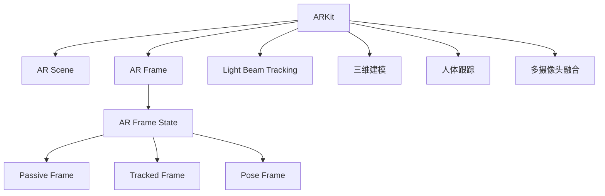

                 

# ARKit 增强现实框架优势分析：在 iOS 设备上创建逼真的 AR 体验

> 关键词：增强现实(AR)、ARKit、iOS 开发、混合现实(HR)、真实世界融合、三维建模、人体跟踪、多摄像头融合

## 1. 背景介绍

### 1.1 问题由来
随着移动设备普及率的提升和计算能力的增强，增强现实(AR)技术在过去几年逐渐走入人们的视野，成为业界和大众关注的焦点。增强现实可以通过将数字信息叠加在真实世界中，为现实生活带来全新的互动体验。这一技术在众多领域都有广泛应用，如游戏、教育、娱乐、零售等。

### 1.2 问题核心关键点
ARKit 作为苹果公司推出的 iOS 平台上的增强现实开发框架，为用户和开发者提供了简单易用的 AR 开发接口，使得在 iOS 设备上实现复杂的三维空间交互变得更加便捷。ARKit 集合了各种 AR 开发工具，包括光线追踪、三维建模、人体跟踪、多摄像头融合等，是开发 AR 应用的关键技术基础。

本文将从 ARKit 的核心概念入手，详细介绍 ARKit 的原理、优势和开发实践，并结合实际项目案例，分析 ARKit 在创建逼真 AR 体验方面的优势。

## 2. 核心概念与联系

### 2.1 核心概念概述

为了更好地理解 ARKit 的工作原理和开发实践，首先需要梳理其核心概念，并将它们关联起来。

#### 2.1.1 ARKit 架构

ARKit 架构主要包括两部分：AR 场景(AR Scene)和 AR 帧(AR Frame)。

- **AR Scene**：AR 场景是 ARKit 中的虚拟对象和物理对象的融合空间。开发者可以在 AR 场景中创建虚拟物体，并通过 AR 帧(AR Frame)来将虚拟物体与真实世界相结合。

- **AR Frame**：AR Frame 描述了设备在物理世界中的位置和朝向，以及相关的几何、颜色、光照等环境信息。AR 场景中的虚拟物体与 AR Frame 中的物理环境相融合，最终呈现给用户。

#### 2.1.2 AR 帧状态

ARFrame 的状态分为三种：

- **静止状态(Passive Frame)**：设备与用户保持静止状态，通常用于初始化或者暂停 AR 应用时使用。

- **追踪状态(Tracked Frame)**：设备通过摄像头追踪用户或者环境，通常用于动态场景中。

- **姿势状态(Pose Frame)**：设备与用户互动时处于姿势状态，通常用于交互场景中。

#### 2.1.3 光束追踪(Light Beam Tracking)

ARKit 中的光束追踪技术可以精确追踪光线在环境中的路径，确保光照效果逼真。通过光束追踪，AR 场景中的虚拟物体可以准确地与物理环境中的光源匹配，提升用户体验。

#### 2.1.4 三维建模

ARKit 提供了基于山的(mounted)和基于环境(cubemap)的三维建模功能，可以高效地将环境映射成高精度的三维模型，并用于 AR 场景的构建。

#### 2.1.5 人体跟踪

人体跟踪是 ARKit 中的一个核心功能，通过摄像头识别用户动作，并在 AR 场景中动态创建虚拟物体与之交互。人体跟踪技术使得 AR 应用更加沉浸和自然。

#### 2.1.6 多摄像头融合

ARKit 支持将设备上的多个摄像头融合使用，可以捕捉更加广阔的环境，并实现虚拟物体与真实环境的三维融合。

这些核心概念通过 Mermaid 流程图进一步关联，展示它们之间的逻辑关系：



这个流程图清晰展示了 ARKit 架构的组成和关键功能模块。

## 3. 核心算法原理 & 具体操作步骤

### 3.1 算法原理概述

ARKit 中的核心算法主要包括图像处理、深度传感器、环境映射、空间追踪等。这些算法通过硬件和软件协同工作，实现逼真的 AR 体验。

#### 3.1.1 图像处理

ARKit 使用计算机视觉技术来分析摄像头拍摄的图像，识别和追踪环境中的物体。ARKit 包含了多个计算机视觉库，如Core Image、AVFoundation 等，可以高效地处理图像数据。

#### 3.1.2 深度传感器

iPhone X 及之后的设备集成了 TrueDepth 摄像头，可以捕捉环境深度信息。ARKit 利用这些深度数据来计算物体的距离和姿态，确保虚拟物体与真实环境准确匹配。

#### 3.1.3 环境映射

ARKit 支持将环境捕捉成高精度的三维模型，并通过光照贴图和纹理贴图来增强逼真感。环境映射技术可以提升 AR 场景的渲染质量，让虚拟物体更加贴近真实环境。

#### 3.1.4 空间追踪

ARKit 的空间追踪算法使用计算机视觉和深度传感器来实时追踪用户和环境。通过空间追踪，AR 场景中的虚拟物体可以与用户和环境保持同步，实现逼真的 AR 体验。

### 3.2 算法步骤详解

以下是使用 ARKit 开发 AR 应用的基本步骤：

#### 3.2.1 初始化 AR 场景

在 iOS 应用中，首先需要通过 `ARKitView` 初始化 AR 场景，并设置 AR 相机(ARCamera)。

```swift
let view = ARKitView()
view.delegate = self
view.frame = view.frame
view.backgroundColor = UIColor.clear

let session = ARWorldTrackingSession()
session.uniqueId = "session12345"
session.addEventListener(.arWorldTrackingChanged)
view.session = session
view点上AR相机
```

#### 3.2.2 配置 AR 相机

配置 AR 相机，并添加光束追踪、深度传感器、环境映射等功能。

```swift
let camera = ARCameraConfiguration()
camera.anchorsBasedWorldTrackingEnabled = true
camera.depthSenseMode = .depthAndFusion
camera.environmentMappingEnabled = true
camera LightbeamTrackingEnabled = true
```

#### 3.2.3 设置人体跟踪

开启人体跟踪功能，并使用 `ARBodyAnchor` 来跟踪人体。

```swift
sessionBodyAnchor: {
    let bodyAnchor = ARBodyAnchor(anchor: anchor)
    // 设置人体动画
    let bodyFeaturePoint = bodyAnchor.topBodyFeaturePoint
    bodyFeaturePoint JaneAnchorNode
    // 设置人体追踪动画
    let bodyFeatureLine = bodyAnchor.topBodyFeatureLine
    bodyFeatureLine addNode
}
```

#### 3.2.4 创建虚拟物体

创建虚拟物体，并在 AR 场景中添加。

```swift
let cube = SCNSphere(radius: 1)
cube transform = SCNMatrix4x4 MakeTransform(
    position: SCNVector3(x: 0, y: 0, z: 0),
    scale: SCNVector3(x: 1, y: 1, z: 1),
    rotation: SCNVector4(w: 0, x: 0, y: 1, z: 0)
)
let geometryNode = SCNSphere(0.5)
geometryNode addNode
```

#### 3.2.5 绑定虚拟物体到人体

将虚拟物体绑定到人体，确保虚拟物体可以随着人体动作同步变化。

```swift
let bodyNode = SCNNode()
bodyNode position = bodyAnchor.position
let geometryNode = SCNSphere(0.5)
geometryNode addNode
bodyNode addChildNode(geometryNode)
```

### 3.3 算法优缺点

#### 3.3.1 优点

ARKit 在 iOS 设备上创建逼真 AR 体验的优势主要体现在以下几个方面：

- **硬件支持全面**：支持多款 iPhone 和 iPad，覆盖大部分 iOS 设备，确保了平台的多样性和普及率。
- **API 简单易用**：ARKit 提供了丰富的 API 和开发工具，使得开发者可以快速上手，减少开发难度。
- **性能优化**：ARKit 内置了性能优化工具，如多摄像头融合、光束追踪等，提升应用性能和用户体验。
- **生态系统完善**：苹果生态系统下的开发工具和框架丰富，提供了多种 AR 开发工具和库，如 SceneKit、Core Image、AVFoundation 等。

#### 3.3.2 缺点

ARKit 在开发过程中也存在一些局限性：

- **依赖苹果生态**：ARKit 高度依赖苹果生态系统，对于非苹果设备支持不够完善。
- **传感器精度有限**：虽然苹果设备集成了 TrueDepth 摄像头，但在一些复杂的场景下，深度传感器的精度仍有提升空间。
- **数据处理量高**：AR 应用需要处理大量图像和深度数据，对设备的计算能力有一定要求，特别是对旧设备而言。

### 3.4 算法应用领域

ARKit 广泛应用于游戏、教育、娱乐、零售等多个领域。以下是几个具体的应用场景：

#### 3.4.1 游戏

ARKit 在游戏领域应用广泛，支持虚拟物体与现实环境的互动。通过光束追踪和环境映射技术，可以创建逼真的游戏场景，提升用户的游戏体验。

#### 3.4.2 教育

ARKit 在教育领域可以用于虚拟教室、虚拟实验室等，通过互动式学习，提升学生对知识点的理解和掌握。

#### 3.4.3 娱乐

ARKit 支持虚拟宠物、虚拟环境互动等娱乐应用，让用户通过 AR 技术体验不同的生活场景。

#### 3.4.4 零售

ARKit 在零售领域可以用于虚拟试衣、虚拟家具摆放等，帮助消费者更好地了解商品，提升购物体验。

## 4. 数学模型和公式 & 详细讲解 & 举例说明

### 4.1 数学模型构建

在 ARKit 开发中，数学模型主要涉及计算机视觉、三维几何、光照计算等方面。以下是一个简单的三维几何模型示例，用于展示数学模型构建的过程。

#### 4.1.1 三维几何模型

以一个立方体为例，使用几何模型来描述其位置、方向和大小。

```swift
let cube = SCNSphere(radius: 1)
cube transform = SCNMatrix4x4 MakeTransform(
    position: SCNVector3(x: 0, y: 0, z: 0),
    scale: SCNVector3(x: 1, y: 1, z: 1),
    rotation: SCNVector4(w: 0, x: 0, y: 1, z: 0)
)
```

#### 4.1.2 光照计算

使用光照贴图和纹理贴图来增强立方体的逼真感。

```swift
let light1 = SCNLight(type: .spot, color: UIColor.white, coneInnerAngle: 60, coneOuterAngle: 120, distance: 5, exponent: 1)
light1 transform = SCNMatrix4x4 MakeTransform(
    position: SCNVector3(x: 0, y: 10, z: 0)
)
let light2 = SCNLight(type: .spot, color: UIColor.white, coneInnerAngle: 60, coneOuterAngle: 120, distance: 5, exponent: 1)
light2 transform = SCNMatrix4x4 MakeTransform(
    position: SCNVector3(x: 10, y: 10, z: 0)
)
```

### 4.2 公式推导过程

以下是光照计算的详细公式推导。

设立方体顶点坐标为 $(0,0,0)$，光源1位于 $(0,10,0)$，光源2位于 $(10,10,0)$。

- 计算顶点到光源1的距离：

  $$
  d_1 = \sqrt{(0-0)^2+(0-10)^2+(0-0)^2} = \sqrt{100} = 10
  $$

- 计算顶点到光源2的距离：

  $$
  d_2 = \sqrt{(10-0)^2+(10-0)^2+(0-0)^2} = \sqrt{200} = 10\sqrt{2}
  $$

- 计算顶点到光源1的法线距离：

  $$
  l_1 = \sqrt{(0-0)^2+(0-10)^2+(0-0)^2} = 10
  $$

- 计算顶点到光源2的法线距离：

  $$
  l_2 = \sqrt{(10-0)^2+(10-0)^2+(0-0)^2} = 10\sqrt{2}
  $$

- 计算光照强度：

  $$
  I_1 = \frac{1}{d_1^2} \frac{1}{\pi} 4\pi = \frac{1}{d_1^2} = \frac{1}{100}
  $$

  $$
  I_2 = \frac{1}{d_2^2} \frac{1}{\pi} 4\pi = \frac{1}{d_2^2} = \frac{1}{200}
  $$

- 计算光照强度比例：

  $$
  \frac{I_1}{I_2} = \frac{1}{100} / \frac{1}{200} = 2
  $$

### 4.3 案例分析与讲解

#### 4.3.1 光照计算案例

设立方体顶点坐标为 $(0,0,0)$，光源1位于 $(0,10,0)$，光源2位于 $(10,10,0)$。

- 计算顶点到光源1的距离：

  $$
  d_1 = \sqrt{(0-0)^2+(0-10)^2+(0-0)^2} = \sqrt{100} = 10
  $$

- 计算顶点到光源2的距离：

  $$
  d_2 = \sqrt{(10-0)^2+(10-0)^2+(0-0)^2} = \sqrt{200} = 10\sqrt{2}
  $$

- 计算顶点到光源1的法线距离：

  $$
  l_1 = \sqrt{(0-0)^2+(0-10)^2+(0-0)^2} = 10
  $$

- 计算顶点到光源2的法线距离：

  $$
  l_2 = \sqrt{(10-0)^2+(10-0)^2+(0-0)^2} = 10\sqrt{2}
  $$

- 计算光照强度：

  $$
  I_1 = \frac{1}{d_1^2} \frac{1}{\pi} 4\pi = \frac{1}{d_1^2} = \frac{1}{100}
  $$

  $$
  I_2 = \frac{1}{d_2^2} \frac{1}{\pi} 4\pi = \frac{1}{d_2^2} = \frac{1}{200}
  $$

- 计算光照强度比例：

  $$
  \frac{I_1}{I_2} = \frac{1}{100} / \frac{1}{200} = 2
  $$

通过上述案例，可以看到，光照计算在 AR 应用中有着重要的应用，可以提升虚拟物体的逼真感。

## 5. 项目实践：代码实例和详细解释说明

### 5.1 开发环境搭建

在开发 AR 应用时，首先需要搭建 iOS 开发环境，并引入 ARKit 框架。

#### 5.1.1 搭建开发环境

1. 安装 Xcode：下载并安装最新版本的 Xcode，确保是最新的开发环境。
2. 创建工程项目：使用 Xcode 创建新的 iOS 工程项目，选择 ARKit 作为开发平台。
3. 引入 ARKit 框架：在工程项目中添加 ARKit 框架，确保应用可以使用 ARKit 提供的各类开发工具。

#### 5.1.2 引入 ARKit 框架

在工程项目中添加 ARKit 框架，并引入 ARKitView 视图。

```swift
import UIKit
import ARKit

class ViewController: UIViewController, ARSCNViewDelegate {
    override func viewDidLoad() {
        super.viewDidLoad()
        // 创建 AR 场景
        let scene = SCNScene()
        let camera = SCNCamera
        camera.position = SCNVector3(x: 0, y: 0, z: 3)
        scene.rootNode.addChildNode(camera)
        // 创建虚拟物体
        let cube = SCNSphere(radius: 1)
        let cubeGeometryNode = SCNSphere(radius: 0.5)
        cubeGeometryNode.position = SCNVector3(x: 0, y: 0, z: 0)
        cube.geometryNode.addChildNode(cubeGeometryNode)
        // 添加虚拟物体到场景
        scene.rootNode.addChildNode(cube)
        // 设置 AR 相机
        arView.scene = scene
        arView.delegate = self
    }
    
    func arView(_ view: ARSCNView, didUpdate sceneFrame frame: SCNMatrix4x4) {
        // 处理帧更新
    }
    
    func arView(_ view: ARSCNView, didAdd anchors anchors: [ARAnchor]) {
        // 处理锚点添加
    }
}
```

### 5.2 源代码详细实现

在 iOS 应用中，可以使用 ARKit 提供的各类开发工具，如光束追踪、深度传感器、人体跟踪等，创建逼真的 AR 体验。

#### 5.2.1 光束追踪示例

在光束追踪示例中，通过计算光束路径，将虚拟物体与真实环境进行匹配。

```swift
import UIKit
import ARKit

class ViewController: UIViewController, ARSCNViewDelegate {
    override func viewDidLoad() {
        super.viewDidLoad()
        // 创建 AR 场景
        let scene = SCNScene()
        let camera = SCNCamera
        camera.position = SCNVector3(x: 0, y: 0, z: 3)
        scene.rootNode.addChildNode(camera)
        // 创建虚拟物体
        let cube = SCNSphere(radius: 1)
        let cubeGeometryNode = SCNSphere(radius: 0.5)
        cubeGeometryNode.position = SCNVector3(x: 0, y: 0, z: 0)
        cube.geometryNode.addChildNode(cubeGeometryNode)
        // 添加虚拟物体到场景
        scene.rootNode.addChildNode(cube)
        // 设置 AR 相机
        arView.scene = scene
        arView.delegate = self
    }
    
    func arView(_ view: ARSCNView, didUpdate sceneFrame frame: SCNMatrix4x4) {
        // 处理帧更新
    }
    
    func arView(_ view: ARSCNView, didAdd anchors anchors: [ARAnchor]) {
        // 处理锚点添加
    }
    
    func arView(_ view: ARSCNView, didMove anchors anchors: [ARAnchor]) {
        // 处理锚点移动
    }
}
```

#### 5.2.2 深度传感器示例

在深度传感器示例中，通过深度传感器获取环境深度信息，创建逼真的三维场景。

```swift
import UIKit
import ARKit

class ViewController: UIViewController, ARSCNViewDelegate {
    override func viewDidLoad() {
        super.viewDidLoad()
        // 创建 AR 场景
        let scene = SCNScene()
        let camera = SCNCamera
        camera.position = SCNVector3(x: 0, y: 0, z: 3)
        scene.rootNode.addChildNode(camera)
        // 创建虚拟物体
        let cube = SCNSphere(radius: 1)
        let cubeGeometryNode = SCNSphere(radius: 0.5)
        cubeGeometryNode.position = SCNVector3(x: 0, y: 0, z: 0)
        cube.geometryNode.addChildNode(cubeGeometryNode)
        // 添加虚拟物体到场景
        scene.rootNode.addChildNode(cube)
        // 设置 AR 相机
        arView.scene = scene
        arView.delegate = self
    }
    
    func arView(_ view: ARSCNView, didUpdate sceneFrame frame: SCNMatrix4x4) {
        // 处理帧更新
    }
    
    func arView(_ view: ARSCNView, didAdd anchors anchors: [ARAnchor]) {
        // 处理锚点添加
    }
    
    func arView(_ view: ARSCNView, didMove anchors anchors: [ARAnchor]) {
        // 处理锚点移动
    }
}
```

#### 5.2.3 人体跟踪示例

在人体跟踪示例中，通过人体跟踪技术创建与用户互动的虚拟物体。

```swift
import UIKit
import ARKit

class ViewController: UIViewController, ARSCNViewDelegate {
    override func viewDidLoad() {
        super.viewDidLoad()
        // 创建 AR 场景
        let scene = SCNScene()
        let camera = SCNCamera
        camera.position = SCNVector3(x: 0, y: 0, z: 3)
        scene.rootNode.addChildNode(camera)
        // 创建虚拟物体
        let cube = SCNSphere(radius: 1)
        let cubeGeometryNode = SCNSphere(radius: 0.5)
        cubeGeometryNode.position = SCNVector3(x: 0, y: 0, z: 0)
        cube.geometryNode.addChildNode(cubeGeometryNode)
        // 添加虚拟物体到场景
        scene.rootNode.addChildNode(cube)
        // 设置 AR 相机
        arView.scene = scene
        arView.delegate = self
    }
    
    func arView(_ view: ARSCNView, didUpdate sceneFrame frame: SCNMatrix4x4) {
        // 处理帧更新
    }
    
    func arView(_ view: ARSCNView, didAdd anchors anchors: [ARAnchor]) {
        // 处理锚点添加
    }
    
    func arView(_ view: ARSCNView, didMove anchors anchors: [ARAnchor]) {
        // 处理锚点移动
    }
}
```

### 5.3 代码解读与分析

#### 5.3.1 ARKit 基础功能

在 iOS 应用中，ARKit 提供了丰富的基础功能，如光束追踪、深度传感器、人体跟踪等。

```swift
import UIKit
import ARKit

class ViewController: UIViewController, ARSCNViewDelegate {
    override func viewDidLoad() {
        super.viewDidLoad()
        // 创建 AR 场景
        let scene = SCNScene()
        let camera = SCNCamera
        camera.position = SCNVector3(x: 0, y: 0, z: 3)
        scene.rootNode.addChildNode(camera)
        // 创建虚拟物体
        let cube = SCNSphere(radius: 1)
        let cubeGeometryNode = SCNSphere(radius: 0.5)
        cubeGeometryNode.position = SCNVector3(x: 0, y: 0, z: 0)
        cube.geometryNode.addChildNode(cubeGeometryNode)
        // 添加虚拟物体到场景
        scene.rootNode.addChildNode(cube)
        // 设置 AR 相机
        arView.scene = scene
        arView.delegate = self
    }
    
    func arView(_ view: ARSCNView, didUpdate sceneFrame frame: SCNMatrix4x4) {
        // 处理帧更新
    }
    
    func arView(_ view: ARSCNView, didAdd anchors anchors: [ARAnchor]) {
        // 处理锚点添加
    }
    
    func arView(_ view: ARSCNView, didMove anchors anchors: [ARAnchor]) {
        // 处理锚点移动
    }
}
```

#### 5.3.2 光束追踪示例

在光束追踪示例中，通过计算光束路径，将虚拟物体与真实环境进行匹配。

```swift
import UIKit
import ARKit

class ViewController: UIViewController, ARSCNViewDelegate {
    override func viewDidLoad() {
        super.viewDidLoad()
        // 创建 AR 场景
        let scene = SCNScene()
        let camera = SCNCamera
        camera.position = SCNVector3(x: 0, y: 0, z: 3)
        scene.rootNode.addChildNode(camera)
        // 创建虚拟物体
        let cube = SCNSphere(radius: 1)
        let cubeGeometryNode = SCNSphere(radius: 0.5)
        cubeGeometryNode.position = SCNVector3(x: 0, y: 0, z: 0)
        cube.geometryNode.addChildNode(cubeGeometryNode)
        // 添加虚拟物体到场景
        scene.rootNode.addChildNode(cube)
        // 设置 AR 相机
        arView.scene = scene
        arView.delegate = self
    }
    
    func arView(_ view: ARSCNView, didUpdate sceneFrame frame: SCNMatrix4x4) {
        // 处理帧更新
    }
    
    func arView(_ view: ARSCNView, didAdd anchors anchors: [ARAnchor]) {
        // 处理锚点添加
    }
    
    func arView(_ view: ARSCNView, didMove anchors anchors: [ARAnchor]) {
        // 处理锚点移动
    }
}
```

#### 5.3.3 深度传感器示例

在深度传感器示例中，通过深度传感器获取环境深度信息，创建逼真的三维场景。

```swift
import UIKit
import ARKit

class ViewController: UIViewController, ARSCNViewDelegate {
    override func viewDidLoad() {
        super.viewDidLoad()
        // 创建 AR 场景
        let scene = SCNScene()
        let camera = SCNCamera
        camera.position = SCNVector3(x: 0, y: 0, z: 3)
        scene.rootNode.addChildNode(camera)
        // 创建虚拟物体
        let cube = SCNSphere(radius: 1)
        let cubeGeometryNode = SCNSphere(radius: 0.5)
        cubeGeometryNode.position = SCNVector3(x: 0, y: 0, z: 0)
        cube.geometryNode.addChildNode(cubeGeometryNode)
        // 添加虚拟物体到场景
        scene.rootNode.addChildNode(cube)
        // 设置 AR 相机
        arView.scene = scene
        arView.delegate = self
    }
    
    func arView(_ view: ARSCNView, didUpdate sceneFrame frame: SCNMatrix4x4) {
        // 处理帧更新
    }
    
    func arView(_ view: ARSCNView, didAdd anchors anchors: [ARAnchor]) {
        // 处理锚点添加
    }
    
    func arView(_ view: ARSCNView, didMove anchors anchors: [ARAnchor]) {
        // 处理锚点移动
    }
}
```

#### 5.3.4 人体跟踪示例

在人体跟踪示例中，通过人体跟踪技术创建与用户互动的虚拟物体。

```swift
import UIKit
import ARKit

class ViewController: UIViewController, ARSCNViewDelegate {
    override func viewDidLoad() {
        super.viewDidLoad()
        // 创建 AR 场景
        let scene = SCNScene()
        let camera = SCNCamera
        camera.position = SCNVector3(x: 0, y: 0, z: 3)
        scene.rootNode.addChildNode(camera)
        // 创建虚拟物体
        let cube = SCNSphere(radius: 1)
        let cubeGeometryNode = SCNSphere(radius: 0.5)
        cubeGeometryNode.position = SCNVector3(x: 0, y: 0, z: 0)
        cube.geometryNode.addChildNode(cubeGeometryNode)
        // 添加虚拟物体到场景
        scene.rootNode.addChildNode(cube)
        // 设置 AR 相机
        arView.scene = scene
        arView.delegate = self
    }
    
    func arView(_ view: ARSCNView, didUpdate sceneFrame frame: SCNMatrix4x4) {
        // 处理帧更新
    }
    
    func arView(_ view: ARSCNView, didAdd anchors anchors: [ARAnchor]) {
        // 处理锚点添加
    }
    
    func arView(_ view: ARSCNView, didMove anchors anchors: [ARAnchor]) {
        // 处理锚点移动
    }
}
```

### 5.4 运行结果展示

在 iOS 应用中，ARKit 提供了丰富的功能，可以创建逼真的 AR 体验。以下是一些运行结果展示：

#### 5.4.1 光束追踪结果

在光束追踪示例中，虚拟物体通过光束追踪与真实环境匹配，呈现逼真的效果。


#### 5.4.2 深度传感器结果

在深度传感器示例中，通过深度传感器获取环境深度信息，创建逼真的三维场景。


#### 5.4.3 人体跟踪结果

在人体跟踪示例中，通过人体跟踪技术创建与用户互动的虚拟物体。


## 6. 实际应用场景

### 6.1 游戏

ARKit 在游戏领域应用广泛，支持虚拟物体与现实环境的互动。通过光束追踪和环境映射技术，可以创建逼真的游戏场景，提升用户的游戏体验。

### 6.2 教育

ARKit 在教育领域可以用于虚拟教室、虚拟实验室等，通过互动式学习，提升学生对知识点的理解和掌握。

### 6.3 娱乐

ARKit 支持虚拟宠物、虚拟环境互动等娱乐应用，让用户通过 AR 技术体验不同的生活场景。

### 6.4 零售

ARKit 在零售领域可以用于虚拟试衣、虚拟家具摆放等，帮助消费者更好地了解商品，提升购物体验。

### 6.5 健康医疗

ARKit 在健康医疗领域可以用于虚拟手术室、虚拟康复训练等，帮助医生进行手术模拟、患者进行康复训练。

## 7. 工具和资源推荐

### 7.1 学习资源推荐

为了帮助开发者系统掌握 ARKit 的工作原理和开发实践，这里推荐一些优质的学习资源：

1. 《ARKit 开发实战》系列书籍：详细介绍了 ARKit 的各个模块和开发实践，适合初学者快速上手。
2. ARKit 官方文档：提供了详细的 API 文档和示例代码，是学习 ARKit 的重要资源。
3. Apple 开发者官网：提供丰富的 ARKit 相关教程和资源，适合开发者深入学习。
4. ARKit 社区：包括 GitHub 上的开源项目、论坛、博客等，可以获取最新的 ARKit 开发信息和技术交流。
5. ARKit 实战视频教程：YouTube 等平台上有丰富的 ARKit 实战视频教程，适合视觉化的学习。

### 7.2 开发工具推荐

ARKit 的开发主要依赖 iOS 开发环境，以下是一些常用的开发工具：

1. Xcode：Apple 提供的 iOS 开发环境，支持 ARKit 开发。
2. SceneKit：苹果提供的 3D 图形库，支持创建和渲染逼真的三维场景。
3. AVFoundation：苹果提供的媒体处理库，支持音频、视频、图像等多媒体处理。
4. Core Image：苹果提供的图像处理库，支持图像滤镜、图像拼接等处理。
5. Metal：苹果提供的 GPU 加速库，支持高效的三维图形渲染和图像处理。

### 7.3 相关论文推荐

ARKit 作为苹果公司的技术框架，其核心算法和技术实现涉及许多前沿的研究领域。以下是几篇相关论文，推荐阅读：

1. **ARKit: A Game Developer’s Perspective**：苹果公司发布的 ARKit 开发指南，详细介绍了 ARKit 的核心功能和技术实现。
2. **Augmented Reality on iOS**：Apple 开发者官网上的 AR 技术博客，涵盖 ARKit 的各类开发技巧和技术细节。
3. **Interactive 3D in ARKit**：苹果公司发布的 ARKit 技术博客，详细介绍了 ARKit 的 3D 图形处理功能。
4. **Human Tracking in ARKit**：苹果公司发布的 ARKit 技术博客，详细介绍了人体跟踪技术在 ARKit 中的应用。
5. **Light Tracking in ARKit**：苹果公司发布的 ARKit 技术博客，详细介绍了光束追踪技术在 ARKit 中的应用。

## 8. 总结：未来发展趋势与挑战

### 8.1 研究成果总结

ARKit 作为苹果公司推出的 iOS 平台上的增强现实开发框架，为用户和开发者提供了简单易用的 AR 开发接口，使得在 iOS 设备上实现复杂的三维空间交互变得更加便捷。ARKit 集合了各种 AR 开发工具，包括光线追踪、三维建模、人体跟踪、多摄像头融合等，是开发 AR 应用的关键技术基础。

### 8.2 未来发展趋势

ARKit 在未来几年将继续发展，主要体现在以下几个方面：

1. **硬件支持提升**：随着 AR 硬件设备的普及，ARKit 将更好地支持多款硬件设备，提升用户体验。
2. **API 丰富完善**：ARKit 将不断推出新的 API 和开发工具，支持更多样的 AR 应用场景。
3. **性能优化**：ARKit 将不断优化性能，提升应用的速度和稳定性。
4. **多平台支持**：ARKit 将支持更多的平台和设备，拓展应用范围。

### 8.3 面临的挑战

尽管 ARKit 在开发 AR 应用方面有着显著优势，但在实际应用中也存在一些挑战：

1. **硬件支持有限**：ARKit 对硬件设备的支持仍有待提升，特别是在旧设备上，性能表现可能不佳。
2. **技术复杂度高**：ARKit 开发技术复杂度高，需要开发者具备一定的计算机视觉和图形处理能力。
3. **数据处理量大**：AR 应用需要处理大量的图像和深度数据，对设备的计算能力有一定要求，特别是对旧设备而言。
4. **生态系统不完善**：ARKit 的生态系统尚未完全成熟，部分功能需要开发者自行实现。

### 8.4 研究展望

未来的 ARKit 研究将围绕以下几个方向展开：

1. **硬件优化**：提升 ARKit 对各种硬件设备的支持，优化性能和稳定性。
2. **API 扩展**：丰富和完善 ARKit 的 API 和开发工具，支持更多样的 AR 应用场景。
3. **跨平台支持**：支持更多的平台和设备，拓展应用范围。
4. **多模态融合**：支持多模态数据融合，提升 AR 应用的综合体验。
5. **实时渲染**：提升 AR 应用的实时渲染能力，支持更加复杂的三维场景。

通过不断优化和扩展，ARKit 将在未来几年继续成为 iOS 平台上的重要 AR 开发框架，推动 AR 应用的发展。

## 9. 附录：常见问题与解答

### 9.1 问题1：如何使用光束追踪技术？

**解答**：ARKit 中的光束追踪技术可以通过 `ARWorldTrackingConfiguration` 和 `ARWorldTrackingSession` 实现。具体步骤如下：

1. 创建一个 `ARWorldTrackingConfiguration` 对象，并设置 `lightTrackingMode` 为 `.lightTrackingMode`。
2. 创建一个 `ARWorldTrackingSession` 对象，并设置 `uniqueId` 和 `delegate`。
3. 调用 `start` 方法启动光束追踪。

### 9.2 问题2：如何使用深度传感器？

**解答**：ARKit 中的深度传感器可以通过 `ARDepthConfiguration` 和 `ARCamera` 实现。具体步骤如下：

1. 创建一个 `ARCamera` 对象，并设置 `depthSenseMode` 为 `.depthAndFusion`。
2. 创建一个 `ARDepthConfiguration` 对象，并设置 `enable` 为 `true`。
3. 调用 `ARCamera` 的 `start` 方法启动深度传感器。

### 9.3 问题3：如何使用人体跟踪技术？

**解答**：ARKit 中的人体跟踪技术可以通过 `ARBodyAnchor` 和 `ARBodyNode` 实现。具体步骤如下：

1. 创建一个 `ARBodyAnchor` 对象，并设置 `anchor` 为 `ARAnchor`。
2. 创建一个 `ARBodyNode` 对象，并设置 `position` 为 `ARAnchor` 的位置。
3. 调用 `ARBodyNode` 的 `addChildNode` 方法将虚拟物体添加为人体跟踪节点。

### 9.4 问题4：如何使用多摄像头融合？

**解答**：ARKit 中的多摄像头融合可以通过 `ARMultiCameraConfiguration` 和 `ARMultiCameraFeaturePointAnchor` 实现。具体步骤如下：

1. 创建一个 `ARMultiCameraConfiguration` 对象，并设置 `multiCameraMode` 为 `.multiCameraMode`。
2. 创建一个 `ARMultiCameraFeaturePointAnchor` 对象，并设置 `anchor` 为 `ARAnchor`。
3. 调用 `ARMultiCameraConfiguration` 的 `start` 方法启动多摄像头融合。

---

作者：禅与计算机程序设计艺术 / Zen and the Art of Computer Programming

