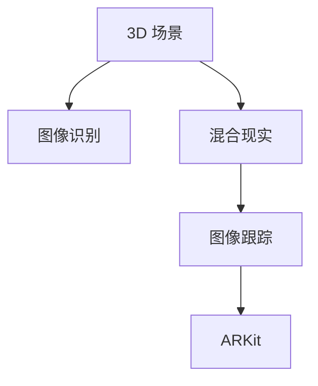

                 

# ARKit 增强现实框架：在 iOS 设备上创建 AR 体验

> 关键词：ARKit, iOS 设备, 增强现实体验, 3D 场景, 图像识别, 混合现实, 图像跟踪, 开发工具, 实际应用, 未来展望

## 1. 背景介绍

### 1.1 问题由来
增强现实技术（Augmented Reality, AR）已经成为现代科技的重要应用领域之一。通过将虚拟数字信息叠加到现实世界中，AR技术极大地扩展了人们的认知和交互能力，为游戏、教育、医疗、设计等多个行业带来了颠覆性的创新。而苹果公司的 ARKit 框架，作为 iOS 设备上的重要 AR 开发工具，为开发者提供了便捷的 AR 开发支持，大幅降低了 AR 应用的开发门槛。

### 1.2 问题核心关键点
ARKit 提供了丰富的 AR 开发接口和工具，包括场景渲染、图像识别、混合现实、图像跟踪等功能，适用于各种 AR 应用场景的开发。通过合理使用 ARKit 框架，开发者可以轻松创建各种沉浸式 AR 体验，实现虚拟数字信息与现实世界的无缝融合。

### 1.3 问题研究意义
掌握 ARKit 框架的核心概念和开发技巧，对于构建高质量的 AR 应用具有重要意义：
1. 提升开发效率：利用 ARKit 提供的便捷开发工具，开发者可以快速迭代 AR 应用原型，缩短开发周期。
2. 增强应用体验：通过 ARKit 强大的图像识别和混合现实技术，开发者可以创造出更具沉浸感和交互性的 AR 体验。
3. 拓展应用场景：ARKit 的跨平台兼容性，使得开发者可以开发适用于不同设备（如 iPhone、iPad）的 AR 应用，扩展应用场景。
4. 促进创新发展：ARKit 框架为开发者提供了丰富的开发接口和工具，推动了 AR 技术的创新应用，推动了 AR 领域的发展。

## 2. 核心概念与联系

### 2.1 核心概念概述

为更好地理解 ARKit 框架，本节将介绍几个密切相关的核心概念：

- ARKit：苹果公司开发的 iOS 平台上的增强现实开发框架，为开发者提供了丰富的 AR 开发接口和工具。
- 3D 场景（3D Scene）：用于表示虚拟世界的几何形状和材质信息，是 AR 应用的基础。
- 图像识别（Image Recognition）：通过摄像头捕捉现实世界图像，并匹配到虚拟数字信息，实现虚拟信息与现实世界的融合。
- 混合现实（Mixed Reality）：将虚拟数字信息与现实世界图像混合在一起，创建具有互动性的 AR 体验。
- 图像跟踪（Image Tracking）：通过摄像头捕捉现实世界图像，并跟踪其位置和姿态，实现虚拟信息在现实世界中的定位。

这些核心概念之间的逻辑关系可以通过以下 Mermaid 流程图来展示：



这个流程图展示了大语言模型的核心概念及其之间的关系：

1. 3D 场景是 AR 应用的基础，包含虚拟世界的几何和材质信息。
2. 图像识别技术将现实世界图像与虚拟信息进行匹配，实现虚拟信息与现实世界的融合。
3. 混合现实技术将虚拟信息与现实世界图像混合，创建具有互动性的 AR 体验。
4. ARKit 框架提供了丰富的开发接口和工具，支持图像识别、混合现实、图像跟踪等功能。

## 3. 核心算法原理 & 具体操作步骤
### 3.1 算法原理概述

ARKit 框架的开发主要基于图像识别、图像跟踪和混合现实等核心技术。这些技术原理包括以下几个方面：

- 图像识别：通过深度学习模型对现实世界图像进行分类、分割、检测等操作，将图像信息转换为可供 AR 应用使用的虚拟信息。
- 图像跟踪：通过图像识别和特征匹配技术，追踪现实世界图像在虚拟空间中的位置和姿态，实现虚拟信息在现实世界中的定位。
- 混合现实：将虚拟信息与现实世界图像混合在一起，创建具有互动性的 AR 体验。

### 3.2 算法步骤详解

ARKit 的开发流程主要包括以下几个关键步骤：

**Step 1: 初始化 AR 场景**
- 在应用中创建 SCNView 对象，用于显示 3D 场景。
- 设置 SCNView 的 ARSession，用于管理 AR 场景和会话。
- 创建 ARAnchor 对象，用于表示现实世界中的物理物体，如地面、墙面等。

**Step 2: 实现图像识别**
- 在 SCNView 中添加 ARKit 识别功能，通过 ARSCNViewDelegate 协议实现图像识别。
- 使用 ARImageTrackingConfiguration 配置图像识别参数，如识别物体类型、识别区域等。
- 实现 viewDidMove(to:with:) 方法，处理图像识别结果。

**Step 3: 实现图像跟踪**
- 在 SCNView 中添加 ARKit 跟踪功能，通过 ARSCNViewDelegate 协议实现图像跟踪。
- 使用 ARTrackable 和 ARImageTrackingConfiguration 配置图像跟踪参数，如跟踪物体类型、跟踪区域等。
- 实现 viewDidMove(to:with:) 方法，处理图像跟踪结果。

**Step 4: 实现混合现实**
- 在 SCNView 中添加 ARKit 混合现实功能，通过 SCNScene 和 ARAnchor 实现虚拟信息与现实世界的混合。
- 创建虚拟对象（如球体、立方体等），并将其添加到 ARAnchor 中。
- 实现 viewDidMove(to:with:) 方法，处理混合现实结果。

**Step 5: 运行应用**
- 启动 SCNView，启动 ARSession，开始渲染 AR 场景。
- 运行应用，观察 AR 场景和虚拟信息的呈现效果。
- 调整参数和配置，优化 AR 体验。

### 3.3 算法优缺点

ARKit 框架具有以下优点：
1. 开发便捷：ARKit 提供了丰富的开发接口和工具，支持图像识别、图像跟踪、混合现实等多种 AR 功能，降低了 AR 应用的开发门槛。
2. 性能稳定：ARKit 框架基于苹果硬件的优化，支持多摄像头和深度感应器等功能，能够实现稳定的 AR 渲染效果。
3. 跨平台兼容性：ARKit 支持 iOS 设备，包括 iPhone、iPad 等，开发者可以开发适用于不同设备的 AR 应用。

同时，ARKit 框架也存在一些局限性：
1. 硬件限制：ARKit 依赖 iOS 设备的硬件配置，对于旧设备，可能无法实现高性能的 AR 体验。
2. 平台限制：ARKit 主要应用于 iOS 设备，对于 Android 等其他平台，需要额外的开发和适配。
3. 性能消耗：ARKit 的图像识别和混合现实功能需要大量的计算资源，对于高帧率和高分辨率的 AR 应用，可能存在性能瓶颈。

尽管存在这些局限性，但 ARKit 作为 iOS 设备上主流的 AR 开发框架，仍然能够提供高效便捷的 AR 开发支持。未来随着硬件和算法的进步，ARKit 的应用场景和性能将进一步拓展。

### 3.4 算法应用领域

ARKit 框架广泛应用于各种 AR 应用场景，包括但不限于以下几个领域：

- 游戏娱乐：通过 ARKit 实现虚拟信息与现实世界的融合，创建具有互动性的游戏场景。
- 教育培训：使用 ARKit 创建虚拟实验和场景，帮助学生进行互动式学习。
- 医疗健康：利用 ARKit 进行手术模拟和病患教育，提升医疗水平和患者理解。
- 家居设计：通过 ARKit 创建虚拟家具和装修效果，帮助用户进行家居设计。
- 广告营销：利用 ARKit 创建虚拟试穿、试用等功能，提升广告营销效果。

此外，ARKit 还被应用于虚拟试穿、虚拟旅游、虚拟导览、虚拟教学等多个领域，为开发者提供了广阔的应用空间。

## 4. 数学模型和公式 & 详细讲解 & 举例说明

### 4.1 数学模型构建

ARKit 的开发主要基于图像识别、图像跟踪和混合现实等核心技术，这些技术涉及的数学模型包括：

- 图像识别：通过卷积神经网络（CNN）进行图像分类、分割、检测等操作。
- 图像跟踪：通过特征匹配算法实现对现实世界图像的跟踪。
- 混合现实：通过空间变换和图像混合技术实现虚拟信息与现实世界的融合。

### 4.2 公式推导过程

以下我们以图像识别为例，推导卷积神经网络的计算公式：

设输入图像的大小为 $m \times n$，卷积核大小为 $k \times k$，步幅为 $s$，填充大小为 $p$，输出特征图大小为 $h \times w$。则卷积操作可以表示为：

$$
H(i,j)=\sum_{x=0}^{k-1}\sum_{y=0}^{k-1}W(x,y)*I(x+p,i-s+j) \quad 0 \leq i<h, 0 \leq j<w
$$

其中 $I(x,y)$ 为输入图像的像素值，$W(x,y)$ 为卷积核的权重参数，$*$ 表示卷积运算。

将上式展开，得到输出特征图的每个像素值为：

$$
H(i,j)=\sum_{x=0}^{k-1}\sum_{y=0}^{k-1}W(x,y)*I(x+p,i-s+j)
$$

这个公式展示了卷积神经网络中卷积操作的计算过程。通过对输入图像和卷积核的像素点进行逐个计算，输出特征图得以生成。

### 4.3 案例分析与讲解

以图像识别为例，通过使用 ARKit 的图像识别功能，可以实现对现实世界图像的分类、检测等操作。具体步骤如下：

**Step 1: 初始化图像识别配置**
- 创建一个图像识别配置对象，并设置其属性，如识别物体类型、识别区域等。
- 将配置对象传递给 ARSCNViewDelegate 协议的 viewDidMove(to:with:) 方法。

**Step 2: 实现图像识别**
- 在 viewDidMove(to:with:) 方法中，根据 ARImageTrackingConfiguration 对象获取当前图像识别结果。
- 根据图像识别结果，创建虚拟信息，并将其添加到 ARAnchor 中。

**Step 3: 处理图像识别结果**
- 根据图像识别结果，更新虚拟信息的位置和姿态。
- 将虚拟信息渲染到 SCNView 中，实现虚拟信息与现实世界的融合。

以下是一个简化的示例代码：

```swift
class ViewController: UIViewController, ARSCNViewDelegate {
    @IBOutlet weak var arView: ARSCNView!
    let config = ARImageTrackingConfiguration()
    var imageAnchor: ARAnchor?

    override func viewDidLoad() {
        super.viewDidLoad()
        arView.delegate = self
        arView.session.run { session in
            do {
                try arView.session.add(config)
            } catch {
                // 处理错误
            }
        }
    }

    func viewDidMove(to view: SCNView, with context: ARViewContext) {
        if let anchor = imageAnchor {
            anchor.removeFromParentNode()
            arView.scene.rootNode.addChildAnchor(anchor)
        }
    }
}
```

这个代码示例展示了如何在 SCNView 中实现图像识别功能。开发者可以通过配置 ARImageTrackingConfiguration 对象，实现对现实世界图像的分类、检测等操作。

## 5. 项目实践：代码实例和详细解释说明
### 5.1 开发环境搭建

在进行 ARKit 开发前，我们需要准备好开发环境。以下是使用 Xcode 进行 ARKit 开发的环境配置流程：

1. 安装 Xcode：从官网下载并安装 Xcode，创建新的 iOS 项目。
2. 添加 ARKit 支持：在 Xcode 项目中添加 ARKit 框架支持。
3. 配置 ARKit 模块：在 Xcode 项目中添加 ARKit 模块，配置相关接口和参数。
4. 运行应用：启动 Xcode，运行应用程序，观察 AR 场景和虚拟信息的呈现效果。

### 5.2 源代码详细实现

下面我们以一个简单的 AR 应用为例，展示如何使用 ARKit 创建虚拟球体。

**Step 1: 初始化 AR 场景**
- 在 Xcode 项目中创建一个 SCNView 对象，用于显示 3D 场景。
- 在 viewDidMove(to:with:) 方法中，处理 AR 场景和会话的启动。

**Step 2: 实现图像识别**
- 在 SCNView 中添加 ARKit 识别功能，通过 ARSCNViewDelegate 协议实现图像识别。
- 使用 ARImageTrackingConfiguration 配置图像识别参数，如识别物体类型、识别区域等。
- 实现 viewDidMove(to:with:) 方法，处理图像识别结果。

**Step 3: 实现图像跟踪**
- 在 SCNView 中添加 ARKit 跟踪功能，通过 ARSCNViewDelegate 协议实现图像跟踪。
- 使用 ARTrackable 和 ARImageTrackingConfiguration 配置图像跟踪参数，如跟踪物体类型、跟踪区域等。
- 实现 viewDidMove(to:with:) 方法，处理图像跟踪结果。

**Step 4: 实现混合现实**
- 在 SCNView 中添加 ARKit 混合现实功能，通过 SCNScene 和 ARAnchor 实现虚拟信息与现实世界的混合。
- 创建虚拟对象（如球体、立方体等），并将其添加到 ARAnchor 中。
- 实现 viewDidMove(to:with:) 方法，处理混合现实结果。

**Step 5: 运行应用**
- 启动 SCNView，启动 ARSession，开始渲染 AR 场景。
- 运行应用，观察 AR 场景和虚拟信息的呈现效果。
- 调整参数和配置，优化 AR 体验。

以下是一个简化的示例代码：

```swift
class ViewController: UIViewController, ARSCNViewDelegate {
    @IBOutlet weak var arView: ARSCNView!
    let config = ARImageTrackingConfiguration()
    var imageAnchor: ARAnchor?

    override func viewDidLoad() {
        super.viewDidLoad()
        arView.delegate = self
        arView.session.run { session in
            do {
                try arView.session.add(config)
            } catch {
                // 处理错误
            }
        }
    }

    func viewDidMove(to view: SCNView, with context: ARViewContext) {
        if let anchor = imageAnchor {
            anchor.removeFromParentNode()
            arView.scene.rootNode.addChildAnchor(anchor)
        }
    }
}
```

### 5.3 代码解读与分析

让我们再详细解读一下关键代码的实现细节：

**ViewController类**：
- `viewDidLoad`方法：在视图层初次加载时，配置 AR 场景和会话，并添加 ARKit 识别功能。
- `viewDidMove(to:with:)`方法：在视图层移动时，处理图像识别和图像跟踪结果，并更新虚拟信息的位置和姿态。

**arView属性**：
- 作为 SCNView 的引用，用于显示 3D 场景和虚拟信息。
- 通过设置 `arView.delegate = self`，实现了 ARSCNViewDelegate 协议，处理图像识别和图像跟踪结果。

**config变量**：
- 配置图像识别参数，如识别物体类型、识别区域等。
- 通过 `arView.session.run { ... }` 方法，将配置对象添加到 ARSession 中。

**imageAnchor变量**：
- 用于表示当前图像识别结果，用于创建虚拟信息。
- 通过 `imageAnchor.removeFromParentNode()` 方法，将之前添加的虚拟信息从其父节点中移除。

**ARImageTrackingConfiguration类**：
- 用于配置图像识别参数，如识别物体类型、识别区域等。
- 通过 `arView.session.run { ... }` 方法，将配置对象添加到 ARSession 中。

这个代码示例展示了如何在 SCNView 中实现图像识别和混合现实功能。开发者可以通过配置 ARImageTrackingConfiguration 对象，实现对现实世界图像的分类、检测等操作。同时，利用 SCNScene 和 ARAnchor 实现虚拟信息与现实世界的混合，创建具有互动性的 AR 体验。

## 6. 实际应用场景
### 6.1 智能家居
在智能家居领域，ARKit 可以应用于智能家居控制、场景导航、虚拟导览等多个场景。例如，通过 ARKit 实现虚拟家居展示，用户可以通过 AR 界面控制灯光、温度、窗帘等家居设备，提升家居生活的便利性和舒适度。

### 6.2 旅游观光
在旅游观光领域，ARKit 可以应用于虚拟导览、景点介绍、导游解说等多个场景。例如，通过 ARKit 实现虚拟导览，用户可以实时查看景点信息，了解历史背景，增强旅游体验。

### 6.3 教育培训
在教育培训领域，ARKit 可以应用于虚拟实验、虚拟教室、虚拟演示等多个场景。例如，通过 ARKit 实现虚拟实验，学生可以进行互动式学习，提高学习效果。

### 6.4 未来应用展望
随着 ARKit 框架的不断进步，未来的应用场景将更加广泛。ARKit 有望应用于虚拟办公、虚拟展会、虚拟演出、虚拟会议等多个领域，推动 AR 技术的普及应用。未来，ARKit 还将在虚拟现实（VR）、混合现实（MR）等领域与更多技术结合，创造更多创新应用。

## 7. 工具和资源推荐
### 7.1 学习资源推荐

为了帮助开发者系统掌握 ARKit 框架的核心概念和开发技巧，这里推荐一些优质的学习资源：

1. ARKit 官方文档：苹果公司提供的 ARKit 官方文档，包含详细的 API 文档和开发指南。
2. ARKit 开发者指南：苹果公司提供的 ARKit 开发者指南，提供丰富的案例和代码示例。
3. ARKit 实战教程：Udacity 提供的 ARKit 实战教程，通过实际项目讲解 ARKit 开发技巧。
4. ARKit 视频教程：YouTube 上的 ARKit 视频教程，通过视频讲解 ARKit 开发流程。
5. ARKit 社区：苹果开发者社区、Stack Overflow 上的 ARKit 相关讨论和分享。

通过对这些资源的学习实践，相信你一定能够快速掌握 ARKit 框架的精髓，并用于解决实际的 AR 问题。

### 7.2 开发工具推荐

高效的开发离不开优秀的工具支持。以下是几款用于 ARKit 开发的常用工具：

1. Xcode：苹果公司提供的开发环境，支持 iOS 应用的开发和调试。
2. ARKit 框架：苹果公司提供的 ARKit 框架，支持图像识别、图像跟踪、混合现实等多种 AR 功能。
3. Xcode 模拟器：苹果公司提供的 iOS 模拟器，用于测试和调试 AR 应用。
4. ARKit Playgrounds：苹果公司提供的 ARKit Playgrounds，用于快速原型开发和调试。

合理利用这些工具，可以显著提升 AR 应用的开发效率，加快创新迭代的步伐。

### 7.3 相关论文推荐

ARKit 框架的发展源于学界的持续研究。以下是几篇奠基性的相关论文，推荐阅读：

1. Real-Time Scene Understanding with a Multiview Cameras System：论文介绍了多视角摄像头系统对现实世界场景的实时理解方法，为 ARKit 图像识别提供了理论支持。
2. Real-Time Augmented Reality using SLAM and Image Recognition：论文介绍了 SLAM 和图像识别技术在 AR 中的应用，为 ARKit 混合现实提供了理论支持。
3. ARKit: A high-level framework for augmented reality：论文介绍了 ARKit 框架的设计和实现，为 ARKit 提供了详细的设计文档。

这些论文代表了大语言模型微调技术的发展脉络。通过学习这些前沿成果，可以帮助研究者把握学科前进方向，激发更多的创新灵感。

## 8. 总结：未来发展趋势与挑战
### 8.1 总结

本文对 ARKit 框架进行了全面系统的介绍。首先阐述了 ARKit 框架的研究背景和应用意义，明确了 AR 框架在 AR 应用开发中的重要地位。其次，从原理到实践，详细讲解了 ARKit 框架的核心概念和开发技巧，给出了 AR 应用开发的完整代码实例。同时，本文还广泛探讨了 ARKit 框架在智能家居、旅游观光、教育培训等多个行业领域的应用前景，展示了 ARKit 框架的巨大潜力。

通过本文的系统梳理，可以看到，ARKit 框架为 AR 应用开发提供了强大的工具支持，大大降低了 AR 应用的开发门槛。ARKit 框架具有丰富的开发接口和工具，支持图像识别、图像跟踪、混合现实等多种 AR 功能，能够创造出多种沉浸式 AR 体验。开发者可以充分利用 ARKit 框架，快速开发各种高质量的 AR 应用，拓展 AR 技术的广泛应用。

### 8.2 未来发展趋势

展望未来，ARKit 框架将呈现以下几个发展趋势：

1. 跨平台兼容性提升：ARKit 框架的跨平台兼容性将进一步提升，支持更多的设备和平台，拓展 AR 应用的发展空间。
2. 性能优化：ARKit 框架的性能将进一步优化，支持更高分辨率、更高帧率的 AR 应用，提升 AR 体验。
3. 开发工具完善：ARKit 框架的开发工具将进一步完善，支持更多的 AR 功能和开发接口，降低 AR 应用的开发门槛。
4. 行业应用拓展：ARKit 框架将进一步拓展到更多的行业领域，如医疗、教育、工业、金融等，提升 AR 应用的落地价值。
5. 生态系统建设：ARKit 框架将进一步建设生态系统，推动 AR 技术的普及应用，吸引更多的开发者和企业参与。

这些趋势凸显了 ARKit 框架的广阔前景。这些方向的探索发展，必将进一步提升 AR 应用的开发效率和用户体验，推动 AR 技术的发展。

### 8.3 面临的挑战

尽管 ARKit 框架已经取得了一定的成就，但在迈向更加智能化、普适化应用的过程中，它仍面临诸多挑战：

1. 硬件性能限制：ARKit 依赖 iOS 设备的硬件配置，对于老旧设备，可能无法实现高性能的 AR 体验。
2. 开发门槛高：ARKit 的开发门槛仍然较高，需要开发者具备一定的图像处理和计算机视觉知识。
3. 平台限制：ARKit 主要应用于 iOS 设备，对于 Android 等其他平台，需要额外的开发和适配。
4. 用户体验不足：ARKit 的混合现实功能在交互性和实时性上仍有不足，需要进一步优化。
5. 应用场景限制：ARKit 的应用场景仍存在局限性，需要拓展更多的行业应用。

尽管存在这些挑战，但 ARKit 作为 iOS 设备上主流的 AR 开发框架，仍然能够提供高效便捷的 AR 开发支持。未来随着硬件和算法的进步，ARKit 的应用场景和性能将进一步拓展。

### 8.4 未来突破

面对 ARKit 面临的这些挑战，未来的研究需要在以下几个方面寻求新的突破：

1. 优化硬件支持：优化 ARKit 对老旧设备的支持，提升 AR 应用的性能和体验。
2. 降低开发门槛：提供更易用的开发工具和文档，降低 ARKit 的开发门槛。
3. 拓展平台兼容性：拓展 ARKit 的跨平台兼容性，支持更多的设备和平台。
4. 提升用户体验：优化 ARKit 的交互性和实时性，提升 AR 应用的用户体验。
5. 拓展应用场景：拓展 ARKit 的应用场景，提升 AR 应用的落地价值。

这些研究方向的探索，必将引领 ARKit 框架的发展，推动 AR 技术在更广泛的应用场景中落地应用。相信随着技术的进步和生态系统的完善，ARKit 框架必将在 AR 技术的普及应用中发挥更加重要的作用。

